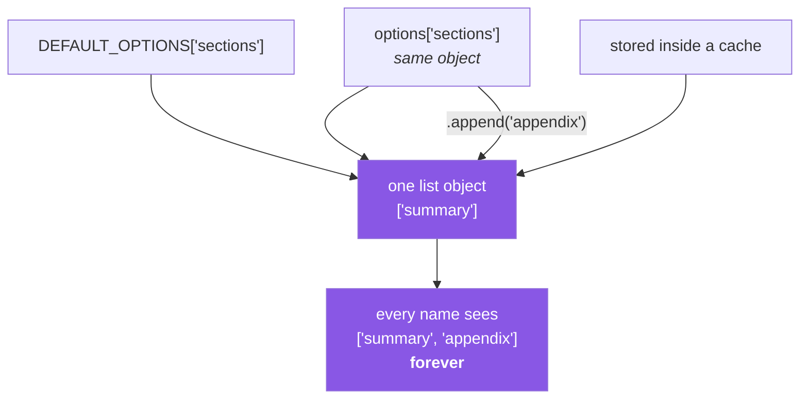

# 2.3 — Aliasing — two names, one object

## One-line answer

**Aliasing** is when two or more names refer to the same mutable object, so a change made through any
one of them is visible through all of them — and it is not an exotic situation, it is what happens by
default every time you assign, pass an argument, or put an object into a container.

---

## The story

Back to the fridge, and to a habit that a lot of households actually have.

Pinned to the fridge is the **standard list** — the things this house always buys. Rice, oil, tea,
onions. The idea is that whoever goes shopping starts from it.

The first week works. Somebody takes the sheet off the fridge, walks to the shop, and adds *birthday
cake* to the bottom because it is somebody's birthday. They come home and pin the sheet back up.

The second week, somebody takes the standard list and there is a birthday cake on it. They buy one.
Nobody's birthday. Then they add *birthday cake* again, because the actual birthday is this week.

By the fourth week the standard list has four birthday cakes on it and the house is confused about
why it keeps buying cake.

Nobody did anything strange. The mistake was one step, right at the beginning: **they took the
standard list instead of copying it.** From then on, every shopping trip was writing on the master
copy.

Here is the same mistake in code, and it is one of the most common bugs in Python:

```text
DEFAULT_OPTIONS = {"format": "pdf", "sections": ["summary"]}


def build_report(user_options=None):
    options = user_options or DEFAULT_OPTIONS
    options["sections"].append("appendix")
    ...
```

It works at first. Reports come out with a summary and an appendix. Two weeks later somebody reports
a document with the appendix twice. Then three times. By the end of that day, one report has
fourteen.

`options = user_options or DEFAULT_OPTIONS` does not copy anything. It makes `options` a **second
name for the one dictionary that is pinned to the fridge** ([1.2](../01-objects/1.2-names-are-labels.md)),
and `options["sections"].append(...)` writes on it, permanently, for as long as the program is
running.

The count grows with the number of reports built since the last restart, which is exactly why it
looked fine in testing (one report), fine in staging (a handful) and absurd in production.

The tell that nobody spotted: **`DEFAULT_OPTIONS` is written like a constant and is not one.** The
capital letters are a note to other humans. Python does not read them and will not stop you.

---

## The idea in plain language

### Aliasing is the default, not the exception

Because assignment binds names rather than copying objects
([1.2](../01-objects/1.2-names-are-labels.md)), aliases appear constantly and usually without anyone
deciding to make one:

| What you write | The alias you created |
|---|---|
| `b = a` | `b` and `a` name one object |
| `f(a)` | the parameter inside `f` names the caller's object |
| `container.append(a)` | the container holds a reference to that object |
| `d["key"] = a` | so does the dictionary |
| `for x in items:` | `x` names each element itself, not a copy |
| `return a` | the caller's name and yours both point at it |

That table is worth reading twice, because most people think of aliasing as something caused by `b =
a` and are surprised by the other five rows. **Putting an object into a list does not copy it**, so
the same object can be in three lists at once and a mutation shows up in all three.

### It matters only for mutable objects

An alias to an immutable object is harmless, because nothing can change through it. `b = a` where `a`
is a string, an integer or a tuple is completely safe — any "modification" rebinds one name and leaves
the other alone ([1.4](../01-objects/1.4-strings-are-immutable.md)).

So the risk profile is precise: **aliasing plus mutability equals action at a distance.** Remove
either one and there is no problem, which is exactly why immutability is such a useful default
([1.2](../01-objects/1.2-names-are-labels.md)'s production section).

### The three defences

1. **Do not mutate what you did not create.** A function that receives a container should treat it as
   read-only unless mutating it is explicitly the point.
2. **Copy at the boundary.** `items = list(items)` at the top of a function makes it impossible to
   surprise the caller. It costs an allocation, and for a nested structure it is only half a defence
   ([2.4](2.4-shallow-and-deep-copy.md)).
3. **Use immutable objects for anything shared.** A tuple as a default, a frozen record as
   configuration. Then there is nothing to defend.

### How to see it

`is` and `id()` from [1.1](../01-objects/1.1-identity-type-value.md) are the tools. If `a is b`, they
are one object and a mutation through one is a mutation through both. There is no other question to
ask.



---

## Why Setu needs it

- **[3.1](../03-identity-trap/3.1-the-mutable-default-argument.md) is this document's most famous
  special case** — a default argument evaluated once, aliased on every call.
- **[Day 2, 3.2](../../../day-02-quality-gate/parts/03-pytest/3.2-fixtures-and-tmp-path.md)'s flaky
  test** was two tests aliasing one module-level list. That day gave the fix (a fixture); this one
  gives the reason.
- **Day 21's NumPy view trap** (`NP-03`) is aliasing where the alias is a *slice* — `arr[2:5]` shares
  memory with `arr`, so writing to the slice writes to the parent. Same rule, and much easier to hit
  by accident.
- **Day 26's pandas Copy-on-Write** (`PD-01`) exists because chained assignment produced an alias to a
  temporary object, so the write landed on something that was immediately discarded.
- **From Day 192 the graph's state dictionary** is passed to every node. A node that mutates it rather
  than returning an update breaks checkpointing, because there is no earlier version left to restore.

---

## The mechanism

Reproduce the story, with `is` as the witness:

```python
"""The shared-default bug, in eight lines."""

DEFAULT_OPTIONS = {"format": "pdf", "sections": ["summary"]}


def build_report(user_options: dict | None = None) -> list[str]:
    options = user_options or DEFAULT_OPTIONS
    options["sections"].append("appendix")
    return options["sections"]


print("call 1:", build_report())
print("call 2:", build_report())
print("call 3:", build_report())
print("the module constant is now:", DEFAULT_OPTIONS["sections"])
```

**Line by line:**

- `DEFAULT_OPTIONS` at module level — created **once**, when the module is imported, and it lives for
  the whole process. Capitals are a convention meaning "do not change this"; the interpreter enforces
  nothing.
- `user_options or DEFAULT_OPTIONS` — when `user_options` is `None` (falsy,
  [1.3](../01-objects/1.3-numbers-and-bool.md)), the expression evaluates to `DEFAULT_OPTIONS` itself.
  **No copy is made.** `options is DEFAULT_OPTIONS` is `True`.
- `options["sections"].append("appendix")` — mutates the list inside the shared dictionary, in place
  ([2.2](2.2-what-in-place-means.md)), permanently.
- Three calls print one, two and three appendices. The growth **across calls** is the signature of this
  bug, and it is why it never shows up in a single-call test.
- `dict | None` — the modern union spelling for "a dict or None". `Dict` and `Optional` would be
  flagged by `UP` ([Day 2, 1.2](../../../day-02-quality-gate/parts/01-linting/1.2-choosing-rule-families.md)).

Now find the alias rather than guessing at it:

```python
"""Every way an alias appears, made visible with `is`."""

original = ["summary"]

by_assignment = original
inside_list = [original]
inside_dict = {"sections": original}


def receives(items: list[str]) -> bool:
    return items is original


print("assignment       :", by_assignment is original)
print("stored in a list :", inside_list[0] is original)
print("stored in a dict :", inside_dict["sections"] is original)
print("passed to a call :", receives(original))

original.append("appendix")
print()
print("after ONE append through the original name:")
print("   by_assignment :", by_assignment)
print("   inside_list   :", inside_list)
print("   inside_dict   :", inside_dict)
```

**Line by line:**

- `inside_list = [original]` — the list literal stores a **reference**, not a copy. `inside_list[0] is
  original` is `True`, which is the row from the table people find most surprising.
- `inside_dict = {"sections": original}` — identical for dictionary values.
- `receives(original)` returns `True` — the parameter inside the function is another name for the same
  object ([1.2](../01-objects/1.2-names-are-labels.md)).
- **One `append`, four visible changes.** That is action at a distance, and every one of the four names
  was created by an ordinary line nobody would flag in review.
- Every check is `is`, not `==`. `==` would be `True` for a copy as well and would tell you nothing
  about whether a mutation propagates ([3.2](../03-identity-trap/3.2-is-versus-equals.md)).

And the three defences, side by side:

```python
"""Copy at the boundary, do not mutate, or use something immutable."""

SHARED = ["summary"]


def unsafe(sections: list[str]) -> list[str]:
    sections.append("appendix")
    return sections


def copies_at_the_boundary(sections: list[str]) -> list[str]:
    sections = list(sections)
    sections.append("appendix")
    return sections


def does_not_mutate(sections: list[str]) -> list[str]:
    return [*sections, "appendix"]


FROZEN_DEFAULT = ("summary",)


def from_immutable(sections: tuple[str, ...] = FROZEN_DEFAULT) -> list[str]:
    return [*sections, "appendix"]


for label, function in (
    ("unsafe", unsafe),
    ("copies at boundary", copies_at_the_boundary),
    ("does not mutate", does_not_mutate),
):
    shared = SHARED.copy()
    result = function(shared)
    print(f"{label:20} result={result!s:<28} caller's list now: {shared}")

print(f"{'from immutable':20} result={from_immutable()!s:<28} default now: {FROZEN_DEFAULT}")
```

**Line by line:**

- `unsafe` mutates its argument, so the caller's list gains an appendix. This is the story.
- `sections = list(sections)` — **the copy-at-the-boundary defence.** `list(x)` builds a new list
  containing the same elements. From that line on, the local name refers to a private object and
  nothing the function does can reach the caller. Note it is a *shallow* copy, which matters when the
  elements are themselves mutable — [2.4](2.4-shallow-and-deep-copy.md).
- `[*sections, "appendix"]` — **the do-not-mutate defence.** The `*` unpacks the existing elements into
  a new list literal. No method call on the original, so no mutation is possible; this is the shape to
  reach for by default.
- `FROZEN_DEFAULT = ("summary",)` — **the immutable defence.** A tuple cannot be appended to, so even
  a careless function cannot corrupt it; the worst it can do is build something new. This is why a
  tuple is the right type for a module-level default.
- `shared = SHARED.copy()` inside the loop — a fresh list per experiment, so one function's mutation
  cannot contaminate the next ([2.2](2.2-what-in-place-means.md)).
- Read the last column: only the first row's caller was affected. **Three defences, all one line, and
  the third removes the possibility rather than avoiding it.**

---

## When it breaks

**Growth across calls, which is the signature:**

```text
call 1: ['summary', 'appendix']
call 2: ['summary', 'appendix', 'appendix']
call 3: ['summary', 'appendix', 'appendix', 'appendix']
```

**What it means.** State is surviving between calls, so something at module scope is being mutated.
**When output depends on how many times a function has been called, look for a shared mutable object.**
There is no traceback here — the program is working exactly as written.

**A test that passes alone and fails in the suite:**

```text
$ uv run python -m pytest tests/test_report.py::test_sections -q
1 passed
$ uv run python -m pytest -q
FAILED tests/test_report.py::test_sections - assert 3 == 2
```

**What it means.** The same illness, met on
[Day 2, 3.2](../../../day-02-quality-gate/parts/03-pytest/3.2-fixtures-and-tmp-path.md). An earlier
test mutated something shared. The fix there was a function-scoped fixture; the reason it works is
that the fixture builds a **new object** for every test.

**The copy that was not a copy:**

```text
>>> rows = [[1, 2], [3, 4]]
>>> backup = rows.copy()
>>> backup[0].append(99)
>>> rows
[[1, 2, 99], [3, 4]]
```

**What it means.** `.copy()` made a new outer list holding **the same inner list objects**. The outer
level is protected and the inner level is not. This is the shallow-copy trap and it deserves its own
document — [2.4](2.4-shallow-and-deep-copy.md).

**And the one that only appears under load:**

```text
Traceback (most recent call last):
  File "worker.py", line 41, in process
    item = queue.pop()
IndexError: pop from empty list
```

...in a program with two threads sharing one list. **What it means.** Both threads checked the list was
non-empty, both then popped, and the second found it empty. Aliasing across threads is a **data race**:
the individual operations are atomic but the check-then-act sequence is not. Intermittent,
timing-dependent, and unreproducible on demand — which is why shared mutable state is a design decision
rather than an accident to fix later (Day 19, `PY-24`).

---

## In production

**"Do not mutate what you did not create" is the rule that costs nothing and prevents most of this.**
A function that receives a container treats it as read-only; if it needs a modified version, it builds
one. This is a convention rather than an enforcement, but it is enforceable *by review*, and it makes
every function's effects visible from its signature — a function returning a new value cannot have
surprised you.

**Copy at the boundary, share freely inside it.** Defensive copying everywhere is slow and noisy; the
professional placement is at the **edges** — where data enters your module, your service, or your
class — after which internal code can share without worry. A constructor that stores
`self._items = list(items)` has bought a guarantee for the whole object's lifetime with one
allocation, and that is usually the right place to spend it.

**Immutable defaults and immutable configuration remove the question entirely.** A tuple, a frozen
dataclass, or a validated model that forbids mutation cannot be corrupted by a careless callee. This
is why from Day 19 (`PY-23`) this project's configuration objects are frozen, and why by Day 192 the
state passed between graph nodes is replaced rather than edited: **a value that was overwritten has no
previous version, and checkpointing, time travel and debugging all depend on there being one.**

**What changes at scale:** in NumPy and pandas, aliasing is not merely possible but *intentional and
pervasive* — slicing an array gives a view precisely to avoid copying gigabytes (Day 21, `NP-03`). The
performance benefit is enormous and the hazard is proportional, which is why NumPy provides `.base` to
ask whether an array shares memory and why pandas 3.0 changed its entire copy semantics (Day 26,
`PD-01`) to make the answer predictable. In distributed systems the same idea returns as shared
mutable state across processes, where the answer is almost always immutability plus message passing —
because there is no shared memory to alias in the first place.

**The review comment a senior engineer leaves.** On a function mutating a module-level dictionary:
*"That's shared for the process lifetime — this will accumulate across requests. Copy it, or make the
default a tuple so it can't be appended to."*

**The interview question.** *"You have a function that appends to a list stored as a module-level
default. What happens over many calls, and why?"* The answer that lands names the mechanism rather than
the symptom: the module-level object is created once at import, assignment binds a name rather than
copying, so every call mutates the same object and the effect accumulates for the process lifetime.
Then give the three fixes and their trade-offs — copy at the boundary (an allocation), never mutate an
argument (a convention), or make the shared thing immutable (removes the possibility) — and note that
the last one is preferred because it is the only one that cannot be forgotten. If you add that this is
the same bug as a mutable default argument and as a flaky test caused by shared state, you are showing
that you recognise the shape rather than the instance.

---

## Check yourself

```bash
uv run python -c "
shared = ['summary']
holder = {'sections': shared}
in_a_list = [shared]
print('all three are one object:', holder['sections'] is shared is in_a_list[0])
shared.append('appendix')
print('holder :', holder)
print('in_list:', in_a_list)
safe = [*shared, 'extra']
shared.append('another')
print('safe copy unaffected:', safe)
"
```

Predict every line. The chained `is` on the first line is legal and reads exactly as it looks — all
three names refer to one object.

**Answer out loud, without scrolling up:**

> Name three ways an alias gets created that are *not* `b = a`. Then explain why aliasing is only a
> problem for mutable objects, and give the three defences in order of how completely each one solves
> the problem.

---

**Next:** [2.4 — Shallow copy, deep copy, and the nested list that follows you home](2.4-shallow-and-deep-copy.md)
