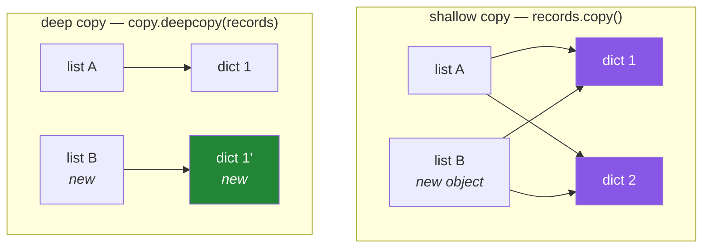

# 2.4 — Shallow copy, deep copy, and the nested list that follows you home

## One-line answer

A **shallow copy** makes a new outer container holding the *same inner objects*, so it protects the
top level and nothing below it; a **deep copy** recursively copies everything, which is complete and
expensive — and knowing which one you have is the difference between a backup and an illusion.

---

## The story

A pipeline processes records and wants to keep the originals for comparison. Somebody adds what looks
like the obvious safeguard:

```text
originals = records.copy()
for record in records:
    record["title"] = clean(record["title"])
```

The comparison at the end reports zero differences. Every title matches. The cleaning function appears
to be doing nothing at all.

They add print statements. The cleaning function is definitely running, and it is definitely changing
the titles. And yet `originals` shows the cleaned versions too.

`records.copy()` created a new **list**. It did not create new **dictionaries**. Both lists hold
references to the same dictionary objects ([2.3](2.3-aliasing-two-names-one-object.md)), so
`record["title"] = ...` mutates a dictionary that is in both lists.

The backup was a backup of the list structure, which nobody was changing, and not of the data, which
everybody was.

What makes this expensive is that it looks *exactly* like a working safeguard. There is no error, the
copy genuinely happened, and the word `copy` is right there in the source. The only way to know is to
understand what depth a copy operates at.

---

## The idea in plain language

### Three levels of "copy"

| | What it makes | Inner objects | Cost |
|---|---|---|---|
| **alias** — `b = a` | nothing; another name | shared | free |
| **shallow copy** — `a.copy()`, `list(a)`, `a[:]` | a new outer container | **shared** | proportional to length |
| **deep copy** — `copy.deepcopy(a)` | new everything, recursively | **copied** | proportional to total size |

A shallow copy sits exactly in the middle, and that middle position is what makes it confusing. It is
a real copy — mutating the outer list does not affect the original — and it is not the copy people
usually mean.

### When shallow is enough

**When the elements are immutable.** A list of integers, strings or tuples cannot be mutated through
either list, so sharing the elements is harmless. `[1, 2, 3].copy()` is a complete copy in every sense
that matters.

That covers most everyday cases, which is why shallow copying is the default everywhere and why the
trap is rare enough to be surprising.

### When it is not

**When any element is mutable** — a list of lists, a list of dicts, a dict of lists, an object with a
list attribute. Then the copy protects only the level you copied.

### The five ways to make a shallow copy

All of these do the same thing, and knowing they are equivalent stops you looking for a difference
that is not there:

```text
b = a.copy()      # explicit, clearest
b = list(a)       # also converts any iterable to a list
b = a[:]          # a full slice; older style
b = [*a]          # unpacking into a new literal
import copy; b = copy.copy(a)
```

For a dict: `d.copy()`, `dict(d)`, `{**d}`. For a set: `s.copy()`, `set(s)`.

### Deep copy, and what it costs

`copy.deepcopy(x)` walks the entire structure and rebuilds every mutable object it finds. It is
complete, and it is expensive: proportional to the total data, not to the top-level length.

It also handles cycles correctly — a structure containing itself does not cause infinite recursion,
because `deepcopy` tracks what it has already copied. That is a genuinely hard problem solved for you,
and it is part of why it is slow.

### The alternative you should usually reach for first

Often the real answer is neither: **build new data rather than copying and mutating.** A comprehension
that produces new records is clearer, faster than a deep copy, and immune to the whole problem:

```text
cleaned = [{**record, "title": clean(record["title"])} for record in records]
```

`{**record, "title": ...}` builds a **new** dictionary from the old one with one key replaced. No
mutation anywhere, so `records` is untouched and no copy was needed.



---

## Why Setu needs it

- **The story is Day 33's work** (`PD-11`, the `.str` accessor) done wrong: cleaning a column while
  keeping the original for comparison is a routine data task, and the shallow-copy trap is how it goes
  wrong.
- **[Day 2, 3.2](../../../day-02-quality-gate/parts/03-pytest/3.2-fixtures-and-tmp-path.md)'s fixture**
  returns a new empty list per test, which is a *construction* rather than a copy — the alternative
  suggested above, applied to test setup.
- **Day 21's NumPy views** (`NP-03`) are the same distinction with different vocabulary: a slice is a
  view (shared memory), `.copy()` is a copy, and `np.may_share_memory` is how you ask.
- **Day 76's leak-proof pipeline** (Principle 8) depends on the training data not being modified by a
  transform — and a shallow copy of a nested structure is exactly how a "safe" transform leaks.
- **From Day 192, checkpointing a graph's state** requires a snapshot that later mutation cannot
  reach. A shallow copy of a nested state dictionary produces checkpoints that all show the final
  state, which is a genuinely confusing debugging session.

---

## The mechanism

Reproduce the story, then find the shared objects:

```python
"""A shallow copy protects the outer list and nothing inside it."""

records = [{"id": 1, "title": "  A  "}, {"id": 2, "title": "  B  "}]

originals = records.copy()

print("different list objects  :", originals is not records)
print("same dict objects inside:", originals[0] is records[0])

for record in records:
    record["title"] = record["title"].strip()

print()
print("records  :", records)
print("originals:", originals)
print("the 'backup' changed too:", originals[0]["title"] == "A")
```

**Line by line:**

- `records.copy()` — a shallow copy. The first check confirms it is genuinely a **different list**;
  the second confirms it holds **the same dictionaries**. Both are true, and the second is the bug.
- `record["title"] = ...` — item assignment on a dictionary is a **mutation**
  ([2.2](2.2-what-in-place-means.md)): no bare `=` with just a name on the left. The dictionary object
  changes, and both lists point at it.
- `.strip()` returns a new string ([1.4](../01-objects/1.4-strings-are-immutable.md)) — the string is
  not being mutated. It is the *dictionary* that is mutated, by having its key rebound.
- The last line prints `True`: the backup shows cleaned data. **Two `is` checks at the top would have
  predicted it**, which is the whole diagnostic technique.

Now the three depths, measured against each other:

```python
"""Alias, shallow, deep — what each protects."""

import copy

nested = [[1, 2], [3, 4]]

alias = nested
shallow = nested.copy()
deep = copy.deepcopy(nested)

print("alias   is nested       :", alias is nested)
print("shallow is nested       :", shallow is nested)
print("shallow[0] is nested[0] :", shallow[0] is nested[0])
print("deep[0]    is nested[0] :", deep[0] is nested[0])

nested[0].append(99)
nested.append([5, 6])

print()
print("after appending to the INNER list and to the OUTER list:")
print("   nested :", nested)
print("   alias  :", alias, "   <- sees both changes")
print("   shallow:", shallow, "   <- sees the inner change only")
print("   deep   :", deep, "   <- sees neither")
```

**Line by line:**

- `shallow[0] is nested[0]` is `True` — the inner lists are shared. `deep[0] is nested[0]` is `False` —
  they were rebuilt.
- `nested[0].append(99)` mutates an **inner** list; `nested.append([5, 6])` mutates the **outer** one.
  Doing both is what separates the three cases, because each responds differently.
- `alias` sees both, because it is not a copy at all.
- `shallow` sees the inner change and not the outer one. **That split is the definition of a shallow
  copy**, and printing it is far more convincing than the definition.
- `deep` sees neither — a complete, independent structure.
- Run this once and the three-way distinction stops needing to be remembered.

And the cost, which decides when to use which:

```python
"""Deep copying is proportional to total size, not to top-level length."""

import copy
import time

data = [{"id": n, "tags": [f"t{i}" for i in range(20)]} for n in range(20_000)]

for label, operation in (
    ("alias        ", lambda d: d),
    ("shallow copy ", lambda d: d.copy()),
    ("deep copy    ", copy.deepcopy),
    ("rebuild new  ", lambda d: [{**row, "id": row["id"] + 1} for row in d]),
):
    start = time.perf_counter()
    result = operation(data)
    elapsed = time.perf_counter() - start
    print(f"{label}: {elapsed:8.4f}s   len={len(result):,}")
```

**Line by line:**

- Twenty thousand dictionaries, each holding a twenty-element list — four hundred thousand inner
  objects. Deliberately nested, because on flat data all four would look similar and teach nothing.
- `lambda d: d` — the alias, as a baseline. It takes essentially no time, because it does nothing.
- `d.copy()` — proportional to the number of **top-level** elements (twenty thousand references
  copied), which is fast.
- `copy.deepcopy` — proportional to the **total** structure, so it rebuilds four hundred thousand
  objects. Expect it to be one to two orders of magnitude slower than the shallow copy.
- `[{**row, "id": row["id"] + 1} for row in d]` — the **rebuild** alternative. It creates new
  dictionaries, so it is safe from mutation, and it is typically much faster than `deepcopy` because it
  copies one level rather than recursing blindly, and does the transformation at the same time.
- **The last row is the practical conclusion of this document.** When you need independent data *and*
  you are transforming it anyway, building new data is both safer and faster than copying then
  mutating.

---

## When it breaks

**The story: a backup that is not one:**

```text
>>> originals = records.copy()
>>> records[0]["title"] = "changed"
>>> originals[0]["title"]
'changed'
```

**What it means.** The outer list was copied and the dictionaries were not. There is no error — the
copy did exactly what it says. **Diagnose it with `originals[0] is records[0]`**; if that is `True`,
you have a shallow copy of mutable elements.

**The classic multiplication trap:**

```text
>>> grid = [[0] * 3] * 3
>>> grid[0][0] = 1
>>> grid
[[1, 0, 0], [1, 0, 0], [1, 0, 0]]
```

**What it means.** `[x] * 3` puts **three references to one object** in a list — the same aliasing as
[2.3](2.3-aliasing-two-names-one-object.md), created by an operator. Use
`[[0] * 3 for _ in range(3)]`, which evaluates the inner expression three times and therefore makes
three objects. `[0] * 3` on the inside is fine because integers are immutable.

**Deep copy refusing:**

```text
>>> import copy
>>> copy.deepcopy(open("data.csv"))
TypeError: cannot pickle '_io.TextIOWrapper' object
```

**What it means.** `deepcopy` cannot duplicate things that are not pure data — an open file, a socket,
a database connection, a thread lock. A structure holding any of those cannot be deep-copied without
telling `copy` how, and the fact that it *raises* rather than producing a broken half-copy is the right
behaviour. This is a good signal that the structure mixes data with resources, which is usually worth
separating anyway.

**Deep copy succeeding and being wrong:**

```text
>>> config = {"client": db_client, "retries": 3}
>>> snapshot = copy.deepcopy(config)
>>> snapshot["client"] is config["client"]
False
```

**What it means.** It duplicated the client object — which is almost certainly not what you wanted,
since a client wraps a connection and there should be one. `deepcopy` is indiscriminate: it copies
everything reachable, including things that should be shared. **The blunt tool is sometimes too
blunt**, and the fix is to copy only the data, deliberately.

**And the slow one:**

```text
$ time uv run python process.py
real    4m12.331s
```

...with a `deepcopy` inside a loop. **What it means.** Deep copying is proportional to total data size,
so doing it per iteration multiplies that by the iteration count. This is the same shape as
[1.4](../01-objects/1.4-strings-are-immutable.md)'s quadratic concatenation: an operation whose cost
nobody checked, repeated.

---

## In production

**Prefer building new data over copying and mutating.** A comprehension or a transformation that
produces new records is faster than a deep copy, clearer to read, and immune to every trap in this
document — because nothing is ever mutated, there is nothing for a copy to protect against. Reach for
`deepcopy` when you genuinely need an independent snapshot of an arbitrary structure you did not
design; reach for a rebuild whenever you are transforming the data anyway, which is most of the time.

**Copy at the boundary, at the right depth, and say which.** A constructor storing
`self._rows = list(rows)` has made a shallow copy — protecting against the caller appending, not
against the caller mutating a row. Whether that is sufficient depends on whether the rows are mutable,
and a class that means to be immutable must either deep-copy or hold immutable elements. Getting this
wrong is how a "value object" turns out to be modifiable from outside, which is a genuinely
hard-to-find bug in a large codebase.

**Immutability removes the question, and this is the third time today it has.** With immutable
records — tuples, frozen dataclasses, validated models forbidding mutation — the difference between
shallow and deep copy disappears, because there is nothing to protect. That is why this project's
configuration is frozen from Day 19 (`PY-23`) and why the graph state from Day 192 is replaced rather
than edited: **checkpointing a mutable structure with a shallow copy produces a set of checkpoints
that all show the final state**, which is a debugging session nobody enjoys.

**What changes at scale:** copying becomes the dominant cost and views become essential. NumPy slicing
returns a **view** — no copy at all — precisely because copying a gigabyte per operation is
unacceptable, and it gives you `.copy()` and `np.may_share_memory` to be explicit about which you have
(Day 21, `NP-03`). pandas 3.0's Copy-on-Write (Day 26, `PD-01`) is a whole architecture built to give
copy *semantics* with view *performance*: you get a logical copy, and the physical copy only happens
if something writes. Understanding shallow versus deep here is what makes that design read as an
elegant answer to a familiar problem rather than as an arbitrary breaking change.

**The review comment a senior engineer leaves.** On `backup = rows.copy()` where rows are
dictionaries: *"That's shallow — the dicts are shared, so this isn't a backup. Either deepcopy it or,
better, build the cleaned rows as new dicts and don't mutate at all."*

**The interview question.** *"What's the difference between a shallow and a deep copy?"* Everyone gets
the definition. The answer that lands adds when each is correct and what each costs: shallow is
sufficient — and preferable — when the elements are immutable, and misleading when they are not,
because it looks like a backup and is not; deep is complete but proportional to the total data, cannot
handle non-data objects like open files, and will duplicate things that should be shared, such as a
database client. Then give the answer that is usually better than both: build new data instead of
copying and mutating, because it is faster than a deep copy and removes the possibility of the bug.

---

## Check yourself

```bash
uv run python -c "
import copy
rows = [{'id': 1, 'tags': ['a']}, {'id': 2, 'tags': ['b']}]
shallow = rows.copy()
deep = copy.deepcopy(rows)
print('shallow[0] is rows[0]:', shallow[0] is rows[0])
print('deep[0]    is rows[0]:', deep[0] is rows[0])
rows[0]['tags'].append('NEW')
print('shallow:', shallow)
print('deep   :', deep)
grid = [[0] * 3] * 3
grid[0][0] = 1
print('grid   :', grid)
"
```

Predict all five lines. If the last one surprises you, write out what `[x] * 3` actually puts in the
list.

**Answer out loud, without scrolling up:**

> Explain why `records.copy()` is a real copy and still not a backup, using the word "level". Then say
> when a shallow copy is completely sufficient, and name the option that is usually better than either
> copy — and why it is faster as well as safer.

---

**Next:** [2.5 — Hashability: why a list cannot be a dictionary key](2.5-hashability.md)
