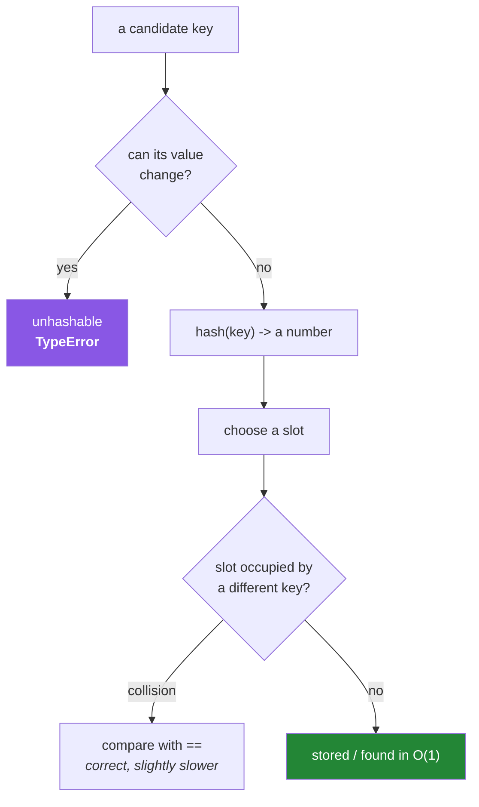

# 2.5 — Hashability — why a list cannot be a dictionary key

## One-line answer

A dictionary finds a key by computing a number from its **value**, so a key whose value can change
would become unfindable the moment it changed — which is why mutable objects are unhashable, and why
that restriction is a guarantee rather than a limitation.

---

## The story

A hotel keeps a lost-property shelf. Every item that turns up goes into a box, and the box is filed
under the owner's **phone number**, because a phone number is a short thing that does not change.
Somebody rings a month later, reads out their number, and the receptionist walks straight to the
right box.

Now imagine a hotel that files the boxes under the owner's **current address** instead.

It works on the first day. Then a guest moves house. Their box is still on the shelf, still full,
still theirs — and it is now filed under an address that is no longer true. The receptionist looks
under the new address and finds nothing. The box is physically present and permanently unreachable.

Nobody stole it. Nobody deleted it. The label just stopped matching the thing.

This is exactly why Python refuses some dictionary keys. Try to file something under a list:

```text
cache[query_terms] = results
```

and you get:

```text
TypeError: unhashable type: 'list'
```

The common workaround is to turn the list into text — `cache[str(query_terms)] = results`. It runs,
so it ships, and two problems arrive later.

The first is that `["ai", "safety"]` and `["safety", "ai"]` become different text, and therefore
different entries, even though the two searches mean the same thing. The cache is doing far less good
than anybody expected, and nobody knows why.

The second is worse, and it is the hotel. Somewhere else, a similar store uses a **custom object** as
its key — one somebody helpfully made changeable so the filters could be adjusted. Adjusting a filter
changes the object, which changes the shelf it should be on, and the entry becomes unreachable. It is
still in the dictionary and still using memory. `key in cache` says `False`, and `len(cache)` still
counts it.

The error at the start was the language stopping exactly the second bug from happening, and the
workaround quietly built a version of it anyway.

**`TypeError: unhashable type` is not an obstacle. It is a design question, asked at the right
moment**, and the answer is almost always "this key should be something that cannot change", not
"let me convert it into something the dictionary will accept".

---

## The idea in plain language

### How a dictionary finds things quickly

You met the performance table in [2.1](2.1-the-four-containers.md): a dict looks up by key in roughly
constant time, however large it is. Here is why.

The dictionary keeps an array of slots. To store a key, it computes `hash(key)` — a number derived
from the key's **value** — and uses that number to choose a slot. To find the key again, it computes
the hash again and goes straight to that slot.

That is the entire trick, and it depends on one property: **the same value must always produce the
same hash**. Compute a different number the second time and you look in the wrong slot and find
nothing.

### The contract

Three rules follow, and they are the whole subject:

1. **If `a == b`, then `hash(a) == hash(b)`.** Two keys that compare equal must land in the same slot,
   or a dictionary could store both and find neither reliably.
2. **A hash must never change** while the object is a key.
3. Two unequal objects *may* share a hash — a **collision** — and the dictionary handles it by
   comparing the actual keys in that slot with `==`. Collisions cost a little speed and never
   correctness.

Rule 2 is why mutability disqualifies. A list's hash would have to be derived from its contents, and
its contents can change, so rule 2 could not hold.

### The rule, stated simply

| Type | Hashable? | Why |
|---|---|---|
| `int`, `float`, `str`, `bool`, `bytes` | **yes** | immutable |
| `tuple` | **yes, if all its elements are** | immutable, but only as much as its contents |
| `frozenset` | **yes** | the immutable set |
| `None` | **yes** | immutable |
| `list`, `dict`, `set` | **no** | mutable — the hash could change |
| custom objects | **yes by default** (by identity) | see below |

The tuple row is the interesting one: `(1, 2)` is hashable, `(1, [2])` is not, because hashing a tuple
hashes its elements. **Immutability has to go all the way down** — the same "depth" idea as
[2.4](2.4-shallow-and-deep-copy.md).

### Custom objects hash by identity, by default

An object you define is hashable out of the box, and its hash is based on its **identity**, not its
value. So two separately-created objects with identical contents are different keys.

The moment you define `__eq__` to compare by value, Python sets `__hash__` to `None` — making the class
unhashable — because otherwise rule 1 would be violated: two equal objects would have different hashes.
That is the language protecting the contract for you, and it surprises people who define `__eq__` and
find their objects no longer work in a set.

The correct fix is to define `__hash__` as well, from the **same fields** `__eq__` uses, and to make
those fields immutable. A frozen dataclass does all of this automatically, which is why it is the right
default from Day 19 (`PY-23`). Day 15 covers the dunder methods properly (`PY-18`).



---

## Why Setu needs it

- **[2.1](2.1-the-four-containers.md)'s de-duplication is fast because of hashing**, and this document
  is the mechanism underneath that performance claim.
- **Day 8's arXiv de-duplication** (`PY-08`) is timed both ways; understanding hashing is what makes
  the result unsurprising.
- **Every cache in this project** — the pins cache from
  [Day 1, 2.3](../../../day-01-pins/parts/02-pypi-index/2.3-the-check-pins-script.md), the prompt
  caching from Day 172 — is a dictionary keyed by something, and choosing that key well is exactly
  this document's subject.
- **Day 12's `Paper` object** (`PY-13`) will eventually need `__eq__` and `__hash__` so that a set of
  papers de-duplicates correctly. Getting the contract wrong there produces duplicates that compare
  equal.
- **Day 155's vector stores** key vectors by document id, and Day 165's chunking generates those ids —
  a key design decision made with exactly the trade-offs here.

---

## The mechanism

Meet the refusal, and understand what it is protecting:

```python
"""Mutable objects are unhashable. The restriction is the guarantee."""

for candidate in (42, "setu", (1, 2), frozenset({1, 2}), None, [1, 2], {1: 2}, {1, 2}):
    try:
        value = hash(candidate)
        print(f"{str(candidate):<18} hashable   hash={value}")
    except TypeError as exc:
        print(f"{str(candidate):<18} NOT        {exc}")

print()
nested_ok = (1, 2, ("a", "b"))
nested_bad = (1, 2, ["a", "b"])
print("tuple of immutables :", hash(nested_ok))
try:
    hash(nested_bad)
except TypeError as exc:
    print("tuple with a list   :", exc)
```

**Line by line:**

- `hash(candidate)` raises `TypeError: unhashable type: 'list'` for the mutable ones. Note the message
  names the *type*, not the value — this is a property of the class, decided once, not of the
  particular object.
- `frozenset({1, 2})` is hashable while `{1, 2}` is not. `frozenset` exists precisely so that a set of
  things can itself be a key or a set member.
- `hash(nested_ok)` works; `hash(nested_bad)` raises **`unhashable type: 'list'`**, blaming the inner
  list. **Hashing a tuple hashes its elements**, so immutability must go all the way down. This is the
  single most common surprise about tuples as keys.
- `hash(None)` works — `None` is a singleton immutable object, which is also why `x is None` is the
  correct comparison for it ([3.2](../03-identity-trap/3.2-is-versus-equals.md)).

Now demonstrate what would break if the rule did not exist:

```python
"""What a mutable key would do to a dictionary, simulated with a custom class."""


class Filters:
    """DELIBERATELY WRONG: hashes from a value that can change."""

    def __init__(self, terms: list[str]) -> None:
        self.terms = terms

    def __hash__(self) -> int:
        return hash(tuple(self.terms))

    def __eq__(self, other: object) -> bool:
        return isinstance(other, Filters) and self.terms == other.terms

    def __repr__(self) -> str:
        return f"Filters({self.terms})"


key = Filters(["ai"])
cache = {key: "cached results"}

print("found before mutation:", key in cache, "->", cache.get(key))

key.terms.append("safety")

print("hash changed         :", True)
print("found after mutation :", key in cache)
print("but it is still there:", len(cache), "entry;", list(cache.values()))
print("and unreachable      : no key you can construct will find it")
```

**Line by line:**

- `__hash__` returning `hash(tuple(self.terms))` — a hash derived from **mutable** state, which is the
  mistake this whole document is about. It is written out so you can watch it fail.
- `__eq__` comparing by value — and note that defining `__eq__` without `__hash__` would have made the
  class unhashable automatically; defining both is what lets this broken version exist at all.
- `key.terms.append("safety")` — mutating the list inside the key. The object's identity is unchanged
  ([1.1](../01-objects/1.1-identity-type-value.md)); its **hash** is now different.
- `key in cache` is now `False`. The dictionary computes the new hash, looks in the new slot, and finds
  nothing — while the entry sits in the old slot.
- `len(cache)` is still `1`. **The entry exists, occupies memory, and is unreachable by any key you
  can build.** That is the bug Python prevents by refusing to hash a list, and running this once makes
  the refusal feel like a gift.
- `isinstance(other, Filters)` in `__eq__` — comparing against an unrelated type must return `False`
  rather than raising. Day 15 covers the full dunder contract (`PY-18`).

And the correct shapes:

```python
"""Immutable keys: a tuple, a frozenset, or a frozen record."""

from dataclasses import dataclass

by_tuple: dict[tuple[str, ...], str] = {}
by_tuple[("ai", "safety")] = "ordered key"
print("tuple key      :", by_tuple[("ai", "safety")])

by_frozenset: dict[frozenset[str], str] = {}
by_frozenset[frozenset({"ai", "safety"})] = "order-independent key"
print("frozenset key  :", by_frozenset[frozenset({"safety", "ai"})])


@dataclass(frozen=True)
class Query:
    text: str
    terms: tuple[str, ...]


cache: dict[Query, str] = {}
cache[Query("what is ai", ("ai",))] = "results"
print("frozen record  :", cache[Query("what is ai", ("ai",))])
print("hashable       :", hash(Query("what is ai", ("ai",))) is not None)

try:
    Query("x", ("y",)).text = "changed"
except Exception as exc:
    print("cannot mutate  :", type(exc).__name__, exc)
```

**Line by line:**

- `("ai", "safety")` as a key — order matters, so `("safety", "ai")` is a **different** key. Correct
  when order is meaningful.
- `frozenset({"ai", "safety"})` as a key — order does **not** matter, so the lookup with the terms
  reversed succeeds. This is the fix for the story's first problem: a query whose terms mean the same
  thing in any order should have an order-independent key.
- `@dataclass(frozen=True)` — generates `__init__`, `__eq__`, `__repr__` **and** `__hash__` from the
  declared fields, with assignment forbidden. That is every rule of the contract satisfied for free,
  which is why it is the right default for any value-like object.
- `terms: tuple[str, ...]` — a tuple, **not** a list. A frozen dataclass containing a list would be
  unhashable, because immutability must go all the way down. `...` in the annotation means
  "a tuple of any length, all strings".
- `Query(...).text = "changed"` raises `FrozenInstanceError`. The class enforces its own
  immutability, so a key cannot drift out from under a dictionary.
- **Three correct answers for three different situations**, and none of them is "convert it to a
  string".

---

## When it breaks

**The story's first error:**

```text
>>> cache = {}
>>> cache[["ai", "safety"]] = "results"
Traceback (most recent call last):
  File "<stdin>", line 1, in <module>
TypeError: unhashable type: 'list'
```

**What it means.** A list cannot be a key. The fix is `tuple(terms)` when order matters or
`frozenset(terms)` when it does not — **not** `str(terms)`, which reintroduces the ordering problem and
makes the key opaque.

**The nested one, which blames the wrong-looking thing:**

```text
>>> config = {("model", ["a", "b"]): 1}
TypeError: unhashable type: 'list'
```

**What it means.** The tuple is fine; the list *inside* it is not. The message names `list` even though
you wrote a tuple, which is confusing for a moment. `("model", ("a", "b"))` works.

**The one that appears after you add `__eq__`:**

```text
>>> class Paper:
...     def __init__(self, doi): self.doi = doi
...     def __eq__(self, other): return self.doi == other.doi
...
>>> {Paper("10.1/x")}
Traceback (most recent call last):
  File "<stdin>", line 1, in <module>
TypeError: unhashable type: 'Paper'
```

**What it means.** Defining `__eq__` sets `__hash__` to `None` automatically, because value-equality
without matching value-hashing would violate the contract. Python is refusing to let you build a
broken key. Define `__hash__` from the same fields — or use `@dataclass(frozen=True)` and get both.

**A set that contains what look like duplicates:**

```text
>>> class Paper:
...     def __init__(self, doi): self.doi = doi
...
>>> len({Paper("10.1/x"), Paper("10.1/x")})
2
```

**What it means.** With no `__eq__`, objects compare by identity and hash by identity, so two
separately-created objects are two distinct members. **The default is correct and is often not what you
want**, and this is exactly the bug Day 12's `Paper` class must avoid.

**And the unreachable entry, which raises nothing:**

```text
>>> key in cache
False
>>> len(cache)
1
```

**What it means.** The mechanism demonstration above. A key's hash changed while it was in a
dictionary, so the entry is in the wrong slot. There is no error and no way to reach it. This is the
failure Python's unhashable-type rule exists to make impossible, and it is why the `TypeError` is worth
being grateful for.

---

## In production

**Key design is a real design activity, and the first question is what "the same" means.** Should
`["ai", "safety"]` and `["safety", "ai"]` be one cache entry or two? Should a query key include the
model id, so that changing models does not serve stale answers? Should it include a schema version, so
a deployment invalidates old entries? Those questions have answers specific to your system, and
answering them deliberately is the difference between a cache that helps and one that serves wrong
results. `str(...)` of a mutable structure answers none of them, which is why it is the wrong reflex.

**Equal and hash must be defined together, from the same immutable fields.** This is a language-level
contract with real consequences: get it wrong and objects go missing from sets, dictionary lookups
fail intermittently, and de-duplication silently produces duplicates. Frozen dataclasses and validated
immutable models do it correctly by construction, which is why professional code reaches for them
rather than hand-writing the pair. When you *must* hand-write it — Day 15's subject (`PY-18`) — derive
both from the same tuple of fields, so they cannot drift apart.

**Hashing is why practically every fast lookup in computing works, and the constraint is always the
same.** Database hash indexes, distributed hash tables sharding data across machines, content-addressed
storage identifying a blob by the hash of its bytes, and the lockfile hashes from
[Day 1, 2.2](../../../day-01-pins/parts/02-pypi-index/2.2-yanked-and-prerelease.md) — all of them rest
on "the same value always produces the same number", and all of them break in the same way if the value
can change. Immutability is not a Python quirk here; it is the precondition for the whole technique.

**What changes at scale:** hash collisions stop being theoretical. With enough keys, collisions are
routine and handled correctly, but an *adversary* who can choose your keys can deliberately cause
mass collisions and turn constant-time lookups into linear scans — a real denial-of-service technique
against web servers keying dictionaries on request parameters. Python randomises string hashing per
process by default as a defence, which has a consequence worth knowing: **`hash("setu")` gives a
different number in a different process**, so a hash value must never be persisted to disk or shared
between machines. Use an explicit, stable digest such as `hashlib.sha256` for anything that outlives
the process — exactly as
[Day 3, 1.3](../../../day-03-keys-and-budget/parts/01-secrets/1.3-when-a-key-leaks.md)'s fingerprint
does.

**The review comment a senior engineer leaves.** On a cache keyed by a stringified list: *"Use a
frozenset if order doesn't matter, or a tuple if it does. And should the model id be part of this key?
Right now a model change serves stale answers."*

**The interview question.** *"Why can't you use a list as a dictionary key?"* The definition is
"lists are unhashable". The answer that lands explains the *reason*: a dictionary locates a key by
computing a number from its value, so the same value must always give the same number — and a list's
value can change, which would leave the entry in a slot nobody will look in again. Then note that it is
a guarantee rather than a limitation, since the alternative is entries that exist and cannot be
reached. For the strongest version, add the contract — `a == b` implies `hash(a) == hash(b)`, which is
why defining `__eq__` without `__hash__` makes a class unhashable — and mention that Python randomises
string hashes per process, so a hash is never something to persist.

---

## Check yourself

```bash
uv run python -c "
for x in (1, 'a', (1, 2), frozenset({1}), None, [1], {1: 2}, {1}, (1, [2])):
    try:
        hash(x); print(f'{str(x):<12} hashable')
    except TypeError as e:
        print(f'{str(x):<12} NO  - {e}')
print()
print('frozenset key ignores order:', {frozenset({'a','b'}): 1}[frozenset({'b','a'})])
print('tuple key does not         :', ('a','b') == ('b','a'))
"
```

Predict every line, especially the last two entries of the loop. `(1, [2])` is the one worth being sure
about.

**Answer out loud, without scrolling up:**

> Explain to somebody who has never heard of hashing why a dictionary is fast, and use that to say why
> a list cannot be a key. Then give the contract between `==` and `hash`, and say what Python does to
> your class when you define `__eq__` and forget `__hash__`.

---

**Next:** [3.1 — The mutable default argument, reproduced then fixed](../03-identity-trap/3.1-the-mutable-default-argument.md)
