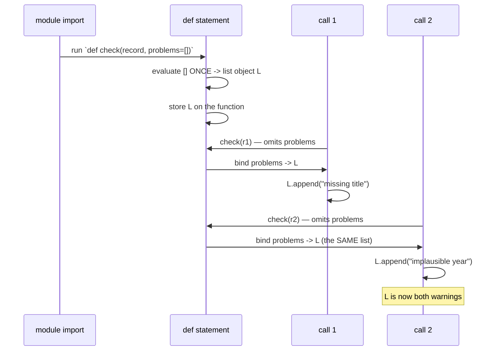

# 3.1 — The mutable default argument, reproduced then fixed

## One-line answer

A function's default arguments are evaluated **once, when the `def` statement runs** — not on each
call — so a mutable default is a single object shared by every call that omits it, and it accumulates
changes for the lifetime of the program.

---

## The story

A small clinic hands every patient a form to fill in while they wait. Name at the top, then a space
to write down what is wrong.

On a busy morning the receptionist runs out of blank forms. Rather than stop, they hand the next
patient the form that is already on the clipboard and say "just add yours underneath." The patient
does. So does the next one. So does the one after that.

By eleven o'clock, the fifth patient of the day is handed a sheet that already lists a headache, a
sore knee, a cough and a rash, and adds their own line to the bottom. The doctor reads it and sees a
person with five unrelated problems.

Nobody was careless on purpose. There was one sheet of paper, and everybody wrote on it, because
"here is a form" sounded like "here is a *fresh* form" and it was not.

Python has a way of doing exactly this, and it looks completely ordinary:

```text
def check(record, problems=[]):
    if not record.get("title"):
        problems.append("missing title")
    if record.get("year", 0) < 1900:
        problems.append("implausible year")
    return problems
```

The first test passes. One record with no title returns `["missing title"]`.

The second test, in the same run, checks a record with a bad year and expects
`["implausible year"]`. It gets `["missing title", "implausible year"]`.

The first guess is that the tests are interfering with each other, which is right, but not for the
reason anyone suspects. A fixture goes in to isolate them
([Day 2, 3.2](../../../day-02-quality-gate/parts/03-pytest/3.2-fixtures-and-tmp-path.md)) and it does
not help, because the shared sheet of paper is not in the test file.

In real use it is worse. The list grows all day. Records checked in the afternoon carry warnings
picked up in the morning. A dashboard shows a warning count that climbs and never falls, everyone
reads that as data quality getting worse, and somebody spends two days investigating a problem that
does not exist.

There is one list. It was made once, when the file was first loaded, and every call that did not
bring its own has been writing on it ever since.

---

## The idea in plain language

### When defaults are evaluated

This is the whole thing, and it is one sentence: **the expression after `=` in a parameter list runs
once, when the `def` statement executes** — that is, when the module is imported — and the resulting
object is stored on the function.

It does **not** run per call. A call that omits the argument binds the parameter name to that one
stored object ([1.2](../01-objects/1.2-names-are-labels.md)).

So `problems=[]` means: make one list now, and hand that same list to every call that omits it.

For an **immutable** default this is invisible and harmless. `def f(x=0)` shares one integer object
between every call, and since nothing can change it, nobody notices
([1.1](../01-objects/1.1-identity-type-value.md)). For a **mutable** default it is the story: a shared
object, mutated in place ([2.2](../02-containers/2.2-what-in-place-means.md)), visible to every caller
([2.3](../02-containers/2.3-aliasing-two-names-one-object.md)).

**This is not a special rule.** It is [1.1](../01-objects/1.1-identity-type-value.md) through
[2.3](../02-containers/2.3-aliasing-two-names-one-object.md) applied to a place people do not think to
look.

### The fix, which is idiomatic and universal

```text
def check(record, problems=None):
    if problems is None:
        problems = []
    ...
```

`None` is immutable and a singleton, so sharing it is harmless. The list is created **inside the
function body**, which runs on every call, so every call that omits the argument gets its own.

Three details that are not optional:

- `is None`, not `== None` — identity is the right question for a singleton
  ([3.2](3.2-is-versus-equals.md)).
- `is None`, not `if not problems:` — an empty list passed deliberately by the caller is falsy
  ([1.3](../01-objects/1.3-numbers-and-bool.md)), and treating it as "not supplied" would silently
  discard the caller's object.
- The type hint becomes `list[str] | None`, which honestly describes what the parameter accepts.

### It applies to more than lists

Any mutable default has the same problem: `{}`, `set()`, an instance of your own class. And any
default whose value is *computed at definition time* has a related one — `def log(when=datetime.now())`
records the moment the module was imported, forever, which is a genuinely mystifying bug.

### Why the language works this way

It looks like a mistake in the language design, and there is a defensible reason: evaluating defaults
once makes function calls cheaper, and it makes the default a normal object you can inspect. It also
enables a real idiom — a default used as a cache, deliberately, which some code does on purpose.

The honest summary is that it is a trade-off most people meet as a trap, which is why linters flag it
by default. `B006` is in this project's selected rules
([Day 2, 1.2](../../../day-02-quality-gate/parts/01-linting/1.2-choosing-rule-families.md)), which
means **you are protected from this bug from today onward** — and knowing why the rule exists is what
stops you silencing it.



---

## Why Setu needs it

- **`B006` catches this**, and this project selected `B` on
  [Day 2](../../../day-02-quality-gate/parts/01-linting/1.2-choosing-rule-families.md) specifically so
  that today's exercises are protected. Today is the day the rule stops being a letter in a list.
- **Day 10 writes your first `src/setu/` module** (`PY-10`), full of functions with parameters and
  defaults. This is the trap waiting there.
- **[Day 3, 4.3](../../../day-03-keys-and-budget/parts/04-rate-budget/4.3-the-budget-as-a-receipt.md)'s
  `Receipt`** used `field(default_factory=...)` for exactly this reason — a dataclass field default is
  the same trap in different syntax, and that is the fix.
- **The plan names this example explicitly** (`PY-02`): "the classic mutable-default-argument bug,
  reproduced then fixed". Reproducing it is the point; reading about it is not enough.
- **From Day 172 every provider call has default parameters**, and from Day 192 every graph node takes
  state with defaults. The trap scales with the codebase.

---

## The mechanism

Reproduce it, and prove there is only one object:

```python
"""The bug. Note the id: it never changes, because there is only one list."""


def check(record: dict, problems: list[str] = []) -> list[str]:  # noqa: B006
    if not record.get("title"):
        problems.append("missing title")
    if record.get("year", 0) < 1900:
        problems.append("implausible year")
    return problems


print("call 1:", check({"year": 2020}))
print("call 2:", check({"title": "A Paper", "year": 1800}))
print("call 3:", check({"title": "B Paper", "year": 2020}))

print()
print("the default object lives on the function:")
print("   ", check.__defaults__)
print("   id:", id(check.__defaults__[0]))
```

**Line by line:**

- `problems: list[str] = []` — the bug, written deliberately. The `# noqa: B006` is there because this
  project's linter would otherwise refuse the file; **this is one of the rare legitimate uses of a
  suppression** ([Day 2, 1.3](../../../day-02-quality-gate/parts/01-linting/1.3-fix-and-noqa-as-debt.md)),
  and it carries the code so it silences exactly one rule.
- `record.get("title")` — `.get` returns `None` for a missing key rather than raising
  ([2.1](../02-containers/2.1-the-four-containers.md)), and `not None` is `True`
  ([1.3](../01-objects/1.3-numbers-and-bool.md)).
- Call 1 returns one warning. Call 2 returns **two** — its own, plus call 1's. Call 3 has nothing wrong
  with it and still returns two, which is the version that produces a phantom data-quality problem.
- `check.__defaults__` — a tuple of the function's default values, **stored on the function object**.
  This is the proof: the list is not conjured per call, it is an attribute you can print.
- `id(check.__defaults__[0])` — print it, then call the function again and print it once more. **It
  never changes.** One object, for the process lifetime.

Now the fix, with the two wrong versions of it shown too:

```python
"""The idiom, and the two ways people get it subtly wrong."""


def correct(record: dict, problems: list[str] | None = None) -> list[str]:
    if problems is None:
        problems = []
    if not record.get("title"):
        problems.append("missing title")
    return problems


def wrong_truthiness(record: dict, problems: list[str] | None = None) -> list[str]:
    if not problems:
        problems = []
    if not record.get("title"):
        problems.append("missing title")
    return problems


caller_list: list[str] = []
correct({"year": 2020}, caller_list)
print("correct        : caller's list is", caller_list)

caller_list = []
wrong_truthiness({"year": 2020}, caller_list)
print("wrong_truthiness: caller's list is", caller_list, "  <- their object was discarded")

print()
print("correct(), three independent calls:")
for n in range(3):
    print("   ", correct({"year": 2020}))
```

**Line by line:**

- `problems is None` — the correct test. It asks the one question that matters: *was the argument
  omitted?*
- `if not problems:` — the plausible-looking mistake. An **empty list passed deliberately** by the
  caller is falsy, so this branch replaces it with a *different* empty list. The caller's object never
  receives anything, and the caller sees nothing added — which is exactly what the printed output
  shows.
- `caller_list` before and after — the `correct` version appends to the caller's list, and
  `wrong_truthiness` does not. **Same intent, one word different, and a silently dropped result.**
- The final loop shows three calls each returning exactly one warning. `problems = []` is inside the
  body, so it runs per call.
- `list[str] | None` — the annotation now says the truth. `list[str] = []` claimed the parameter was
  always a list, which was misleading as well as buggy.

And the same trap in the two other shapes you will actually meet:

```python
"""A dataclass field and a computed default: the same bug, different syntax."""

from dataclasses import dataclass, field


@dataclass
class Receipt:
    """RIGHT: default_factory is called once PER INSTANCE."""

    counts: dict = field(default_factory=dict)


a, b = Receipt(), Receipt()
a.counts["gemini"] = 1
print("independent instances:", a.counts, b.counts, a.counts is b.counts)


class Manual:
    """WRONG in the classic way: a class attribute is shared by all instances."""

    counts: dict = {}


m1, m2 = Manual(), Manual()
m1.counts["gemini"] = 1
print("shared class attribute:", m1.counts, m2.counts, m1.counts is m2.counts)
```

**Line by line:**

- `field(default_factory=dict)` — the dataclass fix. `default_factory` takes a **zero-argument
  callable** that is called **per instance**, so each object gets its own dict. Writing
  `counts: dict = {}` in a dataclass would be the mutable-default bug, and the dataclass machinery
  actually raises a `ValueError` for it — the language catching the mistake for you, as
  [2.5](../02-containers/2.5-hashability.md)'s unhashable rule does.
- `default_factory=dict` passes the **type itself** as the factory, because calling `dict()` produces
  an empty dict. `default_factory=lambda: defaultdict(int)` was needed in
  [Day 3, 4.3](../../../day-03-keys-and-budget/parts/04-rate-budget/4.3-the-budget-as-a-receipt.md)
  because `defaultdict(int)` is already a constructed object rather than a factory.
- `a.counts is b.counts` prints `False` — two instances, two dicts. That is the property being bought.
- `class Manual: counts: dict = {}` — a **class attribute**, created once when the class body runs and
  shared by every instance. `m1.counts is m2.counts` prints `True`, and mutating through one instance
  is visible from all of them. Day 12 covers classes properly (`PY-13`); today's point is that this is
  the identical bug in a third costume.
- **Three syntaxes, one mistake: an object created once at definition time and shared thereafter.**
  Recognising the shape is worth more than remembering the three cases.

---

## When it breaks

**The linter catches it, which is the outcome you want:**

```text
B006 Do not use mutable data structures for argument defaults
 --> src/setu/validate.py:12:38
   |
12 | def check(record, problems=[]):
   |                            ^^
   |
help: Replace with `None`; initialize within function
```

**What it means.** Exactly the bug, caught before the code ever ran, with the fix in the help text.
This is why `B` is selected ([Day 2, 1.2](../../../day-02-quality-gate/parts/01-linting/1.2-choosing-rule-families.md))
— the rule pays for itself the first time.

**Without a linter, results that grow across calls:**

```text
call 1: ['missing title']
call 2: ['missing title', 'implausible year']
call 3: ['missing title', 'implausible year']
```

**What it means.** No exception, no warning. **When a function's output depends on how many times it
has been called, look for shared state** — and a default argument is the first place to look, because
it is the least visible.

**The dataclass version, which the language refuses:**

```text
ValueError: mutable default <class 'list'> for field tags is not allowed:
  use default_factory
```

**What it means.** Dataclasses detect the mistake at class-creation time and refuse, telling you the
fix. A rare and welcome case of a language feature knowing about a trap and closing it.

**The computed default, which is the strangest-looking:**

```text
>>> from datetime import datetime
>>> def log(msg, when=datetime.now()):
...     print(when, msg)
>>> log("first")
2026-08-24 09:15:02.113 first
>>> # ... an hour later, same process ...
>>> log("second")
2026-08-24 09:15:02.113 second
```

**What it means.** `datetime.now()` was evaluated **once**, when `def` ran. Every log line carries the
import time. The fix is identical: `when=None`, then `when = datetime.now()` inside. This one is
particularly nasty because the value looks plausible — it is a real timestamp, just always the wrong
one.

**And the "fix" that introduces a new bug:**

```text
>>> results = []
>>> collect({"a": 1}, results)
>>> results
[]
```

**What it means.** The function used `if not problems:` instead of `if problems is None:`, so the
caller's empty list was falsy and got replaced. **The caller's object was silently discarded** — no
error, no output, no clue. This is the trap inside the fix, and it is why the idiom is `is None` and
never truthiness.

---

## In production

**The `None` sentinel idiom is universal and worth internalising as a pattern rather than a rule.**
Whenever a parameter needs a default that is mutable, expensive, or dependent on call-time state, the
answer is a sentinel default plus construction in the body. That covers lists and dicts, timestamps,
database connections, random-number generators. When `None` is itself a meaningful value the caller
might pass, professionals define a private sentinel object — a module-level
`_MISSING = object()` — so that "not supplied" and "supplied as None" stay distinguishable. Knowing
that refinement exists is what lets you write an honest API for an optional-nullable parameter.

**A shared mutable default is occasionally used deliberately, and it should be loud when it is.** The
classic case is a default dictionary used as a memoisation cache across calls. It works, it is a real
idiom, and it is indistinguishable in source from the bug — which means it must carry a comment saying
it is intentional, and it should almost always be `functools.lru_cache` instead, which does the same
thing explicitly and handles eviction. If you find one in a codebase with no comment, assume it is the
bug until proven otherwise.

**This bug's real cost is that it survives testing.** A single call behaves correctly, so a unit test
that exercises the function once passes forever. It needs *two* calls in one process to appear, which
is why it reaches production so reliably and why
[Day 2, 3.1](../../../day-02-quality-gate/parts/03-pytest/3.1-the-test-that-can-go-red.md)'s insistence
on watching a test fail matters: the test that would catch this must call the function twice and
assert on the second result. That is a test somebody has to think to write.

**What changes at scale:** in a long-running service the accumulation is unbounded, so this is a
**memory leak** as well as a correctness bug — the list grows for the process lifetime and is never
collected, because the function object holds a reference to it forever. In a threaded server it is also
a data race ([2.3](../02-containers/2.3-aliasing-two-names-one-object.md)): several requests mutating
one list concurrently. A bug that is merely confusing in a script becomes a slow leak and an
intermittent corruption in a service, and the symptom seen by operations — memory climbing steadily
with no obvious cause — points nowhere near a function signature.

**The review comment a senior engineer leaves.** On `def f(items=[])`: *"Mutable default — that list
is created once at import and shared by every call. Use `None` and build it in the body, and check
`is None` rather than truthiness so an empty list from the caller still works."*

**The interview question.** *"What does this print?"* — followed by a function with a mutable default,
called twice. It is one of the most common Python interview questions there is. Getting the output
right is the entry ticket; the answer that lands explains **why**: defaults are evaluated once when the
`def` executes, so the object is stored on the function and shared by every call that omits the
argument. Then give the fix and *both* of its details — `None` as the sentinel, and `is None` rather
than truthiness so a deliberately-passed empty list is not discarded. If you add that this is the same
mechanism as a class attribute shared between instances and a dataclass field default, and that in a
long-running service it is also a memory leak, you have shown you understand the shape rather than the
puzzle.

---

## Check yourself

```bash
uv run python -c "
def bad(x, acc=[]):
    acc.append(x); return acc
def good(x, acc=None):
    if acc is None: acc = []
    acc.append(x); return acc
print('bad :', bad(1), bad(2), bad(3))
print('good:', good(1), good(2), good(3))
print('the default object:', bad.__defaults__, 'id stable:', id(bad.__defaults__[0]))
print('good default      :', good.__defaults__)
"
```

Predict both result lines before running. Then explain the last two lines to yourself — `bad` has a
list stored on the function and `good` has `None`.

**Answer out loud, without scrolling up:**

> Say exactly when the expression `[]` in `def f(x, acc=[])` is evaluated, and how many times. Then
> give the fix and explain why it must test `is None` rather than falsiness — and name two other
> places in Python where the same "evaluated once at definition time" mistake appears.

---

**Next:** [3.2 — `is` versus `==`, small-int caching, and why interning is not a promise](3.2-is-versus-equals.md)
