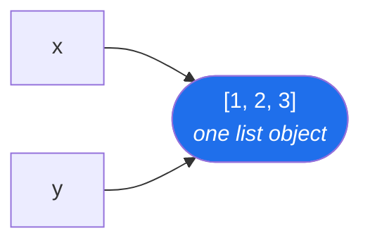

# Day 4 — Objects, types, and mutability

**Phase 1 · Module 1 · Python foundations** · IDs: **PY-01**, **PY-02**

> **Yesterday:** the three free keys and the rate budget. Phase 0 is closed.
> **Today:** what a Python object actually is, and the one distinction — mutable vs immutable — that
> explains three separate bugs you would otherwise meet in Phases 4, 12, and 22.
> **Tomorrow:** operators, precedence, and `is` vs `==`.

```bash
./m start 4 && ./m scaffold 4
```

**Time:** 90 minutes. **Request budget:** 0 model calls.

---

## §1 The story

Most languages have two kinds of thing: *values* (a number, a character) and *objects* (a thing with
methods). Python has one. `3` is an object. `"hello"` is an object. A function is an object. The
`print` function is an object you could put in a list.

That uniformity buys enormous flexibility — and it costs you one thing you must learn today.

Because everything is an object, **a variable is not a box that holds a value. It is a label tied to
an object.** `x = [1, 2, 3]` does not put a list *into* `x`. It creates a list somewhere in memory and
ties the name `x` to it. If you then write `y = x`, you have not copied anything. You have tied a
second label to the same list.



Now: **can that object be changed after it is created?**

- A list **can**. It is *mutable*. `x.append(4)` changes the object itself — and because `y` points
  at the same object, `y` changed too. You never touched `y`.
- A string **cannot**. It is *immutable*. `s.upper()` does not change `s`; it builds a brand-new
  string and hands it back. If you ignore the return value, nothing happened.

Every one of these is the same bug wearing a different hat:

- Day 30, pandas: you "cleaned" a column and the dataframe is unchanged.
- Day 108, scikit-learn: two Random Forests share a mutable default and give correlated results.
- Day 193, LangGraph: two graph nodes write to the same state list and one silently overwrites the other.

Learn the distinction once, today, on three-line examples. Then recognise it four more times over
the next 236 days.

---

## §2 Setup — run this

```bash
mkdir -p days/day-04/lab
touch days/day-04/lab/explore_objects.py
touch src/setu/textutils.py
touch tests/test_textutils.py
```

No new packages. Today is standard library only.

---

## §3 PY-01 — everything is an object

Copy into `days/day-04/lab/explore_objects.py`:

```python
"""PY-01: an object has a type, an identity, and a value."""

from __future__ import annotations


def describe(label: str, obj: object) -> None:
    """Print the three facts that define any Python object."""
    print(f"{label:<12} type={type(obj).__name__:<10} id={id(obj):<20} value={obj!r}")


def main() -> None:
    describe("int", 42)
    describe("float", 42.0)
    describe("bool", True)
    describe("str", "42")
    describe("list", [42])
    describe("function", describe)

    print("\n-- bool is a subclass of int --")
    print(f"{isinstance(True, int)=}")
    print(f"{True + True=}")

    print("\n-- floats are not decimals --")
    print(f"{0.1 + 0.2=}")
    print(f"{0.1 + 0.2 == 0.3=}")


if __name__ == "__main__":
    main()
```

**Line by line:**

- `obj: object` — `object` is the base type every Python object inherits from, so this annotation
  means "literally anything". It is the honest annotation here, not a lazy one.
- `type(obj).__name__` — `type(obj)` returns the *class object*; `.__name__` is its readable name.
  `type(42)` prints `<class 'int'>`; `type(42).__name__` prints `int`.
- `id(obj)` — the object's identity: in CPython, its memory address. Two names with the same `id`
  point at **one** object. This is the number that makes §4 visible.
- `{obj!r}` — the `!r` conversion calls `repr()` instead of `str()`. `repr` is the unambiguous form:
  `str(42)` and `str("42")` both print `42`, but `repr` shows `42` and `'42'`. **Use `!r` in every
  debug print you ever write.** You will implement `__repr__` yourself on Day 15.
- `f"{isinstance(True, int)=}"` — the `=` suffix (3.8+) prints both the expression and its value:
  `isinstance(True, int)=True`. It is the fastest debugging tool in the language.
- `isinstance(True, int)` is `True` and `True + True` is `2` — **`bool` is a subclass of `int`.**
  This is not a curiosity: on Day 100 you will sum a boolean mask to count rows, and it works for
  exactly this reason.
- `0.1 + 0.2 == 0.3` is `False` — floats are binary approximations. On Day 60 you will compare
  variances and this is why `math.isclose` exists.

Run it:

```bash
uv run python days/day-04/lab/explore_objects.py
```

Read the `id` column. Note that small integers may share an id — CPython caches them. **Do not build
anything on that**; it is an implementation detail, and Day 5 covers why `is` is the wrong operator
for comparing values.

---

## §4 PY-02 — mutability, made visible

Add to the same file, above `if __name__`:

```python
def mutability_demo() -> None:
    """PY-02: mutable objects are changed in place; immutable ones are replaced."""
    print("\n-- list: MUTABLE --")
    x = [1, 2, 3]
    y = x
    print(f"before  x={x} y={y} same_object={x is y}")
    x.append(4)
    print(f"after   x={x} y={y}   <-- y changed and you never touched it")

    print("\n-- list: a real copy --")
    a = [1, 2, 3]
    b = a.copy()
    a.append(4)
    print(f"a={a} b={b} same_object={a is b}")

    print("\n-- str: IMMUTABLE --")
    s = "setu"
    print(f"id before  {id(s)}")
    s = s.upper()
    print(f"id after   {id(s)}  <-- a different object; the original was not edited")

    print("\n-- the return value you must not discard --")
    t = "  spaced  "
    t.strip()
    print(f"discarded: {t!r}")
    t = t.strip()
    print(f"kept:      {t!r}")
```

Call it from `main()`.

**Line by line:**

- `y = x` — **no copy happens.** One list, two labels.
- `x is y` — the identity operator: "are these the same object?" It prints `True`, which is the
  whole lesson in one boolean.
- `x.append(4)` — `append` returns `None` and changes the list **in place**. `y` now shows four
  elements because `y` was never a separate thing.
- `a.copy()` — a *shallow* copy: a new list containing the same element objects. Enough for a list of
  ints. **Not** enough for a list of lists — Day 13 covers `copy.deepcopy`.
- `id(s)` before and after `s.upper()` — different numbers. `upper()` did not edit the string; it
  built a new one. The name `s` was then re-tied.
- `t.strip()` with the result discarded — the classic. The stripped string was created, returned,
  and immediately garbage-collected. `t` is unchanged. **Every immutable method returns the new
  value; you must assign it.**

### The two-column summary — memorise this

| | Mutable | Immutable |
|---|---|---|
| Types | `list`, `dict`, `set`, most custom classes | `int`, `float`, `str`, `tuple`, `frozenset`, `bool` |
| A method that "changes" it | edits in place, usually returns `None` | returns a **new** object |
| `y = x` then change `x` | `y` sees the change | `y` does not |
| Safe as a dict key | ❌ no | ✅ yes |
| Safe as a default argument | ❌ **never** (see §5) | ✅ yes |

---

## §5 The mutable-default trap

The single most-asked Python interview question, and a real bug:

```python
def collect_broken(item: str, bucket: list[str] = []) -> list[str]:
    bucket.append(item)
    return bucket


def collect(item: str, bucket: list[str] | None = None) -> list[str]:
    if bucket is None:
        bucket = []
    bucket.append(item)
    return bucket
```

**Line by line:**

- `bucket: list[str] = []` — **the default value is evaluated once, when the function is defined**,
  not on each call. Every call that omits `bucket` shares *the same list*. Call `collect_broken("a")`
  then `collect_broken("b")` and the second returns `["a", "b"]`.
- `bucket: list[str] | None = None` — `None` is immutable, so it is safe to share.
- `if bucket is None:` — `is None`, not `== None`. `None` is a singleton; identity is the correct
  test and it cannot be fooled by a class that overrides `__eq__`.
- `bucket = []` — a fresh list per call. This is the fix, and it is the only fix.

Prove it before you believe it:

```python
print(collect_broken("a"), collect_broken("b"))   # ['a'] ['a', 'b']   ← the bug
print(collect("a"), collect("b"))                  # ['a'] ['b']        ← correct
```

---

## §6 Build brief — your first `src/setu/` module

`src/setu/textutils.py`. Every later phase imports from here: Day 117 tokenises with it, Day 163
cleans PDF text with it, Day 229 normalises paper titles with it.

```python
"""Text helpers for Setu. Pure functions: no I/O, no globals, no surprises."""

from __future__ import annotations


def normalise_whitespace(text: str) -> str:
    """Collapse all runs of whitespace to a single space and strip the ends."""
    return " ".join(text.split())


def clean_title(title: str) -> str:
    """TODO(me): normalise whitespace, then strip a trailing period if present.

    'Attention  Is All\\n You Need.' -> 'Attention Is All You Need'
    """
    raise NotImplementedError


def dedupe_preserving_order(items: list[str]) -> list[str]:
    """TODO(me): remove duplicates, keep first-seen order. Do NOT mutate `items`.

    ['b', 'a', 'b', 'c'] -> ['b', 'a', 'c']
    """
    raise NotImplementedError
```

**Line by line on the one that is written for you:**

- `" ".join(text.split())` — `split()` with no argument splits on *any* run of whitespace (spaces,
  tabs, newlines) **and** drops empty pieces. `join` then re-assembles with single spaces. Two calls,
  no regex, no loop. Compare with `text.replace("  ", " ")`, which fails on three spaces.

**The two `TODO(me)` functions are yours.** For `dedupe_preserving_order`, the whole of §4 is the
hint: `items` is mutable and it is not yours to modify.

---

## §7 The eval that must be able to fail

`tests/test_textutils.py`:

```python
import pytest

from setu import textutils as tu


def test_normalise_collapses_all_whitespace():
    assert tu.normalise_whitespace("  a\t\tb\n c  ") == "a b c"


def test_clean_title_strips_trailing_period():
    assert tu.clean_title("Attention  Is All\n You Need.") == "Attention Is All You Need"


def test_clean_title_leaves_inner_periods():
    assert tu.clean_title("A. B. Testing") == "A. B. Testing"


def test_dedupe_preserves_first_seen_order():
    assert tu.dedupe_preserving_order(["b", "a", "b", "c"]) == ["b", "a", "c"]


def test_dedupe_does_not_mutate_its_input():
    original = ["b", "a", "b"]
    tu.dedupe_preserving_order(original)
    assert original == ["b", "a", "b"], "the input list was mutated — PY-02"


@pytest.mark.parametrize("value", ["", "   ", "\n\t"])
def test_normalise_handles_empty_input(value):
    assert tu.normalise_whitespace(value) == ""
```

**Line by line:**

- These tests are **red right now** — the two functions raise `NotImplementedError`. That is
  correct. Principle 7 means you write the failing test first and make it green.
- `test_clean_title_leaves_inner_periods` — the guard against a naive `.replace(".", "")`.
  Every "strip the trailing X" function needs its "but not the inner X" twin.
- `test_dedupe_does_not_mutate_its_input` — **this is today's real assessment.** A solution that
  works but mutates the caller's list passes four tests and fails this one. The failure message names
  the ID so future-you knows which lesson it belongs to.
- `@pytest.mark.parametrize("value", [...])` — runs the same test body once per value, reported as
  three separate tests. Cheaper than three near-identical functions.

```bash
uv run python -m pytest tests/test_textutils.py -v
```

Six red. Make them green. Do not change the tests.

---

## §8 Traps

- **Thinking `y = x` copies a list.** It does not. Ever. `y = x.copy()` does.
- **Discarding the return value of a string method.** `s.strip()` on its own line does nothing.
- **A mutable default argument.** `def f(x, acc=[])` — never. `= None` and build inside.
- **`== None` instead of `is None`.** `None` is a singleton; use identity.
- **Assuming `.copy()` is deep.** For a list of lists it is not; both lists still share the inner
  lists. `copy.deepcopy` is Day 13.
- **Comparing floats with `==`.** `0.1 + 0.2 != 0.3`. Use `math.isclose` or `pytest.approx`.
- **Forgetting `bool` is an `int`.** Usually a gift (`sum(mask)` counts). Occasionally a surprise
  (`True` as a dict key collides with `1`).

---

## §9 Verify before you code

Written **2026-08-21**. Confirm against the live docs for your Python:

- <https://docs.python.org/3/reference/datamodel.html> — the objects/values/types section. Read the
  first three paragraphs; they say the whole of §1 more precisely than this lesson does.
- <https://docs.python.org/3/library/stdtypes.html#string-methods> — confirm `split()`'s no-argument
  behaviour is still "split on any whitespace, drop empties".
- <https://docs.pytest.org/en/stable/how-to/parametrize.html> — `parametrize` signature.

---

## §10 Say it in an interview

> "Python names are labels on objects, not boxes holding values — so assignment never copies. The
> practical consequence is the mutable/immutable split: list methods mutate in place and return
> `None`, string methods return a new object and leave the original alone. That one distinction is
> the same bug in three costumes — the mutable default argument, the pandas chained assignment that
> silently does nothing, and two graph nodes writing to a shared state list. I test for it directly:
> any function that takes a list has a test asserting the caller's list came back unchanged."

---

## §11 Done when

Tick [`CHECKLIST.md`](CHECKLIST.md), then:

```bash
./m check
./m done 4
```
