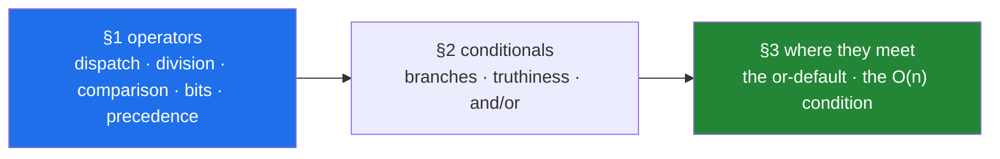

# Day 5 — Operators, precedence, and conditionals

**Phase 1 · Python foundations · Module 1** · `PY-03` (arithmetic, bitwise, comparison and assignment
operators; precedence) and `PY-04` (conditionals and truthiness). Yesterday explained what objects
are. Today explains what happens when you put a symbol between two of them, and what happens when you
put the result in an `if`.

> **Yesterday:** identity, type and value — a name is a label, some objects can change, and two famous
> traps come out of it.
> **Today:** every operator is a method call on the left operand, precedence decides what groups with
> what, and `if x:` is a function call you did not know you were making.
> **Tomorrow:** loops, `break`/`continue`, and the capped retry — the shape every agent loop reuses.

> **Read this hub first**, then work through `parts/` in order. No time estimate here or anywhere — a
> day is a unit of subject, not of hours (Principle 17).

---

## §1 The story

The bill at the end of a meal: food 400, service charge 100, and 18% tax on top.

Two people at the table work out the total and get different numbers, and neither of them made an
arithmetic mistake. One added the food and the service first, then took 18% of the 500. The other
took 18% of the service charge alone. They are arguing about the bill; what they are actually arguing
about is which two numbers the 18% was attached to, and nothing on the piece of paper settles it.

Yesterday was about what a thing *is*. Today is about what happens when two things meet — and the
lesson that keeps coming back is that the dangerous failures here are the ones that **produce a
number instead of an error**. An error stops the program and points at the line. A wrong number keeps
going and turns up in a report.

Six lines of code, none of which raise.

```text
total = base + surcharge * 1.18
if user.is_admin or user.is_owner and resource.is_public:
retries = config.get("retries") or 3
if page:
if row["score"]:
if paper_id not in seen:
```

The first charges tax on the wrong number. The second lets any administrator read any private
document. The third gives three retries to a team that explicitly asked for none, on an endpoint that
charges money each time. The fourth silently skips page zero. The fifth throws away every paper the
model scored at exactly zero. The sixth is correct, and turns an eleven-second job into an overnight
one.

Not one of them produces a traceback. Every one of them produced a real incident somewhere. And every
one is a consequence of something you can learn in an afternoon:

- **An operator is not an instruction, it is a question the left operand answers** — which is why `&`
  on two numbers combines bits and `&` on two columns filters rows, and why `+` on your own class can
  work at all.
- **Precedence decides the grouping before anything is evaluated** — and four particular pairs of
  neighbours cause almost every real bug.
- **`if x:` calls `bool(x)`** — which asks the object, which means an object can refuse, and which
  means "empty", "missing" and "zero" get collapsed into one branch unless you stop them.
- **`and` and `or` return an operand rather than a boolean**, and stop evaluating as soon as the
  answer is decided.

Yesterday's day was about what a thing *is*. Today is about what happens when two things meet, and the
recurring lesson is the same one: **the dangerous failures are the ones that produce a value.** An
exception stops the program and points at the line. A number keeps going and shows up in a report.



---

## §2 The map

**What the section numbers mean today.** Two IDs, so one section per ID plus a synthesis:
**1.x** is `PY-03` — every operator is a method call, and what that buys and costs; **2.x** is `PY-04`
— branching and the truth value that drives it; **3.x** is where an operator sits inside a condition,
which is where both of the day's headline bugs live.

### Section 1 — operators: dispatch, division, comparison, bits, precedence (`PY-03`)

| Part | What it answers | Level |
|---|---|---|
| [1.1 An operator is a method call](parts/01-operators/1.1-an-operator-is-a-method-call.md) | What exactly happens when Python evaluates `a + b`? | `foundation` |
| [1.2 The two divisions](parts/01-operators/1.2-the-two-divisions.md) | Why is `-7 // 2` equal to `-4` and `-7 % 3` equal to `2`? | `foundation` |
| [1.3 Comparison and chaining](parts/01-operators/1.3-comparison-and-chaining.md) | What does `a < b < c` do that `a < b and b < c` does not? | `working` |
| [1.4 `==` is overloadable and `is` is not](parts/01-operators/1.4-equals-is-overloadable-is-is-not.md) | Why is `x is None` trustworthy when `x == None` is not? | `working` |
| [1.5 Bitwise, and the pandas mask](parts/01-operators/1.5-bitwise-and-the-mask.md) | Why must a dataframe filter use `&` and never `and`? | `working` |
| [1.6 Precedence and associativity](parts/01-operators/1.6-precedence-and-associativity.md) | Which four operator pairs cause almost every silent bug? | `production` |

### Section 2 — conditionals and the truth value that drives them (`PY-04`)

| Part | What it answers | Level |
|---|---|---|
| [2.1 `if`, `elif`, `else`, and the indent](parts/02-conditionals/2.1-if-elif-else-and-the-indent.md) | What does `elif` do that a second `if` does not? | `foundation` |
| [2.2 Truthiness](parts/02-conditionals/2.2-truthiness.md) | What are the three rules `bool(x)` follows, in order? | `working` |
| [2.3 Why `if df:` raises](parts/02-conditionals/2.3-if-df-raises.md) | What four things could `if df:` have meant? | `production` |
| [2.4 `and`/`or` return an operand](parts/02-conditionals/2.4-and-or-return-operands.md) | Why does `0 and 5` print `0` rather than `False`? | `working` |
| [2.5 The conditional expression and the guard clause](parts/02-conditionals/2.5-the-conditional-expression.md) | When is a choice a value and when is it an action? | `production` |

### Section 3 — where an operator meets a condition

| Part | What it answers | Level |
|---|---|---|
| [3.1 The `or`-default and the falsy zero](parts/03-the-or-trap/3.1-the-or-default-and-falsy-zero.md) | Which six values does `x or default` silently throw away? | `production` |
| [3.2 `in` is an operator](parts/03-the-or-trap/3.2-in-is-an-operator.md) | Why is the same `if` line instant on one container and quadratic on another? | `production` |

---

## §3 Setup — run this

**No new packages today.** Everything is the language itself plus `ast`, `timeit`, `time`, `math` and
`dataclasses` from the standard library. Module 1 is the language before any library (Principle 2), and
`pandas` deliberately stays uninstalled until Day 26 — parts 1.5 and 2.3 reproduce its behaviour in
plain Python so you meet the error before you meet the dependency.

```bash
mkdir -p src/setu tests notebooks
touch src/setu/conditions.py tests/test_conditions.py

# a scratchpad for today - the notebook is never the deliverable (P6)
touch notebooks/day-05-scratch.ipynb

# the parser you will use to settle every precedence argument (part 1.6)
uv run python -c "import ast; print(ast.dump(ast.parse('a or b and c', mode='eval').body, annotate_fields=False))"

# confirm the two rules that enforce today's lessons are active
uv run ruff rule E711
uv run ruff rule E712
```

| What | Where it comes from | Part |
|---|---|---|
| `NotImplemented`, dunder methods | builtins | [1.1](parts/01-operators/1.1-an-operator-is-a-method-call.md) |
| `divmod`, `math.ceil` | builtins, standard library | [1.2](parts/01-operators/1.2-the-two-divisions.md) |
| `sorted`, `key=` | builtins | [1.3](parts/01-operators/1.3-comparison-and-chaining.md) |
| `object()` as a sentinel, `dataclasses` | builtins, standard library | [1.4](parts/01-operators/1.4-equals-is-overloadable-is-is-not.md) |
| `zip(..., strict=True)` | builtins | [1.5](parts/01-operators/1.5-bitwise-and-the-mask.md) |
| `ast.parse`, `ast.dump` | standard library | [1.6](parts/01-operators/1.6-precedence-and-associativity.md) |
| `timeit`, `time.perf_counter` | standard library | [3.2](parts/03-the-or-trap/3.2-in-is-an-operator.md) |
| ruff's `E711`, `E712`, `SIM108` | already selected on [Day 2](../day-02-quality-gate/parts/01-linting/1.2-choosing-rule-families.md) | [1.4](parts/01-operators/1.4-equals-is-overloadable-is-is-not.md), [3.1](parts/03-the-or-trap/3.1-the-or-default-and-falsy-zero.md) |

---

## §4 Build brief

Two files are yours. Yesterday's `src/setu/objects.py` stays; today adds a sibling.

**1. `src/setu/conditions.py`** — the helpers that turn today's traps into things your code cannot do
by accident.

```python
"""Tools for defaults, membership and truth, with the traps of Day 5 designed out.

Every function here is pure. None of them uses `or` for a default (part 3.1).
"""

from __future__ import annotations

from typing import Any

MISSING = object()
"""Sentinel meaning 'no value supplied' - distinct from None (part 1.4)."""


def coalesce(value: Any, default: Any) -> Any:
    """Return `value` unless it is None. A zero, an empty string and False all survive.

    This is the function that `value or default` should have been (part 3.1).
    """
    # TODO(me): one line, and the operator matters. Write the docstring example
    # that proves coalesce(0, 3) is 0.
    raise NotImplementedError


def config_value(config: dict[str, Any], key: str, default: Any) -> Any:
    """Read `key` from `config`, treating both a missing key and a stored None as absent.

    Part 3.1 explains why dict.get alone is not enough for data parsed from JSON.
    """
    # TODO(me): two questions asked in order. Do not use `or`.
    raise NotImplementedError


def parse_flag(raw: str | None, default: bool) -> bool:
    """Turn an environment-variable string into a bool without trusting truthiness.

    "0", "false", "no", "off" and "" are False; "1", "true", "yes", "on" are True.
    Anything else is an error, not a guess (part 2.2).
    """
    # TODO(me): decide what to do with unrecognised input BEFORE writing the code,
    # and write a comment saying why. Silently defaulting is a choice; so is raising.
    raise NotImplementedError


def is_faster_membership(container: Any) -> bool:
    """True when `in` on this container is O(1) rather than a scan (part 3.2).

    A set, frozenset, dict and range qualify. A list, tuple and str do not.
    """
    # TODO(me): you cannot answer this by timing it - the function must be instant.
    # What can you ask ABOUT the type that decides it? Name your reasoning in a comment.
    raise NotImplementedError


def dedup_preserving_order(items: list[str]) -> list[str]:
    """Remove duplicates, keep first-seen order, and stay linear (part 3.2).

    A list for `seen` makes this quadratic. Do not use one.
    """
    # TODO(me): the seen-collection is the whole exercise. Day 8 times this properly.
    raise NotImplementedError
```

**2. Reproduce the two silent bugs in the notebook, then throw the notebook away.**
[1.6](parts/01-operators/1.6-precedence-and-associativity.md) and
[3.1](parts/03-the-or-trap/3.1-the-or-default-and-falsy-zero.md) both describe incidents that produce
a value rather than an error. In `notebooks/day-05-scratch.ipynb`: build the admin/owner/public truth
table by hand and find the two rows where the two groupings disagree; then write
`retries = config.get("retries") or 3` with `{"retries": 0}` and watch it return `3`. **The notebook is
not committed** (Principle 6); the understanding graduates into `src/setu/conditions.py` and its tests.

---

## §5 The eval that must be able to fail

Create `tests/test_conditions.py`. Everything here runs offline and belongs in `./m check`.

```python
"""Day 5: prove the operator and truthiness rules rather than believing them."""

from __future__ import annotations

import pytest

from setu.conditions import (
    coalesce,
    config_value,
    dedup_preserving_order,
    is_faster_membership,
    parse_flag,
)


@pytest.mark.parametrize("falsy", [0, 0.0, "", [], {}, False])
def test_coalesce_keeps_every_falsy_value(falsy: object) -> None:
    """Part 3.1: the six values `or` throws away."""
    # TODO(me): assert coalesce(falsy, "DEFAULT") is the falsy value itself, and
    # assert the `or` version is NOT. Both halves - a test that only checks the
    # fix never proves there was a bug.
    raise NotImplementedError


def test_config_value_distinguishes_missing_key_from_stored_none() -> None:
    """Part 3.1: JSON null and an absent key are different, and both mean 'use the default'."""
    # TODO(me): three cases - key absent, key present with None, key present with 0.
    # The third is the one that catches a lazy implementation.
    raise NotImplementedError


@pytest.mark.parametrize(
    ("raw", "expected"),
    [("1", True), ("true", True), ("ON", True), ("0", False), ("false", False), ("", False)],
)
def test_parse_flag_is_not_fooled_by_truthiness(raw: str, expected: bool) -> None:
    """Part 2.2: bool("false") is True, which is why this function exists."""
    # TODO(me): assert parse_flag(raw, default=False) is expected. Then add the
    # case your build-brief comment decided on for unrecognised input.
    raise NotImplementedError


def test_is_faster_membership_names_the_right_containers() -> None:
    """Part 3.2: the O(1) containers and the O(n) ones."""
    # TODO(me): set, frozenset, dict and range on one side; list, tuple and str
    # on the other. Then answer in a comment: which side is a generator on, and why
    # is that question different from the others?
    raise NotImplementedError


def test_dedup_preserves_order_and_is_not_quadratic() -> None:
    """Part 3.2: correctness first, then the complexity class."""
    # TODO(me): assert the order is first-seen. Then time it at n and 4n and assert
    # the ratio is under 8 - a quadratic implementation gives about 16. Mark it
    # @pytest.mark.slow if it takes more than a moment (Day 2, part 3.3).
    raise NotImplementedError


def test_chained_comparison_evaluates_the_middle_once() -> None:
    """Part 1.3: the difference the expanded form does not preserve."""
    # TODO(me): write a function that appends to a list and returns a fixed value.
    # Assert the chained form calls it once and the `and` form calls it twice.
    raise NotImplementedError


def test_precedence_of_and_over_or_is_not_what_it_reads_like() -> None:
    """Part 1.6: the permissions bug, pinned by a test."""
    # TODO(me): assert that `False or True and False` is False, and that
    # `(False or True) and False` is also False - then find the input where the
    # two DIFFER and assert both values. That input is the security hole.
    raise NotImplementedError
```

Run them and watch every one fail before you write a line:

```bash
uv run python -m pytest tests/test_conditions.py -v
```

Then implement, then **break each one on purpose**:

- Change `coalesce` to use `or` → the parametrised test goes red **six times**, once per falsy value.
  Read all six failures; they are the whole of part 3.1. Restore it.
- Change `config_value` to plain `dict.get(key, default)` → only the stored-`None` case goes red. That
  single failing case is why `get` alone is not enough. Restore it.
- Change `parse_flag` to `return bool(raw)` → the `"0"`, `"false"` and `"ON"` cases go red for three
  different reasons. Say each one out loud. Restore it.
- Change `dedup_preserving_order`'s `seen` to a list → **the order test still passes** and only the
  timing assertion goes red. Sit with that: the correctness test cannot see this bug at all, which is
  why the ratio assertion is in the suite.

That last item is today's meeting of
[Day 2, 3.1](../day-02-quality-gate/parts/03-pytest/3.1-the-test-that-can-go-red.md) with part 3.2: a
performance bug is invisible to a correctness test, and the only test that can go red for it is one
that measures growth rather than time.

---

## §6 Request budget

| Resource | Today |
|---|---|
| LLM API calls | **0** — no model is called on this day |
| Network requests | **0** — nothing today leaves your machine |
| Free-tier quota | none consumed |
| Cost | **$0** (Principle 5) |

Part 3.2's timings run locally and part 1.5's pandas error is reproduced in pure Python, so today adds
tests to the free path only
([Day 2, 5.3](../day-02-quality-gate/parts/05-ci/5.3-caching-and-never-spending-a-quota.md)).

---

## §7 Traps

- **`1 + obj` fails while `obj + 1` works** — the class forgot `__radd__` —
  [1.1](parts/01-operators/1.1-an-operator-is-a-method-call.md).
- **Raising `TypeError` inside `__add__`** instead of returning `NotImplemented` breaks every other
  type's ability to interoperate — [1.1](parts/01-operators/1.1-an-operator-is-a-method-call.md).
- **`7 / 2` is `3.5` and `list[7 / 2]` is a `TypeError`** — `/` always returns a float —
  [1.2](parts/01-operators/1.2-the-two-divisions.md).
- **`int(x / y)` and `x // y` disagree on every negative input** —
  [1.2](parts/01-operators/1.2-the-two-divisions.md).
- **`-7 % 3` is `2`, not `-1`** — the remainder takes the sign of the divisor —
  [1.2](parts/01-operators/1.2-the-two-divisions.md).
- **`0.3 % 0.1` is `0.0999...`** — never test divisibility on floats —
  [1.2](parts/01-operators/1.2-the-two-divisions.md).
- **Rewriting `low < f() < high` as two `and`ed comparisons calls `f()` twice** —
  [1.3](parts/01-operators/1.3-comparison-and-chaining.md).
- **One `None` in a column makes the whole `sorted()` raise** —
  [1.3](parts/01-operators/1.3-comparison-and-chaining.md).
- **`sorted(["10", "9"])` puts `"10"` first** and does not raise —
  [1.3](parts/01-operators/1.3-comparison-and-chaining.md).
- **`x == None` asks the object; a permissive `__eq__` answers `True`** —
  [1.4](parts/01-operators/1.4-equals-is-overloadable-is-is-not.md).
- **Defining `__eq__` makes your class unhashable** unless you define `__hash__` too —
  [1.4](parts/01-operators/1.4-equals-is-overloadable-is-is-not.md).
- **`and`/`or` cannot be overloaded**, which is why array libraries borrow `&`/`|` —
  [1.5](parts/01-operators/1.5-bitwise-and-the-mask.md).
- **`&` binds tighter than `==`**, so every mask operand needs parentheses —
  [1.5](parts/01-operators/1.5-bitwise-and-the-mask.md).
- **`~5` is `-6`**, not a byte flip — [1.5](parts/01-operators/1.5-bitwise-and-the-mask.md).
- **`and` binds tighter than `or`** — the permissions hole —
  [1.6](parts/01-operators/1.6-precedence-and-associativity.md).
- **`-2 ** 2` is `-4`** and `2 ** 3 ** 2` is `512` —
  [1.6](parts/01-operators/1.6-precedence-and-associativity.md).
- **A fixture full of zeros and ones cannot catch a precedence bug** —
  [1.6](parts/01-operators/1.6-precedence-and-associativity.md).
- **A stack of `if`s over thresholds returns the LAST match, not the first** —
  [2.1](parts/02-conditionals/2.1-if-elif-else-and-the-indent.md).
- **Branch order is part of the specification**; loosest-first makes later branches unreachable —
  [2.1](parts/02-conditionals/2.1-if-elif-else-and-the-indent.md).
- **Four spaces of indentation change which loop a `return` belongs to** —
  [2.1](parts/02-conditionals/2.1-if-elif-else-and-the-indent.md).
- **An instance of your own class is always truthy** unless it defines `__bool__` or `__len__` —
  [2.2](parts/02-conditionals/2.2-truthiness.md).
- **`bool("false")` is `True`** — every environment variable is a string —
  [2.2](parts/02-conditionals/2.2-truthiness.md).
- **`float("nan")` is truthy** — "missing" is not "false" —
  [2.2](parts/02-conditionals/2.2-truthiness.md).
- **`if generator:` is always `True`** regardless of whether it will yield anything —
  [2.2](parts/02-conditionals/2.2-truthiness.md).
- **`if df:`, `not series`, `series or x` and `a and b` on columns are all the same `bool()` error** —
  [2.3](parts/02-conditionals/2.3-if-df-raises.md).
- **`df.empty` is `False` for a frame of all-NaN rows** —
  [2.3](parts/02-conditionals/2.3-if-df-raises.md).
- **`0 and 5` returns `0`, not `False`** — logging it prints a count —
  [2.4](parts/02-conditionals/2.4-and-or-return-operands.md).
- **Reversing the operands of a guard turns it into an `AttributeError`** —
  [2.4](parts/02-conditionals/2.4-and-or-return-operands.md).
- **A function annotated `-> bool` that ends in a bare `and` chain returns `None`** —
  [2.4](parts/02-conditionals/2.4-and-or-return-operands.md).
- **The `else` in a conditional expression is mandatory** —
  [2.5](parts/02-conditionals/2.5-the-conditional-expression.md).
- **A branch that forgets to assign gives `UnboundLocalError` at run time** —
  [2.5](parts/02-conditionals/2.5-the-conditional-expression.md).
- **`config.get("retries") or 3` returns `3` for a configured `0`** —
  [3.1](parts/03-the-or-trap/3.1-the-or-default-and-falsy-zero.md).
- **`x or True` can never be `False`** — the idiom cannot express the setting —
  [3.1](parts/03-the-or-trap/3.1-the-or-default-and-falsy-zero.md).
- **`dict.get(k, d)` returns a stored `None`, not `d`** —
  [3.1](parts/03-the-or-trap/3.1-the-or-default-and-falsy-zero.md).
- **`x in a_list` inside a loop is a nested loop in disguise** —
  [3.2](parts/03-the-or-trap/3.2-in-is-an-operator.md).
- **`x in a_dict` tests keys, never values** — [3.2](parts/03-the-or-trap/3.2-in-is-an-operator.md).
- **`x in a_generator` consumes it, so the second test gives a wrong answer** —
  [3.2](parts/03-the-or-trap/3.2-in-is-an-operator.md).
- **Switching a container from list to set can turn a working `in` into `TypeError: unhashable`** —
  [3.2](parts/03-the-or-trap/3.2-in-is-an-operator.md).

---

## §8 Verify before you code

Written **2026-08-25**. Today is the language itself, so the authority is the language reference
rather than any package's docs — and unlike a pinned version, these pages change rarely:

- <https://docs.python.org/3/reference/datamodel.html#emulating-numeric-types> — the full list of
  operator dunders, including every reflected form, and the paragraph on `NotImplemented`.
  [1.1](parts/01-operators/1.1-an-operator-is-a-method-call.md) is the first two subsections.
- <https://docs.python.org/3/reference/expressions.html#operator-precedence> — **the precedence table,
  in the language's own words.** Bookmark this one; [1.6](parts/01-operators/1.6-precedence-and-associativity.md)
  reproduces it but the reference is authoritative.
- <https://docs.python.org/3/reference/expressions.html#comparisons> — chained comparison defined
  exactly, including the "evaluated only once" clause.
- <https://docs.python.org/3/reference/expressions.html#membership-test-operations> — what `in` falls
  back to when there is no `__contains__`.
- <https://docs.python.org/3/reference/expressions.html#boolean-operations> — the definition of `and`
  and `or` as returning an operand.
- <https://docs.python.org/3/library/stdtypes.html#truth-value-testing> — the complete falsy list.
- <https://docs.python.org/3/library/stdtypes.html#numeric-types-int-float-complex> — the footnote
  defining floor division and the modulo identity.
- <https://docs.python.org/3/library/ast.html#ast.dump> — the tool part 1.6 uses to settle grouping
  arguments.
- `uv run ruff rule E711`, `uv run ruff rule E712`, `uv run ruff rule SIM108` — the three rules that
  enforce today's lessons, read from the linter you actually have installed rather than from memory.

---

## §9 Say it in an interview

> "Every operator in Python is a method call on the left operand — `a + b` calls `type(a).__add__`, and
> if that returns the `NotImplemented` sentinel Python tries `type(b).__radd__` before raising. That
> one fact explains a lot of things that otherwise look like separate rules: why a class needs
> `__radd__` for `sum()` to work on it, why `&` combines bits on integers and filters rows on a
> dataframe, and why `and` and `or` cannot be overloaded at all — they are keywords, because they have
> to control whether the second operand is evaluated. On the conditional side, `if x:` is not a test
> for existence; it calls `bool(x)`, which asks `__bool__`, then falls back to `__len__` being
> non-zero, and defaults to `True` for a type that defines neither — so an instance of my own class is
> always truthy, and `bool('false')` is `True`, which is why every flag that crosses a text boundary
> needs a real parser. The habit I have built out of that is to ask the specific question rather than
> the vague one: `is None` for absence because `==` lets the object answer and `is` does not, `len(x)`
> for emptiness, an explicit comparison for a number, and `dict.get(key, default)` rather than
> `value or default` — because `or` tests truthiness, so a configured `0` or `False` or empty string
> gets silently replaced by the default. The two I watch for in review are precedence, since `and`
> binds tighter than `or` and `&` binds tighter than `==`, and membership: `x in a_list` inside a loop
> is a nested loop in disguise, and making the container a set changes the complexity class without
> changing the line."

---

## §10 Done when

Every box in [`CHECKLIST.md`](CHECKLIST.md) is ticked, `./m check` is green, and you have **watched a
precedence bug and a falsy-default bug produce a wrong value with no error** — not when a particular
amount of time has passed. Then:

```bash
./m done 5
```

Tomorrow is loops: what `for` actually does, `break` versus `continue`, `for ... else`, and the capped
retry that every agent loop from Day 182 reuses.
