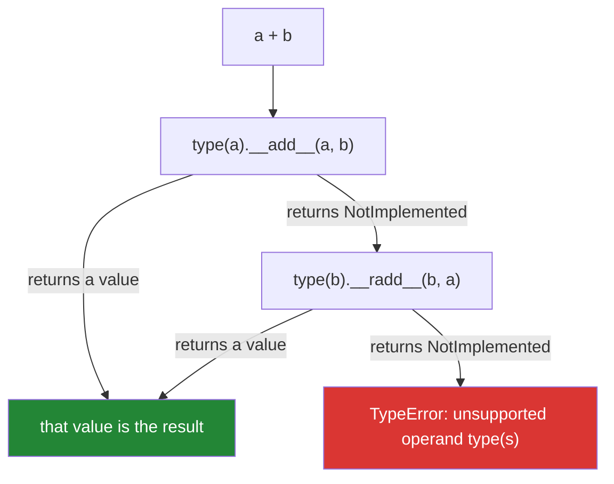

# 1.1 — An operator is a method call

## One-line answer

`a + b` is not a built-in arithmetic instruction — it is Python asking the **object on the left** to
add, and then, if that object declines, asking the object on the right to add in reverse.

---

## The story

Two people are arguing about a library.

The first has written a small class to hold an amount of money. She wants `price + tax` to work, and
she is convinced it cannot, because — she says — adding is something the language does to numbers,
and her thing is not a number. She has written `price.add(tax)` everywhere instead, and the code
reads like a court transcript.

The second opens the interpreter and types `"ab" + "cd"`, then `[1] + [2]`, then `(1,) + (2,)`. Three
different kinds of thing, three sensible answers, one symbol. "If `+` were an arithmetic
instruction," he says, "only one of those could work. So it is not an instruction. It is a question,
and each of those types answers it differently."

She adds nine lines to her class. `price + tax` starts working. Every function in the codebase that
took numbers now takes her objects too, and nobody had to change any of them.

That is the whole of this document. The symbol is a question; the type gives the answer.

---

## The idea in plain language

### An operator is a spelling, not a capability

An **operator** is a symbol that sits between (or before) values and produces a new value: `+`, `-`,
`*`, `/`, `<`, `==`, `in`, `not`. The values it works on are its **operands**.

The instinct everybody starts with is that the interpreter contains a big machine labelled "addition"
and `+` switches it on. That is wrong, and every surprising thing operators do comes from it being
wrong.

What actually happens is a **lookup**. When Python meets `a + b`, it does not look for an addition
machine. It looks at the *type* of `a` and asks that type: do you define what `+` means? The type
answers by providing a method with a special name — for `+`, that name is `__add__`.

So `2 + 3` is, near enough, `(2).__add__(3)`, and `"ab" + "cd"` is `"ab".__add__("cd")`. They give
different answers because `int` and `str` gave different answers to the same question. Nothing about
`+` itself knows arithmetic.

### The special names

Methods with two leading and two trailing underscores are called **dunder methods** — "double
underscore". They are the language's hook points: you never call them directly, but the syntax calls
them for you. The word to know is that Python **dispatches** the operator to the method, where
"dispatch" just means "decides at run time which piece of code to run, based on the type".

| You write | Python calls |
|---|---|
| `a + b` | `type(a).__add__(a, b)` |
| `a - b` | `type(a).__sub__(a, b)` |
| `a * b` | `type(a).__mul__(a, b)` |
| `a / b` | `type(a).__truediv__(a, b)` |
| `a == b` | `type(a).__eq__(a, b)` |
| `a < b` | `type(a).__lt__(a, b)` |
| `x in a` | `type(a).__contains__(a, x)` |
| `-a` | `type(a).__neg__(a)` |
| `a[i]` | `type(a).__getitem__(a, i)` |

Note the last two rows: indexing and negation are operators too. The pattern is completely general.

### The second half nobody is taught: the reflected call

Here is the part that makes `1 + my_object` work at all.

If the left operand's method does not know what to do with the right operand, it does not raise. It
returns a special sentinel value called `NotImplemented` — a single object meaning "I decline; ask
someone else". Python sees that sentinel and tries again from the other side, calling the
**reflected** method on the right operand: `__radd__` instead of `__add__` (the `r` is for
"reflected", sometimes read as "right").

Only if *both* sides decline does Python raise `TypeError`. So the full sequence for `a + b` is:



That two-step dance is why the `TypeError` on
[Day 4, 1.5](../../../day-04-objects/parts/01-objects/1.5-why-str-plus-int-is-a-typeerror.md) says
`unsupported operand type(s) for +` and names **both** types. It is not reporting one failure; it is
reporting that the negotiation ran out of parties.

### Why this is the first thing on operator day

Every remaining surprise in Section 1 is a consequence:

- `/` and `//` are different methods, so they can return different types
  ([1.2](1.2-the-two-divisions.md)).
- `==` is a method a class can define, and `is` is not a method at all
  ([1.4](1.4-equals-is-overloadable-is-is-not.md)).
- `&` on a pandas Series does something entirely unlike `&` on two integers, because `Series` wrote
  its own `__and__` ([1.5](1.5-bitwise-and-the-mask.md)).

Learn the dispatch once and those stop being three facts to memorise.

---

## Why Setu needs it

- **[1.5](1.5-bitwise-and-the-mask.md), today,** explains the most common pandas error a beginner
  hits, and the explanation is "`Series.__and__` is elementwise and `bool.__and__` is not".
- **Day 12 builds the `Paper` object** (`PY-13`) and **Day 15 adds dunder methods** (`PY-17`,
  `PY-18`) — `__eq__`, `__lt__`, `__repr__`. That day is this document, applied. You will be choosing
  which operators your own type answers.
- **Day 26's pandas** (`PD-01`) is a library whose entire interface is overloaded operators. A
  DataFrame comparison returning a DataFrame of booleans instead of one boolean is `__eq__` doing its
  job, and it will look like a bug until this document is second nature.
- **Day 20's NumPy** (`NP-01`): `arr * 2` multiplying every element is `ndarray.__mul__`. Vectorised
  code *is* operator overloading, and Day 25's broadcasting rules are the rules that method follows.
- **Day 155's vector search** compares embeddings with `@` (matrix multiply, `__matmul__`). The
  symbol is one character; the method behind it is the whole retrieval step.

---

## The mechanism

Watch the dispatch happen. This class does nothing except announce which method the syntax reached:

```python
"""An operator is a method call. This class proves it by narrating its own dunders."""


class Loud:
    """Answers arithmetic questions by saying which method was asked."""

    def __init__(self, name: str) -> None:
        self.name = name

    def __repr__(self) -> str:
        return f"Loud({self.name!r})"

    def __add__(self, other: object) -> str:
        return f"{self!r}.__add__({other!r}) ran"

    def __radd__(self, other: object) -> str:
        return f"{self!r}.__radd__({other!r}) ran"


left = Loud("left")
right = Loud("right")

print(left + right)  # left's __add__ answers first
print(1 + left)  # int declines, so left's __radd__ answers
print(left + 1)  # left's __add__ answers, and never consults int
```

**Line by line:**

- `class Loud:` — a plain class with no numeric machinery at all, which is the point: `+` still works
  on it, because `+` only ever asks.
- `def __repr__` — the *representation* dunder, called by `repr()` and by the `!r` in an f-string.
  Without it the output reads `<__main__.Loud object at 0x...>` and you cannot tell the two instances
  apart. `!r` is covered properly on
  [Day 7](../../../day-07-strings/parts/03-formatting/3.3-repr-and-the-debugging-f-string.md).
- `def __add__(self, other)` — the method `+` dispatches to. `self` is the **left** operand, `other`
  is the right. That asymmetry is the whole reason a reflected version has to exist.
- `print(left + right)` — both operands are `Loud`. Python calls the left one's `__add__`, it returns
  a string, and the negotiation stops there. `right.__radd__` is never consulted.
- `print(1 + left)` — the left operand is an `int`. `int.__add__(1, left)` has no idea what a `Loud`
  is, so it returns `NotImplemented`, and Python falls back to `left.__radd__(1)`. **This is the only
  way `1 + your_object` can ever work**, and it is why a numeric class defining only `__add__` is
  half-finished.
- `print(left + 1)` — `Loud.__add__` answers immediately. Note that it never checked whether it
  *should*; a real class would inspect `other` and return `NotImplemented` for types it cannot
  handle, so the fallback can do its job.

Now the sentinel itself, which is normally invisible:

```python
"""NotImplemented is a value, not an exception. Seeing it explains the fallback."""

print(int.__add__(1, "two"))  # -> NotImplemented, not a TypeError
print(str.__add__("one", 2))  # -> NotImplemented
print(type(NotImplemented))
print((1).__add__(2))  # the ordinary case: a real answer
```

**Line by line:**

- `int.__add__(1, "two")` — calling the dunder **directly** shows what the operator machinery sees.
  It returns `NotImplemented` and raises nothing. Writing `1 + "two"` raises only because Python then
  tried `str.__radd__`, got the sentinel again, and gave up.
- `str.__add__("one", 2)` — the same refusal from the other side. Two refusals is what a `TypeError`
  actually is.
- `type(NotImplemented)` — prints `<class 'NotImplementedType'>`. It is a singleton object like
  `None`, and it is **not** the same thing as `NotImplementedError`, which is an exception class you
  raise inside an unfinished method. Confusing the two is common; the sentinel is returned, the
  exception is raised.
- `(1).__add__(2)` — the parentheses are required. Written as `1.__add__(2)` the `1.` starts parsing
  as a float and you get a `SyntaxError`. The line exists here only to show that the ordinary case
  goes down the same path as the failing one.

And the nine lines from the story — a type that joins in:

```python
"""A class that answers +, and answers it from either side."""

from __future__ import annotations


class Rupees:
    """Whole paise, stored as an int. Never a float - Day 4, part 1.3 says why."""

    def __init__(self, paise: int) -> None:
        self.paise = paise

    def __repr__(self) -> str:
        return f"Rupees({self.paise})"

    def __add__(self, other: object) -> "Rupees":
        if isinstance(other, Rupees):
            return Rupees(self.paise + other.paise)
        if isinstance(other, int):
            return Rupees(self.paise + other)
        return NotImplemented

    __radd__ = __add__


print(Rupees(250) + Rupees(175))
print(50 + Rupees(250))
print(sum([Rupees(100), Rupees(200)]))
```

**Line by line:**

- `self.paise = paise` — money in the smallest integer unit. `Rupees(2.5)` is not offered on purpose;
  [Day 4, 1.3](../../../day-04-objects/parts/01-objects/1.3-numbers-and-bool.md) established that a
  float cannot represent `2.50` exactly, and a money type built on one is a defect waiting for a
  reconciliation report.
- `if isinstance(other, Rupees)` — the check that makes the class well behaved. `isinstance(x, T)`
  asks whether `x` is of type `T` (or a subclass); it is the standard way to branch on type, and Day
  13 (`PY-14`) revisits why it beats `type(x) == T`.
- `return NotImplemented` — **the line that separates a good numeric class from a rude one.** A class
  that raises `TypeError` here instead has hijacked the negotiation: the right operand never gets
  asked, so `Rupees(1) + SomeOtherMoneyType()` can never work even if the other type knew how.
- `__radd__ = __add__` — addition commutes, so the reflected method is the same function. Assigning
  the name is idiomatic and avoids a second copy that can drift. For a non-commutative operator like
  `-` you must write `__rsub__` separately and reverse the operands inside it.
- `sum([...])` — this is the payoff, and it is why `int` is in the `isinstance` check. `sum` starts
  from `0` and computes `0 + Rupees(100)` first, which is `int.__add__` declining and
  `Rupees.__radd__` catching. **Without `__radd__` and the `int` branch, `sum()` on your own type
  raises**, which is exactly the wall the person in the story hit.
- `-> "Rupees"` — the annotation is a lie of convenience: the method really can return the sentinel.
  Annotations are not enforced at run time (Day 19, `PY-23`), and the honest alternative is verbose
  enough that the standard library writes it this way too.

---

## When it breaks

**Both sides declined:**

```text
>>> [1, 2] + (3, 4)
Traceback (most recent call last):
  File "<stdin>", line 1, in <module>
TypeError: can only concatenate list (not "tuple") to list
```

**What it means.** `list.__add__` returned `NotImplemented` for a tuple, and `tuple.__radd__` does
not exist, so the negotiation ended. The message is `list`'s own wording — a type may customise it —
and the smallest fix is `[1, 2] + list((3, 4))`. Note what is *not* offered: Python will not guess
that you meant to concatenate a list to a tuple, because there is no correct answer to what the
result type should be.

**The class that only defined half of it:**

```text
>>> class Half:
...     def __add__(self, other): return "ok"
...
>>> Half() + 1
'ok'
>>> 1 + Half()
Traceback (most recent call last):
  File "<stdin>", line 1, in <module>
TypeError: unsupported operand type(s) for +: 'int' and 'Half'
```

**What it means.** One direction works and the other does not. `int.__add__` declined, and `Half` has
no `__radd__` to catch it. This is the most common defect in a hand-written numeric class, and it
usually surfaces the first time somebody calls `sum()`.

**The rude class that raised instead of declining:**

```text
>>> class Rude:
...     def __add__(self, other): raise TypeError("Rude cannot add " + type(other).__name__)
...
>>> Rude() + Rupees(1)
Traceback (most recent call last):
  File "<stdin>", line 2, in __add__
TypeError: Rude cannot add Rupees
```

**What it means.** The traceback points at line 2 *inside `__add__`* rather than at the expression —
that is the tell. Because `Rude` raised rather than returning `NotImplemented`, `Rupees.__radd__` was
never given a chance, and a combination that could have worked cannot. **Returning the sentinel is
not politeness; it is how the protocol composes.**

**And the sentinel mistaken for the exception:**

```text
>>> def unfinished():
...     return NotImplemented
...
>>> if unfinished():
...     print("this runs")
...
this runs
<stdin>:1: DeprecationWarning: NotImplemented should not be used in a boolean context
```

**What it means.** `NotImplemented` is truthy, so a function returning it instead of raising
`NotImplementedError` produces a silent wrong answer in a condition. The warning arrived because the
language expects this exact confusion. In an unfinished method you want `raise NotImplementedError` —
which is what the `TODO(me)` stubs in this project's build briefs use.

---

## In production

**Overload operators for types that are genuinely value-like, and resist everywhere else.** A money
amount, a vector, a duration, a unit-carrying quantity, a query filter — these have an obvious
arithmetic or comparison meaning, and giving them operators makes call sites read like the domain. A
`UserAccount` or an `HttpClient` does not; `client1 + client2` has no meaning a reader can guess, and
a clever overload there costs every future reader a trip to the class definition. The rule that holds
up in review is: **if a reader cannot predict the result type and rough meaning without opening the
class, do not overload.**

**A numeric type is not finished until it declines properly.** In a real codebase the checklist for a
value type is: the forward dunder, the reflected dunder, `NotImplemented` for unknown operands,
`__eq__` with `__hash__` if the type is immutable
([Day 4, 2.5](../../../day-04-objects/parts/02-containers/2.5-hashability.md)), and a `__repr__` a
debugger can print. Miss the reflected method and `sum()` breaks. Miss `NotImplemented` and
interoperating with any other library's numeric type becomes impossible. The standard library's own
`decimal.Decimal` and `datetime.timedelta` are worth reading as reference implementations.

**What changes at scale: dispatch is not free.** Every `+` on your own class is a Python-level method
call — an attribute lookup, a frame, a return. On two integers the interpreter has a fast path that
skips almost all of that. This is invisible on a thousand rows and dominates on ten million, and it is
the actual reason NumPy exists: `arr_a + arr_b` on a million-element array does **one** dispatch into
compiled code, where a Python loop over the same data does a million. Day 20 opens with a timing of
exactly this, and the ratio is usually between fifty and a few hundred.

**The failure mode that only appears with real data** is a partially implemented comparison. A class
defining `__lt__` but not `__le__`, `__gt__` and `__ge__` will sort fine — `sorted` only needs
`__lt__` — and then raise the first time somebody writes `a >= b` in a filter that only runs on the
production path. The defence is `functools.total_ordering`, or writing all four; either way it is a
decision, not an accident.

**The review comment a senior engineer leaves.** On a new `__add__` with no sibling: *"This needs
`__radd__` or `sum()` on a list of these will raise, and it should return `NotImplemented` rather than
raising `TypeError` for unknown types — otherwise nobody else's type can ever interoperate with
ours."*

**The interview question.** *"What happens when you evaluate `a + b`?"* A weak answer says "it adds
them". A strong answer walks the protocol: Python calls `type(a).__add__(a, b)`; if that returns the
`NotImplemented` sentinel, it calls `type(b).__radd__(b, a)`; if that also declines, it raises
`TypeError` naming both types. The follow-up is usually *"so why does `1 + my_decimal` work?"* — and
the answer is `__radd__`. If they push further: the reflected call is tried **first** when the right
operand's type is a subclass of the left's, which is how a subclass gets to override its parent's
arithmetic.

---

## Check yourself

```bash
uv run python -c "
print(int.__add__(1, 'two'))
print('str has __radd__:', hasattr(str, '__radd__'))
try:
    1 + 'two'
except TypeError as exc:
    print('TypeError:', exc)
"
```

Three lines. The first is a value, the second explains why there was no second chance, and the third
is what the user sees. Predict all three before running.

**Answer out loud, without scrolling up:**

> Describe every step Python takes to evaluate `a + b`, including what happens when the left operand
> does not know how. Then say why a class that defines `__add__` but not `__radd__` breaks `sum()`.

---

**Next:** [1.2 — The two divisions, and the remainder that is not what you learned at school](1.2-the-two-divisions.md)
