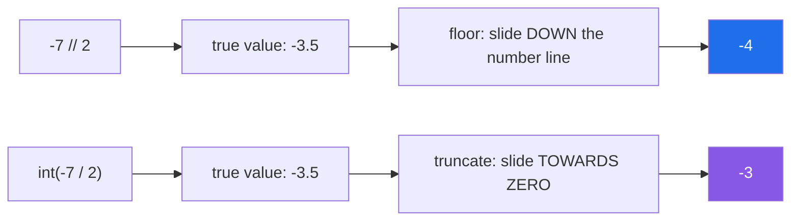

# 1.2 — The two divisions, and the remainder that is not what you learned at school

## One-line answer

`/` always produces a float, `//` rounds the answer **downwards** — towards negative infinity, not
towards zero — and `%` is defined to make `a == (a // b) * b + a % b` true, which is why a negative
number can have a positive remainder.

---

## The story

Twenty-three people need to get to a wedding. Each bus seats ten. How many buses do you book?

Not 2.3. There is no such thing as three-tenths of a bus. You book **three**, and the third one goes
mostly empty, and everybody gets there.

Now the same two numbers, a different question. Twenty-three sweets, ten children, share them out.
Each child gets **two**, and **three** are left over in the bag.

Same numbers. Three different right answers — 2.3, 2, and 3 — because "divide" is not one job. It is
at least three, and which one you want depends entirely on what you are counting.

Programming languages are honest about this and give you separate tools. Python has `/` for the 2.3
answer, `//` for the two-each answer, and `%` for the three-left-over answer. The trouble starts when
somebody reaches for the wrong one, because nothing complains.

A page of results, twenty-three items, ten to a page. Somebody writes `pages = total / per_page` and
the site starts offering page **2.3**. They patch it to `int(total / per_page)`, get `2`, and ship.

Three months later a colleague adds a "credits owed" feature that can go negative. They compute
`int(owed / rate)` on `-23` and `10`, get `-2`, and issue a refund that is one unit short. Every test
passed, because every test used positive numbers.

The same week, a scheduling job that runs every seven days from a fixed date works perfectly for
dates after that date and silently skips dates before it. Same cause, different operator.

Three bugs in one family, and all of them invisible to tests that used the kind of numbers you would
put in a tutorial. **Division in a programming language is not one operation, and it does not round
the way school taught.** The two operators and the sign rule take five minutes to learn and prevent
an entire genre of quiet, expensive defect.

---

## The idea in plain language

### There are two divisions because there are two questions

"Divide twenty-three by ten" has two different useful answers, and languages that offer only one
force you to keep converting.

- **True division** answers *how much*: `2.3`. In Python that is `/`, and it always returns a
  **float** — even when the answer is exact. `10 / 5` is `2.0`, not `2`.
- **Floor division** answers *how many whole times*: `2`. In Python that is `//`. It returns an
  `int` when both operands are ints, and a float with no fractional part when either is a float
  (`23.0 // 10` is `2.0`).

The name **floor** is the important word. The floor of a number is the largest whole number that is
not greater than it — you slide **down** the number line to the next integer. For positive numbers
that looks identical to "chop off the decimals". For negative numbers it is not, and that difference
is the story's second bug.

| Expression | Value | Why |
|---|---|---|
| `7 / 2` | `3.5` | true division, always a float |
| `7 // 2` | `3` | floor of 3.5 slides down to 3 |
| `-7 / 2` | `-3.5` | true division does not care about sign |
| `-7 // 2` | `-4` | **floor of -3.5 slides down to -4**, away from zero |
| `int(-7 / 2)` | `-3` | `int()` truncates *towards zero* — a different operation |
| `7.0 // 2` | `3.0` | a float operand makes a float result |

The trap is the last two rows sitting next to each other. `//` and `int(x / y)` agree on every
positive input and disagree on every negative one, so a codebase can use them interchangeably for
years and then split.

### The remainder follows from the floor

`%` is the **modulo** operator: the amount left over. Its definition is not "the leftover from
chopping", it is whatever makes this identity hold:

```text
a == (a // b) * b + (a % b)
```

That is not a Python quirk; it is the contract that makes remainders useful. Rearranged, it says
`a % b == a - (a // b) * b`. Since `//` floors, the remainder ends up with **the sign of the
divisor** — not the sign of the dividend.

- `7 % 3` is `1` — because `7 // 3` is `2`, and `7 - 2*3 = 1`.
- `-7 % 3` is `2` — because `-7 // 3` is `-3`, and `-7 - (-3)*3 = 2`. **Positive**, even though the
  dividend was negative.
- `7 % -3` is `-2` — because `7 // -3` is `-3`, and `7 - (-3)*(-3) = -2`. **Negative**, because the
  divisor was.

If you have written C, Java, JavaScript or Go, this is genuinely different: those languages truncate
towards zero, so `-7 % 3` is `-1` there. Neither is wrong; they picked a different half of the same
identity. Python's choice is the one that makes `%` safe for cyclic things — days of the week, hours
on a clock, indices that wrap — because the result is always in `[0, b)` for a positive `b`. That is
exactly what the story's back-fill job needed and did not get, because it was written by someone
carrying the C rule in their head.



### `divmod` exists because you usually want both

`divmod(a, b)` returns the pair `(a // b, a % b)` in one call. It is not merely shorthand: it is one
operation instead of two, so it cannot drift if someone edits one line and not the other, and for
large integers it is genuinely cheaper.

---

## Why Setu needs it

- **[Day 6's capped retry](../../../day-06-loops/parts/03-capped-retry/3.2-the-capped-retry-from-scratch.md)**
  computes a backoff delay, and any scheme that cycles or halves is division.
- **Day 8 splits data into batches** and Day 11's generators
  ([`PY-11`](../../../day-08-containers/parts/01-sequences/1.1-a-list-is-a-dynamic-array.md) leads
  into it) chunk a large input into fixed-size pieces. The number of chunks for `n` items in batches
  of `k` is `-(-n // k)` — the ceiling-division idiom in the mechanism below — and getting it wrong
  drops the last partial batch.
- **Day 76's train/test split** (`ML-`) turns a fraction into a row count. A split that uses `int()`
  where it should use `//`, or the reverse, silently changes the size of your test set — and a test
  set whose size depends on rounding is a reproducibility bug (Principle 4).
- **Day 164's chunking for retrieval** (`RAG-04`) computes overlap positions with `%`. An off-by-one
  there does not raise; it just quietly drops or duplicates text at every chunk boundary, and the
  only symptom is slightly worse retrieval.
- **Day 95's gradient descent** (`ML-06`) prints progress every `n` steps with `if step % n == 0`,
  the single most common use of `%` in the whole curriculum.

---

## The mechanism

The full table, computed rather than asserted:

```python
"""The two divisions and the remainder, with the identity that ties them together."""

pairs = [(7, 3), (-7, 3), (7, -3), (-7, -3)]

print(f"{'a':>4} {'b':>4} {'a/b':>8} {'a//b':>6} {'a%b':>5}   identity holds")
for a, b in pairs:
    quotient = a // b
    remainder = a % b
    holds = quotient * b + remainder == a
    print(f"{a:>4} {b:>4} {a / b:>8.3f} {quotient:>6} {remainder:>5}   {holds}")
```

**Line by line:**

- `pairs = [...]` — all four sign combinations. **Testing only `(7, 3)` is what hides this bug**, and
  it is why the story's tests passed.
- `quotient = a // b` — floor division, computed once so the identity check and the printout cannot
  disagree.
- `holds = quotient * b + remainder == a` — the contract from the idea section, evaluated. It prints
  `True` on all four rows, which is the point: the "weird" negative results are not exceptions to a
  rule, they are the rule.
- `f"{a / b:>8.3f}"` — a format specification: right-aligned in 8 columns, 3 decimal places. The
  mini-language is [Day 7, 3.2](../../../day-07-strings/parts/03-formatting/3.2-the-format-spec.md);
  here it exists only so the columns line up and the signs are readable.
- Read the `-7 3` row carefully. `-7 // 3` is `-3` and `-7 % 3` is `2`. Neither is what school
  arithmetic suggests, and both follow from one identity.

Now the divergence that costs money:

```python
"""// and int(/) agree on positives and disagree on negatives. Every time."""

for value in (23, -23, 7, -7, 0):
    floor_div = value // 10
    truncated = int(value / 10)
    flag = "" if floor_div == truncated else "   <-- DISAGREE"
    print(f"{value:>4} // 10 = {floor_div:>3}    int({value:>4}/10) = {truncated:>3}{flag}")
```

**Line by line:**

- `floor_div = value // 10` — slides down the number line.
- `truncated = int(value / 10)` — computes a float first, then `int()` chops towards zero. Two
  different operations that a reader skims as the same.
- `flag = "" if floor_div == truncated else "..."` — a conditional expression, covered in
  [2.5](../02-conditionals/2.5-the-conditional-expression.md). It is here because the disagreement
  should be visible rather than something you check by eye.
- Every negative row flags. **This is the story's refund bug in three lines**, and it is worth typing
  out because the output is more persuasive than the paragraph.
- There is a second, quieter problem with `int(value / 10)`: it routes an exact integer calculation
  through a float. Above roughly 2^53 that loses precision — `int(10**17 + 1) / 10` is not what you
  expect — while `//` on two ints is exact at any size
  ([Day 4, 1.3](../../../day-04-objects/parts/01-objects/1.3-numbers-and-bool.md) on why ints are
  exact and floats are not).

The two idioms worth memorising:

```python
"""Ceiling division and the wrap-around index, both built from // and %."""

import math

n_items, batch = 23, 10

print("ceil, the float way :", math.ceil(n_items / batch))
print("ceil, the exact way :", -(-n_items // batch))
print("ceil, the stdlib way:", -(-n_items // batch) == math.ceil(n_items / batch))

week = ["Mon", "Tue", "Wed", "Thu", "Fri", "Sat", "Sun"]
for offset in (0, 7, 9, -1, -8):
    print(f"offset {offset:>3} -> {week[offset % 7]}")
```

**Line by line:**

- `math.ceil(n_items / batch)` — the obvious way to get "how many batches, including a partial one".
  It works, and it goes through a float, so it inherits the precision limit above.
- `-(-n_items // batch)` — the exact idiom, and worth understanding rather than copying. Negating
  flips which way the floor rounds: flooring `-23 // 10` gives `-3`, and negating that gives `3`.
  **Ceiling division is floor division applied to the mirror image.** No float is involved, so it is
  correct for integers of any size.
- `week[offset % 7]` — the wrap-around. `9 % 7` is `2`, so nine days after Monday is Wednesday.
- `week[-1 % 7]` — `-1 % 7` is `6` in Python, so this is `"Sun"` — the day *before* Monday, which is
  what "one day earlier" should mean. **In C or Java `-1 % 7` is `-1`**, and `week[-1]` is also
  `"Sun"` there only by the accident that Python allows negative indexing; in a language without it,
  the same code crashes. `-8 % 7` is `6` too, which is the property that makes this safe for
  arbitrary offsets and is exactly what the story's back-fill job needed.

---

## When it breaks

**Dividing by zero:**

```text
>>> 7 / 0
Traceback (most recent call last):
  File "<stdin>", line 1, in <module>
ZeroDivisionError: division by zero
>>> 7 // 0
Traceback (most recent call last):
  File "<stdin>", line 1, in <module>
ZeroDivisionError: integer division or modulo by zero
>>> 7 % 0
Traceback (most recent call last):
  File "<stdin>", line 1, in <module>
ZeroDivisionError: integer division or modulo by zero
```

**What it means.** Three operators, one exception class, two different messages — the second tells
you it came from the integer path. The fix is never a `try`/`except` wrapped around the arithmetic;
it is checking the divisor where it enters your function, because a zero divisor almost always means
an empty collection upstream. `mean = total / len(rows)` with no rows is the canonical case, and the
honest fix is deciding what an average of nothing should be.

**A float index:**

```text
>>> week = ["Mon", "Tue", "Wed"]
>>> week[6 / 3]
Traceback (most recent call last):
  File "<stdin>", line 1, in <module>
TypeError: list indices must be integers or slices, not float
```

**What it means.** `6 / 3` is `2.0`, not `2`, and a float — even a whole-valued one — is not an
index. This is the single most common consequence of `/` always returning a float, and the fix is
`week[6 // 3]`. Do not fix it with `int(6 / 3)`: that is the negative-number bug waiting to be
introduced.

**Float `%` giving an answer that looks wrong:**

```text
>>> 0.3 % 0.1
0.09999999999999998
```

**What it means.** The identity still holds; the operands are not what they look like. `0.3` and
`0.1` are both approximations
([Day 4, 1.3](../../../day-04-objects/parts/01-objects/1.3-numbers-and-bool.md)), and the stored
value of `0.3` is a hair under three tenths, so it contains only two whole `0.1`s and a remainder of
nearly one. **Never use `%` on floats to test divisibility.** Work in integers — cents, milliseconds,
whole rows — or use `math.isclose` on the remainder with a stated tolerance.

**And the one that does not raise at all:**

```text
>>> total, per_page = 23, 10
>>> pages = total // per_page
>>> pages
2
```

**What it means.** Two pages for twenty-three items, so items 21 to 23 are unreachable. Nothing
failed; the arithmetic did exactly what it was told. This is the failure mode of division bugs
generally — **they produce a number, and a number always looks like an answer.** The fix is
`-(-total // per_page)`, and the test that catches it is the one whose input is not an exact
multiple.

---

## In production

**Pick the operator that states the intent, and never launder integers through floats.** In a real
codebase `//` in a pagination or batching expression tells the reader "this is a count of whole
units". `int(x / y)` tells them nothing and hides a sign bug. The rule that survives review is: if
both operands are integers and the answer should be an integer, no `/` appears anywhere in the
expression. This matters more than style — above 2^53, `int(a / b)` is not merely differently rounded
but *wrong*, and IDs, timestamps in nanoseconds and byte offsets all live up there routinely.

**Money is the special case, and the answer is never a float.** Real systems store money as an
integer of the smallest unit (paise, cents) or as `decimal.Decimal` with an explicit rounding mode,
because `%` and `/` on floats accumulate error that reconciliation reports will find. When a division
must split money — three ways, say — the professional version distributes the remainder explicitly
rather than rounding each share, so the parts sum back to the whole. `divmod(total, 3)` gives you the
share and the leftover in one call, and what you do with the leftover is a business decision that
belongs in the code, visibly.

**What changes at scale.** For ordinary numbers `//` and `%` cost the same. For very large integers —
cryptographic sizes, or the big-integer arithmetic Python does automatically when a value exceeds
machine word size — `divmod` is meaningfully faster than computing `//` and `%` separately, because
the division algorithm produces both at once. Under concurrency none of this changes; arithmetic on
immutable numbers is one of the few things that is never a race
([Day 4, 1.2](../../../day-04-objects/parts/01-objects/1.2-names-are-labels.md) on why immutability
removes the question).

**The failure that only appears with real data** is the negative one. Test fixtures are written by
hand and hand-written numbers are positive; production data has refunds, corrections, time deltas
that run backwards, and offsets before a reference point. A `//` or `%` expression that has never
seen a negative operand is untested code, however green the suite is. The defence is a parametrised
test whose cases include a negative dividend and a negative divisor — the pattern
[Day 2, 3.1](../../../day-02-quality-gate/parts/03-pytest/3.1-the-test-that-can-go-red.md)
introduced.

**The review comment a senior engineer leaves.** On `pages = int(total / per_page)`: *"Two problems.
Use `//` — `int(a / b)` truncates towards zero, so this is off by one for any negative input, and it
loses precision for large values. And this drops the partial last page; you want `-(-total //
per_page)` or `math.ceil`."*

**The interview question.** *"What is `-7 // 2` and why?"* The answer is `-4`, because `//` floors
rather than truncates. The good follow-up is *"and `-7 % 2`?"* — `1`, positive, because the remainder
takes the sign of the divisor so that `(a // b) * b + a % b == a` holds. The candidate who can state
that identity has understood the design rather than memorised the outputs, and the natural next
sentence is that this is why `%` is safe for cyclic indexing in Python and unsafe in C.

---

## Check yourself

```bash
uv run python -c "
for a, b in [(7,3), (-7,3), (7,-3), (-7,-3)]:
    print(f'{a:>3} {b:>3}  //={a//b:>3}  %={a%b:>3}  int(/)={int(a/b):>3}  identity={(a//b)*b + a%b == a}')
"
```

Predict all four rows first — especially the two `%` values that are positive when the dividend was
negative. Then say which column would differ if this were C.

**Answer out loud, without scrolling up:**

> State the identity that defines `%`, and use it to explain why `-7 % 3` is `2`. Then give one
> concrete bug that `int(x / y)` causes and `x // y` does not.

---

**Next:** [1.3 — Comparison, chaining, and the sort that raises](1.3-comparison-and-chaining.md)
