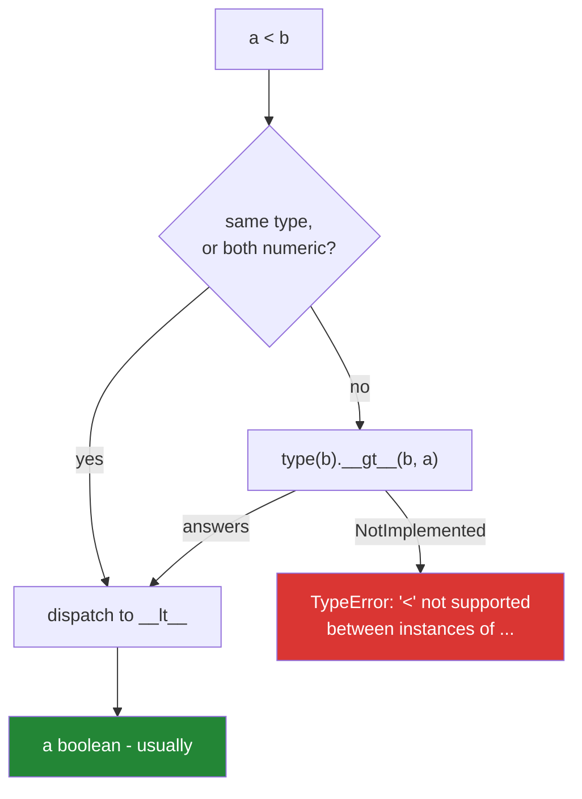

# 1.3 — Comparison, chaining, and the sort that raises

## One-line answer

`a < b < c` is not two comparisons joined by `and` — it is one expression that evaluates `b`
**exactly once** and short-circuits, and comparison between unrelated types raises rather than
guessing an order.

---

## The story

"Is the oven between 180 and 200 degrees?"

That is one question, asked once, about one moment. You glance at the dial and you either say yes or
you say no.

Now imagine asking it as two separate questions with a gap in between. "Is it above 180?" — you look,
it is 178, rising. You wait. You ask the second half: "is it below 200?" — you look again, it is 185.
Both answers are yes. Put them together and you conclude the oven was in range, and it never was: at
the moment of the first look it was too cold, and by the second look you were measuring a different
oven temperature.

For an oven that seems like nitpicking. For anything that changes while you are asking, it is the
whole ball game.

Here is what it costs. Somebody is filtering readings from a sensor and writes what they would write
on paper:

```text
if low < reading() < high:
```

It works. A colleague reviewing the code thinks it looks like a mistake and rewrites it "more
clearly":

```text
if low < reading() and reading() < high:
```

The tests still pass. In use, the readings start disagreeing with the raw log — values that were
never in range get through, and values that were in range get dropped.

`reading()` polls the sensor. The rewrite calls it **twice**, so the two halves of the condition are
comparing two different moments. The original called it once. The clearer version was the bug, and
the tests missed it because the test used a fixed number rather than a live reading.

There is a second half to this document, and it is a different kind of honesty. Somewhere else in the
same codebase, a report sorts a column of numbers that has a few gaps in it — moments where the
sensor dropped out and recorded nothing. It dies with `'<' not supported between instances of
'NoneType' and 'int'`.

The first instinct is that Python is being fussy. It is doing the opposite. Asking whether *nothing*
is smaller than *five* has no true answer, and rather than invent one, Python stops and says so.

---

## The idea in plain language

### The six comparison operators, and what they return

`<`, `<=`, `>`, `>=`, `==`, `!=`. Each one dispatches to a dunder method exactly as
[1.1](1.1-an-operator-is-a-method-call.md) described: `__lt__`, `__le__`, `__gt__`, `__ge__`,
`__eq__`, `__ne__`.

They normally return a **boolean** — `True` or `False`. "Normally" is doing real work in that
sentence: a type is free to return anything, and NumPy and pandas return an array of booleans
instead, which is the whole subject of [1.5](1.5-bitwise-and-the-mask.md).

Ordering comparisons also have a reflected fallback, but it is not `__rlt__`. The reflection of "less
than" is "greater than", so if `type(a).__lt__` declines, Python tries `type(b).__gt__(b, a)`. That
symmetry is why you can usually define `__lt__` and `__eq__` on your own class and get sensible
behaviour from the other direction for free.

### Chaining is one expression, not two

Python lets you write `0 <= index < len(items)` and means exactly what the mathematics means. This
is called **chained comparison**, and it is not sugar for `and`. The language defines it as:

```text
a OP1 b OP2 c    is equivalent to    a OP1 b and b OP2 c
                 EXCEPT that b is evaluated only once
```

Two consequences follow, and both matter:

1. **The middle expression runs once.** If it is a function call, a `next()`, a network read, or
   anything else with a side effect or a cost, the chained form does it once and the expanded form
   does it twice. That is the story's bug.
2. **It short-circuits.** If `a OP1 b` is false, `c` is never evaluated at all — the chain stops.
   So `0 <= i < len(expensive())` does not call `expensive()` when `i` is negative.

Chains are not limited to two links, and the operators need not match: `a < b <= c != d` is legal and
means what it reads like. What it must not become is a chain nobody can read — `a < b > c` is legal,
means `a < b and b > c`, and says nothing useful about `a` and `c`. Chain when the chain expresses a
range; stop when it expresses a puzzle.

### Comparison across types: some pairs have no order

`==` between any two objects is always allowed. Different types are simply not equal:
`1 == "1"` is `False`, not an error. That is deliberate — asking "are these the same value?" always
has an answer, and the answer for unrelated types is "no".

**Ordering is different.** `1 < "1"` raises `TypeError`. There is no fact of the matter about whether
the number one comes before the string "1", and inventing one would mean `sorted()` silently
producing a different order depending on data it happened to receive. Python 2 did invent one, sorted
mixed lists happily, and the bugs it caused are the reason Python 3 does not.

The types that *do* order across the boundary are the numeric ones, because they share a number line:
`1 < 2.5 < Decimal("3")` is fine, and `True < 2` is `True` because `bool` is a subclass of `int`
([Day 4, 1.3](../../../day-04-objects/parts/01-objects/1.3-numbers-and-bool.md)).



### Sequences compare lexicographically

Two lists, tuples or strings compare element by element, left to right, stopping at the first pair
that differs — the same rule a dictionary uses for words. `[1, 2, 9] < [1, 3]` is `True` because the
comparison is decided at index 1 and never looks at the `9`. If one runs out first, the shorter is
smaller: `[1, 2] < [1, 2, 0]`.

This is why sorting a list of tuples sorts by the first element, then the second, and so on — the
standard trick for "sort by score, then by title" that [Day 8,
1.5](../../../day-08-containers/parts/01-sequences/1.5-sort-sorted-and-key.md) builds on. And it is
why comparing `[1, "a"]` with `[1, 2]` raises: element 0 ties, and element 1 is the impossible
comparison.

---

## Why Setu needs it

- **[2.3](../02-conditionals/2.3-if-df-raises.md), today**, is the same "a comparison did not return
  a boolean" idea in its most famous form.
- **Day 8's sorting** (`PY-07`) sorts records by a tuple key. The lexicographic rule *is* the
  multi-key sort, and a `None` in a sort key is the error at the top of this document.
- **Day 30's pandas cleaning** (`PD-`) hits it hard: a column read from CSV with one blank cell is
  `object` dtype holding a `NaN` among floats, and sorting or comparing it raises or, worse, silently
  places `NaN` somewhere arbitrary.
- **Day 95's gradient descent** (`ML-06`) stops when the improvement is below a threshold — a
  comparison on floats, where the tolerance must be named rather than assumed
  ([Day 4, 1.3](../../../day-04-objects/parts/01-objects/1.3-numbers-and-bool.md)).
- **Day 162's retrieval** (`RAG-`) ranks by cosine similarity and takes the top `k`. Every ranking is
  a comparison, and every tie-break is a second element in a sort key.

---

## The mechanism

The chaining rule, made visible by counting evaluations:

```python
"""Chained comparison evaluates the middle expression once. The expanded form does not."""

calls = []


def reading() -> int:
    """A stand-in for anything with a cost or a side effect."""
    calls.append(len(calls) + 1)
    return 5


calls.clear()
result_chained = 0 < reading() < 10
print(f"chained : result={result_chained}  reading() called {len(calls)} time(s)")

calls.clear()
result_expanded = 0 < reading() and reading() < 10
print(f"expanded: result={result_expanded}  reading() called {len(calls)} time(s)")

calls.clear()
result_short = 100 < reading() < 200
print(f"short   : result={result_short}  reading() called {len(calls)} time(s)")
```

**Line by line:**

- `calls: list` at module level — a counter that survives the function call, so the number of
  invocations is observable. A plain integer would not work: rebinding one inside the function makes
  a local ([Day 4, 1.2](../../../day-04-objects/parts/01-objects/1.2-names-are-labels.md)), which is
  exactly the scope rule Day 10 (`PY-10`) formalises.
- `0 < reading() < 10` — one chained expression. `reading()` runs **once**, its value is held, and
  both comparisons use it.
- `0 < reading() and reading() < 10` — the "clearer" rewrite. **Two calls**, two different readings.
  This line is the story.
- `100 < reading() < 200` — the first link is false, so the chain stops and the second comparison
  never runs. The call count is still 1, because the middle was needed to decide the first link. Try
  `reading() < 0 < reading()` to see a chain where the second call genuinely never happens.

Now the ordering that has no answer:

```python
"""== always answers. Ordering does not, and that is a feature."""

print("1 == '1' :", 1 == "1")
print("1 != '1' :", 1 != "1")

for left, right in [(1, "1"), (None, 0), ([1, 2], (1, 2)), ([1, "a"], [1, 2])]:
    try:
        verdict = left < right
    except TypeError as exc:
        verdict = f"TypeError: {exc}"
    print(f"{left!r:>10} <  {right!r:<8} -> {verdict}")
```

**Line by line:**

- `1 == "1"` is `False` — no error. Equality across types is a legitimate question with the answer
  "no". This is why a config value read as the string `"1"` never equals the integer `1`, and why
  parsing at the boundary matters
  ([Day 4, 1.5](../../../day-04-objects/parts/01-objects/1.5-why-str-plus-int-is-a-typeerror.md)).
- `(None, 0)` — the pair from the story's report. `None` has no position on the number line, so there
  is nothing to answer.
- `([1, 2], (1, 2))` — a list and a tuple. They are not even equal (`==` is `False`), and ordering
  raises: two sequence types with no defined relationship.
- `([1, "a"], [1, 2])` — the subtle one. Both are lists, so the lexicographic rule starts. Index 0
  ties. Index 1 is `"a"` against `2`, which raises. **A comparison of two same-typed containers can
  still fail on their contents**, which is what makes a single dirty row poison an entire sort.
- `except TypeError as exc` — catching the exception to print it rather than stopping. Exceptions get
  their proper treatment on Day 18 (`PY-22`); here the `try` is only a display device.

And the lexicographic rule, which is the multi-key sort in disguise:

```python
"""Sequences compare element by element, and stop at the first difference."""

print([1, 2, 9] < [1, 3])  # decided at index 1; the 9 is never read
print([1, 2] < [1, 2, 0])  # a prefix is smaller than what extends it
print("apple" < "banana")  # strings are sequences of code points
print("Zebra" < "apple")  # capitals sort first - this is not alphabetical

papers = [(3, "beta"), (1, "gamma"), (3, "alpha")]
print(sorted(papers))
```

**Line by line:**

- `[1, 2, 9] < [1, 3]` — `True`. Index 0 ties, index 1 decides (`2 < 3`), and the tail is irrelevant.
  Length does not enter into it.
- `[1, 2] < [1, 2, 0]` — `True`. Every shared element ties and the left ran out, so the shorter one
  is smaller.
- `"Zebra" < "apple"` — `True`, and this surprises everyone. Strings compare by code point, and every
  capital letter has a lower code point than every lowercase one
  ([Day 7, 1.1](../../../day-07-strings/parts/01-text/1.1-a-string-is-code-points.md)). **This is why
  a sorted list of names looks wrong until you sort by a normalised key**, which is
  [Day 7, 2.1](../../../day-07-strings/parts/02-methods/2.1-normalising-strip-and-case.md).
- `sorted(papers)` — tuples compare lexicographically, so this sorts by the number and breaks ties
  with the string: `[(1, 'gamma'), (3, 'alpha'), (3, 'beta')]`. **You did not write a comparator.**
  The multi-key sort falls out of the sequence rule, and Day 8 uses it constantly.

---

## When it breaks

**The sort that meets a `None`:**

```text
>>> sorted([3, 1, None, 2])
Traceback (most recent call last):
  File "<stdin>", line 1, in <module>
TypeError: '<' not supported between instances of 'NoneType' and 'int'
```

**What it means.** `sorted` used `<` on a pair it could not order. The message names both types in the
order the comparison was attempted, which tells you which value is the intruder. The fix is a
decision, not a cast: either filter the `None`s out, or sort with a key that gives them an explicit
position — `sorted(values, key=lambda v: (v is None, v))` puts them last, because `False < True` and
tuples compare lexicographically. **Do not "fix" it by converting `None` to `0`**; that changes the
data to make an error go away.

**Mixed types from a CSV:**

```text
>>> sorted(["10", 9])
Traceback (most recent call last):
  File "<stdin>", line 1, in <module>
TypeError: '<' not supported between instances of 'int' and 'str'
```

**What it means.** One row parsed as a number and the rest did not, or the reverse. This raises,
which is the good outcome — the bad outcome is `sorted(["10", "9"])`, which does not raise and puts
`"10"` first, because `"1" < "9"` by code point. An error you can see beats a wrong order you cannot.

**The chain that is legal and meaningless:**

```text
>>> a, b, c = 1, 5, 2
>>> a < b > c
True
```

**What it means.** It expanded to `1 < 5 and 5 > 2`, both true. Nothing is wrong except that a reader
will assume it says something about `a` and `c`, and it does not. Chains that are not ranges should
be written as explicit `and`s so the intent is visible.

**And the one that catches people writing filters:**

```text
>>> value = 5
>>> if value == 1 or 2:
...     print("matched")
...
matched
```

**What it means.** This parses as `(value == 1) or 2`, and `2` is truthy, so the condition is always
true — for every value, forever. It is not a comparison chain and Python has no way to know you meant
one. The fix is `if value in (1, 2):`, which is [3.2](../03-the-or-trap/3.2-in-is-an-operator.md), and
the reason it is so common is covered in [1.6](1.6-precedence-and-associativity.md).

---

## In production

**Chained comparisons are the professional form for range checks, and the reason is correctness, not
brevity.** `if lower <= value < upper:` states a half-open interval in the notation the domain uses,
evaluates `value` once, and cannot drift when someone edits one half. The expanded `and` form invites
exactly the story's bug the moment the middle term stops being a plain variable — and in real code it
becomes `row["temp"]`, `next(stream)` or `client.read()` sooner than you expect. Reviewers reach for
the chained form on sight.

**Half-open intervals are a convention worth adopting deliberately.** `lower <= x < upper` — inclusive
at the bottom, exclusive at the top — is how `range`, slicing, and almost every library boundary in
Python is defined ([Day 6, 1.2](../../../day-06-loops/parts/01-iteration/1.2-range-is-lazy.md)). Using
the same convention for your own bucket boundaries means adjacent buckets tile with no gap and no
overlap, and the count of items in a bucket is `upper - lower`. Mixing conventions across a codebase
is how one record ends up in two buckets, which a total that does not reconcile will eventually
reveal.

**What changes with real data: the sort key is where dirt surfaces.** In a tested-only-on-clean-data
codebase, `sorted(rows, key=lambda r: r["score"])` is fine. In production one row has a `None` score
because an upstream job timed out, and the whole report raises — usually at the least convenient
moment, because the sort happens near the end after all the expensive work. The professional shape is
a key function that is **total**: it returns a comparable value for every possible input, with a
documented position for missing data. `key=lambda r: (r["score"] is None, r["score"] or 0)` is
explicit about where `None` goes, and the alternative — filtering earlier and reporting the count
dropped — is often better still.

**Under concurrency, nothing about comparison itself is unsafe**, but a sort key that reads mutable
shared state is. `sorted(items, key=lambda x: cache[x])` where another thread is writing `cache` can
produce an ordering that violates transitivity, and CPython's sort will happily return a
mostly-sorted list rather than raising. Sort on a snapshot.

**The review comment a senior engineer leaves.** On `if low < get_value() and get_value() < high:`:
*"This calls `get_value()` twice and compares two different values. Chain it — `low < get_value() <
high` — which is also one evaluation."*

**The interview question.** *"Is `a < b < c` the same as `a < b and b < c`?"* The answer is "almost —
`b` is evaluated only once", and the follow-up that separates people is *"when does that matter?"*
The strong answer names a side effect or a cost: a generator's `next()`, a function that polls
hardware, a property that hits a database. Some interviewers extend it to *"why does `sorted` raise
on a list with a `None` in it?"* — and the answer is that ordering across unrelated types has no
correct answer, so Python refuses rather than inventing one, unlike Python 2 which invented one and
produced orderings that depended on type names.

---

## Check yourself

```bash
uv run python -c "
calls = []
def reading():
    calls.append(1)
    return 5
print('chained :', 0 < reading() < 10, len(calls))
calls.clear()
print('expanded:', 0 < reading() and reading() < 10, len(calls))
print(sorted([(3,'beta'), (1,'gamma'), (3,'alpha')]))
try:
    sorted([3, 1, None])
except TypeError as exc:
    print('TypeError:', exc)
"
```

Predict the two call counts and the tuple ordering before running.

**Answer out loud, without scrolling up:**

> Say what `a < b < c` is equivalent to, and name the one thing that equivalence does *not* preserve.
> Then explain why `sorted([3, 1, None])` raises while `1 == "1"` does not.

---

**Next:** [1.4 — `==` is overloadable and `is` is not](1.4-equals-is-overloadable-is-is-not.md)
