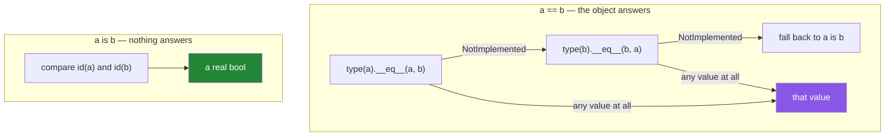

# 1.4 — `==` is overloadable and `is` is not

## One-line answer

`==` is a question the object gets to answer — any class can define `__eq__` and return whatever it
likes — while `is` is a fact about memory that no class can touch, which is exactly why `x is None`
is trustworthy and `x == None` is not.

---

## The story

A test suite has started passing everything.

It began with one helper: a mock object standing in for a service that was not ready yet. Whoever
wrote it wanted it to be permissive, so its `__eq__` returns `True` for anything compared against it —
the idea being that assertions would not fail on details nobody cared about yet.

The service was finished. The mock stayed, because it was convenient in four other tests. Six weeks
later, an assertion that should have caught a real regression compared a returned object against the
mock and reported success. Nobody noticed for a release.

While hunting for it, someone finds a second line in the same file:
`if config.timeout == None: config.timeout = 30`. It has never once assigned the default, because
`config` is a settings object whose `__eq__` compares field values and returns `False` for anything
it does not recognise. The timeout has been `None` in production the whole time, and the HTTP client
has been reading that as "wait forever".

Both bugs are the same bug. Somebody asked a question that the other object was allowed to answer.

---

## The idea in plain language

### Two questions that look alike and are not

[Day 4, 3.2](../../../day-04-objects/parts/03-identity-trap/3.2-is-versus-equals.md) established the
rule: `is` asks "are these the same object?" and `==` asks "do these have the same value?" That
document was about identity. This one is about **who decides**, which is the part that makes the rule
enforceable rather than memorised.

- `a == b` **dispatches** ([1.1](1.1-an-operator-is-a-method-call.md)). Python calls
  `type(a).__eq__(a, b)`. If that returns `NotImplemented`, it calls `type(b).__eq__(b, a)`. Only if
  both decline does it fall back to comparing identity. **The classes involved write the answer.**
- `a is b` **does not dispatch at all.** There is no `__is__` method, and no way to write one. The
  interpreter compares the two objects' identities — the numbers `id()` reports
  ([Day 4, 1.1](../../../day-04-objects/parts/01-objects/1.1-identity-type-value.md)) — and returns a
  real `bool`. No user code runs. It cannot be intercepted, subclassed, mocked, proxied or lied to.

That asymmetry is a design decision, and it is the reason a small number of checks in Python are
written with `is` even though `==` would usually read more naturally.

### The four things `is` is for

1. **`x is None`.** `None` is a singleton — there is exactly one of it in a running program — so
   identity is the exact question. `x == None` asks the object whether it considers itself equal to
   `None`, which is a question you did not mean to ask. Ruff enforces this as rule `E711`
   ([Day 2, 1.2](../../../day-02-quality-gate/parts/01-linting/1.2-choosing-rule-families.md)).
2. **`x is True` / `x is False`** — rarely wanted, because you almost always want truthiness
   ([2.2](../02-conditionals/2.2-truthiness.md)) instead. When you genuinely need "this is the boolean
   `True`, not the integer 1 and not a truthy string", identity is the only way to ask.
3. **Your own sentinels.** When `None` is a legitimate value and you still need to detect "argument
   not supplied", you create a unique object — `MISSING = object()` — and test `arg is MISSING`. The
   mechanism section builds one.
4. **"Is this literally the same object?"** — the aliasing question from
   [Day 4, 2.3](../../../day-04-objects/parts/02-containers/2.3-aliasing-two-names-one-object.md).

For everything else, `==` is correct.

### What `__eq__` is allowed to do

Essentially anything. A class can define equality as:

- comparing every field (what `@dataclass` generates for you);
- comparing one identifying field, so two `Paper` objects with the same DOI are equal regardless of
  metadata — the design decision Day 12 (`PY-13`) makes;
- returning an **array** rather than a boolean, which is what NumPy and pandas do
  ([1.5](1.5-bitwise-and-the-mask.md));
- returning `True` for everything, which is the story's mock;
- raising.

There is no rule that `__eq__` must be sensible. There is a **contract** that well-behaved types
follow — reflexive (`a == a`), symmetric (`a == b` implies `b == a`), transitive, and consistent with
`__hash__` ([Day 4, 2.5](../../../day-04-objects/parts/02-containers/2.5-hashability.md)) — but the
language does not enforce it, and containers quietly assume it. A type that breaks symmetry makes
`x in some_list` depend on which side of the comparison it lands on.



### The default, when a class says nothing

If a class defines no `__eq__`, it inherits `object.__eq__`, which **is** identity comparison. So for
a plain class, `a == b` and `a is b` give the same answer — which is why the difference stays
invisible until you meet a class that defines equality, and why `@dataclass` changing that default is
worth knowing about before Day 19 (`PY-23`).

---

## Why Setu needs it

- **[3.1](../03-the-or-trap/3.1-the-or-default-and-falsy-zero.md), today,** is the "default value"
  problem in its other form, and its correct fix is `is None`.
- **Day 12's `Paper` class** (`PY-13`) must decide what makes two papers equal. Choosing "same DOI"
  rather than "all fields identical" is a modelling decision with consequences for deduplication on
  Day 8 and for the retrieval index on Day 162.
- **Day 15's dunder methods** (`PY-17`, `PY-18`) writes `__eq__` and `__hash__` together, because
  defining one without the other breaks sets and dicts
  ([Day 4, 2.5](../../../day-04-objects/parts/02-containers/2.5-hashability.md)).
- **Day 19's Pydantic models** (`PY-24`) generate `__eq__` for you, and knowing it is generated is how
  you avoid being surprised when two separately parsed responses compare equal.
- **Every test in this project** asserts with `==`. When an assertion passes and should not, this
  document is where the investigation starts.

---

## The mechanism

The story's mock, in eight lines, and the assertion it defeats:

```python
"""A class is allowed to define equality however it likes. Including badly."""


class AlwaysEqual:
    """Returns True for every comparison. Not hypothetical - mocks do this."""

    def __eq__(self, other: object) -> bool:
        return True

    __hash__ = None  # a type with custom __eq__ and no __hash__ is unhashable


mock = AlwaysEqual()

print("mock == 42          :", mock == 42)
print("mock == 'anything'  :", mock == "anything")
print("mock == None        :", mock == None)  # noqa: E711 - the point of the example
print("mock is None        :", mock is None)
```

**Line by line:**

- `def __eq__(self, other)` — the hook `==` dispatches to. It ignores `other` entirely.
- `__hash__ = None` — defining `__eq__` normally sets `__hash__` to `None` automatically in Python 3,
  making instances unhashable; writing it explicitly documents the fact. The reason is
  [Day 4, 2.5](../../../day-04-objects/parts/02-containers/2.5-hashability.md): a hash must agree with
  equality, and this equality agrees with nothing.
- `mock == None` — **`True`.** A `None` check written with `==` has just been answered by the object
  being checked. This is the story's second bug, and the first bug's mechanism.
- `mock is None` — **`False`.** No user code ran. `AlwaysEqual` had no say and could not have had
  one.
- `# noqa: E711` — ruff flags `== None` as an error, which is the linter enforcing this document
  ([Day 2, 1.3](../../../day-02-quality-gate/parts/01-linting/1.3-fix-and-noqa-as-debt.md) on why a
  `noqa` must carry a reason). This is the rare case where writing it is the demonstration.

Now the sentinel — the reason `is` is not merely a `None` special case:

```python
"""When None is a valid value, you need an object that cannot be confused with anything."""

MISSING = object()


def set_timeout(timeout: object = MISSING) -> str:
    """Distinguishes 'not supplied' from 'explicitly supplied as None'."""
    if timeout is MISSING:
        return "not supplied -> using the default of 30"
    if timeout is None:
        return "supplied as None -> caller asked for no timeout"
    return f"supplied as {timeout!r}"


print(set_timeout())
print(set_timeout(None))
print(set_timeout(5))
```

**Line by line:**

- `MISSING = object()` — a bare `object` instance. It has no value to speak of; its only property is
  that it is not identical to anything else in the program. Creating it at module level means there is
  exactly one, which is what makes the `is` test meaningful.
- `timeout: object = MISSING` — the default is a **single object created once when the `def` runs**,
  which is the same evaluation rule as
  [Day 4, 3.1](../../../day-04-objects/parts/03-identity-trap/3.1-the-mutable-default-argument.md).
  Here it is safe, because the object is never mutated — the sentinel is the well-behaved cousin of
  the mutable-default bug.
- `if timeout is MISSING` — identity, not equality. A caller could pass an object whose `__eq__`
  returns `True` for everything and this check would still be correct.
- `if timeout is None` — the second case, now genuinely distinguishable from the first. **This is the
  whole reason the sentinel exists**: `timeout=None` meaning "no timeout" and `timeout` omitted
  meaning "use the default" are different requests, and a plain `None` default cannot tell them apart.
- `f"{timeout!r}"` — `!r` calls `repr()`, so a string shows its quotes and you can see the difference
  between `5` and `"5"`.

And the `__eq__` a real class writes:

```python
"""Two papers with the same DOI are the same paper. Everything else is metadata."""

from dataclasses import dataclass, field


@dataclass(frozen=True)
class Paper:
    doi: str
    title: str = field(compare=False)


a = Paper(doi="10.1000/xyz", title="Attention Is All You Need")
b = Paper(doi="10.1000/xyz", title="attention is all you need")
c = Paper(doi="10.1000/abc", title="Attention Is All You Need")

print("same doi, different title :", a == b, "| same object:", a is b)
print("different doi, same title :", a == c)
print("hashable, so set works    :", len({a, b, c}))
```

**Line by line:**

- `@dataclass(frozen=True)` — generates `__init__`, `__repr__`, `__eq__` and, because `frozen=True`
  makes instances immutable, `__hash__`. Day 19 (`PY-23`) covers dataclasses properly; here it is the
  shortest honest way to show a generated `__eq__`.
- `title: str = field(compare=False)` — **the modelling decision.** `compare=False` excludes the field
  from the generated `__eq__` and `__hash__`, so identity of a paper is its DOI alone. Change it and
  `a == b` becomes `False`, and the set below has three elements instead of two.
- `a == b` is `True` while `a is b` is `False` — two distinct objects that the class declares
  equivalent. This is `==` doing exactly what it should, and it is why the deduplication on
  [Day 8, 3.2](../../../day-08-containers/parts/03-dedup/3.2-order-preserving-dedup.md) can work on
  objects and not just strings.
- `len({a, b, c})` is `2` — the set used `__hash__` and then `__eq__` to collapse `a` and `b`. **This
  only works because `frozen=True` kept hash and equality consistent**; a mutable class with a custom
  `__eq__` and a hand-written `__hash__` is the broken-key bug from
  [Day 4, 2.5](../../../day-04-objects/parts/02-containers/2.5-hashability.md).

---

## When it breaks

**The linter catching the story's second bug:**

```text
$ uv run ruff check --select E711 -
E711 Comparison to `None` should be `cond is None`
  |
1 | if config.timeout == None:
  |    ^^^^^^^^^^^^^^^^^^^^^^ E711
  |
help: Replace with `cond is None`
```

**What it means.** Ruff has no idea whether `config` defines a hostile `__eq__`; it flags the pattern
because the pattern is never what you want. `is None` is both faster and immune. This rule is already
active in this project's `select` list.

**The comparison against a literal that Python warns about:**

```text
>>> code = 200
>>> if code is 200:
...     print("ok")
...
<stdin>:1: SyntaxWarning: "is" with 'int' literal. Did you mean "=="?
ok
```

**What it means.** The warning is the interpreter telling you that this works by accident. It prints
`ok` because small integers are cached, and it will stop working the moment the value is parsed from
input rather than written as a literal — the failure
[Day 4, 3.2](../../../day-04-objects/parts/03-identity-trap/3.2-is-versus-equals.md) dissects. `is` is
for singletons; `200` is not one.

**Defining `__eq__` and losing your dictionary keys:**

```text
>>> class Tag:
...     def __init__(self, name): self.name = name
...     def __eq__(self, other): return self.name == other.name
...
>>> {Tag("ml"): 1}
Traceback (most recent call last):
  File "<stdin>", line 1, in <module>
TypeError: unhashable type: 'Tag'
```

**What it means.** Defining `__eq__` set `__hash__` to `None`, because the default hash was based on
identity and the new equality is not — keeping them would break the dictionary invariant. Python
would rather refuse than corrupt a dict. The fix is to add
`def __hash__(self): return hash(self.name)`, or to use a frozen dataclass and get both generated
consistently.

**And the asymmetry that makes `in` unreliable:**

```text
>>> class Weird:
...     def __eq__(self, other): return isinstance(other, int)
...
>>> Weird() == 1
True
>>> 1 == Weird()
True
>>> 1 in [Weird()]
True
>>> Weird() in [1]
True
```

**What it means.** This one happens to be symmetric, and a slightly different `__eq__` would not be —
at which point `x in items` gives a different answer from `any(i == x for i in items)`, because
`in` compares in one particular direction. When a container behaves inconsistently, a custom `__eq__`
that violates symmetry is the first thing to suspect.

---

## In production

**The professional habit is: `is` for singletons, `==` for values, and never the reverse.** In a code
review, `== None`, `!= None`, `== True` and `is 200` are all flagged on sight, and every one of them
is caught by a linter, so the discipline costs nothing once the rule is enabled. What the linter
cannot catch is the interesting half — a legitimate `==` against an object whose equality you have not
read. When a comparison against a value from another team's library behaves strangely, open their
`__eq__` before assuming your own code is wrong.

**Test doubles are where hostile equality actually bites.** A permissive mock is genuinely useful
during a spike and genuinely dangerous afterwards, because an assertion against it cannot fail — the
exact property [Day 2, 3.1](../../../day-02-quality-gate/parts/03-pytest/3.1-the-test-that-can-go-red.md)
says a test must not have. The defence used in real suites is to prove the assertion can fail:
temporarily break the code under test and watch the test go red. A mock with `__eq__` returning `True`
survives that check silently, which is why it is worth writing test doubles that compare on identity
or on explicit recorded calls rather than on permissive equality.

**Sentinels are standard, not exotic.** The pattern `_MISSING = object()` (or a module-private
`_Sentinel` class with a useful `__repr__`) appears throughout the standard library and every mature
framework, because "not supplied" and "supplied as `None`" are genuinely different in configuration,
in caching, and in partial-update APIs. A `PATCH` endpoint that cannot tell "leave this field alone"
from "set this field to null" is the same bug at the network layer. Give the sentinel a `__repr__` —
`<MISSING>` — or a debugging session will show you `<object object at 0x7f...>` and tell you nothing.

**What changes at scale.** `is` is a pointer comparison: constant time, no allocation, no user code.
`==` on a large structure is a deep walk — two lists of ten thousand dicts compare element by element,
and each dict compares key by key. In a hot path, an equality check on a big object can dominate, and
the professional move is to compare a cheap identifying field (a version number, a content hash)
instead of the whole object. Under concurrency, `==` calling user code means it can block, allocate,
or observe a half-updated object; `is` cannot.

**The review comment a senior engineer leaves.** On `if response.error == None:` — *"`is None`. `==`
asks the object, and a Pydantic model or a mock can answer however it likes; `is` asks the
interpreter. Ruff's E711 would have caught this, so let us also check why it did not run on this
file."*

**The interview question.** *"Why do we write `x is None` instead of `x == None`?"* The answer people
give is "it is faster", which is true and beside the point. The answer that lands: `==` dispatches to
`__eq__`, so the object being tested gets to decide the outcome, and a class with an unusual or
deliberately permissive equality can make a `None` check return the wrong answer; `is` compares
identity in the interpreter, no user code runs, and since `None` is a singleton, identity is exactly
the question being asked. A good follow-up is *"when is `==` the right choice and `is` wrong?"* — any
value comparison, and specifically two objects that are equal but distinct, which is nearly every
`Paper`, `Decimal` or parsed record in a real system.

---

## Check yourself

```bash
uv run python -c "
class AlwaysEqual:
    def __eq__(self, other): return True
m = AlwaysEqual()
print('m == None:', m == None)
print('m is None:', m is None)
MISSING = object()
def f(x=MISSING):
    return 'omitted' if x is MISSING else f'given {x!r}'
print(f(), '|', f(None), '|', f(0))
"
```

Predict all five outputs. The third line is the one that decides whether the sentinel idea has landed.

**Answer out loud, without scrolling up:**

> Explain why `x is None` is trustworthy and `x == None` is not, in terms of which code runs. Then
> describe a situation where `None` cannot be used as a default and say what you would use instead.

---

**Next:** [1.5 — Bitwise operators, and the pandas mask that needs them](1.5-bitwise-and-the-mask.md)
