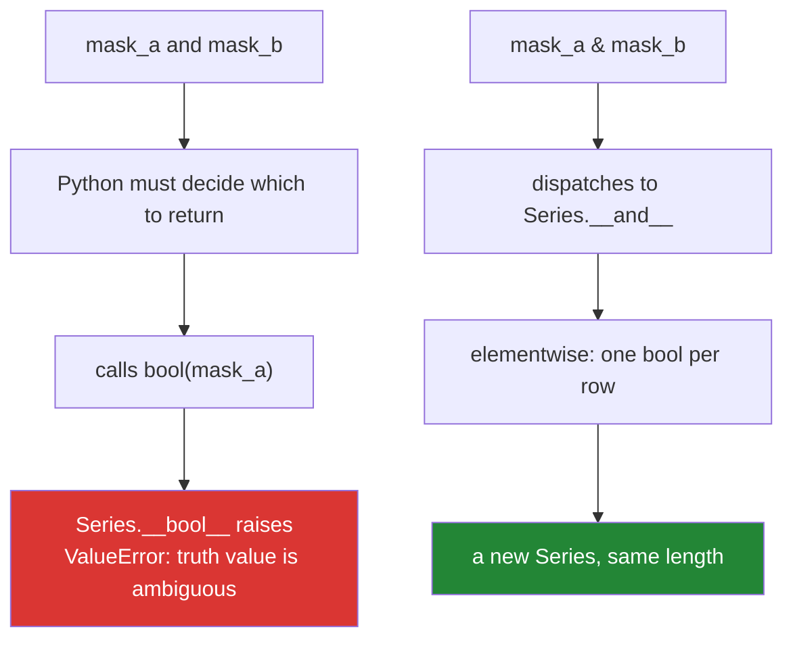

# 1.5 — Bitwise operators, and the pandas mask that needs them

## One-line answer

`&`, `|`, `^`, `~`, `<<` and `>>` work on the individual bits of an integer — and because they
dispatch like every other operator, array libraries reuse them to mean "elementwise", which is why a
pandas filter must be written with `&` and never with `and`.

---

## The story

Someone is filtering a table of papers. They want rows from 2023 that are also open access, and they
write it the way they would say it out loud:

```text
recent = papers[papers.year == 2023 and papers.open_access]
```

The error that comes back does not mention `and` at all. It says
`The truth value of a Series is ambiguous. Use a.empty, a.bool(), a.item(), a.any() or a.all().`

They search the message, find an answer that says "use `&` instead of `and`", change one word, and it
works. They have no idea why, and the next time they write a filter they will guess again — this time
adding parentheses that are not needed, or leaving out ones that are.

There is a real explanation, it takes one page, and it turns three separate memorised rules into one
fact: **`and` needs a single true-or-false answer and a column of ten thousand rows is not one, while
`&` is an operator a type can define to mean whatever it likes — and pandas defined it to mean
elementwise.**

---

## The idea in plain language

### First, what these operators do to an integer

A **bit** is a single binary digit, `0` or `1`. Every integer is stored as a pattern of bits: `5` is
`101`, `3` is `011`. **Bitwise** operators line up two such patterns and combine them position by
position.

| Operator | Name | On each bit position |
|---|---|---|
| `a & b` | AND | `1` only if **both** are `1` |
| `a \| b` | OR | `1` if **either** is `1` |
| `a ^ b` | XOR | `1` if **exactly one** is `1` |
| `~a` | NOT | flips every bit |
| `a << n` | left shift | move bits `n` places left — multiplies by `2**n` |
| `a >> n` | right shift | move bits `n` places right — floor-divides by `2**n` |

So `5 & 3` lines up `101` and `011`, and produces `001`, which is `1`. And `5 | 3` produces `111`,
which is `7`.

`~` is the one that surprises. Python's integers are signed and unbounded, so `~5` is not `2` or
`250` or anything you can read off a byte — it is `-6`. The rule is `~a == -a - 1`, which falls out of
two's-complement representation. In practice you use `~` on a mask, where it means "flip every
selection", and rarely on a plain integer.

### Now the important part: these are operators, so types can redefine them

[1.1](1.1-an-operator-is-a-method-call.md) established that `a & b` calls `type(a).__and__(a, b)`.
Nothing forces that method to think about bits. A type is free to define `&` as anything, and array
libraries took the offer:

- On two `int`s, `&` combines bits.
- On two `set`s, `&` is **intersection** — `{1,2} & {2,3}` is `{2}`.
- On two NumPy boolean arrays or pandas boolean Series, `&` is **elementwise AND**: it produces a new
  array of the same length, one boolean per position.
- On two `dict`s, `|` is **merge** (Python 3.9+) — Day 8 covers it.

Why did they reuse the bitwise symbols rather than `and`? Because **`and` and `or` cannot be
overloaded.** They are not operators that dispatch to a dunder; they are control-flow keywords built
into the language ([2.4](../02-conditionals/2.4-and-or-return-operands.md) explains exactly what they
do instead). There is no `__and_keyword__` to define. A library that wants an elementwise logical
operation has literally no choice but to borrow `&` and `|`.

### Why `and` on a Series raises instead of guessing

`x and y` must decide which operand to return, and to decide it must ask: **is `x` true?** That means
calling `bool(x)` ([2.2](../02-conditionals/2.2-truthiness.md)).

For a Series of ten thousand booleans, `bool(series)` has no honest answer. Should a mixed column be
true because some rows are? Because all are? Because it is non-empty? Each is defensible, each is a
different filter, and picking one silently would give wrong results with no error. So pandas'
`__bool__` raises — and the message lists the four things you might have meant:

```text
The truth value of a Series is ambiguous. Use a.empty, a.bool(), a.item(), a.any() or a.all().
```

**That message is not about `and`.** It is about `bool()`, which is why the same error appears for
`if series:`, `while series:`, `not series` and `series or default`. Recognising the one cause behind
five different-looking failures is the point of this document, and
[2.3](../02-conditionals/2.3-if-df-raises.md) takes it further.



### And the parentheses that are not optional

`&` has **higher precedence than `==`**, inherited from C where `&` was arithmetic. So

```text
df.year == 2023 & df.open_access
```

parses as `df.year == (2023 & df.open_access)` — comparing a year column against a bitwise AND of the
integer 2023 with a boolean column. It does not do what it reads like, and depending on the data it
either raises or returns nonsense. **Every operand of a `&` or `|` mask gets its own parentheses**,
every time, and [1.6](1.6-precedence-and-associativity.md) is the general rule this is an instance of.

---

## Why Setu needs it

- **[2.3](../02-conditionals/2.3-if-df-raises.md), today,** is the same `__bool__` refusal seen from
  the conditional side. This part explains the operator; that one explains the `if`.
- **Day 20's NumPy** (`NP-01`) introduces boolean arrays, and **Day 24's boolean indexing** (`NP-`) is
  built entirely on `&`, `|` and `~` over masks. Everything you write there depends on this page.
- **Day 26 onwards, every pandas filter** (`PD-`) is a mask expression. This is the single most
  frequent syntax error in the whole Pandas module, and it costs an evening exactly once if you
  understand it now.
- **Day 76's leakage-proof split** (`ML-`) selects training rows with a mask. A mask built with the
  wrong operator quietly selects the wrong rows rather than raising, which is the worst kind of
  leakage bug — Principle 8 says every ML day must name where the leak would have been, and "I
  filtered with the wrong precedence" is a real answer.
- **Day 44's SQL** (`SQL-`) uses `AND`/`OR` keywords with their own precedence rules, and the habit of
  parenthesising every clause transfers directly.

---

## The mechanism

Bits first, so `&` is not magic:

```python
"""What & | ^ ~ << >> actually do to the bits of an integer."""

a, b = 5, 3
print(f"a = {a} = 0b{a:04b}")
print(f"b = {b} = 0b{b:04b}")
print(f"a & b = {a & b} = 0b{a & b:04b}   (1 where BOTH are 1)")
print(f"a | b = {a | b} = 0b{a | b:04b}   (1 where EITHER is 1)")
print(f"a ^ b = {a ^ b} = 0b{a ^ b:04b}   (1 where EXACTLY ONE is 1)")
print(f"~a    = {~a}          (-a - 1, because integers are signed)")
print(f"a << 2 = {a << 2}     (times 2**2)")
print(f"a >> 1 = {a >> 1}     (floor-divided by 2)")
```

**Line by line:**

- `f"{a:04b}"` — the format spec `04b` means "binary, zero-padded to 4 digits". Seeing the patterns
  side by side is what makes `&` obvious rather than memorised; the spec language is
  [Day 7, 3.2](../../../day-07-strings/parts/03-formatting/3.2-the-format-spec.md).
- `a & b` — `0101 & 0011 = 0001`. Position by position, no carrying, nothing arithmetic about it.
- `~a` — prints `-6`. Python integers have no fixed width, so there is no "highest bit" to flip into;
  the language defines `~a` as `-a - 1`, which is what two's complement gives for any width. **If you
  wanted an 8-bit flip you must mask it yourself**: `~a & 0xFF`.
- `a << 2` — `20`. Shifting left by `n` multiplies by `2**n` exactly, with no float involved
  ([1.2](1.2-the-two-divisions.md) on why that matters for large values).
- `a >> 1` — `2`. Shifting right floors, so it agrees with `//` and not with `int(a / 2)` — including
  for negative numbers, where `-5 >> 1` is `-3`.

Now the same operators meaning something else entirely, without any array library installed:

```python
"""Sets redefine & | ^ - and that is the same mechanism pandas uses."""

recent = {"paper-a", "paper-b", "paper-c"}
open_access = {"paper-b", "paper-c", "paper-d"}

print("both      (&):", recent & open_access)
print("either    (|):", recent | open_access)
print("exactly 1 (^):", recent ^ open_access)
print("first only(-):", recent - open_access)
print("int.__and__ and set.__and__ are different functions:", int.__and__ is not set.__and__)
```

**Line by line:**

- `recent & open_access` — intersection. No bits anywhere; `set.__and__` simply defines `&` as "the
  elements in both". This is the proof that `&` is a spelling, not a capability.
- `recent ^ open_access` — symmetric difference, "in exactly one of them", which is precisely the XOR
  truth table applied to membership. The naming is not a coincidence.
- `recent - open_access` — set difference. Note there is no `-` in the bitwise table above; sets
  defined `__sub__` too. Day 8 covers set algebra properly.
- `int.__and__ is not set.__and__` — `True`, and it is the sentence of the document: two different
  functions behind one symbol, chosen by the type of the left operand
  ([1.1](1.1-an-operator-is-a-method-call.md)).

And a stand-in for the pandas mask, written in pure Python, so the mechanism is visible before the
library is:

```python
"""A tiny Mask class that behaves the way a pandas Series does - and refuses bool() the same way."""

from __future__ import annotations


class Mask:
    """A column of booleans. & is elementwise; bool() is refused."""

    def __init__(self, bits: list[bool]) -> None:
        self.bits = bits

    def __repr__(self) -> str:
        return f"Mask({self.bits})"

    def __and__(self, other: Mask) -> Mask:
        return Mask([x and y for x, y in zip(self.bits, other.bits, strict=True)])

    def __or__(self, other: Mask) -> Mask:
        return Mask([x or y for x, y in zip(self.bits, other.bits, strict=True)])

    def __invert__(self) -> Mask:
        return Mask([not x for x in self.bits])

    def __bool__(self) -> bool:
        raise ValueError("The truth value of a Mask is ambiguous. Use .any() or .all().")


is_2023 = Mask([True, True, False, False])
is_open = Mask([True, False, True, False])

print("is_2023 & is_open :", is_2023 & is_open)
print("is_2023 | is_open :", is_2023 | is_open)
print("~is_open          :", ~is_open)

try:
    print(is_2023 and is_open)
except ValueError as exc:
    print("is_2023 and is_open ->", type(exc).__name__, exc)
```

**Line by line:**

- `def __and__(self, other)` — the hook `&` dispatches to. Inside it, `x and y` on two plain booleans
  is the ordinary keyword doing ordinary work; the elementwise behaviour comes from the loop around
  it, not from any special operator.
- `zip(..., strict=True)` — pairs the two columns. `strict=True` (Python 3.10+) raises if the lengths
  differ instead of silently stopping at the shorter one — the same silent-truncation trap
  [Day 6, 1.3](../../../day-06-loops/parts/01-iteration/1.3-enumerate-and-zip.md) covers. A mask
  library that dropped rows on a length mismatch would produce a wrong filter with no error.
- `def __invert__` — the hook for `~`. This is why `~mask` means "not selected" in pandas: `Series`
  defines `__invert__` as elementwise negation, exactly as here.
- `def __bool__` — **the refusal.** It raises rather than choosing between `any` and `all`, and the
  message names the alternatives so the caller can state their intent. Writing this method by hand is
  what turns the pandas error from a mystery into an obvious consequence.
- `is_2023 and is_open` — the keyword needs a true-or-false answer, calls `bool(is_2023)`, and gets
  the exception. **Notice that the error mentions neither `and` nor a Series** — it comes from
  `__bool__`, which is the reason the same message appears for `if`, `while`, `not` and `or`.
- The comprehension inside `__and__` is [Day 9](../../../day-09-comprehensions/parts/01-list-comprehensions/1.1-the-loop-and-the-comprehension.md);
  read it as "a new list, one entry per pair".

---

## When it breaks

**The story's error, verbatim:**

```text
>>> import pandas as pd
>>> df = pd.DataFrame({"year": [2023, 2022], "open_access": [True, False]})
>>> df[(df.year == 2023) and (df.open_access)]
Traceback (most recent call last):
  File "<stdin>", line 1, in <module>
ValueError: The truth value of a Series is ambiguous. Use a.empty, a.bool(), a.item(), a.any() or a.all().
```

**What it means.** `and` called `bool()` on a Series. The fix is `&`:
`df[(df.year == 2023) & df.open_access]`. Note that pandas is not installed until Day 26 in this
project — this block is here so you recognise the message when it arrives, and the `Mask` class above
reproduces it with no dependency.

**The missing parentheses, which is a different failure:**

```text
>>> df[df.year == 2023 & df.open_access]
Traceback (most recent call last):
  File "<stdin>", line 1, in <module>
TypeError: unsupported operand type(s) for &: 'int' and 'bool'
```

**What it means.** `&` bound tighter than `==`, so Python tried `2023 & df.open_access` first. The
error names `int` and the column's element type rather than anything about filtering, which is why it
is hard to recognise. **The fix is parentheses around each comparison**, not a different operator.
With slightly different dtypes this version does *not* raise and instead returns a wrong selection,
which is worse.

**`~` on a plain integer, when a byte was expected:**

```text
>>> flags = 0b1010
>>> bin(~flags)
'-0b1011'
```

**What it means.** Python integers are signed and arbitrary-width, so flipping produced a negative
number rather than `0b0101`. If you are modelling a fixed-width register, mask afterwards:
`~flags & 0b1111` gives `0b0101`. This is a genuine difference from C and the reason bit-twiddling
ported from C needs a review.

**And the one that does not raise:**

```text
>>> True & False
False
>>> True and False
False
>>> 1 & 2
0
>>> 1 and 2
2
```

**What it means.** On plain booleans `&` and `and` agree, which is exactly why the habit of writing
`and` survives until it meets a Series. On integers they diverge immediately: `1 & 2` combines bits
(`01 & 10 = 00`) while `1 and 2` returns the second operand
([2.4](../02-conditionals/2.4-and-or-return-operands.md)). Two operators that agree on the values you
test with and disagree on the values you ship is the definition of a lurking bug.

---

## In production

**In array code, `&`/`|`/`~` with parentheses is not a workaround — it is the correct notation, and a
reviewer expects it everywhere.** A filter written as
`df[(df.score > 0.8) & (df.lang == "en") & ~df.retracted]` reads as a conjunction of conditions and
evaluates as three vectorised passes over the data. The equivalent with `and` cannot exist. Teams
that write a lot of dataframe code develop the habit of parenthesising each comparison even when
precedence would allow otherwise, because the cost of the extra characters is zero and the cost of
getting it wrong is a silently wrong row set.

**A silently wrong mask is worse than a raised error, and it is the realistic failure.** The examples
above raise because the dtypes happened to clash. With two integer columns, `df.a == 1 & df.b` is a
perfectly valid bitwise expression that returns a mask nobody intended, and the report it feeds is
merely *wrong* — no traceback, no warning, and a number that looks plausible. This is why the
production defence is a test that asserts the **row count** of a filtered frame, not just that it ran.
Principle 7's "at least one test that can go RED" applies with force to filters.

**Bit flags are a real technique, not a museum piece.** Permission sets, feature flags, dtype
descriptors and file-open modes are all bitmasks: one integer holding a dozen independent booleans,
combined with `|`, tested with `&`, cleared with `& ~`. Python's own `enum.Flag` wraps this so the
result prints readably instead of as `13`. They earn their place when the flags must cross a boundary
compactly — a database column, a network header, a C library — and they cost you readability
everywhere else, so a set of strings is usually the better default inside your own code.

**What changes at scale.** Bitwise operations on machine-sized integers are the cheapest thing a CPU
does. On NumPy arrays they are one pass over contiguous memory, so a three-condition mask is three
passes plus two combines — still fast, but no longer free, and on very large frames it is worth
knowing that `query()` and the `numexpr` path can fuse those passes. Under concurrency, masks are
newly allocated arrays rather than mutations, so combining them is safe; assigning **through** a mask
(`df.loc[mask, "col"] = 0`) is a mutation and is not.

**The review comment a senior engineer leaves.** On `df[df.year == 2023 & df.open_access]`: *"Missing
parentheses — `&` binds tighter than `==`, so this evaluates `2023 & df.open_access` first. It happens
to raise here; with two int columns it would return the wrong rows silently. Parenthesise every
operand of a mask."*

**The interview question.** *"Why can't you use `and` to combine two pandas conditions?"* The complete
answer has two halves, and most candidates give only the first. Half one: `and` requires a single
truth value, so it calls `bool()` on the Series, and a Series of many booleans has no unambiguous
truth value, so pandas raises rather than guessing. Half two, the one that shows real understanding:
`and` is a language keyword and cannot be overloaded at all, so a library that wants an elementwise
logical operator has to borrow `&` — which it can overload, because `&` dispatches to `__and__`. The
follow-up is usually about the parentheses, and the answer is that `&` inherited C's precedence and
therefore binds tighter than `==`.

---

## Check yourself

```bash
uv run python -c "
print('5 & 3 =', 5 & 3, '| 5 | 3 =', 5 | 3, '| ~5 =', ~5)
print('sets  :', {1,2} & {2,3}, {1,2} | {2,3}, {1,2} ^ {2,3})
print('1 & 2 =', 1 & 2, 'but 1 and 2 =', 1 and 2)
print('precedence: 2023 == 2023 & True ->', 2023 == 2023 & True)
"
```

The last line is the parenthesis bug in miniature — work out what it parsed as before reading the
answer it prints.

**Answer out loud, without scrolling up:**

> Explain why a pandas filter must use `&` rather than `and`, in two sentences: one about what `and`
> needs, and one about what a library is allowed to overload. Then say why every operand of a mask
> needs its own parentheses.

---

**Next:** [1.6 — Precedence, associativity, and the parentheses that are not optional](1.6-precedence-and-associativity.md)
