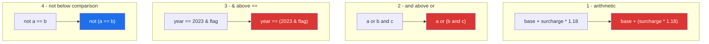

# 1.6 — Precedence, associativity, and the parentheses that are not optional

## One-line answer

Precedence decides which operator grabs its operands first and associativity decides what happens
when two of equal rank compete — and the professional response to both is not memorisation but
parentheses wherever a reader could pause.

---

## The story

The bill at the end of a meal: food 400, service charge 100, and 18% tax on top.

Two people at the table work it out and get different totals, and they both did the arithmetic
correctly. One added the food and the service first, then took 18% of the 500 and got 590. The other
took 18% of the service charge only and got 518. They are arguing about the bill, but what they are
really arguing about is **which two numbers the 18% was attached to**.

Written down, the disagreement is invisible:

```text
400 + 100 × 1.18
```

School settled this a long time ago — multiplication happens before addition — so the written line
means 518, whatever the person who wrote it was picturing. If you meant 590, you needed brackets, and
the brackets cost two characters.

Here is the same argument, running nightly for a year.

```text
total = base + surcharge * 1.18
```

The intention was to add the surcharge and then tax the sum. What it does is tax the surcharge alone.
Every invoice for a year has been slightly low, consistently, in a way that looks like a rounding
convention rather than a mistake. It was found by an auditor, not by a test, because the test
customer was tax-exempt and their multiplier was `1.0`.

In the same review, somebody finds a permissions check:

```text
if user.is_admin or user.is_owner and resource.is_public:
```

`and` binds tighter than `or`, so Python reads this as "admin, or else (owner and public)". The
author meant "(admin or owner) and public". For a year, any administrator could open any private
document. Nothing raised. The line even reads like English, which is exactly why nobody stopped on
it.

Two bugs, no exceptions, no failing tests, one cause: **the expression Python evaluated was not the
expression the author read.**

---

## The idea in plain language

### Precedence: who takes their operands first

**Precedence** is the ranking that decides how an expression without parentheses is grouped. It is
the school rule "multiplication before addition" generalised to about eighteen levels.

`2 + 3 * 4` is `14`, not `20`, because `*` outranks `+` and therefore claims the `3` and the `4`
before `+` gets a chance. The expression is *parsed* as `2 + (3 * 4)`. Nothing is evaluated left to
right at the top level; the grouping is decided first, entirely by the ranking, and then the tree is
evaluated.

Here is the table, strongest first. You do not need to memorise it — you need to know which
neighbours are dangerous.

| Rank | Operators | Note |
|---|---|---|
| 1 | `(...)`, `[...]`, `{...}` | grouping and display |
| 2 | `x[i]`, `x.attr`, `f(...)` | subscription, attribute, call |
| 3 | `await x` | |
| 4 | `**` | **right**-associative |
| 5 | `+x`, `-x`, `~x` | unary |
| 6 | `*`, `/`, `//`, `%`, `@` | |
| 7 | `+`, `-` | binary |
| 8 | `<<`, `>>` | |
| 9 | `&` | **above the comparisons — this is the mask trap** |
| 10 | `^` | |
| 11 | `\|` | |
| 12 | `in`, `not in`, `is`, `is not`, `<`, `<=`, `>`, `>=`, `!=`, `==` | all one rank; chaining lives here |
| 13 | `not x` | **lower than the comparisons** |
| 14 | `and` | **above `or` — this is the permissions trap** |
| 15 | `or` | |
| 16 | `x if c else y` | the conditional expression |
| 17 | `lambda` | |
| 18 | `:=` | the walrus, lowest of all |

Four rows in that table cause almost every real bug, and they are marked. The rest you will never
think about.

### Associativity: who wins a tie

When two operators of the **same** rank sit side by side, associativity breaks the tie.

Almost everything in Python is **left**-associative: `10 - 3 - 2` is `(10 - 3) - 2 = 5`, not
`10 - (3 - 2) = 9`. Likewise `100 / 10 / 2` is `5.0`.

The exception is `**`, which is **right**-associative, because that is what the mathematics means:
`2 ** 3 ** 2` is `2 ** (3 ** 2)` = `2 ** 9` = `512`, not `(2 ** 3) ** 2` = `64`.

And `**` has one more oddity worth knowing: it binds tighter than unary minus **on its left** but
looser **on its right**. So `-2 ** 2` is `-4` (the negation applies to the result) while `2 ** -1` is
`0.5` (the minus is part of the exponent). This is the only place in the language where that
asymmetry appears, and it is why `-x ** 2` in a variance calculation is a classic sign error.

### The four dangerous neighbours



1. **`*` and `/` above `+` and `-`.** The story's first bug, and the one everybody thinks they are
   immune to.
2. **`and` above `or`.** The story's second bug. Read `or` as the weaker glue: it splits the
   expression into the largest pieces.
3. **`&` above `==`.** The mask trap from [1.5](1.5-bitwise-and-the-mask.md). Inherited from C, where
   `&` was arithmetic and the comparison operators came later.
4. **`not` below the comparisons.** `not a == b` means `not (a == b)`, which is usually what you
   wanted but reads as if it might mean `(not a) == b`. Write `a != b`.

There is a fifth that is not a bug but a surprise: **chained comparisons all sit at rank 12 and chain
rather than group** ([1.3](1.3-comparison-and-chaining.md)). So `a == b == c` does *not* mean
`(a == b) == c`; it means `a == b and b == c`. In most languages the first reading is the right one,
which is why this catches people arriving from elsewhere.

### The rule that replaces the table

Professionals do not evaluate the table in their heads. They apply one rule: **if a competent reader
could pause to work out the grouping, add parentheses.** Parentheses are free at run time — the parser
uses them and emits identical bytecode — and they convert a class of silent bugs into no bugs.

The corollary is knowing when *not* to: `a * b + c` needs no parentheses because school taught that
grouping and every reader shares it. Parenthesising it adds noise. The judgement is about the reader,
not about the rules.

---

## Why Setu needs it

- **Every pandas filter from Day 26 onwards** (`PD-`) depends on rule 3 above. This is the single most
  repeated syntax mistake in the module.
- **[3.1](../03-the-or-trap/3.1-the-or-default-and-falsy-zero.md), today,** combines `or` with a
  comparison, and gets its meaning entirely from precedence.
- **Day 58's statistics** (`ST-`) and **Day 95's gradient descent** (`ML-06`) are transcriptions of
  formulas. `-x ** 2` versus `(-x) ** 2` and a missing pair of brackets around a denominator are how
  a correct derivation becomes wrong code, and they produce numbers rather than errors.
- **Day 44's SQL** (`SQL-`) has the same `AND`/`OR` precedence rule, and a `WHERE` clause with the same
  bug is harder to spot because it spans lines.
- **Day 182's agent tool conditions** (`AGT-`) decide whether a tool may run. A permissions expression
  that groups wrongly is Principle 11's blast radius, expressed as an operator bug.

---

## The mechanism

The two bugs from the story, side by side with what the author meant:

```python
"""Precedence bugs produce numbers and booleans, never exceptions."""

base, surcharge, tax = 100.0, 20.0, 1.18

wrong = base + surcharge * tax
right = (base + surcharge) * tax
print(f"base + surcharge * tax   = {wrong:8.2f}   <- tax applied to surcharge only")
print(f"(base + surcharge) * tax = {right:8.2f}   <- what was meant")
print(f"difference over 1000 invoices: {(right - wrong) * 1000:,.2f}")

for is_admin in (True, False):
    for is_owner in (True, False):
        for is_public in (True, False):
            as_written = is_admin or is_owner and is_public
            as_meant = (is_admin or is_owner) and is_public
            flag = "" if as_written == as_meant else "   <-- DIFFERS"
            print(
                f"admin={is_admin:<5} owner={is_owner:<5} public={is_public:<5} "
                f"written={as_written:<5} meant={as_meant:<5}{flag}"
            )
```

**Line by line:**

- `base + surcharge * tax` — parsed as `base + (surcharge * tax)`. It returns a plausible number, and
  a plausible number is why this survived a year.
- `(right - wrong) * 1000` — the point of showing the difference scaled up. Precedence bugs are small
  per row and large in aggregate, which is the profile that escapes eyeballing and gets caught by an
  auditor.
- The triple loop — all eight truth combinations, because **a boolean bug is only visible on the rows
  where the two readings disagree**, and there are exactly two of them here. Testing with
  `admin=False` alone would show no difference at all, which is how the permissions bug shipped.
- `f"{is_admin:<5}"` — left-aligned in 5 columns so the table lines up; booleans format as `True `
  and `False`.
- Read the two `DIFFERS` rows out loud. Both are "admin, not owner, not public" — an administrator
  looking at a private resource. **That is the security hole, and it is one pair of parentheses.**

Now `**`, the only right-associative operator, and its asymmetric minus:

```python
"""** associates right, and treats a minus differently on each side."""

print("2 ** 3 ** 2      =", 2**3**2, "   (2 ** 9, not 8 ** 2)")
print("(2 ** 3) ** 2    =", (2**3) ** 2)
print("-2 ** 2          =", -(2**2), "   (the minus applies AFTER the power)")
print("(-2) ** 2        =", (-2) ** 2)
print("2 ** -1          =", 2**-1, " (the minus IS part of the exponent)")
```

**Line by line:**

- `2**3**2` — `512`. Right-associative, so the top of the tower is evaluated first. Every other binary
  operator in Python groups the other way.
- `-2 ** 2` — `-4`. The formatter has written it as `-(2**2)` here because that is what it means, which
  is itself instructive: **ruff format makes the grouping visible**, so running the formatter on an
  expression is a cheap way to see how Python parsed it
  ([Day 2, 2.1](../../../day-02-quality-gate/parts/02-formatting/2.1-why-a-formatter-ends-the-argument.md)).
- `(-2) ** 2` — `4`. The difference between these two lines is a sign error in every variance,
  distance and loss function you will write from Day 58 onwards.
- `2**-1` — `0.5`. On the right of `**`, unary minus binds tighter. There is no other operator with
  this asymmetry, and it is the reason `x ** -1` needs no parentheses.

And the technique for settling any grouping question in ten seconds:

```python
"""Ask the parser rather than the table."""

import ast

for source in (
    "base + surcharge * tax",
    "a or b and c",
    "year == 2023 & flag",
    "not a == b",
    "a == b == c",
):
    tree = ast.parse(source, mode="eval")
    print(f"{source:<28} -> {ast.unparse(tree.body)}")
```

**Line by line:**

- `import ast` — the standard library's parser. No dependency, nothing to install
  ([Day 1](../../../day-01-pins/parts/01-versions/1.1-semantic-versioning.md) on adding packages only
  when needed).
- `ast.parse(source, mode="eval")` — parses a single expression into a syntax tree. `mode="eval"`
  says "this is one expression, not a module", which gives a cleaner tree.
- `ast.unparse(tree.body)` — turns the tree back into source, **with the grouping made explicit**. It
  prints `base + surcharge * tax` as-is for the first (unparse omits redundant parens) but shows
  `a or b and c` unchanged too — so read the tree instead when it matters: `ast.dump(tree)` names the
  nested `BoolOp` and settles it beyond argument.
- The last row is the surprising one: `a == b == c` unparses as itself, and `ast.dump` shows a
  **single `Compare` node with two operators** rather than two nested comparisons — the chaining rule
  from [1.3](1.3-comparison-and-chaining.md) visible in the tree.
- This is the habit worth keeping: when an expression's grouping is in doubt, do not argue and do not
  look it up — ask the parser, then add the parentheses anyway so the next reader does not have to.

---

## When it breaks

**It usually does not — that is the problem:**

```text
>>> base, surcharge, tax = 100.0, 20.0, 1.18
>>> base + surcharge * tax
123.6
>>> (base + surcharge) * tax
141.6
```

**What it means.** No traceback, two different correct-looking answers, and only the domain can say
which is right. **Precedence bugs are not caught by the interpreter, by the linter, or by the type
checker.** They are caught by a test with a non-trivial input, or by an auditor. The smallest fix is
parentheses; the smallest *defence* is a test whose expected value was computed by hand from the
requirement rather than from the code.

**The one that does raise, and misleadingly:**

```text
>>> flag = True
>>> 2023 == 2023 & flag
False
>>> "x" == "x" & True
Traceback (most recent call last):
  File "<stdin>", line 1, in <module>
TypeError: unsupported operand type(s) for &: 'str' and 'bool'
```

**What it means.** The first line prints `False` — `2023 & True` is `1`, and `2023 == 1` is false —
with no complaint at all. The second raises, and the message is about `&` on a `str`, which does not
mention comparison, filtering or the thing you were actually doing. When an error names an operator
you did not think you were using, precedence is the first suspect.

**The walrus that will not go where you want:**

```text
>>> if n := 10 > 5:
...     print(n)
...
True
```

**What it means.** `:=` has the lowest precedence of all, so this parsed as `n := (10 > 5)` and bound
`n` to `True` rather than to `10`. The fix is `if (n := 10) > 5:`. The language deliberately requires
parentheses in most walrus positions for exactly this reason, and this is one of the places it does
not.

**And the chained comparison that means something else:**

```text
>>> a, b, c = 0, 0, 0
>>> a == b == c
True
>>> (a == b) == c
False
```

**What it means.** The chain asks "are all three equal?" and they are, so it is `True`. The grouped
version asks "is the *result* of `a == b` equal to `c`?" — that is `True == 0`, which is `False`
because `True` equals `1`
([Day 4, 1.3](../../../day-04-objects/parts/01-objects/1.3-numbers-and-bool.md) on `bool` being a
subclass of `int`). **In C, Java or JavaScript the second reading is the only one available**, so
`a == b == c` there is the `False` line. Python chains instead, which is almost always what you want
and is never what a reader arriving from another language expects. If you genuinely mean the
comparison of a comparison, parenthesise it so nobody thinks it is a typo.

---

## In production

**Parenthesise at the boundary between operator families, and nowhere else.** The convention that
survives code review in mature codebases is: no parentheses inside a single family (`a * b / c`,
`a + b - c`), always parentheses when arithmetic meets comparison, when comparison meets boolean logic,
and around every operand of a bitwise mask. That produces `if (score * weight) > threshold and
name.strip():` rather than either a bare expression or a thicket. The goal is a reader who never has
to consult the table, and the cost is measured in characters.

**Formatters are an ally here, but only a partial one.** `ruff format` normalises spacing to reflect
precedence — it writes `2**3 + 1` with tight binding on the power and spaces around the addition — so
a formatted file gives you a visual hint about grouping for free. It will **not** add parentheses for
you, because doing so would change the source the author wrote. Reading formatted output is a good way
to *notice* a grouping you did not intend, which is why `./m check`'s format step is worth running
before, not after, the review
([Day 2, 2.2](../../../day-02-quality-gate/parts/02-formatting/2.2-format-check-and-the-ci-split.md)).

**The failure mode that only appears with real data hides behind identity elements.** The pricing bug
survived a year of tests because the fixture customer was tax-exempt, so `tax` was `1.0` — and with a
multiplier of one, `base + surcharge * 1.0` and `(base + surcharge) * 1.0` are the same number. That
is the general shape: **a precedence bug is invisible whenever an operand is the identity element for
its operator.** One for multiplication, zero for addition, `True` for `and`, `False` for `or`, an
empty list for concatenation. A fixture built from those values cannot distinguish the two groupings,
and those are exactly the values a hurried person types into a fixture. Choose operands that are none
of them, and make the expected value one you computed by hand from the requirement.

**What changes at scale: nothing, and that is the point.** Parentheses are compile-time; they produce
identical bytecode. There is never a performance argument for omitting them, so the only argument is
readability, and on readability the parentheses usually win. The one real cost is a line that grows
past the line-length limit, and the answer to that is a named intermediate variable — which is better
than either option, because a name explains *why* the grouping is what it is.

**The review comment a senior engineer leaves.** On `if user.is_admin or user.is_owner and
resource.is_public:` — *"`and` binds tighter than `or`, so this grants admins access to private
resources. If that is intended, parenthesise it so I can see it is intended; I suspect you meant
`(is_admin or is_owner) and is_public`. Please add a test for the admin-and-private case either way."*

**The interview question.** *"What does `a or b and c` evaluate to, and why?"* The answer is
`a or (b and c)`, because `and` has higher precedence than `or`. The follow-up that separates people
is *"how would you avoid ever needing to know that?"* — and the answer is parentheses plus, in a
security-relevant expression, a truth table in the tests. If the interviewer is thorough they will
reach for `2 ** 3 ** 2` (right-associative, `512`) or `-2 ** 2` (`-4`), and the honest answer to both
is the value followed by "and I would parenthesise it in real code".

---

## Check yourself

```bash
uv run python -c "
import ast
for src in ['base + s * t', 'a or b and c', 'y == 2023 & f', 'not a == b', '2 ** 3 ** 2', '-2 ** 2']:
    print(f'{src:<18} -> {ast.dump(ast.parse(src, mode=\"eval\").body, annotate_fields=False)[:70]}')
print('2**3**2 =', 2**3**2, '| -2**2 =', -2**2, '| (-2)**2 =', (-2)**2)
"
```

Predict the last line's three values before running, then read the trees to confirm the grouping.

**Answer out loud, without scrolling up:**

> Name the four precedence neighbours that cause real bugs, and give the bug each one causes. Then
> say why a test fixture full of zeros and ones cannot catch a precedence bug.

---

**Next:** [2.1 — `if`, `elif`, `else`, and indentation as syntax](../02-conditionals/2.1-if-elif-else-and-the-indent.md)
