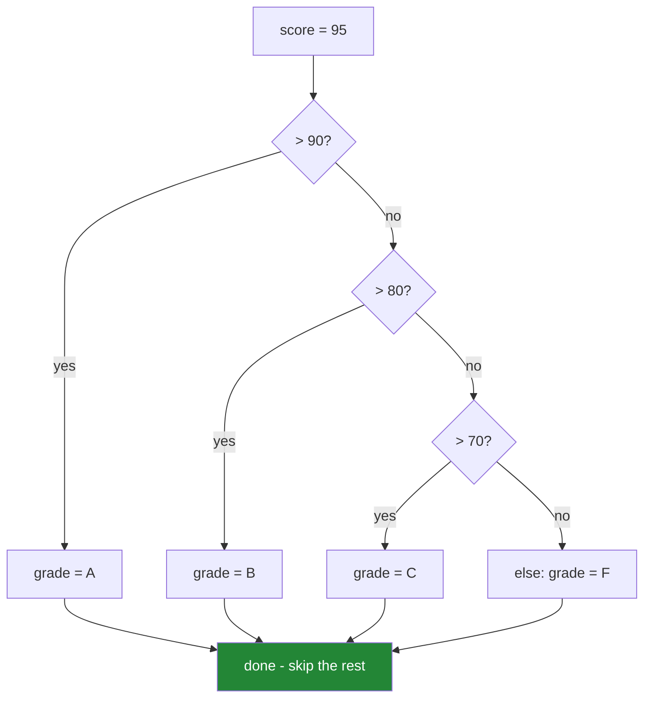

# 2.1 — `if`, `elif`, `else`, and indentation as syntax

## One-line answer

A conditional runs the **first** branch whose test is true and skips the rest — and in Python the
boundaries of those branches are the indentation itself, which is why whitespace is grammar here and
decoration everywhere else.

---

## The story

A support engineer is looking at a validation routine that has started letting bad records through.
It checks a batch of readings, and for each one it appends a complaint to a list if the value is out
of range. The complaints list is returned at the end.

The code is four lines and looks fine. The last line — the `return` — sits one level too far in. It
is inside the loop rather than after it, so the function returns after examining the **first**
record, and every record after the first has never been checked at all.

Nothing raised. The function returned a list, as documented. The list was simply the answer to a
smaller question than anyone asked. Every test passed, because every test batch had one bad record and
it happened to be first.

In most languages a closing brace would have made this visible. In Python the brace *is* the
indentation, which means a whitespace change is a semantic change — and it also means that when the
indentation is right, the structure is impossible to misread, because the layout cannot lie about the
logic.

---

## The idea in plain language

### What a conditional is

A **conditional** — a `if` statement — chooses which code runs. It has one required piece and two
optional ones:

```text
if <test>:
    <block that runs when the test is true>
elif <another test>:
    <block that runs when the first was false and this one is true>
else:
    <block that runs when every test above was false>
```

- **`if`** — required. The `<test>` is any expression; Python asks whether it is true using the
  truthiness rules of [2.2](2.2-truthiness.md).
- **`elif`** — "else if", zero or more times. It is one word, not `else if`, and that is deliberate:
  it keeps a five-way choice at one indentation level instead of five.
- **`else`** — optional, at most one, always last. It takes no test.

The rule that matters: **the branches are checked top to bottom, and exactly one of them runs.** As
soon as a test is true, its block runs and every remaining test is skipped — not evaluated, not
considered. If none is true and there is no `else`, nothing runs and execution continues after the
statement.

### The colon and the block

Two pieces of syntax carry all the structure.

The **colon** ends the header line. Every compound statement in Python has one — `if`, `elif`, `else`,
`for`, `while`, `def`, `class`, `with`, `try`. Forgetting it is the most common syntax error a
beginner produces, and Python 3.10 onwards gives a genuinely helpful message for it.

The **indented block** underneath is the body. Everything indented to the same depth belongs to the
same block; the block ends at the first line indented less. There is no `end`, no `}`, no `fi`.

This is why **indentation is syntax in Python, not style.** In a C-like language you could write the
entire program on one line and a formatter would lay it out for you afterwards; the layout carries no
meaning. In Python the layout *is* the meaning. Two consequences follow:

- A change to whitespace can silently change behaviour, which is the story.
- Code that runs cannot be laid out misleadingly. In C, `if (x) a(); b();` looks like both calls are
  guarded and only `a()` is — a class of bug Python cannot express.

The rule the language enforces is only "consistent within a block". The rule the *community*
enforces, and this project's formatter applies, is **four spaces per level, never tabs**
([Day 2, 2.1](../../../day-02-quality-gate/parts/02-formatting/2.1-why-a-formatter-ends-the-argument.md)).
Mixing tabs and spaces is a `TabError`, and it is the reason files edited in two different editors go
wrong.

### `elif` versus a stack of `if`s

These two look similar and are not the same:

```text
if score > 90: grade = "A"          if score > 90: grade = "A"
elif score > 80: grade = "B"        if score > 80: grade = "B"
elif score > 70: grade = "C"        if score > 70: grade = "C"
```

On the left, a score of 95 sets `"A"` and stops. On the right, 95 matches **all three** tests, each
one overwrites the last, and the grade ends up `"C"`. The right-hand version is not a stylistic
variant; it is a bug that only appears for values matching more than one test — which is every value
in an ordered range like this.

The tell is whether the conditions are **mutually exclusive by construction** (`elif`) or genuinely
independent checks that should all run (separate `if`s). If they are ordered thresholds, they are
never independent.



### Order is part of the logic

Because the first true test wins, **the order of the branches is not arbitrary** — it is part of the
specification. Write the thresholds in the wrong order and every value falls into the first, widest
branch. `if score > 70` first means an A student gets a C. There is no error; there is just a wrong
answer, which is the recurring theme of this whole day.

---

## Why Setu needs it

- **[2.5](2.5-the-conditional-expression.md), today,** is the same choice written as an expression, and
  knowing when each form is right is the point of that part.
- **[Day 6's loops](../../../day-06-loops/parts/02-control-flow/2.1-break-and-which-loop-it-leaves.md)**
  put conditionals inside loops, where an indentation mistake is the story's bug — and `break` versus
  `continue` is decided by a conditional.
- **Day 18's exception handling** (`PY-22`) has the same first-match-wins rule for `except` clauses,
  with the same ordering trap: a broad `except Exception` written first swallows every specific
  handler below it.
- **Day 76 onwards, every ML pipeline** branches on whether it is fitting or transforming. Getting
  that branch wrong is exactly how a scaler gets fitted on test data — Principle 8's leak, expressed
  as an `if`.
- **Day 192's LangGraph** (`LG-`) routes between nodes with conditional edges. A routing function is
  an `if` chain whose branches are graph nodes, and the ordering rule is identical.

---

## The mechanism

First-match-wins, and the stack-of-`if`s bug beside it:

```python
"""One conditional runs. A stack of ifs runs all of them, and the last one wins."""


def grade_elif(score: int) -> str:
    """Correct: the branches are mutually exclusive because elif stops the search."""
    if score > 90:
        return "A"
    elif score > 80:
        return "B"
    elif score > 70:
        return "C"
    else:
        return "F"


def grade_stacked(score: int) -> str:
    """Broken: every matching test runs, so the LAST match wins instead of the first."""
    grade = "F"
    if score > 90:
        grade = "A"
    if score > 80:
        grade = "B"
    if score > 70:
        grade = "C"
    return grade


for score in (95, 85, 75, 65):
    correct, broken = grade_elif(score), grade_stacked(score)
    flag = "" if correct == broken else "   <-- WRONG"
    print(f"score {score}: elif -> {correct}   stacked -> {broken}{flag}")
```

**Line by line:**

- `if score > 90: return "A"` — a `return` inside a branch leaves the function immediately, which is
  why this version needs neither `elif` nor `else` to be correct. It is written with them anyway
  because the parallel structure states "these are four alternatives" more clearly than four
  independent returns.
- `elif score > 80` — reached **only** when the test above was false, so it does not need to say
  `and score <= 90`. That implicit narrowing is the whole value of `elif`, and re-stating it is a
  common way to introduce an off-by-one.
- `grade = "F"` in the second function — the default, set before any test. It is what makes the
  broken version return something for a low score, and it is also the thing that makes the bug
  survive: **the function always returns a plausible grade.**
- Three separate `if`s — a score of 95 satisfies all three, each assignment overwrites the previous,
  and `"C"` is what comes out. **Every row flags**, because ordered thresholds are never independent.
- `flag = "" if correct == broken else "..."` — the conditional expression, which
  [2.5](2.5-the-conditional-expression.md) covers. Used here so the disagreement is printed rather
  than left to the eye.

Now the indentation that changes the answer:

```python
"""The story's bug: one level of indentation moves a return inside the loop."""


def check_all(readings: list[int]) -> list[str]:
    """Correct: the return is outside the loop, so every reading is examined."""
    problems = []
    for index, value in enumerate(readings):
        if value < 0:
            problems.append(f"reading {index} is negative: {value}")
    return problems


def check_first_only(readings: list[int]) -> list[str]:
    """Broken: the return is INSIDE the loop. One level of indentation, entirely different function."""
    problems = []
    for index, value in enumerate(readings):
        if value < 0:
            problems.append(f"reading {index} is negative: {value}")
        return problems
    return problems


batch = [-5, 3, -2, -9]
print("correct:", check_all(batch))
print("broken :", check_first_only(batch))
```

**Line by line:**

- `for index, value in enumerate(readings)` — `enumerate` yields position and value together, so the
  message can name which reading failed. [Day 6,
  1.3](../../../day-06-loops/parts/01-iteration/1.3-enumerate-and-zip.md) covers it; the alternative,
  `for i in range(len(readings))`, is the smell that part names.
- `return problems` in `check_all` — indented four spaces, level with the `for`, so it runs after the
  loop finishes. This is the correct function.
- `return problems` in `check_first_only` — indented eight spaces, inside the `for` body, so it runs
  at the end of the **first** iteration. The loop never reaches a second pass.
- **The two functions differ by four space characters and are entirely different functions.** The
  broken one returns `['reading 0 is negative: -5']` and never sees the `-2` or the `-9`.
- The trailing `return problems` in the broken version exists only so the function is syntactically
  complete for an empty list; a real occurrence of this bug usually has one `return`, and reading it
  is how you find the mistake — ask "is this line level with the `for` or inside it?"
- `batch = [-5, 3, -2, -9]` — **three** bad readings, deliberately. A fixture with exactly one bad
  reading, first in the list, makes both functions agree, which is how the story's tests passed.

And the ordering that quietly reverses the specification:

```python
"""The first true test wins, so branch order is part of the logic."""


def route_backwards(score: float) -> str:
    """Every branch is individually correct. The order makes them all wrong."""
    if score > 0.5:
        return "review"
    elif score > 0.8:
        return "auto-approve"
    elif score > 0.95:
        return "auto-approve-and-notify"
    return "reject"


for score in (0.99, 0.85, 0.6, 0.2):
    print(f"score {score}: -> {route_backwards(score)}")
```

**Line by line:**

- Each test in isolation reads correctly: above 0.5 needs review, above 0.8 can be approved, above
  0.95 is a strong approval.
- `0.99` returns `"review"` — because `0.99 > 0.5` is true and the search stops there. **The two
  branches below are unreachable code**, and nothing in the language says so.
- A linter cannot flag this in general; the tests are opaque expressions and proving unreachability
  requires knowing the ordering of the thresholds. Only a test with a value in each intended band
  catches it, which is the parametrised-test shape from
  [Day 2, 3.1](../../../day-02-quality-gate/parts/03-pytest/3.1-the-test-that-can-go-red.md).
- The fix is to order thresholds **narrowest first** — `> 0.95`, then `> 0.8`, then `> 0.5` — so each
  branch is reachable. Writing them in the order the specification lists them is what produces this
  bug, because specifications are usually written loosest-first.

---

## When it breaks

**The colon nobody typed:**

```text
>>> if x > 5
  File "<stdin>", line 1
    if x > 5
            ^
SyntaxError: expected ':'
```

**What it means.** Exactly what it says, and modern Python points at the character position where the
colon should go. Older versions said only `invalid syntax` with the caret in a less helpful place,
which is one small reason this project pins 3.12
([Day 0, 1.4](../../../day-00-setup/parts/01-toolchain/1.4-python-3-12-under-uv.md)).

**The empty branch:**

```text
>>> if True:
... print("hi")
  File "<stdin>", line 2
    print("hi")
    ^
IndentationError: expected an indented block after 'if' statement on line 1
```

**What it means.** A block cannot be empty and cannot be on the header line's own level. If you
genuinely want a branch that does nothing — a stub you will fill in — the placeholder is `pass`,
which is a statement that does nothing and exists precisely because the grammar requires a body.

**Mixed tabs and spaces, the bug that is invisible on screen:**

```text
>>> exec("if True:\n\tprint('tab')\n        print('spaces')")
  File "<string>", line 3
    print('spaces')
                   ^
TabError: inconsistent use of tabs and spaces in indentation
```

**What it means.** Two lines that look identically indented in your editor are not, because one used a
tab character and the other used spaces. Python refuses to guess how wide a tab is. The fix is to
configure the editor for four spaces and never tabs, and to let the formatter normalise the file
([Day 0, 1.5](../../../day-00-setup/parts/01-toolchain/1.5-the-editor-and-the-interpreter-trap.md)).

**An `else` that has lost its `if`:**

```text
>>> if x > 5:
...     print("big")
... print("always")
... else:
  File "<stdin>", line 4
    else:
    ^^^^
SyntaxError: invalid syntax
```

**What it means.** The unindented `print` closed the `if` statement, so by the time `else` arrives
there is no conditional for it to attach to. This is what a misplaced line looks like when you are
lucky; the story's version — where the misplaced line was still *inside* a valid block — is what it
looks like when you are not.

**And the assignment mistaken for a comparison:**

```text
>>> if x = 5:
  File "<stdin>", line 1
    if x = 5:
       ^^^^^
SyntaxError: invalid syntax. Maybe you meant '==' or ':=' instead of '='?
```

**What it means.** In C this is legal and assigns, which is the origin of an entire genre of bug.
Python makes plain assignment a **statement**, so it cannot appear where an expression is required,
and the class of bug is eliminated by the grammar. The `:=` in the hint is the walrus operator, which
assigns *and* produces a value and is deliberately spelled differently so it can never be a typo for
`==`.

---

## In production

**The professional shape is the guard clause, not the pyramid.** Deeply nested conditionals —
`if valid: if authorised: if in_stock: ...` — grow rightwards until the real work is six levels in
and the `else` branches are pages away from their tests. The alternative is to handle each failure
case first and return immediately, so the happy path stays at one indentation level and reads top to
bottom. [2.5](2.5-the-conditional-expression.md) develops this; the review heuristic is that **more
than two levels of nesting inside a function is a signal to invert something.**

**Branch order is a specification, so it belongs in the tests.** Any `if`/`elif` chain over ordered
thresholds needs one test case per band, including the boundary values themselves — `0.8` exactly,
not just `0.85`. Boundaries are where `>` versus `>=` lives, and a chain that is correct in the middle
of every band can be wrong at all four edges. Parametrised tests exist for exactly this shape.

**Exhaustiveness is the thing a code reviewer checks first.** A chain with no `else` silently does
nothing when every test fails, and "silently does nothing" is indistinguishable from "worked" at the
call site. Mature codebases either end with an `else` that raises — `raise ValueError(f"unhandled
status: {status!r}")` — or return a documented default. The raise is usually right: a status you did
not anticipate is a bug in your model of the world, and finding out immediately is cheaper than
finding out from a report. This is Principle 7 applied to branching.

**What changes at scale.** A long `if`/`elif` chain over string values is a linear scan and, more
importantly, a maintenance surface: every new case is an edit to a shared function. The production
alternatives are a dictionary dispatch (`HANDLERS[status]()` — constant time, and each handler is
independently testable, which Day 8 sets up) or `match`/`case` for structural patterns. Neither
matters for five branches; both matter for fifty. Under concurrency the risk is a **time-of-check to
time-of-use** gap: `if key in cache:` followed by `cache[key]` can fail when another thread evicts
between the two lines, and the fix is one atomic operation — `cache.get(key)` — rather than a
condition plus an access.

**The review comment a senior engineer leaves.** On a stack of independent `if`s over thresholds:
*"These are alternatives, not independent checks — as written a 95 falls through all three and ends up
a C. Make them `elif`, order them narrowest-first, and add a test case per band including the exact
boundary values."*

**The interview question.** *"What is the difference between a chain of `elif`s and a series of
separate `if` statements?"* The answer: an `elif` chain evaluates tests until one is true and then
stops, so exactly one branch runs and later tests are never evaluated; separate `if`s evaluate every
test independently, so several branches can run and the last assignment wins. The follow-up worth
being ready for is *"when would you deliberately want separate `if`s?"* — when the conditions are
genuinely independent and each has its own effect, such as accumulating a list of validation problems
where a record can have more than one thing wrong with it.

---

## Check yourself

```bash
uv run python -c "
def elif_version(s):
    if s > 90: return 'A'
    elif s > 80: return 'B'
    elif s > 70: return 'C'
    return 'F'
def stacked(s):
    g = 'F'
    if s > 90: g = 'A'
    if s > 80: g = 'B'
    if s > 70: g = 'C'
    return g
for s in (95, 85, 75, 65):
    print(s, elif_version(s), stacked(s))
"
```

Predict all eight letters before running. The first row is the one that matters.

**Answer out loud, without scrolling up:**

> Explain what `elif` does that a second `if` does not, and give a concrete input where the two
> versions disagree. Then say why indentation in Python is grammar rather than style, and name one
> class of bug that fact makes impossible.

---

**Next:** [2.2 — Truthiness: what `if x:` actually calls](2.2-truthiness.md)
