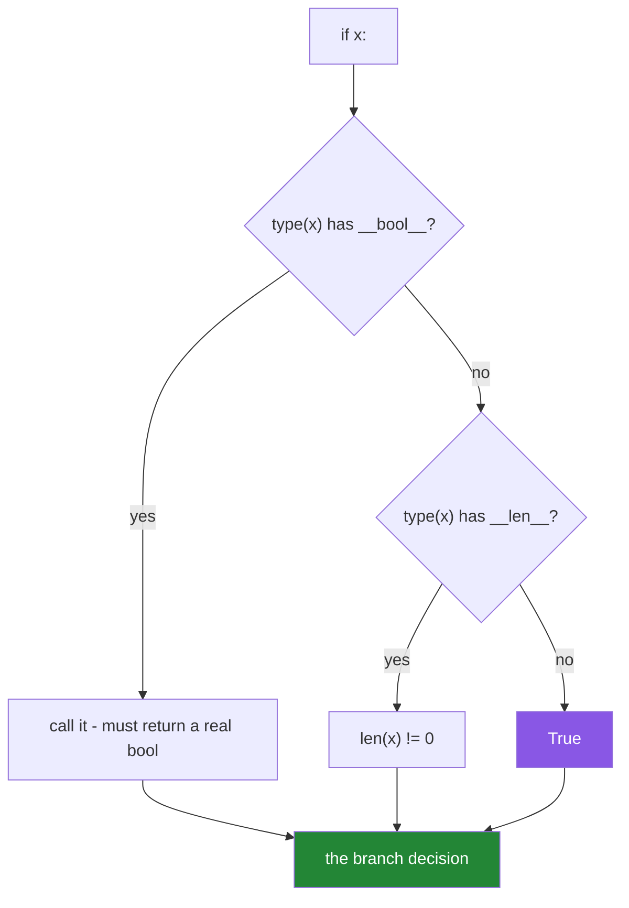

# 2.2 — Truthiness: what `if x:` actually calls

## One-line answer

`if x:` does not test whether `x` exists — it calls `bool(x)`, which asks the object's `__bool__`, or
failing that its `__len__`, and defaults to `True` for anything that defines neither.

---

## The story

A data pipeline has a step that writes a summary only when there is something to summarise. The
author wrote `if results: write_summary(results)` and it worked for months.

Then a downstream team asked for the summary to be written even when a run legitimately produced zero
rows — an empty summary is how they know the run happened. A junior engineer changed the producing
function to return an empty list instead of `None` in that case, believing that would make the check
pass. It did not. Both `None` and `[]` are falsy, and the summary still was not written.

Confused, they changed the check to `if results is not None:`. Now the empty summary is written — and
so, three weeks later, is a summary for a run that failed and returned `[]` because of a crashed
upstream job. The report shows zero rows and everyone reads it as "a quiet day".

The real question was never "does this exist" or "is this empty". It was **"did this run succeed, and
how many rows did it produce"** — two facts that a single falsy check cannot carry. Truthiness is a
convenience that collapses several different questions into one, and the skill is knowing when the
collapse is safe.

---

## The idea in plain language

### Every object has a truth value

Python does not require a condition to be a boolean. `if x:` works for any object at all, because the
interpreter converts whatever you give it into `True` or `False` first. That conversion is
**truthiness**, and the rules are short.

When Python needs the truth value of `x`, it asks in this order:

1. **Does `type(x)` define `__bool__`?** Call it. It must return an actual `bool`; anything else is a
   `TypeError`.
2. **Otherwise, does it define `__len__`?** Call it. Zero is false, anything else is true.
3. **Otherwise, `True`.**

Rule 3 is the one people do not expect: **a plain object with no `__bool__` and no `__len__` is always
truthy.** An instance of a class you just wrote, a function, a module, a class itself — all truthy,
always.



### The falsy set, in full

Everything else is truthy. This list is complete for the built-ins:

| Falsy | Note |
|---|---|
| `False` | |
| `None` | |
| `0`, `0.0`, `0j`, `Decimal(0)`, `Fraction(0)` | every numeric zero |
| `""` | the empty string |
| `[]`, `()`, `{}`, `set()`, `frozenset()`, `range(0)` | every empty built-in container |
| `b""`, `bytearray(b"")` | empty bytes |
| `datetime.time(0, 0)` | **was** falsy before Python 3.5; is truthy now |

And the ones that trip people up, all **truthy**:

- `"0"` — a non-empty string. Every value read from an environment variable, a CSV or a form is a
  string, so `bool(os.environ["DEBUG"])` is `True` for `"0"`, `"false"`, `"no"` and `"off"`
  ([Day 3, 1.2](../../../day-03-keys-and-budget/parts/01-secrets/1.2-dotenv-and-os-environ.md);
  [Day 4, 1.3](../../../day-04-objects/parts/01-objects/1.3-numbers-and-bool.md) meets it as
  `bool("false")`).
- `" "` — a string of one space is not empty.
- `[0]`, `[[]]`, `[None]` — non-empty containers holding falsy things.
- `-1`, `0.1`, `float("nan")` — every number except zero, including `nan`.
- `object()`, any class instance without `__bool__`/`__len__`, any function, any class.

### Why truthiness exists, and where it stops being safe

The convenience is real. `if names:` reads better than `if len(names) > 0:` and works for every
container without knowing which one it is. The whole language leans on it, and idiomatic Python uses
it constantly.

It becomes unsafe the moment **falsy-but-valid** is a possible value. Three questions get collapsed:

| The question you meant | The safe test |
|---|---|
| Is this object missing? | `x is None` |
| Is this container empty? | `len(x) == 0` |
| Is this number zero? | `x == 0` |

`if x:` answers all three at once with "no", and when only one of them was intended, the other two are
silent bugs. A quantity of `0`, a price of `0.0`, an empty search result, an empty string that a user
deliberately submitted, a page number of `0` — every one of these is a real value that a truthiness
check throws away. That is the story, and [3.1](../03-the-or-trap/3.1-the-or-default-and-falsy-zero.md)
is the same mistake in its most common disguise.

### The rule that decides it

**Use truthiness when the falsy values all mean the same thing as each other.** For "do I have any
names to process", empty list and `None` both mean no, so `if names:` is correct and idiomatic. For
"what timeout did the caller ask for", `None` means unset and `0` means no timeout — different
answers — so truthiness is wrong and `is None` is right.

---

## Why Setu needs it

- **[2.3](2.3-if-df-raises.md), immediately next,** is what happens when a type refuses to have a truth
  value at all — the pandas error, explained by rule 1 above.
- **[3.1](../03-the-or-trap/3.1-the-or-default-and-falsy-zero.md), today,** is truthiness inside an
  `or` chain, which is where it does the most damage in real code.
- **Day 3's config loading** already depends on it: `os.getenv("SETU_DEBUG")` returns a string, and
  every non-empty string is truthy, so a flag read this way is on whenever it is set to anything.
- **Day 10's `src/setu/` functions** (`PY-10`) will take optional arguments. Each one needs the
  `is None` versus truthiness decision made deliberately, which is
  [Day 4, 3.1](../../../day-04-objects/parts/03-identity-trap/3.1-the-mutable-default-argument.md)'s
  `if not acc:` trap.
- **Day 30's pandas cleaning** (`PD-`) meets `if df:` and `if value:` where `value` might be `0` or
  `NaN` — and `NaN` is truthy, which surprises everyone who expected "missing" to be falsy.

---

## The mechanism

The three rules, made visible:

```python
"""bool(x) asks __bool__, then __len__, then gives up and says True."""


class Empty:
    """Defines neither. Rule 3 applies."""


class Sized:
    """Defines only __len__. Rule 2 applies."""

    def __init__(self, n: int) -> None:
        self.n = n

    def __len__(self) -> int:
        return self.n


class Explicit:
    """Defines __bool__, which wins over __len__ even when both exist."""

    def __len__(self) -> int:
        return 5

    def __bool__(self) -> bool:
        return False


for obj in (Empty(), Sized(0), Sized(3), Explicit()):
    name = type(obj).__name__
    has_bool = hasattr(type(obj), "__bool__")
    has_len = hasattr(type(obj), "__len__")
    print(f"{name:<9} __bool__={has_bool!s:<5} __len__={has_len!s:<5} -> bool() = {bool(obj)}")
```

**Line by line:**

- `class Empty` with only a docstring — no methods at all. `bool(Empty())` is `True`, by rule 3. **An
  instance of your own class is truthy unless you say otherwise**, which is why `if config:` on a
  settings object tells you nothing.
- `Sized(0)` — defines `__len__` returning zero, so it is falsy. This is how every container in the
  language gets its truthiness; `list` and `dict` do not define `__bool__` at all.
- `Explicit` — defines both. `__bool__` wins, so it is falsy despite `len()` being 5. **A type can
  disagree with its own length**, and knowing rule 1 beats rule 2 is what lets you predict such a
  type's behaviour.
- `hasattr(type(obj), "__bool__")` — asks the **type**, not the instance, because dunder lookups for
  operators and conversions bypass the instance dictionary. Checking `hasattr(obj, ...)` would give
  the same answer here but is the wrong habit; Day 15 (`PY-17`) explains why.
- `f"{has_bool!s:<5}"` — `!s` forces `str()` before the alignment spec is applied, because a raw bool
  cannot be aligned with `<5` directly.

Now the falsy set and its impostors, side by side:

```python
"""The complete falsy set, and the values that look falsy and are not."""

falsy = [False, None, 0, 0.0, "", [], (), {}, set(), range(0), b""]
truthy_surprises = ["0", "false", "None", " ", [0], [[]], -1, 0.1, float("nan"), object]

print("FALSY:")
for value in falsy:
    print(f"   bool({value!r:<10}) = {bool(value)}")

print("TRUTHY, despite appearances:")
for value in truthy_surprises:
    print(f"   bool({value!r:<10}) = {bool(value)}")
```

**Line by line:**

- `falsy = [...]` — every falsy built-in in one list. Worth reading rather than memorising: the
  pattern is "zero, empty, nothing".
- `"0"` and `"false"` — non-empty strings, therefore truthy. **This is the environment-variable bug**,
  and it is why every config flag needs an explicit parser rather than a `bool()` call.
- `[0]` and `[[]]` — containers of length 1. The container's emptiness is what matters, never its
  contents.
- `float("nan")` — truthy. "Not a number" is not "no number"; it is a float that happens to compare
  unequal to everything including itself
  ([Day 4, 1.3](../../../day-04-objects/parts/01-objects/1.3-numbers-and-bool.md)). Treating `NaN` as
  falsy is a mistake that survives into pandas, where missing values are `NaN` and `if value:` on one
  is `True`.
- `object` — the class, not an instance. Classes, functions and modules are all truthy, so
  `if my_function:` is always true and never the call you meant.
- `!r` in the f-string — `repr()`, so `""` prints as `''` and is distinguishable from `0`.

And the story's collapse, made explicit:

```python
"""One check, three questions. Separating them is the fix."""


def summarise(results: list[dict] | None) -> str:
    """Truthiness collapses 'failed' and 'succeeded with nothing' into one branch."""
    if results:
        return f"summary of {len(results)} rows"
    return "no summary written"


def summarise_explicit(results: list[dict] | None) -> str:
    """Two questions, asked separately, in the order that makes them distinguishable."""
    if results is None:
        return "run failed - no summary written"
    return f"summary of {len(results)} rows"


for value in ([{"row": 1}], [], None):
    print(f"{value!r:<12} truthy -> {summarise(value):<28} explicit -> {summarise_explicit(value)}")
```

**Line by line:**

- `results: list[dict] | None` — the annotation already tells you there are three states: a non-empty
  list, an empty list, and `None`. **Whenever a type annotation contains `| None`, truthiness is
  suspect**, because there are now at least two falsy possibilities with different meanings.
- `if results:` — one branch for both `[]` and `None`. The function cannot distinguish a successful
  empty run from a failure, which is the story.
- `if results is None:` — asks the missing question first, so the remaining branch knows it has a
  list and can report its length honestly, including zero.
- The `[]` row is the one to read. The truthy version says "no summary written"; the explicit version
  says "summary of 0 rows". **Both are one line of code, and only one of them is the answer the
  downstream team asked for.**
- Note that `summarise_explicit` has no `else`. Handling the exceptional case first and returning is
  the guard-clause shape from [2.5](2.5-the-conditional-expression.md), and it keeps the main path
  unindented.

---

## When it breaks

**`__bool__` that returns something other than a bool:**

```text
>>> class Bad:
...     def __bool__(self): return 1
...
>>> bool(Bad())
Traceback (most recent call last):
  File "<stdin>", line 1, in <module>
TypeError: __bool__ should return bool, returned int
```

**What it means.** The protocol is strict: truthiness must be a real `True` or `False`, not something
truthy. Returning `1` — which *is* truthy — still fails. Python is refusing an almost-right answer
rather than accepting it, which is the same instinct as
[1.3](../01-operators/1.3-comparison-and-chaining.md)'s refusal to order unrelated types.

**The environment flag that is always on:**

```text
>>> import os
>>> os.environ["SETU_DEBUG"] = "false"
>>> if os.environ.get("SETU_DEBUG"):
...     print("debug mode ON")
...
debug mode ON
```

**What it means.** `"false"` is a non-empty string. Nothing raises, nothing warns, and debug logging
runs in production. The fix is an explicit parser:
`os.environ.get("SETU_DEBUG", "").strip().lower() in {"1", "true", "yes", "on"}`. **Every boolean that
crosses a text boundary needs one**, and Day 19's Pydantic settings (`PY-24`) exist largely to stop
people writing it by hand each time.

**The class instance that is always truthy:**

```text
>>> class Config:
...     def __init__(self): self.values = {}
...
>>> c = Config()
>>> if c:
...     print("config present")
...
config present
>>> bool(c.values)
False
```

**What it means.** Rule 3. `Config` defines neither `__bool__` nor `__len__`, so it is truthy even
though it holds nothing. If "empty config" should be falsy, the class must say so by defining
`__len__` or `__bool__` — which is a design decision, and one many library authors deliberately
decline to make so that `if config:` cannot be misread.

**And the one that does not raise, ever:**

```text
>>> page = 0
>>> if page:
...     print(f"fetching page {page}")
... else:
...     print("no page requested")
...
no page requested
```

**What it means.** Page zero is a legitimate page number and the check discarded it. There is no
traceback and no warning; the pagination simply starts at page one and the first page of results is
never fetched. This is the entire class of falsy-but-valid bugs in five lines, and the fix is
`if page is not None:`.

---

## In production

**The professional rule is a two-part habit: use truthiness for containers, use `is None` for optional
values, and never use either for a number.** `if rows:` is idiomatic and correct — an empty list and
a missing list almost always mean the same thing where a list of work items is concerned. `if
timeout:` is a bug waiting for someone to pass `0`. `if count:` is a bug waiting for a legitimately
empty count. Reviewers read a bare truthiness check on anything numeric or optional as a question:
"what should happen when this is zero?"

**Boolean parsing at the boundary is not optional in a real system.** Every value arriving from an
environment variable, a CSV, a query string, a YAML file or a form is text. `bool(text)` is almost
never what you want, and the failure is asymmetric: a flag stuck **on** in production (debug logging,
a dry-run flag that is not dry, a feature gate) is far more expensive than one stuck off. Production
codebases funnel these through one function or one settings model, so the parsing rule exists once and
is tested once — which is also what makes `"yes"`, `"1"` and `"on"` behave consistently instead of
depending on which module read the variable.

**What changes with real data: `NaN` and `NaT`.** In pandas, missing numeric data is `float("nan")`
and missing timestamps are `NaT`, and **`NaN` is truthy while `NaT` is falsy** — an inconsistency you
will meet on Day 30. Neither can be tested with truthiness reliably. The correct tests are
`math.isnan(x)` or `pd.isna(x)`, and the reason `pd.isna` exists as a separate function rather than a
truthiness rule is precisely that "missing" and "false" are different concepts that a single truth
value cannot express.

**What changes at scale.** `bool(x)` on a list is `O(1)` — `list.__len__` is a stored count, not a
walk. But `if generator:` is always `True` regardless of whether the generator will yield anything,
because a generator object defines neither `__bool__` nor `__len__` (rule 3 again), and there is no
way to know if it is empty without consuming it. That is a real trap from Day 11 (`PY-11`) onwards,
and the professional answer is to materialise deliberately (`items = list(gen)`) or to restructure so
emptiness is handled by the loop that consumes it. Under concurrency, a truthiness check on a shared
container is a time-of-check-to-time-of-use race: `if queue:` then `queue.pop()` can fail when another
thread drained it in between, and the fix is one atomic operation with a timeout rather than a
condition.

**The review comment a senior engineer leaves.** On `if user.credit_limit:` — *"This treats a credit
limit of 0 as 'not set', which is exactly backwards for a customer we have deliberately restricted.
Use `is not None`, and if 0 and `None` really do mean the same thing here, say so in a comment because
the next reader will assume they do not."*

**The interview question.** *"What does `if x:` actually do?"* The answer that separates people is the
protocol: it calls `bool(x)`, which tries `__bool__` first, falls back to `__len__` being non-zero,
and defaults to `True` if the type defines neither. The natural follow-up is *"name a bug caused by
truthiness"*, and the strongest answer is a concrete falsy-but-valid value — a zero quantity, an empty
string the user typed on purpose, a page index of 0, a timeout of 0 meaning "do not wait" — with the
fix being `is None`. If they push further, `bool("false")` being `True` is the environment-variable
answer, and `float("nan")` being truthy is the data-cleaning one.

---

## Check yourself

```bash
uv run python -c "
class Empty: pass
class Sized:
    def __len__(self): return 0
print('own class :', bool(Empty()), '| with __len__ 0:', bool(Sized()))
for v in ['0', 'false', ' ', [0], -1, float('nan'), 0.0, '', []]:
    print(f'  bool({v!r:<12}) = {bool(v)}')
"
```

Predict every line. The first is rule 3; the `'0'` and `nan` rows are the two that cost people a
production incident.

**Answer out loud, without scrolling up:**

> State the three rules `bool(x)` follows, in order. Then name the three different questions that
> `if x:` collapses into one, and give the safe test for each.

---

**Next:** [2.3 — Why `if df:` raises and `if len(df):` does not](2.3-if-df-raises.md)
