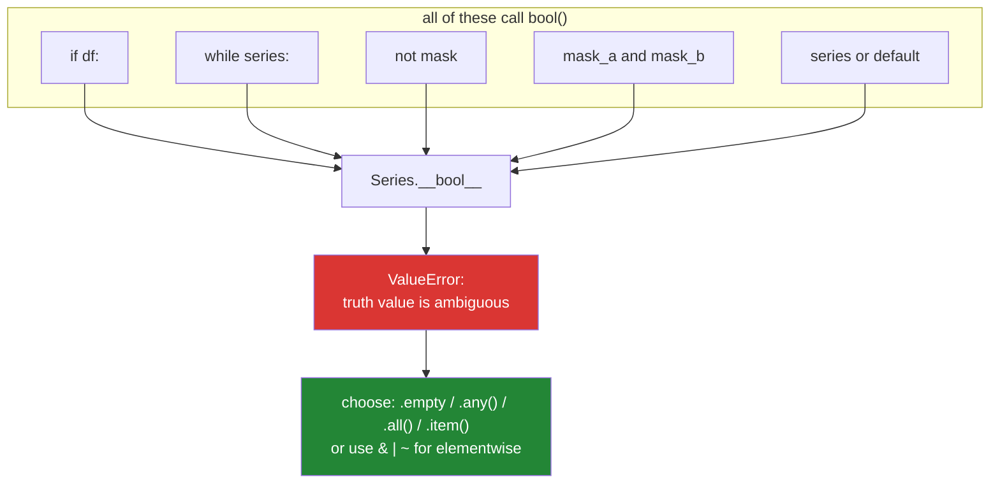

# 2.3 — Why `if df:` raises and `if len(df):` does not

## One-line answer

A DataFrame refuses to have a truth value because there are four different sensible answers and
choosing one silently would give wrong results — so it raises, and `len(df)` works because "how many
rows" is a question with exactly one answer.

---

## The story

A teacher stands in front of thirty children and asks, "did you finish your homework?"

Thirty hands go up at different speeds. Some yes, some no, some who did half of it. There is no
single answer to give back, because the question was asked of thirty people at once and the answer is
thirty answers.

A teacher who wants one answer has to ask a different question. *Did anyone finish?* *Did everyone
finish?* *How many finished?* Each of those has exactly one answer, and each of them is a different
question.

Now the code. A nightly job loads yesterday's records, filters them, and emails a digest. The author
guarded the email like this:

```text
if filtered_df:
    send_digest(filtered_df)
```

It ran once against a small sample and raised straight away:

```text
ValueError: The truth value of a DataFrame is ambiguous.
```

They looked it up, found `if not filtered_df.empty:` in an answer somewhere, pasted it in, and it
worked.

Two months later a colleague adds a second guard, this time on a column of scores. They write
`if scores:` out of habit, get the same error with `Series` in the message instead of `DataFrame`,
and paste in `.empty` again. Then they write `if score_value:` on a single extracted number — which
does **not** raise, because one number is one answer — and it quietly skips every row whose score is
exactly `0.0`.

The first two errors were the library protecting them. The third was the same misunderstanding
arriving in a place where the library could not help. **The error message is a feature, and what it
is trying to teach is that thirty answers are not one answer.**

---

## The idea in plain language

### The refusal, and why it is deliberate

[2.2](2.2-truthiness.md) established that `if x:` calls `bool(x)`, which tries `__bool__` first.
pandas defines `__bool__` on `DataFrame` and `Series`, and its entire body raises.

That is unusual. Most types either give an answer or fall back to `__len__`. pandas could easily have
done the latter — "a DataFrame is truthy when it has rows" — and deliberately did not, because the
question `if df:` is asked with at least four different meanings:

| What the author might have meant | The honest expression |
|---|---|
| Does this frame have any rows at all? | `not df.empty` or `len(df) > 0` |
| Is *any* value in this boolean column true? | `series.any()` |
| Are *all* values in this boolean column true? | `series.all()` |
| Is this one-element object's single value true? | `series.item()` |

Each is a different filter and none is more obvious than the others. A library that guessed would
produce **silently wrong results** — the worst failure mode there is, and the one this whole day keeps
returning to. Raising converts a wrong answer into a stopped program, which is a trade every mature
library makes.

The message names all the alternatives precisely so the author has to choose:

```text
ValueError: The truth value of a Series is ambiguous. Use a.empty, a.bool(), a.item(), a.any() or a.all().
```

### Why `len(df)` works

`len()` calls `__len__`, and pandas defines it to mean **the number of rows**. That question has one
answer. `len(df)` is `0` for an empty frame and `n` otherwise, so `if len(df):` is unambiguous — and
it works precisely because it asks the narrower question rather than the vague one.

`df.empty` is the same question spelled as a property, and it is what pandas' own documentation
recommends, because it says what it means without a comparison. Note the small trap: `df.empty` is
`True` when there are no rows **or** no columns, so an all-`NaN` frame with rows is *not* empty. If
your definition of empty is "no usable data", `.empty` is not it, and `df.dropna().empty` might be.

### The same refusal you already met

This is [1.5](../01-operators/1.5-bitwise-and-the-mask.md)'s error, from the other side.

- `mask_a and mask_b` raises because `and` needs a truth value → calls `bool()` → refused.
- `if df:` raises because `if` needs a truth value → calls `bool()` → refused.
- `not series` raises for the same reason.
- `series or default` raises for the same reason.

**One cause, four symptoms.** Recognising `bool()` behind all of them is what stops the guessing.



### The general principle, which outlives pandas

The refusal is not a pandas quirk. It is an instance of a rule worth carrying everywhere: **when one
input maps to several defensible outputs, raise rather than pick.** NumPy arrays of more than one
element do the same thing. So does Python itself when it refuses to order a `None` against an `int`
([1.3](../01-operators/1.3-comparison-and-chaining.md)) — there is no correct answer, so there is no
answer.

The counter-example is instructive: a **zero-element or one-element** NumPy array *does* have a truth
value, because for those there is only one sensible reading. Ambiguity, not type, is what triggers the
refusal.

---

## Why Setu needs it

- **Day 26 onwards is pandas** (`PD-01` and everything after). This error will be the first one you
  hit and the one you hit most; meeting it here, with an explanation rather than a paste, saves the
  evening.
- **Day 20's NumPy** (`NP-01`) raises the same way for arrays, with a slightly different message that
  mentions `a.any()` and `a.all()`.
- **Day 30's cleaning work** (`PD-`) is full of guards like "only run this step if the frame has
  rows", and each one is a choice between `.empty`, `len()`, and a column-level `.any()`.
- **Day 76's ML pipeline** (`ML-`) checks whether a split produced training rows before fitting. A
  guard written with truthiness there does not raise — it raises on the frame and *not* on the count —
  so knowing which of your guards are protected by the library and which are not is the actual skill.
- **Day 162's retrieval** (`RAG-`) checks whether a search returned results before calling a model. An
  empty result set that is falsy and a failed search that is `None` are the
  [2.2](2.2-truthiness.md) collapse again, now with a request budget attached.

---

## The mechanism

pandas is not installed until Day 26 (Principle: packages are added on the day they are first used),
so the mechanism is reproduced here in pure Python. This class raises exactly as pandas does, from the
same method:

```python
"""A Column that refuses bool() for the same reason a Series does."""

from __future__ import annotations


class Column:
    """A named sequence of values. It knows its length; it declines to have a truth value."""

    def __init__(self, name: str, values: list[object]) -> None:
        self.name = name
        self.values = values

    def __repr__(self) -> str:
        return f"Column({self.name!r}, {self.values!r})"

    def __len__(self) -> int:
        return len(self.values)

    @property
    def empty(self) -> bool:
        return len(self.values) == 0

    def any(self) -> bool:
        return any(bool(v) for v in self.values)

    def all(self) -> bool:
        return all(bool(v) for v in self.values)

    def item(self) -> object:
        if len(self.values) != 1:
            raise ValueError("can only convert a Column of size 1 to a scalar")
        return self.values[0]

    def __bool__(self) -> bool:
        raise ValueError(
            f"The truth value of a Column is ambiguous. Use a.empty, a.item(), a.any() or a.all()."
        )


scores = Column("score", [0.0, 0.9, 0.0])
blank = Column("score", [])

print("len(scores)   :", len(scores))
print("scores.empty  :", scores.empty, "| blank.empty:", blank.empty)
print("scores.any()  :", scores.any(), "| scores.all():", scores.all())

for expression, thunk in [
    ("if scores:", lambda: bool(scores)),
    ("not scores", lambda: not scores),
    ("scores and blank", lambda: scores and blank),
    ("len(scores) > 0", lambda: len(scores) > 0),
]:
    try:
        print(f"{expression:<18} -> {thunk()}")
    except ValueError as exc:
        print(f"{expression:<18} -> ValueError: {exc}")
```

**Line by line:**

- `def __len__` — the honest question, with one answer. Defining it means `len(col)` works even though
  `bool(col)` does not, which is the asymmetry the title of this part is about.
- `@property def empty` — a **property** is a method you call without parentheses; Day 15 (`PY-17`)
  covers the decorator. It is here because pandas spells it `df.empty`, and copying the spelling makes
  the analogy exact.
- `def any` / `def all` — the two aggregate answers. `any()` and `all()` are builtins that consume an
  iterable and return one boolean; they are the two readings a library would have had to choose
  between.
- `def item` — the "there is exactly one value, give me it" reading, which **raises when the size is
  not 1**. This is the fourth alternative in pandas' message and the one people forget exists.
- `def __bool__` raising — the refusal itself. Note it raises `ValueError`, not `TypeError`: the type
  is fine, the *value* has no unambiguous truth. pandas made the same choice, and matching it means
  your `except` clauses transfer.
- `lambda: bool(scores)` — a **thunk**, a zero-argument function used to delay evaluation so the
  expression can be run inside a `try` in a loop. Without the lambda, the expression would be
  evaluated when the list was built and raise before the loop started. `lambda` is Day 11 (`PY-12`);
  it appears here as a tool, not a topic.
- `scores and blank` — raises, and the error mentions neither `and` nor a Column-specific problem.
  This is [1.5](../01-operators/1.5-bitwise-and-the-mask.md)'s error arriving from
  [2.4](2.4-and-or-return-operands.md)'s operator.
- `len(scores) > 0` — the only expression in the list that answers. It works because it asked a
  narrower question.

Now the third bug from the story — the one no library can protect you from:

```python
"""The two guards a library can catch, and the one it cannot."""

rows = [
    {"title": "A", "score": 0.9},
    {"title": "B", "score": 0.0},
    {"title": "C", "score": 0.4},
]

kept_truthy = []
kept_explicit = []
for row in rows:
    if row["score"]:
        kept_truthy.append(row["title"])
    if row["score"] is not None:
        kept_explicit.append(row["title"])

print("guard `if row['score']:`          kept:", kept_truthy)
print("guard `if row['score'] is not None:` kept:", kept_explicit)
```

**Line by line:**

- `row["score"]` is a plain `float`. It has an ordinary truth value, so **nothing raises** — the
  protection that `Series.__bool__` gave you disappears the moment you extract a scalar.
- `if row["score"]:` — drops paper `"B"`, whose score is exactly `0.0`. A score of zero is a real
  score; it means "the model looked and found nothing", which is different from "no score was
  computed".
- `if row["score"] is not None:` — keeps all three, which is what the author meant. If the intent were
  "keep positive scores", the honest expression is `if row["score"] > 0:` — and writing the comparison
  out is what makes the threshold reviewable.
- **The library caught two of the story's three mistakes and could not catch the third.** That is the
  reason this part sits after [2.2](2.2-truthiness.md) rather than replacing it: the pandas error
  teaches the lesson loudly, and the scalar case is where you have to have learned it.

---

## When it breaks

**The DataFrame, verbatim:**

```text
>>> import pandas as pd
>>> df = pd.DataFrame({"a": [1, 2]})
>>> if df:
...     print("has rows")
...
Traceback (most recent call last):
  File "<stdin>", line 1, in <module>
ValueError: The truth value of a DataFrame is ambiguous. Use a.empty, a.bool(), a.item(), a.any() or a.all().
```

**What it means.** `if` called `bool(df)` and pandas refused. The fix depends on what you meant, and
for "does it have rows" it is `if not df.empty:` or `if len(df):`. Do not reach for `.any()` here — on
a DataFrame that returns one boolean **per column**, and using it in an `if` raises the same error
again, which is a genuinely confusing second round.

**NumPy, which words it differently:**

```text
>>> import numpy as np
>>> if np.array([True, False]):
...     pass
...
Traceback (most recent call last):
  File "<stdin>", line 1, in <module>
ValueError: The truth value of an array with more than one element is ambiguous. Use a.any() or a.all()
```

**What it means.** Note "with more than one element" — a single-element array *does* convert, so
`bool(np.array([True]))` is `True`. The ambiguity, not the type, is what triggers the refusal, and
this is why a bug can hide until the array grows past length one.

**`.empty` answering a question you did not ask:**

```text
>>> import pandas as pd
>>> df = pd.DataFrame({"a": [float("nan"), float("nan")]})
>>> df.empty
False
>>> len(df)
2
```

**What it means.** Two rows of nothing is not empty. `.empty` means "no rows or no columns", not "no
usable data". If the guard exists to avoid emailing a digest with nothing in it, `.empty` is the wrong
test and `df.dropna().empty` or a count of valid rows is the right one. This is the failure that only
appears with real data, because test fixtures are rarely all-missing.

**And the scalar that raises nothing at all:**

```text
>>> score = 0.0
>>> if score:
...     print("scored")
... else:
...     print("no score")
...
no score
```

**What it means.** No error, wrong branch. Every guard in your codebase that operates on a scalar has
this behaviour, and the pandas error trained you to think the language would tell you. It will not.

---

## In production

**Write the question, not the object.** In mature pandas code you almost never see a bare `if df:`,
and not only because it raises — you see `if df.empty:`, `if len(df) < MIN_ROWS:`, `if
mask.any():`, `if not required_columns.issubset(df.columns):`. Each names its own condition, so a
reader six months later knows what "no data" meant to the author. This is the same instinct as
[2.2](2.2-truthiness.md)'s "use the specific test": the truthiness shortcut is fine when there is only
one reading and actively harmful when there are several.

**Guard clauses on empty data belong at the top of the function, and they should say what they did.**
A pipeline step that receives an empty frame and returns silently is indistinguishable from one that
worked. Real jobs log the decision — `logger.info("no rows after filtering; skipping digest")` — and
often emit a metric, because "zero rows" being *normal* on Sunday and *an incident* on Monday is a
distinction only the count can make. The story's downstream team wanted an empty summary for exactly
this reason.

**What changes at scale.** `len(df)` is O(1); `df.empty` is O(1); `df.any()` walks the data. On a
large frame inside a loop, an accidental `.any()` per iteration is a full pass per iteration, and the
job goes from minutes to hours with no error. The other scale trap is `len()` on a lazy object: a
generator, a database cursor, or a Polars/Dask lazy frame has no length without doing the work, and
`len(x)` there either raises `TypeError: object of type 'generator' has no len()` or triggers a full
materialisation of something that did not fit in memory. **Emptiness of a lazy stream is not a cheap
question**, and the professional answer is to restructure so the consumer handles zero iterations
naturally rather than asking in advance — which [Day 6, 2.3](../../../day-06-loops/parts/02-control-flow/2.3-for-else.md)
gives you a clean idiom for.

**Under concurrency**, an emptiness check followed by an action is the time-of-check-to-time-of-use
race again. In a data pipeline the shared thing is usually a file or a table, not an in-memory frame:
`if not df.empty: write(path)` where another process is appending means the frame you checked is not
the data you write. The defence is a transaction or an atomic rename, not a better condition.

**The review comment a senior engineer leaves.** On `if not df.empty:` guarding a report: *"`.empty`
is `False` for a frame of all-NaN rows, which is what an upstream failure produces here. Check the
count of non-null rows in the column the report actually uses, and log the number either way so we can
tell 'quiet day' from 'broken job'."*

**The interview question.** *"Why does `if df:` raise?"* The shallow answer is "because pandas says
it's ambiguous". The strong answer explains the design: `if` calls `bool()`, `bool()` calls
`__bool__`, and pandas implements `__bool__` to raise because a frame could reasonably mean "has
rows", "any value is true", "all values are true", or "the single value is true" — four different
filters, and silently picking one would produce wrong results rather than an error. The follow-up is
*"so how do you check it?"* — `len(df)` or `.empty` for rows, `.any()`/`.all()` for a boolean column —
and the best candidates add the sting in the tail: the same mistake on a scalar `0.0` does **not**
raise, so the library only protects you where it can see the ambiguity.

---

## Check yourself

```bash
uv run python -c "
class Column:
    def __init__(self, values): self.values = values
    def __len__(self): return len(self.values)
    def any(self): return any(self.values)
    def __bool__(self):
        raise ValueError('The truth value of a Column is ambiguous. Use a.empty, a.any() or a.all().')
c = Column([0.0, 0.9])
print('len :', len(c), '| any:', c.any())
for label, fn in [('if c', lambda: bool(c)), ('not c', lambda: not c), ('len(c) > 0', lambda: len(c) > 0)]:
    try:
        print(f'{label:<12} ->', fn())
    except ValueError as exc:
        print(f'{label:<12} -> ValueError: {exc}')
print('scalar 0.0 in an if ->', 'kept' if 0.0 else 'DROPPED, silently')
"
```

The last line is the point of the whole part.

**Answer out loud, without scrolling up:**

> Name the four things `if df:` could have meant, and say why pandas raises instead of picking one.
> Then explain why `len(df)` is fine, and name one place the same mistake gets no error at all.

---

**Next:** [2.4 — `and` and `or` return an operand, not a boolean](2.4-and-or-return-operands.md)
