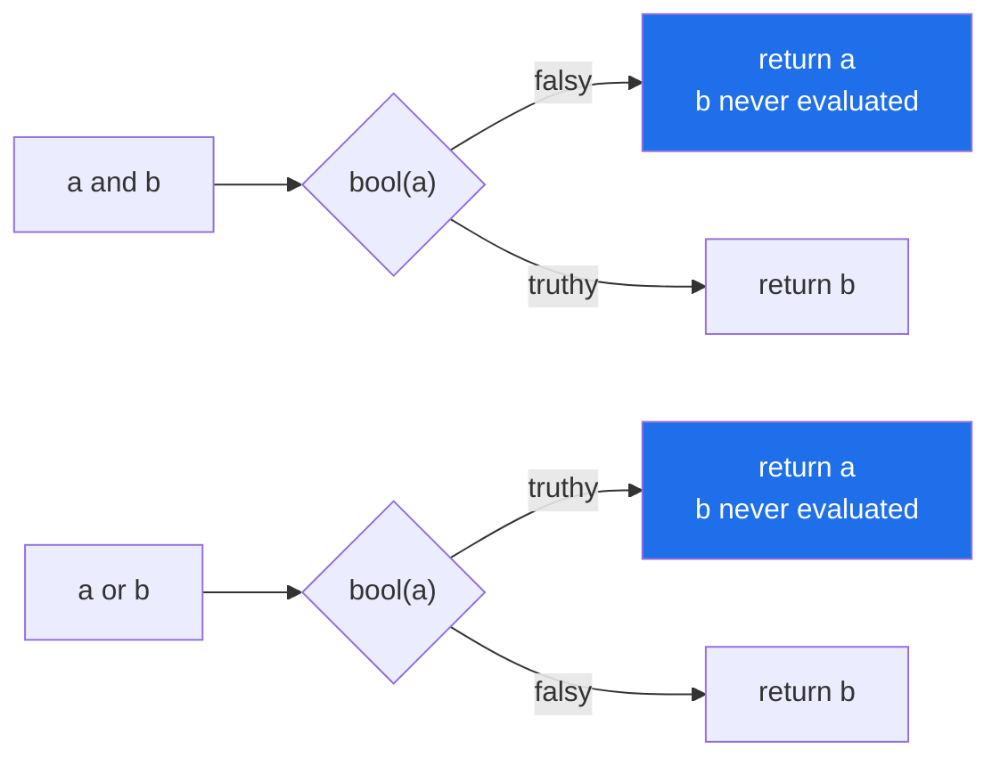

# 2.4 — `and` and `or` return an operand, not a boolean

## One-line answer

`a and b` returns `a` when `a` is falsy and otherwise returns `b`; `or` is the mirror image — so
neither operator produces `True` or `False` unless one of the operands already was one, and both stop
evaluating the moment the answer is decided.

---

## The story

"Tea or coffee?"

Nobody answers "yes."

You answer "coffee", and everybody understands, because in ordinary English an *or* between two
things hands you back **one of the things**. It does not hand you back a verdict. If somebody
genuinely replied "yes" to tea-or-coffee, you would laugh, and then you would ask again.

Python's `or` behaves like the polite human answer, not like the literal one. So does `and`. This is
enormously useful and it is the source of a whole family of quiet bugs.

A function returns a display name:

```text
return user.nickname or user.full_name or "anonymous"
```

It is a lovely line. It reads as "nickname, or failing that the full name, or failing that
anonymous", and it works for years.

Then the product adds a feature: people can deliberately clear their nickname so that their full name
shows instead. Clearing it sets it to empty text. Empty text counts as false here. The `or` chain
skips it — which is exactly what was wanted, entirely by accident, and nobody involved understands
why it worked.

Six months later the same shape appears in a different file, this time on a number:

```text
retries = config.get("retries") or 3
```

Somebody sets `retries` to `0`, meaning "do not retry, fail immediately". Zero counts as false. They
get three retries, and on an operation that is not safe to repeat, the thing happens three times.

And in a third place, a debugging session runs an hour long because somebody logged the result of an
`and`:

```text
log.info("checks passed: %s", has_key and has_quota)
```

It printed `0` rather than `False`, and the person reading the log spent forty minutes hunting for a
count that did not exist.

Three incidents, one fact: **`and` and `or` do not hand back true or false.** They hand back one of
the two things you gave them, and everything else in this document follows from that.

---

## The idea in plain language

### They are not operators, and that is the first surprise

`and`, `or` and `not` are **keywords**, part of the grammar, not operators that dispatch to a dunder
method. There is no `__and_keyword__` to define, which is why an array library has to borrow `&`
instead ([1.5](../01-operators/1.5-bitwise-and-the-mask.md)). The language reserves them because they
need to control *whether the second operand is evaluated at all*, and a method call cannot do that —
by the time a method is called, its arguments have already been evaluated.

### The exact rule

Both keywords are defined in terms of truthiness ([2.2](2.2-truthiness.md)) and both return an
**operand**, never a fresh boolean:

| Expression | Rule | Returns |
|---|---|---|
| `a and b` | if `a` is falsy, the answer is decided — return `a`. Otherwise return `b`. | `a` or `b` |
| `a or b` | if `a` is truthy, the answer is decided — return `a`. Otherwise return `b`. | `a` or `b` |
| `not a` | | **always a real `bool`** |

`not` is the exception: it always produces `True` or `False`, because there is nothing to pass
through.

Read `and` as "the first falsy one, or the last one" and `or` as "the first truthy one, or the last
one" and you can evaluate any chain by eye:

- `0 and 5` → `0` (first is falsy, decided)
- `3 and 5` → `5` (first is truthy, so the answer is whatever the second is)
- `0 or 5` → `5`
- `"" or None or 0` → `0` — **all falsy, so the last one comes back**, and the result is falsy but is
  not `False`.

### Short-circuiting is the reason, not a side effect

Because the answer is sometimes decided by the first operand alone, the second is **not evaluated**.
This is called **short-circuit evaluation**, and it is load-bearing:

```text
if user is not None and user.is_admin:      # safe: attribute access never runs when user is None
if len(items) > 0 and expensive_check(items):  # the expensive call is skipped for empty input
```

Swap the halves of either line and you get an `AttributeError` or a wasted call. **The order of
operands in an `and`/`or` chain is part of its correctness**, not a matter of taste — the cheap or
protective test goes first.



### Where the returned-operand rule helps and where it hurts

**It helps** in a condition, because the condition only cares about truthiness and the pass-through is
invisible: `if a and b:` behaves exactly as you expect regardless of what the operands are.

**It hurts** the moment you keep the value:

- **Assigning it** — `retries = config.get("retries") or 3` is the story's second bug, and
  [3.1](../03-the-or-trap/3.1-the-or-default-and-falsy-zero.md) is entirely about this line.
- **Returning it** — a function documented as returning `bool` that ends
  `return has_key and has_quota` returns `0`, `None` or `""` on the falsy path. Type checkers catch
  this; readers do not.
- **Logging or displaying it** — the story's third bug.
- **Comparing it** — `(a and b) == False` is `False` when `a` is `0`, because `0 == False` is `True`…
  which happens to work here and does not when `a` is `""`. Never compare a boolean expression to
  `False`.

The fix in every case is one function: `bool(...)` around the expression, or better, an explicit
comparison that states the real question.

---

## Why Setu needs it

- **[3.1](../03-the-or-trap/3.1-the-or-default-and-falsy-zero.md), today,** is the `or`-default idiom
  in full, including the two correct replacements.
- **[2.5](2.5-the-conditional-expression.md), next,** is the conditional expression, which is what you
  reach for when `or` is not safe.
- **Day 6's retry loop** (`PY-05`) guards each attempt with a condition like
  `attempt < cap and is_retryable(error)`. Short-circuit order matters: checking the cap first is what
  keeps a malformed error object from blowing up the loop.
- **Day 3's key loading** already uses this shape — `os.getenv("GEMINI_API_KEY") or ""` — and knowing
  the rule is what tells you whether that line is correct
  ([Day 3, 1.2](../../../day-03-keys-and-budget/parts/01-secrets/1.2-dotenv-and-os-environ.md)).
- **Day 182's agent loop** (`AGT-01`) decides whether to call a tool based on several conditions
  combined with `and`. A cheap local check placed after an expensive model call is a request-budget
  bug (Principle 5), not just a style one.

---

## The mechanism

The pass-through, which is invisible until you print it:

```python
"""and/or return an operand. Watch the types come back."""

cases = [
    ("0 and 5", 0 and 5),
    ("3 and 5", 3 and 5),
    ("'' and 'x'", "" and "x"),
    ("0 or 5", 0 or 5),
    ("3 or 5", 3 or 5),
    ("'' or None or 0", "" or None or 0),
    ("[] or {} or 'last'", [] or {} or "last"),
    ("not 0", not 0),
    ("not 'x'", not "x"),
]

for source, value in cases:
    print(f"{source:<18} -> {value!r:<8} type={type(value).__name__}")
```

**Line by line:**

- `0 and 5` → `0`, an `int`. The first operand was falsy, the answer was decided, and `5` was never
  looked at.
- `3 and 5` → `5`. The first was truthy, so the result is *whatever the second operand is* — the
  keyword does not convert it.
- `"" or None or 0` → `0`. Chains evaluate left to right and, when everything is falsy, **the last
  operand is what comes back**. The result is falsy, so it behaves correctly in an `if`, and it is
  `0` rather than `False`, so it behaves wrongly the moment you print it.
- `not 0` → `True`, a real `bool`. **`not` is the only one of the three that always returns a
  boolean**, which is why `not not x` is a (bad) way to spell `bool(x)`.
- `type(value).__name__` — the column that makes the point. Half of these are not `bool`, and none of
  them would look different inside an `if`.

Now short-circuiting, with the evaluation made audible:

```python
"""The second operand is not evaluated when the first decides the answer."""


def check(label: str, result: bool) -> bool:
    """Announces that it ran, so skipped calls are visible by their absence."""
    print(f"      ...{label} ran")
    return result


print("cheap-first (correct order):")
print("   result:", check("cheap", False) and check("expensive", True))

print("expensive-first (wasteful order):")
print("   result:", check("expensive", True) and check("cheap", False))

print("the None guard, in the safe order:")
user = None
print("   result:", user is not None and user.is_admin)

print("the None guard, reversed:")
try:
    print("   result:", user.is_admin and user is not None)
except AttributeError as exc:
    print("   AttributeError:", exc)
```

**Line by line:**

- `check("cheap", False) and check("expensive", True)` — the first returns falsy, so **the expensive
  call never happens**. Only one `...ran` line prints. This is the whole optimisation, and it is
  guaranteed by the language rather than being a compiler's discretion.
- The reversed order runs both. Same result, twice the work — and on Day 182 the "expensive" call is
  an LLM request with a quota attached (Principle 5).
- `user is not None and user.is_admin` — the **guard idiom**. The left operand protects the right, and
  it only works because of short-circuiting. This pattern appears in every codebase in every language
  that has it.
- The reversed guard raises `AttributeError: 'NoneType' object has no attribute 'is_admin'` —
  the exact error the guard existed to prevent. **The two lines contain identical checks in a
  different order and one of them crashes**, which is why "operand order is part of correctness" is
  not an overstatement.

And the three story bugs, reproduced:

```python
"""Every one of these produced a real incident, and none of them raises."""

nickname, full_name = "", "Priya Raman"
print("1. display name:", nickname or full_name or "anonymous")

config = {"retries": 0}
print("2. retries     :", config.get("retries") or 3, " <- the user asked for 0")
print("   correct     :", config["retries"] if "retries" in config else 3)

has_key, has_quota = 0, True
print("3. logged as   :", has_key and has_quota, " <- prints 0, not False")
print("   fixed       :", bool(has_key and has_quota))
```

**Line by line:**

- `nickname or full_name or "anonymous"` — with an empty nickname this returns the full name, which
  in the story is what the user *asked for*, so this line is actually correct once the product
  decided that clearing the nickname means "show my full name". **It is included because it is the
  same idiom as bug 2 and is fine** — the difference is that for a name, empty and missing genuinely
  mean the same thing ([2.2](2.2-truthiness.md)'s rule).
- `config.get("retries") or 3` — with `retries` set to `0` this returns `3`. The user's explicit
  choice is discarded because it was falsy. **This is the bug**, and the difference from the line
  above is that for a count, `0` and "unset" mean opposite things.
- `config["retries"] if "retries" in config else 3` — one correct fix: ask whether the key is present
  rather than whether its value is truthy. `config.get("retries", 3)` is shorter and equivalent here;
  [3.1](../03-the-or-trap/3.1-the-or-default-and-falsy-zero.md) compares them properly.
- `has_key and has_quota` where `has_key` is `0` — returns `0`. The `%s` in a log format calls `str()`
  on it, so the log line reads `checks passed: 0`, and a reader sees a count.
- `bool(has_key and has_quota)` — the one-word fix. Any expression whose value escapes a condition —
  returned, logged, stored, serialised — should be wrapped, or the underlying values should have been
  booleans in the first place.

---

## When it breaks

**The guard in the wrong order:**

```text
>>> user = None
>>> if user.is_admin and user is not None:
...     pass
...
Traceback (most recent call last):
  File "<stdin>", line 1, in <module>
AttributeError: 'NoneType' object has no attribute 'is_admin'
```

**What it means.** Short-circuiting protects the right operand, not the left. The check that
establishes the precondition has to come first. This also applies to `or`:
`if user is None or user.is_admin:` is safe, and reversing it is not.

**The function that promises a bool and does not deliver one:**

```text
>>> def is_ready(config) -> bool:
...     return config.get("key") and config.get("quota")
...
>>> is_ready({"key": None, "quota": 10})
>>> repr(is_ready({"key": None, "quota": 10}))
'None'
```

**What it means.** The first call printed nothing at all — the REPL does not echo `None` — so the
function that claims to return `bool` returned `None`. It behaves correctly in an `if`, serialises to
`null` in JSON, and fails a `is True` comparison. The annotation is not enforced at run time (Day 19,
`PY-23`); a type checker flags it, and `return bool(...)` fixes it.

**The comparison against `False`:**

```text
>>> ("" and "x") == False
False
>>> (0 and 5) == False
True
```

**What it means.** Two expressions that are both falsy, compared the same way, giving different
answers — because `"" == False` is `False` while `0 == False` is `True` (`bool` is a subclass of
`int`, so `False == 0`). **Never compare a condition to `True` or `False`.** Ruff's `E712` flags it,
and the correct form is `if not x:` or `if x:`.

**And the "cheap trick" that is not cheap:**

```text
>>> import time
>>> def slow():
...     time.sleep(2); return True
...
>>> False and slow()
False
>>> slow() and False
False
```

**What it means.** Identical results; the second took two seconds. In a loop over ten thousand rows
that is five and a half hours of nothing. The general habit — **put the cheapest, most selective test
first** — is the same one that makes a database `WHERE` clause fast, and it costs nothing to adopt.

---

## In production

**The professional split is: use `and`/`or` freely inside conditions, and wrap or restructure whenever
the value escapes.** In a condition the pass-through is invisible and the short-circuit is valuable.
The moment the expression is assigned, returned, logged, stored in a dict that becomes JSON, or put in
a dataclass field, the pass-through becomes a type bug that no test with truthy fixtures will find.
A function annotated `-> bool` that ends in a bare `and` chain is the canonical instance, and it is
exactly what a type checker exists to catch — which is one of the arguments for adding one on Day 19.

**Operand order is a performance and safety contract, and reviewers read it as one.** Cheapest first,
most selective first, protective guard first. In a hot loop this is the difference between a full pass
and a skipped call; on Day 182 it is the difference between one model request and ten thousand
(Principle 5's budget is spent by an `and` whose operands are in the wrong order). The habit
transfers directly to SQL, where the planner may reorder but a correlated subquery in the wrong place
still costs, and to any framework where a condition can trigger a network call.

**The `or`-default idiom is worth a team decision rather than a per-line judgement.** Some codebases
ban `x = a or default` outright and require `a if a is not None else default`, on the grounds that the
reader cannot tell from the line whether falsy-but-valid is possible. Others allow it for strings and
lists and ban it for numbers. Either rule is defensible; having no rule means the story's second bug
recurs every few months in a new file. What is not defensible is discovering the rule from an
incident, which is how most teams get one.

**What changes at scale and under concurrency.** Short-circuiting means the second operand's **side
effects** are conditional, so an `and` whose right-hand side increments a counter, writes a log line
or advances an iterator will do so unpredictably — and moving a term for "readability" silently
changes behaviour. The rule that keeps this out of trouble is to keep side effects out of boolean
expressions entirely. Under threading, a short-circuit guard is not atomic: `if cache is not None and
cache.ready:` can see a non-`None` cache that another thread invalidates before the second operand
runs, so a guard is not a lock.

**The review comment a senior engineer leaves.** On `timeout = settings.get("timeout") or 30`:
*"`or` treats `0` as unset, and `0` is a valid timeout meaning 'do not wait'. Use
`settings.get("timeout", 30)`, and if `None` is also possible use an explicit `is None` check — the
falsy shortcut will bite the first time someone configures a zero."*

**The interview question.** *"What does `a or b` return?"* If the answer is "a boolean", the follow-up
`print(0 or [])` settles it. The strong answer: `or` returns the first operand if it is truthy,
otherwise the second operand — the actual object, not a converted boolean — and it does not evaluate
the second operand at all when the first is truthy. The good follow-up is *"give me a bug that
causes"*, and the best answers are the falsy default (`0`, `""`, `[]` being replaced by a fallback the
caller did not want) and the `-> bool` function that returns `None`. If they ask why the language
works this way, the answer is that it makes `or` usable as a default-selection expression and makes
guard chains possible, and that `not` is the only one of the three that always returns a real bool.

---

## Check yourself

```bash
uv run python -c "
for src, val in [('0 and 5', 0 and 5), ('3 and 5', 3 and 5), ('0 or 5', 0 or 5),
                 (chr(39)+chr(39)+' or None or 0', '' or None or 0), ('not 0', not 0)]:
    print(f'{src:<22} -> {val!r:<7} type={type(val).__name__}')
def slow():
    print('   slow() ran')
    return True
print('False and slow() =', False and slow())
print('True  and slow() =', True and slow())
"
```

Count how many times `slow() ran` appears before you run it.

**Answer out loud, without scrolling up:**

> State what `a and b` and `a or b` return, in terms of the operands rather than booleans. Then give
> two reasons operand order matters, one about safety and one about cost.

---

**Next:** [2.5 — The conditional expression, and the guard clause](2.5-the-conditional-expression.md)
