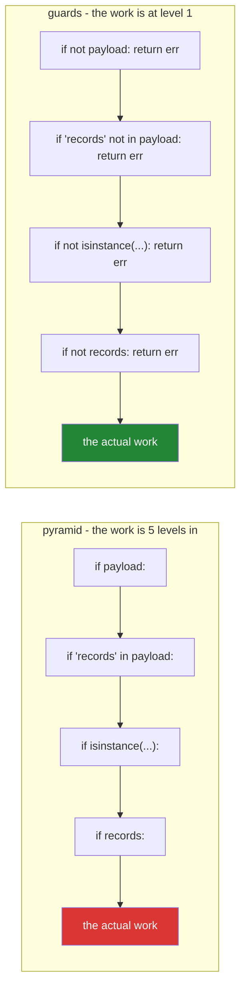

# 2.5 — The conditional expression, and the guard clause

## One-line answer

`x if condition else y` is an **expression** that produces a value — so it can go where a statement
cannot — and the guard clause is the opposite move: handling each failure case with an early `return`
so the main path never indents.

---

## The story

Two functions land in the same review.

The first is nine lines that assign one variable. It declares `label = None`, opens an `if`, assigns
`"high"`, opens an `elif`, assigns `"low"`, and closes with an `else` that assigns `"unknown"`. The
reviewer's comment is that the four-line skeleton exists only to move a value from a branch into a
name, and the reader has to hold the variable in their head across all nine lines to be sure it is
always assigned.

The second is a validation function fourteen levels wide. It checks that the payload exists, then
that it has a `records` key, then that the records are a list, then that the list is non-empty, then
finally — indented five times, forty lines from the top of the function — it does the actual work. The
`else` branches that return the error messages are scattered at the bottom, each one separated from
its own test by everything in between. The reviewer's comment is that they cannot tell which `else`
belongs to which `if` without counting spaces.

Both comments are about the same thing: **a conditional's shape should match the shape of the
decision.** Choosing between two values is one expression. Rejecting four kinds of bad input is four
early returns. Neither is a matter of taste; each has a form that makes the other's bugs impossible.

---

## The idea in plain language

### Statement versus expression

This distinction runs through the whole language and is worth naming precisely.

- A **statement** does something. `if`, `for`, `return`, `x = 5`, `def`. It has no value; you cannot
  put it inside something else.
- An **expression** produces a value. `2 + 3`, `f(x)`, `[1, 2]`, `a and b`. It can appear anywhere a
  value is expected — as an argument, inside a list, on the right of an `=`.

An `if` **statement** cannot be used where a value is wanted. That is why
`x = if a: 1 else: 2` is a syntax error, and why the story's first function needed nine lines.

The **conditional expression** — sometimes called the ternary operator, because it takes three
operands — is the expression form of the same choice:

```text
<value if true> if <condition> else <value if false>
```

It evaluates the condition, then evaluates and returns **exactly one** of the two branches. The
unused branch is never evaluated, which matters when it is expensive or would raise.

The word order is unusual: the value comes first, then the test. That reads well in the common case
(`"high" if score > 0.8 else "low"` is close to English) and badly when the condition is long, which
is a useful signal — if it reads badly, use a statement.

**The `else` is mandatory.** There is no one-armed conditional expression, because an expression must
always produce a value and "nothing" is not one. If you find yourself wanting to omit it, you wanted a
statement.

### When each form is right

| Situation | Form |
|---|---|
| Choosing between **two values** to assign, return, or pass | conditional expression |
| Choosing between **two actions** | `if` statement |
| **Three or more** alternatives | `if`/`elif` statement, or a dict lookup |
| Rejecting bad input before the real work | **guard clause** — early `return`/`raise` |
| A default for a possibly-missing value | `is None` check, or `dict.get(key, default)` |

The one-value test: **if you can say the whole thing as "A if condition else B" out loud and it makes
sense, it is an expression. If you have to say "do this, then that", it is a statement.**

### The guard clause

The second story function is a **pyramid**: each validation adds a level of indentation, and the real
work sits at the bottom of the well. Guard clauses invert it. Every failure case is handled
immediately and exits, so what remains below is the case that is known to be good.



Three things improve at once:

1. **Each test sits next to its own error.** No counting indentation to pair an `else` with an `if`.
2. **The main path is unindented and last**, so the function reads as "here is everything that could
   be wrong; now here is the work".
3. **Adding a fifth check is one line**, not a re-indent of the whole body — and a re-indent is
   exactly the edit that produces
   [2.1](2.1-if-elif-else-and-the-indent.md)'s misplaced-`return` bug.

The objection you will hear is "a function should have a single exit point". That rule comes from
languages with manual resource cleanup, where every exit had to free memory. Python has `with` blocks
and `finally` for that (Day 16, `PY-19`), so the rule buys nothing and costs the pyramid.

### The two things a conditional expression should not be

**Nested.** `"a" if p else "b" if q else "c"` is legal and parses right-to-left, and it is where the
form stops paying. Two levels is the limit most reviewers accept; beyond that, an `if`/`elif`
statement or a dictionary is clearer.

**Long.** If the expression wraps across lines, the reader now has to scan for the `if` and the `else`
to work out which value is which. `ruff format` will wrap it in parentheses across three lines, which
is a legible last resort, but a named intermediate variable is usually better.

---

## Why Setu needs it

- **[3.1](../03-the-or-trap/3.1-the-or-default-and-falsy-zero.md), next,** uses the conditional
  expression as the correct replacement for the `or`-default idiom.
- **Day 9's comprehensions** (`PY-09`) put a conditional expression in the value position —
  `[x if x > 0 else 0 for x in values]` — and it is the single most confusing line in that day because
  it sits next to a filter `if` that means something entirely different. Meeting the expression form
  here first is what makes
  [Day 9, 1.3](../../../day-09-comprehensions/parts/01-list-comprehensions/1.3-the-two-ifs.md)
  tractable.
- **Day 10's first `src/setu/` module** (`PY-10`) is where guard clauses become a habit — every public
  function starts by rejecting what it cannot handle.
- **Day 18's exceptions** (`PY-22`) replaces some guards' `return None` with a `raise`, and the
  decision between the two is a real design choice this part sets up.
- **Day 30's cleaning functions** (`PD-`) are almost entirely guards: a column that is missing, a
  frame that is empty, a dtype that is wrong — each rejected at the top with a message that names the
  problem.

---

## The mechanism

The story's first function, both ways:

```python
"""Nine lines that assign one variable, and the one line that replaces them."""


def label_statement(score: float) -> str:
    """The statement form: correct, but the skeleton outweighs the decision."""
    if score > 0.8:
        label = "high"
    else:
        label = "low"
    return label


def label_expression(score: float) -> str:
    """The expression form: the value and its condition on one line."""
    return "high" if score > 0.8 else "low"


for score in (0.9, 0.5):
    print(f"{score}: statement={label_statement(score)} expression={label_expression(score)}")
```

**Line by line:**

- `label = "high"` inside a branch — the variable is assigned in two places, and a reader has to check
  both to be sure it is always assigned. Add a third branch that forgets to assign and you get
  `UnboundLocalError` at run time, not at import.
- `return "high" if score > 0.8 else "low"` — one expression, no intermediate name, and it is
  **impossible** for it not to produce a value, because the `else` is mandatory. That guarantee is the
  real argument for the form, not the brevity.
- Read the expression aloud: "high if the score is above 0.8, else low". The word order is the point;
  when it stops reading as a sentence, it is the wrong form.

Laziness — only one branch is evaluated, which lets the expression protect itself:

```python
"""Exactly one branch runs. The other is never evaluated, not even for its side effects."""


def announce(value: str) -> str:
    print(f"      ...evaluated {value!r}")
    return value


chosen = announce("taken") if True else announce("skipped")
print("chosen:", chosen)

rows: list[int] = []
average = sum(rows) / len(rows) if rows else 0.0
print("average of an empty list:", average)
```

**Line by line:**

- Only `...evaluated 'taken'` prints. The `else` branch is not executed, so a conditional expression
  is as lazy as `and`/`or` ([2.4](2.4-and-or-return-operands.md)) and for the same reason.
- `sum(rows) / len(rows) if rows else 0.0` — **the laziness is what makes this safe.** With an empty
  list the division would raise `ZeroDivisionError`
  ([1.2](../01-operators/1.2-the-two-divisions.md)), and it never runs because the condition is false.
  A function-call version — `safe_divide(sum(rows), len(rows), default=0.0)` — evaluates both
  arguments and would raise.
- Note the precedence: `sum(rows) / len(rows) if rows else 0.0` groups as
  `(sum(rows) / len(rows)) if rows else 0.0`, because the conditional expression sits near the bottom
  of the table ([1.6](../01-operators/1.6-precedence-and-associativity.md)). That is what you want
  here, and in a longer expression it is exactly the kind of grouping to parenthesise for the reader.

And the pyramid, inverted:

```python
"""The same validation twice. Count the indentation of the line that does the work."""

from typing import Any


def validate_pyramid(payload: dict[str, Any] | None) -> str:
    """Every check adds a level. The work is at the bottom of the well."""
    if payload is not None:
        if "records" in payload:
            if isinstance(payload["records"], list):
                if len(payload["records"]) > 0:
                    return f"ok: {len(payload['records'])} records"
                else:
                    return "error: records is empty"
            else:
                return "error: records is not a list"
        else:
            return "error: no records key"
    else:
        return "error: payload is None"


def validate_guards(payload: dict[str, Any] | None) -> str:
    """Every check exits. The work is at level one, and each error sits next to its test."""
    if payload is None:
        return "error: payload is None"
    if "records" not in payload:
        return "error: no records key"
    records = payload["records"]
    if not isinstance(records, list):
        return "error: records is not a list"
    if not records:
        return "error: records is empty"
    return f"ok: {len(records)} records"


for payload in (None, {}, {"records": "nope"}, {"records": []}, {"records": [1, 2]}):
    print(f"{payload!s:<22} {validate_pyramid(payload):<32} {validate_guards(payload)}")
```

**Line by line:**

- `if payload is not None:` in the pyramid — the positive test, which forces the error into a distant
  `else`. The guard version writes `if payload is None:` — **the negative test** — which is the whole
  inversion in one word.
- The pyramid's `else: return "error: payload is None"` is **twenty lines below** the `if` it belongs
  to. In a real function of realistic length, pairing them is genuinely difficult, and a misplaced
  `else` is the [2.1](2.1-if-elif-else-and-the-indent.md) bug.
- `records = payload["records"]` in the guard version — extracted once, after the key check has
  passed. The pyramid repeats `payload["records"]` four times because there is nowhere sensible to put
  the name.
- `if not records:` — truthiness, and it is correct here because an empty list and a missing list mean
  the same thing to this function ([2.2](2.2-truthiness.md)'s rule). Had the value been a count, this
  would be the falsy-zero bug.
- **Both functions return identical results for all five inputs.** The difference is entirely in what
  a reader and an editor can do with them — which is what makes this a review comment rather than a
  bug report.
- `f"{payload!s:<22}"` — `!s` applies `str()` before the width spec, needed because a dict cannot be
  aligned directly.

---

## When it breaks

**The `else` you tried to omit:**

```text
>>> label = "high" if score > 0.8
  File "<stdin>", line 1
    label = "high" if score > 0.8
                                 ^
SyntaxError: expected 'else' after 'if' expression
```

**What it means.** An expression must produce a value on every path. The message is explicit in Python
3.10+ and was a bare `invalid syntax` before. If you genuinely want "assign only sometimes", you want
a statement, or `label = "high" if score > 0.8 else label` — which is legal and usually a sign the
logic wants restructuring.

**The statement in an expression position:**

```text
>>> values = [if x > 0: x else: 0 for x in data]
  File "<stdin>", line 1
    values = [if x > 0: x else: 0 for x in data]
              ^^
SyntaxError: invalid syntax
```

**What it means.** A comprehension's value slot needs an expression, and `if:` with a colon is a
statement. The correct form is `[x if x > 0 else 0 for x in data]`, and the difference between that
and the *filtering* `if` — `[x for x in data if x > 0]` — is
[Day 9, 1.3](../../../day-09-comprehensions/parts/01-list-comprehensions/1.3-the-two-ifs.md)'s entire
subject.

**The variable that was not assigned on every path:**

```text
>>> def label(score):
...     if score > 0.8:
...         result = "high"
...     elif score > 0.5:
...         result = "medium"
...     return result
...
>>> label(0.2)
Traceback (most recent call last):
  File "<stdin>", line 6, in label
UnboundLocalError: cannot access local variable 'result' where it is not associated with a value
```

**What it means.** No branch matched, so `result` was never bound, and reading a name that has never
been bound is an error ([Day 4, 1.2](../../../day-04-objects/parts/01-objects/1.2-names-are-labels.md)
— a name is a label, and there is nothing here to read). This is the failure mode the statement form
has and the expression form cannot, because its `else` is mandatory. The fix is an `else`, or a
default assignment before the chain.

**And the nested conditional that reads backwards:**

```text
>>> p, q = False, True
>>> "a" if p else "b" if q else "c"
'b'
```

**What it means.** It grouped as `"a" if p else ("b" if q else "c")` — right-associative, like an
`elif` chain. The value is correct; the problem is that most readers pause, and a pause on a line that
decides a business rule is a defect in the code even when the code is right. Two levels is the
practical maximum, and a dictionary is usually better past that.

---

## In production

**The conditional expression earns its place in exactly one situation: choosing between two values
that are both simple.** A default, a label, a sign, a unit conversion. In real code it shows up most
often as a function argument (`timeout=user_timeout if user_timeout is not None else DEFAULT`), in a
comprehension's value slot, and in an f-string. Where it stops earning its place is when either branch
contains a call with arguments, when the condition is more than a short comparison, or when a third
case is imminent — and "a third case is imminent" is a judgement about the domain, not the code.

**Guard clauses are the default shape for any function that validates.** The convention in mature
codebases is: guards at the top, each rejecting one thing, each with a message that names what was
wrong and ideally what was received; then the happy path, unindented, at the bottom. This makes the
function's contract readable from the first ten lines and makes adding a new precondition a
one-line diff — which matters more than it sounds, because a one-line diff is reviewable and a
re-indent of forty lines is not.

**Whether a guard returns or raises is a real design decision, and it should be consistent within a
layer.** Returning an error value (`None`, a result object, a message) forces every caller to check
and is right at a boundary where failure is ordinary — a parser, a lookup, a validator. Raising is
right when failure means the caller's assumptions were wrong and continuing would corrupt something.
The failure mode of mixing them in one module is a caller who checks the return value of a function
that raises, or ignores the return value of a function that does not. Day 18 (`PY-22`) makes this
choice properly; the habit to start now is to make it deliberately and write it in the docstring.

**What changes at scale.** The conditional expression's laziness is a real performance property, not
a curiosity: `expensive() if cheap_test() else fallback` runs one of two things, and rewriting it as a
function call runs both. In a comprehension over a million rows that is the difference between one
pass and two. There is no runtime cost to a guard clause versus a pyramid — same bytecode, roughly —
but there is a large cost to the pyramid in **change failure rate**, which is the metric that actually
shows up in a production system: the deep-nesting version is where the misplaced-`return` and
mispaired-`else` bugs come from.

**The review comment a senior engineer leaves.** On a five-level validation pyramid: *"Please invert
these into guard clauses — each check returning its own error at the top. Right now the `else` on line
52 belongs to the `if` on line 14 and I had to count indentation to be sure, and the actual work is
five levels in. Same behaviour, and adding the next validation becomes one line instead of a
re-indent."*

**The interview question.** *"When would you use a ternary instead of an `if` statement?"* The answer
that lands names the distinction rather than a preference: a conditional expression produces a
**value**, so it belongs where a value is required — an argument, a comprehension's value slot, a
return of one of two simple things — and an `if` statement chooses between **actions**. The follow-ups
worth having ready are that the `else` is mandatory because an expression must always produce
something, that only one branch is evaluated (so it can guard a division by zero), and that nesting
more than one level is where it stops being clearer than the statement. If the conversation turns to
style, guard clauses and the single-exit-point argument are the natural next topic, and the honest
answer is that single-exit comes from manual-cleanup languages and Python has `with` and `finally`
instead.

---

## Check yourself

```bash
uv run python -c "
def announce(v):
    print('   evaluated', v)
    return v
x = announce('taken') if True else announce('skipped')
print('x =', x)
rows = []
print('avg =', sum(rows) / len(rows) if rows else 0.0)
def label(s):
    if s > 0.8: r = 'high'
    elif s > 0.5: r = 'medium'
    return r
try:
    label(0.2)
except UnboundLocalError as exc:
    print('UnboundLocalError:', exc)
"
```

Predict how many `evaluated` lines print, and whether the average raises.

**Answer out loud, without scrolling up:**

> Say the difference between a statement and an expression, and use it to explain why the `else` in a
> conditional expression cannot be omitted. Then describe the guard-clause inversion and name two
> bugs it makes impossible.

---

**Next:** [3.1 — The `or`-default chain and the falsy zero](../03-the-or-trap/3.1-the-or-default-and-falsy-zero.md)
