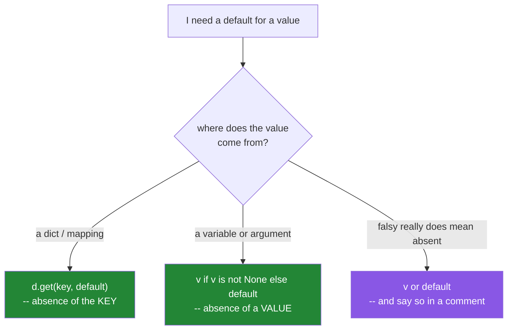

# 3.1 — The `or`-default chain and the falsy zero

## One-line answer

`value = supplied or default` silently replaces every falsy value — `0`, `0.0`, `""`, `[]`, `False` —
with the default, so it is correct only when those all mean "not supplied", and wrong the moment one
of them is a real answer.

---

## The story

A retry setting.

The client library reads it as `self.retries = config.get("retries") or 3`. It is a one-liner, it
reads beautifully, and it has been in the codebase since the first commit.

A payments team integrates. Their write endpoint is not idempotent — calling it twice charges twice —
so they set `retries: 0` in their configuration and move on, satisfied that they have turned retries
off.

Three weeks later a transient network blip during a deploy causes a batch of writes to time out. Each
one retries. Three times. The reconciliation report the next morning shows a set of triple charges,
and the incident review traces it back to a single word.

`0 or 3` is `3`. The configuration was read, parsed, validated as an integer, passed into the client —
and then discarded by an `or`, because the number zero is falsy. Nothing raised. Nothing logged.
The setting appeared in the config dump as `0` the whole time, because the dump printed the config,
not the client.

This is the most expensive two-letter word in Python, and the fix is a different two-letter word.

---

## The idea in plain language

### What the idiom actually says

From [2.4](../02-conditionals/2.4-and-or-return-operands.md): `a or b` returns `a` if `a` is truthy,
otherwise `b`.

So `supplied or default` means, precisely: **"use `supplied` unless it is falsy, in which case use
`default`."** Read that sentence next to what the author almost always meant — "use `supplied` unless
it is *missing*" — and the bug is visible. Falsy and missing are not the same set.

| The author meant | The idiom actually tests | Gap |
|---|---|---|
| is it missing? | is it falsy? | `0`, `0.0`, `""`, `[]`, `{}`, `False` |

Every value in that gap is a legitimate answer in some domain:

- `0` — retries, timeouts (`0` = do not wait), page index, quantity, offset, credit limit.
- `0.0` — a score, a price, a rate, a threshold, a temperature.
- `""` — a deliberately cleared name, an empty comment, a blank suffix, an empty prompt prefix.
- `[]` — a filter with no terms, an empty tag list, "no exclusions".
- `False` — **any boolean setting at all.** `verbose or True` is `True` unconditionally, which means a
  flag defaulting to `True` can never be turned off through the idiom.

That last row deserves its own alarm. **The `or`-default idiom cannot express a boolean setting whose
default is `True`.** Not "does it badly" — cannot express it.

### The two correct forms



**`dict.get(key, default)`** answers "is the key present?" It returns the stored value whatever it is —
including `0`, `""` and `False` — and only returns the default when the key genuinely is not there.
This is the right tool whenever the source is a mapping: a config dict, a parsed JSON body, a row.

**`value if value is not None else default`** answers "is the value `None`?" This is the right tool
for a function parameter, because `None` is the conventional Python spelling of "not supplied" —
the same convention as
[Day 4, 3.1](../../../day-04-objects/parts/03-identity-trap/3.1-the-mutable-default-argument.md)'s
mutable-default fix, and the reason
[1.4](../01-operators/1.4-equals-is-overloadable-is-is-not.md) insists on `is` rather than `==`.

**`value or default`** is correct — and idiomatic, and shorter — when every falsy value really does
mean "absent" for this field. A display name where empty and missing both mean "show something else".
A list of items to process where empty and missing both mean "nothing to do". When you use it
deliberately, the professional habit is a short comment saying *why* falsy is safe here, because the
next reader cannot tell the deliberate use from the accidental one.

### The `None`-that-is-also-a-key problem

There is a third case, and it is the one that catches people who have learned the first two:
`dict.get(key, default)` returns the **stored** value even when that value is `None`. If a JSON
payload contains `{"retries": null}`, then `config.get("retries", 3)` is `None`, not `3`.

So for data arriving from outside — JSON, YAML, a database column, a form — you often need both
questions asked in sequence:

```text
retries = config.get("retries")            # is the key present?
retries = 3 if retries is None else retries # was the value null?
```

Or, in one line, `config.get("retries") if config.get("retries") is not None else 3` — which is ugly
enough to make the two-line version obviously better, and that is a fair signal.

---

## Why Setu needs it

- **Day 3's key loading** is exactly this shape:
  `os.getenv("GEMINI_API_KEY") or ""`. There, falsy really does mean absent — an empty string is not a
  usable key — so the idiom is correct, and being able to say *why* is the point
  ([Day 3, 1.2](../../../day-03-keys-and-budget/parts/01-secrets/1.2-dotenv-and-os-environ.md)).
- **[Day 6's capped retry](../../../day-06-loops/parts/03-capped-retry/3.1-why-the-cap-comes-first.md)**
  takes a `max_attempts` argument. `max_attempts or 3` there is the story's bug, in this curriculum,
  tomorrow.
- **Day 10's first module functions** (`PY-10`) take optional parameters. Every default in
  `src/setu/` is a choice between these three forms, and the choice belongs in the docstring.
- **Day 19's Pydantic settings** (`PY-24`) exist partly to make this decision once per field instead
  of once per read, and to make `0` versus unset explicit in the model.
- **Day 76 onwards, every model hyperparameter** (`ML-`) has a default. A learning rate, a
  regularisation strength or a `random_state` of `0` — and `random_state=0` is an extremely common
  choice — quietly replaced by a library default breaks Principle 4's reproducibility outright.

---

## The mechanism

The gap, enumerated:

```python
"""Every value in this table is discarded by `or`. Some of them are real answers."""

DEFAULT = "THE-DEFAULT"
candidates = [0, 0.0, "", [], {}, set(), False, None, 3, "x", [1], True]

print(f"{'supplied':<10} {'or DEFAULT':<14} {'get-style':<14} {'is-None-style':<14} same?")
for supplied in candidates:
    via_or = supplied or DEFAULT
    via_get = supplied  # a mapping would have returned the stored value, whatever it is
    via_is_none = DEFAULT if supplied is None else supplied
    agree = via_or == via_is_none
    print(
        f"{supplied!r:<10} {via_or!r:<14} {via_get!r:<14} {via_is_none!r:<14} "
        f"{'' if agree else 'DIFFERENT'}"
    )
```

**Line by line:**

- `candidates` — every falsy built-in, then `None`, then some truthy values as a control. The control
  rows matter: they show that the three forms agree everywhere except the gap, which is why the bug
  survives testing.
- `via_or = supplied or DEFAULT` — the idiom.
- `via_is_none = DEFAULT if supplied is None else supplied` — the conditional expression from
  [2.5](../02-conditionals/2.5-the-conditional-expression.md), which is the correct form for a
  parameter.
- `agree = via_or == via_is_none` — **six rows print `DIFFERENT`**, one for each falsy non-`None`
  value. Every one of those is a value the caller supplied and the idiom threw away.
- Note the `False` row especially: `False or "THE-DEFAULT"` is the default, so a boolean parameter can
  never be set to `False` through this idiom.

Now the story, and the three fixes side by side:

```python
"""One config, four readings. Only three of them respect the caller."""

config = {"retries": 0, "timeout": None, "verbose": False}

print("as configured      :", config)
print()
print("or-default         :")
print("   retries :", config.get("retries") or 3, "   <- the payments incident")
print("   timeout :", config.get("timeout") or 30)
print("   verbose :", config.get("verbose") or True, "   <- cannot ever be False")
print()
print("dict.get default   :")
print("   retries :", config.get("retries", 3))
print("   timeout :", config.get("timeout", 30), "   <- key present, value None")
print("   verbose :", config.get("verbose", True))
print()
print("get + is None      :")
for key, fallback in (("retries", 3), ("timeout", 30), ("verbose", True)):
    value = config.get(key)
    value = fallback if value is None else value
    print(f"   {key:<8}: {value}")
```

**Line by line:**

- `config.get("retries") or 3` — prints `3`. **The incident.** The configured `0` is falsy and gone.
- `config.get("verbose") or True` — prints `True`. There is no configuration value that makes this
  print `False`, which is worth sitting with: the line is not merely buggy, it is incapable of
  expressing the setting.
- `config.get("retries", 3)` — prints `0`. Correct: the key is present, so the stored value is
  returned regardless of truthiness.
- `config.get("timeout", 30)` — prints `None`, **not `30`**. The key *is* present; its value is
  `None`. This is the third case from the idea section, and it is why `dict.get` alone is not the
  universal answer for data that came from JSON.
- The final loop — `get` for key presence, then `is None` for a null value. Two questions, asked in
  order, because there are genuinely two things that can be missing. **This is the form that handles
  every row correctly**, and it is what a settings model generates for you on Day 19.

And the parameter version, which is the shape you will write most often:

```python
"""The default belongs to the function, and None is how a caller says 'you choose'."""

from __future__ import annotations

DEFAULT_RETRIES = 3


def fetch(url: str, retries: int | None = None, prefix: str = "") -> str:
    """Retries defaults to DEFAULT_RETRIES; a caller may legitimately ask for 0."""
    attempts = DEFAULT_RETRIES if retries is None else retries
    return f"GET {prefix}{url} with attempts={attempts}"


print(fetch("/papers"))
print(fetch("/papers", retries=0), "   <- respected")
print(fetch("/papers", retries=5))
print(fetch("/papers", prefix=""), "   <- an empty prefix is a real choice")
```

**Line by line:**

- `retries: int | None = None` — the signature says "an int, or leave it to me". `None` as the default
  is the Python convention for "not supplied", and the annotation makes it visible at the call site
  and to a type checker.
- `DEFAULT_RETRIES` as a module constant rather than a literal in the signature — one place to change
  it, and it appears in the docstring by name. It is a plain `int`, so
  [Day 4, 2.3](../../../day-04-objects/parts/02-containers/2.3-aliasing-two-names-one-object.md)'s
  warning about mutable module-level "constants" does not apply; had the default been a list, it
  would.
- `attempts = DEFAULT_RETRIES if retries is None else retries` — the guard, in expression form.
  Writing `retries or DEFAULT_RETRIES` here is the incident.
- `prefix: str = ""` — a **falsy default that is also a valid value**, and note it needs no `None`
  dance at all: the empty string is both the default and a legitimate explicit choice, and they mean
  the same thing, so there is nothing to distinguish. That is the case where the whole problem
  evaporates, and recognising it saves you a pointless `| None`.

---

## When it breaks

**It does not raise. That is the entire problem:**

```text
>>> config = {"retries": 0}
>>> config.get("retries") or 3
3
>>> config.get("retries", 3)
0
```

**What it means.** Two lines, two answers, no error, and the wrong one reads better. There is no
traceback to search for, no warning, and no test failure unless a test specifically supplies a falsy
value. The only defence is a test case whose input is `0` — which is exactly the case a hurried person
omits, because zero looks like an empty fixture rather than a real scenario.

**The boolean that cannot be turned off:**

```text
>>> def run(verbose=None):
...     verbose = verbose or True
...     return verbose
...
>>> run(verbose=False)
True
```

**What it means.** The caller said `False`, explicitly, at the call site, and got `True`. This is the
clearest possible demonstration that the idiom tests truthiness rather than presence, and it is
common enough in real code to be worth grepping for: any `or True` or `or False` in a default is
suspect on sight.

**`dict.get` returning a stored `None`:**

```text
>>> import json
>>> config = json.loads('{"timeout": null}')
>>> config.get("timeout", 30)
>>> repr(config.get("timeout", 30))
'None'
>>> 30 if config.get("timeout") is None else config["timeout"]
30
```

**What it means.** JSON `null` becomes Python `None`, and the key **is** present, so `get`'s default
never applies. The first line printed nothing because the REPL does not echo `None` — which is itself
a small trap when you are debugging by eye. Data from outside your process needs both checks.

**And the linter catching one variant:**

```text
$ uv run ruff check --select SIM -
SIM108 Use ternary operator `value = supplied if supplied else default` instead of `if`-`else`-block
```

**What it means.** Ruff's `SIM` family — already enabled in this project's `select` list — will suggest
collapsing an `if`/`else` assignment into a conditional expression. Read the suggestion carefully
before accepting: `supplied if supplied else default` is the truthiness form and is **not** equivalent
to `supplied if supplied is not None else default`. A blind `--fix` here can introduce the very bug
this part is about, which is
[Day 2, 1.3](../../../day-02-quality-gate/parts/01-linting/1.3-fix-and-noqa-as-debt.md)'s point about
autofixes needing a reader.

---

## In production

**The rule that holds up: `or` for defaults only when falsy means absent, and say so.** Teams that
have been burned by this write it down — commonly as "no `or`-defaults on numbers or booleans" — and
enforce it in review rather than with a linter, because no linter knows whether `0` is meaningful in
your domain. The comment convention is worth adopting: `name = supplied or "anonymous"  # empty and
missing both mean anonymous`. One clause, and the next reader knows it was a decision.

**Configuration deserves a schema rather than a scattering of defaults.** The reason Day 19 reaches
for Pydantic settings is precisely this: a model declares `retries: int = 3` once, parses `"0"` from
the environment into the integer `0`, keeps it, and fails loudly on `"three"`. Defaults scattered
across twelve read sites drift, disagree, and hide bugs like the story's — and a config dump that
prints the raw dict rather than the parsed model will show you the value you thought you had, which is
what made the incident take three weeks to find. **Dump the parsed settings, not the input.**

**The failure mode that only appears with real data is the deliberate zero.** Fixtures contain
`retries: 3` because that is what a person types when inventing an example. Production contains
`retries: 0` because a specific team had a specific reason, `timeout: 0` because someone wants no
wait, `credit_limit: 0` because a customer is restricted, and `""` because a user cleared a field. The
test that would have caught the incident is one line — `assert Client({"retries": 0}).retries == 0` —
and it is a line nobody writes until after the incident. Writing it before is Principle 7's whole
argument.

**What changes at scale and under concurrency.** Nothing about the operator changes, but the blast
radius does: a default silently applied in a client library is applied on **every** call, so a
one-character bug becomes a systematic behaviour affecting every request in the fleet — and in the
story's case, a non-idempotent one. The general lesson is that defaults are a form of policy, and
policy that is expressible only in code that nobody reviews is policy nobody agreed to. Under
concurrency, the `or` chain has a second problem if the right-hand side is a call: it is evaluated
lazily, so `value or expensive_lookup()` performs the lookup only sometimes, and a cache built that
way can stampede when many workers hit the falsy path at once.

**The review comment a senior engineer leaves.** On `self.retries = config.get("retries") or 3`:
*"`0` is falsy, so a caller who explicitly disables retries gets three. Use `config.get("retries", 3)`,
and since this config is parsed from JSON, add the `is None` check for an explicit null. Please add a
test asserting that `retries: 0` survives — that is the case that will bite us."*

**The interview question.** *"What is wrong with `x = value or default`?"* The answer is that `or`
tests truthiness rather than presence, so every falsy value — `0`, `0.0`, `""`, `[]`, `False` — is
replaced by the default even when the caller supplied it deliberately. The follow-up that separates
people is *"when is it fine?"* — when falsy and missing genuinely mean the same thing for that field, a
display name or a list of work items being the usual examples. And the follow-up that separates people
further is *"what do you use instead?"* — `dict.get(key, default)` when the source is a mapping and
you are asking about key presence, `value if value is not None else default` for a parameter, and both
in sequence for data parsed from JSON where a key can be present with a `null` value.

---

## Check yourself

```bash
uv run python -c "
config = {'retries': 0, 'timeout': None, 'verbose': False}
print('or-default :', config.get('retries') or 3, config.get('timeout') or 30, config.get('verbose') or True)
print('get-default:', config.get('retries', 3), config.get('timeout', 30), config.get('verbose', True))
print('get+isNone :', end=' ')
for k, d in (('retries', 3), ('timeout', 30), ('verbose', True)):
    v = config.get(k)
    print(d if v is None else v, end=' ')
print()
"
```

Nine numbers. Say which three are wrong and why before running.

**Answer out loud, without scrolling up:**

> State exactly what `value or default` tests, and name the six values that fall in the gap between
> that and what the author usually meant. Then give the right form for a dict lookup, for a function
> parameter, and for a JSON payload where a key may be present with a null value.

---

**Next:** [3.2 — `in` is an operator, and the condition that is secretly O(n)](3.2-in-is-an-operator.md)
