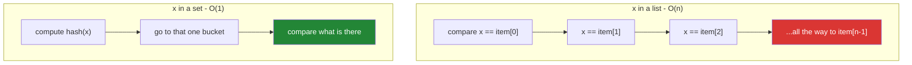

# 3.2 — `in` is an operator, and the condition that is secretly O(n)

## One-line answer

`x in container` dispatches to `__contains__` like any other operator, and what that method does
depends entirely on the container — a constant-time hash lookup for a set or dict, a full scan for a
list — so the same six characters in the same `if` can be instant or can be the reason a job takes
four hours.

---

## The story

Two doors at a party, and the same guest list at each.

At the first door, the list is a loose pile of sixty thousand slips of paper in no particular order.
Somebody arrives, gives their name, and the doorman starts at the top of the pile. On a quiet night
this is fine. By midnight there is a queue down the street, because every single guest costs a walk
through the whole pile.

At the second door, the same sixty thousand names are in an alphabetical folder. Somebody arrives,
the doorman opens at the right letter, and they are through in a second. It makes no difference
whether the folder holds six hundred names or six hundred thousand.

Same question at both doors — *is this name on the list?* Same answer. Completely different evening.

Here is that in code. A script reads a file of identifiers, keeps the ones it has not seen before,
and writes them out:

```text
for paper_id in incoming:
    if paper_id not in seen:
        seen.append(paper_id)
        unique.append(paper_id)
```

On a sample of five hundred rows it finishes instantly. On the first real file of sixty thousand rows
it takes eleven minutes. On the monthly file it is still going the next morning.

Nobody wrote a loop inside a loop. There is exactly one `for` in the file. But `seen` is a list, and
`paper_id not in seen` is the pile of paper: it walks from the start every single time, so by row
fifty thousand each arrival is being checked against fifty thousand names. That is sixty thousand
walks through a pile that keeps growing — around three and a half billion comparisons in total.

The fix is one word. `seen = set()` instead of `seen = []` turns the pile into the folder, the script
finishes in under a second, and the `if` line does not change at all.

**The condition looked like a single quick check and was secretly a loop.** That is the thing to take
away: `in` hides its price behind a spelling that gives no hint.

---

## The idea in plain language

### `in` is an operator like any other

From [1.1](../01-operators/1.1-an-operator-is-a-method-call.md): `x in c` calls
`type(c).__contains__(c, x)`. Two details make it different from `+` or `<`:

1. **The dispatch is on the right operand**, not the left. That is unusual and it is why `in` reads
   naturally: the container answers the question about its own contents.
2. **There are two fallbacks.** If the type has no `__contains__`, Python tries `__iter__` and walks
   every element comparing with `==`. If there is no `__iter__` either, it tries `__getitem__` with
   integer indices from zero. Only then does it raise. **So `in` works on almost anything iterable,
   and silently costs a full traversal when it does.**

`not in` is a single operator, not `not` applied to `in`. It has the same precedence as `in` and the
other comparisons ([1.6](../01-operators/1.6-precedence-and-associativity.md)), so
`if x not in a and y not in b:` groups correctly with no parentheses.

### The cost depends entirely on the container

| Container | What `in` does | Cost |
|---|---|---|
| `set`, `frozenset` | hash the value, look in one bucket | **O(1)** — flat as the set grows |
| `dict` | hash the key, look in one bucket (**keys only**) | **O(1)** |
| `list`, `tuple` | compare with `==` from index 0 until found | **O(n)** |
| `str` | substring search (`"ell" in "hello"` is `True`) | O(n·m), specialised algorithm |
| `range` | arithmetic — is it in the arithmetic progression? | **O(1)**, surprisingly |
| generator | consumes it until found — **and the consumed part is gone** | O(n), destructive |

Two rows deserve a second look.

`x in some_dict` tests the **keys**, never the values. `"a" in {"a": 1}` is `True`; `1 in {"a": 1}`
is `False`. To ask about values you need `in some_dict.values()`, which is a full scan
([Day 8, 2.5](../../../day-08-containers/parts/02-sets-and-dicts/2.5-view-objects-are-windows.md)).

`x in a_generator` **consumes** the generator up to the match. Test the same generator twice and the
second test starts where the first stopped — a genuinely startling behaviour that Day 11 (`PY-11`)
covers properly.

### Why the set is O(1)

A **hash table** stores each element in a slot chosen by a number computed from its value — the
**hash**. To check membership it computes the hash of the value you asked about, goes straight to that
slot, and compares only what is there. The number of comparisons does not grow with the size of the
set.

That is why only **hashable** things can go in a set or be a dict key, and why a list cannot — the
whole scheme depends on an element's hash never changing while it is stored
([Day 4, 2.5](../../../day-04-objects/parts/02-containers/2.5-hashability.md)). The O(1) is a
consequence of the restriction, not a free lunch.



### The shape to recognise

**A membership test on a list, inside a loop, is a nested loop wearing a disguise.** The tell is not
the word `in` — it is `in` where the right-hand operand is a list that grows or is large, and the
whole thing sits inside a `for` or `while`.

The same disguise appears as:

- `if row["id"] in known_ids:` where `known_ids` is a list read from a file
- `if name in df["name"].tolist():` inside a loop over rows — a scan *and* a copy, every iteration
- `if item in results:` before appending, the deduplication shape from the story
- `if value in some_function():` where the function rebuilds a list on every call — the worst version,
  because the list is reconstructed as well as scanned

The fix is always the same: **build the lookup structure once, outside the loop, as a set.**

---

## Why Setu needs it

- **[Day 8, 3.1](../../../day-08-containers/parts/03-dedup/3.1-ten-thousand-ids-timed.md)** is this
  story, timed properly, with ten thousand arXiv IDs — the plan's named example for `PY-08`. This part
  is the operator; that one is the measurement.
- **[Day 6, 4.1](../../../day-06-loops/parts/04-loop-cost/4.1-the-accidental-quadratic.md)** is the same
  quadratic seen from the loop's side, tomorrow.
- **Day 26 onwards** (`PD-`), `df["col"].isin(valid_set)` is the vectorised form, and passing it a
  list instead of a set is the same mistake at dataframe scale.
- **Day 164's chunk deduplication** (`RAG-04`) checks whether a chunk has been seen before embedding
  it. Getting this wrong costs model calls, which is Principle 5's budget, not just time.
- **Day 182's agent loop** (`AGT-01`) checks whether a tool name is in the allowed set before calling
  it. That is Principle 11's blast radius as a membership test — and it must be a set, both for speed
  and because a set states "unordered collection of allowed names" more clearly than a list does.

---

## The mechanism

`in` dispatching, and the fallbacks:

```python
"""in asks the RIGHT operand, and falls back to iteration when there is no __contains__."""


class Explicit:
    """Answers membership directly."""

    def __contains__(self, item: object) -> bool:
        print(f"      __contains__({item!r}) ran")
        return item == "yes"


class Iterable:
    """No __contains__. Python falls back to walking __iter__ and comparing with ==."""

    def __iter__(self):
        print("      __iter__ ran - every element will be compared")
        return iter(["a", "b", "yes"])


print("Explicit:", "yes" in Explicit())
print("Iterable:", "yes" in Iterable())
print("dict tests KEYS:", "a" in {"a": 1}, "|", 1 in {"a": 1})
print("str tests SUBSTRINGS:", "ell" in "hello")
print("range does arithmetic:", 999_999 in range(1_000_000))
```

**Line by line:**

- `def __contains__(self, item)` — note the argument order: `self` is the **container**, `item` is the
  thing being looked for. The operand order in the source (`item in container`) is the reverse of the
  method's, which is unique to `in` among the operators.
- `"yes" in Iterable()` — no `__contains__`, so Python iterates. **The fallback is silent**: nothing
  tells you at the call site that a full traversal just happened, which is the theme of this part.
- `1 in {"a": 1}` — `False`. Dict membership is about keys. This catches people who expect `in` to
  mean "appears anywhere in".
- `"ell" in "hello"` — strings define `__contains__` as substring search, not element search. So
  `"a" in "cat"` is `True`, and `"ac" in "cat"` is `False` — contiguity matters.
- `999_999 in range(1_000_000)` — instant, because `range.__contains__` for integers solves an
  arithmetic question rather than iterating. Underscores in numeric literals are just readability
  separators. Try the same with `list(range(1_000_000))` and it walks the whole thing.

Now the story, timed:

```python
"""The same four lines, two containers, and a ratio that grows with n."""

import timeit


def dedup(incoming: list[str], use_set: bool) -> int:
    seen: set[str] | list[str] = set() if use_set else []
    unique = []
    for item in incoming:
        if item not in seen:
            if use_set:
                seen.add(item)
            else:
                seen.append(item)
            unique.append(item)
    return len(unique)


for size in (1_000, 4_000, 16_000):
    data = [f"arXiv:{i % (size // 2)}" for i in range(size)]
    with_list = timeit.timeit(lambda: dedup(data, use_set=False), number=1)
    with_set = timeit.timeit(lambda: dedup(data, use_set=True), number=1)
    print(
        f"n={size:>6}  list {with_list:7.4f}s  set {with_set:7.4f}s  "
        f"ratio {with_list / with_set:6.1f}x"
    )
```

**Line by line:**

- `seen: set[str] | list[str]` — the only difference between the two runs. The `if item not in seen:`
  line is **character-for-character identical** in both cases, which is the point: the cost is in the
  container, invisible at the call site.
- `data = [f"arXiv:{i % (size // 2)}" for i in range(size)]` — half the rows are duplicates, so `seen`
  grows to `size // 2`. The `%` is [1.2](../01-operators/1.2-the-two-divisions.md).
- `timeit.timeit(..., number=1)` — runs the callable once and returns elapsed seconds. `number=1`
  because a single run of the list version is already slow; for fast code you want a higher count so
  the measurement is not dominated by overhead.
- `lambda: dedup(data, use_set=False)` — `timeit` needs a callable, and the lambda supplies one
  without arguments. Day 11 (`PY-12`) covers lambdas; here it is plumbing.
- **Watch the `ratio` column, not the seconds.** The seconds depend on your machine; the ratio does
  not. Each time `n` quadruples, the list version's time goes up roughly sixteen-fold and the set
  version's roughly four-fold, so the ratio grows by about four. **A growing ratio is the signature of
  a worse complexity class**, and it is the only reliable way to detect one from timings.
- Run it with `16_000` and then `64_000` if you have the patience. The point lands harder when you
  have waited for it.

And the shape, with the fix that does not change the `if` at all:

```python
"""Build the lookup once, outside the loop. The condition line is untouched."""

known_ids_from_file = [f"arXiv:{i}" for i in range(50_000)]
incoming = [f"arXiv:{i}" for i in range(49_990, 50_010)]

# WRONG - a scan of 50 000 items per incoming row
found_slow = [row for row in incoming if row in known_ids_from_file]

# RIGHT - one pass to build the set, then a constant-time test per row
known = set(known_ids_from_file)
found_fast = [row for row in incoming if row in known]

print("same answer:", found_slow == found_fast, "| count:", len(found_fast))
print("the if-condition is identical; only the container changed")
```

**Line by line:**

- `known_ids_from_file` — a list, because that is what reading a file line by line gives you. The list
  is not the mistake; **using it as a lookup table is**.
- `if row in known_ids_from_file` — twenty incoming rows times fifty thousand comparisons. On this
  size it merely feels slow; at a realistic scale it is the story.
- `known = set(known_ids_from_file)` — one pass over the list to build the set, then every subsequent
  test is constant time. The build costs `O(n)` **once**, which is why this is a win the moment you do
  more than about one lookup.
- `found_slow == found_fast` — `True`. The fix changes the cost and nothing else, which is the ideal
  kind of fix and also the reason it is easy to forget: there is no behavioural symptom to notice.
- The comprehension form is [Day 9](../../../day-09-comprehensions/parts/01-list-comprehensions/1.1-the-loop-and-the-comprehension.md);
  read it as "the rows for which the condition holds".

---

## When it breaks

**A container that cannot be searched:**

```text
>>> 3 in 12345
Traceback (most recent call last):
  File "<stdin>", line 1, in <module>
TypeError: argument of type 'int' is not iterable
```

**What it means.** `int` has no `__contains__`, no `__iter__` and no `__getitem__`, so all three
fallbacks failed. The message says "not iterable" because iteration was the last thing tried. If you
meant "does the digit 3 appear in 12345", you need `"3" in str(12345)`.

**The unhashable value in a set test:**

```text
>>> [1, 2] in {(1, 2), (3, 4)}
Traceback (most recent call last):
  File "<stdin>", line 1, in <module>
TypeError: unhashable type: 'list'
```

**What it means.** Testing membership in a set requires hashing the thing you are looking for, and a
list cannot be hashed
([Day 4, 2.5](../../../day-04-objects/parts/02-containers/2.5-hashability.md)). Note that the same
test against a **list** container works fine — `[1, 2] in [[1, 2]]` is `True` — because a list scan
uses `==`, which lists support. **Switching a container from list to set for speed can turn a working
membership test into a `TypeError`**, and that is the one migration risk in the fix this part
recommends.

**The generator that is consumed by asking:**

```text
>>> ids = (f"id-{i}" for i in range(5))
>>> "id-2" in ids
True
>>> "id-1" in ids
False
>>> list(ids)
['id-4']
```

**What it means.** The first test consumed `id-0`, `id-1`, `id-2` and stopped. The second started from
`id-3`, never saw `id-1`, and returned `False` — **an incorrect answer, with no error.** The third
line shows what is left. A generator is a one-shot stream; if you need repeated membership tests,
materialise it into a set first.

**And the one that does not raise, ever:**

```text
>>> import time
>>> big = list(range(200_000))
>>> start = time.perf_counter(); 199_999 in big; time.perf_counter() - start
True
0.0018...
>>> big_set = set(big)
>>> start = time.perf_counter(); 199_999 in big_set; time.perf_counter() - start
True
0.0000...
```

**What it means.** Both answer `True`. One took roughly two milliseconds and the other took
microseconds, and two milliseconds inside a loop over a hundred thousand rows is more than three
minutes of pure scanning. **This is the failure mode: a correct answer, delivered late enough to
matter.** No linter flags it, no test fails, and it only shows up when the data grows — which is
usually in production.

---

## In production

**The professional habit is that any collection whose purpose is membership is a set, declared as one
at the point it is built.** `ALLOWED_TOOLS = {"search", "read"}` rather than a list, `known = set(...)`
immediately after reading a file of identifiers, `valid_ids: set[str]` in a type annotation. The
annotation is doing real work here: it tells the next reader that this collection exists to be looked
up in, and a reviewer seeing `list[str]` used with `in` inside a loop has a concrete thing to ask
about. Where order matters as well, real code keeps both — a list for the order and a set for the
lookups — and accepts the duplicated memory as the price.

**Build the lookup structure outside the loop, and be suspicious of any function call on the right of
`in`.** `if x in get_valid_ids():` inside a loop rebuilds the whole collection every iteration, which
is a scan on top of a construction, and it is invisible because the expensive part is behind a
sensible-looking function name. This is one of the few performance mistakes worth looking for by
grep — `in ` followed by `(` on the right-hand side, inside an indented block.

**What changes at scale is the complexity class, and the only reliable detector is a ratio.** A single
timing tells you nothing: two milliseconds is fine. The diagnostic that works is to run at `n`,
`2n` and `4n` and watch how the time grows — linear growth doubles, quadratic growth quadruples. This
is worth doing once on any loop you expect to meet production data, and it is why
[Day 8, 3.1](../../../day-08-containers/parts/03-dedup/3.1-ten-thousand-ids-timed.md) insists on
timing at three sizes rather than one. In pandas the same idea appears as `Series.isin(set)`, which is
vectorised, and `df[df.a.isin(big_list)]` with a list argument is the same quadratic in a different
costume.

**Memory is the trade, and it is usually worth making.** A set of a million short strings costs
noticeably more than the list — hash tables keep spare capacity deliberately — and for a one-off
membership test on a small list the set is not worth building. The crossover is low: if you will do
more than a handful of lookups, build the set. For very large key spaces where the values themselves
are not needed, a Bloom filter trades a small false-positive rate for a fraction of the memory, and
that is the shape used for "have we seen this document before" at web scale.

**Under concurrency**, `x in shared_set` is safe to read but `if x not in seen: seen.add(x)` is a
classic check-then-act race — two threads can both pass the check for the same `x`. In CPython the
individual operations are atomic but the pair is not, and the correct forms are either a lock around
both or the atomic idiom `if x not in seen` replaced by `seen.add(x)` plus a length comparison, or
simply doing the deduplication in one thread.

**The review comment a senior engineer leaves.** On the story's four lines: *"`seen` is a list, so
`not in` is a linear scan and this loop is O(n²) — it will be fine in tests and hours in production.
Make `seen` a set; the condition line does not change. If you need the insertion order too, keep the
list for output and the set for the check."*

**The interview question.** *"How would you remove duplicates from a large list?"* The answer people
give first is `list(set(items))`, and the immediate follow-up is *"what does that lose?"* — the order.
The full answer is the order-preserving loop with a **set** as the seen-collection, and the sentence
that shows you have actually hit this in production is why the set matters: with a list, the
membership test is a scan and the whole thing is quadratic, so a job that takes a second at ten
thousand rows takes hours at a million. If they push further, `dict.fromkeys(items)` does it in one
expression while preserving order, because dicts have been insertion-ordered since Python 3.7 —
[Day 8, 3.2](../../../day-08-containers/parts/03-dedup/3.2-order-preserving-dedup.md) builds both.

---

## Check yourself

```bash
uv run python -c "
import time
big = list(range(200_000)); big_set = set(big)
for name, c in (('list', big), ('set', big_set)):
    t = time.perf_counter(); 199_999 in c; print(f'{name:>5}: {time.perf_counter()-t:.6f}s')
print('dict tests keys :', 1 in {'a': 1}, '| str tests substrings:', 'ell' in 'hello')
g = (i for i in range(5))
print('2 in g:', 2 in g, '| 1 in g:', 1 in g, '| left:', list(g))
"
```

The generator line is the one to predict carefully — two of those three outputs surprise people.

**Answer out loud, without scrolling up:**

> Say what `x in c` dispatches to and which operand decides. Then explain why the identical line
> `if item not in seen:` is instant for one container and quadratic for another, and name the
> one-character fix.

---

**Back to the hub:** [Day 5 — Operators, precedence, and conditionals](../../LESSON.md)
