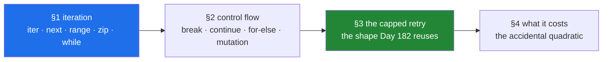

# Day 6 — Loops, `break`/`continue`, and the capped retry

**Phase 1 · Python foundations · Module 1** · `PY-05` — loops, `break`, `continue`, `range`. The plan's
named example for this ID is *a retry loop with a hard iteration cap — the shape every agent loop later
reuses*, and that loop is what you build today.

> **Yesterday:** operators dispatch to the left operand, precedence groups before anything runs, and
> `if x:` is a call to `bool(x)`.
> **Today:** a `for` loop is `iter` plus `next` until `StopIteration`, `break` leaves exactly one
> loop, and the capped retry is twelve lines you will rewrite on Day 95, Day 182 and Day 223.
> **Tomorrow:** strings — code points, slicing, the method vocabulary, and f-string formatting.

> **Read this hub first**, then work through `parts/` in order. No time estimate here or anywhere — a
> day is a unit of subject, not of hours (Principle 17).

---

## §1 The story

Four loops, none of which raise.

```text
for line in open(path).readlines():     # killed by the OS on a 2 GB file
for pred, actual in zip(preds, labels): # evaluated 8,000 of 10,000 rows and reported 0.94
while not export.is_done():             # polled every five seconds for eleven days
if paper_id not in seen: seen.append()  # forty seconds in January, four hours in July
```

The first runs out of memory because it built a list it never needed. The second reports a real
accuracy on a silently truncated test set. The third waits forever for a job that failed rather than
finished. The fourth is a nested loop that contains no nested loop.

A loop is the first construct where a program can do something *unbounded*. An expression evaluates
once; a conditional picks a branch; a loop can run for eleven days, or allocate until the kernel
intervenes, or ask a rate-limited free tier for the same thing two hundred thousand times. Getting
loops right is less about syntax than about answering one question every time you write one: **what
makes this stop, and what does it cost per pass?**

Today's four sections are that question, four ways:

- **How iteration actually works** — `iter`, `next`, `StopIteration` — which is why a file streams,
  why `range` costs nothing, and why `zip` truncates.
- **How you leave early** — `break`, `continue`, `for ... else` — and the two ways each of them
  silently loses work.
- **The capped retry**, built from scratch: five decisions, twelve lines, and the shape that Day 95's
  gradient descent, Day 182's agent loop and Day 223's runaway caps all reuse.
- **What a loop costs** — the accidental quadratic that turns growth into an outage, and the loop you
  should hand to compiled code instead.

The pattern from yesterday holds and gets sharper: **the dangerous failures produce a value.** A
truncated evaluation, a partial dedup, a report that finished — none of them raise, and all of them
look like results.



---

## §2 The map

**What the section numbers mean today.** One ID, so the sections follow the plan's `lab` split —
mechanism, then behaviour and edge cases, then the production use, then the cost: **1.x** is how
iteration works; **2.x** is leaving a loop early and the bugs that come with it; **3.x** is the capped
retry, the day's deliverable; **4.x** is what a loop costs and when not to write one.

### Section 1 — how iteration actually works

| Part | What it answers | Level |
|---|---|---|
| [1.1 What a `for` loop actually does](parts/01-iteration/1.1-what-a-for-loop-actually-does.md) | How can you loop over a file bigger than memory? | `foundation` |
| [1.2 `range` is lazy](parts/01-iteration/1.2-range-is-lazy.md) | Why does `range(10**18)` fit in 48 bytes? | `foundation` |
| [1.3 `enumerate`, `zip`, and the silent truncation](parts/01-iteration/1.3-enumerate-and-zip.md) | Why did the evaluation score 8,000 of 10,000 rows and say nothing? | `working` |
| [1.4 `while`, and the loop with no promise](parts/01-iteration/1.4-while-and-the-loop-with-no-promise.md) | What are the three things every `while` loop needs? | `working` |

### Section 2 — leaving a loop early

| Part | What it answers | Level |
|---|---|---|
| [2.1 `break`, and which loop it leaves](parts/02-control-flow/2.1-break-and-which-loop-it-leaves.md) | Why does a second `break` not leave the outer loop? | `working` |
| [2.2 `continue`, and the increment it skips](parts/02-control-flow/2.2-continue-and-the-skipped-increment.md) | Why is `continue` harmless in a `for` and fatal in a `while`? | `working` |
| [2.3 `for ... else`](parts/02-control-flow/2.3-for-else.md) | When exactly does a loop's `else` clause run? | `working` |
| [2.4 Mutating the thing you are iterating](parts/02-control-flow/2.4-mutating-while-iterating.md) | Why does removing rows in a loop leave some behind, without an error? | `production` |

### Section 3 — the capped retry (the day's deliverable)

| Part | What it answers | Level |
|---|---|---|
| [3.1 Why the cap comes first](parts/03-capped-retry/3.1-why-the-cap-comes-first.md) | How does three attempts at four layers become eighty-one calls? | `production` |
| [3.2 The capped retry, from scratch](parts/03-capped-retry/3.2-the-capped-retry-from-scratch.md) | What are the twelve lines, and which decision is each one? | `production` |
| [3.3 Which errors are worth retrying](parts/03-capped-retry/3.3-which-errors-are-retryable.md) | Which one question decides whether to retry a failure? | `production` |

### Section 4 — what a loop costs

| Part | What it answers | Level |
|---|---|---|
| [4.1 The accidental quadratic](parts/04-loop-cost/4.1-the-accidental-quadratic.md) | Which five operations look constant inside a loop and are not? | `production` |
| [4.2 The loop you should not write](parts/04-loop-cost/4.2-the-loop-you-should-not-write.md) | Why is a correct linear loop still forty times slower than it needs to be? | `production` |

---

## §3 Setup — run this

**No new packages today.** Everything is the language plus `time`, `random`, `collections`, `array`,
`itertools`, `uuid` and `pathlib` from the standard library. NumPy is *named* in
[4.2](parts/04-loop-cost/4.2-the-loop-you-should-not-write.md) and deliberately **not installed** — it
arrives on Day 20, the day it is first used
([Day 1, 3.2](../day-01-pins/parts/03-freezing/3.2-freezing-into-pyproject-and-the-lock.md)).

```bash
mkdir -p src/setu tests notebooks
touch src/setu/retry.py tests/test_retry.py

# a scratchpad for today - the notebook is never the deliverable (P6)
touch notebooks/day-06-scratch.ipynb

# the two clocks, and the difference that matters for a deadline (part 1.4)
uv run python -c "import time; print('perf_counter:', time.perf_counter()); print('monotonic   :', time.monotonic())"

# prove range costs nothing before part 1.2 tells you (part 1.2)
uv run python -c "import sys; print([sys.getsizeof(range(n)) for n in (10, 10**7, 10**18)])"

# the rules that keep today's loops honest
uv run ruff rule B007
uv run ruff rule E722
```

| What | Where it comes from | Part |
|---|---|---|
| `iter`, `next`, `StopIteration` | builtins | [1.1](parts/01-iteration/1.1-what-a-for-loop-actually-does.md) |
| `sys.getsizeof`, `pathlib`, `tempfile` | standard library | [1.1](parts/01-iteration/1.1-what-a-for-loop-actually-does.md), [1.2](parts/01-iteration/1.2-range-is-lazy.md) |
| `enumerate`, `zip(..., strict=True)` | builtins | [1.3](parts/01-iteration/1.3-enumerate-and-zip.md) |
| `time.monotonic`, `time.perf_counter`, `time.sleep` | standard library | [1.4](parts/01-iteration/1.4-while-and-the-loop-with-no-promise.md), [4.1](parts/04-loop-cost/4.1-the-accidental-quadratic.md) |
| `random.uniform` (jitter), `uuid.uuid4` | standard library | [3.2](parts/03-capped-retry/3.2-the-capped-retry-from-scratch.md), [3.3](parts/03-capped-retry/3.3-which-errors-are-retryable.md) |
| `collections.deque`, `array` | standard library | [4.1](parts/04-loop-cost/4.1-the-accidental-quadratic.md) |
| `raise ... from`, `TypeVar` | language, `typing` | [3.2](parts/03-capped-retry/3.2-the-capped-retry-from-scratch.md) |
| ruff's `B007`, `E722` | already selected on [Day 2](../day-02-quality-gate/parts/01-linting/1.2-choosing-rule-families.md) | [1.1](parts/01-iteration/1.1-what-a-for-loop-actually-does.md), [3.3](parts/03-capped-retry/3.3-which-errors-are-retryable.md) |

---

## §4 Build brief

One file is the day's real deliverable, and it is a file you will import for the next two hundred days.

**1. `src/setu/retry.py`** — the capped retry, from scratch (Principle 2). Day 14 (`PY-16`) turns this
into a `@retry` decorator; Day 182's agent loop calls it with a model inside.

```python
"""A capped retry with backoff, jitter, and an explicit failure classification.

Specified by day 6, parts 3.1-3.3. Every parameter here is a decision that part
3.1 lists; none of them has a silent default.
"""

from __future__ import annotations

import time
from collections.abc import Callable
from typing import TypeVar

T = TypeVar("T")

DEFAULT_ATTEMPTS = 3
DEFAULT_BASE_DELAY = 0.5
DEFAULT_MAX_DELAY = 8.0


class RetriesExhausted(RuntimeError):
    """Every attempt failed. Carries the count so a log line can say how many."""

    def __init__(self, attempts: int) -> None:
        super().__init__(f"{attempts} attempts failed")
        self.attempts = attempts


def backoff_delay(attempt: int, base: float, cap: float) -> float:
    """Full jitter: a random wait in [0, min(cap, base * 2**attempt)].

    `attempt` is zero-based. Part 3.1 says why the randomness is not optional.
    """
    # TODO(me): two lines. Import random at the top, not inside the function,
    # and write a comment saying why the ceiling is capped as well as doubled.
    raise NotImplementedError


def is_retryable(exc: BaseException) -> bool:
    """True when re-sending the SAME request could plausibly succeed (part 3.3).

    Keep the policy here, in one testable place, rather than in `except` clauses.
    """
    # TODO(me): decide your rule BEFORE writing it, and write the reasoning in a
    # comment. A 401 is the case worth arguing with yourself about.
    raise NotImplementedError


def call_with_retry(
    work: Callable[[], T],
    *,
    max_attempts: int = DEFAULT_ATTEMPTS,
    base_delay: float = DEFAULT_BASE_DELAY,
    max_delay: float = DEFAULT_MAX_DELAY,
    sleep: Callable[[float], None] = time.sleep,
) -> T:
    """Call `work`, retrying only retryable failures, at most `max_attempts` times.

    Raises RetriesExhausted (chained from the last error) when every attempt fails.
    Any non-retryable exception propagates on the FIRST attempt.
    """
    # TODO(me): the loop from part 3.2. Five things must be true when you are done:
    #   - it cannot run more than max_attempts times, structurally
    #   - a non-retryable error escapes immediately, untouched
    #   - it does NOT sleep after the final attempt
    #   - exhaustion raises, chained with `from`
    #   - max_attempts < 1 is rejected before anything is called
    raise NotImplementedError
```

**2. `src/setu/loops.py`** — two helpers that make today's cost lessons reusable.

```python
"""Loop helpers whose complexity class is part of their contract."""

from __future__ import annotations

from collections.abc import Callable, Iterable, Iterator
from typing import TypeVar

T = TypeVar("T")


def chunked(items: Iterable[T], size: int) -> Iterator[list[T]]:
    """Yield lists of at most `size` items, streaming - never materialising `items`.

    The last chunk may be short. Part 1.2's half-open ranges are why the chunks
    tile with no gap and no overlap.
    """
    # TODO(me): a `for` loop and a buffer. Do NOT call list(items) first - that
    # defeats the point (part 1.1). Remember the final partial chunk.
    raise NotImplementedError


def first_matching(items: Iterable[T], predicate: Callable[[T], bool]) -> T | None:
    """The first item satisfying `predicate`, or None. Stops at the first match.

    Part 2.1 shows three ways to write this. Pick one and say why in a comment.
    """
    # TODO(me): one of the three. Whichever you pick, it must not consume the
    # whole iterable when the match is early.
    raise NotImplementedError
```

**3. Reproduce the four story loops in the notebook, then throw the notebook away.** In
`notebooks/day-06-scratch.ipynb`: watch `zip` drop two rows without complaining; watch
`continue` above an increment pin a `while` loop (with a safety counter so you get your terminal
back); time the list-versus-set dedup at three sizes and read the **ratio**; and write the polling
loop with no cap, then add the three things
[1.4](parts/01-iteration/1.4-while-and-the-loop-with-no-promise.md) requires. **The notebook is not
committed** (Principle 6); `src/setu/retry.py` and its tests are.

---

## §5 The eval that must be able to fail

Create `tests/test_retry.py`. Every test here runs offline, in milliseconds, because the sleep is
injected.

```python
"""Day 6: prove the retry's bounds rather than trusting them."""

from __future__ import annotations

import pytest

from setu.loops import chunked, first_matching
from setu.retry import RetriesExhausted, backoff_delay, call_with_retry, is_retryable


class FlakyService:
    """Fails `failures` times, then succeeds. Counts its own calls."""

    def __init__(self, failures: int, error: BaseException | None = None) -> None:
        self.failures = failures
        self.error = error or ConnectionError("reset")
        self.calls = 0

    def __call__(self) -> str:
        self.calls += 1
        if self.calls <= self.failures:
            raise self.error
        return f"ok on call {self.calls}"


def test_succeeds_first_time_makes_exactly_one_call() -> None:
    # TODO(me): assert the result AND service.calls == 1. The call count is the
    # assertion that matters - a passing result proves nothing about the bound.
    raise NotImplementedError


def test_succeeds_after_retries_and_stops_there() -> None:
    # TODO(me): two failures then success. Assert calls == 3, and assert the
    # recorded delays have exactly TWO entries, not three (part 3.2).
    raise NotImplementedError


def test_never_exceeds_the_cap() -> None:
    # TODO(me): a service that always fails. Assert RetriesExhausted is raised
    # AND service.calls == max_attempts. Parametrise over 1, 2 and 5 attempts.
    raise NotImplementedError


def test_exhaustion_chains_the_original_error() -> None:
    # TODO(me): catch RetriesExhausted and assert exc.__cause__ is the last
    # ConnectionError. Without `from`, __cause__ is None - that is the assertion.
    raise NotImplementedError


def test_a_non_retryable_error_is_not_retried() -> None:
    # TODO(me): a service raising ValueError. Assert ValueError propagates (not
    # RetriesExhausted) and that calls == 1. This is part 3.3's whole point.
    raise NotImplementedError


@pytest.mark.parametrize("attempts", [0, -1])
def test_a_nonsense_cap_is_rejected(attempts: int) -> None:
    # TODO(me): assert ValueError. A cap of 0 must not silently call nothing
    # and report a failure (Day 5, part 3.1's falsy zero).
    raise NotImplementedError


def test_backoff_grows_and_is_capped() -> None:
    # TODO(me): assert every draw is within [0, min(cap, base * 2**attempt)] for
    # attempts 0..6. Run each attempt many times - jitter means one draw proves
    # nothing. Decide whether to seed random, and say why in a comment.
    raise NotImplementedError


def test_is_retryable_classifies_the_table() -> None:
    # TODO(me): parametrise over your policy's cases, including a 401 and a
    # KeyError. This test IS the policy document.
    raise NotImplementedError


def test_chunked_tiles_without_gaps_or_overlap() -> None:
    # TODO(me): assert the concatenation of all chunks equals the input, that
    # every chunk except possibly the last has exactly `size` items, and that
    # an input of 0 items yields no chunks at all.
    raise NotImplementedError


def test_chunked_does_not_consume_the_whole_iterable() -> None:
    # TODO(me): pass a generator that would raise on its 100th item, ask for
    # the first chunk only, and assert nothing raised. This is the test that
    # catches a `list(items)` at the top of the function (part 1.1).
    raise NotImplementedError


def test_first_matching_stops_early() -> None:
    # TODO(me): count how many items the predicate saw. If the match is at
    # index 2 of 1000, the predicate must have been called 3 times.
    raise NotImplementedError
```

Run them and watch every one fail before you write a line:

```bash
uv run python -m pytest tests/test_retry.py -v
```

Then implement, then **break each one on purpose**:

- Remove the `if attempt < max_attempts - 1:` guard around the sleep → only
  `test_succeeds_after_retries_and_stops_there` goes red, on the **delay count**. Nothing else
  notices. That is why the assertion is on the list of delays and not just the result.
- Change `raise RetriesExhausted(...) from last_error` to a bare `raise RetriesExhausted(...)` →
  only the chaining test goes red. Read the traceback both ways; the difference is what an on-call
  engineer sees.
- Widen `is_retryable` to `return True` → the non-retryable test goes red **and** the classification
  test goes red in several rows. Read them all.
- Change the loop to `while True:` with a counter, and forget the increment → **the cap test hangs.**
  Kill it with `Ctrl-C`, then say out loud why `for attempt in range(...)` makes that impossible.
- Add `list(items)` as the first line of `chunked` → the tiling test **still passes** and only
  `test_chunked_does_not_consume_the_whole_iterable` goes red.

That last item is today's meeting of
[Day 2, 3.1](../day-02-quality-gate/parts/03-pytest/3.1-the-test-that-can-go-red.md) with
[1.1](parts/01-iteration/1.1-what-a-for-loop-actually-does.md): a correctness test cannot see a
streaming bug, and the only test that can go red for it is one that would blow up if the whole
iterable were consumed.

---

## §6 Request budget

| Resource | Today |
|---|---|
| LLM API calls | **0** — every service in today's parts is a fake that counts its own calls |
| Network requests | **0** — nothing today leaves your machine |
| Free-tier quota | none consumed |
| Cost | **$0** (Principle 5) |

This is deliberate and is the point of [3.1](parts/03-capped-retry/3.1-why-the-cap-comes-first.md): an
uncapped retry against a real free tier spends the day's quota in minutes and takes every other lab on
that key down with it. You build and test the cap against a fake **before** the loop ever meets a real
endpoint ([Day 3, 4.1](../day-03-keys-and-budget/parts/04-rate-budget/4.1-rpm-rpd-tpm.md)).

---

## §7 Traps

- **`readlines()` on a large file** builds the whole list; iterate the handle —
  [1.1](parts/01-iteration/1.1-what-a-for-loop-actually-does.md).
- **A generator can only be looped once**, and the second pass silently returns nothing —
  [1.1](parts/01-iteration/1.1-what-a-for-loop-actually-does.md).
- **The loop variable after an empty loop raises `NameError`** —
  [1.1](parts/01-iteration/1.1-what-a-for-loop-actually-does.md).
- **`range(5, 0, -1)` does not include `0`** — the stop is exclusive both ways —
  [1.2](parts/01-iteration/1.2-range-is-lazy.md).
- **`range(1, len(x) - 1)` drops the last row** — the stop was already exclusive —
  [1.2](parts/01-iteration/1.2-range-is-lazy.md).
- **`range(5, 0)` is empty and does not raise** — swapped bounds do nothing, loudly —
  [1.2](parts/01-iteration/1.2-range-is-lazy.md).
- **`zip` stops at the shortest input without a word.** Use `strict=True` —
  [1.3](parts/01-iteration/1.3-enumerate-and-zip.md).
- **A truncating `zip` also consumes an item from the longer iterator** —
  [1.3](parts/01-iteration/1.3-enumerate-and-zip.md).
- **`for name, i in enumerate(x)` does not raise**, it just puts the number in `name` —
  [1.3](parts/01-iteration/1.3-enumerate-and-zip.md).
- **A `while` with no cap, no progress, or no failure branch is an incident** —
  [1.4](parts/01-iteration/1.4-while-and-the-loop-with-no-promise.md).
- **`while x != 1.0:` on a float never ends** —
  [1.4](parts/01-iteration/1.4-while-and-the-loop-with-no-promise.md).
- **`time.time()` can go backwards; deadlines need `time.monotonic()`** —
  [1.4](parts/01-iteration/1.4-while-and-the-loop-with-no-promise.md).
- **`break` leaves exactly one loop**, and a second `break` below it runs unconditionally —
  [2.1](parts/02-control-flow/2.1-break-and-which-loop-it-leaves.md).
- **A result variable set in an inner loop survives into the next outer pass** —
  [2.1](parts/02-control-flow/2.1-break-and-which-loop-it-leaves.md).
- **`continue` in a `while` skips the increment and pins the loop** —
  [2.2](parts/02-control-flow/2.2-continue-and-the-skipped-increment.md).
- **`continue` also skips any accumulator below it**, quietly changing a mean —
  [2.2](parts/02-control-flow/2.2-continue-and-the-skipped-increment.md).
- **A loop's `else` runs when the loop was *not* broken — including when it was empty** —
  [2.3](parts/02-control-flow/2.3-for-else.md).
- **An `else` at the loop's indentation belongs to the loop, not to the `if`** —
  [2.3](parts/02-control-flow/2.3-for-else.md).
- **Removing from a list while iterating skips items, silently** —
  [2.4](parts/02-control-flow/2.4-mutating-while-iterating.md).
- **Removing from a dict or set while iterating raises `RuntimeError`** — the kinder failure —
  [2.4](parts/02-control-flow/2.4-mutating-while-iterating.md).
- **`for row in rows: row = clean(row)` changes nothing** —
  [2.4](parts/02-control-flow/2.4-mutating-while-iterating.md).
- **Three attempts at four layers is eighty-one calls** —
  [3.1](parts/03-capped-retry/3.1-why-the-cap-comes-first.md).
- **A cap tested with `==` fails when the counter advances by two. Use `>=`** —
  [3.1](parts/03-capped-retry/3.1-why-the-cap-comes-first.md).
- **Sleeping after the final attempt is pure added latency** —
  [3.2](parts/03-capped-retry/3.2-the-capped-retry-from-scratch.md).
- **`raise RetriesExhausted(...)` without `from` throws away the cause** —
  [3.2](parts/03-capped-retry/3.2-the-capped-retry-from-scratch.md).
- **`max_attempts=0` silently calls nothing and reports a failure** —
  [3.2](parts/03-capped-retry/3.2-the-capped-retry-from-scratch.md).
- **`except Exception:` in a retry retries `400`s and your own `KeyError`s** —
  [3.3](parts/03-capped-retry/3.3-which-errors-are-retryable.md).
- **A bare `except:` catches `KeyboardInterrupt`** and makes the program un-interruptible —
  [3.3](parts/03-capped-retry/3.3-which-errors-are-retryable.md).
- **Retrying a timed-out write can charge twice.** Idempotency key, not hope —
  [3.3](parts/03-capped-retry/3.3-which-errors-are-retryable.md).
- **`raise exc` resets the traceback; a bare `raise` preserves it** —
  [3.3](parts/03-capped-retry/3.3-which-errors-are-retryable.md).
- **`x in a_list`, `.remove`, `.index`, `.insert(0, …)`, `.pop(0)` and `s += …` are all linear** —
  [4.1](parts/04-loop-cost/4.1-the-accidental-quadratic.md).
- **A correctness test cannot see a complexity bug** —
  [4.1](parts/04-loop-cost/4.1-the-accidental-quadratic.md).
- **A profiler tells you where the time goes, not why** —
  [4.1](parts/04-loop-cost/4.1-the-accidental-quadratic.md).
- **Vectorising a quadratic leaves it quadratic.** Class first, constant second —
  [4.2](parts/04-loop-cost/4.2-the-loop-you-should-not-write.md).
- **A vectorised sum can overflow where a Python `sum` cannot** —
  [4.2](parts/04-loop-cost/4.2-the-loop-you-should-not-write.md).

---

## §8 Verify before you code

Written **2026-08-25**. Today is the language and the standard library, so the language reference is
the authority:

- <https://docs.python.org/3/reference/compound_stmts.html#the-for-statement> — the `for` statement
  defined in terms of `iter` and `StopIteration`, and the `else` clause's exact rule.
  [1.1](parts/01-iteration/1.1-what-a-for-loop-actually-does.md) and
  [2.3](parts/02-control-flow/2.3-for-else.md) are this page.
- <https://docs.python.org/3/library/stdtypes.html#typesseq-range> — why `range` is a sequence rather
  than an iterator, and the note on its constant memory.
- <https://docs.python.org/3/library/functions.html#zip> — the `strict` parameter, added in 3.10, and
  the documentation's own warning about silent truncation.
- <https://docs.python.org/3/reference/simple_stmts.html#the-raise-statement> — `raise ... from` and
  exception chaining.
- <https://docs.python.org/3/library/time.html#time.monotonic> — the guarantee `time.time()` does not
  give you.
- <https://docs.python.org/3/library/collections.html#collections.deque> — O(1) at both ends, and the
  documentation's own comparison against `list.insert(0, …)`.
- <https://wiki.python.org/moin/TimeComplexity> — the cost table for every list, dict and set
  operation. [4.1](parts/04-loop-cost/4.1-the-accidental-quadratic.md) is a subset of this page;
  read the whole thing once.
- <https://docs.python.org/3/library/random.html#random.uniform> — and note the warning that
  `random` is not cryptographically secure, which is fine for jitter and not for anything else.
- `uv run ruff rule B007` and `uv run ruff rule E722` — read from the linter you have installed.

---

## §9 Say it in an interview

> "A `for` loop in Python is not a counter — it calls `iter()` on the thing you give it, then `next()`
> until `StopIteration`, which is why the same three lines work on a list, a file bigger than memory,
> or an infinite generator, and why looping over a generator twice silently gives you nothing the
> second time. That protocol explains most of the surprises: `range` costs 48 bytes at any size
> because it stores start, stop and step rather than values; `zip` truncates to its shortest input
> without a word, which silently evaluated a model on 80% of a test set once, so I use `strict=True`
> now; and removing from a list while iterating skips items, because the iterator holds an index into
> the live list — dicts and sets raise instead, which is the kinder failure. `break` leaves exactly
> one loop, so a nested search wants a function with a `return`, or better, a set lookup that removes
> the nesting entirely. The loop I actually write most is the capped retry: `for attempt in
> range(max_attempts)` so the bound is structural rather than a counter I might forget to increment,
> return on success, catch only the errors that could plausibly succeed on a resend — timeouts, 429s
> and 5xx, never a 400 or my own `KeyError` — back off with jitter so a fleet does not retry in
> lockstep, skip the sleep after the last attempt, and raise on exhaustion chained from the last error
> so the caller cannot mistake giving up for an empty result. The thing I check for in review is cost
> per pass: a membership test against a list, a `remove`, an `insert(0)` or a string `+=` inside a
> loop makes it quadratic, which looks fine on a fixture and turns forty seconds into four hours when
> the data quadruples — and no correctness test will ever catch it, so the regression test has to time
> it at `n` and `4n` and assert the ratio."

---

## §10 Done when

Every box in [`CHECKLIST.md`](CHECKLIST.md) is ticked, `./m check` is green, and **`src/setu/retry.py`
provably cannot exceed its cap** — you have a test asserting the call count, not just the result — not
when a particular amount of time has passed. Then:

```bash
./m done 6
```

Tomorrow is strings: a string is a sequence of code points rather than bytes, slicing never raises,
`split`/`join` do most of the work, and f-strings have a format language worth learning once.
