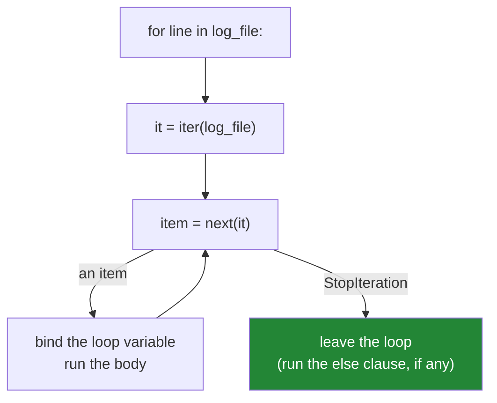

# 1.1 — What a `for` loop actually does

## One-line answer

A `for` loop is not a counter — it asks the thing on the right for an **iterator**, then calls
`next()` on that iterator over and over until it says `StopIteration`, which is why the same three
lines work on a list, a file, a dictionary and a stream too large to fit in memory.

---

## The story

A team is processing server logs. The file is two gigabytes.

The first version reads it with `lines = open(path).readlines()` and loops over `lines`. It works on
the developer's 5 MB sample and gets killed by the operating system on the real file, because
`readlines()` builds a list of every line in memory first.

Someone suggests looping over the file directly: `for line in open(path):`. It looks like it should be
worse — surely a file is not a list, so how can you loop over it? — and it is the version that works.
Memory use stays flat at a few kilobytes regardless of file size.

The team's mental model was "a `for` loop walks a collection". The real model is "a `for` loop pulls
one item at a time from something that knows how to produce the next one", and a file knows how to
produce the next line without knowing all of them. Once that model is right, streaming, generators,
database cursors and the infinite sequences of Day 11 all stop being separate topics.

---

## The idea in plain language

### The two words

**Iterable** — anything you can loop over. A list, a tuple, a string, a set, a dict, a file, a
`range`, a generator. Formally: an object whose type defines `__iter__`.

**Iterator** — the thing that actually does the walking, and it has exactly one job: hand you the next
item when asked. Formally: an object whose type defines `__next__` (and, by convention, `__iter__`
returning itself).

The distinction matters because they are usually **different objects**. A list is an iterable, and
each time you loop over it Python creates a *fresh* iterator that starts at the beginning. A file
object and a generator are their own iterator — there is only ever one — which is why looping over one
twice gives you nothing the second time.

### What `for x in thing:` expands to

Every `for` loop in Python is shorthand for this:

```text
1. it = iter(thing)          -- ask the iterable for an iterator
2. loop:
3.     x = next(it)          -- ask for the next item
4.     if StopIteration was raised: leave the loop
5.     run the body with x bound
6.     go back to step 3
```

Three things follow immediately, and each one explains a behaviour that otherwise looks arbitrary:

- **The loop never knows how many items there are.** It has no length, no index, no counter. It stops
  when the iterator says stop. That is why looping over an infinite generator is legal, and why
  `len()` is not involved anywhere.
- **The items are produced one at a time.** Nothing requires them all to exist at once, which is the
  story: a file's iterator reads one line, hands it over, and forgets it.
- **`StopIteration` is a normal exception used as a signal.** It is not an error condition; it is how
  the protocol says "finished". Day 18 (`PY-22`) covers exceptions properly; the thing to hold now is
  that the loop's ending is a message, not a count.



### The loop variable is a name, like any other

`for x in items:` **rebinds** `x` on every pass. It is an ordinary assignment
([Day 4, 1.2](../../../day-04-objects/parts/01-objects/1.2-names-are-labels.md)), which means:

- Assigning to `x` inside the body changes the label, not the collection. `for r in rows: r = r + [0]`
  does nothing to `rows`, which is that part's most-quoted trap.
- After the loop ends, `x` still exists and holds the last item. That is occasionally useful and more
  often a source of confusion.
- If the iterable is empty, the body never runs and `x` is never bound at all — so code after the loop
  that reads `x` raises `NameError`.

### Why this is the first thing on loop day

Everything in this day is a consequence:

- `range` produces numbers without storing them ([1.2](1.2-range-is-lazy.md)) — possible only because
  the loop asks for one at a time.
- `zip` stops at the shortest input ([1.3](1.3-enumerate-and-zip.md)) — because its iterator raises
  `StopIteration` as soon as any of its sources does.
- Mutating a list while looping over it corrupts the walk
  ([2.4](../02-control-flow/2.4-mutating-while-iterating.md)) — because the iterator is holding a
  position in an object you are changing underneath it.
- `for ... else` runs when the iterator finished normally ([2.3](../02-control-flow/2.3-for-else.md)) —
  the clause is defined in terms of `StopIteration`, which is why its name is so confusing.

---

## Why Setu needs it

- **[2.4](../02-control-flow/2.4-mutating-while-iterating.md), today,** is unexplainable without
  knowing that an iterator holds a position.
- **Day 11's generators** (`PY-11`) are the plan's "stream a 2 GB log line-by-line" example — the
  story above, written by you. A generator is just an object that implements this protocol with a
  function body.
- **Day 16's file handling** (`PY-19`, `PY-20`) reads files exactly this way, and `with open(...) as f:
  for line in f:` is the idiom the whole module is built on.
- **Day 26's pandas** (`PD-`) makes iterating a DataFrame row by row the *wrong* answer, and knowing
  what the loop actually does is what makes "vectorise instead" a reasoned choice rather than a rule
  ([4.2](../04-loop-cost/4.2-the-loop-you-should-not-write.md)).
- **Day 182's agent loop** (`AGT-01`) is a `while` around think → act → observe, and Day 196's context
  trimming (`LG-12`) streams messages one at a time for the same memory reason as the log file.

---

## The mechanism

The desugaring, run by hand:

```python
"""What Python does when it sees `for`. Written out, one call at a time."""

items = ["alpha", "beta", "gamma"]

print("the loop as written:")
for item in items:
    print("   ", item)

print("the same loop, desugared:")
iterator = iter(items)
while True:
    try:
        item = next(iterator)
    except StopIteration:
        print("    StopIteration -> leaving the loop")
        break
    print("   ", item)
```

**Line by line:**

- `iterator = iter(items)` — `iter()` calls `type(items).__iter__(items)` and returns a **new** object.
  Print `type(iterator)` and you get `<class 'list_iterator'>`, which is not a list: it is a cursor
  holding a reference to the list and a position.
- `next(iterator)` — calls `__next__`. Each call advances the position by one. The iterator, not the
  loop, owns the bookkeeping.
- `except StopIteration:` — the signal. In real code you never write this; the `for` statement handles
  it. Seeing it once is what makes `for ... else` make sense later.
- `break` — leaves the `while`. Covered properly in
  [2.1](../02-control-flow/2.1-break-and-which-loop-it-leaves.md).
- **The two loops print identically.** The second is what the first compiles to, near enough, and
  every surprising loop behaviour in this day is visible in the second form and invisible in the
  first.

Iterable versus iterator — the distinction that explains "why is my list empty the second time":

```python
"""A list gives you a fresh iterator each time. A generator IS the iterator."""

items = [1, 2, 3]
print("list, first pass :", [x for x in items])
print("list, second pass:", [x for x in items], "  <- fresh iterator, starts over")

print("iter(items) is iter(items):", iter(items) is iter(items))

gen = (x for x in [1, 2, 3])
print("generator, first pass :", [x for x in gen])
print("generator, second pass:", [x for x in gen], "  <- exhausted, nothing left")
print("iter(gen) is gen:", iter(gen) is gen)
```

**Line by line:**

- Looping over `items` twice works, because `iter(items)` builds a new `list_iterator` each time,
  starting at position zero. The list itself never moves.
- `iter(items) is iter(items)` — `False`. Two calls, two separate cursors, each independent. This is
  what makes a list re-iterable.
- `gen = (x for x in [1, 2, 3])` — a **generator expression**, the parenthesised cousin of a list
  comprehension ([Day 9, 2.3](../../../day-09-comprehensions/parts/02-dict-set-gen/2.3-the-generator-expression.md)).
  It produces items on demand.
- The generator's second pass prints `[]`. **No error, no warning — an empty result.** The cursor
  reached the end on the first pass and there is no way to rewind it.
- `iter(gen) is gen` — `True`. A generator's `__iter__` returns itself, so asking for "a fresh
  iterator" gives you the same exhausted one. **This single line is why "my second loop got nothing"
  happens**, and it is the same fact behind
  [Day 5, 3.2](../../../day-05-operators-and-conditionals/parts/03-the-or-trap/3.2-in-is-an-operator.md)'s
  consumed-generator membership test.

And the story — memory, measured:

```python
"""Building the list versus streaming it. The loop body is identical."""

import sys
import tempfile
from pathlib import Path

path = Path(tempfile.gettempdir()) / "setu-day06-sample.log"
path.write_text("".join(f"line {i}\n" for i in range(50_000)), encoding="utf-8")

with path.open(encoding="utf-8") as handle:
    all_lines = handle.readlines()
print(
    f"readlines() holds {len(all_lines):,} lines, list itself = {sys.getsizeof(all_lines):,} bytes"
)

with path.open(encoding="utf-8") as handle:
    print(f"the file object itself      = {sys.getsizeof(handle):,} bytes")
    count = sum(1 for _ in handle)
print(f"streaming counted {count:,} lines and never held more than one")

path.unlink()
```

**Line by line:**

- `Path(tempfile.gettempdir())` — a scratch file, removed at the end. `pathlib` is Day 16 (`PY-19`);
  here it is the least surprising way to write a temporary file on any operating system.
- `handle.readlines()` — reads the whole file and returns a list. `sys.getsizeof` on that list reports
  only the list's own array of pointers, **not** the strings it points at, so the real cost is several
  times larger — a good demonstration of why `getsizeof` is a rough instrument
  ([Day 4, 1.1](../../../day-04-objects/parts/01-objects/1.1-identity-type-value.md) on objects being
  separate things).
- `for` / `sum(1 for _ in handle)` — iterating the **file object** directly. Its own size is a small
  fixed number regardless of the file, because it holds a buffer and a position, not the contents.
- `_` as the loop variable — the convention for "I do not use this value". It is an ordinary name, not
  syntax; ruff's `B007` would flag an unused loop variable with a real name.
- `with path.open(...)` — the file is closed when the block ends, even if something raises. Day 16
  covers context managers; using one from the start is the habit that prevents "too many open files"
  on a long run.
- **The loop body is the same in both versions.** Only the thing on the right of `in` changed, and
  that is what decided whether the program survives a two-gigabyte file.

---

## When it breaks

**Something that is not iterable:**

```text
>>> for x in 42:
...     print(x)
...
Traceback (most recent call last):
  File "<stdin>", line 1, in <module>
TypeError: 'int' object is not iterable
```

**What it means.** `iter(42)` failed: `int` defines neither `__iter__` nor `__getitem__`. The most
common real cause is a function that returns a single item on one path and a list on another, so the
loop works for most inputs and raises for one. If you want "loop over one thing or many", normalise at
the boundary: `values = [x] if isinstance(x, int) else x`.

**Iterating a `None` that should have been a list:**

```text
>>> rows = None
>>> for row in rows:
...     pass
...
Traceback (most recent call last):
  File "<stdin>", line 1, in <module>
TypeError: 'NoneType' object is not iterable
```

**What it means.** A function returned `None` — usually because it fell off the end without an
explicit `return`, or because a mutating method like `list.sort()` was assigned from
([Day 4, 2.2](../../../day-04-objects/parts/02-containers/2.2-what-in-place-means.md)). This is one of
the most frequent tracebacks in Python, and the fix is nearly always in the line *above* the loop.

**The second pass that silently gets nothing:**

```text
>>> gen = (i for i in range(3))
>>> total = sum(gen)
>>> total
3
>>> maximum = max(gen)
Traceback (most recent call last):
  File "<stdin>", line 1, in <module>
ValueError: max() arg is an empty sequence
```

**What it means.** `sum` consumed the generator. `max` then found nothing, and its error mentions an
empty sequence rather than an exhausted iterator — so the message points away from the real cause.
`sum` returning `3` rather than raising is the dangerous half: the first consumer looks fine. The fix
is `values = list(gen)` once, then use `values` repeatedly.

**And the loop variable that outlives the loop:**

```text
>>> for row in []:
...     pass
...
>>> print(row)
Traceback (most recent call last):
  File "<stdin>", line 1, in <module>
NameError: name 'row' is not defined
```

**What it means.** An empty iterable means the body never ran, so the loop variable was never bound.
Code that uses the loop variable after the loop — a common way to grab "the last one" — works for
every non-empty input and raises for the empty one, which is exactly the input a test fixture rarely
has.

---

## In production

**Iterate the source, do not materialise it.** The professional default is to write `for line in
handle:`, `for row in cursor:`, `for record in stream:` and reach for `list(...)` only when you
genuinely need the whole thing at once — a second pass, a length, an index, a sort. This is not
micro-optimisation; it is the difference between a job whose memory is flat and one whose memory
grows with the input, and the second kind fails in production on a day when the input is bigger than
usual. The review shorthand is: **any `.readlines()`, `.fetchall()` or `list(...)` on something
unbounded needs a justification in the diff.**

**Know which of your objects are one-shot, and make it visible in the name and the type.** A function
annotated `-> list[Row]` can be looped twice; one annotated `-> Iterator[Row]` cannot, and the
annotation is the warning. The failure mode is a helper that used to return a list, gets "optimised"
into a generator, and silently breaks a caller two modules away that iterates twice — no exception,
just an empty second pass and a report with missing sections. Where a caller must iterate more than
once, either return a list deliberately or document the constraint; `Iterable` versus `Iterator` in
the annotation is exactly this distinction, and it is one of the more valuable things type hints buy
you (Day 19, `PY-23`).

**What changes at scale.** The protocol itself is cheap but not free: every item costs a `__next__`
call, which in pure Python is a function call with a frame. On ten million items that overhead is
measurable, which is why NumPy and pandas exist and why
[4.2](../04-loop-cost/4.2-the-loop-you-should-not-write.md) argues for vectorising rather than
looping. The other scale property is more important though: **a streaming loop has bounded memory and
a materialising one does not**, so streaming fails gracefully (slowly) where materialising fails
catastrophically (killed by the OS with no traceback, which is a genuinely hard thing to debug from a
log).

**Under concurrency**, an iterator is stateful and is therefore not safe to share between threads: two
threads calling `next()` on one iterator will each get *some* of the items, non-deterministically,
and neither will see all of them. This looks like data loss with no error. The pattern that works is
one producer feeding a queue, or giving each worker its own iterator over its own slice.

**The review comment a senior engineer leaves.** On `lines = f.readlines()` followed by a single loop:
*"Iterate the handle directly — `for line in f:` does the same thing with flat memory. `readlines()`
on a log file will get this process OOM-killed the first time someone points it at a full day's
data."*

**The interview question.** *"What happens when you write `for x in y:`?"* The answer that separates
people is the protocol rather than a description of looping: Python calls `iter(y)` to get an
iterator, then calls `next()` on it repeatedly, binding each result to `x` and running the body, until
`next()` raises `StopIteration`, which the `for` statement catches. The natural follow-up is *"what is
the difference between an iterable and an iterator?"* — an iterable can produce an iterator (possibly
many, each independent), an iterator produces items and is consumed as it goes — and the sharpest
demonstration is that looping over a list twice works and looping over a generator twice gives you an
empty second pass with no error at all.

---

## Check yourself

```bash
uv run python -c "
items = [1, 2, 3]
print('two iterators from one list are distinct:', iter(items) is iter(items))
g = (x for x in items)
print('a generator is its own iterator     :', iter(g) is g)
print('first pass :', list(g))
print('second pass:', list(g))
it = iter(items)
print(next(it), next(it), next(it))
try:
    next(it)
except StopIteration:
    print('StopIteration - this is how every for loop ends')
"
```

Predict the two `is` results and the empty second pass before running.

**Answer out loud, without scrolling up:**

> Describe the four steps a `for` loop takes, using the words `iter`, `next` and `StopIteration`. Then
> explain why looping over a list twice works and looping over a generator twice does not.

---

**Next:** [1.2 — `range` is lazy, and the off-by-one it prevents](1.2-range-is-lazy.md)
