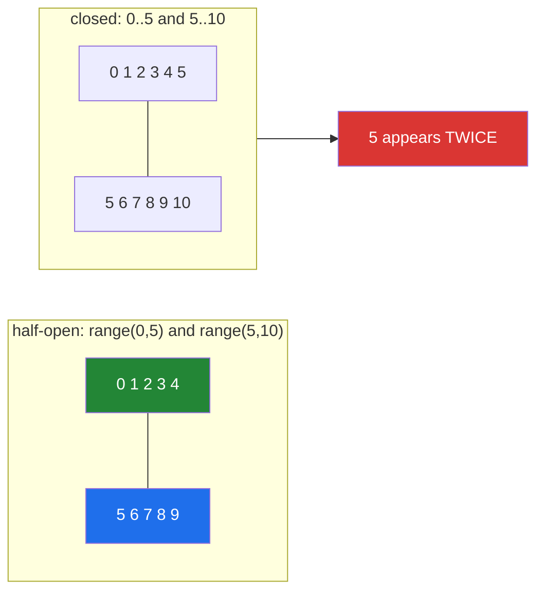

# 1.2 — `range` is lazy, and the half-open interval it enforces

## One-line answer

`range(a, b)` is not a list of numbers — it is three integers and a rule, so it costs the same whether
it spans ten values or ten billion, and its exclusive upper bound is what makes `range(len(x))` and
slicing agree.

---

## The story

A running track has markers every hundred metres.

The track does not store a list of every metre you will run. It stores where the start is, how far
apart the markers are, and where to stop. From those three facts you can work out any marker you
like, and a ten-kilometre course needs no more paint on the ground than a one-kilometre one — just
more laps.

Somebody is working out how much memory a simulation needs. They have to go through ten million
steps, they know a whole number in Python takes roughly twenty-eight bytes, so they budget about
three hundred megabytes for the loop and start worrying.

A colleague tells them to measure it. `sys.getsizeof(range(10_000_000))` reports **48 bytes**. The
same as `range(10)`. The same as `range(10**18)`, a count so large it could not fit in the memory of
every computer ever built.

`range` is the track, not the run. It holds a start, a stop and a step, and works out each number
when it is asked for one. The loop from [1.1](1.1-what-a-for-loop-actually-does.md) never needs more
than one number at a time, so nothing is ever stored.

The same person, in the same week, writes `for i in range(1, len(rows)):` to "skip the header row"
and quietly loses the **last** row of every file — because they moved the start forward by one and
forgot that the stop was already one short. Two facts about one object: the first saves three hundred
megabytes, and the second costs a row per file, forever.

---

## The idea in plain language

### What a `range` actually is

A `range` object holds exactly three numbers:

- **start** — where it begins, inclusive. Defaults to `0`.
- **stop** — where it ends, **exclusive**. Required.
- **step** — how much to add each time. Defaults to `1`, may be negative, may not be `0`.

Everything else is computed. `range(2, 10, 3)` yields `2, 5, 8` and stops, because `11` would be past
the stop. There is no list anywhere.

This makes `range` a **lazy sequence**: it behaves like a sequence — it has a length, supports
indexing, supports `in`, can be sliced — without storing anything. `range(10**18)[500]` returns
instantly, and `len(range(10**18))` is exact.

That is different from a generator ([1.1](1.1-what-a-for-loop-actually-does.md)). A generator is
consumed as it goes and cannot be re-used; a `range` can be looped over as many times as you like,
because each loop asks it for a fresh iterator. **Lazy does not mean one-shot.**

### The half-open interval, and why it is right

`range(0, 5)` gives `0, 1, 2, 3, 4` — the stop is not included. This is called a **half-open
interval**, written `[0, 5)`: closed at the bottom, open at the top. It looks like an inconvenience
and it buys four things:

1. **The count is the difference.** `range(a, b)` has exactly `b - a` items. No mental arithmetic, no
   "plus one".
2. **Adjacent ranges tile perfectly.** `range(0, 5)` and `range(5, 10)` cover `0..9` with no gap and
   no overlap. Chunking a list into batches is therefore trivial and cannot double-count a boundary.
3. **`range(len(x))` covers exactly the valid indices** of `x`, because indices run `0` to `len - 1`.
4. **It matches slicing.** `x[a:b]` and `range(a, b)` describe the same positions, so the two
   notations never disagree.

Python is consistent about this everywhere — slices, `range`, `enumerate` offsets, `str.find`'s
return, every "start and end" pair in the standard library. Adopting the same convention in your own
functions is what keeps your code composable with the language's.



### Counting down, and the trap in it

To go backwards you need a negative step, and **the stop is still exclusive** — which means the stop
is now the value you do *not* reach on the way down:

- `range(5, 0, -1)` → `5, 4, 3, 2, 1`. Note: no `0`.
- `range(5, -1, -1)` → `5, 4, 3, 2, 1, 0`. To include zero, the stop must be `-1`.

Almost everyone writes the first and means the second, once.

### The smell: `for i in range(len(x))`

If the only use of `i` is `x[i]`, the loop is asking for an index it does not want. The direct form is
`for item in x:`, and when you need the position too it is `enumerate`
([1.3](1.3-enumerate-and-zip.md)). Ruff and most reviewers flag `range(len(...))` on sight.

It is not always wrong. Genuine uses: you need the index for something other than lookup (writing into
a second list at the same position, printing a row number, comparing `x[i]` with `x[i+1]`), or you are
looping over a *count* that has nothing to do with a collection — `for _ in range(3):` to retry three
times, which is [3.2](../03-capped-retry/3.2-the-capped-retry-from-scratch.md)'s shape.

---

## Why Setu needs it

- **[3.2](../03-capped-retry/3.2-the-capped-retry-from-scratch.md), today,** builds the capped retry
  as `for attempt in range(max_attempts):`, where the cap is the whole point and the count is not an
  index into anything.
- **[1.3](1.3-enumerate-and-zip.md), next,** is the tool that replaces `range(len(x))` in the common
  case.
- **Day 8 chunks data into batches** (`PY-07`) with `range(0, len(rows), size)` — a step-`n` range,
  and the half-open property is what stops chunks overlapping.
- **Day 20's NumPy** (`NP-01`) uses the same half-open convention for slicing and `np.arange`, and
  **Day 24's slicing** depends on `range` and slice agreeing.
- **Day 164's chunking with overlap** (`RAG-04`) computes chunk boundaries with a stepped range; an
  inclusive-versus-exclusive mistake there duplicates or drops text at every boundary, silently, and
  shows up only as slightly worse retrieval.
- **Day 95's gradient descent** (`ML-06`) loops `for epoch in range(n_epochs):` — a count, not an
  index, and the cap is a hyperparameter you must pin (Principle 4).

---

## The mechanism

Three integers and a rule — the memory claim, measured:

```python
"""A range holds start, stop and step. Nothing else, at any size."""

import sys

for r in (range(10), range(10_000_000), range(10**18)):
    print(f"{str(r):<28} len={len(r):<22,} getsizeof={sys.getsizeof(r)} bytes")

big = range(10**18)
print("indexing is instant   :", big[500], big[-1])
print("membership is arithmetic:", 999_999_999 in big)
print("slicing gives a range :", big[10:20], type(big[10:20]).__name__)
print("re-iterable, unlike a generator:", list(range(3)), list(range(3)))
```

**Line by line:**

- `sys.getsizeof(r)` — the same small number for all three. **A `range` of a quintillion values costs
  what a `range` of ten costs**, because it stores three integers and computes the rest.
- `len(range(10**18))` — exact, and instant. The length is `(stop - start) // step` with a sign
  adjustment, one arithmetic expression.
- `big[500]` — `start + 500 * step`, computed on demand. `big[-1]` works too, because `range` supports
  the full sequence protocol.
- `999_999_999 in big` — instant. `range.__contains__` for an integer solves "is this in the
  arithmetic progression", which is a division, not a scan
  ([Day 5, 3.2](../../../day-05-operators-and-conditionals/parts/03-the-or-trap/3.2-in-is-an-operator.md)).
  Note that `in` on a *non*-integer falls back to scanning, so `1.0 in range(3)` is fast but
  `"1" in range(3)` walks.
- `big[10:20]` — slicing a range returns another **range**, not a list. Laziness composes.
- `list(range(3))` twice — both give `[0, 1, 2]`. A range is re-iterable; a generator is not. This is
  the line that separates "lazy" from "one-shot".

Half-open, and the two off-by-ones it prevents and one it causes:

```python
"""The stop is exclusive. Count, tiling, indices, and counting down."""

print("range(0, 5)      ->", list(range(0, 5)), " count =", len(range(0, 5)), "= 5 - 0")
print("range(2, 10, 3)  ->", list(range(2, 10, 3)))

rows = ["header", "a", "b", "c"]
print("range(len(rows)) ->", list(range(len(rows))), "= exactly the valid indices")
print("skip the header  ->", [rows[i] for i in range(1, len(rows))], " <- all three data rows")

print("tiling:")
for start in range(0, 10, 4):
    stop = min(start + 4, 10)
    print(f"    chunk {start}:{stop} -> {list(range(start, stop))}")

print("counting down:")
print("    range(5, 0, -1)  ->", list(range(5, 0, -1)), " <- no zero")
print("    range(5, -1, -1) ->", list(range(5, -1, -1)), " <- zero included")
```

**Line by line:**

- `len(range(0, 5))` is `5`, which is `stop - start`. **No plus-one anywhere**, which is the first
  thing half-open buys.
- `range(2, 10, 3)` — `2, 5, 8`. `11` would exceed the stop, so it is not produced. The stop is a
  bound, not a target: it need not be hit exactly.
- `range(1, len(rows))` — `1, 2, 3`, which is every index except the header. **This is the story's
  second bug, done right**: the person who lost a row wrote `range(1, len(rows) - 1)`, subtracting one
  from a bound that was already exclusive.
- `for start in range(0, 10, 4)` — a stepped range gives chunk starts `0, 4, 8`. `min(start + 4, 10)`
  clips the last chunk. The chunks are `0:4`, `4:8`, `8:10` — **contiguous, no overlap, no gap**, which
  is entirely due to half-open bounds.
- `range(5, 0, -1)` — stops before `0`, so zero is missing. To reach zero the stop must be `-1`, which
  reads strangely and is correct. When counting down over indices, `reversed(range(n))` is clearer than
  computing the bounds by hand, and it is what a reviewer would prefer.

And the smell, with its three legitimate exceptions:

```python
"""range(len(x)) is usually a mistake, and sometimes exactly right."""

rows = ["alpha", "beta", "gamma"]

print("SMELL - the index is only used to look up:")
for i in range(len(rows)):
    print("   ", rows[i])

print("BETTER - iterate the thing itself:")
for row in rows:
    print("   ", row)

print("LEGITIMATE 1 - comparing neighbours:")
for i in range(len(rows) - 1):
    print(f"    {rows[i]} then {rows[i + 1]}")

print("LEGITIMATE 2 - a count that indexes nothing:")
for attempt in range(3):
    print(f"    attempt {attempt + 1} of 3")

print("LEGITIMATE 3 - writing into a parallel structure by position:")
lengths = [0] * len(rows)
for i in range(len(rows)):
    lengths[i] = len(rows[i])
print("   ", lengths)
```

**Line by line:**

- The first loop uses `i` **only** as `rows[i]`. That is the smell: an index was created and
  immediately spent. The direct form is shorter, faster (no `__getitem__` per pass) and cannot go out
  of bounds.
- `range(len(rows) - 1)` — the neighbour-comparison idiom, and here the `- 1` is **correct**, because
  the body reads `rows[i + 1]` and the last index has no successor. Note how differently that reads
  from the story's bug: subtracting one is right when the body looks ahead and wrong when it does not.
- `for attempt in range(3)` — a pure count. There is no collection, so there is no `range(len(...))` to
  object to. `attempt + 1` in the message because humans count from one and the loop counts from zero,
  which is a display decision worth making explicitly rather than starting the range at 1.
- `lengths = [0] * len(rows)` — pre-allocating a parallel list. **This is safe because the elements are
  immutable integers**; `[[] for _ in rows]` would be needed for mutable ones, per
  [Day 4, 2.4](../../../day-04-objects/parts/02-containers/2.4-shallow-and-deep-copy.md)'s
  `[[0] * 3] * 3` trap.
- In practice the third case is usually better written as a comprehension —
  `lengths = [len(row) for row in rows]` ([Day 9](../../../day-09-comprehensions/parts/01-list-comprehensions/1.1-the-loop-and-the-comprehension.md))
  — which is worth noticing: two of the three "legitimate" uses have a cleaner form, and only the
  neighbour comparison really needs indices.

---

## When it breaks

**A float bound:**

```text
>>> for i in range(0, 10, 0.5):
...     pass
...
Traceback (most recent call last):
  File "<stdin>", line 1, in <module>
TypeError: 'float' object cannot be interpreted as an integer
```

**What it means.** `range` is integers only, by design — floats would make the length ambiguous
because of the representation error from
[Day 4, 1.3](../../../day-04-objects/parts/01-objects/1.3-numbers-and-bool.md). If you want fractional
steps, either scale to integers (`range(0, 100, 5)` and divide by 10) or use `numpy.arange` /
`numpy.linspace` from Day 20 — and `linspace` is usually the right one, because it specifies the count
rather than the step and therefore cannot accumulate error.

**A zero step:**

```text
>>> range(0, 10, 0)
Traceback (most recent call last):
  File "<stdin>", line 1, in <module>
ValueError: range() arg 3 must not be zero
```

**What it means.** A step of zero would never terminate. Note this raises when the range is
**constructed**, not when it is looped — the check is eager even though the values are lazy, which is
a good design: the error arrives at the line that is wrong.

**The empty range that silently does nothing:**

```text
>>> list(range(5, 0))
[]
>>> list(range(0, 5, -1))
[]
```

**What it means.** No error. When the direction of the step cannot reach the stop, the range is simply
empty and the loop body never runs. **This is the failure mode to watch for**: a loop that appears to
have done its work and produced nothing, usually because two bounds were swapped or computed from
data that turned out to be in the other order. Guard with an assertion or a log line when the bounds
come from data.

**And the two off-by-ones, side by side:**

```text
>>> rows = ["header", "a", "b", "c"]
>>> [rows[i] for i in range(1, len(rows) - 1)]
['a', 'b']
>>> [rows[i] for i in range(1, len(rows))]
['a', 'b', 'c']
```

**What it means.** The first line lost `"c"`, and it looks careful — it *has* a `- 1`, which reads like
attention to detail. The stop was already exclusive, so subtracting one excludes one more. There is no
error and the output is a plausible list, which is why this bug survives review and shows up as a
total that is slightly wrong.

---

## In production

**Half-open bounds are a convention to adopt in your own functions, not just to tolerate in the
language's.** Any function of yours that takes a start and an end — a slice of a time series, a page
of results, a chunk of a document — should use `[start, stop)` and say so in the docstring. The payoff
is that your ranges tile, your counts are subtractions, and your parameters can be passed straight to
slicing and `range` without adjustment. Mixing conventions inside one codebase is where the
"sometimes we lose the last row" class of bug lives, and it is a bug that survives for years because
each individual function is self-consistent.

**Laziness matters most where the count is large or unknown.** `range` is the smallest example of a
pattern that recurs throughout this curriculum: describe the work rather than materialise it. The same
idea is a generator on Day 11, a lazily-evaluated DataFrame in Polars, a database cursor, and a
paginated API client. The professional habit is to notice when you have written `list(range(n))` and
ask whether the list is needed — usually it is not, and when it is (because you want to shuffle it, or
sample from it, or index into it repeatedly) the reason should be visible.

**What changes at scale.** `range` itself never gets slower or bigger. What gets slower is the loop
body, and that is where the attention belongs: on ten million iterations, an attribute lookup or a
method call inside the body costs more than the entire iteration mechanism. The other scale note is
that `range` is bounded by nothing in Python 3 — `range(10**30)` is legal, because Python integers are
arbitrary precision — so a range computed from data cannot overflow, unlike the equivalent in a
language with fixed-width integers. That is a genuine safety property when the bound comes from a
file.

**The failure mode that only appears with real data is the reversed bound.** `range(start, stop)` where
both come from data — a first and last timestamp, a min and max id — is empty rather than erroneous
when the data arrives out of order. A pipeline that processes zero rows and reports success is very
hard to notice; the defence is an explicit check (`if stop <= start: raise` or a logged warning) at the
point the bounds are computed, not inside the loop.

**The review comment a senior engineer leaves.** On `for i in range(len(rows)): process(rows[i])`:
*"Iterate `rows` directly — the index is only used for lookup, so this is slower and can go out of
bounds. If you need the position for the log line, use `enumerate`."*

**The interview question.** *"How much memory does `range(10**9)` use?"* The answer is a constant few
dozen bytes, because a `range` stores start, stop and step and computes values on demand. The good
follow-up is *"how is that different from a generator?"* — a range is a lazy **sequence**: it has a
length, supports indexing and slicing, and can be iterated any number of times, whereas a generator is
consumed once and knows neither its length nor its contents in advance. If the conversation turns to
conventions, the half-open interval and its four properties — count is the difference, ranges tile,
`range(len(x))` is exactly the valid indices, and it matches slicing — is the answer that shows you
have thought about why rather than just memorised the behaviour.

---

## Check yourself

```bash
uv run python -c "
import sys
for r in (range(10), range(10_000_000), range(10**18)):
    print(f'{str(r):<26} getsizeof={sys.getsizeof(r)}  len={len(r):,}')
print('range(5, 0, -1) ->', list(range(5, 0, -1)))
print('range(5, -1, -1)->', list(range(5, -1, -1)))
print('range(5, 0)     ->', list(range(5, 0)), '<- empty, no error')
rows = ['header', 'a', 'b', 'c']
print('with -1  ->', [rows[i] for i in range(1, len(rows) - 1)])
print('without  ->', [rows[i] for i in range(1, len(rows))])
"
```

The three `getsizeof` numbers should be identical. The last two lines are the story's second bug.

**Answer out loud, without scrolling up:**

> Say what a `range` object actually stores, and why its size does not depend on its length. Then name
> the four things the exclusive upper bound buys you, and give the one place it bites — counting down.

---

**Next:** [1.3 — `enumerate`, `zip`, and the index you did not need](1.3-enumerate-and-zip.md)
