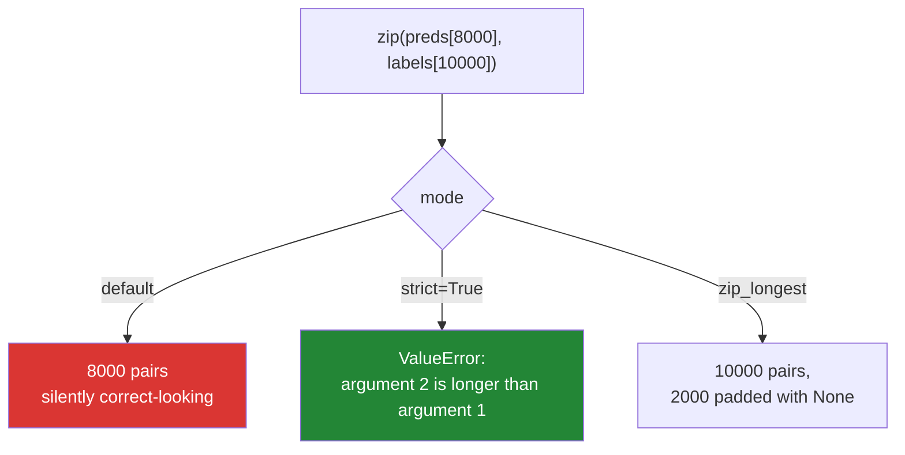

# 1.3 — `enumerate`, `zip`, and the silent truncation

## One-line answer

`enumerate` gives you position and value together so you never write `range(len(x))`, and `zip` walks
several iterables in step — but by default it stops at the shortest one **without saying so**, which
is why `strict=True` exists and should usually be on.

---

## The story

A model evaluation script.

It has a list of predictions and a list of true labels, and it walks them together with
`for pred, actual in zip(predictions, labels):`, counting matches. The reported accuracy is 0.94, the
team is pleased, and the model ships.

A month later someone notices the evaluation ran on 8,000 rows when the test set has 10,000. The
predictions list was short — a batch had failed silently upstream and returned fewer rows than it was
given — and `zip` had quietly stopped at 8,000. No error, no warning, no length mismatch reported. The
accuracy was real; it was just the accuracy on the first 80% of the test set, and the missing 20% were
the hard cases from the end of a sorted file.

The fix is one keyword argument. `zip(predictions, labels, strict=True)` raises
`ValueError: zip() argument 2 is longer than argument 1` the first time the lengths disagree, and the
failed batch would have been found the day it happened.

**A tool that silently produces a smaller correct-looking answer is more dangerous than one that
raises.** That is the whole lesson, and `zip`'s default is the wrong way round for data work.

---

## The idea in plain language

### `enumerate` — the position, without the index arithmetic

`enumerate(iterable)` yields `(index, item)` pairs. It is lazy, like `range`
([1.2](1.2-range-is-lazy.md)) — it does not build a list of pairs — and it takes an optional `start`:

```text
for position, name in enumerate(names, start=1):
```

That `start=1` is the humane version for anything a person will read: line numbers, row numbers, "item
3 of 10". It changes only the number reported, never which items are visited, which is exactly the
separation you want — **do not fake a one-based count by slicing the data.**

`enumerate` replaces `for i in range(len(x)):` in every case where the body wanted both the index and
the item, which is most cases. It is faster too, because there is no `__getitem__` call per pass, and
it works on things that have no indices at all — a file, a generator, a set.

### `zip` — walking several iterables in step

`zip(a, b)` yields `(a[0], b[0])`, `(a[1], b[1])`, and so on. It takes any number of iterables, it is
lazy, and — this is the part that matters — **it stops when the first of them is exhausted.**

```text
list(zip([1, 2, 3], ["a", "b"]))   ->  [(1, 'a'), (2, 'b')]
```

The `3` is gone. No error, no warning. That behaviour is genuinely useful when you are deliberately
pairing a finite thing with an infinite one — `zip(rows, itertools.count())` — and it is a data-loss
bug in every other situation.

### The three modes, and when each is right

| Call | Behaviour on unequal lengths | Use when |
|---|---|---|
| `zip(a, b)` | stops at the shortest, silently | one input is deliberately unbounded |
| `zip(a, b, strict=True)` | raises `ValueError` | **the default for data — lengths should match** |
| `itertools.zip_longest(a, b, fillvalue=None)` | pads the short one | you genuinely want the ragged edge |

`strict=True` arrived in Python 3.10, so it is available everywhere in this project (3.12,
[Day 0, 1.4](../../../day-00-setup/parts/01-toolchain/1.4-python-3-12-under-uv.md)). Turning it on is
the single highest-value habit in this document.



### Unpacking in the loop header

`for index, item in enumerate(x):` works because each yielded value is a **tuple**, and Python unpacks
it into the two names. That is ordinary tuple unpacking
([Day 8, 1.4](../../../day-08-containers/parts/01-sequences/1.4-unpacking-and-star-rest.md)), not
special loop syntax, which means it nests: `for i, (name, score) in enumerate(pairs):` works, and so
does `for a, b, c in zip(x, y, z):`.

If the number of names does not match the tuple's length, you get `ValueError: too many values to
unpack`. That is a good error — it means the shape of your data is not what you thought — and it
usually appears when a two-column CSV grows a third column.

### `zip` transposes, which is occasionally exactly what you want

`zip(*rows)` turns rows into columns. The `*` unpacks the list of rows into separate arguments, so
`zip` receives each row as its own iterable and pairs them positionally. It is the one-line transpose,
and it is worth recognising because it appears in real code and is opaque the first time you meet it.

---

## Why Setu needs it

- **[2.1](../02-control-flow/2.1-break-and-which-loop-it-leaves.md), today,** reports which item
  triggered a `break`, which needs the index that `enumerate` supplies.
- **Day 8's parallel structures** (`PY-07`) pair IDs with scores, titles with embeddings, features
  with names. Every one of those pairings is a `zip`, and every one should be strict.
- **Day 20's NumPy** (`NP-01`) makes most `zip` loops unnecessary by aligning arrays directly, and
  **Day 25's broadcasting** raises on a shape mismatch rather than truncating — the same choice
  `strict=True` makes, baked into the library.
- **Day 76 onwards, every evaluation** (`ML-`) zips predictions against labels. This part's story is
  that day's most expensive possible bug, because a silently truncated evaluation reports a number
  that looks fine.
- **Day 162's retrieval evaluation** (`RAG-`) pairs queries with expected documents; a length mismatch
  there means you are scoring the wrong pairs, not merely fewer of them, if either list is reordered.

---

## The mechanism

`enumerate`, and the smell it replaces:

```python
"""enumerate gives position and value. range(len(x)) gives an index you then spend."""

names = ["alpha", "beta", "gamma"]

print("range(len(x)) - the index is created and immediately spent:")
for i in range(len(names)):
    print(f"    {i}: {names[i]}")

print("enumerate - the same two values, no lookup:")
for i, name in enumerate(names):
    print(f"    {i}: {name}")

print("enumerate(start=1) - for anything a human reads:")
for line_no, name in enumerate(names, start=1):
    print(f"    line {line_no}: {name}")

print("enumerate works where there are no indices at all:")
for i, char in enumerate({"only", "a", "set"}):
    print(f"    {i}: {char}")
```

**Line by line:**

- `for i in range(len(names))` — two operations per pass: produce `i`, then `names[i]`, which is a
  `__getitem__` call. `enumerate` does one.
- `for i, name in enumerate(names)` — the yielded tuple `(0, "alpha")` is unpacked into two names by
  ordinary tuple unpacking. Nothing loop-specific is happening.
- `enumerate(names, start=1)` — **the counter starts at 1; the data still starts at index 0.** Nothing
  is skipped. Compare with `enumerate(names[1:])`, which skips the first item *and* renumbers — a
  different thing entirely, and a common way to lose a row.
- `enumerate({"only", "a", "set"})` — a set has no indices and cannot be subscripted, so
  `range(len(...))` is impossible here. `enumerate` still works, because it counts the loop's passes
  rather than reading positions. The order of a set is arbitrary, which is
  [Day 8, 2.1](../../../day-08-containers/parts/02-sets-and-dicts/2.1-a-set-is-a-hash-table.md)'s
  subject — the counter is still meaningful as "how many have I seen".

Now `zip`, and the story:

```python
"""zip stops at the shortest. strict=True is what turns that into an error."""

predictions = [1, 0, 1, 1]
labels = [1, 0, 1, 1, 0, 1]

pairs = list(zip(predictions, labels))
print(f"default zip: {len(pairs)} pairs from {len(predictions)} and {len(labels)} inputs")
print("            ", pairs, "  <- two labels silently dropped")

accuracy = sum(p == a for p, a in zip(predictions, labels)) / len(pairs)
print(f"            reported accuracy {accuracy:.2f} - on 4 of 6 rows")

try:
    list(zip(predictions, labels, strict=True))
except ValueError as exc:
    print("strict=True:", type(exc).__name__, "-", exc)

from itertools import zip_longest

print("zip_longest:", list(zip_longest(predictions, labels, fillvalue=None)))
```

**Line by line:**

- `list(zip(predictions, labels))` — four pairs, not six. The two extra labels vanish with no signal at
  all. **This is the incident**, in four lines.
- `sum(p == a for p, a in zip(...)) / len(pairs)` — the accuracy computed over the truncated set.
  Dividing by `len(pairs)` rather than `len(labels)` is what makes the number look right; dividing by
  the true count would at least have produced a suspiciously low score. The generator expression inside
  `sum` is [Day 9, 2.3](../../../day-09-comprehensions/parts/02-dict-set-gen/2.3-the-generator-expression.md);
  `sum` over booleans works because `True` is `1`
  ([Day 4, 1.3](../../../day-04-objects/parts/01-objects/1.3-numbers-and-bool.md)).
- `strict=True` — raises `ValueError: zip() argument 2 is longer than argument 1`. Note it names
  **which** argument, which is what turns "something is wrong" into "the predictions are short".
- `zip_longest(..., fillvalue=None)` — pads to the longest. Right when the ragged edge is meaningful —
  merging records where a field is optional — and wrong here, because a prediction of `None` is not a
  prediction.
- The `from itertools import zip_longest` mid-file is for readability of the example only; real code
  puts imports at the top, and ruff's `E402` enforces it
  ([Day 2, 1.2](../../../day-02-quality-gate/parts/01-linting/1.2-choosing-rule-families.md)).

And the two idioms worth recognising:

```python
"""Nested unpacking, and the one-line transpose."""

scores = [("alpha", 0.9), ("beta", 0.4), ("gamma", 0.7)]

print("nested unpacking:")
for rank, (name, score) in enumerate(sorted(scores, key=lambda p: -p[1]), start=1):
    print(f"    {rank}. {name:<6} {score}")

rows = [(1, "a", True), (2, "b", False), (3, "c", True)]
columns = list(zip(*rows))
print("rows      :", rows)
print("zip(*rows):", columns, " <- transposed")

ids, letters, flags = zip(*rows)
print("unpacked  :", ids, letters, flags)
```

**Line by line:**

- `for rank, (name, score) in enumerate(...)` — `enumerate` yields `(1, ("alpha", 0.9))`, and the
  parentheses in the target list unpack the inner tuple as well. **The shape of the target mirrors the
  shape of the data**, which is the rule for reading any unpacking.
- `key=lambda p: -p[1]` — sort by score descending by negating it. `reverse=True` is clearer and is
  what [Day 8, 1.5](../../../day-08-containers/parts/01-sequences/1.5-sort-sorted-and-key.md)
  recommends; the negation is shown because it appears constantly in real code and needs to be
  readable.
- `zip(*rows)` — `*` unpacks the list into three separate row arguments, so `zip` pairs them
  positionally: all the first elements, then all the seconds. **A transpose.** It works on any
  rectangular structure and silently truncates a ragged one, which is the same trap as before —
  `strict=True` applies here too.
- `ids, letters, flags = zip(*rows)` — the transpose immediately unpacked into named columns. This is a
  genuinely useful line and completely opaque until you have seen it once, which is why it is here.

---

## When it breaks

**The strict failure, verbatim:**

```text
>>> list(zip([1, 2], ["a", "b", "c"], strict=True))
Traceback (most recent call last):
  File "<stdin>", line 1, in <module>
ValueError: zip() argument 2 is longer than argument 1
```

**What it means.** Argument 2 (the letters) still had items when argument 1 ran out. The message names
the positions, so with three or more inputs you know exactly which pair disagreed. Note that the error
arrives **during iteration**, not at construction — `zip(...)` itself is lazy — so in a `for` loop it
raises on the pass after the shortest input ended, and any work done before that has already happened.

**The unpacking that does not match:**

```text
>>> for a, b in [(1, 2, 3)]:
...     pass
...
Traceback (most recent call last):
  File "<stdin>", line 1, in <module>
ValueError: too many values to unpack (expected 2)
```

**What it means.** The tuple has three elements and the target has two names. Usually a data shape
changed — a CSV grew a column, an API added a field. The fix is either a third name or
`for a, b, *rest in ...`, and choosing between them is a decision about whether the extra data
matters.

**`enumerate` in the wrong argument order:**

```text
>>> for name, i in enumerate(["a", "b"]):
...     print(name, i)
...
0 a
1 b
```

**What it means.** No error — the names are just backwards, so `name` holds the number and `i` holds
the string. Everything downstream is subtly wrong: a log line reads `0: a` instead of `a: 0`, or a
lookup uses a string where an integer was expected and raises somewhere else entirely. **`enumerate`
yields `(index, item)`, in that order**, and getting it wrong produces a plausible-looking mess rather
than a traceback.

**And the silent truncation with no lengths to compare:**

```text
>>> rows = iter([1, 2, 3])
>>> labels = iter(["a", "b"])
>>> list(zip(rows, labels))
[(1, 'a'), (2, 'b')]
>>> list(rows)
[]
```

**What it means.** Two things at once. The pairs are truncated as usual — and `rows` is now **empty**,
because `zip` consumed `3` from it while checking whether there was a third pair to make, then
discarded it when `labels` ran out. With iterators rather than lists there is no length to inspect
afterwards and the lost item is genuinely gone. This is why `strict=True` matters more, not less, when
the inputs are streams.

---

## In production

**Turn `strict=True` on by default and justify every place you leave it off.** In data and ML code the
lengths of two parallel sequences agreeing is an invariant, and an invariant that is not checked is a
bug waiting for a bad day upstream. The habit costs eleven characters and converts the worst class of
failure — a smaller, plausible, wrong answer — into a stack trace with the argument number in it. Some
teams go further and wrap it: a `paired(a, b)` helper in their own utilities that is strict by
construction, so the unstrict form has to be written out deliberately.

**Where `zip` is doing real work, check the lengths *and* the alignment.** Strict mode catches
different lengths; it cannot catch two lists of the same length in different orders, which is the
worse version of the evaluation bug. The defence is to pair on a key rather than on position wherever
a key exists: build a dict from id to prediction and look each label's id up, so a reordering produces
a `KeyError` instead of a plausible score. Positional pairing is a performance optimisation with a
correctness cost, and it should be a decision, not a default.

**`enumerate` over `range(len(x))` is a settled question in review.** The direct form is faster, cannot
go out of bounds, works on non-indexable iterables, and states what the loop is doing. The remaining
legitimate uses of `range(len(x))` — comparing `x[i]` with `x[i+1]`, and writing into a parallel
structure by position — both have cleaner alternatives (`zip(x, x[1:])` and a comprehension), and
knowing them is what lets you say the rule has no exceptions in your codebase.

**What changes at scale.** All three of `enumerate`, `zip` and `range` are lazy and constant-memory, so
they scale fine on their own. The trap is `zip(*rows)` for a transpose: the `*` **materialises every
row as a separate argument**, so it needs the whole structure in memory and fails on a stream. On
large tabular data the answer is a columnar structure to begin with — a DataFrame or a dict of arrays
— rather than transposing rows, which is one of the arguments for pandas on Day 26. The other scale
note is that a `zip` of two very long lists inside a hot loop is still a Python-level `__next__` per
pair, and vectorising is the alternative
([4.2](../04-loop-cost/4.2-the-loop-you-should-not-write.md)).

**The review comment a senior engineer leaves.** On an evaluation loop: *"Add `strict=True` to this
`zip`. If the prediction batch ever comes back short we will silently evaluate on a prefix and report
a good-looking number — that is the failure I most want to be loud. And consider joining on the row id
rather than position, since a reorder upstream would still pass a strict length check."*

**The interview question.** *"What happens when you `zip` two lists of different lengths?"* The answer
is that it stops at the shorter one and produces no error. The follow-up that matters is *"is that a
problem?"* — and the strong answer is yes for anything where the lengths are supposed to match, because
the result is a plausible, smaller, wrong answer rather than a failure, so it survives testing and
review; the fix is `strict=True` in Python 3.10+, or `zip_longest` when the ragged edge is meaningful.
If the interviewer likes the answer they will usually ask about `enumerate` next, and the point to
make is that `range(len(x))` creates an index only to spend it immediately, while `enumerate` is
faster, safer and works on iterables that have no indices at all.

---

## Check yourself

```bash
uv run python -c "
preds, labels = [1, 0, 1, 1], [1, 0, 1, 1, 0, 1]
print('default:', len(list(zip(preds, labels))), 'pairs from', len(preds), 'and', len(labels))
try:
    list(zip(preds, labels, strict=True))
except ValueError as exc:
    print('strict :', exc)
for i, name in enumerate(['a', 'b'], start=1):
    print(f'  line {i}: {name}')
rows = [(1, 'a'), (2, 'b'), (3, 'c')]
print('transpose:', list(zip(*rows)))
it = iter([1, 2, 3])
list(zip(it, iter(['a', 'b'])))
print('leftover after a truncating zip:', list(it))
"
```

The last line is the one that surprises people — predict it before running.

**Answer out loud, without scrolling up:**

> Say what `zip` does when its inputs are different lengths, and why that default is dangerous for
> evaluation code. Then give two things `enumerate` can do that `range(len(x))` cannot.

---

**Next:** [1.4 — `while`, and the loop with no promise of ending](1.4-while-and-the-loop-with-no-promise.md)
