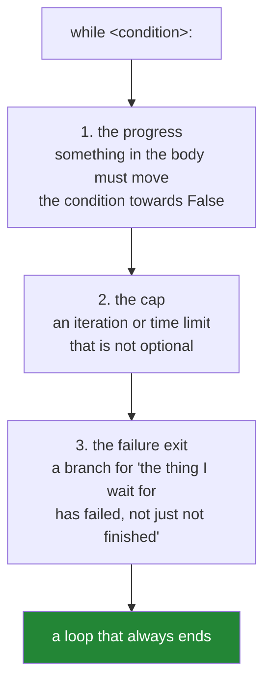

# 1.4 — `while`, and the loop with no promise of ending

## One-line answer

A `for` loop is bounded by its iterable and a `while` loop is bounded by nothing at all — so every
`while` you write owes the reader an answer to one question: **what makes this stop?**

---

## The story

A polling script checks whether a long-running export has finished. It looks like this:

```text
while not export.is_done():
    time.sleep(5)
download(export.result())
```

It works for a year. Then an export fails on the server side, and `is_done()` starts returning `False`
forever, because a failed job is not a done job. The script polls every five seconds, for eleven days,
until someone notices the process on the monitoring dashboard. It never logged anything, because there
was nothing to log — it was doing exactly what it was told.

In the incident review, someone points out that the loop has no upper bound, no timeout, and no branch
for "the thing I am waiting for has failed". Someone else points out something worse: the same pattern
appears in four other places in the codebase, and each of them was written by copying this one.

A `while` loop is the only construct in Python that can run forever without a bug being visible in the
source. The discipline that prevents this is not cleverness; it is a habit — **write the exit before
you write the body**.

---

## The idea in plain language

### The two loops answer different questions

| | `for` | `while` |
|---|---|---|
| Reads as | "do this for each of these" | "keep doing this while that is true" |
| How many passes | decided by the iterable | decided by the condition, each pass |
| Bounded? | **yes, by construction** | **no, unless you make it so** |
| Natural use | traversing data | waiting, converging, consuming a protocol |

The condition is evaluated **before every pass**, including the first. So a `while` whose condition is
false at the start runs zero times, exactly like a `for` over an empty list.

The condition uses truthiness ([Day 5,
2.2](../../../day-05-operators-and-conditionals/parts/02-conditionals/2.2-truthiness.md)), with all
the same traps: `while queue:` is idiomatic and correct for a list, and `while count:` is a bug when
`0` is a valid count.

### Three shapes that legitimately need `while`

Most loops over data are `for` loops, and reaching for `while` when a `for` would do is a smell. The
cases where `while` is the right tool:

1. **Waiting for a condition** — polling, retrying, backing off. The number of passes is unknown when
   you start.
2. **Consuming until a sentinel** — reading fixed-size chunks until an empty one, parsing a protocol
   until a terminator.
3. **Converging** — iterate until the change is below a threshold. Gradient descent, Newton's method,
   any numerical method. The number of passes depends on the data.

Every one of these has the same weakness: **the loop's termination depends on something outside the
loop.** A server, a file, a numerical property. And every one of them can fail to terminate when that
outside thing misbehaves.

### The three-part rule

A `while` loop is complete when it has all three of these, and is a latent incident when it has fewer:



1. **Progress.** Something in the body changes the value the condition tests. The classic bug is a
   counter you forgot to increment, or a condition on a variable the body never touches.
2. **A cap.** An iteration limit, a deadline, or both. `while not done and attempts < MAX:` — and the
   cap is not a safety net you add later, it is part of the loop's definition
   ([3.1](../03-capped-retry/3.1-why-the-cap-comes-first.md)).
3. **A failure exit.** "Not finished" and "will never finish" are different states, and a condition
   that only tests the first will wait forever for the second. The story's loop had none of the three.

### `while True` is not automatically wrong

`while True:` with a `break` inside is a legitimate and common shape — it is how you write a loop whose
exit test naturally belongs in the middle rather than at the top, and it is clearer than duplicating
the read once before the loop and once at the end. What makes it acceptable is that the `break` is
**visible and reachable**; what makes it dangerous is that a reader must now find the exit rather than
read it off the header. [2.1](../02-control-flow/2.1-break-and-which-loop-it-leaves.md) covers the
`break` itself.

### The one thing you cannot do

There is no way to interrupt a `while` from outside it — no timeout parameter, no watchdog built into
the language. `Ctrl-C` raises `KeyboardInterrupt` in an interactive session, and a `SIGKILL` stops the
process, and neither is available to a job running unattended at three in the morning. **The bound has
to be in the code.**

---

## Why Setu needs it

- **[3.1](../03-capped-retry/3.1-why-the-cap-comes-first.md) and
  [3.2](../03-capped-retry/3.2-the-capped-retry-from-scratch.md), today,** are this document applied:
  the retry loop is the canonical bounded `while`, and it is the shape everything later reuses.
- **Day 3's rate-limit backoff** already needed one
  ([Day 3, 4.2](../../../day-03-keys-and-budget/parts/04-rate-budget/4.2-429-and-real-backoff.md)) —
  and an unbounded retry against a rate-limited free tier burns the day's quota rather than the day
  (Principle 5).
- **Day 95's gradient descent** (`ML-06`) converges: `while improvement > tol and epoch < max_epochs:`.
  The second half of that condition is what stops a diverging learning rate from running forever, and
  the plan names the capped loop as a shared shape across the whole curriculum.
- **Day 182's agent loop** (`AGT-01`) is a `while` around think → act → observe, with a model in it.
  An uncapped agent loop is a bill and a blast radius (Principles 5 and 11), and **Day 223's runaway
  caps** (`MAS-10`) is an entire day about this exact failure at multi-agent scale.
- **Day 196's context trimming** (`LG-12`) drops messages `while` the token count is over budget —
  and needs a floor, because trimming to zero messages and still being over budget is a real state.

---

## The mechanism

The three parts, present and absent:

```python
"""A while loop with no progress, no cap, and no failure exit - then all three added."""


class FlakyExport:
    """Reports 'not done' forever after it fails, exactly like the story's server."""

    def __init__(self, fails_after: int) -> None:
        self.polls = 0
        self.fails_after = fails_after

    def is_done(self) -> bool:
        self.polls += 1
        return False

    def has_failed(self) -> bool:
        return self.polls > self.fails_after


MAX_POLLS = 5

export = FlakyExport(fails_after=3)
polls = 0
while not export.is_done():
    polls += 1
    if export.has_failed():
        print(f"    poll {polls}: the export FAILED - exiting, not waiting")
        break
    if polls >= MAX_POLLS:
        print(f"    poll {polls}: cap reached - exiting")
        break
    print(f"    poll {polls}: not done yet")
print("loop finished after", polls, "polls")
```

**Line by line:**

- `def is_done(self)` returns `False` unconditionally — the story's server, which never reports done
  because the job failed rather than finished. **The condition alone can never end this loop.**
- `polls += 1` — the **progress**. Without it the cap below can never trigger, and a cap that cannot
  trigger is decoration.
- `if export.has_failed(): break` — the **failure exit**. This is the branch the story's loop was
  missing, and it is the one that matters most: it distinguishes "not yet" from "never", and it fires
  first because a failed job should not wait for the cap.
- `if polls >= MAX_POLLS: break` — the **cap**. It is a named module-level constant, not a literal in
  the condition, so it can be read in a log line and changed in one place.
- `>=` rather than `==` — an `==` cap fails to fire if the counter ever advances by more than one, and
  then the loop is unbounded again. Use `>=` for every cap check, always.
- Both `break`s print before leaving. **A loop that exits early must say why**, or the caller cannot
  tell "finished" from "gave up", which is the same collapse
  [Day 5, 2.2](../../../day-05-operators-and-conditionals/parts/02-conditionals/2.2-truthiness.md)
  warns about in a different costume.

The condition in the header versus the exit in the middle:

```python
"""Two shapes for the same job. Neither is wrong; they read differently."""

chunks = [b"aaa", b"bbb", b"", b"ccc"]
position = 0


def read_chunk() -> bytes:
    """Returns b'' at the end of the stream, like a real read() does."""
    global position
    chunk = chunks[position] if position < len(chunks) else b""
    position += 1
    return chunk


print("shape A - test at the top, which needs a read before the loop:")
position = 0
chunk = read_chunk()
while chunk:
    print("   ", chunk)
    chunk = read_chunk()

print("shape B - while True with the exit in the middle, read written once:")
position = 0
while True:
    chunk = read_chunk()
    if not chunk:
        break
    print("   ", chunk)
```

**Line by line:**

- `global position` — declares that the assignment targets the module-level name rather than creating a
  local. Scope is Day 10 (`PY-10`); here it is the shortest way to fake a stateful stream, and in real
  code the stream object would hold its own position.
- Shape A duplicates `read_chunk()` — once before the loop, once at the bottom. **Duplicated lines
  drift**: someone adds error handling to one copy and not the other, which is a real and common bug.
- Shape B writes the read once and puts the exit where the decision actually is. `while True` is
  honest here: the condition genuinely is not known until after the read.
- `if not chunk: break` — truthiness on `bytes`, where empty means end-of-stream. This is one of the
  cases where truthiness is exactly right, because empty and absent mean the same thing to this loop.
- **Both loops stop after three chunks.** Note that neither has a cap — for a finite local list that
  is fine, and for a network stream it would not be, which is precisely the judgement this part is
  training.

And the failure the story is made of, with the bound that fixes it:

```python
"""An unbounded wait, and a deadline. The difference is four lines."""

import time

DEADLINE_SECONDS = 0.25
POLL_INTERVAL = 0.05


def never_ready() -> bool:
    return False


started = time.monotonic()
polls = 0
timed_out = False

while not never_ready():
    polls += 1
    elapsed = time.monotonic() - started
    if elapsed >= DEADLINE_SECONDS:
        timed_out = True
        break
    time.sleep(POLL_INTERVAL)

print(f"polls={polls} timed_out={timed_out} elapsed={time.monotonic() - started:.2f}s")
if timed_out:
    raise TimeoutError(f"export not ready after {DEADLINE_SECONDS}s and {polls} polls")
```

**Line by line:**

- `time.monotonic()` — **not `time.time()`.** A monotonic clock only ever moves forward and is immune
  to the system clock being adjusted; `time.time()` can jump backwards during an NTP correction or a
  daylight-saving change, which turns a deadline into a much longer wait. Every timeout in production
  code uses a monotonic clock, and this is the reason.
- `elapsed >= DEADLINE_SECONDS` — a wall-clock cap rather than an iteration cap. Use a deadline when the
  work involves waiting (the number of polls depends on the interval) and an iteration cap when it
  does not. Serious code often has both.
- `timed_out = True` before the `break` — a flag, so the code after the loop can tell why it ended.
  Without it, "finished" and "gave up" look identical from outside, which is the story's silent
  failure. [2.3](../02-control-flow/2.3-for-else.md) shows the `else` clause that removes the need for
  this flag in the `for` case.
- `raise TimeoutError(...)` after the loop — **the loop reports its failure to its caller.** Returning
  quietly would push the story's bug one level up. The message carries both the deadline and the poll
  count, which is what makes the log line diagnosable.
- `time.sleep(POLL_INTERVAL)` — the wait between polls. A tight `while` with no sleep against a remote
  service is a denial-of-service attack on your own dependency, and against a rate-limited free tier it
  is a spent quota
  ([Day 3, 4.1](../../../day-03-keys-and-budget/parts/04-rate-budget/4.1-rpm-rpd-tpm.md)).

---

## When it breaks

**The counter nobody incremented:**

```text
>>> i = 0
>>> while i < 3:
...     print("still going")
...
still going
still going
still going
... forever, until Ctrl-C
^CTraceback (most recent call last):
  File "<stdin>", line 2, in <module>
KeyboardInterrupt
```

**What it means.** The body never changes `i`, so the condition is true forever. **The traceback names
the line you were on when you interrupted, not the bug** — which is what makes an infinite loop
awkward to diagnose from a log: there is nothing in the log, because nothing failed. Note also that
this is a common consequence of a `continue` placed above the increment
([2.2](../02-control-flow/2.2-continue-and-the-skipped-increment.md)).

**The float condition that never becomes false:**

```text
>>> x = 0.0
>>> while x != 1.0:
...     x += 0.1
...
... forever
```

**What it means.** After ten additions `x` is `0.9999999999999999`, not `1.0`, because `0.1` is not
exactly one tenth ([Day 4,
1.3](../../../day-04-objects/parts/01-objects/1.3-numbers-and-bool.md)). **Never write `!=` or `==`
against a float in a loop condition.** Use `<`, or better, count integers and scale: `for i in
range(10): x = i / 10`.

**The condition that reads a value the body cannot change:**

```text
>>> items = [1, 2, 3]
>>> while len(items) > 0:
...     for item in items:
...         print(item)
...
1
2
3
1
2
3
... forever
```

**What it means.** The inner loop reads `items`; nothing removes from it. This shape appears when
someone converts a `for` into a `while` for a reason they later remove, and the condition is left
testing something static. The tell is that **no line in the body mentions the name the condition
tests** — worth checking by eye on every `while` you write.

**And the one that produces no error and no output at all:**

```text
>>> queue = []
>>> while queue:
...     print(queue.pop())
...
>>>
```

**What it means.** Zero passes, silently. Correct behaviour for an empty queue, and indistinguishable
from "the queue was never filled because of a bug upstream". A `while` that legitimately may run zero
times should log the count afterwards, for the same reason
[Day 5, 2.3](../../../day-05-operators-and-conditionals/parts/02-conditionals/2.3-if-df-raises.md)
argues for logging a zero-row skip.

---

## In production

**Every unbounded `while` is an incident waiting for its trigger, and reviewers treat it that way.**
The rule that holds up is: a `while` whose condition depends on anything outside the process — a
network call, a file, a queue, another thread — must have a cap, and the cap must be a named constant
or a parameter, not a magic number buried in the condition. The cap being *configurable* matters too:
the person handling the incident at 3am wants to raise or lower it without a deploy.

**Distinguish "not yet" from "never".** This is the part people skip, and it is the one the story turns
on. A polling loop needs at least three outcomes: succeeded, failed, timed out — and the caller needs
to be able to tell them apart, which means an exception or a result object rather than a bare return.
A function that returns `None` for both "failed" and "timed out" pushes the ambiguity to its caller,
who will collapse it into one branch. This is Day 18's (`PY-22`) error-design question arriving early.

**Poll with backoff, never in a tight loop.** A `while` with no sleep against a remote service will
saturate a connection pool, exhaust a rate limit, and in the free-tier world of this project spend a
day's quota in seconds (Principle 5). Real polling loops sleep, and good ones increase the interval as
they go — the same exponential shape as
[Day 3, 4.2](../../../day-03-keys-and-budget/parts/04-rate-budget/4.2-429-and-real-backoff.md)'s
backoff — because a job that has not finished in ten seconds is unlikely to finish in the next
hundred milliseconds.

**What changes at scale and under concurrency.** A `while` that waits is holding resources: a thread, a
connection, a database transaction. At one instance that is invisible; at five hundred concurrent
workers each politely polling every five seconds it is a self-inflicted load spike, and if they all
started together they poll in lockstep — the **thundering herd**. Jitter (a small random offset on each
sleep) is the standard defence, and it is why the backoff formula in real clients has a random term.
The other concurrency trap is a condition on shared mutable state without synchronisation: `while not
self.done:` can spin forever if another thread's write is never observed, which in CPython is usually
masked by the interpreter lock and is a genuine hang in other runtimes.

**The review comment a senior engineer leaves.** On the story's three-line loop: *"No cap, no timeout,
and no branch for a failed export — `is_done()` returns `False` for both 'still running' and 'died', so
this waits forever on failure. Add a deadline with `time.monotonic()`, raise `TimeoutError` when it
trips, check the failure state explicitly, and back off between polls rather than a fixed five
seconds."*

**The interview question.** *"When would you use `while` instead of `for`?"* The answer is when the
number of iterations is not known in advance — waiting on an external condition, consuming until a
sentinel, or iterating until a numerical method converges. The follow-up worth being ready for is
*"what makes a `while` loop safe?"*, and the three-part answer is: something in the body must make
progress towards the condition being false, there must be a cap on iterations or time, and there must
be an explicit exit for the failure case, because "not finished" and "will never finish" are different
states that a naive condition collapses. If they push on the cap, the details that show experience are
using `>=` rather than `==`, using a monotonic clock for deadlines, and sleeping with backoff and
jitter rather than polling tight.

---

## Check yourself

```bash
uv run python -c "
import time
DEADLINE = 0.2
started = time.monotonic()
polls = 0
timed_out = False
while True:
    polls += 1
    if time.monotonic() - started >= DEADLINE:
        timed_out = True
        break
    time.sleep(0.02)
print(f'polls={polls} timed_out={timed_out}')
x = 0.0
for _ in range(10):
    x += 0.1
print('x == 1.0 after ten additions of 0.1:', x == 1.0, repr(x))
"
```

The second half shows why `while x != 1.0:` never ends. Predict the boolean before running.

**Answer out loud, without scrolling up:**

> Name the three things every `while` loop needs, and say which one the polling story was missing.
> Then explain why a deadline uses `time.monotonic()` rather than `time.time()`.

---

**Next:** [2.1 — `break`, and which loop it leaves](../02-control-flow/2.1-break-and-which-loop-it-leaves.md)
