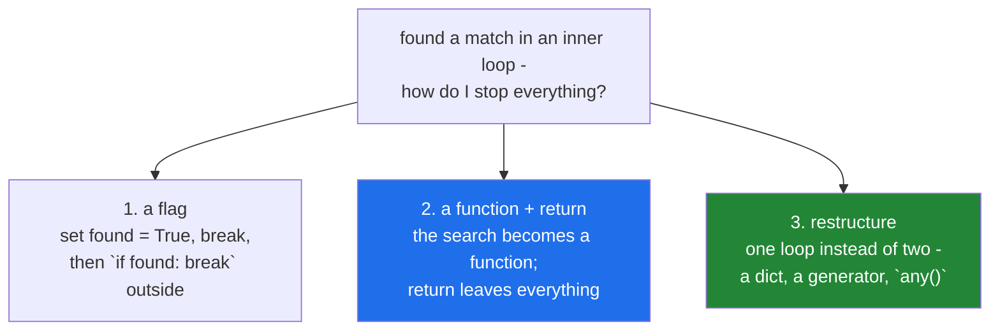

# 2.1 — `break`, and which loop it leaves

## One-line answer

`break` leaves **the innermost loop it is written inside**, and nothing else — not the function, not
the outer loop, not the `with` block — which is why a nested search needs a flag, a function, or a
restructure.

---

## The story

A matching job pairs incoming papers against a reference list. For each incoming paper it scans the
references for the same DOI, and when it finds one it records the match and stops scanning.

```text
for paper in incoming:
    for reference in references:
        if paper.doi == reference.doi:
            record(paper, reference)
            break
```

It works. Then a requirement arrives: stop the entire job after the first match, because the job is
now a smoke test that just needs to prove the pipeline is wired up. Someone adds a second `break`
under the first, reasons that two `break`s leave two loops, and ships it.

It does not stop the job. The second `break` is unreachable — the first one already left the inner
loop — and the outer loop keeps going through all forty thousand incoming papers, doing nothing.

The reviewer's question is the one worth internalising: **`break` is not "stop"; it is "leave this
loop".** Which loop is decided entirely by indentation, and there is no way to say "leave two". The
fix is not another `break`; it is either a flag, a function with a `return`, or — usually best —
restructuring so there is only one loop to leave.

---

## The idea in plain language

### What `break` does, exactly

`break` immediately ends the **innermost enclosing loop** and continues at the first statement after
it. Three details follow, and each one causes a real bug when it is not known:

1. **It leaves one loop.** Never two. There is no `break 2` in Python, unlike some other languages.
2. **It skips the loop's `else` clause.** A `for`/`while` may have an `else` that runs when the loop
   finishes *normally*, and `break` is precisely what makes it not run
   ([2.3](2.3-for-else.md)).
3. **It does not leave a `with`, a `try`, or a function.** `finally` blocks still run, context
   managers still exit cleanly, and the function keeps going after the loop.

### The three ways out of a nested loop



**The flag** works and is the least pleasant: it puts the exit condition in two places, and adding a
third level means a second flag. It is the right answer when the loops genuinely belong together and
extracting a function would need six parameters.

**The function** is the usual professional answer. Extract the search into its own function, and
`return` leaves every loop inside it at once, because it leaves the function. This is why you see far
fewer nested-loop flags in mature code than in tutorials — the loops have been given names.

**The restructure** is best when it is available. A nested search for "does this exist" is very often a
dict lookup, a set membership test
([Day 5, 3.2](../../../day-05-operators-and-conditionals/parts/03-the-or-trap/3.2-in-is-an-operator.md)),
or a call to `any()`, none of which need a `break` at all — and all of which are faster, because the
nested version is the quadratic from
[4.1](../04-loop-cost/4.1-the-accidental-quadratic.md).

### `break` and the search idiom

The classic use of `break` is a **linear search**: walk until you find something, then stop. Two
things must be handled and one of them is usually forgotten:

- **What you found** — usually captured in a variable before the `break`.
- **The not-found case** — what happens when the loop ran to the end without breaking. This is what
  `for ... else` exists for ([2.3](2.3-for-else.md)), and the common alternative is a `found = None`
  before the loop plus an `if found is None:` after it.

The bug is a search that reports success because the "not found" case falls through into code that
assumes a result. If the variable holding the result is left over from a previous iteration of an
*outer* loop, the failure is a wrong match rather than a crash — which is much harder to see.

### Where `break` is genuinely the right tool

- Stopping at the first match in an unindexed sequence.
- Leaving a `while True:` whose exit test belongs in the middle
  ([1.4](../01-iteration/1.4-while-and-the-loop-with-no-promise.md)).
- Enforcing a cap: `if attempts >= MAX: break`
  ([3.2](../03-capped-retry/3.2-the-capped-retry-from-scratch.md)).
- Bailing out of a long scan once a budget — time, tokens, requests — is spent.

Where it is not: as a substitute for a condition that could be in the loop header, and as a way to
express "skip this one", which is `continue` ([2.2](2.2-continue-and-the-skipped-increment.md)).

---

## Why Setu needs it

- **[3.2](../03-capped-retry/3.2-the-capped-retry-from-scratch.md), today,** ends its retry loop with a
  `break` on success and falls out of the bottom on exhaustion. Which of those two happened is
  something the caller must be able to tell.
- **[2.3](2.3-for-else.md), next,** is the clause that exists precisely to say "the loop finished
  without breaking", and it is unreadable without this part.
- **Day 8's deduplication** (`PY-08`) replaces a nested `break` search with a set membership test —
  the restructure above, timed
  ([Day 8, 3.1](../../../day-08-containers/parts/03-dedup/3.1-ten-thousand-ids-timed.md)).
- **Day 95's gradient descent** (`ML-06`) breaks out of the training loop on early stopping, and
  whether it stopped early or hit the epoch cap changes how you read the result.
- **Day 182's agent loop** (`AGT-01`) breaks when the model returns a final answer and hits its cap
  otherwise — and Principle 11 says the cap must exist. An agent that cannot tell "finished" from
  "gave up" reports a truncated answer as a complete one.

---

## The mechanism

Which loop it leaves — the story, with the unreachable line:

```python
"""break leaves ONE loop. A second break under the first is unreachable."""

incoming = ["doi-1", "doi-2", "doi-3"]
references = ["doi-2", "doi-9"]

print("the story's bug - the outer loop keeps going:")
outer_passes = 0
for paper in incoming:
    outer_passes += 1
    for reference in references:
        if paper == reference:
            print(f"    matched {paper}")
            break  # leaves the inner loop only
    # a second `break` written here would leave the outer loop, but it would
    # run on EVERY outer pass, not only after a match - which is a different bug
print(f"    outer loop ran {outer_passes} times despite the match on pass 2")

print("fix 1 - a flag:")
outer_passes = 0
found = False
for paper in incoming:
    outer_passes += 1
    for reference in references:
        if paper == reference:
            print(f"    matched {paper}")
            found = True
            break
    if found:
        break
print(f"    outer loop ran {outer_passes} times")
```

**Line by line:**

- `break` inside the inner `for` — leaves the inner loop and lands on the line after it, which is
  still inside the outer loop's body. The outer loop then advances to the next paper.
- The comment where a second `break` would go — this is the story's mistake made precise. A `break`
  there is not unreachable in the *syntactic* sense; it is worse: it runs unconditionally on every
  outer pass, so the outer loop stops after the first paper whether or not there was a match. **Two
  plausible-looking versions of the same fix, both wrong.**
- `found = False` before the outer loop — the flag must be initialised outside both loops, or it is
  reset every pass and never seen.
- `found = True` then `break` — set before leaving, because after the `break` the inner body is over.
- `if found: break` — placed after the inner loop, at the outer loop's body level. **The indentation
  is the entire mechanism**: one level in, and it belongs to the inner loop
  ([Day 5, 2.1](../../../day-05-operators-and-conditionals/parts/02-conditionals/2.1-if-elif-else-and-the-indent.md)).

Fix 2, which is what a reviewer will ask for:

```python
"""Extract the search. `return` leaves every loop at once, because it leaves the function."""


def find_first_match(incoming: list[str], references: list[str]) -> tuple[str, str] | None:
    """The first (paper, reference) pair that matches, or None. One exit, no flags."""
    for paper in incoming:
        for reference in references:
            if paper == reference:
                return paper, reference
    return None


incoming = ["doi-1", "doi-2", "doi-3"]
references = ["doi-2", "doi-9"]

match = find_first_match(incoming, references)
if match is None:
    print("no match found")
else:
    paper, reference = match
    print(f"matched {paper} against {reference}")

print("no match case:", find_first_match(["doi-7"], references))
```

**Line by line:**

- `return paper, reference` — leaves **both** loops and the function, in one statement. This is the
  reason the flag disappears: `return` is the multi-level `break` that Python does not otherwise have.
- `-> tuple[str, str] | None` — the signature states that "not found" is a possible outcome, so the
  caller cannot forget it. Compare with a version that returns an empty tuple or `("", "")`, both of
  which invite a truthiness bug
  ([Day 5, 2.2](../../../day-05-operators-and-conditionals/parts/02-conditionals/2.2-truthiness.md)).
- `return None` at the end — explicit. Falling off the end returns `None` anyway, and writing it means
  a reader does not have to know that, and a type checker can see the intent.
- `if match is None:` — `is`, not truthiness, because a valid match could in principle be falsy in
  some other version of this function
  ([Day 5, 1.4](../../../day-05-operators-and-conditionals/parts/01-operators/1.4-equals-is-overloadable-is-is-not.md)).
- `paper, reference = match` — tuple unpacking after the check, so it cannot run on `None`.
- **The function has no flag, no nested `break`, and one obvious not-found path.** That is what the
  extraction buys.

And fix 3 — the restructure, which removes the nesting entirely:

```python
"""When the inner loop is a search, it is usually a lookup in disguise."""

incoming = ["doi-1", "doi-2", "doi-3"]
references = ["doi-2", "doi-9"]

reference_set = set(references)
match = next((paper for paper in incoming if paper in reference_set), None)
print("first match via a set lookup:", match)

print("any() when you only need the yes/no:")
print("   ", any(paper in reference_set for paper in incoming))

print("all matches, not just the first:")
print("   ", [paper for paper in incoming if paper in reference_set])
```

**Line by line:**

- `reference_set = set(references)` — built once. The inner loop is now a constant-time membership
  test rather than a scan, which changes the complexity class as well as the shape
  ([Day 5, 3.2](../../../day-05-operators-and-conditionals/parts/03-the-or-trap/3.2-in-is-an-operator.md)).
- `next((...), None)` — `next` on a generator expression pulls the **first** item and stops, which is
  exactly what `break` was doing. The second argument is the default when there is nothing, replacing
  the not-found branch. `next` and generators are Day 11 (`PY-11`); the shape is here because it is
  the idiomatic answer to "first match or nothing".
- **The generator's laziness is what makes this equivalent to `break`** — it does not build a list of
  all matches and take the first, it stops as soon as one is found.
- `any(...)` — when the question is "is there one at all", this is the whole answer, and it
  short-circuits on the first `True`.
- The list comprehension — when you want *every* match, which is a different question that `break`
  cannot express at all.
- Three one-liners replacing a nested loop with a flag. **This is why "how do I break out of two
  loops" is often the wrong question**: the right one is "what am I actually asking of this data".

---

## When it breaks

**`break` outside a loop:**

```text
>>> if True:
...     break
...
  File "<stdin>", line 2
    break
    ^^^^^
SyntaxError: 'break' outside loop
```

**What it means.** `break` is only meaningful inside a loop, and the compiler enforces it. This most
often appears when a loop is deleted or a block is re-indented during a refactor, and it is the
friendly version of the failure — the compiler caught it.

**The leftover variable that produces a wrong match:**

```text
>>> best = None
>>> for group in [["a"], [], ["c"]]:
...     for item in group:
...         best = item
...         break
...     print(group, "->", best)
...
['a'] -> a
[] -> a
['c'] -> c
```

**What it means.** The empty group produced no match, so `best` still held `"a"` from the previous
outer pass, and the printed line claims a result that does not belong to this group. **No error, wrong
answer.** The fix is to reset the variable at the top of each outer pass, or to extract the inner
search into a function so the variable cannot survive. This is the single most common `break` bug in
real code.

**The `break` that skipped the cleanup you thought was tied to the loop:**

```text
>>> for i in range(3):
...     try:
...         if i == 1:
...             break
...     finally:
...         print("finally", i)
... else:
...     print("else ran")
...
finally 0
finally 1
```

**What it means.** Two things. The `finally` **did** run on the way out — `break` does not skip
`finally`, and neither does `return` — so resources are released correctly. And the `else` did **not**
run, because the loop was broken rather than exhausted ([2.3](2.3-for-else.md)). Knowing which of
those two you can rely on is what stops people wrapping loops in unnecessary defensive code.

**And the one where the second `break` runs every time:**

```text
>>> for paper in ["a", "b", "c"]:
...     for ref in ["z"]:
...         if paper == ref:
...             break
...     break
...
>>> paper
'a'
```

**What it means.** The outer `break` is not conditional on the inner one having fired, so the outer
loop stops after the very first paper regardless. The loop *looks* like it searches three papers and
searches one. This is the story's fix, applied literally, and it produces a silently truncated scan —
the same failure family as
[1.3](../01-iteration/1.3-enumerate-and-zip.md)'s truncating `zip`.

---

## In production

**A nested loop with a flag is a refactoring signal, not a pattern to perfect.** In mature code the
inner loop usually has a name — `find_match`, `first_valid`, `lookup` — and a `return`. That is not
merely tidier: the extracted function is independently testable, its "not found" contract is written
in its signature, and the flag variable that caused the leftover-value bug does not exist. When you
find yourself writing a second flag for a third level of nesting, the code is telling you something
louder.

**Make "found" and "not found" visibly different at the call site.** A search that returns `None`, or
raises, or returns a result object, forces the caller to handle both. A search that returns a
partially-filled default — an empty string, a zero, an empty dict — invites the caller to use it
without checking, and the bug surfaces far from the loop. The same argument applies to a capped loop:
"finished the work" and "hit the cap" must be distinguishable, which is why
[3.2](../03-capped-retry/3.2-the-capped-retry-from-scratch.md) raises rather than returning quietly.

**What changes at scale.** `break` is the reason a linear search is `O(n)` on average rather than
always `O(n)` — it stops early. That said, the nested-loop search it usually appears in is `O(n·m)`,
and no amount of early exit changes the class; building a set or dict once and looking up does. The
professional instinct on seeing a nested loop over two collections is to ask what the join key is,
because that is what turns a quadratic into a linear pass — and at real scale, that decision matters
far more than whether the inner loop breaks promptly. In pandas and SQL the same restructure is a
merge or a join, which is why Day 33's merges (`PD-`) feel familiar.

**Under concurrency**, an early `break` means work already started may still be in flight: a loop that
launched tasks and then breaks has orphaned the ones it launched. The idiom that handles this is a
context manager or a task group that cancels outstanding work on exit — Python's
`asyncio.TaskGroup` does exactly this — and a bare `break` in a loop that spawns work is a leak. Day
19's concurrency (`PY-24`) meets this properly.

**The review comment a senior engineer leaves.** On a nested search with a flag: *"Pull the inner
search into `find_reference(paper, references)` returning the match or `None` — then the `return`
handles both loops and the `found` flag goes away. While you are there, `references` should be a set:
this is currently a scan per paper, which is the quadratic we discussed."*

**The interview question.** *"How do you break out of two nested loops?"* The answer they expect is
that `break` only leaves the innermost loop, so you need a flag, or a function with a `return`, and
the second is usually better. The answer that stands out adds the third option: most nested searches
are asking a question — "does this exist", "which is the first" — that a set lookup, `any()`, or
`next(generator, default)` answers with no nesting at all, and the restructure fixes the complexity as
well as the control flow. A good follow-up is *"does `break` skip a `finally`?"* — it does not; both
`break` and `return` run `finally` blocks and exit context managers on the way out — and *"what does
it skip?"*, which is the loop's `else` clause.

---

## Check yourself

```bash
uv run python -c "
best = None
for group in [['a'], [], ['c']]:
    for item in group:
        best = item
        break
    print(group, '->', best)
print()
def find(xs, ys):
    for x in xs:
        for y in ys:
            if x == y:
                return x
    return None
print('function + return:', find(['a','b'], ['b']), '|', find(['a'], ['z']))
refs = {'b'}
print('restructured     :', next((x for x in ['a','b'] if x in refs), None))
"
```

The middle line of the first block is the leftover-variable bug. Predict it before running.

**Answer out loud, without scrolling up:**

> Say exactly what `break` leaves and what it does not. Then give the three ways to exit a nested
> loop, and say which one a reviewer will ask for and which one usually removes the nesting entirely.

---

**Next:** [2.2 — `continue`, and the increment it skips](2.2-continue-and-the-skipped-increment.md)
