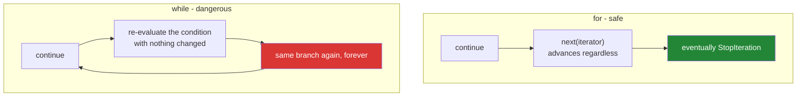

# 2.2 — `continue`, and the increment it skips

## One-line answer

`continue` abandons the rest of the current pass and starts the next one — which is harmless in a
`for` loop and can hang a `while` loop forever, because it skips every line below it including the one
that was supposed to make progress.

---

## The story

A retry loop, written by someone who had just learned `continue`.

```text
attempts = 0
while attempts < 3:
    response = call_api()
    if response.status == 429:
        time.sleep(2)
        continue
    attempts += 1
    process(response)
```

The intent is obvious and reasonable: on a rate-limit response, wait and try again without counting
it as a real attempt.

What happens is that `continue` jumps straight back to the condition, skipping `attempts += 1`. If the
service is rate-limiting — which is exactly when this branch runs — `attempts` never increases, the
condition `attempts < 3` is true forever, and the loop calls the API every two seconds until someone
kills it. Against a free tier with a daily quota, that is the whole day's budget spent in an afternoon
on a loop that logged nothing.

The same `continue`, in a `for` loop over a fixed list, would have been completely safe — the iterator
advances no matter what the body does. **The danger is not `continue`; it is `continue` in a loop
whose progress lives in the body.**

---

## The idea in plain language

### What `continue` does

`continue` ends the current pass immediately and goes back to the top of the **innermost** loop —
same scoping rule as `break` ([2.1](2.1-break-and-which-loop-it-leaves.md)).

What "the top" means differs between the two loop types, and that difference is the whole document:

| | `for` | `while` |
|---|---|---|
| `continue` goes to | `next(iterator)` — **the loop advances** | the condition — **nothing has changed** |
| Can it hang? | no, the iterator is finite | **yes**, if the skipped lines made the progress |

In a `for` loop, the iterator is external to the body ([1.1](../01-iteration/1.1-what-a-for-loop-actually-does.md)),
so skipping the body cannot stop it advancing. In a `while` loop, the only thing that changes the
condition is code in the body, and `continue` skips whatever is below it.



### What `continue` is for

The honest use is the **filter guard**: reject the rows you do not want at the top of the loop body,
so the rest of the body is unindented and deals only with rows you do want.

```text
for row in rows:
    if row.is_blank():
        continue
    if row.id in seen:
        continue
    process(row)      # one level of indentation, and every guard's reason is next to its test
```

That is the guard-clause shape from
[Day 5, 2.5](../../../day-05-operators-and-conditionals/parts/02-conditionals/2.5-the-conditional-expression.md),
applied to a loop body instead of a function body, and it buys the same three things: each rejection
sits next to its own test, the main path stays flat, and adding a fourth guard is one line rather than
a re-indent.

### The alternative that is usually better

A guard that is a pure filter — no logging, no counting, no side effect — is often clearer as a
condition on the loop itself:

```text
for row in (r for r in rows if not r.is_blank()):
```

or, on Day 9, as a comprehension's filter clause. The `continue` earns its place when the rejection
needs to *do* something — log it, count it, record it in a rejects list — because a filter expression
has nowhere to put that.

### The two failure modes

1. **The skipped increment**, above. Only in `while` loops, and always fatal.
2. **The skipped accumulator.** In any loop: `continue` placed above a `total += x` or a
   `results.append(...)` means those rows silently do not contribute. This does not hang; it produces
   a smaller, plausible answer — the failure family this whole day keeps returning to.

Both have the same shape: **`continue` skips everything below it, and "everything" includes the lines
you forgot were there.** Which is why the professional habit is to put every guard at the very top of
the body, before any state changes at all.

---

## Why Setu needs it

- **[3.2](../03-capped-retry/3.2-the-capped-retry-from-scratch.md), today,** builds the retry loop the
  story got wrong, and its `for attempt in range(cap)` shape is chosen partly because it makes this
  bug impossible.
- **[2.4](2.4-mutating-while-iterating.md), today,** is a different way of losing rows in a loop, and
  the two are often confused in a post-mortem — one skips work, the other skips items.
- **Day 8's cleaning loops** (`PY-07`) filter rows before processing them, and Day 9 replaces most of
  them with a comprehension's `if` clause
  ([Day 9, 1.2](../../../day-09-comprehensions/parts/01-list-comprehensions/1.2-the-filter-clause.md)).
- **Day 30's pandas cleaning** (`PD-`) has the same choice at frame scale: a `continue`-style row skip
  versus a boolean mask, and the mask wins for the reasons in
  [4.2](../04-loop-cost/4.2-the-loop-you-should-not-write.md).
- **Day 182's agent loop** (`AGT-01`) may skip a malformed tool response and try again — and that is
  exactly the story's shape, with a model call inside it, so the attempt counter must be outside the
  guard (Principles 5 and 11).

---

## The mechanism

The story, hanging and fixed:

```python
"""continue in a while loop skips the increment. In a for loop it cannot."""

RATE_LIMITED = 429
OK = 200

responses = [RATE_LIMITED, RATE_LIMITED, OK, OK, OK, OK, OK]


def make_service():
    """Yields the canned responses above, one per call."""
    index = 0

    def call() -> int:
        nonlocal index
        status = responses[index] if index < len(responses) else OK
        index += 1
        return status

    return call


print("the bug, with a safety cap so this document terminates:")
call = make_service()
attempts = 0
calls = 0
while attempts < 3:
    calls += 1
    if calls > 6:
        print("    (safety cap hit - the real loop would run forever)")
        break
    status = call()
    if status == RATE_LIMITED:
        print(f"    call {calls}: 429 -> continue, skipping the increment")
        continue
    attempts += 1
    print(f"    call {calls}: {status} -> attempt {attempts} counted")

print("the fix - count the attempt BEFORE the guard:")
call = make_service()
attempts = 0
while attempts < 3:
    attempts += 1
    status = call()
    if status == RATE_LIMITED:
        print(f"    attempt {attempts}: 429 -> waiting, and this DID count")
        continue
    print(f"    attempt {attempts}: {status} -> processed")
```

**Line by line:**

- `nonlocal index` — lets the inner function rebind a name in the enclosing function's scope, which is
  how the fake service remembers where it is. Scope is Day 10 (`PY-10`); a class with a counter would
  do the same job.
- `if calls > 6: break` — **a safety cap added only so this file terminates.** The real bug has no
  such line, which is exactly what makes it dangerous, and the printed message says so.
- `continue` above `attempts += 1` — the bug. Every rate-limited response returns to the condition with
  `attempts` unchanged, so the loop's bound is never approached.
- `attempts += 1` moved to the **top** of the fixed version — before any branch can skip it. The rule
  that comes out of this: **in a `while` loop, the progress statement goes above every guard**, not at
  the bottom where it reads more naturally.
- Note the semantic change in the fix: a rate-limited call now *counts* as an attempt. That is a
  deliberate decision, not a workaround — a loop that does not count failed calls has no bound at all,
  and [3.1](../03-capped-retry/3.1-why-the-cap-comes-first.md) argues it is the right one anyway.

The guard idiom, which is what `continue` is actually for:

```python
"""Reject at the top; keep the real work flat and unindented."""

rows = [
    {"id": "a", "title": " Attention Is All You Need "},
    {"id": "", "title": "no id"},
    {"id": "b", "title": ""},
    {"id": "a", "title": "duplicate id"},
    {"id": "c", "title": "A Fine Paper"},
]

seen: set[str] = set()
kept: list[dict[str, str]] = []
rejected: dict[str, int] = {"no id": 0, "no title": 0, "duplicate": 0}

for row in rows:
    if not row["id"]:
        rejected["no id"] += 1
        continue
    if not row["title"].strip():
        rejected["no title"] += 1
        continue
    if row["id"] in seen:
        rejected["duplicate"] += 1
        continue

    seen.add(row["id"])
    kept.append({"id": row["id"], "title": row["title"].strip()})

print("kept    :", kept)
print("rejected:", rejected)
print(f"{len(kept)} kept, {sum(rejected.values())} rejected, {len(rows)} total")
```

**Line by line:**

- Three guards, each at the top, each with its own counter. **Every rejection reason is next to its
  own test**, which is the readability argument, and every rejection is *counted*, which is the
  argument for `continue` over a filter expression.
- `continue` after each — so the body below is reached only by rows that passed all three. The real
  work is at one level of indentation, not three.
- `seen.add(row["id"])` — placed **after** all the guards, so a row rejected for a blank title does
  not get marked as seen and thereby cause a later legitimate row with the same id to be dropped. This
  ordering is a real decision and worth stating in a comment in production code.
- `if not row["title"].strip()` — truthiness on a string, correct here because empty and
  whitespace-only both mean "no title". `.strip()` is
  [Day 7, 2.1](../../../day-07-strings/parts/02-methods/2.1-normalising-strip-and-case.md).
- `print(f"{len(kept)} kept, {sum(rejected.values())} rejected, {len(rows)} total")` — **the
  reconciliation line.** Kept plus rejected must equal the total; if it does not, a row went missing
  and this is the line that tells you. Every filtering loop in production should end with one.

And the second failure mode — the skipped accumulator:

```python
"""continue skips everything below it, including the line you forgot was there."""

scores = [0.9, 0.0, 0.7, 0.0, 0.4]

processed = 0
total = 0.0
for score in scores:
    if score == 0.0:
        continue
    total += score
    processed += 1
print(f"skipping zeros : mean over {processed} of {len(scores)} = {total / processed:.3f}")

processed = 0
total = 0.0
for score in scores:
    processed += 1
    if score == 0.0:
        continue
    total += score
print(f"counting all   : mean over {processed} of {len(scores)} = {total / processed:.3f}")
```

**Line by line:**

- The first loop's `continue` skips **both** `total += score` and `processed += 1`, so the mean is over
  the three non-zero scores: `0.667`.
- The second counts every row and skips only the sum, giving the mean over all five: `0.400`.
- **Both are defensible and they differ by 66%.** Neither raises. The question "does a zero score count
  towards the average" is a domain question, and the position of one `continue` answers it silently.
- This is the same collapse as
  [Day 5, 2.2](../../../day-05-operators-and-conditionals/parts/02-conditionals/2.2-truthiness.md)'s
  falsy check: `score == 0.0` treats a genuine zero as a thing to skip, and whether that is right
  depends entirely on whether zero means "the model scored it zero" or "no score was computed".
- The habit that prevents the argument: **put the counter above the guards and name what you are
  averaging over** in the output. A mean with no denominator reported is not a result.

---

## When it breaks

**`continue` outside a loop:**

```text
>>> if True:
...     continue
...
  File "<stdin>", line 2
    continue
    ^^^^^^^^
SyntaxError: 'continue' not properly in loop
```

**What it means.** Same class of error as `break` outside a loop, and the same usual cause: a refactor
that removed or re-indented the enclosing loop.

**The hang, which produces no traceback at all:**

```text
>>> i = 0
>>> while i < 3:
...     if i == 0:
...         continue
...     i += 1
...
... (nothing; the process is pinned at 100% CPU)
^CTraceback (most recent call last):
  File "<stdin>", line 2, in <module>
KeyboardInterrupt
```

**What it means.** `i` is `0`, the guard fires, `continue` jumps to the condition, `i` is still `0`.
Forever. Note there is no output and no error until you interrupt — **the only evidence is CPU
usage**, which is why this is worse in a background job than in a terminal. Unlike the story's version
there is not even a `sleep`, so it spins as fast as the interpreter can go.

**The one with a `sleep`, which is quieter and more expensive:**

```text
$ python poll.py
$ # ... no output for eleven days, one API call every two seconds
```

**What it means.** With a `sleep` in the skipped-guard branch, the loop does not pin the CPU and does
not show up on a "what is using all the cores" dashboard. It just makes requests forever. Against the
free tiers this project uses, that is a spent daily quota
([Day 3, 4.1](../../../day-03-keys-and-budget/parts/04-rate-budget/4.1-rpm-rpd-tpm.md)) and, against a
paid API, a bill.

**And the accumulator that quietly under-counts:**

```text
>>> rows = ["a", "", "b", "", "c"]
>>> count = 0
>>> for row in rows:
...     if not row:
...         continue
...     count += 1
...
>>> count
3
>>> len(rows)
5
```

**What it means.** Correct, if you wanted non-empty rows. Incorrect, and invisible, if `count` was
meant to be "rows examined" for a progress report or a rate calculation. Nothing distinguishes the two
intentions in the code, which is why the reconciliation line — kept plus rejected equals total — is
worth writing every time.

---

## In production

**Guards go at the very top of the loop body, above every statement that changes state.** That single
rule prevents both failure modes: the increment cannot be skipped because it is above the guards, and
an accumulator cannot be skipped by accident because there is nothing between the guards and the real
work. In review, a `continue` that appears halfway down a body is worth a question — what is above it
that some rows will miss?

**Count what you reject, and reconcile.** A filtering loop that reports only how many rows it kept is
half a result. Production pipelines emit both numbers and often a breakdown by reason, because "we
processed 8,000 rows" and "we processed 8,000 of 10,000 rows, rejecting 1,900 for a missing id and 100
for a blank title" are entirely different operational statements — and the second one is what tells
you an upstream job broke. This is the same lesson as
[1.3](../01-iteration/1.3-enumerate-and-zip.md)'s silent truncation: the dangerous outcome is a
smaller, plausible answer.

**Prefer a filter expression when the rejection is pure, and `continue` when it is not.** `for row in
(r for r in rows if r.id):` says the filter in one place and cannot skip an increment. It stops being
the right choice the moment the rejection needs to log, count, or record — and in production it almost
always does, which is why `continue` survives in real code far more than style guides suggest. Make it
a decision: if the guard's body is only `continue`, consider the filter; if it has a counter, keep the
guard.

**What changes at scale and under concurrency.** `continue` costs nothing, but a loop that rejects 90%
of its rows late — after doing expensive work — is doing that work nine times more often than it
needs. Order guards **cheapest and most selective first**, exactly as with the operands of `and`
([Day 5, 2.4](../../../day-05-operators-and-conditionals/parts/02-conditionals/2.4-and-or-return-operands.md)):
a cheap `if not row.id: continue` before a guard that hits the network is the difference between a
minute and an hour. Under concurrency, the `while`-with-`continue` hang is materially worse: a hung
worker holds its connection, its slot in the pool, and often a lease or lock, so one stuck loop can
stall a fleet rather than one process. Every long-running loop in a worker should have a heartbeat log
so a hang is visible as silence rather than invisible as normality.

**The review comment a senior engineer leaves.** On the story's retry loop: *"`continue` skips
`attempts += 1`, so a rate-limited service pins this loop forever — and it hits the API every two
seconds while doing it. Move the increment above the guard, or restructure as `for attempt in
range(MAX)` so the bound is not something the body can skip. Also log each 429 with the attempt number;
right now a hang produces no output at all."*

**The interview question.** *"What is the difference between `break` and `continue`?"* The
straightforward answer is that `break` leaves the loop and `continue` skips to the next iteration. The
follow-up that finds real experience is *"when is `continue` dangerous?"* — in a `while` loop, because
it jumps back to the condition without running the rest of the body, so if the progress statement is
below it the loop never terminates; in a `for` loop it cannot hang, because the iterator advances
independently of the body. The best answers add the quieter second failure: `continue` also skips any
accumulator below it, which does not hang but produces a smaller answer that looks correct — and the
defence for both is putting every guard at the top of the body.

---

## Check yourself

```bash
uv run python -c "
scores = [0.9, 0.0, 0.7, 0.0, 0.4]
for label, count_first in (('skip zeros', False), ('count all', True)):
    total = n = 0
    for s in scores:
        if count_first: n += 1
        if s == 0.0: continue
        if not count_first: n += 1
        total += s
    print(f'{label:<11} mean over {n} of {len(scores)} = {total/n:.3f}')
i = 0
guard_fires = 0
while i < 3:
    guard_fires += 1
    if guard_fires > 5:
        print('a while+continue with the increment below the guard would hang here')
        break
    i += 1
print('with the increment above the guard, i reached', i)
"
```

The two means differ by two thirds. Predict both before running.

**Answer out loud, without scrolling up:**

> Say where `continue` jumps to in a `for` loop and in a `while` loop, and why only one of them can
> hang. Then state the one placement rule that prevents both of this part's failure modes.

---

**Next:** [2.3 — `for ... else`, the clause nobody knows](2.3-for-else.md)
