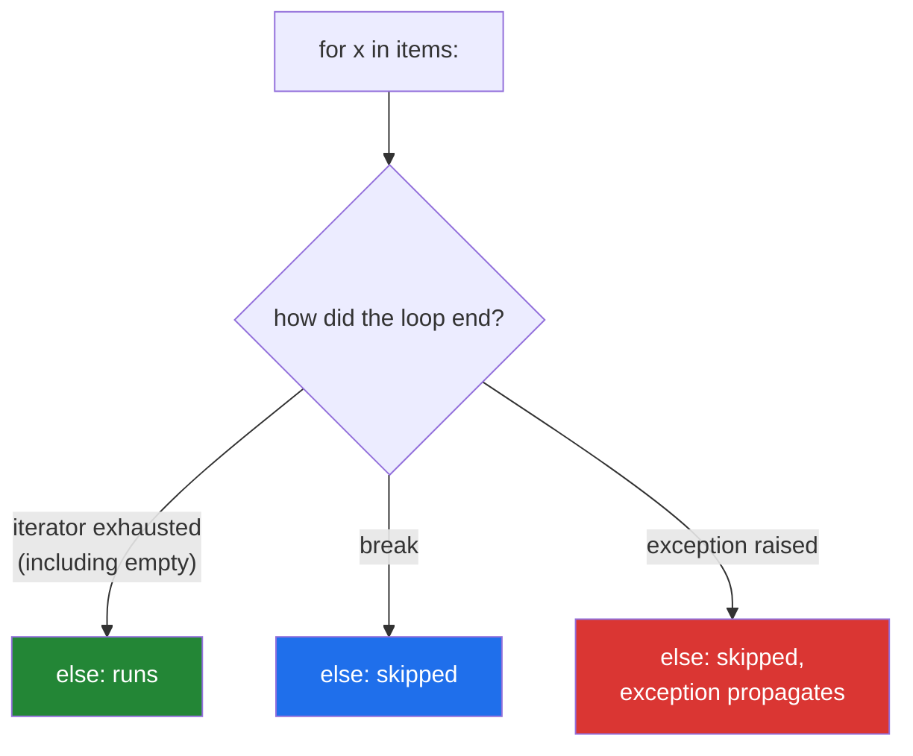

# 2.3 — `for ... else`, the clause nobody knows

## One-line answer

A loop's `else` clause runs when the loop finished **without breaking** — so it means "no `break`
happened", not "the loop was empty", and it is the built-in answer to the not-found case of a search.

---

## The story

A code review, two people, one loop.

```text
for candidate in mirrors:
    if reachable(candidate):
        chosen = candidate
        break
else:
    raise RuntimeError("no reachable mirror")
```

The reviewer says the `else` is wrong: "that will fire whenever `mirrors` is empty, but it also looks
like it fires when the loop runs — an `else` on a `for` reads as 'otherwise', and there is nothing for
it to be otherwise *to*."

The author says it is correct and has a name: the `else` runs only when the loop was **not** broken
out of, which is exactly the not-found case.

They are both right about something. The behaviour is exactly what the author says. And the reviewer's
objection is also real: the keyword `else` is genuinely misleading, because everywhere else in the
language `else` pairs with a condition, and here it pairs with a `break` that may be twenty lines
away.

The team's resolution is the one most teams reach: **use it, and put a comment on it.** The behaviour
is worth having — the alternative is a flag variable, which is the bug from
[2.1](2.1-break-and-which-loop-it-leaves.md) — and one comment costs less than a flag that can go
stale.

---

## The idea in plain language

### The rule, in one sentence

Both `for` and `while` may be followed by an `else:` block. It runs when **the loop terminated
normally** — the iterator raised `StopIteration`, or the `while` condition became false — and it does
**not** run when the loop was exited by `break`.

That is the entire specification. Everything confusing about it comes from the word.

### Why it is called `else` and why that is unfortunate

The name comes from thinking of a loop as a search: "look through these; **else**, if you did not find
it, do this". Read that way it is sensible. Read as a normal `else`, it is baffling — people
consistently guess that it runs when the loop body never executed, which is wrong.

A more honest keyword would have been `nobreak`. That was proposed and rejected; the language kept
`else`, and the practical consequence is that **the clause needs a comment in shared code**. That is
not a failure of the reader.

Two facts to nail it down:

- An **empty** iterable means the loop terminated normally, so the `else` **runs**. `for x in []: ...
  else: print("ran")` prints.
- An exception propagating out of the loop skips the `else` entirely — the loop did not terminate
  normally, it was abandoned.



### What it replaces

Without it, a search needs a **flag**:

```text
found = False
for candidate in mirrors:
    if reachable(candidate):
        chosen = candidate
        found = True
        break
if not found:
    raise RuntimeError("no reachable mirror")
```

Three extra lines, one extra name, and a variable that must be initialised before the loop and checked
after it — the exact shape that produced the leftover-value bug in
[2.1](2.1-break-and-which-loop-it-leaves.md). The `else` clause carries the same information in the
grammar, where it cannot go stale.

### Where it earns its place, and where it does not

**Earns it:**

- A search that must do something when nothing matched.
- A validation loop: "check every item; if none failed, mark the batch clean."
- A retry loop where exhausting the attempts is itself an outcome
  ([3.2](../03-capped-retry/3.2-the-capped-retry-from-scratch.md)).

**Does not:**

- A loop with no `break` at all. Then the `else` always runs and is just code after the loop, written
  more confusingly. Ruff and most reviewers flag this.
- Any search that can be expressed as `next(...)`, `any(...)`, or a dict lookup — those have a
  not-found path built into their signature, and no keyword to explain.
- A loop inside a function where the `break` could be a `return`. `return` leaves everything, and the
  code after the loop is then unambiguously the not-found path.

That last one is the most common professional answer, and it is why `for ... else` is rarer in mature
code than its usefulness suggests: **extracting the loop into a function makes the clause
unnecessary.**

### `while ... else` too

The same clause works on `while`, running when the condition became false rather than when a `break`
fired. It is even rarer, and the honest reason is that most `while` loops end via `break`
([1.4](../01-iteration/1.4-while-and-the-loop-with-no-promise.md)), so the clause would rarely run.

---

## Why Setu needs it

- **[3.2](../03-capped-retry/3.2-the-capped-retry-from-scratch.md), today,** is the canonical use:
  `for attempt in range(cap): ... break` with an `else: raise` that fires exactly when every attempt
  failed. That is the shape the plan names as recurring through the whole curriculum.
- **[2.1](2.1-break-and-which-loop-it-leaves.md), before this,** showed the flag this replaces and the
  bug the flag causes.
- **Day 8's lookups** (`PY-08`) mostly remove the need for it — a dict lookup with a default is a
  search with a built-in not-found path — and knowing both is what makes the choice deliberate.
- **Day 18's exceptions** (`PY-22`) pairs with this: `else` on a `try` block follows the same "the
  thing above completed without the exceptional path" logic, and learning both together makes both
  make sense.
- **Day 182's agent loop** (`AGT-01`) breaks on a final answer and needs an explicit "the agent used
  every step without concluding" branch. Reporting a step-capped run as a completed one is the
  failure Principle 11 exists to prevent.

---

## The mechanism

The rule, demonstrated on all four endings:

```python
"""The else clause runs when the loop was not broken out of. Four cases."""


def search(items: list[str], target: str) -> str:
    for item in items:
        if item == target:
            return f"found {item!r} - break/return path, else skipped"
    else:
        return f"{target!r} not present - else ran after {len(items)} items"


print("1.", search(["a", "b", "c"], "b"))
print("2.", search(["a", "b", "c"], "z"))
print("3.", search([], "z"), " <- an EMPTY iterable still runs the else")

print("4. an exception skips the else entirely:")
try:
    for item in ["a", "b"]:
        if item == "b":
            raise ValueError("something went wrong")
    else:
        print("    else ran")
except ValueError as exc:
    print(f"    ValueError: {exc} - and the else did not run")
```

**Line by line:**

- `return` inside the loop — `return` leaves the function, so the `else` is skipped exactly as a
  `break` would skip it. **Any exit that is not "the iterator finished" skips the clause.**
- Case 2 — the loop ran to exhaustion without finding the target, so the `else` ran. This is the
  not-found path, expressed in the grammar rather than in a flag.
- Case 3 — an empty list. The loop body never ran, the iterator was immediately exhausted, and the
  `else` **ran**. This is the case everyone guesses wrong: `else` does not mean "the loop was empty",
  and being empty does not stop it.
- Case 4 — the exception propagated, so the `else` never got a chance. Note the difference from
  `finally`, which *would* have run
  ([2.1](2.1-break-and-which-loop-it-leaves.md)'s last example): `else` is the success path, `finally`
  is the always path.

The flag it replaces, side by side:

```python
"""The same search twice: once with a flag, once with the clause."""

mirrors = ["mirror-a", "mirror-b", "mirror-c"]
UNREACHABLE = {"mirror-a", "mirror-b", "mirror-c"}


def reachable(name: str) -> bool:
    return name not in UNREACHABLE


print("with a flag:")
found = False
chosen = None
for candidate in mirrors:
    if reachable(candidate):
        chosen = candidate
        found = True
        break
if not found:
    print("    no reachable mirror (flag path)")
else:
    print(f"    chose {chosen}")

print("with for/else:")
for candidate in mirrors:
    if reachable(candidate):
        # NOTE: the else below runs only if this break never fires - the not-found path
        print(f"    chose {candidate}")
        break
else:
    print("    no reachable mirror (else path)")
```

**Line by line:**

- `found = False` and `chosen = None` — **two** names to initialise, and both must be reset if this
  loop is ever nested inside another one. That is the leftover-variable bug from
  [2.1](2.1-break-and-which-loop-it-leaves.md), waiting.
- `if not found:` — the check sits after the loop, separated from the `break` it depends on by however
  long the body is. Nothing links them except a reader's attention.
- The `# NOTE:` comment on the `else` version — **this is the professional form.** One line explaining
  a keyword that is genuinely confusing, and no state to maintain. Teams that use `for ... else` and
  teams that ban it both usually agree that an uncommented one is unkind.
- The `else` version has no `chosen` variable at all in this shape, because the success path does its
  work at the `break`. When you do need the value afterwards, assign it before breaking — and note
  that this is the one thing the flag version makes marginally clearer.

And the shape that usually removes the question:

```python
"""Extract the loop into a function and the clause becomes unnecessary."""

mirrors = ["mirror-a", "mirror-b", "mirror-c"]


def reachable(name: str) -> bool:
    return name == "mirror-b"


def first_reachable(candidates: list[str]) -> str | None:
    """The first reachable candidate, or None. The not-found path is the signature."""
    for candidate in candidates:
        if reachable(candidate):
            return candidate
    return None


chosen = first_reachable(mirrors)
if chosen is None:
    print("no reachable mirror - and the caller cannot ignore this")
else:
    print("chose", chosen)

print("or, with a generator, in one line:")
print("   ", next((m for m in mirrors if reachable(m)), None))
```

**Line by line:**

- `return candidate` — leaves the loop and the function. Everything after the loop is, by construction,
  the not-found path, so there is nothing to explain.
- `return None` — explicit, and the `| None` in the annotation makes the not-found case part of the
  contract. **A type checker will make the caller handle it**, which no `for ... else` can do.
- `if chosen is None:` — `is`, not truthiness, since a valid mirror name could in principle be an
  empty string
  ([Day 5, 2.2](../../../day-05-operators-and-conditionals/parts/02-conditionals/2.2-truthiness.md)).
- `next((...), None)` — the generator-expression form, which is the idiomatic Python answer to "first
  match or nothing" and short-circuits like a `break`. Day 11 (`PY-11`) covers it properly.
- **All three versions are correct.** The choice is about who has to understand what: the flag needs
  discipline, the `else` needs a comment, the function needs a name — and the function's cost is the
  one that also buys testability.

---

## When it breaks

**The `else` that always runs, because there is no `break`:**

```text
$ uv run ruff check --select PLW0120 -
PLW0120 `else` clause on loop without a `break` statement; remove the `else` and dedent its contents
```

**What it means.** With no `break` in the loop, the `else` can never be skipped, so it is equivalent to
code placed after the loop — and much more confusing. Usually it means somebody deleted the `break`
during a refactor and left the clause. The rule is not in this project's default `select` list;
`PL` (pylint) rules can be added if the team wants it enforced.

**The clause misread as "if the loop was empty":**

```text
>>> for x in []:
...     print("body")
... else:
...     print("else")
...
else
>>> for x in [1]:
...     print("body")
... else:
...     print("else")
...
body
else
```

**What it means.** Both cases print `else`, because neither broke. The clause has **nothing** to do
with whether the body ran. This is the single most common misunderstanding, and the demonstration is
worth typing out because reading it is not enough.

**The `else` attached to the wrong statement:**

```text
>>> for x in [1, 2]:
...     if x == 1:
...         print("one")
... else:
...     print("loop else")
...
one
loop else
```

**What it means.** The `else` is at the `for`'s indentation, so it belongs to the loop, not to the
`if`. Move it in by four spaces and it belongs to the `if` and runs on every non-matching pass —
completely different behaviour, no syntax error, and the only difference on screen is indentation
([Day 5, 2.1](../../../day-05-operators-and-conditionals/parts/02-conditionals/2.1-if-elif-else-and-the-indent.md)).
This is a strong argument for the comment.

**And the interaction with `try`, which surprises people:**

```text
>>> for i in range(3):
...     try:
...         if i == 1:
...             break
...     finally:
...         print("finally", i)
... else:
...     print("else")
...
finally 0
finally 1
```

**What it means.** `finally` ran on the way out — cleanup is not skipped by `break` — and `else` did
not, because the loop was broken. Both clauses are about "how did we leave", and they answer
differently: `finally` means always, `else` means normally.

---

## In production

**Use it for searches and retries, and comment it every time.** The behaviour is genuinely useful and
the keyword is genuinely misleading, and those two facts do not cancel out. A one-line comment —
`# else: no break fired, i.e. nothing matched` — converts a construct that costs the reader a search
of the documentation into one that costs a glance. Teams split roughly evenly on whether to allow it
at all; what nobody defends is using it silently.

**The alternative that mature codebases reach for most often is extraction.** A loop with a `break`
and a not-found case is a function waiting to be named, and once it is a function the `break` becomes a
`return`, the clause becomes the code after the loop, and the not-found case becomes part of the
signature — where a type checker can enforce that callers handle it. That last property is the
decisive one: `for ... else` communicates to a reader, a `-> Thing | None` communicates to the tooling.

**Where it is genuinely best is the capped retry**, because there the "loop exhausted" case is not a
missing value but a failure that must be raised. `for attempt in range(MAX): ... break` with `else:
raise RetriesExhausted(...)` puts the failure exactly where the exhaustion happens, with no flag and
no possibility of falling through into code that assumes success. That is
[3.2](../03-capped-retry/3.2-the-capped-retry-from-scratch.md), and it is the one place this clause is
close to unimprovable.

**What changes at scale.** Nothing, in cost — the clause is free. What changes is the consequence of
getting the not-found path wrong: at ten rows a missed not-found branch is a wrong answer you notice;
at ten million it is a silent partial result, and in a retry loop it is a truncated run reported as a
success. The operational habit that pairs with this clause is to **log distinctly on each path**, so a
dashboard can tell "found on attempt 1" from "exhausted all attempts" — two outcomes that a bare
return value collapses.

**The review comment a senior engineer leaves.** On an uncommented `for ... else`: *"This is correct —
the `else` fires when no `break` happened — but half the team will read it as 'if the list was empty'.
Add a one-line comment, or better, pull the loop into `first_reachable()` returning `str | None` so
the not-found case is in the signature and mypy makes callers deal with it."*

**The interview question.** *"What does the `else` clause on a `for` loop do?"* The answer is that it
runs when the loop completes without hitting a `break` — including when the iterable was empty — and
it is skipped by `break`, by `return`, and by an exception. The follow-up that separates people is
*"when would you actually use it?"*, and the two good answers are a search's not-found path and a
capped retry's exhausted path, with the honest caveat that most teams prefer extracting the loop into
a function so the not-found case lives in the return type instead. If they ask what it should have
been called, `nobreak` is the answer, and saying so demonstrates you understand why it confuses people
rather than merely that it does.

---

## Check yourself

```bash
uv run python -c "
for label, items, target in (('found', ['a','b'], 'a'), ('missing', ['a','b'], 'z'), ('empty', [], 'z')):
    for item in items:
        if item == target:
            print(f'{label:<8} -> break fired, else skipped')
            break
    else:
        print(f'{label:<8} -> else ran (loop finished without breaking)')
"
```

Three lines. The third is the one people predict wrongly.

**Answer out loud, without scrolling up:**

> State exactly when a loop's `else` clause runs, and name the three ways of leaving a loop that skip
> it. Then say what the clause replaces, and why most mature codebases reach for a different tool.

---

**Next:** [2.4 — Mutating the thing you are iterating](2.4-mutating-while-iterating.md)
