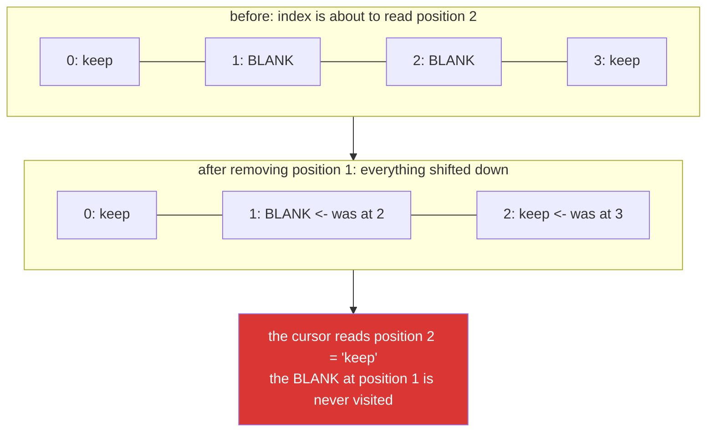

# 2.4 — Mutating the thing you are iterating

## One-line answer

An iterator holds a **position**, not a copy — so removing an item from a list while looping over it
shifts everything down and the loop skips the next one, and changing the size of a dict or set while
looping raises outright.

---

## The story

A cleanup routine removes blank rows from a batch before processing.

```text
for row in rows:
    if row["id"] == "":
        rows.remove(row)
```

On the test fixture — one blank row among five — it works perfectly. On the real batch it leaves blank
rows behind, and the number it leaves depends on how they are distributed. Two blanks next to each
other: one survives. Three in a row: two survive. Scattered singly: all removed, and the code looks
correct.

The team's first theory is that `remove` is failing. It is not. The list iterator holds an index. When
you delete position 2, everything after it shifts down by one — the item that was at position 3 is now
at position 2 — and the iterator, which is about to move to position 3, skips it entirely.

The second theory is that the fix is `rows.remove(row)` inside a `while`. It is not. The fix is to
stop mutating the thing you are walking: **build a new list, or iterate a copy.**

The dictionary version of the same mistake is kinder — it raises `RuntimeError: dictionary changed
size during iteration` and stops immediately. The list version does not, and that difference is why
list mutation bugs reach production and dict ones do not.

---

## The idea in plain language

### An iterator is a position, not a snapshot

From [1.1](../01-iteration/1.1-what-a-for-loop-actually-does.md): `for x in items:` calls
`iter(items)`, which returns a cursor holding **a reference to the list and an index**. Each `next()`
returns `items[index]` and increments the index.

That cursor does not own a copy of the data. It is looking at the live list. So if the list changes
underneath it, the cursor's index now means something different.



### The three behaviours, by container

| Container | Removing during iteration | Adding during iteration |
|---|---|---|
| `list` | **silently skips items** — no error | may loop forever or visit duplicates |
| `dict` | `RuntimeError: dictionary changed size during iteration` | same `RuntimeError` |
| `set` | `RuntimeError: Set changed size during iteration` | same `RuntimeError` |

The difference is not that lists are more forgiving; it is that a list's cursor is a simple index, so
there is nothing to detect. Dicts and sets are hash tables, and adding an item can trigger a **resize**
that moves everything to new slots — a cursor into the old layout would return garbage — so they carry
a version counter and raise the moment it changes.

**Being raised at is the better outcome.** The dict behaviour is the language protecting you; the list
behaviour is the language not being able to.

A subtlety worth knowing: changing a dict's **values** without adding or removing keys is fine, because
the size does not change. `for k in d: d[k] = clean(d[k])` is legal. It is adding and deleting keys
that raises.

### The three fixes

1. **Build a new collection.** `rows = [r for r in rows if r["id"]]` — a comprehension
   ([Day 9](../../../day-09-comprehensions/parts/01-list-comprehensions/1.2-the-filter-clause.md)), or
   a loop that appends to a fresh list. This is the default answer, and it is what almost all
   production code does.
2. **Iterate a copy.** `for row in rows[:]:` or `for key in list(d):` — the loop walks a snapshot while
   the mutation hits the original. Correct, and it costs a copy.
3. **Iterate backwards by index.** `for i in range(len(rows) - 1, -1, -1):` — removing at position `i`
   only shifts items *after* `i`, which you have already visited. Correct, and unpleasant to read; use
   it when the list is huge and a copy would not fit.

Fix 1 is preferred for a reason beyond correctness: **it does not mutate the caller's list at all**,
which is the aliasing question from
[Day 4, 1.2](../../../day-04-objects/parts/01-objects/1.2-names-are-labels.md). A function that
rebuilds and returns cannot surprise anybody.

### The related trap: rebinding the loop variable

`for row in rows: row = clean(row)` changes nothing about `rows`, because the loop variable is a label
and assigning to it moves the label
([Day 4, 1.2](../../../day-04-objects/parts/01-objects/1.2-names-are-labels.md)). This is *not* a
mutation bug — it is the opposite, a mutation that never happened — and the two are frequently
confused in a debugging session. `row["field"] = value` **does** reach the caller's data;
`row = something` does not.

---

## Why Setu needs it

- **[4.1](../04-loop-cost/4.1-the-accidental-quadratic.md), today,** notes that `list.remove(x)` is
  itself a scan, so the story's loop is quadratic as well as wrong — two independent problems in one
  line.
- **Day 8's containers** (`PY-07`, `PY-08`) is where the dict and set versions of this become routine:
  filtering a dict of counts, pruning a set of seen ids.
- **Day 9's comprehensions** (`PY-09`) is fix 1, promoted to the default way of expressing "the subset
  I want".
- **Day 26's pandas** (`PD-01`) has this at frame scale as the `SettingWithCopyWarning` and, in 3.0,
  Copy-on-Write: whether an operation returned a view onto the original or a new object is exactly the
  question this part asks about iterators.
- **Day 192's graph state** (`LG-`) is passed between nodes; a node that mutates the shared state
  while another reads it is this bug with concurrency added, and the standard defence — return a new
  value rather than editing in place — is fix 1 again.

---

## The mechanism

The story, with the skip made visible:

```python
"""Removing while iterating shifts the list under the cursor. Watch which rows are visited."""

rows = [
    {"id": "a"},
    {"id": ""},
    {"id": ""},
    {"id": "b"},
]

print("the bug - two adjacent blanks, one survives:")
visited = []
work = [dict(r) for r in rows]
for row in work:
    visited.append(row["id"])
    if row["id"] == "":
        work.remove(row)
print("    visited:", visited)
print("    left   :", [r["id"] for r in work], " <- a blank survived")

print("fix 1 - build a new list (the default answer):")
work = [dict(r) for r in rows]
cleaned = [row for row in work if row["id"] != ""]
print("    result :", [r["id"] for r in cleaned])

print("fix 2 - iterate a copy:")
work = [dict(r) for r in rows]
for row in work[:]:
    if row["id"] == "":
        work.remove(row)
print("    result :", [r["id"] for r in work])

print("fix 3 - backwards by index:")
work = [dict(r) for r in rows]
for i in range(len(work) - 1, -1, -1):
    if work[i]["id"] == "":
        del work[i]
print("    result :", [r["id"] for r in work])
```

**Line by line:**

- `work = [dict(r) for r in rows]` — a fresh copy of each dict for every experiment, so the four runs
  do not interfere. `dict(r)` is a shallow copy
  ([Day 4, 2.4](../../../day-04-objects/parts/02-containers/2.4-shallow-and-deep-copy.md)); here the
  values are strings, so shallow is enough.
- `visited.append(row["id"])` — **the diagnostic.** It records which rows the loop actually saw, and
  the output shows one of the blanks was never visited at all. Without this line the bug is invisible;
  with it, it is obvious.
- `work.remove(row)` — removes the **first item equal to** `row`, which is a scan using `==`, and for
  dicts `==` compares contents. So with two identical blank dicts, `remove` may delete the *other*
  one — a second, independent hazard that the story's team also had to work through.
- `for row in work[:]` — `work[:]` is a full slice, which builds a new list containing the same
  objects ([Day 8, 1.2](../../../day-08-containers/parts/01-sequences/1.2-slicing-and-the-copy-you-missed.md)).
  The loop walks the copy; `remove` hits the original. `list(work)` is the same thing, spelled more
  clearly.
- `range(len(work) - 1, -1, -1)` — from the last index down to zero. The stop is `-1` because the stop
  is exclusive ([1.2](../01-iteration/1.2-range-is-lazy.md)), which is the counting-down trap that part
  warns about. `del work[i]` shifts only items after `i`, and those are already behind the cursor.
- **All three fixes produce `['a', 'b']`.** The first is the one to reach for by default, because it
  does not mutate anything.

Now the version that raises, which is the kinder failure:

```python
"""Dicts and sets carry a version counter and refuse. Lists cannot."""

counts = {"a": 3, "b": 0, "c": 7, "d": 0}

for label, action in (("delete a key", "del"), ("add a key", "add")):
    live = dict(counts)
    try:
        for key in live:
            if action == "del" and live[key] == 0:
                del live[key]
            if action == "add" and key == "a":
                live["new"] = 1
    except RuntimeError as exc:
        print(f"    {label:<12} -> RuntimeError: {exc}")

print("changing VALUES is fine - the size never changes:")
live = dict(counts)
for key in live:
    live[key] = live[key] * 2
print("    ", live)

print("the fix - iterate a snapshot of the keys:")
live = dict(counts)
for key in list(live):
    if live[key] == 0:
        del live[key]
print("    ", live)

print("or build a new dict, which is better:")
print("    ", {k: v for k, v in counts.items() if v != 0})
```

**Line by line:**

- `for key in live:` — iterating a dict yields its **keys**. Both the delete and the add change the
  size, and both raise.
- `RuntimeError: dictionary changed size during iteration` — note it is a `RuntimeError`, not a
  `ValueError` or a `KeyError`. The dict detected that its version counter moved and refused to
  continue rather than return wrong data.
- `live[key] = live[key] * 2` — **no error.** The keys are unchanged, so the hash table's layout is
  stable and the cursor stays valid. Knowing this is what lets you write an in-place normalisation
  without a copy.
- `for key in list(live):` — `list(live)` materialises the keys into a separate list first, so the
  cursor walks that and the deletions hit the dict. This is fix 2 for dicts, and it is the standard
  idiom.
- `{k: v for k, v in counts.items() if v != 0}` — a dict comprehension
  ([Day 9, 2.1](../../../day-09-comprehensions/parts/02-dict-set-gen/2.1-dict-comprehensions.md)),
  which is fix 1 and the version a reviewer will prefer: it says what the result *is* rather than
  describing edits.

And the rebinding confusion, which looks like the same bug and is the opposite:

```python
"""Assigning to the loop variable changes nothing. Mutating through it changes everything."""

rows = [{"title": " padded "}, {"title": "clean"}]

for row in rows:
    row = {"title": row["title"].strip()}
print("rebinding the loop variable:", rows)

for row in rows:
    row["title"] = row["title"].strip()
print("mutating through it        :", rows)

rows = [{"title": " padded "}, {"title": "clean"}]
rows = [{"title": row["title"].strip()} for row in rows]
print("rebuilding (the preferred) :", rows)
```

**Line by line:**

- `row = {...}` — builds a new dict and moves the local label onto it. The list still holds the old
  dicts, so the output is unchanged. **This is the single most common "my loop does nothing"
  question**, and it is
  [Day 4, 1.2](../../../day-04-objects/parts/01-objects/1.2-names-are-labels.md)'s label model with a
  loop around it.
- `row["title"] = ...` — mutates the dict the list holds a reference to, so the change is visible in
  `rows`. One character of syntax apart, opposite outcomes.
- The comprehension — builds new dicts and rebinds `rows`. Nothing is mutated, so a caller holding the
  original list still sees the original data, which is usually what you want at a function boundary.
- **Three loops that look alike: one does nothing, one edits in place, one replaces.** Being able to
  say which is which on sight is the skill this part and
  [Day 4, 1.2](../../../day-04-objects/parts/01-objects/1.2-names-are-labels.md) share.

---

## When it breaks

**The dict, which raises immediately:**

```text
>>> d = {"a": 1, "b": 2}
>>> for k in d:
...     if d[k] == 1:
...         del d[k]
...
Traceback (most recent call last):
  File "<stdin>", line 1, in <module>
RuntimeError: dictionary changed size during iteration
```

**What it means.** The dict's internal version counter changed and the iterator refused to continue.
The fix is `for k in list(d):`. Note the error arrives on the **next** `next()` call, not at the `del`,
so the traceback points at the `for` line — which is correct, since that is where the invalid
operation was detected.

**The set, with slightly different wording:**

```text
>>> s = {1, 2, 3}
>>> for x in s:
...     s.discard(x)
...
Traceback (most recent call last):
  File "<stdin>", line 1, in <module>
RuntimeError: Set changed size during iteration
```

**What it means.** Same mechanism, capital `S`. Worth recognising because the messages differ enough
that searching for one will not find the other.

**The list, which does not raise:**

```text
>>> items = [1, 2, 3, 4]
>>> for x in items:
...     if x % 2 == 0:
...         items.remove(x)
...
>>> items
[1, 3]
```

**What it means.** This one happens to be right — the evens were scattered, so no skip occurred. Change
the input to `[1, 2, 4, 3]` and you get `[1, 4, 3]`: the `4` survives, because removing the `2` shifted
it into the slot the cursor had already passed. **A loop that is correct for one input ordering and
wrong for another, with no error either way**, is the worst possible property, and it is why this
pattern must simply not be written.

**And the infinite version, from adding rather than removing:**

```text
>>> items = [1]
>>> for x in items:
...     items.append(x)
...
... (memory grows until the process dies)
```

**What it means.** The cursor advances one, the list grows by one, and the end is never reached. No
error until the machine runs out of memory, at which point you get a `MemoryError` or the OS kills the
process — with no traceback pointing at this loop.

---

## In production

**The rule is absolute and worth stating as one: never add to or remove from a collection you are
iterating.** Not "be careful", not "only remove backwards" — do not do it. Build the collection you
want and rebind, which is a comprehension in almost every case. The professional benefit is not only
correctness: a function that rebuilds and returns has no side effect on its caller's data, is
trivially testable, and composes into a pipeline, while a function that edits a list in place has a
contract you can only discover by reading it
([Day 4, 1.2](../../../day-04-objects/parts/01-objects/1.2-names-are-labels.md)'s production section).

**When the collection is too large to copy, iterate backwards by index — and comment it.** This is the
one legitimate exception, and it is genuinely used: pruning a multi-gigabyte in-memory list where a
second copy would not fit. It needs a comment, because a reversed index loop with a `del` in it is
otherwise indistinguishable from a mistake. The much better answer at that scale is usually to stream:
read, filter, write, never holding the whole thing at once
([1.1](../01-iteration/1.1-what-a-for-loop-actually-does.md)).

**What changes at scale.** The story's loop has a second problem this part has only mentioned:
`list.remove(x)` scans from the start to find the item, so removing `k` items from a list of `n` is
`O(n·k)` — and if you are filtering half the rows out of a million, that is a quadratic that will not
finish ([4.1](../04-loop-cost/4.1-the-accidental-quadratic.md)). The comprehension is a single linear
pass. So fix 1 is not merely safer, it is asymptotically faster, and at a million rows the difference
is not measured in percentages.

**Under concurrency this becomes a much sharper problem.** In one thread, mutation during iteration is
your own bug. Across threads, one thread iterating while another appends produces the same `RuntimeError`
for dicts and sets — which is genuinely useful as a race detector — and for lists produces silently
skipped or duplicated items with no error at all. Neither is a substitute for synchronisation. The
patterns that work are a lock around the whole iteration, a snapshot (`list(shared)`) taken under the
lock and iterated outside it, or a purpose-built structure like `queue.Queue`. Day 19 (`PY-24`) covers
this properly, and the shape to remember is that **a snapshot is the concurrency fix and the
single-threaded fix at the same time**.

**The review comment a senior engineer leaves.** On the story's three lines: *"This skips rows —
removing shifts the list under the iterator, so an adjacent pair of blanks leaves one behind. Use
`rows = [r for r in rows if r['id']]`. That also avoids `remove()`'s linear scan, which makes the
current version quadratic, and it stops the function mutating the caller's list."*

**The interview question.** *"What happens if you remove items from a list while iterating over it?"*
The answer is that the iterator holds an index into the live list, so removing shifts subsequent items
down and the loop skips one — silently, with no error. The follow-up that shows depth is *"how is that
different for a dict?"* — dicts and sets carry a version counter and raise `RuntimeError: dictionary
changed size during iteration`, because a resize would invalidate the cursor entirely rather than
merely shift it, so the language can detect it and does. And *"how do you fix it?"* — build a new
collection with a comprehension, which is also faster because `remove()` is a linear scan; iterate a
snapshot if you must mutate the original; iterate backwards by index only when a copy would not fit in
memory.

---

## Check yourself

```bash
uv run python -c "
items = [1, 2, 4, 3]
visited = []
for x in items:
    visited.append(x)
    if x % 2 == 0:
        items.remove(x)
print('visited:', visited, '| left:', items, '<- the 4 survived')
d = {'a': 1, 'b': 2}
try:
    for k in d:
        del d[k]
except RuntimeError as exc:
    print('dict    :', exc)
print('fixed   :', [x for x in [1, 2, 4, 3] if x % 2])
"
```

Predict `visited` before running — it is shorter than the list.

**Answer out loud, without scrolling up:**

> Explain why removing from a list during iteration skips items, in terms of what the iterator holds.
> Then say why a dict raises where a list does not, and give the fix you would actually write.

---

**Next:** [3.1 — Why the cap is the first thing you write](../03-capped-retry/3.1-why-the-cap-comes-first.md)
