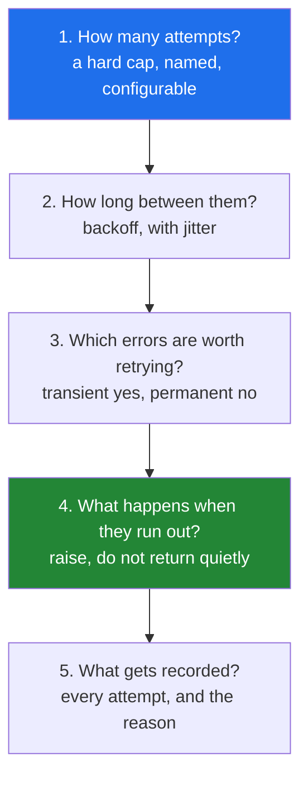

# 3.1 — Why the cap is the first thing you write

## One-line answer

A retry loop without a hard iteration cap is not a loop with a missing feature — it is an unbounded
amplifier pointed at whatever just failed, and the cap is what makes the difference between one
incident and two.

---

## The story

A search service goes down for nine minutes on a Tuesday afternoon. That is the incident.

What makes it a two-hour incident instead of a nine-minute one is what the eleven services calling it
do next. Each of them retries. None of them caps. When the search service comes back up, it is met by
eleven services' worth of accumulated retries arriving simultaneously — many multiples of normal
traffic — and it falls over again within seconds. It comes up, gets knocked down, comes up, gets
knocked down.

The pattern has a name: a **retry storm**. The retries did not cause the original failure; they
prevented the recovery. And every single one of those retry loops was written by a competent person
who intended to add a limit later.

Somewhere in the same estate, a smaller version of the same thing happens weekly and nobody notices: a
nightly job retrying a malformed request. The request will never succeed — the payload is invalid, and
no amount of retrying changes an invalid payload — so the loop runs until the job's scheduler kills it
six hours later, having made two hundred thousand identical failing requests.

**A retry is a bet that the failure is temporary.** The cap is the statement of how much you are
willing to lose on that bet, and it belongs in the first version of the code, not the fourth.

---

## The idea in plain language

### What a retry actually assumes

Retrying assumes the failure is **transient** — that the same request, sent again, might succeed
because something outside your control has changed. A dropped packet, a leader election, a cold start,
a brief rate limit.

That assumption is wrong for most failures. A malformed payload, a missing permission, a nonexistent
record, a bug in your code — none of these get better on the second attempt, and retrying them is
pure waste with a cost. Which failures are worth retrying is
[3.3](3.3-which-errors-are-retryable.md); this part is about the bound that applies even when the
assumption is right.

### The cap is not a safety net

The habit worth building is that **the cap is part of the loop's definition**, written before the
body. An uncapped loop is not "the retry logic, pending a limit"; it is a different and much more
dangerous program that happens to resemble one.

Practically, that means the loop's shape is chosen so the bound cannot be forgotten:

```text
for attempt in range(MAX_ATTEMPTS):     # the bound is in the header
    ...
```

rather than

```text
while not succeeded:                    # the bound is wherever you remember to put it
    ...
```

The `for` version cannot run forever, whatever the body does. The `while` version can, and it depends
on the body remembering to increment — the exact bug from
[2.2](../02-control-flow/2.2-continue-and-the-skipped-increment.md). **Choose the loop that makes the
failure impossible rather than the loop that requires discipline.**

### The five decisions a retry loop makes

Every retry loop answers all five of these. A loop that answers only the first is the one in the
story.



1. **How many.** A number, named as a constant or a parameter. Three is a common default and is not a
   law; a cheap idempotent read might get five, a payment gets one or zero.
2. **How long between them.** Immediately retrying a service that just failed is asking the same
   question before anything could have changed. Exponential backoff with jitter is the standard, and
   [Day 3, 4.2](../../../day-03-keys-and-budget/parts/04-rate-budget/4.2-429-and-real-backoff.md)
   built it.
3. **Which errors.** Retrying a `400` is guaranteed waste; retrying a `503` is the whole point.
   [3.3](3.3-which-errors-are-retryable.md).
4. **What happens on exhaustion.** The loop must make "all attempts failed" impossible to mistake for
   success — which means raising, not returning `None`
   ([2.3](../02-control-flow/2.3-for-else.md)'s `else: raise`).
5. **What gets recorded.** An attempt count and a final reason, so an operator can tell "succeeded on
   the third try" from "gave up" from "never ran".

### The multiplication nobody plans for

Retries **compose**, and this is the part that turns a small mistake into an outage. If service A
retries three times into service B, which retries three times into service C, one user request becomes
nine calls to C. Add a fourth layer and it is twenty-seven. Each layer was written by someone who
thought three was modest.

The professional defences are to **retry at one layer only** — usually the outermost, closest to the
user, where you know whether the whole operation is worth repeating — and to give the whole operation
a **deadline** that all layers share, so a request that has already spent its time budget stops
retrying regardless of how many attempts remain.

### The cap is also a budget statement

In this project, every retry is a request against a free tier with a daily quota (Principle 5). An
uncapped retry loop does not merely waste time; it spends the day's budget in minutes and takes every
other lab on that key down with it. On Day 182 the retried call contains a model invocation, so an
uncapped agent loop is Principle 11's blast radius with a bill attached — which is why
**Day 223 devotes a whole day to runaway caps** in multi-agent systems.

---

## Why Setu needs it

- **[3.2](3.2-the-capped-retry-from-scratch.md), next,** builds the loop this part specifies, and the
  cap is the first line of it.
- **Day 3's rate budget** already made the case for backoff
  ([Day 3, 4.2](../../../day-03-keys-and-budget/parts/04-rate-budget/4.2-429-and-real-backoff.md));
  this part supplies the bound that backoff alone does not give you — backing off forever is still
  forever.
- **Day 95's gradient descent** (`ML-06`) caps epochs for the same reason: a diverging learning rate
  produces a loop that never converges, and `max_epochs` is what turns a hang into a bad result you
  can see.
- **Day 182's agent loop** (`AGT-01`) is a retry loop with a model in it, and the plan names your
  Day-6 loop as the thing it reuses. **Day 223's runaway caps** (`MAS-10`) is this document at
  multi-agent scale, where the multiplication is across agents rather than services.
- **Day 196's context trimming** (`LG-12`) loops until a token budget is met, and needs a floor for
  the case where the budget cannot be met at all.

---

## The mechanism

The amplification, computed rather than asserted:

```python
"""Retries multiply through layers. Three at each of four layers is eighty-one calls."""

ATTEMPTS_PER_LAYER = 3

print(f"{'layers':>7} {'calls to the innermost service':>32}")
for layers in range(1, 6):
    calls = ATTEMPTS_PER_LAYER**layers
    print(f"{layers:>7} {calls:>32,}")

print()
print("one user request, four layers, a 9-minute outage:")
requests_per_second = 200
outage_seconds = 9 * 60
queued = requests_per_second * outage_seconds
print(f"    normal load           : {requests_per_second:,} req/s")
print(f"    queued during outage  : {queued:,} requests")
print(f"    amplified by 4 layers : {queued * ATTEMPTS_PER_LAYER**4:,} calls on recovery")
```

**Line by line:**

- `ATTEMPTS_PER_LAYER ** layers` — the multiplication is exponential in the **number of layers**, not
  in the attempts. Three attempts feels modest; three attempts at four layers is eighty-one, and
  nobody wrote eighty-one anywhere.
- `queued = requests_per_second * outage_seconds` — the backlog. This is what a service meets when it
  comes back, and it is why "it recovered and then immediately fell over again" is the classic shape.
- The final number is the story. **No individual decision in that chain was unreasonable**, which is
  precisely why the failure recurs: it is emergent, and only visible if someone does this arithmetic
  before the incident.
- `f"{calls:>32,}"` — the `,` is a thousands separator in the format spec
  ([Day 7, 3.2](../../../day-07-strings/parts/03-formatting/3.2-the-format-spec.md)). Large numbers
  are unreadable without it, and this table's whole point is the size.

Uncapped versus capped, with the cost of each made visible:

```python
"""The same failing call, two loops. One of them stops."""

CALL_BUDGET = 25  # a stand-in for a daily free-tier quota (Principle 5)
MAX_ATTEMPTS = 3


class PermanentlyBroken:
    """Always fails, exactly like a malformed request does."""

    def __init__(self) -> None:
        self.calls = 0

    def __call__(self) -> str:
        self.calls += 1
        if self.calls > CALL_BUDGET:
            raise RuntimeError(f"quota exhausted after {self.calls - 1} calls")
        raise ConnectionError("service unavailable")


print("uncapped - a while loop that trusts the world to fix itself:")
service = PermanentlyBroken()
try:
    while True:
        try:
            service()
            break
        except ConnectionError:
            continue
except RuntimeError as exc:
    print(f"    stopped only because {exc}")

print("capped - the bound is in the loop header:")
service = PermanentlyBroken()
for attempt in range(MAX_ATTEMPTS):
    try:
        service()
        break
    except ConnectionError as exc:
        print(f"    attempt {attempt + 1}/{MAX_ATTEMPTS} failed: {exc}")
else:
    print(f"    gave up after {MAX_ATTEMPTS} attempts, having spent {service.calls} calls")
```

**Line by line:**

- `class PermanentlyBroken` with a `__call__` — an object that behaves like a function
  ([Day 15, `PY-18`](../../../day-04-objects/parts/01-objects/1.1-identity-type-value.md) covers
  dunder methods; `__call__` makes an instance callable). It counts calls, which is the whole point:
  **the cost of an uncapped loop is measured in calls, not in seconds.**
- `if self.calls > CALL_BUDGET: raise RuntimeError` — a stand-in for the quota running out. In this
  document it exists so the uncapped loop terminates at all; in production nothing plays that role
  until the scheduler kills the job or the bill arrives.
- `while True: ... except ConnectionError: continue` — the uncapped version, and note how *reasonable*
  it looks. It even handles the error. It has decisions 3 and 5 partly answered and decisions 1, 2 and
  4 not at all.
- `for attempt in range(MAX_ATTEMPTS)` — **the bound is the loop.** There is no counter to forget to
  increment, no condition to get wrong, and no body-dependent progress
  ([2.2](../02-control-flow/2.2-continue-and-the-skipped-increment.md)'s hang cannot happen here).
- `attempt + 1` in the message — humans count from one, `range` counts from zero. Reporting
  `attempt 0/3` is a small thing that makes a log line read wrong.
- `else:` on the `for` — runs only because no `break` fired, i.e. every attempt failed
  ([2.3](../02-control-flow/2.3-for-else.md)). **This is decision 4**, and the next part turns the
  `print` into a `raise`.
- The capped version spends **three** calls. The uncapped version spends the entire budget on a request
  that was never going to succeed.

And the deadline, which is the bound that composes:

```python
"""An attempt cap bounds one layer. A deadline bounds the whole operation."""

import time

MAX_ATTEMPTS = 5
DEADLINE_SECONDS = 0.30
BASE_DELAY = 0.08

started = time.monotonic()
outcome = "unset"

for attempt in range(MAX_ATTEMPTS):
    elapsed = time.monotonic() - started
    if elapsed >= DEADLINE_SECONDS:
        outcome = f"deadline hit after {attempt} attempts ({elapsed:.2f}s)"
        break
    print(f"    attempt {attempt + 1}/{MAX_ATTEMPTS} at t={elapsed:.2f}s")
    time.sleep(BASE_DELAY * 2**attempt)
else:
    outcome = f"attempt cap hit ({MAX_ATTEMPTS} attempts, {time.monotonic() - started:.2f}s)"

print("   ", outcome)
```

**Line by line:**

- Two bounds, both present. **The attempt cap bounds how many times you ask; the deadline bounds how
  long the caller waits.** Backoff makes them diverge quickly: five attempts with doubling delays can
  take far longer than a user or an upstream timeout will tolerate.
- `time.monotonic()` — a clock that cannot go backwards, for the reason in
  [1.4](../01-iteration/1.4-while-and-the-loop-with-no-promise.md).
- The deadline check is **at the top of the body**, before the work, so it is checked before spending
  an attempt rather than after — the guard-placement rule from
  [2.2](../02-control-flow/2.2-continue-and-the-skipped-increment.md).
- `BASE_DELAY * 2**attempt` — exponential backoff: `0.08`, `0.16`, `0.32`, … Real code adds jitter
  ([Day 3, 4.2](../../../day-03-keys-and-budget/parts/04-rate-budget/4.2-429-and-real-backoff.md)),
  which is what stops many clients retrying in lockstep after a shared outage.
- The `for ... else` sets a **different** outcome from the `break` path, so the message says which
  bound stopped it. An operator reading "deadline hit after 2 attempts" knows something entirely
  different from "attempt cap hit" — the first says the service is slow, the second says it is
  failing.
- `outcome = "unset"` before the loop — so a reader can see there is no path where it stays unset, and
  a linter can see the name is always bound
  ([Day 5, 2.5](../../../day-05-operators-and-conditionals/parts/02-conditionals/2.5-the-conditional-expression.md)'s
  `UnboundLocalError`).

---

## When it breaks

**The uncapped loop, which produces no traceback at all:**

```text
$ uv run python nightly_sync.py
$ # ... six hours later, killed by the scheduler
$ echo $?
137
```

**What it means.** Exit code 137 is 128 + 9, i.e. killed by `SIGKILL` — the scheduler's timeout, or the
kernel's out-of-memory killer. **There is no Python traceback**, because the process did not fail; it
was executed. That is the signature of an unbounded loop in production: no error, no log line, just a
job that was alive and then was not.

**The retry that made the outage worse:**

```text
2026-08-25T14:02:11 WARN  search timeout, retrying (1/∞)
2026-08-25T14:02:11 WARN  search timeout, retrying (2/∞)
2026-08-25T14:02:11 WARN  search timeout, retrying (3/∞)
... 41,000 identical lines ...
2026-08-25T14:11:03 INFO  search recovered
2026-08-25T14:11:04 ERROR search timeout
```

**What it means.** Note the timestamps on the first three lines: **the same second.** No backoff at
all, so the client is retrying as fast as the network allows. And the last two lines are the retry
storm: the service recovered for one second and was immediately knocked over by the backlog. Both
problems are in this log — no cap and no delay — and either one alone would have been survivable.

**The quota, spent:**

```text
>>> client.generate(prompt)
google.api_core.exceptions.ResourceExhausted: 429 Quota exceeded for
quota metric 'Generate requests' and limit 'GenerateRequestsPerDayPerProject'
```

**What it means.** The daily free-tier limit, gone — and gone for **every** lab using that key, not
just the one that spent it (Principle 5;
[Day 3, 4.1](../../../day-03-keys-and-budget/parts/04-rate-budget/4.1-rpm-rpd-tpm.md)). A capped loop
would have spent three requests on a failure. An uncapped one spends whatever is left. This is the
version of the story that costs a day of this curriculum rather than a day of an operations team.

**And the cap that was there and did not fire:**

```text
>>> attempts = 0
>>> while attempts != 3:
...     attempts += 2
...
... forever
```

**What it means.** `attempts` goes `2, 4, 6, …` and is never exactly `3`. **Use `>=` for every cap
check, never `==`** — the equality version works right up until something advances the counter by more
than one, which happens the first time somebody adds a "this failure counts double" rule. Same reason
`for attempt in range(cap)` is preferable: there is no comparison to get wrong.

---

## In production

**Retry at one layer, and let the others fail fast.** The single most effective structural fix for
retry amplification is a policy decision, not a code one: pick the layer that retries — usually the
one closest to the user, or the one that owns the idempotency guarantee — and make every layer below
it return the failure immediately. Teams that do this find their tail latency drops as well as their
failure amplification, because a request that is going to fail fails once instead of eighty-one times.
When retries genuinely are needed at two layers, the inner cap must be much smaller than the outer, and
the product of them is the number to put in the design document.

**Give the whole operation a deadline and pass it down.** A cap bounds attempts; a deadline bounds the
user's wait, and only a deadline composes across layers. The mature shape is a deadline created at the
edge and propagated as a parameter (or in gRPC, a header), so every layer knows how much time is left
and a layer with 50ms remaining does not start a retry that will take 400ms. Without it, each layer's
timeouts multiply exactly as attempts do.

**Retries need a circuit breaker at scale.** When a dependency has failed a hundred times in a row, the
hundred-and-first attempt is not a bet on transience — it is a load test. The standard structure is a
breaker that opens after a threshold of failures, fails fast for a cooling period, and then lets a
single probe through. It is what stops the retry storm at the source, and it is a different mechanism
from the cap: the cap protects one operation, the breaker protects the dependency. Both, not either.

**Jitter is not optional in a fleet.** Exponential backoff makes each client polite; without a random
component it makes all of them polite *in unison*, so they retry at the same instants and the
recovering service sees spikes rather than a ramp. Full jitter — sleeping a random duration between
zero and the computed backoff — is the standard recommendation, and the difference on a chart is
dramatic.

**What changes at scale.** At one client, an uncapped retry is a hung process. At a thousand clients
it is a distributed denial of service that you built, aimed at your own infrastructure, and it
recovers only when someone deploys. The failure mode has a name and a large body of engineering
literature precisely because it is emergent: no single component is misconfigured. This is why "the
cap comes first" is a discipline rather than a preference — it is the only part of the system that a
single author can guarantee.

**The review comment a senior engineer leaves.** On a `while not ok:` retry: *"Unbounded. Make it
`for attempt in range(MAX_ATTEMPTS)` so the bound is structural rather than remembered, add backoff
with jitter — those three log lines have identical timestamps — and raise on exhaustion rather than
returning `None`, so the caller cannot mistake 'gave up' for 'nothing found'. Also: we already retry
in the gateway, so this layer should probably not retry at all."*

**The interview question.** *"Your service calls another one that sometimes fails. How do you handle
it?"* Saying "retry" is the start, not the answer. The complete answer names the five decisions: a hard
attempt cap, backoff with jitter between attempts, a classification of which errors are worth retrying
at all, an explicit failure path when attempts are exhausted, and logging that distinguishes the
outcomes. The follow-up that separates senior candidates is *"what could go wrong with retries?"* —
and the expected answer is amplification: retries multiply through layers, so three attempts at four
layers is eighty-one calls, and a recovering service meets the accumulated backlog and falls over
again. Mentioning a shared deadline, retrying at one layer only, and a circuit breaker is what turns a
good answer into an experienced one.

---

## Check yourself

```bash
uv run python -c "
for layers in range(1, 6):
    print(f'{layers} layers x 3 attempts = {3**layers:>4} calls to the innermost service')
calls = 0
for attempt in range(3):
    calls += 1
print('capped loop spent', calls, 'calls on a permanently failing request')
a = 0
steps = 0
while a != 3 and steps < 6:
    a += 2
    steps += 1
print('a != 3 cap with a step of 2: a =', a, 'after', steps, 'passes - never equal to 3')
"
```

The last block is why every cap check uses `>=`.

**Answer out loud, without scrolling up:**

> Name the five decisions every retry loop makes, and say which one the story's loops were missing.
> Then explain retry amplification in one sentence, with the number for three attempts at four layers.

---

**Next:** [3.2 — The capped retry, built from scratch](3.2-the-capped-retry-from-scratch.md)
