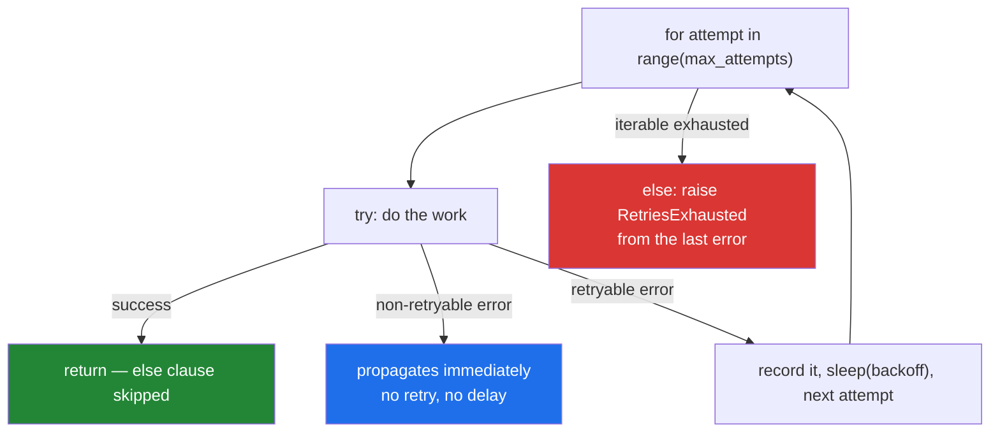

# 3.2 — The capped retry, built from scratch

## One-line answer

`for attempt in range(max_attempts): ... break` with an `else: raise` is the whole loop — the bound is
structural, success leaves via `break`, exhaustion falls into the `else`, and there is no flag and no
way for the caller to mistake giving up for succeeding.

---

## The story

Anybody who climbs, sails or works at height learns to tie one knot by hand, properly, even though
there is a clip in the shop that does the same job faster and better. The reason is not nostalgia.
It is that on the day the knot matters, you will not be reading the instructions on the packet.

The capped retry is this curriculum's knot. It is the same twelve lines every time.

On Day 3 they wrapped a "you are going too fast" response from a free model endpoint. On Day 95 they
will wrap a training round that has not settled yet. On Day 155 they will wrap a call that turns text
into numbers. On Day 182 they will wrap an agent's think-act-observe cycle, and on Day 223 there will
be a hundred of them running at once, and the limit will be the only thing standing between a demo
and a bill.

The plan says so directly: the capped loop is one of the shapes it names as recurring across the
whole 240 days, from `PY-05` here, to `ML-06`'s gradient descent, to `AGT-01`'s agent loop, to
`MAS-10`'s runaway caps.

So it is worth building once, by hand, understanding every line — rather than reaching straight for a
library whose defaults you have never read. That is Principle 2: from scratch before library. The
library version is better and you should use it in real work. You should also be able to write this
one from memory, because the day you need to reason about a retry storm, you will not be reading
somebody else's source code.

---

## The idea in plain language

### The shape

```text
for attempt in range(max_attempts):          # 1. the bound, structural
    try:
        return do_the_work()                 # 2. success leaves immediately
    except RetryableError as exc:            # 3. only the errors worth retrying
        last_error = exc
        log(attempt, exc)                    # 5. every attempt is recorded
        sleep(backoff(attempt))              # 2b. wait, with jitter
else:                                        # 4. no break/return fired: all failed
    raise RetriesExhausted(...) from last_error
```

Five properties fall out of the structure rather than out of discipline:

1. **It cannot run forever.** The bound is the iterable
   ([3.1](3.1-why-the-cap-comes-first.md)). There is no counter to forget
   ([2.2](../02-control-flow/2.2-continue-and-the-skipped-increment.md)).
2. **Success exits at once.** A `return` (or `break`) on the happy path means no "did it work?" flag.
3. **Non-retryable errors are not caught**, so they propagate immediately instead of being retried
   three times for nothing ([3.3](3.3-which-errors-are-retryable.md)).
4. **Exhaustion raises.** The `for ... else` fires exactly when no `break` or `return` happened
   ([2.3](../02-control-flow/2.3-for-else.md)), and raising there makes "gave up" impossible to
   mistake for "succeeded with nothing".
5. **Every attempt is observable**, so a log tells you whether the third try worked or the third try
   was the last.



### Why `for` and not `while`

Both can be correct. The `for` version is chosen because it makes the two most common retry bugs
**structurally impossible** rather than merely avoidable:

- The unbounded loop, because the bound is the iterable.
- The skipped increment, because there is no increment.

The `while` version needs a counter, an increment placed above every guard, and a `>=` comparison —
three things to get right, each of which has its own failure mode in this day. The `for` version needs
none of them. Where you genuinely need `while` is when the bound is time rather than count, and the
professional answer there is **both**: a `for` over attempts with a deadline check inside.

### `raise ... from`

When the loop gives up, it raises its own exception — `RetriesExhausted`, or whatever your codebase
calls it — so the caller sees a failure that names the retry policy. The `from last_error` clause
attaches the underlying cause, and the traceback then prints:

```text
ConnectionError: connection reset

The above exception was the direct cause of the following exception:
...
RetriesExhausted: 3 attempts failed
```

**Both facts survive**: what your loop did, and what actually went wrong. Raising a bare
`RetriesExhausted` without `from` throws away the second, and re-raising the original throws away the
first. Day 18 (`PY-22`) covers exception chaining properly; this is the one idiom worth having early,
because a retry loop is exactly where you lose the cause.

### What the function returns

A retry wrapper returns **what the work returned**, or raises. It does not return `None` on failure,
and it does not return a `(success, value)` tuple unless your codebase has committed to that style
everywhere. Returning `None` pushes the ambiguity onto the caller, who will forget to check, which is
the falsy-default problem from
[Day 5, 3.1](../../../day-05-operators-and-conditionals/parts/03-the-or-trap/3.1-the-or-default-and-falsy-zero.md)
arriving via a different route.

---

## Why Setu needs it

- **`src/setu/retry.py` is today's build brief.** This part is its specification; the `TODO(me)`
  stubs in the hub are yours to fill.
- **Day 3's model calls** already need it
  ([Day 3, 4.2](../../../day-03-keys-and-budget/parts/04-rate-budget/4.2-429-and-real-backoff.md)),
  and from Day 155 every embedding and generation call in this curriculum goes through a loop of this
  shape.
- **Day 14's decorators** (`PY-16`) turns this function into `@retry`, which is the plan's named
  example for that ID. Writing the loop first is what makes the decorator legible rather than magic.
- **Day 95's gradient descent** (`ML-06`) is the same skeleton with `max_epochs` instead of
  `max_attempts` and a convergence check instead of an exception.
- **Day 182's agent loop** (`AGT-01`) is this loop with a model call inside, and **Day 223** (`MAS-10`)
  is what happens when a hundred of them run at once.

---

## The mechanism

The loop, complete, with every decision visible:

```python
"""The capped retry. Twelve lines, five decisions, no flags."""

from __future__ import annotations

import random
import time
from collections.abc import Callable
from typing import TypeVar

T = TypeVar("T")

DEFAULT_ATTEMPTS = 3
DEFAULT_BASE_DELAY = 0.5
DEFAULT_MAX_DELAY = 8.0


class RetriesExhausted(RuntimeError):
    """Every attempt failed. Carries the count so a log line can say how many."""

    def __init__(self, attempts: int) -> None:
        super().__init__(f"{attempts} attempts failed")
        self.attempts = attempts


def backoff_delay(attempt: int, base: float, cap: float) -> float:
    """Full jitter: a random wait in [0, min(cap, base * 2**attempt)].

    The randomness is what stops many clients retrying in lockstep after a
    shared outage (part 3.1). `attempt` is zero-based, so the first wait is
    drawn from [0, base].
    """
    ceiling = min(cap, base * 2**attempt)
    return random.uniform(0, ceiling)


def call_with_retry(
    work: Callable[[], T],
    *,
    max_attempts: int = DEFAULT_ATTEMPTS,
    retry_on: tuple[type[BaseException], ...] = (ConnectionError, TimeoutError),
    base_delay: float = DEFAULT_BASE_DELAY,
    max_delay: float = DEFAULT_MAX_DELAY,
    sleep: Callable[[float], None] = time.sleep,
) -> T:
    """Call `work`, retrying only `retry_on` errors, at most `max_attempts` times."""
    if max_attempts < 1:
        raise ValueError(f"max_attempts must be at least 1, got {max_attempts}")

    last_error: BaseException | None = None
    for attempt in range(max_attempts):
        try:
            return work()
        except retry_on as exc:
            last_error = exc
            is_last = attempt == max_attempts - 1
            print(f"    attempt {attempt + 1}/{max_attempts} failed: {exc!r}")
            if not is_last:
                sleep(backoff_delay(attempt, base_delay, max_delay))
    raise RetriesExhausted(max_attempts) from last_error
```

**Line by line:**

- `T = TypeVar("T")` and `-> T` — the wrapper returns whatever `work` returns, unchanged. Without the
  type variable the annotation would have to be `object` and every caller would lose its type. Day 19
  (`PY-23`) covers generics; the shape is here because a retry helper that erases types is annoying to
  use.
- `*` in the signature — everything after it is **keyword-only**. `call_with_retry(fn, 5)` is then a
  `TypeError` rather than a silently-misread positional, which matters when the parameters are three
  numbers that could be confused for each other.
- `retry_on: tuple[type[BaseException], ...]` — the classification, as a parameter with a conservative
  default. `except retry_on` accepts a tuple, so this is a plain feature rather than a trick.
  [3.3](3.3-which-errors-are-retryable.md) is about choosing what goes in it.
- `sleep: Callable[[float], None] = time.sleep` — **injecting the clock.** A test can pass a recording
  stub and assert the delays without actually waiting, which is the difference between a fast test
  suite and one nobody runs
  ([Day 2, 3.2](../../../day-02-quality-gate/parts/03-pytest/3.2-fixtures-and-tmp-path.md)). This
  single parameter is what makes the whole function testable.
- `if max_attempts < 1: raise ValueError` — a guard clause
  ([Day 5, 2.5](../../../day-05-operators-and-conditionals/parts/02-conditionals/2.5-the-conditional-expression.md)).
  `max_attempts=0` would silently never call `work` at all and go straight to the `else` — a plausible
  configuration mistake that must not be silent.
- `return work()` inside the `try` — success leaves the function immediately, so nothing below runs
  and no flag is needed.
- `except retry_on as exc` — **only** these. Anything else propagates untouched, which is decision 3:
  a malformed request fails once, not three times.
- `is_last = attempt == max_attempts - 1` — do not sleep after the final failure. Sleeping there adds
  latency to a call that is already doomed, and it is the most common small flaw in hand-written retry
  loops.
- `raise RetriesExhausted(max_attempts) from last_error` — decision 4. Note this version uses a plain
  `raise` after the loop rather than a `for ... else`; both work, and the version below uses the
  `else` so you can compare.
- No `finally`, no cleanup — because `work` owns its own resources. A retry wrapper that opens things
  is doing two jobs.

Now the `for ... else` variant, and the test that proves the cap:

```python
"""Same loop with an explicit `else`, plus a fake clock so the test is instant."""

from __future__ import annotations

import time
from collections.abc import Callable


class RetriesExhausted(RuntimeError):
    pass


def call_with_retry(
    work: Callable[[], str],
    *,
    max_attempts: int = 3,
    sleep: Callable[[float], None] = time.sleep,
) -> str:
    last_error: BaseException | None = None
    for attempt in range(max_attempts):
        try:
            return work()
        except ConnectionError as exc:
            last_error = exc
            if attempt < max_attempts - 1:
                sleep(0.5 * 2**attempt)
    else:
        # else: no `return` fired, so every attempt failed (part 2.3)
        raise RetriesExhausted(f"{max_attempts} attempts failed") from last_error
    raise AssertionError("unreachable")


class FlakyService:
    """Fails `failures` times, then succeeds. The standard retry test double."""

    def __init__(self, failures: int) -> None:
        self.failures = failures
        self.calls = 0

    def __call__(self) -> str:
        self.calls += 1
        if self.calls <= self.failures:
            raise ConnectionError(f"reset (call {self.calls})")
        return f"ok on call {self.calls}"


delays: list[float] = []
for failures in (0, 2, 5):
    delays.clear()
    service = FlakyService(failures)
    try:
        result = call_with_retry(service, sleep=delays.append)
        print(f"fails={failures}: {result:<16} calls={service.calls} delays={delays}")
    except RetriesExhausted as exc:
        print(f"fails={failures}: RAISED {exc}  calls={service.calls} delays={delays}")
```

**Line by line:**

- `else:` on the `for` — reached only when no `return` fired. The comment is there because the keyword
  is genuinely confusing ([2.3](../02-control-flow/2.3-for-else.md)), and an uncommented one is unkind
  to reviewers.
- `raise AssertionError("unreachable")` after the `else` — every path above either returns or raises,
  so this line cannot execute. It exists to satisfy a type checker that cannot prove the function
  always returns, and to fail loudly rather than return `None` if someone edits the logic later. Some
  teams prefer restructuring to avoid it; both are defensible, and silently returning `None` is not.
- `class FlakyService` — **the standard test double for a retry.** Parameterised by how many times it
  fails, so one class covers the succeeds-first-time, succeeds-eventually and never-succeeds cases.
- `sleep=delays.append` — the clock injection paying off. `list.append` takes one argument and returns
  `None`, which is exactly the `Callable[[float], None]` signature, so the delays are **recorded
  instead of waited**. The test runs instantly and can assert the backoff schedule.
- `fails=0` → one call, no delays. `fails=2` → three calls, two delays. `fails=5` → three calls, two
  delays, and a raise. **Read the `calls` column**: the loop never makes more than `max_attempts`
  calls, which is the property the whole part exists for.
- `delays` for `fails=2` is `[0.5, 1.0]` — doubling, and no delay after the final attempt. That last
  detail is visible only because the delays were recorded.

And the deadline variant, for when time matters more than count:

```python
"""Both bounds at once: an attempt cap and a wall-clock deadline."""

import time


def call_with_deadline(work, *, max_attempts: int = 5, deadline_s: float = 0.25) -> str:
    started = time.monotonic()
    for attempt in range(max_attempts):
        remaining = deadline_s - (time.monotonic() - started)
        if remaining <= 0:
            raise TimeoutError(f"deadline of {deadline_s}s exhausted after {attempt} attempts")
        try:
            return work()
        except ConnectionError:
            time.sleep(min(0.05 * 2**attempt, max(remaining, 0)))
    raise RuntimeError(f"{max_attempts} attempts failed within the deadline")


def always_fails() -> str:
    raise ConnectionError("nope")


try:
    call_with_deadline(always_fails)
except (TimeoutError, RuntimeError) as exc:
    print(f"{type(exc).__name__}: {exc}")
```

**Line by line:**

- `remaining = deadline_s - elapsed` — computed **before** each attempt, so an attempt that cannot
  finish in time is not started. Checking after the work would let one slow call blow the deadline by
  an unbounded amount.
- `if remaining <= 0: raise TimeoutError` — the deadline path raises a **different** exception from
  the attempt-cap path, so the caller and the log can tell "the dependency is slow" from "the
  dependency is failing". Collapsing them into one error throws away the most useful diagnostic the
  loop has.
- `min(0.05 * 2**attempt, max(remaining, 0))` — never sleep past the deadline. A backoff that
  overshoots turns a 250ms budget into a 400ms wait, which is exactly the failure that makes deadlines
  not compose across layers ([3.1](3.1-why-the-cap-comes-first.md)).
- Both bounds are present and both are reported. In production this function would also take the
  deadline **from its caller** rather than defaulting it, so the budget is shared across layers rather
  than reset at each one.

---

## When it breaks

**The retry that swallowed a permanent failure:**

```text
    attempt 1/3 failed: ValueError('missing required field: doi')
    attempt 2/3 failed: ValueError('missing required field: doi')
    attempt 3/3 failed: ValueError('missing required field: doi')
Traceback (most recent call last):
  ...
RetriesExhausted: 3 attempts failed
```

**What it means.** `ValueError` was in `retry_on`, and it should not have been — the payload is
malformed and will be malformed on every attempt. Three times the latency, three times the quota, and
the eventual error names the retry policy rather than the actual problem. This is
[3.3](3.3-which-errors-are-retryable.md)'s entire subject, and the tell is **identical error messages
across attempts**.

**The lost cause:**

```text
>>> raise RetriesExhausted(3)
Traceback (most recent call last):
  File "<stdin>", line 1, in <module>
RetriesExhausted: 3 attempts failed
```

**What it means.** No `from last_error`, so the traceback says the retry gave up and nothing about
*why*. An operator now knows the loop's policy and not the failure. With `from`, the traceback carries
both, separated by `The above exception was the direct cause of the following exception`. This is a
one-word fix that repays itself the first time someone is on call.

**The off-by-one that sleeps for nothing:**

```text
    attempt 3/3 failed: ConnectionError('reset')
    ... 2.0s of sleeping ...
RetriesExhausted: 3 attempts failed
```

**What it means.** The loop slept after its final failure. Two seconds of pure latency added to a call
that had already given up — and in a request path, two seconds the user waited for nothing. The
`if attempt < max_attempts - 1:` guard is what removes it, and its absence is invisible in every test
that does not record the delays.

**And the cap that was configured away:**

```text
>>> call_with_retry(work, max_attempts=0)
Traceback (most recent call last):
  ...
ValueError: max_attempts must be at least 1, got 0
```

**What it means.** Without the guard, `range(0)` is empty, the body never runs, `work` is never called,
and the function raises `RetriesExhausted` having done nothing — which reads in a log as "the service
failed three times" when the service was never contacted. **A configuration value of zero producing a
plausible-looking failure** is the falsy-zero problem from
[Day 5, 3.1](../../../day-05-operators-and-conditionals/parts/03-the-or-trap/3.1-the-or-default-and-falsy-zero.md)
in a new costume, and the guard is what turns it into a clear error at the call site.

---

## In production

**Use a library, and be able to write this.** `tenacity`, `backoff`, and the retry support built into
most HTTP clients are better than a hand-rolled loop: they have jitter, deadline support, circuit
breakers, and years of edge cases. The reason to build it once by hand (Principle 2) is that the
library's defaults are decisions you are accountable for — how many attempts, which exceptions, whether
it sleeps after the last failure, whether it chains the cause — and you cannot review a default you
have never had to choose. When you do adopt a library, read its retry predicate and its jitter policy
before its API.

**Idempotency decides whether you may retry at all.** A retried `GET` is free; a retried `POST` that
creates a charge is a second charge, which is
[3.1](3.1-why-the-cap-comes-first.md)'s payments story. The professional answer is an **idempotency
key** — a client-generated identifier the server uses to deduplicate — which turns an unsafe operation
into a safe one and is why every serious payments API has the concept. Without one, the correct number
of retries for a write is often zero, and that is a decision to make explicitly rather than inherit
from a default.

**Instrument the outcome, not just the failure.** The three states — succeeded first time, succeeded
after `n` retries, exhausted — are different operational signals, and a system that logs only the last
one cannot tell you that a dependency has quietly degraded to "works on the second try". Emit the
attempt count on success as well as failure. It is the metric that catches a problem before it becomes
an incident.

**What changes at scale and under concurrency.** A retry wrapper holds its caller's thread or task for
the whole backoff, so under load a fleet of workers sleeping in retries is a fleet not serving traffic
— the pool exhausts, and the symptom looks like a slow application rather than a failing dependency.
In async code, `await asyncio.sleep(...)` yields the event loop and the problem largely disappears,
which is one of the strongest arguments for async in a service that talks to flaky dependencies (Day
19, `PY-24`). At fleet scale the additions this loop lacks are a circuit breaker and a shared
deadline; both are structural, not parameters.

**The review comment a senior engineer leaves.** On a hand-rolled retry: *"Three things. Do not sleep
after the final attempt — that is pure added latency on a failed call. Chain the cause with
`raise ... from last_error` or the traceback tells us your policy and not the failure. And inject the
sleep function so the tests can assert the backoff schedule without actually waiting; right now this
test suite takes 14 seconds and nobody will run it."*

**The interview question.** *"Write a retry with backoff."* The code is the easy part; the interview is
in what you say while writing it. Bound it with `for attempt in range(max_attempts)` so the cap is
structural rather than a counter you might not increment. Return on success so there is no flag. Catch
only the exceptions worth retrying, so a `400` fails once. Do not sleep after the last attempt. Raise
on exhaustion, chained from the last error, so the caller cannot mistake giving up for an empty
result. Add jitter, so a fleet does not retry in lockstep. And inject the clock, so the tests are
instant — which is usually the detail that tells an interviewer you have maintained one of these
rather than written one.

---

## Check yourself

```bash
uv run python -c "
class Flaky:
    def __init__(self, f): self.f, self.calls = f, 0
    def __call__(self):
        self.calls += 1
        if self.calls <= self.f: raise ConnectionError(f'reset {self.calls}')
        return f'ok on {self.calls}'
def retry(work, max_attempts=3, sleep=lambda d: None, delays=None):
    last = None
    for attempt in range(max_attempts):
        try:
            return work()
        except ConnectionError as exc:
            last = exc
            if attempt < max_attempts - 1:
                d = 0.5 * 2**attempt
                delays.append(d); sleep(d)
    raise RuntimeError(f'{max_attempts} attempts failed') from last
for f in (0, 2, 5):
    ds = []
    s = Flaky(f)
    try:
        print(f'fails={f}:', retry(s, delays=ds), '| calls', s.calls, '| delays', ds)
    except RuntimeError as exc:
        print(f'fails={f}: RAISED {exc} | calls', s.calls, '| delays', ds)
"
```

Check the `calls` column never exceeds 3, and that `delays` has one fewer entry than there were
failures.

**Answer out loud, without scrolling up:**

> Recite the loop's shape and name the five decisions each line implements. Then say why the sleep is
> skipped on the last attempt, and what `raise ... from` preserves that a bare `raise` does not.

---

**Next:** [3.3 — Which errors are worth retrying](3.3-which-errors-are-retryable.md)
