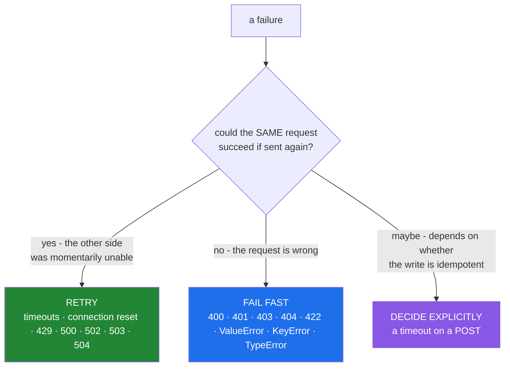

# 3.3 — Which errors are worth retrying

## One-line answer

Retry only failures that could plausibly succeed on the same request without anything changing on your
side — transient network and server-side errors — and let everything else fail on the first attempt,
because retrying a permanent failure is three times the cost, three times the latency, and an error
message that names your retry policy instead of the problem.

---

## The story

The door will not open, so you push harder. You push again. You push a third time, then go and tell
somebody: "that door failed three times."

If the door was stuck, pushing again was exactly right and it may well have opened. If you were at
the wrong door, no amount of pushing would ever have worked — and worse, what you told the other
person is useless. "It failed three times" describes what *you* did. "It says staff only" would have
solved it in a second.

Here is the same conversation, as a support ticket. It says the record import is "slow and then
fails".

The log shows a request taking nine seconds and then reporting
`RetriesExhausted: 3 attempts failed`. Nine seconds for a call that normally answers in a fraction of
a second. The engineer assumes the other system is unwell and opens a ticket with the vendor.

The vendor replies with their own request log. All three attempts arrived. All three were answered in
under a tenth of a second, with `400 Bad Request: unknown field "authors_list"`. The client had a
typo in a field name. It was never going to work, and the retry loop asked three times anyway,
waiting half a second and then a second in between, and then reported an error that mentioned neither
`400` nor `authors_list`.

Two costs, and the second is far bigger. The wasted time and the wasted quota are annoying. **The
lost error message cost two days** — a field name and a status code were replaced by "3 attempts
failed", which describes the client's behaviour rather than the problem.

A retry is a bet that the failure is temporary. Placing that bet on a typo does not make the typo
temporary. It just hides it.

---

## The idea in plain language

### The question to ask

For any failure, ask: **if I send exactly this request again, unchanged, could it succeed?**

- **Yes** — something outside your control might be different next time. Retry.
- **No** — the request itself is wrong, or the operation is not safe to repeat. Do not.

That single question decides almost every case. What makes it hard in practice is that the answer is
carried by the error's *type* or *status code*, and code that catches broadly throws that information
away before it can be used.

### The classification



**Retry these.** Connection errors, read timeouts, DNS failures, `429 Too Many Requests`, and the `5xx`
family — `500`, `502`, `503`, `504`. All of them say "the other end could not deal with this right
now", which is a statement about a moment, not about your request. A `429` in particular is not merely
retryable, it is *asking* to be retried, usually with a `Retry-After` header saying when
([Day 3, 4.2](../../../day-03-keys-and-budget/parts/04-rate-budget/4.2-429-and-real-backoff.md)).

**Never retry these.** `400 Bad Request`, `401 Unauthorized`, `403 Forbidden`, `404 Not Found`,
`422 Unprocessable Entity`, and, in Python, `ValueError`, `TypeError`, `KeyError`,
`AttributeError` — anything that means "the thing you sent, or the code that sent it, is wrong". None
of these change on their own. A `401` deserves special mention: it feels transient because a token can
expire, and the correct response is to **refresh the credential and then retry once**, which is a
different operation from retrying the same request with the same dead token.

**Decide explicitly for these.** A timeout on a write. You do not know whether the server processed it
before the connection dropped — so a retry might duplicate the effect. This is the payments case from
[3.1](3.1-why-the-cap-comes-first.md), and the answer is an **idempotency key** rather than a
guess.

### Idempotency is what makes a retry safe

An operation is **idempotent** when doing it twice has the same effect as doing it once. Reading a
record is idempotent. Setting a field to a value is idempotent. Appending to a list is not. Charging
a card is not.

By convention `GET`, `PUT` and `DELETE` are idempotent and `POST` is not, which is why default retry
policies in HTTP libraries retry the first three and not the last. Where you must retry a `POST`, the
mechanism is a client-generated **idempotency key** sent with the request; the server records it and
returns the original result for a repeat, so the retry is safe by construction rather than by hope.

### The two ways to get it wrong, and which is worse

**Too broad** — `except Exception:` in the retry clause. Every permanent failure is retried, latency
triples, quota is wasted, and the real error is replaced by your policy's error. This is the story.

**Too narrow** — catching only `ConnectionError` when the client also raises `TimeoutError` and its
own `ApiError`. A retryable failure escapes to the caller as a hard error, so a transient blip becomes
a user-visible failure.

Too broad is worse, because it hides information. Too narrow fails loudly and gets fixed.

### The one thing you must never retry

An exception you did not expect. `except Exception` inside a retry loop will happily retry a
`KeyboardInterrupt`-adjacent situation, a bug in your own callback, a `MemoryError`. Catching
`BaseException` is worse still — it catches `KeyboardInterrupt` and `SystemExit`, so a retry loop can
make a program un-interruptible. **Name the exceptions you retry.** That is the whole discipline.

---

## Why Setu needs it

- **[3.2](3.2-the-capped-retry-from-scratch.md)'s `retry_on` parameter** is this document, as a tuple.
  Choosing what goes in it is the decision this part exists to make.
- **Day 3's four model doors** each raise different exception types for the same condition
  ([Day 3, 2.1](../../../day-03-keys-and-budget/parts/02-llm-doors/2.1-gemini-the-workhorse.md)
  onwards), so a retry policy written for one provider silently fails to catch the other's `429`.
- **Day 18's exception hierarchy** (`PY-22`) is where you learn to define your own `TransientError`
  base class so a single `except` covers a family — the structural answer to this whole part.
- **Day 155's embedding calls** and **Day 182's agent loop** (`AGT-01`) both retry model calls, where
  a wrongly-classified error costs quota (Principle 5) and, in an agent, an extra tool invocation
  (Principle 11).
- **Day 76 onwards** (`ML-`), a retry around a data load that keeps failing on a schema error will
  produce a training run on stale data rather than a clean failure — which is a silent correctness
  bug, not just a slow one.

---

## The mechanism

The cost of getting it wrong, measured:

```python
"""Retrying a permanent failure costs latency, calls, and the error message."""

from __future__ import annotations


class ApiError(Exception):
    def __init__(self, status: int, detail: str) -> None:
        super().__init__(f"{status} {detail}")
        self.status = status
        self.detail = detail


RETRYABLE_STATUS = frozenset({408, 429, 500, 502, 503, 504})


def is_retryable(exc: BaseException) -> bool:
    """One place where the policy lives, so it can be tested on its own."""
    if isinstance(exc, ApiError):
        return exc.status in RETRYABLE_STATUS
    return isinstance(exc, (ConnectionError, TimeoutError))


FAILURES = {
    "typo in a field": ApiError(400, 'unknown field "authors_list"'),
    "expired token": ApiError(401, "invalid credentials"),
    "missing record": ApiError(404, "no such paper"),
    "rate limited": ApiError(429, "quota exceeded, retry in 2s"),
    "server hiccup": ApiError(503, "service unavailable"),
    "network reset": ConnectionError("connection reset by peer"),
    "bug in our code": KeyError("doi"),
}

print(f"{'failure':<20} {'exception':<34} retry?")
for label, exc in FAILURES.items():
    print(f"{label:<20} {type(exc).__name__ + ': ' + str(exc):<34} {is_retryable(exc)}")
```

**Line by line:**

- `class ApiError` carrying a `status` — **the status code must survive into the exception**, or the
  policy has nothing to decide on. A client that raises a bare `Exception("request failed")` makes
  correct classification impossible, which is a real defect in some libraries and a reason to wrap
  them.
- `RETRYABLE_STATUS = frozenset({...})` — a set for O(1) membership
  ([Day 5, 3.2](../../../day-05-operators-and-conditionals/parts/03-the-or-trap/3.2-in-is-an-operator.md)),
  frozen because it is a constant and immutability makes that visible
  ([Day 4, 2.5](../../../day-04-objects/parts/02-containers/2.5-hashability.md)).
- `408` is in the set — request timeout, which is the server saying it waited too long for your
  request, and is worth one retry.
- `def is_retryable(exc)` — **the policy as a function.** This is the single most valuable structural
  move in the whole part: the decision is now independently testable, greppable, and changeable in one
  place, rather than spread across a dozen `except` clauses that will drift.
- `isinstance(exc, (ConnectionError, TimeoutError))` — a tuple of types, checked in one call.
  `ConnectionError` is itself a base class covering `ConnectionResetError`,
  `ConnectionRefusedError` and others, so this is broader than it looks — and deliberately so.
- `401` returns `False`. It is not "never actionable", it is "not actionable by repeating"; the
  correct handling is a token refresh followed by one retry, and conflating that with a plain retry
  produces a loop that sends the same dead token three times.
- `KeyError("doi")` returns `False` — a bug in your own code, and retrying it means the traceback
  arrives three attempts later with your retry wrapper on top of it.

The two failures, side by side:

```python
"""Too broad hides the error. Too narrow escalates a blip. Named types do neither."""

import time


class ApiError(Exception):
    def __init__(self, status: int, detail: str) -> None:
        super().__init__(f"{status} {detail}")
        self.status = status


def failing_call() -> str:
    raise ApiError(400, 'unknown field "authors_list"')


print("TOO BROAD - except Exception:")
started = time.monotonic()
calls = 0
last = None
for attempt in range(3):
    try:
        failing_call()
        break
    except Exception as exc:  # noqa: BLE001 - demonstrating the anti-pattern
        calls += 1
        last = exc
        if attempt < 2:
            time.sleep(0.05 * 2**attempt)
else:
    print(f"    RetriesExhausted after {calls} calls, {time.monotonic() - started:.2f}s")
    print(f"    the caller is told: 'retries exhausted'. The real error was: {last}")

print("CLASSIFIED - only retryable statuses:")
started = time.monotonic()
calls = 0
try:
    for attempt in range(3):
        try:
            failing_call()
            break
        except ApiError as exc:
            calls += 1
            if exc.status not in {408, 429, 500, 502, 503, 504}:
                raise
            if attempt < 2:
                time.sleep(0.05 * 2**attempt)
except ApiError as exc:
    print(f"    failed after {calls} call, {time.monotonic() - started:.2f}s")
    print(f"    the caller is told: {exc}")
```

**Line by line:**

- `except Exception as exc:` with a `# noqa: BLE001` — ruff's blind-except rule, silenced here because
  the anti-pattern is the point. In real code a `noqa` must carry a reason
  ([Day 2, 1.3](../../../day-02-quality-gate/parts/01-linting/1.3-fix-and-noqa-as-debt.md)), and "we
  are demonstrating this is wrong" is the only acceptable one for `BLE001`.
- The broad version makes **three** calls and takes ~150ms, and the message the caller receives says
  nothing about `400` or `authors_list`. Print `last` and the information is there — but only because
  this example kept it. Many real loops do not.
- `if exc.status not in {...}: raise` — **a bare `raise` re-raises the current exception with its
  original traceback intact.** Not `raise exc`, which resets the traceback to this line and loses
  where it came from. This one-word difference matters every time you look at a production stack
  trace.
- The classified version makes **one** call and the caller receives `400 unknown field
  "authors_list"` — the actual problem, immediately. That is the whole argument.
- Structurally this shows the two ways to express the policy: catch narrowly, or catch broadly and
  re-raise what you will not retry. The second is what you need when a library raises one exception
  type for everything, which is common.

And the idempotency decision, which no exception type can make for you:

```python
"""A timeout on a write is ambiguous. The key is what resolves it."""

import uuid

processed: dict[str, str] = {}


def charge(amount: int, idempotency_key: str | None = None) -> str:
    """Records the charge. With a key, a repeat returns the original result."""
    if idempotency_key is not None and idempotency_key in processed:
        return f"{processed[idempotency_key]} (deduplicated)"
    receipt = f"receipt-{len(processed) + 1} for {amount}"
    if idempotency_key is not None:
        processed[idempotency_key] = receipt
    return receipt


print("without a key - a retry charges twice:")
processed.clear()
print("   ", charge(500))
print("   ", charge(500), " <- the retry")
print("    total charges recorded:", len(processed) or "untracked, both went through")

print("with a key - a retry is safe:")
processed.clear()
key = str(uuid.uuid4())
print("   ", charge(500, idempotency_key=key))
print("   ", charge(500, idempotency_key=key), " <- the retry")
print("    total charges recorded:", len(processed))
```

**Line by line:**

- `charge(500)` twice — two receipts, two charges. **This is what a retry on a timed-out `POST` does**
  when the first request actually succeeded and only the response was lost.
- `idempotency_key: str | None = None` — optional, because the caller decides. Defaulting it to `None`
  rather than generating one inside is deliberate: a key generated per call would be different on the
  retry and would deduplicate nothing.
- `str(uuid.uuid4())` — a random unique identifier, generated **once by the caller** and reused across
  every attempt of the same logical operation. Generating it inside the retry loop's body instead of
  outside it is the classic mistake, and it silently disables the whole mechanism.
- `if idempotency_key in processed: return ...` — the server side. Real implementations store the key
  with the response for a window of hours and return the recorded result verbatim.
- **The retry is unchanged in both cases.** What changed is whether the operation is safe to repeat,
  which is a property of the *operation*, not of the loop — and that is why "is this retryable" has
  two halves: is the failure transient, and is the action repeatable.

---

## When it breaks

**The broad catch, hiding the answer:**

```text
Traceback (most recent call last):
  File "import_papers.py", line 88, in <module>
    papers = call_with_retry(fetch_page)
  File "setu/retry.py", line 41, in call_with_retry
    raise RetriesExhausted(max_attempts) from last_error
setu.retry.RetriesExhausted: 3 attempts failed
```

**What it means.** The traceback describes the retry wrapper and nothing else — no status code, no
field name, no hint. Note that `from last_error` **would** have printed the cause below this; its
absence here is why the story took two days. The lesson has two halves: classify so you do not retry
this at all, and chain so that when you do give up the cause survives
([3.2](3.2-the-capped-retry-from-scratch.md)).

**The uninterruptible loop:**

```text
$ uv run python sync.py
^C^C^C
... nothing happens
```

**What it means.** Someone wrote `except BaseException:` (or `except:` with no type, which is the
same thing). `KeyboardInterrupt` inherits from `BaseException`, not `Exception`, so it is caught and
swallowed, and each `Ctrl-C` is absorbed as another retryable failure. Ruff's `E722` flags a bare
`except:` and it is in this project's `select` list
([Day 2, 1.2](../../../day-02-quality-gate/parts/01-linting/1.2-choosing-rule-families.md)).

**Too narrow, so a blip escapes:**

```text
Traceback (most recent call last):
  ...
requests.exceptions.ReadTimeout: HTTPSConnectionPool(host='api.example.com', port=443):
Read timed out. (read timeout=5)
```

**What it means.** The retry policy caught `ConnectionError` and this library's timeout is a different
class that does not inherit from it. A perfectly retryable failure became a user-visible error. **The
fix is to read the library's exception hierarchy**, not to widen the catch to `Exception` — and this
is exactly why Day 18 (`PY-22`) argues for wrapping third-party exceptions in your own
`TransientError`/`PermanentError` pair at the boundary.

**And the duplicate charge, which produces no error at all:**

```text
2026-08-25T09:14:02 WARN  charge timed out after 30s, retrying (1/3)
2026-08-25T09:14:35 INFO  charge succeeded: receipt-8842
--- reconciliation, next morning ---
receipt-8841  500  09:14:02
receipt-8842  500  09:14:35
```

**What it means.** The first request **did** go through; only the response was lost. The retry created
a second charge. No exception was raised at any point, both receipts are valid, and the only evidence
is a reconciliation report. This is the failure that makes idempotency a design requirement rather
than a nicety, and it is why the correct default number of retries for a non-idempotent write is
zero.

---

## In production

**Put the policy in one function and test it.** `is_retryable(exc) -> bool` with a table of cases is
worth more than any amount of careful `except` clauses, because it is one place to change, one place
to review, and one place to test — including the cases nobody thinks about until an incident, such as
`401` and the ambiguous write timeout. A parametrised test over a list of `(exception, expected)`
pairs is the shape, and it makes the policy a reviewable artefact rather than folklore.

**Translate third-party exceptions at the boundary.** Every client library invents its own hierarchy,
and a retry policy written against one provider's classes is silently wrong for another's — which in
this project means a `429` from one model door being retried and the identical condition from another
door escaping ([Day 3, 2.2](../../../day-03-keys-and-budget/parts/02-llm-doors/2.2-groq-and-the-token-wall.md)).
The mature structure is a thin adapter per provider that catches their exceptions and raises your
`TransientError` or `PermanentError`, so the retry loop knows exactly two types and never changes when
a provider does.

**Honour `Retry-After` when the server sends it.** A `429` or `503` frequently carries a header saying
when to come back, and a client that ignores it and applies its own backoff is guessing when it has
been told. Real clients read the header, use it as the delay, and fall back to computed backoff only
when it is absent. This matters especially on the free tiers this project uses, where the header is
often the difference between recovering in two seconds and being throttled for the rest of the hour
([Day 3, 4.1](../../../day-03-keys-and-budget/parts/04-rate-budget/4.1-rpm-rpd-tpm.md)).

**What changes at scale.** A misclassification that costs 200ms per request is invisible at ten
requests and is three minutes of added latency at a thousand. Worse, retrying permanent failures at
scale looks *exactly* like a dependency problem on a dashboard — elevated error rate, elevated
latency, elevated request volume to the dependency — so teams spend the first hour of an incident
investigating a healthy service. The diagnostic that cuts through it is the one from the story:
**identical error messages across attempts means the failure is permanent.** Logging the error on
every attempt, not just the last, is what makes that visible.

**The review comment a senior engineer leaves.** On `except Exception` inside a retry: *"This retries
`400`s and our own `KeyError`s. Add an `is_retryable()` predicate — 408/429/5xx and connection errors
only — and re-raise everything else with a bare `raise` so the traceback survives. Right now a typo in
a field name costs three requests and reports 'retries exhausted', which tells the on-call engineer
nothing."*

**The interview question.** *"Which errors would you retry?"* The answer is the classification:
transient failures where the same request could succeed unchanged — timeouts, connection resets,
`429`, and `5xx` — and not client errors like `400`, `401`, `403`, `404`, or bugs in your own code,
because those are identical on every attempt. The follow-up that finds real experience is *"what about
a timeout on a POST?"* — and the answer is that it is genuinely ambiguous, because the write may have
succeeded before the response was lost, so retrying can duplicate the effect; the resolution is an
idempotency key generated once by the caller and reused across attempts, not a guess. Strong
candidates add that the policy belongs in one testable predicate, that a bare `except:` catches
`KeyboardInterrupt` and makes the program un-interruptible, and that `Retry-After` should be honoured
when the server sends it.

---

## Check yourself

```bash
uv run python -c "
class ApiError(Exception):
    def __init__(self, status, detail):
        super().__init__(f'{status} {detail}'); self.status = status
RETRYABLE = {408, 429, 500, 502, 503, 504}
def is_retryable(exc):
    if isinstance(exc, ApiError): return exc.status in RETRYABLE
    return isinstance(exc, (ConnectionError, TimeoutError))
cases = [ApiError(400, 'bad field'), ApiError(401, 'bad token'), ApiError(404, 'missing'),
         ApiError(429, 'slow down'), ApiError(503, 'unavailable'),
         ConnectionError('reset'), TimeoutError('read timeout'), KeyError('doi')]
for exc in cases:
    print(f'{type(exc).__name__ + \": \" + str(exc):<34} retry? {is_retryable(exc)}')
"
```

Predict all eight. The `401` is the one worth arguing with yourself about.

**Answer out loud, without scrolling up:**

> State the one question that decides whether a failure is retryable, and give three status codes on
> each side. Then explain why a timeout on a `POST` is neither, and what makes it safe.

---

**Next:** [4.1 — The accidental quadratic](../04-loop-cost/4.1-the-accidental-quadratic.md)
