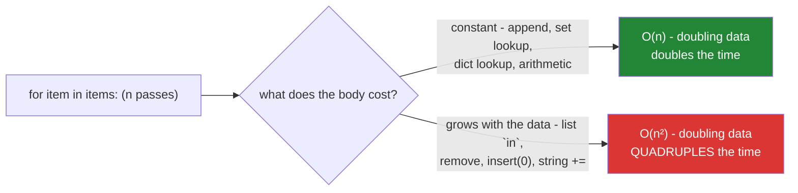

# 4.1 — The accidental quadratic

## One-line answer

A loop is quadratic whenever its body does work proportional to the data — a membership test on a
list, a `.remove()`, a string `+=`, a `list.insert(0, ...)`, a nested scan — and the only way to see
it is to time the same code at `n`, `2n` and `4n` and watch the **ratio**, not the seconds.

---

## The story

A shoebox of photographs, and a Sunday afternoon set aside to pull out the duplicates.

The method is obvious. Take the next photo, compare it against everything already in the "keep" pile,
and if it is new, add it to the pile. Twenty photos and you are done before the kettle boils.

Two thousand photos is not a hundred times harder. It is much worse than that, and the reason is that
the keep pile grows as you go. The first photo is compared against nothing. The last one is compared
against nineteen hundred and ninety-nine. Doubling the shoebox roughly **quadruples** the afternoon,
which is why the job that took twenty minutes last year is somehow eating the whole weekend now.

Nobody changed the method. The pile got bigger, and the method was quietly the kind that gets worse
faster than the pile grows.

A nightly report has been doing exactly this. Six months ago it took forty seconds. Three months ago,
four minutes. Last week it did not finish before morning, and the team started it by hand at nine and
watched it run until lunch.

Nobody changed the code. The data grew about fourfold over six months, which is ordinary growth, and
the report went from forty seconds to four hours. That is a factor of three hundred and sixty for a
factor of four.

The profiler points at one line — a membership check against a list that keeps growing inside the
loop:

```text
if paper_id not in processed:
    processed.append(paper_id)
```

Two lines, both obviously correct, and neither of them mentions a second loop. But `not in` on a list
walks the whole list, so by halfway through, every check is walking hundreds of thousands of entries.

The fix is `processed = set()`. The report goes back to under a minute, and it stays there when the
data grows again — because what changed is the *shape* of the growth, not just how fast one step is.

**The difference between forty seconds and four hours was one word**, and nothing in the source code
looked like a nested loop.

---

## The idea in plain language

### What "quadratic" means, without the mathematics

Say a job takes time `T` on `n` rows. Double the data and:

- **Linear** — `O(n)` — takes about `2T`. Twice the work for twice the data. This is what people
  intuitively expect.
- **Quadratic** — `O(n²)` — takes about `4T`. Four times the work for twice the data.
- **Log-linear** — `O(n log n)`, which is what sorting costs — takes a bit more than `2T`. In practice
  it behaves like linear.

The numbers do not look alarming at small `n`. At a thousand rows, quadratic is a million operations —
imperceptible. At a million rows it is a trillion, which is hours. **The behaviour is invisible in
development and fatal in production**, and that is the entire practical problem: you cannot detect it
by looking at one timing.

| rows | linear | quadratic |
|---|---|---|
| 1,000 | 1,000 | 1,000,000 |
| 10,000 | 10,000 | 100,000,000 |
| 100,000 | 100,000 | 10,000,000,000 |
| 1,000,000 | 1,000,000 | 1,000,000,000,000 |

### The tell: work inside the loop that grows with the data

A loop over `n` items is linear **only if its body costs the same regardless of `n`.** The accidental
quadratic happens when the body contains an operation that is itself proportional to the size of
something — usually the very collection you are building.

The operations that do this, and the ones that do not:

| Inside a loop over `n` items | Cost per pass | Total |
|---|---|---|
| `x in a_list` | O(len) | **O(n²)** |
| `x in a_set` / `x in a_dict` | O(1) | O(n) |
| `a_list.remove(x)` / `.index(x)` | O(len) | **O(n²)** |
| `a_list.insert(0, x)` / `.pop(0)` | O(len) — shifts everything | **O(n²)** |
| `a_list.append(x)` / `.pop()` | O(1) amortised | O(n) |
| `s += "text"` (a string) | O(len) — builds a new string | **O(n²)** |
| `parts.append(text)` then `"".join(parts)` | O(1) per pass | O(n) |
| `sorted(...)` inside the loop | O(m log m) | **O(n·m log m)** |
| `list(some_dict)` inside the loop | O(m) | **O(n·m)** |
| another loop over the data | O(m) | **O(n·m)** |

The last row is the honest nested loop, and it is the *least* dangerous of these because you can see
it. Every other row looks like a single operation.



### How to detect it: the ratio, not the seconds

A single timing tells you nothing about the growth. Time the same code at three sizes — `n`, `2n`,
`4n` — and look at how the time changes:

- Time roughly **doubles** each step → linear. Fine.
- Time roughly **quadruples** each step → quadratic. Fix it before this reaches production.

This works on any machine, is unaffected by how fast your laptop is, and takes about a minute. **It is
the single most useful performance habit in this curriculum**, and it is why the tests in this day's
build brief assert a ratio rather than a duration — a duration assertion is flaky and machine-dependent,
a ratio assertion is neither.

### The fixes are all the same shape

Every fix moves the growing work out of the loop:

- List membership → **build a set once, before the loop.**
- `insert(0, x)` / `pop(0)` → **`collections.deque`**, which is O(1) at both ends.
- String `+=` → **collect into a list, `"".join` once at the end.**
- A nested scan → **build a dict keyed on the join field**, and look up.
- `sorted()` per pass → **sort once outside.**

The common principle: *build the index once, use it many times.* That is also what a database does
when you add an index, and the reason the fix feels familiar later.

---

## Why Setu needs it

- **[Day 8, 3.1](../../../day-08-containers/parts/03-dedup/3.1-ten-thousand-ids-timed.md)** is this
  measurement performed properly on ten thousand arXiv IDs — the plan's named example for `PY-08`.
- **[Day 5, 3.2](../../../day-05-operators-and-conditionals/parts/03-the-or-trap/3.2-in-is-an-operator.md)**
  explained *why* list membership is a scan; this part is about recognising the shape it creates.
- **[Day 4, 1.4](../../../day-04-objects/parts/01-objects/1.4-strings-are-immutable.md)** established
  that `+=` on a string builds a new string; inside a loop that is the same quadratic.
- **Day 20's NumPy** (`NP-01`) and **Day 26's pandas** (`PD-`) exist largely to remove Python-level
  loops entirely — [4.2](4.2-the-loop-you-should-not-write.md) is the bridge.
- **Day 164's chunking** (`RAG-04`) and **Day 155's embedding** dedupe chunks before spending model
  calls. A quadratic dedup there wastes time; a *missing* dedup wastes quota (Principle 5).
- **Day 44's SQL** (`SQL-`) makes the same point with indexes: a join without one is a nested scan,
  and `EXPLAIN` is the database's version of the ratio test.

---

## The mechanism

The ratio test, which is the technique to keep:

```python
"""Time at three sizes and read the RATIO. Seconds are machine-specific; ratios are not."""

import time


def dedup_with_list(items: list[str]) -> int:
    seen: list[str] = []
    for item in items:
        if item not in seen:
            seen.append(item)
    return len(seen)


def dedup_with_set(items: list[str]) -> int:
    seen: set[str] = set()
    for item in items:
        if item not in seen:
            seen.add(item)
    return len(seen)


def timed(fn, data) -> float:
    started = time.perf_counter()
    fn(data)
    return time.perf_counter() - started


print(f"{'n':>7} {'list (s)':>10} {'x':>6} {'set (s)':>10} {'x':>6}")
previous_list = previous_set = None
for n in (2_000, 4_000, 8_000, 16_000):
    data = [f"id-{i}" for i in range(n)]
    t_list, t_set = timed(dedup_with_list, data), timed(dedup_with_set, data)
    ratio_list = f"{t_list / previous_list:.1f}" if previous_list else "-"
    ratio_set = f"{t_set / previous_set:.1f}" if previous_set else "-"
    print(f"{n:>7} {t_list:>10.4f} {ratio_list:>6} {t_set:>10.4f} {ratio_set:>6}")
    previous_list, previous_set = t_list, t_set
```

**Line by line:**

- The two functions differ in **one word** — `list` versus `set` — and the `if item not in seen:` line
  is character-for-character identical. That is what makes this bug hard to see in a diff.
- `time.perf_counter()` — the highest-resolution clock available, and the right one for measuring
  short durations. `time.time()` has lower resolution and can jump
  ([1.4](../01-iteration/1.4-while-and-the-loop-with-no-promise.md)).
- Sizes that **double** each row — `2_000, 4_000, 8_000, 16_000`. Doubling is what makes the ratio
  column directly readable: 2 means linear, 4 means quadratic. Sizes that grow by an arbitrary factor
  work too, but you then have to do arithmetic in your head.
- `t_list / previous_list` — **the ratio column is the answer.** The list version prints values near
  `4`; the set version prints values near `2`. Your absolute seconds will differ from anyone else's;
  those two numbers will not.
- The first row's ratio is `-` because there is nothing to compare against. Three rows is the minimum
  useful measurement; one row is worthless and two can mislead when the first is dominated by warm-up.
- Run it with `32_000` appended and the list column becomes uncomfortable. That discomfort is the
  point — a projection you feel is more persuasive than one you read.

The other four accidental quadratics, all in one file:

```python
"""Three operations that look constant inside a loop and are not."""

import time
from collections import deque

N = 20_000
items = [f"id-{i}" for i in range(N)]


def show(label: str, fn) -> None:
    started = time.perf_counter()
    fn()
    print(f"    {label:<40} {time.perf_counter() - started:>8.4f}s")


def build_with_plus_equals(parts: list[str]) -> str:
    out = ""
    for part in parts:
        out += part
    return out


def build_with_join(parts: list[str]) -> str:
    collected = []
    for part in parts:
        collected.append(part)
    return "".join(collected)


def queue_with_list(parts: list[str]) -> list[str]:
    out: list[str] = []
    for part in parts:
        out.insert(0, part)
    return out


def queue_with_deque(parts: list[str]) -> deque[str]:
    out: deque[str] = deque()
    for part in parts:
        out.appendleft(part)
    return out


print("1. building a string:")
show("out += part   (a new string each pass)", lambda: build_with_plus_equals(items))
show('collected.append + "".join', lambda: build_with_join(items))

print("2. adding at the front:")
show("list.insert(0, x)  (shifts everything)", lambda: queue_with_list(items))
show("deque.appendleft(x)", lambda: queue_with_deque(items))
```

**Line by line:**

- `out += part` in a loop — every `+=` on a string builds a **new** string containing everything so far
  ([Day 4, 1.4](../../../day-04-objects/parts/01-objects/1.4-strings-are-immutable.md)), so the total
  work is `1 + 2 + 3 + … + n`, which is quadratic. `"".join(collected)` allocates once at the end.
- `build_with_join` deliberately keeps the loop and the `append`, so the **only** difference between
  the two functions is where the concatenation happens. A version written as a comprehension would be
  faster for a second, unrelated reason and would muddy the comparison.
- `out.insert(0, part)` — inserting at the front moves every existing element one slot right, so it is
  O(len). `append` at the end does not move anything, which is why one is O(1) and the other is not.
- `deque()` — a double-ended queue from `collections`, O(1) at both ends. **This is the fix whenever
  you find yourself using a list as a queue**, and `list.pop(0)` is the other half of the same
  mistake.
- `lambda: fn(items)` — defers the call so `show` can time it rather than timing an already-computed
  value.
- Run this and then change `N` to `40_000`. The two fast rows roughly double; the two slow rows
  roughly quadruple. **That is the ratio test applied to something other than membership**, and it
  works the same way for every row of the cost table above.

And the nested scan, which is the visible one and the one a join fixes:

```python
"""A nested loop over two collections is O(n*m). A dict turns it into O(n + m)."""

import time

papers = [{"doi": f"doi-{i}", "title": f"paper {i}"} for i in range(3_000)]
scores = [{"doi": f"doi-{i}", "score": i / 3_000} for i in range(3_000)]

started = time.perf_counter()
joined_nested = []
for paper in papers:
    for score in scores:
        if score["doi"] == paper["doi"]:
            joined_nested.append({**paper, "score": score["score"]})
            break
nested_time = time.perf_counter() - started

started = time.perf_counter()
score_by_doi = {s["doi"]: s["score"] for s in scores}
joined_indexed = [
    {**p, "score": score_by_doi[p["doi"]]} for p in papers if p["doi"] in score_by_doi
]
indexed_time = time.perf_counter() - started

print(f"nested loops : {nested_time:.4f}s  ({len(joined_nested)} rows)")
print(f"dict lookup  : {indexed_time:.4f}s  ({len(joined_indexed)} rows)")
print(f"speedup      : {nested_time / indexed_time:.0f}x  - and it grows with n")
```

**Line by line:**

- The nested loop with a `break` — the `break` helps on average (it stops at the match) and does not
  change the class: a paper whose score is near the end still scans nearly everything, and a paper
  with no score scans all of it.
- `score_by_doi = {s["doi"]: s["score"] for s in scores}` — **the index, built once**, in one linear
  pass. This is the whole fix, and it is exactly what a database does when you create an index on a
  join column.
- `{**paper, "score": ...}` — dict unpacking to build a merged dict without mutating `paper`. Day 8
  covers it ([Day 8, 2.6](../../../day-08-containers/parts/02-sets-and-dicts/2.6-merging-dicts.md));
  the important property here is that it creates a new dict rather than editing the input.
- `if p["doi"] in score_by_doi` — the guard that replaces the `break`'s not-found case, and it is O(1).
- **The speedup grows with `n`.** Print it at 1,000 and at 3,000 and the number itself changes, which
  is the signature of a complexity fix rather than a constant-factor one. A constant-factor
  optimisation gives you the same multiple at every size.

---

## When it breaks

**It does not break. It gets slower, and that is the whole difficulty:**

```text
$ time uv run python nightly_report.py     # January, 250k rows
real    0m41.2s
$ time uv run python nightly_report.py     # July, 1M rows
real    241m18.7s
```

**What it means.** Four times the data, three hundred and fifty times the runtime. No error, no
warning, no exception, no change to the code. The only symptom was a duration, and durations creep. A
linear job would have taken about three minutes.

**The out-of-memory version, which does break:**

```text
$ uv run python build_report.py
Killed
$ echo $?
137
```

**What it means.** Exit 137 is `SIGKILL` — the kernel's out-of-memory killer, with no traceback. A
quadratic in *memory* rather than time: usually a string built with `+=` (each intermediate string is
kept alive long enough to matter) or a list of lists that duplicates data. **You get no Python-level
diagnostic at all**, which is why memory-shaped bugs are worse than time-shaped ones.

**The profiler pointing at the wrong line:**

```text
   ncalls  tottime  percall  cumtime  percall filename:lineno(function)
   999999   88.412    0.000   88.412    0.000 {method 'index' of 'list' objects}
```

**What it means.** The profiler blames `list.index` — correctly — but `index` is not where the bug is.
The bug is that it is being called a million times from inside a loop. **A profiler tells you where
the time goes, not why**, and the interpretive step is always "what is this called from, and does its
cost grow?" That is why the ratio test is complementary to profiling rather than replaced by it.

**And the test that passes:**

```text
$ uv run python -m pytest tests/test_dedup.py -v
tests/test_dedup.py::test_removes_duplicates PASSED
tests/test_dedup.py::test_preserves_order PASSED
============================== 2 passed in 0.02s ==============================
```

**What it means.** Both tests are correct and both pass against the quadratic implementation, because
**a correctness test cannot see a complexity bug.** The fixture has ten rows. The only test that can go
red for this is one that measures growth — which is why this day's build brief includes a ratio
assertion, and why [Day 2, 3.1](../../../day-02-quality-gate/parts/03-pytest/3.1-the-test-that-can-go-red.md)'s
"a test that cannot fail is not a test" applies to performance too.

---

## In production

**Know the cost of the operations you put inside loops.** It is a short list and it repays memorising:
list membership, `remove`, `index`, `insert(0)`, `pop(0)` and string `+=` are linear; set and dict
membership, `append`, `pop()` and arithmetic are constant. Everything in this part follows from
knowing which column an operation is in. This is the practical content of "big-O" for day-to-day work —
not the notation, but a table of eight operations.

**Build the index once. That is the whole technique.** A set for membership, a dict for a join, a
sorted list plus `bisect` for range queries, a `deque` for a queue. In every case you spend one linear
pass up front to make every subsequent lookup constant, and the crossover is low — more than a handful
of lookups and it pays. It is the same trade a database makes, and recognising it is what makes
`CREATE INDEX` on Day 44 feel obvious rather than magical.

**Measure growth, not duration, and put it in CI if it matters.** A test asserting "under two seconds"
is flaky on a loaded runner and useless as documentation. A test asserting "quadrupling the input
increases the time by less than a factor of eight" is stable across machines and states the intent
exactly. Mark it `@pytest.mark.slow` so it does not run on every commit
([Day 2, 3.3](../../../day-02-quality-gate/parts/03-pytest/3.3-markers-and-exit-code-five.md)), and run
it before releases. Very few codebases do this; the ones that do stop shipping this class of bug.

**What changes at scale is which constant you can ignore.** At ten thousand rows a quadratic is
survivable and micro-optimising a linear pass is a waste. At ten million, the quadratic is impossible
and the linear pass's constant starts to matter — which is where vectorisation
([4.2](4.2-the-loop-you-should-not-write.md)) and, past that, out-of-core processing come in. The
professional judgement is knowing which regime you are in, and the way to know is to ask what the data
will look like in two years rather than what it looks like today. The story's report was written when
the answer was 250,000 rows.

**Under concurrency, quadratics get worse rather than better.** Throwing threads at an `O(n²)` loop
divides the time by the number of cores and leaves the growth curve intact, so it buys you one
doubling of data and then you are back where you started. Worse, a shared list being scanned by many
workers is contention as well as complexity. Fixing the algorithm is the only change that alters the
curve; parallelism moves the line, not its shape.

**The review comment a senior engineer leaves.** On `if item_id not in processed: processed.append(...)`:
*"`processed` is a list, so this is a scan per row and the whole loop is O(n²) — fine on the fixture,
hours on production data. Make it a set. And add a test that times it at n and 4n and asserts the ratio
is under 8, because the correctness tests will pass either way."*

**The interview question.** *"This function is slow on large inputs — what would you look for?"* The
answer that lands starts with the shape rather than a profiler: look for work inside the loop whose
cost grows with the data — membership in a list, `remove`, `index`, `insert(0)`, string concatenation,
a nested scan — because each of those turns a linear loop into a quadratic one. Then explain how to
confirm it: time at `n`, `2n` and `4n` and read the ratio; doubling means linear, quadrupling means
quadratic, and the absolute seconds are irrelevant. The fix is nearly always to build an index once
outside the loop — a set or a dict — and the sting in the tail worth mentioning is that no correctness
test will ever catch this, so the regression test has to assert a growth ratio.

---

## Check yourself

```bash
uv run python -c "
import time
def dedup(items, use_set):
    seen = set() if use_set else []
    for x in items:
        if x not in seen:
            seen.add(x) if use_set else seen.append(x)
    return len(seen)
prev = {True: None, False: None}
print(f'{\"n\":>7} {\"list(s)\":>9} {\"x\":>5} {\"set(s)\":>9} {\"x\":>5}')
for n in (2000, 4000, 8000):
    data = [f'id-{i}' for i in range(n)]
    row = [n]
    for use_set in (False, True):
        t0 = time.perf_counter(); dedup(data, use_set); t = time.perf_counter() - t0
        row += [f'{t:.4f}', f'{t/prev[use_set]:.1f}' if prev[use_set] else '-']
        prev[use_set] = t
    print(f'{row[0]:>7} {row[1]:>9} {row[2]:>5} {row[3]:>9} {row[4]:>5}')
"
```

Ignore the seconds entirely. Read the two ratio columns: one converges on 2, the other on 4.

**Answer out loud, without scrolling up:**

> Name five operations that look constant inside a loop and are not. Then describe the ratio test in
> one sentence, and say what number means linear and what number means quadratic.

---

**Next:** [4.2 — The loop you should not write at all](4.2-the-loop-you-should-not-write.md)
