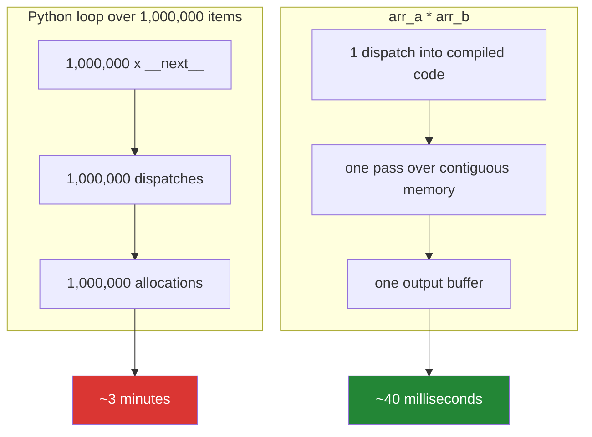

# 4.2 — The loop you should not write at all

## One-line answer

A Python loop pays an interpreter cost on **every** item — a dispatch, a frame, a boxed object — so
the fastest loop over a million numbers is the one you hand to compiled code instead, which is what
NumPy, pandas and SQL all are.

---

## The story

An engineer has just fixed a quadratic. The dedup that took four hours takes fifty seconds, the report
runs at night again, and everyone is happy.

Two months later it takes four minutes. The data grew, and this time the growth is honest — fifty
seconds to four minutes is roughly linear, which is exactly what was promised. There is no bug.

They profile it anyway. The slowest section is a loop that multiplies two columns of numbers and sums
them — a dot product, eight million rows. It is a perfectly good linear loop with a constant-cost
body. It takes three minutes.

The same computation, handed to NumPy as `(a * b).sum()`, takes forty milliseconds. Not because the
algorithm changed — it is the same multiply-and-add — but because the Python version does eight
million interpreter dispatches, eight million attribute lookups on boxed integer objects, and eight
million reference-count updates, while NumPy does one dispatch into a compiled loop over contiguous
memory.

**The quadratic was a bug. This is not a bug; it is the cost of the interpreter.** And the fix is not
a better loop — it is not writing one.

---

## The idea in plain language

### What a Python loop pays per item

For `for x in items: total += x * 2`, each pass does roughly:

1. `__next__` on the iterator — a method call with a frame.
2. Bind `x` — a reference-count increment.
3. `x * 2` — dispatch to `int.__mul__` ([Day 5,
   1.1](../../../day-05-operators-and-conditionals/parts/01-operators/1.1-an-operator-is-a-method-call.md)),
   which **allocates a new integer object** on the heap.
4. `total + ...` — another dispatch, another allocation.
5. Rebind `total`, decrement the old value's reference count, possibly free it.

Five-ish operations of overhead around one arithmetic instruction that a CPU does in a nanosecond.
That ratio — roughly 50 to 200 times — is the "interpreter tax", and it is constant per item, so it
never shows up in the complexity class. `O(n)` with a big constant is still `O(n)`, and still forty
times slower than it needs to be.

### Where the tax goes

Two costs dominate, and both come from Python's object model
([Day 4, 1.1](../../../day-04-objects/parts/01-objects/1.1-identity-type-value.md)):

- **Every value is a heap object.** A Python list of a million integers is a million pointers to a
  million separate objects, each with a type pointer and a reference count. A NumPy array of a million
  integers is eight megabytes of contiguous numbers, with the type stored once.
- **Every operation is a dispatch.** The interpreter must look up which `__mul__` to call, because the
  type is only known at run time. Compiled code knows the type at compile time and emits one machine
  instruction.

The second cost is why the fix is *vectorisation* rather than *optimisation*: you cannot make a
Python-level dispatch cheap, you can only do fewer of them.



### The four ways to do fewer dispatches

In rough order of how often they are the answer:

1. **Vectorise.** Hand the whole array to NumPy or pandas and let one call do the loop in C.
   Day 20 onwards.
2. **Push it to the database.** A `SUM(a * b)` in SQL does not move eight million rows over a network
   to be summed in Python. Day 42 onwards.
3. **Use a built-in that loops in C.** `sum()`, `max()`, `any()`, `all()`, `"".join()`,
   `sorted()`, `map()` — all of these run their loop in compiled code. A comprehension is not compiled,
   but it is meaningfully faster than an explicit loop because it skips the repeated `append` attribute
   lookup ([Day 9, 3.3](../../../day-09-comprehensions/parts/03-when-not-to/3.3-the-list-you-never-needed.md)).
4. **Change language for the hot part** — Cython, Rust via PyO3, Numba. Last resort, and rarely needed
   once the first three are exhausted.

### When to keep the loop

Vectorising is not free and is not always right:

- **The data is small.** Under a few thousand items, the loop finishes in milliseconds and the
  vectorised version costs you a dependency, a conversion, and a reader's time.
- **The body has side effects** — writing files, calling an API, logging per item. There is nothing to
  vectorise; the cost is elsewhere entirely.
- **The logic is genuinely sequential** — each step depends on the previous one, as in a retry loop or
  a state machine. `for attempt in range(cap)` is not a candidate for vectorisation, and never will be.
- **Clarity wins.** A vectorised expression that takes a reader ten minutes to decode, saving 200ms on
  a job that runs nightly, is a bad trade. **Measure first**
  ([4.1](4.1-the-accidental-quadratic.md)'s discipline applies here too.)

The rule: **vectorise the hot numeric path, keep the loop for everything else.**

### The order of operations that matters

Fix the complexity class first, then the constant. A vectorised quadratic is still a quadratic — NumPy
will happily run your `O(n²)` algorithm forty times faster and it will still fall over at scale. Only
once the loop is linear does the interpreter tax become the thing worth attacking.

---

## Why Setu needs it

- **Day 20 opens NumPy** (`NP-01`) with precisely this timing, and Day 25's broadcasting (`NP-`) is
  the rule set for *how* the compiled loop pairs elements — which is
  [Day 5, 1.1](../../../day-05-operators-and-conditionals/parts/01-operators/1.1-an-operator-is-a-method-call.md)'s
  operator dispatch, one level down.
- **Day 26's pandas** (`PD-01`) makes `df.iterrows()` the canonical thing not to write; the mask and
  the vectorised expression replace it, and
  [Day 5, 1.5](../../../day-05-operators-and-conditionals/parts/01-operators/1.5-bitwise-and-the-mask.md)
  is why those masks use `&`.
- **Day 42's SQL** (`SQL-`) is push-down: doing the aggregation where the data is instead of pulling
  it into Python.
- **Day 95's gradient descent** (`ML-06`) is written from scratch with NumPy, and the whole reason it
  is tractable to run for a thousand epochs is that each epoch is a handful of vectorised operations
  rather than a loop over the dataset.
- **Day 155's embeddings and Day 162's retrieval** (`RAG-`) compare a query vector against thousands
  of document vectors. Written as a Python loop that is seconds per query; written as one matrix
  multiply it is milliseconds, and that is the difference between a demo and a usable system.

---

## The mechanism

The tax, measured — with no dependency, so it runs today:

```python
"""Same arithmetic, four ways. The only difference is how many dispatches happen."""

import time
from array import array

N = 2_000_000
a = list(range(N))
b = list(range(N))


def timed(label: str, fn) -> float:
    started = time.perf_counter()
    result = fn()
    elapsed = time.perf_counter() - started
    print(f"    {label:<34} {elapsed:>7.3f}s   result={result}")
    return elapsed


print("dot product of two million-element lists:")
baseline = timed(
    "explicit for loop",
    lambda: _dot_loop(a, b),
)
timed("sum + generator expression", lambda: sum(x * y for x, y in zip(a, b, strict=True)))
timed("sum + map with operator.mul", lambda: sum(map(_mul, a, b)))


def _mul(x: int, y: int) -> int:
    return x * y


def _dot_loop(xs: list[int], ys: list[int]) -> int:
    total = 0
    for i in range(len(xs)):
        total += xs[i] * ys[i]
    return total
```

**Line by line:**

- `_dot_loop` uses `range(len(xs))` and indexing — the slowest shape, and deliberately so: it pays two
  `__getitem__` dispatches per pass on top of everything else. It is also the smell from
  [1.2](../01-iteration/1.2-range-is-lazy.md), here for a reason.
- `sum(x * y for x, y in zip(a, b, strict=True))` — the multiply is still Python-level (a dispatch per
  pair), but `sum` runs **its** loop in C and there is no `append`, no index lookup. Typically 30–40%
  faster than the explicit loop.
- `strict=True` — the habit from [1.3](../01-iteration/1.3-enumerate-and-zip.md), and it costs nothing
  measurable.
- `sum(map(_mul, a, b))` — `map` also loops in C, calling `_mul` per pair. It is usually about the
  same as the generator expression, sometimes marginally faster, and it is worth knowing that
  `operator.mul` from the standard library beats a hand-written `_mul` because it is itself compiled.
- **None of these three is dramatically better than the others**, and that is the lesson: shuffling
  Python-level constructs buys tens of percent. The dispatch per element is still there, so the
  constant is still large. Getting a factor of fifty requires leaving the interpreter entirely.
- The function definitions appear after their use here for readability of the timings; Python resolves
  names at call time, so this works — but ruff's `E402` and most reviewers prefer definitions first,
  and real code should put them at the top.

The version that leaves the interpreter, written for Day 20 and shown now:

```python
"""What the same dot product looks like once the loop is compiled. NumPy arrives on Day 20."""

# uv add numpy==2.3.4   <- NOT today. Packages are added on the day they are first used.
#
# import numpy as np
#
# a = np.arange(2_000_000, dtype=np.int64)
# b = np.arange(2_000_000, dtype=np.int64)
#
# total = (a * b).sum()          # two dispatches, both into compiled code
# total = np.dot(a, b)           # one dispatch, one pass, no intermediate array
#
# Typical numbers on a laptop, for two million elements:
#     explicit Python loop        ~0.40 s
#     sum + generator expression  ~0.25 s
#     (a * b).sum()               ~0.006 s
#     np.dot(a, b)                ~0.002 s
```

**Line by line:**

- The block is **commented out on purpose.** NumPy is not a dependency until Day 20, and adding a
  package before the day that needs it violates the project's own rule
  ([Day 1, 3.2](../../../day-01-pins/parts/03-freezing/3.2-freezing-into-pyproject-and-the-lock.md)).
  The numbers are here so the comparison is concrete now, and you will reproduce them yourself on
  Day 20 rather than trusting this comment (Principle: regenerate, do not trust).
- `np.arange(..., dtype=np.int64)` — the dtype is stated explicitly rather than inferred. Pinning the
  type is the same instinct as pinning a version (Principle 4), and on Day 20 you will find that the
  default differs between platforms.
- `(a * b).sum()` — **two** compiled passes and one temporary array of two million elements. Fast, and
  it allocates 16 MB.
- `np.dot(a, b)` — **one** pass, no temporary, because the multiply and the sum are fused in the
  compiled kernel. This is why the specialised function beats the composed expression, and it is a
  general pattern in array libraries.
- The ratio between the first and last lines is roughly **200×**, on identical arithmetic. Nothing
  about the algorithm changed.

And the decision procedure — because the answer is not always "vectorise":

```python
"""Not every loop should go. Three that should stay, and why."""

import time

# 1. SMALL DATA - the loop finishes before you could import a library
small = list(range(500))
started = time.perf_counter()
total = sum(x * x for x in small)
print(f"1. 500 items: {time.perf_counter() - started:.6f}s - vectorising this is a net loss")

# 2. SIDE EFFECTS PER ITEM - the cost is the effect, not the arithmetic
requests_made = 0
for paper_id in ["doi-1", "doi-2", "doi-3"]:
    requests_made += 1  # stands in for a network call: ~100 ms each
print(f"2. {requests_made} calls: the loop overhead is ~0.000001s of ~0.3s. Irrelevant.")

# 3. GENUINELY SEQUENTIAL - each pass depends on the last
balance = 1000.0
for rate in (0.01, 0.02, -0.005):
    balance *= 1 + rate
print(f"3. compounding: {balance:.2f} - pass 2 needs pass 1's answer. Nothing to vectorise.")
```

**Line by line:**

- Case 1 — five hundred items is microseconds. **Measure before optimising**; a vectorised version here
  costs a dependency, an array conversion, and a reader's attention to save nothing.
- Case 2 — a loop making network calls spends 99.9999% of its time waiting. The fix for *that* loop is
  concurrency (Day 19, `PY-24`) or batching, not vectorisation. Applying the wrong remedy is as common
  as applying none.
- Case 3 — `balance` on each pass depends on the previous pass. This is a **sequential dependency**,
  and it is the one shape that genuinely cannot be vectorised in general. (NumPy has `cumprod` for this
  specific case, which is worth knowing — many "sequential" loops are secretly a scan operation in
  disguise, and finding that out is part of Day 22.)
- The retry loop from [3.2](../03-capped-retry/3.2-the-capped-retry-from-scratch.md) is case 2 and
  case 3 at once, which is why it stays a loop forever.

---

## When it breaks

**The loop that is not slow because of the loop:**

```text
   ncalls  tottime  percall  cumtime  percall filename:lineno(function)
     5000    0.031    0.000  512.847    0.103 client.py:88(fetch)
     5000  512.702    0.103  512.702    0.103 {method 'recv' of '_socket.socket'}
```

**What it means.** `tottime` for the loop's own code is 31 milliseconds; `recv` — waiting on the
network — is 512 seconds. Vectorising this loop would save 0.006% of the runtime. **The first job of a
profiler is to stop you optimising the wrong thing**, and a loop making I/O calls is almost never the
thing.

**The vectorised version that ran out of memory:**

```text
>>> import numpy as np
>>> a = np.arange(500_000_000)
>>> b = a * 2
numpy.core._exceptions._ArrayMemoryError: Unable to allocate 3.73 GiB for an array
with shape (500000000,) and data type int64
```

**What it means.** Vectorising materialises intermediates. The Python loop processed one element at a
time in constant memory and would have finished, slowly; the NumPy version needs the whole result in
RAM at once. **The trade for speed is memory**, and at very large scale the answer is chunking — process
a million rows at a time, vectorised within each chunk — which is exactly what pandas' `chunksize` and
Dask do.

**The `iterrows` that is slower than the loop it replaced:**

```text
>>> %timeit sum(row["a"] * row["b"] for _, row in df.iterrows())
1.42 s per loop
>>> %timeit (df["a"] * df["b"]).sum()
1.87 ms per loop
```

**What it means.** `df.iterrows()` is the worst of both worlds: it pays the interpreter tax *and*
constructs a new `Series` object per row, which is far more expensive than a plain tuple. A pandas
loop is typically slower than the equivalent loop over plain lists. This is the single most common
performance mistake in the whole Pandas module, and Day 26 opens with it.

**And the "optimisation" that changed the answer:**

```text
>>> import numpy as np
>>> big = 2**62
>>> sum([big, big, big])            # Python integers are arbitrary precision
13835058055282163712
>>> np.array([big, big, big], dtype=np.int64).sum()
-4611686018427387904
```

**What it means.** NumPy's `int64` **overflows silently** where Python's `int` grows without bound
([Day 4, 1.3](../../../day-04-objects/parts/01-objects/1.3-numbers-and-bool.md)). The vectorised
version is two hundred times faster and gives a negative answer for a sum of positive numbers. This is
the real cost of leaving the interpreter: you take on the machine's type semantics, and fixed-width
integers overflow. Day 20's dtype discussion exists because of exactly this.

---

## In production

**Profile, then fix the complexity, then fix the constant — in that order.** Most "slow Python" is one
of three things: an accidental quadratic ([4.1](4.1-the-accidental-quadratic.md)), I/O that should be
concurrent or batched, or an interpreter-bound numeric loop. Only the third is a vectorisation
problem, and reaching for NumPy before identifying which of the three you have is how teams end up
with a fast implementation of the wrong algorithm. The ordering matters because a vectorised quadratic
is still a quadratic.

**Vectorised code is a different skill, and readability is a real cost.** `(df["a"] * df["b"]).sum()`
is clearer than the loop. A four-line chain of boolean masks, `np.where`, and a reshape is often not,
and a reviewer who cannot verify it cannot catch a bug in it. The professional practice is to vectorise
the hot path, leave the cold path as a loop, and write a test that asserts both produce the same
answer on a fixture — which also documents the intent of the clever version. That equivalence test is
worth more than a comment.

**What changes at scale is the memory, not just the time.** Vectorisation trades constant memory for
speed: an expression like `(a - a.mean()) ** 2 / n` allocates three temporary arrays the size of your
data. At a million rows nobody notices; at five hundred million it is the error above. The techniques
that follow are in-place operations (`a -= mean`), chunked processing, and out-of-core tools — and the
first time you need them, the failure will look like the process being killed with no traceback.

**Under concurrency, the picture inverts.** Python threads do not speed up a pure-Python numeric loop,
because the interpreter lock serialises bytecode execution — but NumPy releases that lock during
compiled operations, so vectorised code *does* parallelise across threads, and many NumPy builds
already use multiple cores for large operations. This is one of the less-known arguments for
vectorising: it is not merely faster serially, it is the version that can use the machine. Day 19
(`PY-24`) covers the lock properly.

**The review comment a senior engineer leaves.** On a Python loop summing two dataframe columns:
*"This is `(df.a * df.b).sum()` — about three orders of magnitude faster, and shorter. Before you
change it though, check the profile: if this loop is 2% of the runtime, leave it alone and look at the
`fetch()` above it, which is where the 512 seconds are."*

**The interview question.** *"Why is Python slow, and what do you do about it?"* The answer worth
giving is mechanical rather than cultural: every operation is a dynamic dispatch on a heap-allocated
object, so a loop pays roughly 50–200× the cost of the arithmetic it performs, and that constant is
unavoidable within the interpreter. The response is to do fewer dispatches — vectorise with NumPy or
pandas so one call runs a compiled loop over contiguous memory, push aggregation into the database, or
use built-ins like `sum` and `join` that loop in C. The follow-up that separates people is *"when
would you not do that?"* — small data, loops dominated by I/O, genuinely sequential logic, and cases
where the vectorised form is unreadable — plus the two costs you take on: temporary arrays that
multiply memory use, and fixed-width dtypes that overflow silently where Python integers would not.

---

## Check yourself

```bash
uv run python -c "
import time
N = 1_000_000
a = list(range(N)); b = list(range(N))
def t(label, fn):
    s = time.perf_counter(); r = fn(); print(f'{label:<32} {time.perf_counter()-s:>7.3f}s  {r}')
def loop():
    total = 0
    for i in range(len(a)):
        total += a[i] * b[i]
    return total
t('for loop with indexing', loop)
t('sum + generator expression', lambda: sum(x*y for x, y in zip(a, b, strict=True)))
t('sum + map(operator.mul)', lambda: __import__('builtins').sum(map(__import__('operator').mul, a, b)))
"
```

All three are within a factor of two of each other. That is the point: shuffling Python constructs
does not escape the tax — only leaving the interpreter does, and you will measure that on Day 20.

**Answer out loud, without scrolling up:**

> Name the two costs a Python loop pays per item that compiled code does not. Then give three
> situations where vectorising would be the wrong fix, and the two things you take on when you do
> vectorise.

---

**Back to the hub:** [Day 6 — Loops, `break`/`continue`, and the capped retry](../../LESSON.md)
