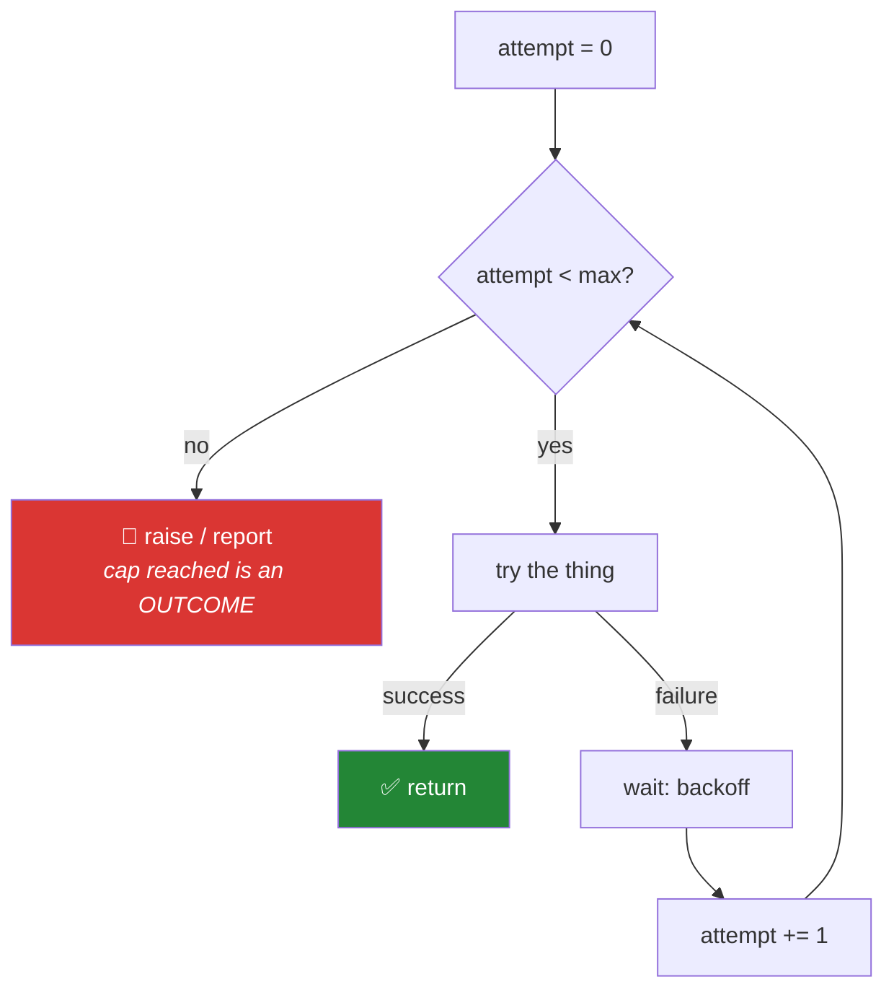

# Day 6 — Loops, `break`/`continue`, and the capped retry

**Phase 1 · Module 1** · ID: **PY-05** (loops, break and continue, range)

> **Yesterday:** operators, precedence, truthiness.
> **Today:** the loop — and one specific loop shape you will rebuild four more times: on Day 95 as
> gradient descent, on Day 182 as the agent loop, and on Day 223 as the cap that stops two agents
> arguing forever.
> **Tomorrow:** strings and formatting.

```bash
./m start 6 && ./m scaffold 6
```

**Time:** 90 minutes. **Request budget:** 0 model calls.

---

## §1 The story

Two loops, and the choice between them is not stylistic.

- `for x in things:` — **"do this once per item."** You know how many iterations there will be, even
  if you have not counted them. This is the one you want almost always.
- `while condition:` — **"keep going until something changes."** You do *not* know how many
  iterations there will be. That is powerful and it is exactly why it is dangerous.

Every `while` loop is a promise that the condition will eventually become false. If that promise
breaks — a server that never returns success, a gradient that never converges, a model that keeps
calling the same tool — the loop runs forever.

On a $0 budget (Principle 5), "forever" is not an abstraction. An uncapped retry loop against a rate-limited
provider will burn your entire daily quota in about ninety seconds, and you will not do any labs
until tomorrow.

So this project has a rule, from today until Day 240:

> **Every `while` loop has a hard iteration cap, and hitting the cap is a reported outcome, not a
> silent shrug.**



Redraw that. It is the same diagram as the agent loop on Day 182 with the box labels changed.

---

## §2 Setup — run this

```bash
mkdir -p days/day-06/lab
touch days/day-06/lab/loops.py
touch src/setu/retry.py
touch tests/test_retry.py
```

No new packages — `time` and `random` are standard library.

---

## §3 PY-05 — the loop mechanics

`days/day-06/lab/loops.py`:

```python
"""PY-05: for, while, break, continue, range - and the enumerate/zip habits."""

from __future__ import annotations


def range_is_lazy() -> None:
    r = range(1_000_000)
    print(f"{type(r).__name__=}  {len(r)=}")
    print(f"{r[0]=} {r[-1]=} {r[500]=}")
    print(f"{list(range(2, 11, 3))=}   <- start, stop (exclusive), step")
    print(f"{list(range(5, 0, -1))=}   <- negative step counts down")


def enumerate_and_zip() -> None:
    papers = ["attention", "bert", "gpt"]
    years = [2017, 2018, 2018]

    print("\n-- index and item together --")
    for i, name in enumerate(papers, start=1):
        print(f"  {i}. {name}")

    print("\n-- two sequences in step --")
    for name, year in zip(papers, years, strict=True):
        print(f"  {name} ({year})")


def break_and_continue() -> None:
    citations = [4, 0, 12, -1, 7]
    print("\n-- continue skips, break stops --")
    for value in citations:
        if value == 0:
            continue
        if value < 0:
            print("  negative count - data is corrupt, stopping")
            break
        print(f"  processing {value}")


def for_else() -> None:
    print("\n-- for/else: else runs only if no break --")
    for value in [1, 3, 5]:
        if value % 2 == 0:
            print("  found an even number")
            break
    else:
        print("  searched everything, found nothing")


if __name__ == "__main__":
    range_is_lazy()
    enumerate_and_zip()
    break_and_continue()
    for_else()
```

**Line by line:**

- `range(1_000_000)` — a **lazy** object, not a list. It stores start, stop and step and computes
  values on demand, so it uses the same memory for a million as for ten. The underscores in
  `1_000_000` are digit separators; Python ignores them.
- `r[500]` works — `range` supports indexing and `len()` without materialising anything. It is not a
  generator (Day 11 covers those); it is a lazy **sequence**.
- `range(2, 11, 3)` — start, stop, step. **Stop is exclusive**, which is why `range(10)` gives 0–9.
  That exclusivity is what makes `range(a, b)` and `range(b, c)` join up with no gap and no overlap.
- `enumerate(papers, start=1)` — yields `(index, item)` pairs. `start=1` gives human numbering. Use
  this instead of `for i in range(len(papers)):` — it is shorter and it cannot go out of range.
- `zip(papers, years, strict=True)` — walks two sequences together. **`strict=True` (3.10+) raises if
  the lengths differ.** Without it, `zip` silently stops at the shorter one, which is how a
  mismatched label array quietly truncates a training set on Day 92. Always pass `strict=True`.
- `continue` — skip to the next iteration. `break` — leave the loop entirely.
- `for ... else` — the `else` block runs **only if the loop finished without `break`**. It reads
  badly at first and it is the cleanest way to express "searched everything and found nothing"
  without a `found = False` flag.

---

## §4 The capped retry

`src/setu/retry.py`:

```python
"""A retry loop with a hard cap. Reused by every network call in this project."""

from __future__ import annotations

import random
import time
from collections.abc import Callable
from typing import TypeVar

T = TypeVar("T")


class RetriesExhausted(RuntimeError):
    """Raised when the attempt cap is reached without success."""


def backoff_delay(attempt: int, base: float = 0.5, cap: float = 30.0) -> float:
    """Exponential backoff with full jitter. attempt is 0-based."""
    ceiling = min(cap, base * (2**attempt))
    return random.uniform(0, ceiling)


def with_retry(
    fn: Callable[[], T],
    *,
    attempts: int = 5,
    sleep: Callable[[float], None] = time.sleep,
) -> T:
    """TODO(me): call fn(); on exception, back off and retry, at most `attempts` times.

    Rules:
      - the cap is HARD: never more than `attempts` calls to fn
      - on the final failure raise RetriesExhausted, chaining the last error
      - sleep between attempts using backoff_delay, but NOT after the last one
      - `sleep` is injected so tests do not actually wait
    """
    raise NotImplementedError
```

**Line by line:**

- `T = TypeVar("T")` — a type variable. `Callable[[], T] -> T` says *"whatever `fn` returns, this
  returns"*. Without it the signature would have to say `object` and every caller would lose its type.
- `class RetriesExhausted(RuntimeError)` — a named exception, so callers can catch *this* rather than
  everything. Second custom exception in the repo, after Day 2's `MissingKey`.
- `base * (2**attempt)` — exponential: 0.5, 1, 2, 4, 8 seconds. This is what stops a retry storm from
  hammering a service that is already struggling.
- `random.uniform(0, ceiling)` — **full jitter.** Without randomness, every client that failed at the
  same moment retries at the same moment, and the thundering herd re-creates the outage. The jitter
  is not optional and it is the part people leave out.
- `min(cap, ...)` — after enough attempts, `2**attempt` gets absurd. Cap it.
- `*` in the signature — everything after it is **keyword-only**. `with_retry(fn, 3)` is now a
  `TypeError`; you must write `attempts=3`. At a call site three months from now, `attempts=3` is
  readable and a bare `3` is not.
- `sleep: Callable[[float], None] = time.sleep` — **dependency injection**, and it is the whole reason
  this function is testable. The test passes a fake that records durations instead of waiting, so a
  five-attempt retry test finishes in microseconds. You meet this pattern formally in Phase 2; here
  it is one parameter.

---

## §5 The eval that must be able to fail

`tests/test_retry.py`:

```python
import pytest

from setu.retry import RetriesExhausted, backoff_delay, with_retry


class Recorder:
    """A fake sleep that records what it was asked to wait, without waiting."""

    def __init__(self):
        self.delays: list[float] = []

    def __call__(self, seconds: float) -> None:
        self.delays.append(seconds)


def test_returns_immediately_on_success():
    sleeper = Recorder()
    calls = []

    def ok():
        calls.append(1)
        return "value"

    assert with_retry(ok, attempts=5, sleep=sleeper) == "value"
    assert len(calls) == 1, "a successful call must not be retried"
    assert sleeper.delays == [], "no sleep on the happy path"


def test_succeeds_on_the_third_attempt():
    sleeper = Recorder()
    calls = []

    def flaky():
        calls.append(1)
        if len(calls) < 3:
            raise ConnectionError("boom")
        return "value"

    assert with_retry(flaky, attempts=5, sleep=sleeper) == "value"
    assert len(calls) == 3
    assert len(sleeper.delays) == 2, "sleep happens between attempts, not after the last"


def test_cap_is_hard():
    sleeper = Recorder()
    calls = []

    def always_fails():
        calls.append(1)
        raise ConnectionError("boom")

    with pytest.raises(RetriesExhausted):
        with_retry(always_fails, attempts=4, sleep=sleeper)
    assert len(calls) == 4, "the cap was exceeded - this is the bug that burns a daily quota"


def test_original_error_is_chained():
    def always_fails():
        raise ValueError("the real reason")

    with pytest.raises(RetriesExhausted) as info:
        with_retry(always_fails, attempts=2, sleep=lambda _: None)
    assert isinstance(info.value.__cause__, ValueError)


@pytest.mark.parametrize("attempt", range(6))
def test_backoff_is_bounded_and_non_negative(attempt):
    delay = backoff_delay(attempt, base=0.5, cap=30.0)
    assert 0 <= delay <= 30.0
```

**Line by line:**

- `class Recorder` with `__call__` — an object that behaves like a function. `sleeper(1.5)` invokes
  `__call__`. You implement dunder methods properly on Day 15 (PY-18); here one earns its place
  because the fake needs both callability and memory.
- `assert len(calls) == 1` on the happy path — a retry helper that calls `fn` twice when it succeeded
  the first time is a bug that doubles every API request in the project. Cheap test, expensive bug.
- `len(sleeper.delays) == 2` for three attempts — sleeping **after** the final failure wastes eight
  seconds on every exhausted call. Off-by-one, made visible.
- `test_cap_is_hard` — **the most important test in this file.** It is the executable form of §1's
  rule. Change `attempts` handling to be off by one and this goes red immediately.
- `info.value.__cause__` — `__cause__` is set by `raise NewError(...) from original`. The test asserts
  you preserved the real reason. An error that says only "retries exhausted" tells you nothing about
  *why*; chaining is what makes the traceback useful at 11pm.
- `sleep=lambda _: None` — an inline no-op fake. `_` is the conventional name for a parameter you
  ignore.
- `@pytest.mark.parametrize("attempt", range(6))` — `range` as a parameter source; six tests from one body.

```bash
uv run python -m pytest tests/test_retry.py -v
```

Five red. Make them green **without changing the tests**.

---

## §6 Request budget

| Resource | Spent today |
|---|---|
| LLM calls | **0** |
| Real seconds slept in tests | **0** — that is what the injected `sleep` is for |

---

## §7 Traps

- **An uncapped `while`.** On a free tier that is a burned day, not a slow function.
- **Backoff without jitter.** Every failed client retries in lockstep and re-creates the outage.
- **Sleeping after the final attempt.** Pure waste, and the classic off-by-one here.
- **`zip` without `strict=True`.** Silently truncates to the shorter sequence. This is how labels and
  features drift apart on Day 92.
- **`for i in range(len(x)):`** — use `enumerate`. Shorter, and cannot go out of range.
- **Mutating a list while iterating over it.** Skips elements. Iterate over a copy, or build a new list.
- **Swallowing the original exception.** Always `raise RetriesExhausted(...) from exc`.
- **Assuming `range` is a list.** It is lazy. `list(range(...))` when you truly need one.

---

## §8 Verify before you code

Written **2026-08-21**:

- <https://docs.python.org/3/library/functions.html#zip> — confirm `strict=` is present.
- <https://docs.python.org/3/reference/compound_stmts.html#the-for-statement> — the `for/else` semantics.
- <https://docs.python.org/3/library/random.html#random.uniform> — bounds are inclusive of both ends.

---

## §9 Say it in an interview

> "Every `while` loop in that project has a hard iteration cap, and reaching the cap raises rather
> than returning quietly. That came from working on a zero-budget setup where the currency is
> requests per day — an uncapped retry against a rate-limited provider burns the whole day's quota in
> about ninety seconds. The retry helper takes `sleep` as an injected parameter, so the tests prove
> the cap and the off-by-one on the final sleep without waiting a single real second. And it chains
> the original exception, because 'retries exhausted' with no cause is an error message that costs
> you a debugging session."

---

## §10 Done when

Tick [`CHECKLIST.md`](CHECKLIST.md), then `./m check && ./m done 6`.
