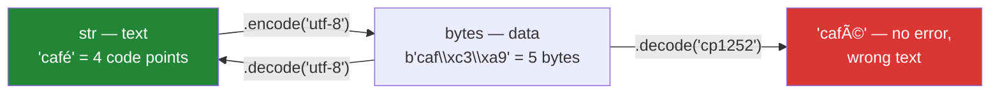

# 1.1 — A string is a sequence of code points, not bytes

## One-line answer

A Python `str` is a sequence of **characters** (code points), a `bytes` is a sequence of numbers
0–255, and the only ways between them are `encode` and `decode` — which is why `len("café")` is 4 and
`len("café".encode())` is 5.

---

## The story

A paper-import job has been running for months. One morning it stops on a single row.

```text
UnicodeDecodeError: 'utf-8' codec can't decode byte 0xe9 in position 34: invalid continuation byte
```

The title is *"Étude d'un modèle"*. The file came from a colleague's spreadsheet export, saved by a
tool that writes Windows-1252 rather than UTF-8, and the byte `0xe9` is that encoding's `é`. In UTF-8,
`é` is two bytes — `0xc3 0xa9` — so `0xe9` on its own is not a valid UTF-8 sequence at all.

Someone fixes it with `errors="ignore"`. The job runs. The title in the database is now
*"tude d'un modle"*, silently, and the paper never matches a search again.

Someone else fixes it with `errors="replace"`. Now it is *"�tude d'un mod�le"* — visible, at least,
and still wrong.

The correct fix is one word: `encoding="cp1252"` on the file that is actually in that encoding. But to
get there you have to know something the error message assumes you know — **that text and bytes are
different kinds of thing, and a file contains bytes.** That distinction is the whole of this document,
and it is the single most useful hour anyone spends on strings.

---

## The idea in plain language

### Two different things with a converter between them

**A `str` is text.** A sequence of **code points** — the abstract numbers Unicode assigns to
characters. `"café"` is four code points: `c`, `a`, `f`, and `é` (which is U+00E9). How those are
stored in memory is the interpreter's business and never yours.

**A `bytes` is data.** A sequence of integers from 0 to 255. It is what a file contains, what travels
over a network, what a database column of type `blob` holds. On its own it means nothing — it is not
text until somebody says which encoding to read it with.

An **encoding** is the rule that maps code points to bytes and back. `str.encode()` goes text →
bytes; `bytes.decode()` goes bytes → text. **There is no other route**, and both directions require
you to name the encoding or accept the default.



That bottom arrow is the dangerous one and the reason this matters: **decoding with the wrong encoding
often does not raise.** It produces plausible-looking wrong text, which is the failure family this
whole week keeps meeting.

### Why UTF-8 won, and what it costs

UTF-8 encodes each code point as one to four bytes. ASCII characters (the English alphabet, digits,
common punctuation) take one byte and are byte-identical to plain ASCII — which is why so much
software appeared to handle text correctly for decades while only ever being tested in English.
Everything else takes two, three or four.

The consequence you must hold on to: **the number of characters is not the number of bytes.**

| Text | `len(str)` | `len(bytes)` in UTF-8 |
|---|---|---|
| `"hello"` | 5 | 5 |
| `"café"` | 4 | 5 |
| `"日本語"` | 3 | 9 |
| `"🙂"` | 1 | 4 |

Any code that assumes those two columns match — a database column sized in bytes, a fixed-width file
format, a "maximum 280 characters" check against a byte length — breaks the first time a non-English
character arrives.

### Where the encoding comes from

`open(path)` uses a **default encoding** if you do not name one, and until recently that default was
whatever the operating system said — UTF-8 on Linux and macOS, and often a legacy code page on
Windows. That is why a script can work on one machine and fail on another with no code change, and it
is the single most common cross-platform bug in data work.

Since Python 3.11 there is `encoding="locale"` to ask for that explicitly, and 3.15 will make UTF-8
the default everywhere. **Until then, name the encoding on every `open()`**, every time. It costs
sixteen characters and removes a class of bug.

### `str` and `bytes` do not mix

Python 3 refuses to combine them, deliberately:

- `"a" + b"b"` → `TypeError`
- `"a" == b"a"` → `False` (no error — equality across types is always answerable,
  [Day 5, 1.3](../../../day-05-operators-and-conditionals/parts/01-operators/1.3-comparison-and-chaining.md))
- `b"abc"[0]` → `97`, an **integer**, not `b"a"`. Indexing bytes gives you numbers; slicing gives you
  bytes.

Python 2 allowed the mixing, guessed an encoding, and produced exactly the silent corruption the story
describes. The refusal is the fix.

---

## Why Setu needs it

- **[4.2](../04-normalising/4.2-unicode-normalisation.md), today,** is the next layer: two strings
  that are *visually identical*, both valid UTF-8, and not equal.
- **Day 16's file handling** (`PY-19`, `PY-20`) opens files for real, and `encoding=` is the parameter
  that day insists on.
- **Day 26's pandas** (`PD-`) reads CSVs with `pd.read_csv(..., encoding=...)`, and the story's error
  is the most common failure of that call.
- **Day 42's databases** (`SQL-`) store text in columns with declared encodings and collations; a
  `VARCHAR(50)` may mean fifty bytes or fifty characters depending on the engine.
- **Day 150's tokenizers** (`LLM-`) operate on bytes, not characters — byte-pair encoding is named for
  it — so "how many tokens is this prompt" is a question about bytes, and the character count is only
  a rough proxy. Every token budget in the second half of this curriculum rests on this distinction
  ([Day 3, 4.1](../../../day-03-keys-and-budget/parts/04-rate-budget/4.1-rpm-rpd-tpm.md)).

---

## The mechanism

The two types, and the two arrows between them:

```python
"""str is characters. bytes is numbers. encode and decode are the only routes."""

text = "café"
data = text.encode("utf-8")

print(f"text      = {text!r}  type={type(text).__name__}  len={len(text)}")
print(f"encoded   = {data!r}  type={type(data).__name__}  len={len(data)}")
print(f"decoded   = {data.decode('utf-8')!r}")

print("code points:", [f"U+{ord(ch):04X}" for ch in text])
print("bytes      :", [f"0x{b:02x}" for b in data])
print("indexing bytes gives an int:", data[0], type(data[0]).__name__)
print("slicing bytes gives bytes  :", data[0:1])
```

**Line by line:**

- `text.encode("utf-8")` — **name the encoding**, even though UTF-8 is the default for this method. The
  explicit form is what makes a later reader sure it was a decision.
- `len(text)` is `4` and `len(data)` is `5`. Four characters, five bytes, because `é` needs two.
  **This one line is the whole document.**
- `ord(ch)` — the code point number for a character. `chr()` is the inverse. `f"U+{ord(ch):04X}"`
  formats it as uppercase hex padded to four digits, which is how Unicode writes code points; the
  format spec is [3.2](../03-formatting/3.2-the-format-spec.md).
- `data[0]` is `99`, an **integer** — the byte value of `c`. This surprises everyone once. Bytes are
  numbers, so indexing gives a number.
- `data[0:1]` is `b'c'` — slicing gives bytes. Indexing and slicing a `bytes` return different types,
  which is not true of `str` where both give `str`.

Now the four ways a decode can go, of which only one is right:

```python
"""One sequence of bytes, four readings. Three of them are wrong; two are silent."""

# The bytes a Windows-1252 spreadsheet export actually wrote for "Étude"
data = b"\xc9tude d'un mod\xe8le"

print("1. decode as utf-8 (what the job assumed):")
try:
    print("   ", data.decode("utf-8"))
except UnicodeDecodeError as exc:
    print(f"    UnicodeDecodeError: {exc}")

print("2. decode as utf-8 with errors='ignore' (the bad fix):")
print("   ", repr(data.decode("utf-8", errors="ignore")))

print("3. decode as utf-8 with errors='replace' (the visible bad fix):")
print("   ", repr(data.decode("utf-8", errors="replace")))

print("4. decode as cp1252 (the actual fix):")
print("   ", repr(data.decode("cp1252")))
```

**Line by line:**

- `b"\xc9tude..."` — a `bytes` literal. `\xc9` is one byte with value 201, which is `É` in
  Windows-1252 and is not a valid UTF-8 start byte for anything on its own.
- Reading 1 raises. **This is the good outcome** — an error that names the byte and its position, so
  you can look it up.
- Reading 2, `errors="ignore"`, drops the bytes it cannot decode: `"tude d'un modle"`. No error, no
  warning, **silent data loss**, and a title that will never match a search. This is the fix people
  reach for because it makes the traceback go away.
- Reading 3, `errors="replace"`, substitutes `\ufffd` (the replacement character, `�`) for each bad
  byte. Still wrong, but **visibly** wrong, so it is the lesser evil when you genuinely cannot control
  the input — a log line, a best-effort preview.
- Reading 4, `cp1252`, produces `"Étude d'un modèle"`. The bytes were never broken; the reader was.
  **The fix is always to find the real encoding**, and `errors=` is a decision about what to do when
  you cannot.
- The general rule this establishes: **`errors="ignore"` is almost never acceptable in a pipeline.**
  It converts a loud failure into silent corruption, which is the trade this curriculum keeps arguing
  against.

And the character-versus-byte count, where it actually bites:

```python
"""Any limit expressed in one unit and checked in the other is a bug waiting for a non-English input."""

samples = ["hello", "café", "日本語", "🙂", "naïve café 日本"]

print(f"{'text':<18} {'chars':>6} {'utf-8 bytes':>12} {'utf-16 bytes':>13}")
for sample in samples:
    print(
        f"{sample:<18} {len(sample):>6} "
        f"{len(sample.encode('utf-8')):>12} {len(sample.encode('utf-16-le')):>13}"
    )

LIMIT_BYTES = 10
title = "Étude sur les modèles"
print()
print(f"a VARCHAR({LIMIT_BYTES}) sized in BYTES:")
print(
    f"    characters that fit: {len(title[:LIMIT_BYTES])}, but that is {len(title[:LIMIT_BYTES].encode())} bytes"
)
print(f"    truncating BYTES instead: {title.encode()[:LIMIT_BYTES]!r}")
try:
    print(title.encode()[:LIMIT_BYTES].decode("utf-8"))
except UnicodeDecodeError as exc:
    print(f"    ...and decoding that raises: {exc}")
```

**Line by line:**

- The table shows the three counts diverging. `"🙂"` is one character, four UTF-8 bytes, and four
  UTF-16 bytes — which is why some languages report its length as 2 (they count UTF-16 units) and
  Python reports 1.
- `title[:LIMIT_BYTES]` — slicing a `str` slices **characters**, so this gives ten characters and more
  than ten bytes. If the limit is a byte limit, this check passes and the database rejects the insert.
- `title.encode()[:LIMIT_BYTES]` — slicing the **bytes** gives exactly ten bytes, and may cut a
  multi-byte character in half.
- The decode of that truncated slice raises `UnicodeDecodeError: unexpected end of data`. **Truncating
  encoded text at a byte boundary produces invalid text**, which is the bug behind every mangled
  character at the end of a truncated field.
- The correct approach is to encode, check the length, and if it is over, truncate **characters** in a
  loop until the encoded form fits — or use `codecs` incremental encoding. There is no one-liner, and
  that is worth knowing before you need it.

---

## When it breaks

**The story's error, verbatim:**

```text
>>> b"\xe9tude".decode("utf-8")
Traceback (most recent call last):
  File "<stdin>", line 1, in <module>
UnicodeDecodeError: 'utf-8' codec can't decode byte 0xe9 in position 0: invalid continuation byte
```

**What it means.** The reader expected UTF-8 and the bytes are not UTF-8. It names the byte (`0xe9`)
and the position, which is enough to find the character in the source file. The fix is to identify the
real encoding — `cp1252` and `latin-1` cover most Western European legacy files, and `chardet` or
`charset-normalizer` can guess when you truly do not know. **Do not reach for `errors=`** until you
have established that the encoding cannot be determined.

**The other direction:**

```text
>>> "café".encode("ascii")
Traceback (most recent call last):
  File "<stdin>", line 1, in <module>
UnicodeEncodeError: 'ascii' codec can't encode character '\xe9' in position 3: ordinal not in range(128)
```

**What it means.** You asked for an encoding that cannot represent this text. ASCII has 128 code
points and `é` is not among them. This appears when writing to a system that demands ASCII — some
older protocols, some filename rules — and the answers are to use UTF-8 if the far end allows it, or
to transliterate deliberately (`unicodedata.normalize` plus stripping accents,
[4.2](../04-normalising/4.2-unicode-normalisation.md)) rather than letting `errors=` mangle it.

**Mixing the two types:**

```text
>>> "prefix-" + b"data"
Traceback (most recent call last):
  File "<stdin>", line 1, in <module>
TypeError: can only concatenate str (not "bytes") to str
>>> "abc" == b"abc"
False
```

**What it means.** The `TypeError` is the language refusing to guess an encoding
([Day 5, 1.1](../../../day-05-operators-and-conditionals/parts/01-operators/1.1-an-operator-is-a-method-call.md)'s
negotiation ending). The `False` is more insidious: comparing text to bytes is always false and never
raises, so a check like `if header == b"content-type":` against a `str` header silently never matches.
This is common when moving between a library that returns bytes (`socket`, `subprocess`) and one that
returns text.

**And the platform-dependent one:**

```text
# on Linux/macOS
>>> open("titles.csv").read()[:20]
"Étude d'un modèle"

# the same line on Windows, pre-3.15
>>> open("titles.csv").read()[:20]
'Étude d\'un modèle'
```

**What it means.** No error on either machine. The default encoding differed, so the same code
produced different text — the UTF-8 bytes were read as a legacy code page, which happily maps every
byte to *some* character. **This is why `encoding="utf-8"` on every `open()` is not pedantry**, and
Python 3.15 changing the default is an acknowledgement that the old behaviour cost the community more
than it saved.

---

## In production

**Decode at the boundary, work in `str`, encode at the boundary.** This is the discipline that makes
text handling tractable at any scale: the moment bytes enter your process — a file read, an HTTP
response, a socket, a queue message — decode them with a known encoding and never touch bytes again;
convert back only when writing out. Code in the middle that handles both types has to check, and code
that checks will eventually check wrongly. The pattern has a name in some communities — the
"Unicode sandwich" — and it is the single most effective structural habit here.

**Name the encoding everywhere, and prefer UTF-8 for everything you control.** Every `open()`, every
`decode()`, every `read_csv`, every database connection string. Where you control both ends, UTF-8 is
the answer and the discussion is over. Where you do not, record the encoding of each source as part of
its schema documentation — because "we do not know what encoding this vendor sends" is an operational
fact that belongs in the runbook, not a thing to rediscover during an incident.

**`errors="ignore"` is a decision to lose data, and it should be reviewed as one.** There are
legitimate uses — a best-effort log preview, a search index that will be rebuilt — and in a pipeline
that feeds a database it is almost always wrong. `errors="replace"` is the honest fallback because the
damage is visible and countable; `errors="surrogateescape"` is the sophisticated one, preserving
undecodable bytes so they can be written back out unchanged, which is what you want for filenames and
for pass-through proxies. Whichever you choose, **count the failures and emit a metric**, or the
corruption is invisible.

**What changes at scale.** Encoding and decoding are not free: they are a pass over the data with a
per-character branch. On a few thousand rows it is nothing; on a hundred gigabytes of logs it is a
measurable fraction of the job, and the answer is to decode once rather than repeatedly, and to keep
data in bytes when you genuinely never need it as text (hashing, copying, checksumming). The other
scale property is memory: Python stores a `str` compactly when all its characters are ASCII and uses
up to four bytes per character otherwise, so a single emoji in a long string can quadruple its memory
footprint — a real and surprising effect when loading millions of records.

**Under concurrency there is nothing special about text** — strings are immutable
([Day 4, 1.4](../../../day-04-objects/parts/01-objects/1.4-strings-are-immutable.md)), so they are
safe to share freely. The trap is a shared *decoder* object in an incremental decoding setup, which
carries state between calls and is not thread-safe.

**The review comment a senior engineer leaves.** On `open(path).read()`: *"Add `encoding='utf-8'` —
without it this reads with the platform default and will produce different text on the Windows
runner. And use a `with` block; this leaks the handle."*

**The interview question.** *"What is the difference between `str` and `bytes` in Python 3?"* The
answer is that a `str` is a sequence of Unicode code points — text — and `bytes` is a sequence of
integers 0–255 — data — with `encode` and `decode` as the only conversions, each requiring an
encoding. The follow-up that finds real experience is *"why is `len('café')` 4 but the encoded length
5?"* — because UTF-8 is variable-width and `é` needs two bytes — and the strong answer continues into
what breaks because of it: a byte-sized database column checked against a character count, text
truncated at a byte boundary producing an invalid sequence, and a token budget that is really about
bytes. If they ask about `UnicodeDecodeError`, the point to make is that it means the reader's
encoding is wrong and the fix is to find the right one — `errors='ignore'` converts a loud failure into
silent data loss.

---

## Check yourself

```bash
uv run python -c "
for s in ['hello', 'café', '日本語', '🙂']:
    print(f'{s:<8} chars={len(s):<3} utf8_bytes={len(s.encode()):<3} points={[hex(ord(c)) for c in s]}')
data = b\"\\xc9tude\"
for enc, kw in (('utf-8', {}), ('utf-8', {'errors': 'ignore'}), ('utf-8', {'errors': 'replace'}), ('cp1252', {})):
    try:
        print(f'{enc:<7} {kw} -> {data.decode(enc, **kw)!r}')
    except UnicodeDecodeError as exc:
        print(f'{enc:<7} {kw} -> UnicodeDecodeError: {exc}')
print('indexing bytes:', b'abc'[0], '| slicing bytes:', b'abc'[0:1])
"
```

The `errors='ignore'` line is the one to look at hardest — nothing failed, and a character is gone.

**Answer out loud, without scrolling up:**

> Say what a `str` holds and what a `bytes` holds, and name the only two operations between them. Then
> explain why `len("café")` is 4 while its encoded length is 5, and give one bug that difference
> causes.

---

**Next:** [1.2 — Indexing and slicing, and the slice that never raises](1.2-indexing-and-slicing.md)
