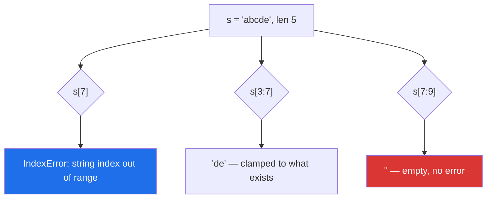

# 1.2 — Indexing and slicing, and the slice that never raises

## One-line answer

`s[i]` raises when `i` is out of range and `s[a:b]` never does — it silently clamps to what exists —
which makes slicing safe for trimming and dangerous for anything where a short input should have been
an error.

---

## The story

A parser reads fixed-width records from a legacy export. Each line is supposed to be:

```text
positions 0-9    the record id
positions 10-49  the title
positions 50-57  the date, as YYYYMMDD
```

The code is three slices and looks fine. It runs for two years.

Then an upstream system starts writing lines that are truncated — a bug on their side, one field
missing. The parser does not raise. `line[50:58]` on a 45-character line returns the empty string,
`""`, and the date parser downstream turns an empty string into `None`, and `None` dates are filtered
out of the report as "not yet published".

Four thousand papers quietly stop appearing. Nobody notices for a month, because the report still runs,
still looks right, and the count of rows is not something anyone was watching.

Had the code used indexing — `line[57]` — it would have raised `IndexError` on the first bad line and
someone would have fixed the upstream bug that afternoon. **The slice's forgiveness was the bug.**

That is the trade this document is about. Slicing never raising is a genuine convenience and a genuine
hazard, and knowing which one you are getting is the difference.

---

## The idea in plain language

### Indexing: one character, and it can fail

`s[i]` gives the character at position `i`, counting from `0`. Negative indices count from the end:
`s[-1]` is the last character, `s[-2]` the one before it.

If `i` is out of range, you get `IndexError`. That is the whole behaviour.

For a `str`, `s[i]` returns a **one-character string** — Python has no separate character type. So
`"abc"[0]` is `"a"`, and `"a"[0]` is `"a"` again, forever.

### Slicing: a range, and it cannot fail

`s[start:stop:step]` gives a **new string** containing the characters from `start` up to but not
including `stop`, taking every `step`-th one.

Every part is optional:

| Slice | Means |
|---|---|
| `s[2:5]` | positions 2, 3, 4 |
| `s[:5]` | from the beginning to 4 |
| `s[2:]` | from 2 to the end |
| `s[:]` | the whole thing (a copy, for a mutable sequence) |
| `s[::2]` | every second character |
| `s[::-1]` | reversed |
| `s[-3:]` | the last three characters |

The bound is **half-open** — `stop` is excluded — exactly like `range`
([Day 6, 1.2](../../../day-06-loops/parts/01-iteration/1.2-range-is-lazy.md)), and for the same four
reasons: the length is `stop - start`, adjacent slices tile, `s[:n] + s[n:]` reconstructs the original
for any `n`, and slice bounds and `range` bounds agree.

**And out-of-range bounds are clamped, not rejected.** `"abc"[0:100]` is `"abc"`. `"abc"[50:60]` is
`""`. No error, ever, for any bounds at all — including nonsense like `"abc"[10:2]`.



The blue box is a failure you can see. The red box is the story.

### The negative step, and the trap in it

`s[::-1]` reverses. It works because with a negative step the defaults flip: `start` defaults to the
end and `stop` to before the beginning.

The trap is mixing a negative step with explicit bounds. `s[5:1:-1]` walks *backwards* from 5 to 2 —
the stop is still exclusive, so position 1 is not included. And `s[1:5:-1]` is empty, because you
cannot walk backwards from 1 to 5. These read wrong to almost everybody, and the honest advice is:
use `s[::-1]` for a plain reverse and `reversed()` when you want to iterate, and think twice before
writing anything else with a negative step.

### Slicing gives you a new string

Because strings are immutable
([Day 4, 1.4](../../../day-04-objects/parts/01-objects/1.4-strings-are-immutable.md)), every slice
**allocates and copies**. `s[:]` on a string returns the same object (Python optimises the whole-string
case), but `s[1:]` on a million-character string copies 999,999 characters.

That matters in a loop: repeatedly slicing a large string to consume it from the front is the
`insert(0, ...)` quadratic in another costume
([Day 6, 4.1](../../../day-06-loops/parts/04-loop-cost/4.1-the-accidental-quadratic.md)). The fix is an
index that moves rather than a string that shrinks.

### The slice object

`s[1:5]` is `s[slice(1, 5)]` — the syntax builds a `slice` object and passes it to `__getitem__`
([Day 5, 1.1](../../../day-05-operators-and-conditionals/parts/01-operators/1.1-an-operator-is-a-method-call.md)).
That is worth knowing for two reasons: you can name a slice and reuse it (`DATE = slice(50, 58)`,
which makes the fixed-width parser readable), and it is how NumPy and pandas receive the fancy
multi-dimensional slices you will write from Day 20.

---

## Why Setu needs it

- **[2.3](../02-methods/2.3-replace-and-removeprefix.md), today,** shows `removeprefix` replacing the
  `s[len(prefix):]` idiom, which is a slice with a computed bound and therefore a place clamping hides
  a bug.
- **[4.1](../04-normalising/4.1-the-title-normaliser.md), today,** truncates long titles — and the
  correct truncation is a slice with a deliberate decision about what happens to a short input.
- **Day 8's list slicing** (`PY-07`) is the same syntax with a copy that matters more, because lists
  are mutable
  ([Day 8, 1.2](../../../day-08-containers/parts/01-sequences/1.2-slicing-and-the-copy-you-missed.md)).
- **Day 20's NumPy** (`NP-01`) and **Day 24's boolean indexing** use the same `[start:stop:step]`
  syntax on arrays — where a slice is a **view**, not a copy, which is the opposite of what happens
  here and is one of the genuine surprises of that module.
- **Day 164's chunking** (`RAG-04`) slices documents into overlapping windows: `text[i:i + size]` with
  `i` stepping by `size - overlap`. Every property in this document — half-open bounds, clamping, the
  copy — is load-bearing there.

---

## The mechanism

Indexing raises, slicing does not:

```python
"""The one behavioural difference that matters, demonstrated on the same string."""

s = "abcde"

print(f"s = {s!r}, len = {len(s)}")
print("s[0]  =", repr(s[0]), " s[-1] =", repr(s[-1]))

for index in (4, 5, -5, -6):
    try:
        print(f"s[{index}]  = {s[index]!r}")
    except IndexError as exc:
        print(f"s[{index}]  -> IndexError: {exc}")

print()
for bounds in ("3:7", "7:9", "10:2", "-99:99"):
    start, stop = (int(part) for part in bounds.split(":"))
    print(f"s[{bounds}]  = {s[start:stop]!r}   <- no error, whatever the bounds")
```

**Line by line:**

- `s[-1]` — the last character. Negative indexing is `len(s) + i`, so `s[-1]` is `s[4]`.
- `s[5]` and `s[-6]` — both raise `IndexError: string index out of range`. The valid range is `-5` to
  `4` inclusive, and anything outside is an error.
- The second loop's four slices — `"de"`, `""`, `""`, `"abcde"`. **None of them raises.** Including
  `s[10:2]`, which asks for a range that cannot exist and returns empty rather than complaining.
- `(int(part) for part in bounds.split(":"))` — unpacking a generator expression into two names. It
  works because unpacking consumes exactly two items; had `bounds` contained three colons it would
  raise `ValueError: too many values to unpack`
  ([Day 6, 1.3](../../../day-06-loops/parts/01-iteration/1.3-enumerate-and-zip.md)).
- **The contrast is the point.** If a bound is computed from data, indexing tells you when the data is
  wrong and slicing does not.

The story's parser, both ways:

```python
"""A fixed-width parser that forgives truncation, and one that does not."""

ID = slice(0, 10)
TITLE = slice(10, 50)
DATE = slice(50, 58)
RECORD_WIDTH = 58

good = "doi-000001" + "Attention Is All You Need".ljust(40) + "20170612"
truncated = "doi-000002" + "A Truncated Row".ljust(40)


def parse_forgiving(line: str) -> dict[str, str]:
    """Three slices. Silently returns empty fields for a short line."""
    return {"id": line[ID].strip(), "title": line[TITLE].strip(), "date": line[DATE].strip()}


def parse_strict(line: str) -> dict[str, str]:
    """The same three slices, with the width checked first."""
    if len(line) != RECORD_WIDTH:
        raise ValueError(
            f"expected a {RECORD_WIDTH}-character record, got {len(line)}: {line[:20]!r}"
        )
    return {"id": line[ID].strip(), "title": line[TITLE].strip(), "date": line[DATE].strip()}


for label, line in (("good", good), ("truncated", truncated)):
    print(f"forgiving({label:<9}) -> {parse_forgiving(line)}")
    try:
        print(f"strict   ({label:<9}) -> {parse_strict(line)}")
    except ValueError as exc:
        print(f"strict   ({label:<9}) -> ValueError: {exc}")
```

**Line by line:**

- `ID = slice(0, 10)` — a **named slice**, which is what makes a fixed-width parser readable. `line[ID]`
  says what it extracts; `line[0:10]` makes the reader count. Naming the layout in one place also means
  a format change is one diff.
- `"...".ljust(40)` — pads to exactly 40 characters, which is how a fixed-width record is built. Its
  sibling `rjust` and the format spec's `:<40` do the same thing
  ([3.2](../03-formatting/3.2-the-format-spec.md)).
- `parse_forgiving(truncated)` returns `{'id': 'doi-000002', 'title': 'A Truncated Row', 'date': ''}`.
  **An empty date, no error.** That empty string is the four thousand missing papers.
- `if len(line) != RECORD_WIDTH: raise ValueError` — a guard clause
  ([Day 5, 2.5](../../../day-05-operators-and-conditionals/parts/02-conditionals/2.5-the-conditional-expression.md)),
  and the entire fix. It is one line, it goes at the top, and it converts a silent wrong answer into a
  message that names the expected width, the actual width, and the start of the offending line.
- `{line[:20]!r}` in the message — enough of the line to find it in the source file, and **not** the
  whole line, which could be enormous or could contain secrets. Error messages are read in logs;
  their size is a design decision.

And the two costs of slicing — the copy, and the negative step:

```python
"""Every slice of a string copies. And a negative step with explicit bounds reads backwards."""

import time

big = "x" * 2_000_000

started = time.perf_counter()
position = 0
while position < len(big):
    _chunk = big[position : position + 1000]
    position += 1000
print(f"moving an index : {time.perf_counter() - started:.4f}s")

started = time.perf_counter()
remaining = big[:200_000]
while remaining:
    _chunk = remaining[:1000]
    remaining = remaining[1000:]
print(f"shrinking a str : {time.perf_counter() - started:.4f}s  (on a tenth of the data)")

print()
s = "abcdef"
for expr, value in (
    ("s[::-1]", s[::-1]),
    ("s[5:1:-1]", s[5:1:-1]),
    ("s[1:5:-1]", s[1:5:-1]),
    ("''.join(reversed(s))", "".join(reversed(s))),
):
    print(f"{expr:<22} = {value!r}")
```

**Line by line:**

- The first loop moves an integer and slices from the original string each time — each slice copies
  1000 characters, so the total is linear.
- The second loop **rebinds `remaining` to a shorter copy each pass**, and each copy is nearly as long
  as the original. Total work is quadratic
  ([Day 6, 4.1](../../../day-06-loops/parts/04-loop-cost/4.1-the-accidental-quadratic.md)) — which is
  why it runs on a tenth of the data and is still slower. **A shrinking string in a loop is the string
  version of `list.pop(0)`.**
- `_chunk` with a leading underscore — the convention for "computed and deliberately unused", which
  also keeps ruff's unused-variable rules quiet.
- `s[5:1:-1]` is `"fedc"` — from position 5 down to 2, because the stop is exclusive **in the direction
  of travel**. Position 1 (`"b"`) is excluded.
- `s[1:5:-1]` is `""` — you cannot walk backwards from 1 to 5, so nothing is produced. No error.
- `"".join(reversed(s))` — the explicit form. It is slower than `s[::-1]` and unambiguous, and for
  anything more complex than a plain reverse it is what a reviewer will prefer.

---

## When it breaks

**Indexing past the end:**

```text
>>> "abc"[3]
Traceback (most recent call last):
  File "<stdin>", line 1, in <module>
IndexError: string index out of range
```

**What it means.** Exactly what it says, and it is the **helpful** failure. The most common real cause
is an off-by-one from a length: `s[len(s)]` is always out of range because indices stop at `len - 1`.

**The slice that quietly gave you nothing:**

```text
>>> line = "doi-000002short"
>>> line[50:58]
''
>>> line[50:58].strip()
''
>>> int(line[50:58] or 0)
0
```

**What it means.** Three lines of increasingly forgiving code, ending in a date of `0`. **No error at
any step.** Note the `or 0` on the last line, which is the falsy-default trap from
[Day 5, 3.1](../../../day-05-operators-and-conditionals/parts/03-the-or-trap/3.1-the-or-default-and-falsy-zero.md)
arriving to make things worse. The chain from "slice clamps" to "wrong number in a report" is short and
entirely silent.

**A float or a string as an index:**

```text
>>> "abcdef"[1.0]
Traceback (most recent call last):
  File "<stdin>", line 1, in <module>
TypeError: string indices must be integers, not 'float'
>>> row = {"title": "x"}
>>> row["titel"]
Traceback (most recent call last):
  File "<stdin>", line 1, in <module>
KeyError: 'titel'
```

**What it means.** The first is `/` returning a float
([Day 5, 1.2](../../../day-05-operators-and-conditionals/parts/01-operators/1.2-the-two-divisions.md))
— use `//`. The second is included because `TypeError: string indices must be integers` also appears
when you think you have a dict and you have a string: `row["title"]` where `row` is accidentally a
JSON *string* rather than a parsed dict gives exactly that message, and it is a genuinely confusing
five minutes the first time.

**And the zero step:**

```text
>>> "abcdef"[::0]
Traceback (most recent call last):
  File "<stdin>", line 1, in <module>
ValueError: slice step cannot be zero
```

**What it means.** A step of zero would never advance. It is one of the very few ways to make a slice
raise, and it usually comes from a computed step — `s[::stride]` where `stride` was calculated as a
difference that turned out to be zero.

---

## In production

**Slice for trimming, index for asserting.** The rule that comes out of the story: when a bound is a
constant and a short input is acceptable, slice — `title[:80]` for a display truncation is exactly
right. When a bound comes from a format contract, **check the length first and raise**, because a
short input means an upstream problem and the whole value of an error is that it arrives near its
cause. Fixed-width parsers, protocol headers and anything derived from a specification all belong in
the second category.

**Name your slices when there is more than one.** `DATE = slice(50, 58)` at module level turns a
parser from arithmetic into vocabulary, gives a format change one place to happen, and — because a
`slice` is an ordinary object — lets you build the layout from a config table rather than hard-coding
it. This is a small thing that materially changes how maintainable a fixed-width or binary parser is.

**Never consume a large string by re-slicing it.** The shrinking-string loop is quadratic and it is a
genuinely common shape in hand-written parsers. Keep an integer position and slice from the original,
or use `io.StringIO`, or use `memoryview` when the data is bytes — `memoryview(data)[10:20]` is a
**view** with no copy at all, and it is the tool for parsing large binary formats without allocating
your way to a memory error.

**What changes at scale.** Every string slice allocates, so a slice in a hot loop is an allocation in
a hot loop; on a million rows that is a million short-lived objects for the garbage collector. Usually
it is fine and worrying about it is premature — the case where it is not is the quadratic above, and
the diagnostic is the ratio test from
[Day 6, 4.1](../../../day-06-loops/parts/04-loop-cost/4.1-the-accidental-quadratic.md). In NumPy and
pandas the same syntax gives a **view** instead, which is faster and introduces the opposite hazard:
writing through a slice changes the original. Knowing that the two libraries differ from the language
on this point is worth carrying into Day 20.

**The failure mode that only appears with real data is the short row.** Test fixtures are constructed
by hand and are always well-formed; production files are truncated by a disk that filled, a process
that was killed, or an upstream bug. A parser tested only on complete records has never exercised its
clamping behaviour, and clamping is silent. The defence is a length assertion and a test with a
deliberately short line — one test, and it would have saved the story a month.

**The review comment a senior engineer leaves.** On the three-slice parser: *"Add a length check at the
top — right now a truncated line gives an empty date rather than an error, and the downstream filter
will drop those rows silently. Also pull the three slices out as named `slice` objects so the layout is
readable and lives in one place."*

**The interview question.** *"What happens when you slice past the end of a string?"* The answer is
that it clamps — you get whatever exists, possibly the empty string, and it never raises, unlike
indexing which gives `IndexError`. The follow-up worth being ready for is *"is that good?"* — and the
honest answer is that it is convenient for trimming and dangerous for parsing, because a bound
computed from a format contract will silently produce an empty field instead of telling you the input
is malformed; the fix is an explicit length check. If the conversation turns to slicing generally, the
points that show experience are that slicing a string copies while slicing a NumPy array gives a view,
and that repeatedly re-slicing to consume a string is quadratic.

---

## Check yourself

```bash
uv run python -c "
s = 'abcde'
for i in (4, 5, -5, -6):
    try:
        print(f's[{i}] = {s[i]!r}')
    except IndexError as exc:
        print(f's[{i}] -> IndexError: {exc}')
for a, b in ((3, 7), (7, 9), (10, 2), (-99, 99)):
    print(f's[{a}:{b}] = {s[a:b]!r}')
print('reverse      :', s[::-1])
print('s[4:1:-1]    :', s[4:1:-1])
print('s[1:4:-1]    :', s[1:4:-1], '<- empty, no error')
"
```

Six of these produce a value where a beginner expects an error. Predict which.

**Answer out loud, without scrolling up:**

> State the one behavioural difference between `s[i]` and `s[a:b]` when the bounds are out of range.
> Then say when that difference is a convenience and when it is a bug, with an example of each.

---

**Next:** [1.3 — Escapes, raw strings, and the Windows path](1.3-escapes-and-raw-strings.md)
