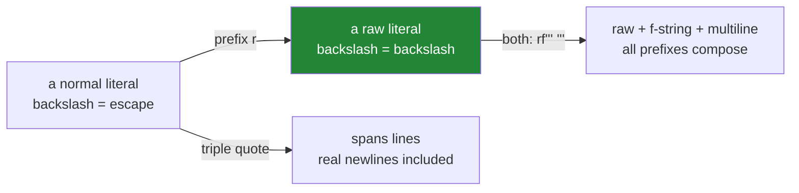

# 1.3 — Escapes, raw strings, and the Windows path

## One-line answer

A backslash inside a normal string literal starts an **escape sequence** — so `"C:\new"` contains a
newline, not the letter `n` — and an `r"..."` raw string turns that off, which is why every Windows
path and every regular expression should be raw.

---

## The story

A script on a Windows machine cannot find a file that is definitely there.

```text
path = "C:\data\reports\new_papers.csv"
open(path)
```

The error says `FileNotFoundError: [Errno 2] No such file or directory:
'C:\\data\treports\new_papers.csv'` — and the person reading it stares at the doubled backslash and
the odd `\t` and concludes the error message is garbled.

It is not. `\r` is a carriage return, `\n` is a newline, and `\t` in `\treports` is a tab — wait, no:
`\r` consumed the `r` of `reports`, leaving `eports`, and then… The actual string contains a carriage
return, a tab that was never typed, and a newline, and the only backslash that survived is the one
before `d`, because `\d` is not an escape sequence and Python left it alone.

That last detail is the cruel part. **Three of the four backslashes did something and one did not**,
so the path is corrupted unevenly and the error message looks like nonsense. The `\d` even produces a
`SyntaxWarning` in modern Python, which is the interpreter trying to help.

The fix is one character: `r"C:\data\reports\new_papers.csv"`. Or, better, stop building paths from
strings at all — but that is Day 16.

---

## The idea in plain language

### An escape sequence is two characters that mean one

Inside a normal string literal, a backslash tells Python "the next character is not literal". The pair
becomes a single character in the resulting string.

| Written | Becomes | Name |
|---|---|---|
| `\n` | newline | line feed, U+000A |
| `\t` | tab | U+0009 |
| `\r` | carriage return | U+000D |
| `\\` | one backslash | |
| `\"` `\'` | a quote that does not end the string | |
| `\0` | a null character | |
| `\xE9` | `é` | a code point in two hex digits |
| `\u00E9` | `é` | four hex digits |
| `\N{LATIN SMALL LETTER E WITH ACUTE}` | `é` | by Unicode name |

**The escape happens when the literal is parsed**, not when the string is used. So `len("a\nb")` is 3:
`a`, a newline, `b`. There is no backslash in the string at all.

### The `\d` problem: unknown escapes are left alone

Python does not reject an unrecognised escape. `"\d"` becomes a backslash followed by `d` — the
literal two characters — because there is no `\d` escape.

That leniency is why the story's path corrupted **unevenly**: `\d` survived, `\r`, `\n` and (via
`\treports`) `\t` did not. It also means the same string literal can behave differently depending on
which letters happen to follow the backslashes, which is about as unpredictable as a bug gets.

Since Python 3.12 an unknown escape raises a `SyntaxWarning: invalid escape sequence '\d'`, and in a
future version it will be an error. **Treat that warning as an error today** — it is always telling you
that a literal means something other than what it looks like.

### Raw strings turn escaping off

Prefix a literal with `r` and backslashes are literal:

```text
"C:\new"      ->  C:  +  newline  +  ew          (6 characters, one invisible)
r"C:\new"     ->  C:\new                          (6 characters, all visible)
```

The `r` is part of the *literal syntax*, not of the string. There is no such thing as a "raw string
object" — `r"a\n"` and `"a\\n"` produce exactly the same three-character string, and `type()` cannot
tell them apart.

Two places raw strings are effectively mandatory:

1. **Windows paths.** Every backslash is a separator, and separators should not be escapes.
2. **Regular expressions.** The regex language has its own backslash escapes — `\d` for a digit, `\b`
   for a word boundary, `\s` for whitespace — and without `r` you would have to double every one of
   them so Python passes the backslash through to the regex engine. `re.compile(r"\d+")` versus
   `re.compile("\\d+")`; the first is what everybody writes.

### The one thing a raw string cannot do

A raw string cannot **end** with an odd number of backslashes. `r"C:\"` is a syntax error, because the
backslash still prevents the quote from closing the literal even though it stays in the string.

The workarounds are `r"C:" + "\\"`, or `"C:\\"` for that one case, or — much better — not building
paths by hand ([Day 16, `PY-19`](../../../day-00-setup/parts/02-skeleton/2.1-the-folder-skeleton.md)
sets up the folders; `pathlib` is the tool).

### Triple quotes, and the line ending nobody sees

`"""..."""` spans lines, and each real line break in the source becomes a `\n` in the string. Useful
for a docstring, an SQL query, or a prompt template — and the trap is that the string starts with a
newline unless you put the first line of content on the opening line or use a leading `\`:



Prefixes compose: `rf"..."` is a raw f-string, `rb"..."` is raw bytes. Order does not matter and
casing does not matter, though lowercase is conventional.

---

## Why Setu needs it

- **[4.3](../04-normalising/4.3-methods-before-regex.md), today,** reaches for `re` for the first time,
  and every pattern in it is a raw string.
- **Day 16's `pathlib`** (`PY-19`) replaces hand-built path strings entirely — `Path("data") /
  "reports" / "new.csv"` has no backslashes to escape and works on every platform. Knowing *why* it is
  better requires this document first.
- **Day 0 already used raw strings** in `.gitignore` and shell contexts without naming them
  ([Day 0, 2.2](../../../day-00-setup/parts/02-skeleton/2.2-gitignore-before-secrets-exist.md)).
- **Day 42's SQL** (`SQL-`) uses triple-quoted strings for queries, and Day 130's prompt templates
  (`LLM-`) use them for prompts — where an accidental leading newline is a real difference in what the
  model receives.
- **Every `\n` in a log line, a CSV writer, or a prompt** is this document. On Windows, the additional
  `\r` is why a file written in text mode can end up with `\r\n` and a naive parser sees a stray
  carriage return at the end of every field.

---

## The mechanism

What the parser does, made visible:

```python
"""The escape happens when the literal is parsed. repr() and len() show the result."""

samples = [
    ('"a\\nb"', "a\nb"),
    ('r"a\\nb"', r"a\nb"),
    ('"a\\\\nb"', "a\\nb"),
    ('"tab\\there"', "tab\there"),
    ('"\\u00e9"', "\u00e9"),
    ('"\\N{DEGREE SIGN}"', "\N{DEGREE SIGN}"),
]

print(f"{'written':<20} {'repr':<14} {'len':>4}  characters")
for written, value in samples:
    chars = " ".join(f"U+{ord(c):04X}" for c in value)
    print(f"{written:<20} {value!r:<14} {len(value):>4}  {chars}")
```

**Line by line:**

- `'"a\\nb"'` — the *description* of the literal, written with a doubled backslash so that the
  description itself displays a single one. Reading this block requires holding two levels at once,
  which is exactly why escaping confuses people.
- `"a\nb"` has `len` **3** — the `\n` is one character. `r"a\nb"` has `len` **4** — backslash and `n`
  are two separate characters.
- `"a\\nb"` also has `len` 4 and is **identical** to the raw version. `r"a\nb" == "a\\nb"` is `True`,
  which proves there is no raw string *type*.
- `"\u00e9"` — the code point escape, giving `é` in one character
  ([1.1](1.1-a-string-is-code-points.md)). Useful for writing a character your keyboard cannot produce,
  or for making an invisible character visible in source.
- `"\N{DEGREE SIGN}"` — by Unicode name. Verbose, and unambiguous in a way `"°"` is not when the file's
  own encoding is in doubt.
- `f"U+{ord(c):04X}"` — the character-by-character breakdown, which is the tool for "what is actually
  in this string". Reach for it whenever a string does not behave the way it looks.

The story, and the fixes:

```python
"""Four backslashes, three of which did something. Then the two ways out."""

broken = "C:\data\reports\new_papers.csv"
fixed_raw = r"C:\data\reports\new_papers.csv"
fixed_doubled = "C:\\data\\reports\\new_papers.csv"

for label, value in (("broken", broken), ("raw", fixed_raw), ("doubled", fixed_doubled)):
    print(f"{label:<9} len={len(value):<3} {value!r}")

print()
print("what survived in the broken one:")
for char in broken:
    if ord(char) < 32 or char == "\\":
        print(f"    U+{ord(char):04X}  {char!r}")

print()
print("raw and doubled are the same object contents:", fixed_raw == fixed_doubled)
print("neither is a special type:", type(fixed_raw).__name__, type(fixed_doubled).__name__)
```

**Line by line:**

- `broken` — Python 3.12+ emits `SyntaxWarning: invalid escape sequence '\d'` when this line is
  compiled. **That warning is the bug report**, and it fires on `\d` while saying nothing about `\r`
  and `\n`, which are valid escapes doing exactly what they were asked.
- The `for char in broken` loop prints every control character and backslash. It shows a carriage
  return, a tab and a newline in a string that was supposed to contain none — and exactly one
  surviving backslash, before `d`.
- `fixed_raw == fixed_doubled` is `True`. Same characters, two spellings of the literal.
- `type(...).__name__` — both `str`. **There is no `rawstr`**, and internalising that stops a whole
  category of confusion about "converting" a string to raw, which is not a thing you can do to a value
  that already exists.
- The practical rule this establishes: if a string with backslashes came from *outside* your program —
  a file, an argument, an environment variable — **it has no escaping problem at all**, because
  escaping happens at parse time and that string was never parsed as a literal. Raw strings are a
  source-code concern only.

And the regex case, which is where raw strings earn their keep every day:

```python
"""Every regex should be raw. Here is what happens when it is not."""

import re

text = "paper-123 cites paper-456"

print("raw pattern:")
print("   ", re.findall(r"\d+", text))

print("non-raw, doubled - identical but noisier:")
print("   ", re.findall("\\d+", text))

print("a pattern where forgetting `r` changes the meaning entirely:")
print("    r'\\b\\w+\\b' finds words   :", re.findall(r"\b\w+\b", "one two"))
print("    '\\b\\w+\\b' finds nothing  :", re.findall("\b\\w+\b", "one two"))
```

**Line by line:**

- `re.findall(r"\d+", text)` — the raw literal hands the regex engine the two characters `\` and `d`,
  which the engine reads as "a digit". This is the form you should write every time.
- `re.findall("\\d+", text)` — identical result. Python turns `\\` into one backslash and the engine
  sees the same thing. It works and it is harder to read, and in a longer pattern the doubling becomes
  genuinely error-prone.
- `"\b\\w+\b"` — **the disaster case.** `\b` *is* a valid Python escape: it is the backspace character,
  U+0008. So Python turns it into a backspace before the regex engine ever sees it, and the engine is
  asked to find a literal backspace, which does not appear in the text. `findall` returns `[]` — no
  error, no warning, and a pattern that silently matches nothing.
- Compare with `\d`: because `\d` is *not* a valid Python escape, the non-raw version accidentally
  works. **So forgetting the `r` breaks some patterns and not others**, which is the worst possible
  behaviour for a mistake and the reason the rule is "always raw" rather than "raw when needed".
- `re` is used here for the first time in this curriculum, and
  [4.3](../04-normalising/4.3-methods-before-regex.md) argues about when to reach for it at all.

---

## When it breaks

**The warning that is telling you the truth:**

```text
>>> path = "C:\data\new.csv"
<stdin>:1: SyntaxWarning: invalid escape sequence '\d'
>>> path
'C:\\data\new.csv'
>>> len(path)
14
```

**What it means.** The warning names `\d` — the one Python did *not* understand. It says nothing about
`\n`, which it understood perfectly and turned into a newline. `repr()` then shows `\\d` (a real
backslash) and `\n` (a newline), which is the clearest possible summary if you know how to read it.
The fix is the `r` prefix.

**The raw string that will not end:**

```text
>>> path = r"C:\data\"
  File "<stdin>", line 1
    path = r"C:\data\"
                     ^
SyntaxError: unterminated string literal (detected at line 1)
```

**What it means.** In a raw string the backslash is still consumed for the purpose of "does this quote
close the literal", even though it stays in the value. So a raw literal cannot end with an odd number
of backslashes. Use `"C:\\data\\"`, or `r"C:\data" + "\\"`, or `pathlib` and stop hand-building paths.

**The regex that matches nothing, silently:**

```text
>>> import re
>>> re.findall("\b\w+\b", "one two three")
[]
>>> re.findall(r"\b\w+\b", "one two three")
['one', 'two', 'three']
```

**What it means.** Without `r`, `\b` became a backspace character. The pattern is valid, compiles
cleanly, and finds nothing. **No error at any stage** — and this is a genuinely common bug in code
copied from a web page where the `r` was lost in the paste.

**And the invisible character from the wrong platform:**

```text
>>> line = "doi-001,Attention Is All You Need\r\n"
>>> fields = line.strip("\n").split(",")
>>> fields[-1]
'Attention Is All You Need\r'
>>> fields[-1] == "Attention Is All You Need"
False
```

**What it means.** A file written on Windows ends its lines with `\r\n`. Stripping only `\n` leaves the
carriage return attached to the last field, so the comparison fails, the lookup misses, and the
printed value looks identical because a carriage return is invisible. `line.strip()` with no argument
removes all trailing whitespace including `\r`, and opening the file in text mode with
`newline=None` (the default) translates line endings for you — which is the real fix
([2.1](../02-methods/2.1-normalising-strip-and-case.md)).

---

## In production

**Raw by default for anything with a backslash.** Windows paths, regular expressions, LaTeX, escape
sequences you want to keep literal. The rule is not "use `r` when you need it" but "use `r` unless you
are deliberately embedding a `\n`", because the failure mode of forgetting is silent for some patterns
and loud for others. Teams that have been bitten by the `\b` regex bug tend to enforce it in review,
and some linters can be configured to flag non-raw regex literals.

**Treat `SyntaxWarning: invalid escape sequence` as an error.** It is always a real defect: the literal
does not contain what it appears to contain. Running the test suite with `-W error::SyntaxWarning`
turns it into a failure, which is worth doing in CI
([Day 2, 4.1](../../../day-02-quality-gate/parts/04-the-gate/4.1-what-m-check-actually-runs.md))
because the warning is easy to scroll past and the bug it reports is not.

**Do not build paths from strings at all.** The deeper fix for the story is `pathlib`: `Path("C:/") /
"data" / "reports" / "new_papers.csv"` has no backslashes, works identically on every platform, and
handles the separator question centrally. Even on Windows, forward slashes work in almost every API,
so the real advice is that a hand-written `"C:\..."` literal is a smell regardless of whether it is
raw. Day 16 (`PY-19`) makes this the standard.

**Line endings are a boundary concern, and text mode is the boundary.** Opening a file with
`open(path, encoding="utf-8")` in the default text mode translates `\r\n` to `\n` on read and back on
write, so your in-memory strings are uniform. Opening with `"rb"` or with `newline=""` — which the
`csv` module requires — hands you the raw bytes and the carriage returns come with them. Knowing which
mode you are in is what prevents the invisible-`\r` bug, and the general principle is the same as
[1.1](1.1-a-string-is-code-points.md)'s: normalise at the boundary, work in one representation
inside.

**What changes at scale.** Nothing about escaping has a runtime cost — it happens once, when the module
is compiled. What does scale is the cost of the bugs: an invisible `\r` in a join key means every row
fails to match, an invisible tab in an identifier means a lookup misses, and both are invisible in
every log and every print statement. The production habit is that whenever a comparison "obviously"
should succeed and does not, print `repr()` of both sides before doing anything else. That one reflex
resolves this entire class of problem in seconds instead of hours.

**The review comment a senior engineer leaves.** On a non-raw regex: *"Make this an `r'...'` literal.
`\b` is a valid Python escape — the backspace character — so without the prefix this pattern silently
matches nothing rather than failing. Same for the path literal above; better still, use `pathlib`."*

**The interview question.** *"What is the difference between `"\n"` and `r"\n"`?"* The answer is that
the first is a single newline character and the second is two characters, a backslash and an `n`,
because the `r` prefix disables escape processing at parse time. The follow-up worth being ready for is
*"when does it matter?"* — Windows paths and regular expressions, and the sharp example is that
forgetting `r` on a regex breaks `\b` (a valid Python escape for backspace, so the pattern silently
matches nothing) while `\d` happens to survive because it is not a valid Python escape, which makes
the mistake inconsistent and therefore hard to learn from. Strong answers add that `r"..."` produces
an ordinary `str` — there is no raw string type — and that a raw literal cannot end with a backslash.

---

## Check yourself

```bash
uv run python - <<'PY'
import re

normal = "a\tb"
raw = r"a\tb"
doubled = "a\\tb"

for label, value in (("normal", normal), ("raw", raw), ("doubled", doubled)):
    print(f"{label:<8} len={len(value)}  {value!r}")

print("raw == doubled :", raw == doubled)
print("regex with r   :", re.findall(r"\b\w+\b", "one two"))
print("regex without  :", re.findall("\b\w+\b", "one two"), "<- silently nothing")
PY
```

The last line is the one worth staring at: a valid pattern, no error, and no matches. (Running the
block will also print the `SyntaxWarning` for `\w`, which is the interpreter pointing at the bug.)

**Answer out loud, without scrolling up:**

> Say what the `r` prefix does and at what moment it does it. Then explain why forgetting it breaks a
> regex containing `\b` but not one containing `\d`, and why that inconsistency makes the rule "always
> raw".

---

**Next:** [2.1 — Normalising: `strip`, `lower`, and why `lower()` is not enough](../02-methods/2.1-normalising-strip-and-case.md)
