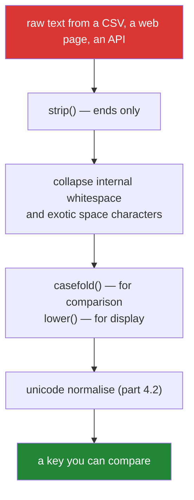

# 2.1 — Normalising: `strip`, `lower`, and why `lower()` is not enough

## One-line answer

`strip()` removes whitespace from both ends and `lower()` maps to lowercase — but neither returns
anything unless you assign it, `strip("chars")` is not a prefix remover, and `lower()` is the wrong
function for case-insensitive **comparison**, which is what `casefold()` is for.

---

## The story

A deduplication job is finding fewer duplicates than it should.

Two rows that are obviously the same paper are not matching. The titles print identically in the
terminal. Someone copies both into a comparison and gets `False`.

The investigation takes an hour and finds three separate problems in the same pair of strings. One
title has a trailing space from a CSV export. One has a non-breaking space — U+00A0, which came from a
web page — instead of an ordinary one, and it looks exactly the same. And one is `"MASSIVE"` while the
other is `"Massive"`, which the team had already handled with `.lower()` on one side of the comparison
and, by an old copy-paste, not the other.

Then a German colleague points out a fourth: their pipeline has titles containing `ß`, and
`"STRASSE".lower()` is `"strasse"` while `"Straße".lower()` is `"straße"` — still not equal.
`casefold()` gets both to `"strasse"`, which is what case-insensitive comparison actually needs.

Four bugs, one job: **normalising text is a pipeline of deliberate steps, not one method call**, and
every step you skip is a class of duplicate you will not find.

---

## The idea in plain language

### Every string method returns a new string

Strings are immutable
([Day 4, 1.4](../../../day-04-objects/parts/01-objects/1.4-strings-are-immutable.md)), so **no string
method modifies anything**. They all return a new string, and a call whose result you do not use has
done nothing at all.

```text
title.strip()          # does nothing - the result is discarded
title = title.strip()  # this is the one you meant
```

This is the single most common beginner error with strings, and it never raises. It is the exact
counterpart of `list.sort()` returning `None`
([Day 4, 2.2](../../../day-04-objects/parts/02-containers/2.2-what-in-place-means.md)) — there, the
mutating method returns nothing; here, the non-mutating method returns everything and you have to
catch it.

### The three strips

| Method | Removes from |
|---|---|
| `strip()` | both ends |
| `lstrip()` | the left |
| `rstrip()` | the right |

With **no argument** they remove whitespace: spaces, tabs, newlines, carriage returns, form feeds —
and Unicode whitespace, including the non-breaking space from the story. That default is almost always
what you want.

With an argument, they remove **any character in that set**, repeatedly, from the end. And this is
where people go wrong:

```text
"https://arxiv.org".strip("https://")   ->  "arxiv.org"      looks right
"https://sci-hub.org".strip("https://") ->  "ci-hub.org"     the `s` was eaten
```

`strip("https://")` does not remove the *string* `"https://"`. It removes any of the characters
`h`, `t`, `p`, `s`, `:`, `/` from either end until it meets something else — so it kept eating into
`sci-hub` because `s` is in the set. **The argument is a character set, not a prefix.** The tool that
removes a prefix is `removeprefix`, and it is [2.3](2.3-replace-and-removeprefix.md).

### The three case methods, and which is for comparison

| Method | Purpose |
|---|---|
| `lower()` / `upper()` | **display** — make text look a certain way |
| `casefold()` | **comparison** — make two strings match when they should |
| `title()` / `capitalize()` | display only, and both get names wrong |

`casefold()` is an aggressive lowercase designed for caseless matching. It handles cases `lower()`
does not, most famously German `ß` → `ss`, and it is defined by Unicode precisely for the "are these
the same word ignoring case" question.

The rule: **`lower()` when a human will read the result, `casefold()` when a comparison will.**

`title()` deserves a warning of its own: `"o'brien".title()` gives `"O'Brien"` — correct — and
`"it's".title()` gives `"It'S"`, which is not. It capitalises after every non-letter, so apostrophes
and hyphens break it. For display titles, do it yourself or use a library that knows about small
words.

### Whitespace is not one character

The story's non-breaking space is the general problem. Several characters render as a space and are
not U+0020:

- U+00A0 non-breaking space — pasted from web pages constantly
- U+200B zero-width space — invisible entirely
- U+FEFF byte-order mark — appears at the start of files written by some Windows tools
- U+2009 thin space, U+3000 ideographic space, and more

`strip()` with no argument removes most of these because Python's whitespace definition is Unicode
aware. What it does **not** do is fix them in the *middle* of a string, so
`"Attention Is All"` still will not equal `"Attention Is All"`. That needs a replace, and it
belongs in the normaliser you build in
[4.1](../04-normalising/4.1-the-title-normaliser.md).



Each arrow is a decision. Skipping one is a class of duplicate you will not find.

---

## Why Setu needs it

- **[4.1](../04-normalising/4.1-the-title-normaliser.md), today,** is this pipeline written as a
  function, applied to 500 messy titles — the plan's named example for `PY-06`.
- **[4.2](../04-normalising/4.2-unicode-normalisation.md), today,** is the step after `casefold()`:
  two strings that are visually identical, correctly cased, and still not equal.
- **Day 8's deduplication** (`PY-08`) puts these keys in a set. **A set can only collapse strings that
  are exactly equal**, so the quality of the dedup is entirely the quality of the normaliser
  ([Day 8, 3.2](../../../day-08-containers/parts/03-dedup/3.2-order-preserving-dedup.md)).
- **Day 30's pandas cleaning** (`PD-`) does this with `.str.strip()` and `.str.casefold()` on whole
  columns, and the same non-breaking space causes the same missed joins at frame scale.
- **Day 164's chunking** and **Day 162's retrieval** (`RAG-`) match query text against document text.
  Whitespace and case differences there do not raise — they just retrieve the wrong documents, and the
  only symptom is worse answers.

---

## The mechanism

The call that does nothing, and the strips:

```python
"""Every string method returns a new string. A call you do not assign is a no-op."""

title = "  Attention Is All You Need  \n"

title.strip()
print(f"after an unassigned strip(): {title!r}   <- unchanged")

cleaned = title.strip()
print(f"after an assigned strip()  : {cleaned!r}")

messy = "\t\n  Attention Is All  \r\n"
print()
print(f"raw          : {messy!r}")
print(f"strip()      : {messy.strip()!r}")
print(f"lstrip()     : {messy.lstrip()!r}")
print(f"rstrip()     : {messy.rstrip()!r}")
print("the U+00A0 in the MIDDLE survives every strip:", " " in messy.strip())
```

**Line by line:**

- `title.strip()` on its own line — computes a new string and throws it away. **No error, no warning**,
  and `title` is unchanged. Ruff's `B018` catches a bare expression statement like this in some
  positions, but not all, so the habit is the real defence.
- `messy.strip()` — removes the tab, the newlines, the carriage return and the spaces from both ends,
  because the no-argument form uses Unicode whitespace.
- `" " in messy.strip()` — `True`. The non-breaking space is in the **middle**, and `strip` only
  works on the ends. This is the story's second bug, and it is why the pipeline in the diagram has a
  separate "collapse internal whitespace" step.
- `\r\n` at the end — a Windows line ending
  ([1.3](../01-text/1.3-escapes-and-raw-strings.md)). `strip()` with no argument removes both; a
  `strip("\n")` would leave the `\r` attached, which is the invisible-character bug from that part.

The character-set trap:

```python
"""strip(chars) removes a SET of characters, not a prefix. Two URLs, two outcomes."""

urls = [
    "https://arxiv.org/abs/1706.03762",
    "https://sci-hub.org/paper",
    "https://sci-hub.org/",
]

print("strip('https://') - a character set:")
for url in urls:
    print(f"    {url:<36} -> {url.strip('https://')!r}")

print()
print("removeprefix('https://') - a prefix:")
for url in urls:
    print(f"    {url:<36} -> {url.removeprefix('https://')!r}")
```

**Line by line:**

- `url.strip("https://")` on the arxiv URL — happens to give `"arxiv.org/abs/1706.03762"`, because `a`
  is not in the character set so the eating stops there. **It looks like it worked.**
- The same call on the sci-hub URL — eats the leading `s` of `sci` too, giving `"ci-hub.org/paper"`.
  The set contains `s`, so it kept going.
- The third URL — the trailing `/` is also in the set, so it is eaten from the **right** as well.
  `strip` works on both ends, which is easy to forget when you are thinking about a prefix.
- `removeprefix("https://")` — removes the exact string if it is there and leaves the value alone if it
  is not. Added in Python 3.9, and it exists because this bug was so common
  ([2.3](2.3-replace-and-removeprefix.md)).
- **Three inputs, and the buggy version is only visibly wrong on two of them.** A test with one URL
  would have passed.

And case, where `lower()` is not the comparison function:

```python
"""lower() is for display. casefold() is for comparison, and they differ where it matters."""

pairs = [
    ("MASSIVE", "Massive"),
    ("STRASSE", "Straße"),
    ("İstanbul", "istanbul"),
]

print(f"{'a':<10} {'b':<10} {'lower ==':>9} {'casefold ==':>12}")
for a, b in pairs:
    print(f"{a:<10} {b:<10} {a.lower() == b.lower()!s:>9} {a.casefold() == b.casefold()!s:>12}")

print()
print("what casefold does that lower does not:")
print(f"    'Straße'.lower()    = {'Straße'.lower()!r}")
print(f"    'Straße'.casefold() = {'Straße'.casefold()!r}")

print()
print("title() gets names right and contractions wrong:")
for text in ("o'brien", "it's a test", "attention is all you need"):
    print(f"    {text!r:<30} -> {text.title()!r}")
```

**Line by line:**

- `("MASSIVE", "Massive")` — `lower()` handles this, and it is the case everybody tests with. Both
  columns say `True`.
- `("STRASSE", "Straße")` — `lower()` gives `"strasse"` and `"straße"`, which are **not equal**;
  `casefold()` maps `ß` to `ss` and both become `"strasse"`. This is the story's fourth bug, and it is
  invisible in an English-only test suite.
- `("İstanbul", "istanbul")` — the Turkish dotted capital I. Neither `lower()` nor `casefold()` makes
  these equal, because the Unicode default lowercase of `İ` is `i` followed by a combining dot, not a
  plain `i`. **Case folding is locale-dependent and Python's is locale-independent by design** — which
  is the right choice for a database key and the wrong one for a Turkish user interface. Knowing the
  limit is more useful than pretending there is not one.
- `"it's a test".title()` → `"It'S A Test"`. `title()` capitalises after any non-letter, so the `s`
  after the apostrophe gets capitalised. **Never use `title()` on user-facing text without checking**,
  and prefer building the casing yourself for anything that matters.
- `!s` in the format spec — converts the boolean to a string so the width alignment applies
  ([3.2](../03-formatting/3.2-the-format-spec.md)).

---

## When it breaks

**The call that did nothing:**

```text
>>> title = "  padded  "
>>> title.strip()
'padded'
>>> title
'  padded  '
>>> len(title)
10
```

**What it means.** The REPL printed the *result*, which makes it look like it worked. The variable is
unchanged. In a script there is no echo at all, so the line is completely silent — and the bug shows up
as a lookup that misses or a key with spaces in it.

**The prefix that ate a letter:**

```text
>>> "https://sci-hub.org".strip("https://")
'ci-hub.org'
>>> "https://sci-hub.org".removeprefix("https://")
'sci-hub.org'
```

**What it means.** `strip` took a set of six distinct characters — `h`, `t`, `p`, `s`, `:`, `/` — and
removed them from both ends until it met one that was not in the set. Since `s` is in the set and
`sci-hub` starts with `s`, it kept going. No error; a URL that is subtly wrong and will not resolve.

**The comparison that should have matched:**

```text
>>> a = "Attention Is All You Need"
>>> b = "Attention Is All You Need"
>>> print(a)
Attention Is All You Need
>>> print(b)
Attention Is All You Need
>>> a == b
False
>>> a.strip() == b.strip()
False
```

**What it means.** They print identically because U+00A0 renders as a space. `strip()` does not help
because the character is in the middle. **The diagnostic is `repr()` or a character dump** —
`[hex(ord(c)) for c in a]` shows `0xa0` immediately — and the fix is an explicit replacement step in
the normaliser.

**And the trailing carriage return:**

```text
>>> field = "Attention Is All You Need\r"
>>> field == "Attention Is All You Need"
False
>>> print(f"[{field}]")
]ttention Is All You Need
```

**What it means.** The `print` output is genuinely startling: the carriage return moved the cursor back
to the start of the line, so the closing bracket overwrote the `A`. **A carriage return does not just
fail to match, it corrupts your diagnostics** — which is why `repr()` is the tool for looking at
suspicious strings and `print` is not.

---

## In production

**Normalisation is a named function, applied once, at the boundary.** The professional shape is a
single `normalise_title(raw) -> str` (or `normalise_key`) that every ingestion path calls, rather than
`.strip().lower()` scattered across twelve call sites that will drift. That function is testable,
reviewable, and — critically — **versionable**: when you improve it, you know exactly what has to be
recomputed, which matters because normalised keys are usually stored.

**Keep the original.** Store the raw value *and* the normalised key, not the normalised value alone.
The key is for matching; the raw is for display, for debugging, and for re-normalising when the
function improves. A pipeline that overwrites the original with a stripped, casefolded version has
thrown away information it cannot recover, and the first time the normaliser has a bug, every affected
row is unrecoverable.

**`casefold()` for keys, `lower()` for display, and neither is a substitute for the other.** In a
database this shows up as a collation choice — a case-insensitive collation is the engine doing this
for you, with its own locale rules that may differ from Python's. Where both a database and Python
normalise the same values, they must agree, and the way to make them agree is to normalise **once**,
in Python, and store the result in a plain case-sensitive column. Two systems independently doing
"case-insensitive" is a source of bugs that only appear for particular languages.

**What changes at scale.** Every one of these methods allocates a new string
([Day 4, 1.4](../../../day-04-objects/parts/01-objects/1.4-strings-are-immutable.md)), so a chain of
six normalisation steps on ten million rows is sixty million allocations. That is usually fine and
occasionally the bottleneck; the fixes are to do it once and store the result, to use `str.translate`
with a prepared table for character-level substitutions (one pass instead of one per character class),
and at frame scale to use pandas' vectorised `.str` accessor rather than a Python loop
([Day 6, 4.2](../../../day-06-loops/parts/04-loop-cost/4.2-the-loop-you-should-not-write.md)).

**The failure mode that only appears with real data is the exotic whitespace.** Fixtures are typed by
hand and contain U+0020. Production data has been pasted from web pages, exported from spreadsheets,
and round-tripped through systems that inserted byte-order marks. A normaliser tested only on
hand-typed input has never seen a non-breaking space, and the symptom is not an error — it is a
duplicate rate that is quietly lower than it should be, which nobody is monitoring. The defence is a
test whose fixture deliberately contains U+00A0, U+200B and a BOM.

**The review comment a senior engineer leaves.** On `key = raw.strip().lower()`: *"Use `casefold()`
rather than `lower()` for a comparison key — `lower()` leaves German `ß` alone and we already have
those titles. Also, `strip()` only handles the ends; we are getting non-breaking spaces in the middle
from the web scraper, so this needs an internal-whitespace collapse too. Pull the whole thing into
`normalise_title()` so there is one place to fix it."*

**The interview question.** *"How would you compare two strings ignoring case?"* Saying `a.lower() ==
b.lower()` is the expected first answer, and the follow-up is *"is that always right?"* — no:
`casefold()` is the method Unicode defines for caseless matching, and it handles cases `lower()` does
not, German `ß` being the standard example. The strong answer keeps going: case is only one axis, and
real comparison of human-entered text also needs whitespace normalisation (including the exotic space
characters that render identically), Unicode normalisation so that composed and decomposed accents
match, and a decision about punctuation — which is why it belongs in one named function rather than
inline at each call site. Mentioning that `strip("https://")` removes a character set rather than a
prefix is a good sign too, because it means you have debugged it.

---

## Check yourself

```bash
uv run python -c "
t = '  Attention Is All  '
t.strip()
print('unassigned strip left it:', repr(t))
print('assigned                :', repr(t.strip()))
print('U+00A0 still inside     :', ' ' in t.strip())
print('strip set  :', repr('https://sci-hub.org'.strip('https://')))
print('removeprefix:', repr('https://sci-hub.org'.removeprefix('https://')))
print('lower    :', 'STRASSE'.lower() == 'Straße'.lower())
print('casefold :', 'STRASSE'.casefold() == 'Straße'.casefold())
print('title()  :', repr(\"it's a test\".title()))
"
```

Six lines, five of which are a bug somebody shipped.

**Answer out loud, without scrolling up:**

> Say why `title.strip()` on its own line does nothing, and what the corresponding mistake looks like
> for a list method. Then give the difference between `strip("abc")` and `removeprefix("abc")`, and
> the difference between `lower()` and `casefold()`.

---

**Next:** [2.2 — `split` and `join`, the pair that does most of the work](2.2-split-and-join.md)
