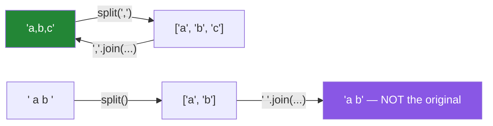

# 2.2 — `split` and `join`, the pair that does most of the work

## One-line answer

`split()` with no argument collapses runs of whitespace and drops empties, `split(sep)` does neither —
and `join` is a method on the **separator**, not on the list, which is the surprise that makes people
write a loop instead.

---

## The story

A field of author names arrives as `"Vaswani, A.; Shazeer, N.; Parmar, N."`. The job splits on `"; "`
and counts three authors. Fine.

Then a batch arrives from a different source, formatted `"Vaswani, A.;Shazeer, N.; Parmar, N."` —
inconsistent spacing after the semicolons, which is exactly what human-maintained data looks like.
`split("; ")` finds two separators instead of three and returns two authors, one of which is
`"Vaswani, A.;Shazeer, N."`. The author count in the report drops and nobody investigates, because a
paper having two authors is not surprising.

Someone fixes it with `split(";")` and then `.strip()` on each piece. Better. Then a row arrives with a
trailing semicolon — `"Vaswani, A.; Shazeer, N.;"` — and the split produces a final empty string, so
the count is three where it should be two, and an author named `""` ends up in the index.

Meanwhile, in the same file, someone is building the display string back up:

```text
display = ""
for author in authors:
    display += author + ", "
display = display[:-2]
```

which is quadratic ([Day 6, 4.1](../../../day-06-loops/parts/04-loop-cost/4.1-the-accidental-quadratic.md)),
produces `""` for an empty list minus two characters — actually raising nothing and giving `""` —
and is one line of `", ".join(authors)`.

`split` and `join` are the two methods you will use most, and both have a default behaviour that
differs from the argument behaviour in a way that decides whether your parse is right.

---

## The idea in plain language

### `split()` and `split(sep)` are two different functions

They share a name and behave differently enough that it is worth treating them as separate tools.

**`split()` — no argument, the "words" mode:**

- Splits on **any run** of whitespace: a tab and three spaces is one separator.
- **Ignores leading and trailing whitespace**, so no empty strings at the ends.
- `"  a   b  ".split()` → `["a", "b"]`
- `"".split()` → `[]`

**`split(sep)` — an explicit separator, the "fields" mode:**

- Splits on **each occurrence**, exactly.
- Two separators in a row produce an empty string between them.
- A leading or trailing separator produces an empty string at that end.
- `"a,,b,".split(",")` → `["a", "", "b", ""]`
- `"".split(",")` → `[""]` — **one empty string, not an empty list**

That last pair is worth staring at. `"".split()` is `[]` and `"".split(",")` is `[""]`, so a
"count the fields" function returns 0 or 1 for the same empty input depending on which form you used.

The reason for the difference is that the two modes answer different questions. Whitespace mode asks
"what are the words?" — and consecutive spaces do not create a word. Separator mode asks "what are the
fields?" — and `a,,b` genuinely has an empty second field, which for a CSV is information, not noise.

**Use whitespace mode for prose. Use separator mode for structured data.** Getting this backwards is
the story's first bug.

### `maxsplit`, and `rsplit`

`split(sep, maxsplit)` stops after `maxsplit` splits and leaves the rest intact. This is how you take
"the first field and everything else":

```text
"key: some: value: with: colons".split(":", 1)  ->  ["key", " some: value: with: colons"]
```

`rsplit` does the same from the right, which is how you take a file extension or a last field.
`partition(sep)` is the third member of the family and returns a **three-tuple** — before, the
separator itself, after — which never raises and never returns a variable-length list, making it the
safest of the three for "split on the first occurrence" ([2.4](2.4-find-index-and-in.md)).

### `splitlines()` is not `split("\n")`

`splitlines()` handles `\n`, `\r\n` and `\r`, plus several Unicode line separators, and **does not**
produce a trailing empty string for text ending in a newline. `split("\n")` handles one of those and
does produce the trailing empty.

For anything read from a file, `splitlines()` is the correct choice, and it is the fix for the
invisible carriage return from [1.3](../01-text/1.3-escapes-and-raw-strings.md).

### `join` is a method on the separator

`", ".join(items)` reads backwards the first fifty times. The reason it is on the string rather than on
the list is that it works on **any iterable of strings** — a list, a tuple, a generator, a set, the
keys of a dict — and a method on `list` would only work on lists.

Two rules:

- **Every item must already be a string.** `", ".join([1, 2])` raises `TypeError`. Convert first:
  `", ".join(str(x) for x in items)`.
- **It is the linear way to build a string.** Concatenating in a loop is quadratic
  ([Day 6, 4.1](../../../day-06-loops/parts/04-loop-cost/4.1-the-accidental-quadratic.md)); `join`
  computes the total length once and allocates once.



`split(sep)` and `join(sep)` are exact inverses. `split()` and `join` are **not** — whitespace mode
throws away information about how much whitespace there was, which is usually what you wanted and is
worth knowing you did.

---

## Why Setu needs it

- **[4.1](../04-normalising/4.1-the-title-normaliser.md), today,** uses `" ".join(text.split())` as the
  whitespace-collapsing idiom — the shortest correct way to turn any run of any whitespace into single
  spaces.
- **[4.3](../04-normalising/4.3-methods-before-regex.md), today,** argues that most "I need a regex"
  problems are a `split` and a `strip`.
- **Day 8's containers** (`PY-07`) receives lists from `split` and turns them into sets, and the empty
  strings from a naive split are exactly the kind of junk that ends up as a set member nobody wanted.
- **Day 26's pandas** (`PD-`) has `.str.split(expand=True)` to explode a column into several, and
  every property here — empties, `maxsplit`, whitespace mode — applies with the same consequences at
  frame scale.
- **Day 164's chunking** (`RAG-04`) splits documents on paragraph and sentence boundaries before
  embedding them; a chunker that produces empty chunks wastes model calls (Principle 5) and pollutes
  the index.

---

## The mechanism

The two modes, side by side:

```python
"""split() and split(sep) differ on runs, on ends, and on the empty string."""

cases = [
    "a b c",
    "  a   b  ",
    "a,b,c",
    "a,,b",
    "a,b,",
    ",a",
    "",
    "  ",
]

print(f"{'input':<12} {'split()':<26} {'split(,)':<26}")
for text in cases:
    print(f"{text!r:<12} {text.split()!s:<26} {text.split(',')!s:<26}")
```

**Line by line:**

- `"  a   b  "` — whitespace mode gives `['a', 'b']`: the run of three spaces is one separator and the
  ends produce nothing. Separator mode on a comma finds no comma and gives the whole string back as a
  single item, spaces included.
- `"a,,b"` — separator mode gives `['a', '', 'b']`. **The empty string is a field**, and for a CSV that
  is correct: the second column is blank. Discarding it would lose the column alignment.
- `"a,b,"` — trailing separator gives a trailing empty. This is the story's third bug, and it is why a
  count of `split(";")` results is not a count of authors.
- `""` — `split()` gives `[]` and `split(",")` gives `[""]`. **Zero items versus one item, for the same
  input.** Any function that reports "how many fields" must decide which of these it means.
- `"  "` — whitespace-only. `split()` gives `[]`; `split(",")` gives `['  ']`, one item of two spaces.
- Read the table rather than memorising it. The pattern is: whitespace mode is forgiving because it is
  answering "what are the words", separator mode is exact because it is answering "what are the
  fields".

The story's parse, fixed:

```python
"""Inconsistent separators, a trailing separator, and the parse that survives both."""

rows = [
    "Vaswani, A.; Shazeer, N.; Parmar, N.",
    "Vaswani, A.;Shazeer, N.; Parmar, N.",
    "Vaswani, A.; Shazeer, N.;",
    "",
]


def parse_naive(field: str) -> list[str]:
    """Splits on the separator plus a space. Breaks on inconsistent spacing."""
    return field.split("; ")


def parse_robust(field: str) -> list[str]:
    """Split on the separator alone, strip each piece, drop the empties."""
    return [name.strip() for name in field.split(";") if name.strip()]


for row in rows:
    print(f"{row!r:<42}")
    print(f"    naive  ({len(parse_naive(row))}): {parse_naive(row)}")
    print(f"    robust ({len(parse_robust(row))}): {parse_robust(row)}")
```

**Line by line:**

- `field.split("; ")` — splits on the two-character sequence. The second row has `";S"` with no space,
  so that separator is not found and two authors are glued together. **The count silently drops.**
- `field.split(";")` — splits on the separator alone, which is the only part the format actually
  guarantees. Whitespace around it is presentation, and presentation is handled by the `strip`.
- `if name.strip()` — the filter that drops the empty produced by a trailing separator, **and** drops a
  field that was only whitespace. Truthiness on a string, correct here because empty and
  whitespace-only mean the same thing to this parser
  ([Day 5, 2.2](../../../day-05-operators-and-conditionals/parts/02-conditionals/2.2-truthiness.md)).
- `name.strip()` appears twice — once in the filter and once in the value. That is a small
  inefficiency and a real readability cost; the comprehension form that avoids it uses a walrus or a
  generator pipeline, and [Day 9, 3.2](../../../day-09-comprehensions/parts/03-when-not-to/3.2-comprehension-scope.md)
  covers the trade.
- The empty row gives `[]` from the robust parser and `['']` from the naive one. **One of those is a
  paper with no authors and the other is a paper with one author whose name is empty**, and only the
  first is true.

And `join`, with the two rules and the idiom:

```python
"""join is a method on the separator, every item must be a string, and it is linear."""

authors = ["Vaswani, A.", "Shazeer, N.", "Parmar, N."]

print("basic       :", "; ".join(authors))
print("empty list  :", repr("; ".join([])))
print("one item    :", repr("; ".join(["only"])))

numbers = [1, 2, 3]
try:
    "; ".join(numbers)
except TypeError as exc:
    print("non-strings :", type(exc).__name__, "-", exc)
print("converted   :", "; ".join(str(n) for n in numbers))

messy = "  Attention \t\n  Is   All You  Need  "
print()
print(f"raw                     : {messy!r}")
print(f"' '.join(messy.split()) : {' '.join(messy.split())!r}")
print("newline-joined lines:")
print("\n".join(f"    {a}" for a in authors))
```

**Line by line:**

- `"; ".join(authors)` — the separator goes **between** items, so three items produce two separators.
  There is no trailing separator to trim, which is what makes the story's `display[:-2]` unnecessary.
- `"; ".join([])` is `""` and `"; ".join(["only"])` is `"only"` — **both edge cases are handled**, with
  no special-casing. The loop version needs an `if` for each.
- `"; ".join([1, 2, 3])` raises `TypeError: sequence item 0: expected str instance, int found`. The
  message names the **position**, which is useful when one item in a long list is the wrong type.
- `"; ".join(str(n) for n in numbers)` — a generator expression, so nothing intermediate is
  materialised ([Day 9, 2.3](../../../day-09-comprehensions/parts/02-dict-set-gen/2.3-the-generator-expression.md)).
  `join` consumes it in one pass.
- `" ".join(messy.split())` — **the whitespace-collapsing idiom.** Split in whitespace mode (which
  eats every run of any whitespace, including the U+00A0 non-breaking space from
  [2.1](2.1-normalising-strip-and-case.md)), then rejoin with single spaces. Two method calls replace
  a regex and several edge cases, and it is the line at the heart of
  [4.1](../04-normalising/4.1-the-title-normaliser.md).
- `"\n".join(...)` — the standard way to build multi-line output. Note it produces **no** trailing
  newline, which is usually right for a string and usually wrong for a file, where you want
  `text + "\n"` or `writelines`.

---

## When it breaks

**Joining non-strings:**

```text
>>> ", ".join([1, 2, 3])
Traceback (most recent call last):
  File "<stdin>", line 1, in <module>
TypeError: sequence item 0: expected str instance, int found
```

**What it means.** `join` will not call `str()` for you, deliberately — guessing how to render an
arbitrary object is not its job. The message names the index, so with a list of mostly-strings and one
`None` you know which one. The fix is `", ".join(str(x) for x in items)`, and if `None` is possible
you probably want to decide what it should render as rather than letting it become `"None"`.

**Joining the wrong way round:**

```text
>>> authors = ["a", "b"]
>>> authors.join(", ")
Traceback (most recent call last):
  File "<stdin>", line 1, in <module>
AttributeError: 'list' object has no attribute 'join'
```

**What it means.** Everybody writes this once. `join` lives on `str` because it accepts any iterable of
strings; a `list.join` would not work on a generator or a tuple. The error is clear, and the mnemonic
that helps is to read it as "*with this separator*, join these".

**The empty split that gives one item:**

```text
>>> len("".split(","))
1
>>> len("".split())
0
>>> "".split(",")
['']
```

**What it means.** An empty field is one empty value, not zero values, in separator mode. A "count the
authors" function built on `split(";")` reports 1 for a blank field, and that phantom author reaches
the index as an empty string. **Filter the empties explicitly** — the `if name.strip()` above — rather
than relying on the split to do it.

**And the parse that silently merged two records:**

```text
>>> "Vaswani, A.;Shazeer, N.".split("; ")
['Vaswani, A.;Shazeer, N.']
>>> len(_)
1
```

**What it means.** No error. One author, whose name contains a semicolon. This propagates to a
database, to a search index, and to a report, and the only evidence is a count that is one lower than
it should be — which nobody is watching. **Splitting on separator-plus-whitespace is fragile
whenever a human maintains the data**, and the robust form is to split on the separator alone and
strip afterwards.

---

## In production

**Do not hand-parse CSV.** Everything in this document applies to simple delimited data, and real CSV
has quoting, embedded separators, embedded newlines and escape rules that `split(",")` gets wrong the
first time a title contains a comma. Use the `csv` module (or pandas from Day 26). The place
`split` genuinely belongs is fields *within* a value — a semicolon-separated author list inside one
CSV cell — which is exactly the story, and there it is the right tool.

**`" ".join(text.split())` is the whitespace normaliser worth memorising.** It collapses any run of any
whitespace — tabs, newlines, non-breaking spaces, the lot — into single spaces and trims the ends, in
two method calls with no regex and no edge cases. It appears in almost every text pipeline, and
knowing it is what makes [4.3](../04-normalising/4.3-methods-before-regex.md)'s "methods before regex"
argument concrete.

**Build strings with `join`, always.** Concatenating in a loop is quadratic and the correction is
mechanical: collect into a list, join once. This is not a micro-optimisation — it is the difference
between a linear and a quadratic function, and it also removes the trailing-separator trimming that
the loop version needs and sometimes gets wrong on an empty input. The same reasoning extends to
building large documents, where `io.StringIO` is the tool once the pieces are numerous enough that
holding them all in a list is itself a concern.

**What changes at scale.** `split` allocates one string per field plus a list, so splitting ten million
rows into five fields each is fifty million short-lived strings — usually fine, occasionally the
bottleneck, and the fix at that point is a streaming parser or a columnar format rather than a cleverer
split. `maxsplit` is a genuine optimisation when you only need the first field of a long line: `line.split(",", 1)[0]`
does one split instead of forty. And in pandas, `.str.split()` is vectorised while a Python loop over
rows is not ([Day 6, 4.2](../../../day-06-loops/parts/04-loop-cost/4.2-the-loop-you-should-not-write.md)).

**The failure mode that only appears with real data is inconsistent formatting.** Fixtures are written
by the person writing the parser, so the separators are perfectly regular. Real data has been typed by
humans, merged from three sources, and exported by a tool with its own opinions — so the spacing is
inconsistent, some rows have trailing separators, and a few have the separator inside a quoted value.
A parser tested only on its author's own examples has never met any of that. The defence is a fixture
containing a deliberately ragged row, and a reconciliation count so a drop in parsed fields is visible.

**The review comment a senior engineer leaves.** On `field.split("; ")`: *"Split on `';'` alone and
strip each piece — the incoming data does not guarantee the space, and we are already silently merging
authors from the second source. Filter out the empties too, or a trailing semicolon gives us a blank
author in the index."*

**The interview question.** *"What is the difference between `s.split()` and `s.split(' ')`?"* The
answer is that the no-argument form splits on runs of any whitespace and discards leading and trailing
whitespace, so it never returns empty strings, while the explicit form splits on each single space
exactly and therefore produces empty strings for consecutive spaces and at the ends. The follow-up
worth having ready is *"what does `''.split(',')` return?"* — `['']`, one empty string, whereas
`''.split()` returns `[]` — which is the case that breaks field counts. If the conversation moves to
`join`, the points to make are that it is a method on the separator because it accepts any iterable of
strings, that it will not convert non-strings for you, and that it is the linear way to build a string
where `+=` in a loop is quadratic.

---

## Check yourself

```bash
uv run python -c "
for text in ['a b c', '  a   b  ', 'a,,b', 'a,b,', '', '  ']:
    print(f'{text!r:<12} split()={text.split()!s:<20} split(,)={text.split(\",\")}')
print()
print('collapse   :', repr(' '.join('  a \t\n b   c '.split())))
print('join empty :', repr('; '.join([])))
print('maxsplit   :', 'k: a: b: c'.split(':', 1))
print('partition  :', 'k: a: b'.partition(':'))
try:
    ', '.join([1, 2])
except TypeError as exc:
    print('non-strings:', exc)
"
```

The `''` row is the one that decides whether your field counts are right.

**Answer out loud, without scrolling up:**

> Give the three differences between `split()` and `split(sep)`, and say what each mode is for. Then
> explain why `join` is a method on the separator, and why building a string with `+=` in a loop is
> worse than a `join`.

---

**Next:** [2.3 — `replace`, `removeprefix`, and the substitution that went too far](2.3-replace-and-removeprefix.md)
