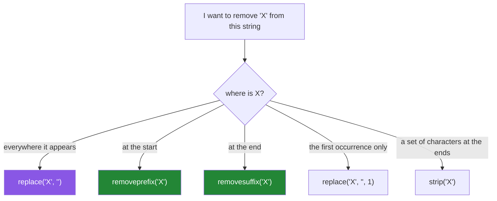

# 2.3 — `replace`, `removeprefix`, and the substitution that went too far

## One-line answer

`replace(old, new)` substitutes **every** occurrence anywhere in the string, `removeprefix` and
`removesuffix` act only at the ends and only on an exact match — and using the first where you meant
one of the latter is how `"scientific"` becomes `"scienti"` and nobody notices.

---

## The story

A cleaner strips file extensions before indexing. It is one line:

```text
name = filename.replace(".pdf", "")
```

It works on every file anybody tests it with. Months later, someone reports that a paper titled
*"A Study of .pdf Rendering Artifacts"* is indexed as *"A Study of  Rendering Artifacts"* — the
mention of the format in the title has vanished, because `replace` does not care where the match is.

Worse is found the same afternoon. A different cleaner removes a source prefix:

```text
paper_id = raw_id.replace("arxiv:", "")
```

and an id of `"arxiv:2301.arxiv:00001"` — malformed, from a bad merge upstream — becomes
`"2301.00001"`, which is a **valid-looking id for a different paper**. The record is silently
attributed to the wrong document. There is no error, no warning, and no way to tell from the output
that anything happened.

Both bugs are one method used for a job it does not do. `replace` substitutes everywhere; the tools
for "at the start" and "at the end" are `removeprefix` and `removesuffix`, and they arrived in Python
3.9 precisely because this mistake was everywhere.

---

## The idea in plain language

### `replace` is global, and that is its whole personality

`s.replace(old, new)` returns a new string with **every** non-overlapping occurrence of `old`
replaced by `new`. Not the first. Not the one at the start. All of them.

`s.replace(old, new, count)` limits it to the first `count` occurrences — the parameter people forget
exists, and the correct tool when you genuinely want "just the first one".

Three properties that follow:

- **It never raises.** If `old` is not present, you get the original string back. A `replace` that did
  nothing is indistinguishable from one that did something, unless you compare.
- **It is not anchored.** There is no notion of "at the beginning" — that is what the story's second
  bug relies on.
- **Chained replaces apply in order**, and each one sees the output of the last. That is a real hazard:
  `.replace("a", "b").replace("b", "c")` turns an original `a` into `c`, which is almost never what
  was intended.

### `removeprefix` and `removesuffix` are anchored and exact

- `s.removeprefix(p)` — returns `s` without `p` **if `s` starts with `p`**, otherwise returns `s`
  unchanged.
- `s.removesuffix(x)` — the same at the other end.

Both are exact-string operations, both leave the value alone when there is no match, and both do
exactly one removal. They are what `replace` is not.

Before 3.9 people wrote `s[len(p):]` guarded by `startswith`, and the unguarded version —
`s[len(p):]` with no check — silently chops characters off any string that did not have the prefix.
That is the same family of bug and is still common in older code.

### The three ways this goes wrong, ranked



1. **`replace` where you meant `removesuffix`** — the `.pdf` bug. Fires only when the text also
   appears in the middle, which is rare enough to survive testing and common enough to happen.
2. **`replace` where you meant `removeprefix`** — the `arxiv:` bug. Worse, because the result can be a
   plausible identifier for something else.
3. **`strip` where you meant `removeprefix`** — the character-set trap from
   [2.1](2.1-normalising-strip-and-case.md). `strip("https://")` eats letters.

### `str.translate` — the one-pass many-character replacement

When you have several single-character substitutions to make — normalising exotic whitespace, mapping
smart quotes to plain ones — a chain of `replace` calls is one full pass over the string **per call**.
`str.translate` does all of them in a single pass using a table built by `str.maketrans`.

For two or three replacements the difference is irrelevant. For a normaliser applied to ten million
rows it is the difference between one pass and eight, and the table is built once
([Day 6, 4.1](../../../day-06-loops/parts/04-loop-cost/4.1-the-accidental-quadratic.md)'s "build the
index once" idea, applied to characters).

`maketrans` also takes a third argument: characters to **delete** entirely. That is the clean way to
strip punctuation from a key.

---

## Why Setu needs it

- **[4.1](../04-normalising/4.1-the-title-normaliser.md), today,** normalises smart quotes, dashes and
  exotic spaces — a job for `translate`, not for eight chained `replace` calls.
- **[4.3](../04-normalising/4.3-methods-before-regex.md), today,** is where the boundary sits: a fixed
  substitution is `replace`, a *pattern* substitution is `re.sub`, and reaching for the second when
  the first would do is a common over-engineering.
- **Day 8's dedup keys** (`PY-08`) are built by exactly this kind of cleaning, and a key built with a
  greedy `replace` merges two distinct papers into one — the opposite of the missed-duplicate failure
  in [2.1](2.1-normalising-strip-and-case.md), and harder to detect.
- **Day 26's pandas** (`PD-`) has `.str.replace()` with a `regex=` parameter whose default changed
  between versions — a live example of why Principle 4 says to pin and to read the signature.
- **Day 130's prompt templates** (`LLM-`) substitute placeholders into text. A `replace` that matches
  more than the placeholder corrupts the prompt, and the model's answer is wrong in a way that looks
  like a model problem rather than a string problem.

---

## The mechanism

The two story bugs, and their fixes:

```python
"""replace is global. The tools for 'at an end' are removeprefix and removesuffix."""

filenames = [
    "attention.pdf",
    "A Study of .pdf Rendering Artifacts.pdf",
    "notes.txt",
]

print("replace('.pdf', '') - global, so it eats the mention in the middle:")
for name in filenames:
    print(f"    {name!r:<44} -> {name.replace('.pdf', '')!r}")

print()
print("removesuffix('.pdf') - anchored and exact:")
for name in filenames:
    print(f"    {name!r:<44} -> {name.removesuffix('.pdf')!r}")

print()
ids = ["arxiv:2301.00001", "arxiv:2301.arxiv:00001", "doi:10.1000/xyz"]
print("replace('arxiv:', '') vs removeprefix('arxiv:'):")
for raw in ids:
    print(
        f"    {raw!r:<28} replace={raw.replace('arxiv:', '')!r:<20} prefix={raw.removeprefix('arxiv:')!r}"
    )
```

**Line by line:**

- `"A Study of .pdf Rendering Artifacts.pdf".replace(".pdf", "")` — **both** occurrences go, giving
  `"A Study of  Rendering Artifacts"` with a double space where the middle one was. The double space is
  the only visible trace, and it survives a casual read.
- `removesuffix(".pdf")` — removes only the trailing one and leaves the mention in the title alone.
  On `"notes.txt"` it returns the string unchanged, with no error, which is the right behaviour for a
  cleaner applied to a mixed list.
- `"arxiv:2301.arxiv:00001".replace("arxiv:", "")` — gives `"2301.00001"`, a **plausible id for a
  different paper**. `removeprefix` gives `"2301.arxiv:00001"`, which is visibly malformed and will
  fail a validation check. **The buggy version produces valid-looking output and the correct version
  produces something you can catch**, which is exactly the right way round.
- `"doi:10.1000/xyz".removeprefix("arxiv:")` — unchanged, because the prefix is not there. No error,
  and no accidental chopping.

The chained-replace hazard, and `translate`:

```python
"""Chained replaces see each other's output. translate does one pass and does not."""

text = "abc"
print("chained  :", text.replace("a", "b").replace("b", "c"))
print("           - the original 'a' became 'b' and then 'c'")

table = str.maketrans({"a": "b", "b": "c"})
print("translate:", text.translate(table))
print("           - each character is mapped once, from the original")

smart = "The “attention” paper — a ‘must’ read here"
print()
print(f"raw       : {smart!r}")

chained = (
    smart.replace("“", '"')
    .replace("”", '"')
    .replace("‘", "'")
    .replace("’", "'")
    .replace("—", "-")
    .replace(" ", " ")
)
print(f"6 replaces: {chained!r}")

PUNCTUATION_MAP = str.maketrans(
    {
        "“": '"',
        "”": '"',
        "‘": "'",
        "’": "'",
        "—": "-",
        "–": "-",
        " ": " ",
    }
)
print(f"translate : {smart.translate(PUNCTUATION_MAP)!r}")
print("identical :", chained == smart.translate(PUNCTUATION_MAP))
```

**Line by line:**

- `text.replace("a", "b").replace("b", "c")` on `"abc"` gives `"ccc"` — the original `a` was turned
  into `b` by the first call and then into `c` by the second, and the original `b` also became `c`.
  **Chained replaces are not independent substitutions**, and this bites whenever the replacement of
  one rule is the target of another.
- `str.maketrans({...})` — builds a translation table from a dict. `translate` maps each character of
  the **original** exactly once, so no rule can see another's output. It is the correct tool whenever
  the substitutions could interact.
- `"“"` — a left double quotation mark, written as an escape so the source file's own encoding
  cannot corrupt it ([1.3](../01-text/1.3-escapes-and-raw-strings.md)). In real code you would write
  the character directly with a comment; here the escape is unambiguous.
- The six chained replaces make **six passes** over the string. `translate` makes one.
- `PUNCTUATION_MAP` at module level in real code — built once, reused. Building it inside a function
  called per row rebuilds it per row, which is the "build the index once" mistake in miniature.
- `chained == smart.translate(...)` is `True` here because none of these six rules feeds another. The
  point is that `translate` is correct **whether or not** they do, and the chain is only correct
  because you checked.

And `maketrans`'s third argument, plus `count`:

```python
"""Deleting characters, and limiting a replace to the first n occurrences."""

title = "Attention, Is All You Need! (Revised)"

DROP_PUNCTUATION = str.maketrans("", "", ",!()")
print(f"raw            : {title!r}")
print(f"punctuation out: {title.translate(DROP_PUNCTUATION)!r}")

path = "data/raw/2023/raw/file.csv"
print()
print(f"raw          : {path!r}")
print(f"replace all  : {path.replace('raw', 'clean')!r}")
print(f"replace first: {path.replace('raw', 'clean', 1)!r}")
print(f"removeprefix : {path.removeprefix('data/')!r}")
```

**Line by line:**

- `str.maketrans("", "", ",!()")` — the three-argument form: characters to map *from*, characters to
  map *to*, and characters to **delete**. Two empty strings plus a set to drop is the idiom for
  "remove these characters entirely", and it is one pass.
- `title.translate(DROP_PUNCTUATION)` — commas, exclamation marks and parentheses gone. This is a
  common step in building a comparison key, and doing it with `translate` rather than four `replace`
  calls is both faster and immune to interaction.
- `path.replace("raw", "clean")` — replaces **both** occurrences, including the directory named `raw`
  deeper in the path. Probably not what was meant.
- `path.replace("raw", "clean", 1)` — the `count` parameter, replacing only the first. **This is the
  parameter people do not know exists**, and it is the right tool when "the first one" is genuinely
  what you mean.
- `path.removeprefix("data/")` — a different question again: strip a known leading component. Four
  lines, four different correct answers to four different questions, and the skill is knowing which
  question you are asking.

---

## When it breaks

**It does not raise. Ever:**

```text
>>> "notes.txt".removesuffix(".pdf")
'notes.txt'
>>> "notes.txt".replace(".pdf", "")
'notes.txt'
>>> "A Study of .pdf Rendering.pdf".replace(".pdf", "")
'A Study of  Rendering'
```

**What it means.** All three succeed. The third quietly removed something in the middle and left a
double space as the only evidence. **There is no error case for `replace` at all** — it either finds
matches or it does not — so every bug it causes is silent by construction, and the only defence is
choosing the right method.

**The unguarded slice, which is the pre-3.9 version of the same bug:**

```text
>>> raw = "doi:10.1000/xyz"
>>> raw[len("arxiv:"):]
'0.1000/xyz'
```

**What it means.** `len("arxiv:")` is 6, so this chopped six characters off a string that never had
the prefix, producing a corrupted id with no error. This idiom is everywhere in code written before
3.9, and it is worth grepping for: `[len(` is a reliable signal.

**The chained replace that collided:**

```text
>>> "cat".replace("c", "b").replace("b", "d")
'dat'
>>> "cab".replace("c", "b").replace("b", "d")
'dad'
```

**What it means.** In the second, the original `b` and the newly-created `b` are indistinguishable by
the time the second `replace` runs, so both become `d`. The intent was almost certainly `c→b` and
`b→d` as independent rules, which is `str.translate`. **Any chain of replaces where one rule's output
could match another's input is a bug waiting for the right data.**

**And the empty-string replace:**

```text
>>> "abc".replace("", "-")
'-a-b-c-'
>>> "abc".count("")
4
```

**What it means.** An empty string matches at every position including the ends, so replacing it
inserts the new text between every character. This looks like a joke and arrives in real code when the
`old` argument is computed and turns out to be empty — a config value that was not set, a captured
group that matched nothing. A guard (`if old:`) before a computed replace is cheap insurance.

---

## In production

**Pick the method that matches the anchoring you mean, and let the linter help.** `removeprefix` and
`removesuffix` say what they do in their names, cannot over-match, and return the input unchanged when
there is no match — which is the right behaviour for a cleaner applied to heterogeneous data. Ruff's
`FURB` rules can flag the `s[len(p):]` idiom and suggest the replacement, and adding that rule family
is a one-line change that finds every instance of the pre-3.9 pattern in a codebase.

**Use `translate` for character-level normalisation and build the table once.** A module-level
`str.maketrans` table used by a per-row normaliser is one object and one pass; eight chained `replace`
calls inside the function are eight passes and eight allocations per row. More importantly, `translate`
is immune to rule interaction, so the normaliser stays correct when somebody adds a ninth rule without
thinking about ordering.

**Know where the boundary with regex is.** `replace` handles a fixed string; `re.sub` handles a
pattern. If you are chaining several `replace` calls to approximate a pattern — every variant of a
prefix, every kind of dash — the regex is clearer and the honest choice. If you are reaching for a
regex to remove a single known suffix, you have over-engineered it and made it slower.
[4.3](../04-normalising/4.3-methods-before-regex.md) draws this line properly.

**What changes at scale.** Every `replace` allocates a new string and makes a full pass, so the cost of
a normaliser is roughly (number of rules) × (length of text) × (number of rows). Collapsing character
rules into one `translate` divides the first factor; in pandas, `.str.replace()` is vectorised and a
Python loop over rows is not; and at very large scale the real answer is to normalise once at ingestion
and store the result rather than normalising on every read
([2.1](2.1-normalising-strip-and-case.md)'s "keep the original, store the key").

**The failure mode that only appears with real data is the value that contains its own delimiter.** A
title mentioning `.pdf`, an id containing a repeated prefix from a bad merge, a path with a directory
named the same as the thing you are replacing. None of these appear in a hand-written fixture, all of
them appear in a million rows, and every one produces plausible output. The defence is a fixture that
deliberately contains the target string in the middle as well as at the end — one extra test case that
would have caught both story bugs.

**The review comment a senior engineer leaves.** On `name.replace(".pdf", "")`: *"`removesuffix('.pdf')`
— `replace` is global, so a title mentioning `.pdf` loses it from the middle. Same for the `arxiv:`
strip below, which is worse: on a doubled prefix it produces a valid id for a different paper rather
than something we would notice."*

**The interview question.** *"How do you remove a suffix from a string?"* If the answer is
`s.replace(suffix, "")`, the follow-up writes itself: what happens when the suffix also appears in the
middle? The right answer is `s.removesuffix(suffix)` (3.9+), or `s[: -len(suffix)] if
s.endswith(suffix) else s` before that — and the guard matters, because the unguarded slice silently
truncates strings that did not have the suffix. Strong candidates add that `replace` takes a `count`
parameter for "the first n only", and that when several character-level substitutions are needed,
`str.translate` with a prepared table does them in one pass and — unlike chained `replace` calls —
cannot have one rule consume another's output.

---

## Check yourself

```bash
uv run python -c "
n = 'A Study of .pdf Rendering.pdf'
print('replace   :', repr(n.replace('.pdf', '')))
print('removesuf :', repr(n.removesuffix('.pdf')))
i = 'arxiv:2301.arxiv:00001'
print('replace   :', repr(i.replace('arxiv:', '')), '<- valid-looking, wrong paper')
print('removepre :', repr(i.removeprefix('arxiv:')))
print('chained   :', 'cab'.replace('c', 'b').replace('b', 'd'))
print('translate :', 'cab'.translate(str.maketrans({'c': 'b', 'b': 'd'})))
print('count=1   :', 'data/raw/x/raw/y'.replace('raw', 'clean', 1))
print('empty old :', repr('abc'.replace('', '-')))
"
```

Every line succeeds. Four of them are bugs.

**Answer out loud, without scrolling up:**

> Say what `replace` does that `removesuffix` does not, and give an input where the difference matters.
> Then explain why two chained `replace` calls are not two independent substitutions, and what to use
> instead.

---

**Next:** [2.4 — `find` versus `index` versus `in`: sentinel, exception, or question](2.4-find-index-and-in.md)
