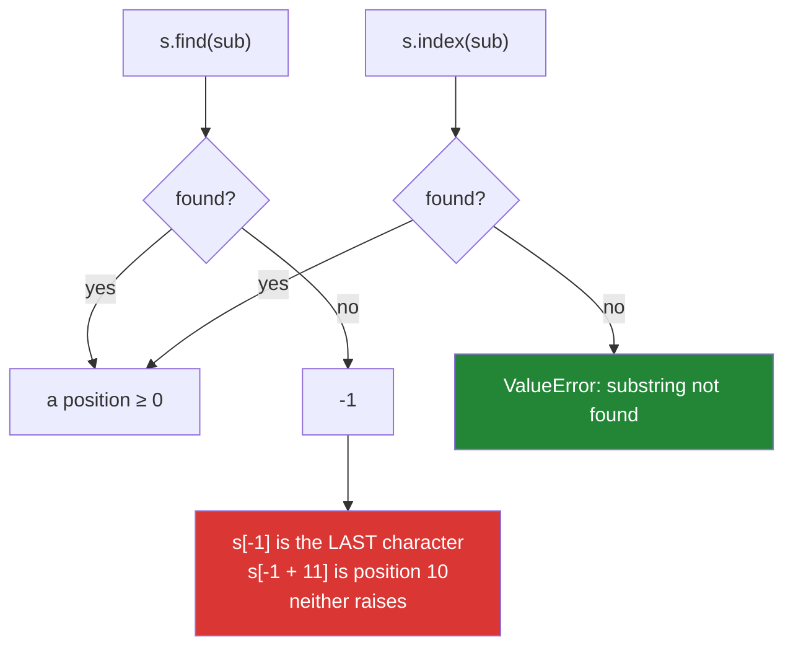

# 2.4 — `find` versus `index` versus `in`: sentinel, exception, or question

## One-line answer

`find` returns `-1` when there is no match, `index` raises `ValueError`, and `in` returns a boolean —
three answers to the same question, and choosing `find` without checking for `-1` turns "not found"
into the index of the last character.

---

## The story

"How many steps to the exit?"

"Minus one."

Minus one is not a number of steps. It is somebody's way of saying *there is no exit*, and if you
understand that, you stop and ask a different question. If you do not — if you take it literally and
step backwards once — you end up somewhere. Not nowhere. **Somewhere**, confidently, and it is the
wrong place, and nothing about standing there feels like an error.

Python has a function that answers "where is this?" with minus one when the answer is "nowhere", and
Python is also a language where minus one is a perfectly good position: it means the last character.
Those two facts together are a trap.

A log parser pulls the request id out of a line by finding a marker:

```text
start = line.find("request_id=")
request_id = line[start + len("request_id="):].split()[0]
```

Every line in the sample has the marker. In real logs some lines do not — a health check, a startup
banner, the middle of a stack trace. On those, `find` hands back `-1`.

`-1 + 11` is `10`. So the code starts reading at position 10 of a line that has no request id at all,
takes the first word it finds, and produces something like `"GET"` or `"level=INFO"`. It is text. It
looks like an id. It goes into the index.

The dashboard now shows requests with ids like `"GET"` and `"Traceback"`, each apparently happening
thousands of times, and somebody spends a day investigating a busy endpoint that does not exist.

**Minus one is a valid position.** That is the whole bug: the value that means "not here" cannot be
told apart, arithmetically, from a real answer, and negative positions mean the slice does not even
complain. `index` would have stopped on the first bad line with `ValueError`.

---

## The idea in plain language

### Three tools, three answers to "is it there?"

| You want to know | Use | On failure |
|---|---|---|
| Is it present at all? | `sub in s` | `False` |
| Where is it, and absence is normal? | `s.find(sub)` | `-1` |
| Where is it, and absence is a bug? | `s.index(sub)` | `ValueError` |

They are otherwise identical: same search, same optional `start`/`end` bounds, same right-hand
variants (`rfind`, `rindex`).

**The choice is entirely about what should happen when the substring is missing**, and that is a
design decision about your data, not a style preference.

### Why `-1` is dangerous specifically in Python

In a language without negative indexing, `s[-1]` would raise and the bug would surface immediately.
Python defines `s[-1]` as the last character, so:

- `s[find_result]` where the result is `-1` gives you the **last character**, silently.
- `s[find_result:]` gives the **last character onwards**, silently.
- `s[find_result + n:]` gives something arbitrary, silently — the story.

So the sentinel is not merely unchecked, it is *actively camouflaged* by another feature of the
language. `-1` is the one sentinel value that Python's own indexing rules will accept without
complaint.

The rule that follows: **if you call `find`, the very next line must test for `-1`.** If you do not
want to write that test, you wanted `index` or `in`.



### `partition` — the one that cannot go wrong

`s.partition(sep)` returns a **three-tuple**: everything before the separator, the separator itself,
and everything after. When the separator is absent it returns `(s, "", "")` — the whole string, then
two empties.

That shape is what makes it safe. There is no sentinel to check and no exception to catch; the middle
element is empty exactly when there was no match, and unpacking always gives three names. For the
story's job — "take what follows this marker" — `partition` is strictly better than `find` plus
arithmetic:

```text
_, marker, rest = line.partition("request_id=")
request_id = rest.split()[0] if marker else None
```

`rpartition` does the same from the right, which is the tool for splitting off a file extension or a
last path component.

### `startswith` and `endswith` take tuples

`s.startswith(("http://", "https://"))` is `True` if it starts with either. This is the clean way to
test several prefixes, and it avoids both a chain of `or`s and a regex. `endswith` behaves the same.

They also take `start` and `end` bounds, which lets you ask "does it start with this *at position
10*" — occasionally exactly what a fixed-format parser needs.

### `count`, and the overlap it does not find

`s.count(sub)` counts **non-overlapping** occurrences. `"aaa".count("aa")` is `1`, not `2`, because
after matching positions 0–1 the search resumes at position 2. This matters for anything counting
repeated patterns, and the workaround is a loop over `find` with an explicit start — or an
acknowledgement that you wanted a different question.

---

## Why Setu needs it

- **[4.1](../04-normalising/4.1-the-title-normaliser.md), today,** extracts and trims parts of a title;
  every extraction is one of these three tools plus a decision about absence.
- **[4.3](../04-normalising/4.3-methods-before-regex.md), today,** notes that `partition` and
  `startswith` cover most of what people reach for `re.match` to do.
- **Day 8's lookups** (`PY-08`) generalises the same three-way choice to dictionaries: `d[k]` raises,
  `d.get(k)` returns `None`, `k in d` is a boolean — **exactly the same design decision**, and
  recognising the pattern is what makes both feel obvious.
- **Day 18's exceptions** (`PY-22`) is where "raise or return a sentinel" becomes an explicit API
  design question, and this part is the concrete instance you will refer back to.
- **Day 150's tokenizer work and Day 164's chunking** (`RAG-04`) locate boundaries inside documents.
  An unchecked `-1` there produces a chunk starting near the end of the document — which does not
  raise, embeds fine, and quietly poisons a retrieval index.

---

## The mechanism

The three tools, and the sentinel that is also an index:

```python
"""find, index and in on the same search. Then the -1 that does not raise."""

line = "2026-08-25 INFO request_id=abc123 status=200"
missing = "2026-08-25 INFO healthcheck ok"

for label, text in (("has marker", line), ("no marker", missing)):
    print(f"{label}:")
    print(f"    'request_id=' in text : {'request_id=' in text}")
    print(f"    text.find('request_id='): {text.find('request_id=')}")
    try:
        print(f"    text.index('request_id='): {text.index('request_id=')}")
    except ValueError as exc:
        print(f"    text.index('request_id='): ValueError: {exc}")

print()
print("the sentinel is a valid index, which is the whole problem:")
start = missing.find("request_id=")
print(f"    start                     = {start}")
print(f"    missing[start]            = {missing[start]!r}   <- the LAST character")
print(f"    missing[start:]           = {missing[start:]!r}")
print(f"    missing[start + 11:]      = {missing[start + 11 :]!r}   <- the story")
```

**Line by line:**

- `'request_id=' in text` — the cheapest question, and the right one when you only need yes or no. It
  dispatches to `str.__contains__`
  ([Day 5, 3.2](../../../day-05-operators-and-conditionals/parts/03-the-or-trap/3.2-in-is-an-operator.md)),
  which for strings is a substring search rather than a character check.
- `text.find(...)` on the missing line returns `-1`. **No error.** The value is returned and it is up
  to you to notice.
- `text.index(...)` raises `ValueError: substring not found`. The message does not include the
  substring — a small annoyance worth knowing, so wrap it if the context matters.
- `missing[start]` with `start == -1` gives the last character of the line. **Python's negative
  indexing turns the sentinel into a legitimate position**, which is why this bug is silent here and
  would be loud in most other languages.
- `missing[start + 11:]` is `"k"` here — the tail of the line from position 10. In the story's longer
  lines it was a whole token that looked like an id. The arithmetic is what makes the result plausible
  rather than obviously wrong.

The story's parser, three ways:

```python
"""The same extraction with a sentinel, an exception, and a partition."""

lines = [
    "2026-08-25 INFO request_id=abc123 status=200",
    "2026-08-25 INFO healthcheck ok",
]

MARKER = "request_id="


def extract_unchecked(line: str) -> str:
    """The bug: find's -1 is used as an index."""
    start = line.find(MARKER)
    return line[start + len(MARKER) :].split()[0]


def extract_checked(line: str) -> str | None:
    """find, with the check that must always follow it."""
    start = line.find(MARKER)
    if start == -1:
        return None
    return line[start + len(MARKER) :].split()[0]


def extract_partition(line: str) -> str | None:
    """No sentinel to check and no exception to catch."""
    _before, marker, rest = line.partition(MARKER)
    if not marker:
        return None
    return rest.split()[0]


for line in lines:
    print(f"{line[:38]!r}")
    print(f"    unchecked : {extract_unchecked(line)!r}")
    print(f"    checked   : {extract_checked(line)!r}")
    print(f"    partition : {extract_partition(line)!r}")
```

**Line by line:**

- `extract_unchecked` on the healthcheck line returns `"ok"` — a plausible request id, from a line that
  has none. **This is the dashboard's phantom endpoint.**
- `if start == -1: return None` — the check that must follow every `find`. Note it is `== -1`, not
  `< 0`: `find` returns exactly `-1` or a valid index, and the specific comparison documents that.
- `line[start + len(MARKER) :]` — the arithmetic. `len(MARKER)` rather than a hard-coded `11` so the
  two cannot drift when the marker changes, which is the kind of small discipline that prevents a
  whole class of off-by-one.
- `_before, marker, rest = line.partition(MARKER)` — always three values, so the unpacking cannot fail
  ([Day 6, 1.3](../../../day-06-loops/parts/01-iteration/1.3-enumerate-and-zip.md)'s unpacking rules).
  `_before` with a leading underscore signals it is deliberately unused.
- `if not marker:` — the middle element is `""` exactly when there was no match, so this **is** the
  absence check, with no arithmetic and no sentinel. Truthiness is correct here because the separator
  is either the exact separator or empty
  ([Day 5, 2.2](../../../day-05-operators-and-conditionals/parts/02-conditionals/2.2-truthiness.md)).
- `-> str | None` on both correct versions — the signature says absence is possible, so a type checker
  makes the caller handle it. The unchecked version claims `-> str` and is lying.

And the family: bounds, tuples, and non-overlapping counts:

```python
"""The parameters and siblings that remove the need for a regex."""

url = "https://arxiv.org/abs/1706.03762"
text = "the paper the paper the"

print("startswith takes a TUPLE:")
print("   ", url.startswith(("http://", "https://")))
print("   ", url.startswith("ftp://"))

print("find/index take start and end bounds:")
print("    first 'the' :", text.find("the"))
print("    next  'the' :", text.find("the", 4))
print("    from the right:", text.rfind("the"))

print("count is NON-overlapping:")
print("    'aaa'.count('aa') =", "aaa".count("aa"), " <- 1, not 2")
print("    'the' in text     =", text.count("the"))

print("rpartition splits off the LAST occurrence:")
print("   ", url.rpartition("/"))
print("   ", "notes.tar.gz".rpartition("."))
print("   ", "noextension".rpartition("."))
```

**Line by line:**

- `url.startswith(("http://", "https://"))` — a tuple of candidates, `True` if any matches. Cleaner
  than `a or b` and much cleaner than a regex, and it extends to a tuple of twenty prefixes without
  changing shape.
- `text.find("the", 4)` — the `start` bound, which is how you walk every occurrence: find, then search
  again from just past the match. That loop is the manual version of `finditer` and is the correct way
  to count **overlapping** matches, which `count` will not do.
- `"aaa".count("aa")` is `1`. After matching positions 0–1, the search resumes at 2, so the overlapping
  match at 1–2 is never seen. Worth knowing before you write a "how many times does this pattern
  repeat" check.
- `url.rpartition("/")` — `('https://arxiv.org/abs', '/', '1706.03762')`. The last path component,
  without splitting the whole URL.
- `"noextension".rpartition(".")` — `('', '', 'noextension')`. **When there is no separator,
  `rpartition` puts the whole string in the third element** and `partition` puts it in the first. That
  asymmetry is deliberate and occasionally surprising; the rule is that the string ends up on the side
  the search came from.

---

## When it breaks

**`index` raising, which is the outcome you usually want:**

```text
>>> "healthcheck ok".index("request_id=")
Traceback (most recent call last):
  File "<stdin>", line 1, in <module>
ValueError: substring not found
```

**What it means.** The substring is not there. The message does not say *which* substring, which is
worth wrapping when the context is not obvious from the traceback. **This is a good failure**: it
happens on the first bad line, at the line that made the wrong assumption.

**`find` not raising, which is the outcome that costs a day:**

```text
>>> line = "healthcheck ok"
>>> start = line.find("request_id=")
>>> start
-1
>>> line[start + 11:]
'k'
>>> line[start + 11:].split()
['k']
```

**What it means.** Every step succeeds and produces a plausible value. `-1 + 11` is `10`, position 10
of a 14-character string is `'k'`, and `split()` on that gives a one-item list, so even the `[0]` at
the end of the story's expression works. **Four operations, no error, wrong answer** — the failure
signature this whole week keeps returning to.

**The unpacking that assumed a match:**

```text
>>> key, value = "no-equals-here".split("=")
Traceback (most recent call last):
  File "<stdin>", line 1, in <module>
ValueError: not enough values to unpack (expected 2, got 1)
```

**What it means.** `split` returned one item and two names were expected. This is the `split` version
of the same problem — and `partition` is the fix, because it always returns exactly three. Note the
error is a `ValueError` like `index`'s, and it is similarly a *good* failure: loud, immediate, and at
the line that was wrong.

**And the empty needle:**

```text
>>> "abc".find("")
0
>>> "abc".index("")
0
>>> "" in "abc"
True
```

**What it means.** The empty string is found at position 0 in everything, including in the empty
string. So a search for a computed substring that turned out to be empty **always succeeds**, at
position 0, and the code proceeds as if it found something. A guard before a computed search — the
same `if needle:` discipline as
[2.3](2.3-replace-and-removeprefix.md)'s empty-`old` replace — is cheap.

---

## In production

**Pick the tool by what absence means.** If missing is normal and the caller must handle it, return
`None` from your own function — and use `partition` or a checked `find` internally so the `None` is
explicit. If missing means the input violated its contract, `index` (or an explicit `raise`) puts the
failure at the line that made the assumption, which is where it is cheapest to diagnose. What you must
not do is use `find` and skip the check, because Python's negative indexing will hide the sentinel.

**`partition` is under-used and should be the default for "split on the first occurrence".** It cannot
raise, cannot return a variable-length result, and its absence case is testable with one truthiness
check. In a parser that handles heterogeneous lines — log files, headers, config — it removes an
entire class of unpacking and sentinel bugs. The same argument applies to `rpartition` for suffixes.

**Recognise that this is the same design question as `dict[k]` versus `dict.get(k)`.** Day 8 makes it
explicit, and seeing it twice is what turns it from two facts into one principle: **an API that cannot
find something must either raise, return a sentinel the caller is forced to notice, or answer a
boolean question — and returning a sentinel that is silently valid in the caller's next operation is
the worst of the three.** `-1` in a language with negative indexing is the canonical example of that
worst case, and it is worth remembering when designing your own return values.

**What changes at scale.** All of these are `O(n·m)` in the worst case, with CPython using a
specialised two-way algorithm that is close to linear in practice, so scanning is rarely the
bottleneck. What does matter is doing it repeatedly: checking twenty prefixes with twenty
`startswith` calls is twenty passes, where one `startswith(tuple)` is one. And for "does this text
contain any of ten thousand terms", the answer is not a loop of `in` checks at all — it is a set of
tokens ([Day 8, 2.1](../../../day-08-containers/parts/02-sets-and-dicts/2.1-a-set-is-a-hash-table.md))
or an Aho–Corasick automaton, which is the string equivalent of building the index once
([Day 6, 4.1](../../../day-06-loops/parts/04-loop-cost/4.1-the-accidental-quadratic.md)).

**The failure mode that only appears with real data is the line that does not fit the format.** Sample
log files are curated; real ones contain health checks, banners, stack traces spanning lines, and
truncated writes from a process that was killed. A parser tested only on well-formed lines has never
exercised its not-found path, and with `find` that path produces plausible garbage rather than an
error. The defence is a fixture containing a line without the marker, and a counter for how many lines
were skipped — because a skip rate that jumps is an upstream change you want to know about.

**The review comment a senior engineer leaves.** On `start = line.find(MARKER)` followed directly by
arithmetic: *"`find` returns `-1` when the marker is absent, and `-1 + len(MARKER)` is a valid index —
so health-check lines will produce a plausible-looking id rather than failing. Use `partition`, or
check for `-1` on the next line. And log a counter for lines we skip."*

**The interview question.** *"What is the difference between `str.find` and `str.index`?"* The answer is
that `find` returns `-1` when the substring is absent and `index` raises `ValueError`. The follow-up
that finds real experience is *"which would you use?"* — and the strong answer is that it depends on
whether absence is normal or a contract violation, plus the specific warning that `-1` is a valid
Python index, so an unchecked `find` result used in a slice produces plausible garbage instead of an
error, which makes `index` the safer default and `partition` better than both when you want the text
around the match. If they push further, noting that this is the same design question as `d[k]` versus
`d.get(k)` shows you see the pattern rather than the two methods.

---

## Check yourself

```bash
uv run python -c "
line = '2026-08-25 INFO healthcheck ok'
start = line.find('request_id=')
print('find      :', start)
print('line[start]:', repr(line[start]), '<- the last character')
print('slice     :', repr(line[start + 11:]), '<- plausible garbage')
try:
    line.index('request_id=')
except ValueError as exc:
    print('index     :', exc)
print('partition :', line.partition('request_id='))
print('in        :', 'request_id=' in line)
print('empty find:', 'abc'.find(''), '<- always 0')
print('count     :', 'aaa'.count('aa'), '<- non-overlapping')
"
```

Two lines produce a value where you wanted an error. Say which before running.

**Answer out loud, without scrolling up:**

> Give the three answers `find`, `index` and `in` return when the substring is absent, and say which
> to use in each situation. Then explain why `-1` is specifically dangerous in Python, and what
> `partition` returns when there is no match.

---

**Next:** [3.1 — What an f-string actually compiles to](../03-formatting/3.1-what-an-f-string-compiles-to.md)
