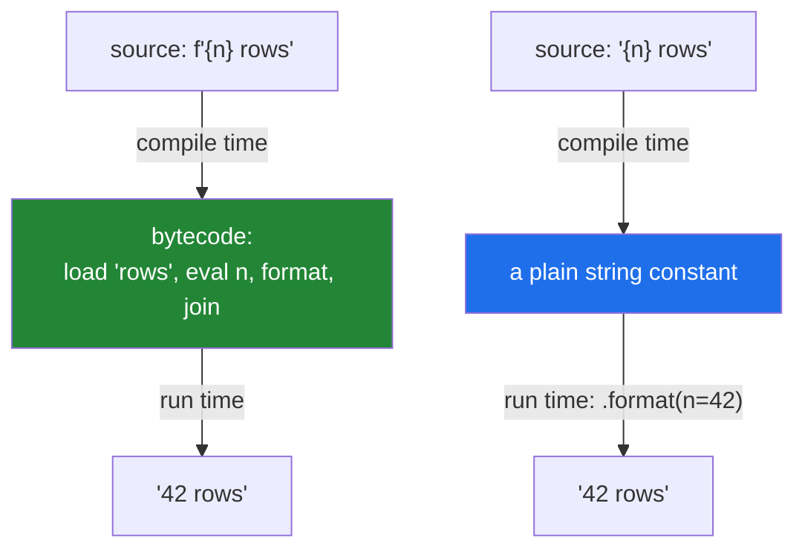

# 3.1 — What an f-string actually compiles to

## One-line answer

An f-string is not a template — it is **syntax**, compiled at import time into a sequence of
expression evaluations and a join, which is why it is the fastest formatting in Python and why it
cannot be used as a reusable template stored in a config file.

---

## The story

There are two things on the desk at a doctor's reception, and they look almost the same.

One is a **blank appointment card**: *"Dear ______, your appointment is on ______ at ______."* The
blanks are still blanks. You can fill them in for anybody.

The other is a **finished card**, already filled in for Mr Patel on Tuesday at nine. If you photocopy
that one and hand it to the next patient, there is nothing left to fill in. The blanks were used up
before you got there.

Nobody confuses the two when they are holding them. In code they look identical, and the difference
is *when the filling in happened*.

A team moves their log messages into a configuration file so that operators can change the wording
without a deploy:

```text
# messages.yaml
retry: "attempt {attempt} of {total} failed: {error}"
```

The loader reads that line, and the code does:

```text
message = f"{config['retry']}"
log.warning(message)
```

The logs now say, on every retry, `attempt {attempt} of {total} failed: {error}`. Literally that,
braces and all.

The developer's picture was that an f-string *fills in* any text containing braces. It does not. The
`f` is an instruction to the compiler, and the compiler ran when the source file was read — long
before the configuration file was opened. It filled in the blanks it could see **in that literal, in
that file**. Text that arrives later has no blanks left to fill, because by then there is nobody
around to fill them.

The fix is `config["retry"].format(attempt=n, total=t, error=e)`. `str.format` is the blank card: a
method that fills in blanks at the moment you call it. Two tools that look alike and live at
different times.

The same misunderstanding causes the opposite bug in the same codebase. Somebody builds a database
query with an f-string, dropping a value typed by a user straight into the query text, and creates a
security hole that a genuine fill-in-the-blanks template would not have had
([3.4](3.4-when-not-to-use-an-f-string.md)).

---

## The idea in plain language

### An f-string is syntax, not a function

When Python compiles `f"Hello, {name}!"`, it does not store the string `"Hello, {name}!"` anywhere. It
emits bytecode that:

1. loads the constant `"Hello, "`,
2. evaluates the expression `name`,
3. converts the result to a string,
4. loads the constant `"!"`,
5. concatenates the three.

The braces are gone before the program runs. There is no template object, no parsing at run time, and
no dictionary lookup for the placeholder names — the expressions are compiled as if you had written
them out.

Three consequences follow directly:

- **It is the fastest formatting available**, because the parsing happened at compile time and there is
  no `__format__` protocol dispatch for a plain `{name}`.
- **It cannot be stored and reused.** A template read from a file, a database or an argument is just
  text. `f"{some_string}"` does not re-interpret the braces inside `some_string`; it interpolates the
  string itself.
- **The expressions are evaluated where the literal is written.** Names are resolved in the enclosing
  scope, at that moment. That is the story's second bug: any expression at all can go inside, including
  one that reaches for a user-supplied value.

### f-string versus `str.format` versus `%`

| | When it parses | Reusable template? | Use it for |
|---|---|---|---|
| `f"{x}"` | compile time | **no** | almost everything |
| `"{x}".format(x=1)` | run time | **yes** | templates from config, i18n |
| `"%s" % x` | run time | yes | legacy code, and logging (see below) |
| `string.Template` | run time | yes | untrusted templates — `$name`, no expressions |

`str.format` is the run-time counterpart, and its placeholders are looked up by name or position at
call time. It is genuinely slower and genuinely more flexible, and "a template that lives outside the
source" is the case where the flexibility is the point.

`string.Template` deserves a mention because it is the *safe* choice for a template written by someone
you do not fully trust: it supports only `$name` substitution, with no attribute access, no indexing
and no arbitrary expressions — so a malicious template cannot reach into your objects the way a
`str.format` template can.

### The one place not to use an f-string: logging

```text
log.info(f"processed {count} rows")     # formats always
log.info("processed %s rows", count)    # formats only if INFO is enabled
```

Logging calls take a format string and arguments precisely so the interpolation can be **deferred**
until the library knows the message will actually be emitted. An f-string does the work
unconditionally, which for a debug line in a hot loop is real cost for output nobody sees. Ruff's
`G004` flags it, and it is one of the few places the older `%` style is still the right answer.

### What can go inside the braces

Any expression: `{a + b}`, `{obj.attr}`, `{d['key']}`, `{fn(x)}`, `{x if y else z}`.

Two rules that were relaxed in Python 3.12 and are worth knowing because older code works around them:

- **Quotes.** Before 3.12, you could not reuse the same quote character inside the braces, so
  `f"{d["key"]}"` was a syntax error and everybody wrote `f"{d['key']}"`. Since 3.12 both work.
- **Backslashes.** Before 3.12, no backslash was allowed inside the expression, so `f"{'\n'.join(x)}"`
  was illegal and you had to assign the separator to a name first. Since 3.12 it is allowed.

This project pins 3.12 ([Day 0, 1.4](../../../day-00-setup/parts/01-toolchain/1.4-python-3-12-under-uv.md)),
so both work — but code written for older versions will look contorted for these reasons, and knowing
why saves a puzzled minute.

### Escaping a literal brace

Double it: `f"{{literal}}"` produces `{literal}`. That is the only escape, and it is the same rule
`str.format` uses.



Both reach the same output. Only the blue path can have its template come from somewhere else.

---

## Why Setu needs it

- **[3.2](3.2-the-format-spec.md), next,** is the mini-language after the colon, which f-strings and
  `str.format` share exactly.
- **[3.4](3.4-when-not-to-use-an-f-string.md), today,** is the three places an f-string is the wrong
  tool — logging, SQL, and anything a user supplies.
- **Day 42's SQL** (`SQL-`) uses parameter binding rather than string interpolation, and the reason is
  the injection this document's story stumbled into.
- **Day 130's prompt templates** (`LLM-`) are the story's first bug at scale: prompts belong outside
  the source so they can be versioned and A/B tested, which means they are run-time templates, which
  means `str.format` or a template library — not an f-string.
- **Every log line and every error message in `src/setu/`** is a formatting decision, and Day 6's
  retry already showed why an error message that names the attempt count and the cause is worth more
  than one that does not
  ([Day 6, 3.2](../../../day-06-loops/parts/03-capped-retry/3.2-the-capped-retry-from-scratch.md)).

---

## The mechanism

Compile time versus run time, made visible:

```python
"""An f-string is compiled. A .format template is data. dis shows the difference."""

import dis

name = "Setu"
count = 42


def with_fstring() -> str:
    return f"{name} processed {count} rows"


def with_format() -> str:
    return "{} processed {} rows".format(name, count)


print("f-string bytecode:")
dis.dis(with_fstring)
print("format bytecode:")
dis.dis(with_format)
```

**Line by line:**

- `import dis` — the standard library disassembler. No dependency, and it is the tool for "what does
  this actually do" questions about the interpreter.
- `dis.dis(with_fstring)` — the output contains `LOAD_GLOBAL name`, `FORMAT_VALUE` (or, in 3.12+,
  `CONVERT_VALUE`/`FORMAT_SIMPLE`), and `BUILD_STRING`. **There is no template string constant
  anywhere** — the literal text appears as separate constants and the placeholder is a variable load.
- `dis.dis(with_format)` — the output loads the constant `"{} processed {} rows"`, then does a
  `LOAD_METHOD format` and a `CALL`. **The template is a constant and the parsing happens inside
  `format` at run time.**
- The two disassemblies are the whole document. One resolves at compile time; the other carries a
  template into run time and parses it on every call.
- Read `dis` output loosely — the exact opcodes change between Python versions, and the shape (no
  template constant versus a template constant plus a method call) does not.

The story's bug, and the fix:

```python
"""A template from a config file is data. The f prefix cannot reach inside it."""

MESSAGES = {
    "retry": "attempt {attempt} of {total} failed: {error}",
    "done": "processed {count} rows in {source}",
}

attempt, total, error = 2, 3, "connection reset"

print("the bug - f-string on a string that already contains braces:")
print("   ", f"{MESSAGES['retry']}")

print("the fix - str.format, which parses at run time:")
print("   ", MESSAGES["retry"].format(attempt=attempt, total=total, error=error))

print("a missing key raises, which is what you want:")
try:
    print("   ", MESSAGES["retry"].format(attempt=attempt, total=total))
except KeyError as exc:
    print(f"    KeyError: {exc} - the template asked for a name the caller did not supply")

print("format_map with a dict, and a defaulting version:")
values = {"attempt": attempt, "total": total, "error": error}
print("   ", MESSAGES["retry"].format_map(values))
```

**Line by line:**

- `f"{MESSAGES['retry']}"` — interpolates **the string itself**, braces and all. The `f` did its job
  perfectly; the job was not the one intended. Note this is also a pointless f-string — it is
  equivalent to `str(MESSAGES['retry'])` — and ruff's `F541`/`RUF010` family flags some such cases.
- `.format(attempt=..., total=..., error=...)` — the run-time template call. The placeholder names in
  the file and the keyword arguments here must agree, and **nothing checks that until the call runs**,
  which is the cost of moving a template out of the source.
- The `KeyError` — `format` raises when a placeholder has no corresponding argument. **This is the good
  failure**: a template and a call site that have drifted apart is exactly the risk of external
  templates, and an exception at the point of use is how you find out.
- `.format_map(values)` — takes a mapping instead of keyword arguments, which is what you want when the
  values arrive as a dict. It also does not copy the dict, unlike `format(**values)`, which matters for
  large mappings.
- The pattern to take away: **a template that lives outside the source needs a test that renders it
  with a realistic set of values**, because the compiler cannot check it and the failure is at run
  time.

And what can go inside the braces, including the 3.12 relaxations:

```python
"""Any expression fits in the braces. Since 3.12, including quotes and backslashes."""

paper = {"title": "Attention Is All You Need", "year": 2017, "authors": ["Vaswani", "Shazeer"]}
scores = [0.9, 0.4, 0.7]

print(f"attribute-free dict access : {paper['title']}")
print(f"same quotes (3.12+)        : {paper['year']}")
print(f"an expression              : {len(paper['authors'])} authors")
print(f"a method call              : {paper['title'].upper()}")
print(f"arithmetic                 : {sum(scores) / len(scores):.3f}")
print(f"a conditional expression   : {'high' if max(scores) > 0.8 else 'low'}")
print(f"a backslash (3.12+)        : {'\n'.join(paper['authors'])!r}")
print(f"a literal brace            : {{not an expression}}")
print(f"nested quotes and a spec   : {paper['title'][:20]:<25}|")
```

**Line by line:**

- `{paper['year']}` with double quotes inside a double-quoted f-string — legal since **3.12**. Before
  that it was a `SyntaxError`, which is why almost all existing code uses single quotes inside.
- `{sum(scores) / len(scores):.3f}` — an expression **and** a format spec, separated by the colon. The
  spec is [3.2](3.2-the-format-spec.md); note that the colon inside a slice like `[:20]` does not
  confuse the parser, because it is inside brackets.
- `{'high' if max(scores) > 0.8 else 'low'}` — a conditional expression
  ([Day 5, 2.5](../../../day-05-operators-and-conditionals/parts/02-conditionals/2.5-the-conditional-expression.md)).
  It fits because the braces take an expression, and an `if` *statement* would not.
- `{'\n'.join(...)}` — a backslash inside the expression, legal since **3.12**. The pre-3.12 workaround
  was to bind `newline = "\n"` outside and use `{newline.join(...)}`, which you will still see.
- `{{not an expression}}` — doubled braces produce literal single braces. The only escape there is.
- **Everything here is a compile-time construct**, so a typo inside the braces is a `SyntaxError` or a
  `NameError` at the moment the line runs — not a silently unformatted placeholder. That immediacy is
  the main argument for f-strings over `format` when the template is in the source.

---

## When it breaks

**The template that was not a template:**

```text
>>> template = "Hello, {name}!"
>>> f"{template}"
'Hello, {name}!'
>>> template.format(name="Setu")
'Hello, Setu!'
```

**What it means.** The f-string interpolated the variable `template`, whose value happens to contain
braces. The braces were never compiled because they were not in a literal. **No error** — the output is
a perfectly good string that is not the one you wanted, which in a log file reads as a formatting bug
and in a prompt reads as a model failure.

**The name that does not exist:**

```text
>>> f"{undefined_name}"
Traceback (most recent call last):
  File "<stdin>", line 1, in <module>
NameError: name 'undefined_name' is not defined
```

**What it means.** The expression is compiled and evaluated like any other code, so an undefined name
fails exactly as it would elsewhere. This is a **feature**: an f-string cannot silently render an
empty placeholder the way a run-time template with a missing key might if you use a defaulting
lookup.

**The `format` template that drifted from its call site:**

```text
>>> "attempt {attempt} of {total}".format(attempt=1)
Traceback (most recent call last):
  File "<stdin>", line 1, in <module>
KeyError: 'total'
>>> "attempt {attempt}".format(attempt=1, total=3)
'attempt 1'
```

**What it means.** A missing argument raises `KeyError`; an **extra** argument is silently ignored.
That asymmetry means a template that stops using a value fails no test, and one that starts using a new
value fails at run time in production. External templates need a rendering test with a realistic
payload — which is the cost that buys the flexibility.

**And the untrusted template that reached into an object:**

```text
>>> class Config:
...     secret = "sk-live-abc123"
...
>>> user_template = "{cfg.secret}"
>>> user_template.format(cfg=Config())
'sk-live-abc123'
```

**What it means.** `str.format` templates support attribute access and indexing, so a template supplied
by a user can read attributes of anything you pass it — including, in real exploits, `__globals__` and
from there anything the module can see. **A template from an untrusted source must never go through
`str.format`.** `string.Template` supports only `$name` substitution and is the safe choice; this is a
known vulnerability class and not a hypothetical.

---

## In production

**f-strings for everything in the source; `str.format` when the template is data.** The rule follows
directly from when each one parses. Messages, error text, generated SQL fragments and debug output all
live in the source and should be f-strings — they are faster, and a mistake in the placeholder is a
compile-time or immediate run-time error rather than a silently unrendered brace. The moment a template
comes from a file, a database, a translation catalogue or a prompt registry, it is data, and you need
the run-time tool.

**Logging is the standing exception, and it is worth being strict about.** `log.debug("x is %s", x)`
defers the formatting until the library knows the level is enabled; the f-string version does the work
whether or not anything is emitted. In a hot loop with debug logging disabled, that is pure waste — and
the `%s` form also lets log aggregators group messages by their template, which the f-string form makes
impossible because every message is unique. Ruff's `G004` enforces it, and adding that rule family is a
small change with a real payoff in a service.

**Never build SQL, shell commands, HTML or file paths with an f-string containing external input.** The
tools are parameter binding, `subprocess` with a list of arguments, a real templating engine with
escaping, and `pathlib` respectively. [3.4](3.4-when-not-to-use-an-f-string.md) is entirely about this,
and the underlying principle is that string interpolation has no idea what is data and what is syntax
in the target language.

**Prompt templates belong outside the source, and that makes them run-time templates.** By Day 130 you
will want to version prompts, diff them, and change them without a deploy — all of which mean they live
in a file. That is the story's first bug waiting to happen, and the defence is the same: use
`str.format` or a template library, and write a test that renders every template with a representative
payload so a drifted placeholder fails in CI rather than in front of a model.

**What changes at scale.** f-strings are the fastest option by a comfortable margin — roughly twice
`str.format` and better than `%` — because the parsing is already done. That rarely matters, and where
it does (a serialiser, a log formatter in a hot path) the bigger win is usually not formatting at all:
building a list and joining once ([2.2](../02-methods/2.2-split-and-join.md)) rather than formatting a
string per row. The thing that genuinely scales badly is a run-time template parsed on every call
inside a loop; if you must use `str.format`, note that the template parse is repeated each time, and a
compiled alternative (or an f-string, when it can be one) avoids it.

**The review comment a senior engineer leaves.** On `log.info(f"processed {n} rows")`: *"Use
`log.info('processed %s rows', n)` — the f-string formats even when INFO is disabled, and it also
prevents the aggregator from grouping these lines by template. Ruff's G004 will catch the rest of
these."*

**The interview question.** *"What is the difference between an f-string and `str.format`?"* The answer
that lands is about *when*: an f-string is syntax, compiled at import time into expression evaluations
and a join, so the template cannot come from anywhere but the source literal; `str.format` parses its
template at run time, so the template can be data — from a config file, a translation catalogue, a
prompt registry. The follow-ups worth having ready are that f-strings are faster for exactly that
reason, that logging is the place to prefer `%s` because the formatting is deferred until the level
check passes, and — the one that shows security awareness — that a `str.format` template from an
untrusted source can read attributes of the objects you pass it, so `string.Template` is the safe tool
there.

---

## Check yourself

```bash
uv run python -c "
template = 'Hello, {name}!'
print('f-string on a template:', f'{template}')
print('str.format           :', template.format(name='Setu'))
try:
    print('attempt {a} of {b}'.format(a=1))
except KeyError as exc:
    print('missing key          :', exc)
print('extra key is ignored :', 'attempt {a}'.format(a=1, b=99))
print('literal braces       :', f'{{not an expression}}')
import dis
def f():
    n = 1
    return f'{n} rows'
print('--- f-string bytecode: look for the absence of a template constant ---')
dis.dis(f)
"
```

In the disassembly, find where the literal text lives. There is no `'{n} rows'` constant.

**Answer out loud, without scrolling up:**

> Say when an f-string is parsed and when a `str.format` template is parsed, and use that to explain
> why a template read from a config file cannot be an f-string. Then name the one place you should
> deliberately not use an f-string, and why.

---

**Next:** [3.2 — The format spec: alignment, precision, and thousands](3.2-the-format-spec.md)
