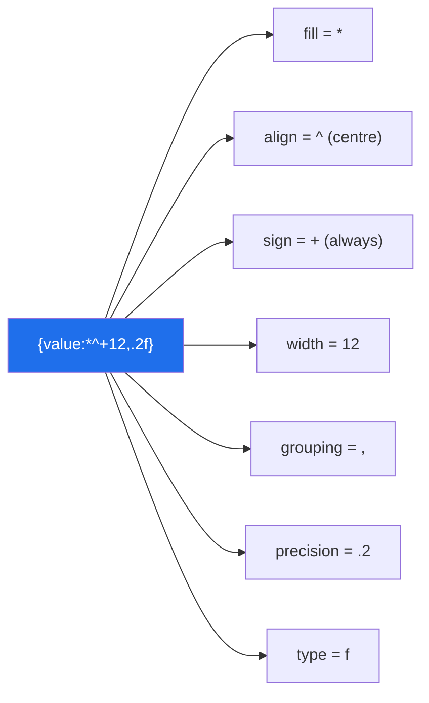

# 3.2 — The format spec: alignment, precision, and thousands

## One-line answer

Everything after the colon inside a placeholder is a small language — `[[fill]align][sign][#][0][width][grouping][.precision][type]`
— shared by f-strings and `str.format`, and learning it once replaces every manual `ljust`, `round`
and thousands-separator loop you would otherwise write.

---

## The story

Three tables, printed by three different scripts in the same project.

The first uses `str(value).ljust(12)` on every column and breaks the moment a value is longer than
twelve characters — the column runs into the next one and every row below shifts.

The second uses `round(value, 2)` and prints `0.1` where the column should read `0.10`, because
`round` returns a **number** and a number has no trailing zeros. The column does not line up and, on a
financial summary, "0.1" and "0.10" being visually different from the rows around them makes a reader
mistrust the whole table.

The third prints a count of `1234567` with no separators, and in a meeting somebody reads it aloud as
"one hundred twenty-three thousand" and asks a question based on a number that is off by a factor of
ten.

All three problems have a one-character answer inside a format spec: `:<12`, `:.2f`, `:,`. The spec
language is about forty characters of documentation, it is shared between f-strings and `str.format`,
and it is one of the highest-value things to learn once and keep.

---

## The idea in plain language

### Where the spec goes

```text
f"{expression:spec}"
```

Everything after the first colon **that is not inside brackets** is the spec. It is passed to the
object's `__format__` method
([Day 5, 1.1](../../../day-05-operators-and-conditionals/parts/01-operators/1.1-an-operator-is-a-method-call.md)) —
so the meaning of a spec depends on the type, and a class can define its own. `datetime` uses this to
accept `strftime` codes directly: `f"{now:%Y-%m-%d}"`.

### The grammar, one field at a time

```text
[[fill]align][sign][#][0][width][grouping][.precision][type]
```

Every part is optional, and in practice you use two or three at a time.

**align** — `<` left, `>` right, `^` centre, `=` pad after the sign (numbers only). A **fill**
character goes immediately before it: `{x:*^20}` centres in 20 columns padded with asterisks.

Defaults differ by type, and this is worth knowing: **strings default to left-aligned, numbers to
right-aligned.** That is why a table of mixed columns lines up sensibly with no alignment specified at
all — and why an integer that you turned into a string with `str()` first suddenly jumps to the left.

**sign** — `+` always show a sign, `-` only for negatives (the default), space for a leading space on
positives. The space option is the one for tables of signed numbers, because it keeps the digits
aligned between positive and negative rows.

**width** — a minimum. Content longer than the width is **not truncated**; the field just grows. To
truncate you use precision on a string: `{title:.20}` gives at most 20 characters, and `{title:<20.20}`
gives exactly 20.

**grouping** — `,` for thousands separators, `_` for underscores. Works on integers and floats.

**precision** — `.n`. For `f` and `%` it means digits after the decimal point; for `g` it means
significant digits; for a **string** it means maximum length.

**type** — the presentation:

| Code | Meaning | Example |
|---|---|---|
| `d` | integer | `{42:d}` → `42` |
| `f` | fixed point | `{3.14159:.2f}` → `3.14` |
| `e` | scientific | `{1234:.2e}` → `1.23e+03` |
| `g` | general — picks `f` or `e` | `{0.00001234:g}` → `1.234e-05` |
| `%` | percentage — **multiplies by 100** | `{0.856:.1%}` → `85.6%` |
| `b` `o` `x` `X` | binary, octal, hex | `{255:08b}` → `11111111` |
| `s` | string (the default) | |
| (none) | `str()` for strings, a sensible default for numbers | |

`%` multiplying by 100 is the one that surprises people, and it is exactly right: a rate stored as
`0.856` is 85.6%, and doing the multiplication in the format spec means the stored value stays a
proportion.

### `format` versus `round`: the difference the story's second script hit

`round(0.1, 2)` returns the **float** `0.1`. A float has no concept of trailing zeros, so printing it
gives `0.1`.

`f"{0.1:.2f}"` returns the **string** `"0.10"`. Formatting is a rendering decision and does not change
the value.

The rule: **round when the value should change; format when only the display should.** Rounding data
before storing it is a decision to lose precision, and it is almost always wrong in a pipeline —
compute at full precision, format at the edge
([Day 4, 1.3](../../../day-04-objects/parts/01-objects/1.3-numbers-and-bool.md) on floats).

There is a second difference worth knowing: `round()` uses banker's rounding (ties go to the even
digit, so `round(0.5)` is `0` and `round(1.5)` is `2`), and so does the format spec. Both are
consistent, and both differ from the "always round half up" that most people expect.

### Nested braces for dynamic widths

The width and precision can themselves be expressions:

```text
f"{value:>{width}}"
f"{value:.{places}f}"
```

That is how you build a table whose column widths are computed from the data — measure the longest
value, then format with that width.



---

## Why Setu needs it

- **[4.1](../04-normalising/4.1-the-title-normaliser.md), today,** truncates long titles for display,
  which is `{title:.60}` rather than a slice plus an ellipsis check.
- **Day 6's timing tables** already used it — `{ratio:>6.1f}` and `{calls:>32,}` are what made the
  quadratic visible ([Day 6, 4.1](../../../day-06-loops/parts/04-loop-cost/4.1-the-accidental-quadratic.md)),
  and a table that does not line up does not communicate.
- **Day 36's visualisation** (`VIZ-`) formats axis labels and annotations, where `{:.1%}` and `{:,}`
  are the difference between a chart a stakeholder reads correctly and one they do not.
- **Day 58's statistics** (`ST-`) reports p-values and confidence intervals, where the number of
  significant digits is a claim about precision — reporting `0.04999999` implies certainty you do not
  have, and `{p:.3f}` is an honest statement.
- **Day 95's training loop** (`ML-06`) prints loss per epoch; a fixed-width, fixed-precision line is
  what makes a diverging run visible at a glance rather than requiring arithmetic.

---

## The mechanism

The grammar, field by field:

```python
"""Each part of the spec, isolated."""

value = 1234.5678

print("width and align:")
print(f"    default (numbers right) |{value:12}|")
print(f"    left    <               |{value:<12}|")
print(f"    centre  ^               |{value:^12}|")
print(f"    fill    *^              |{value:*^12}|")
print(f"    zero    012             |{value:012}|")

print("sign:")
for number in (42, -42):
    print(f"    default |{number:6}|   plus |{number:+6}|   space |{number: 6}|")

print("grouping and precision:")
print(f"    thousands  |{1234567:,}|")
print(f"    underscore |{1234567:_}|")
print(f"    2 places   |{value:.2f}|")
print(f"    both       |{1234567.891:,.2f}|")

print("types:")
print(f"    percent |{0.8567:.1%}|   scientific |{1234.5:.2e}|   general |{0.00001234:g}|")
print(f"    hex |{255:x}|  HEX |{255:X}|  binary padded |{255:08b}|  octal |{255:o}|")
```

**Line by line:**

- `|{value:12}|` — the pipes are there so the padding is visible. **Always print a field with delimiters
  when you are working out a spec**, or you cannot see where it ends.
- The default alignment is right for a number and would be left for a string. Try `f"{'text':12}"` and
  the padding moves to the other side.
- `{value:012}` — zero-padding. Note it is `0` before the width, and for a signed number the zeros go
  *after* the sign (`-0001234.57`), which is the `=` alignment applied automatically.
- `{number: 6}` — a **space** as the sign option, giving a leading space on positives so that `42` and
  `-42` have their digits in the same columns. This is the option nobody discovers by accident and the
  right one for a table of signed values.
- `{1234567:,}` — thousands separators. Locale-independent: always a comma, regardless of the machine.
  For locale-aware grouping you need `locale.format_string` or the `babel` library, and being explicit
  about that is usually better for logs and data files anyway.
- `{0.8567:.1%}` — `85.7%`. **The value was multiplied by 100 by the spec**, and rounded to one place.
- `{255:08b}` — `11111111`, zero-padded to 8 digits. Combining a padding width with a base is how you
  print bit patterns readably
  ([Day 5, 1.5](../../../day-05-operators-and-conditionals/parts/01-operators/1.5-bitwise-and-the-mask.md)).

`round` versus format, which is the story's second script:

```python
"""round changes the value. A format spec changes only the rendering."""

values = [0.1, 0.125, 2.675, 1234.5678]

print(f"{'value':>10} {'round(v, 2)':>12} {'f-{v:.2f}':>10}  types")
for value in values:
    rounded = round(value, 2)
    formatted = f"{value:.2f}"
    print(
        f"{value:>10} {rounded:>12} {formatted:>10}  {type(rounded).__name__} vs {type(formatted).__name__}"
    )

print()
print("banker's rounding, in both tools:")
for n in (0.5, 1.5, 2.5, 3.5):
    print(f"    round({n}) = {round(n)}   f'{{{n}:.0f}}' = {n:.0f}")

print()
print("2.675 is not what it looks like (Day 4, part 1.3):")
from decimal import Decimal

print(f"    stored as: {Decimal(2.675)}")
print(f"    so .2f gives {2.675:.2f}, not 2.68")
```

**Line by line:**

- `round(0.1, 2)` gives the float `0.1`, printed as `0.1` — **no trailing zero**, because a float has
  no notion of significant trailing digits. `f"{0.1:.2f}"` gives the string `"0.10"`.
- The `types` column makes the difference explicit: one is a `float`, the other a `str`. That is why
  only one of them can line up a column.
- `round(0.5)` is `0` and `round(1.5)` is `2` — **banker's rounding**, where ties go to the even digit.
  It is not a bug; it is chosen so that rounding a large set of values does not systematically inflate
  the total, and the format spec does the same thing for consistency.
- `Decimal(2.675)` prints `2.67499999999999982236431605997495353221893310546875` — the float nearest to
  2.675 is slightly **below** it, so both `round` and `.2f` give `2.67`. **This is not a rounding bug,
  it is the float from
  [Day 4, 1.3](../../../day-04-objects/parts/01-objects/1.3-numbers-and-bool.md)**, and the fix for
  money is `Decimal` all the way through, not a cleverer format.
- The `from decimal import Decimal` mid-file is for readability of this example; real code puts imports
  at the top and ruff's `E402` enforces it.

And the table the story's first script wanted:

```python
"""A table with computed widths, and truncation that does not shift the columns."""

rows = [
    ("Attention Is All You Need", 2017, 98342, 0.9812),
    ("BERT: Pre-training of Deep Bidirectional Transformers", 2018, 76211, 0.9455),
    ("A Short One", 2021, 42, 0.0),
]

TITLE_WIDTH = 30
title_width = min(TITLE_WIDTH, max(len(row[0]) for row in rows))

header = f"{'title':<{title_width}} {'year':>6} {'cites':>9} {'score':>8}"
print(header)
print("-" * len(header))
for title, year, cites, score in rows:
    print(f"{title:<{title_width}.{title_width}} {year:>6} {cites:>9,} {score:>8.1%}")

print()
print("without a precision, a long title breaks the table:")
for title, year, cites, score in rows:
    print(f"{title:<{title_width}} {year:>6} {cites:>9,} {score:>8.1%}")
```

**Line by line:**

- `title_width = min(TITLE_WIDTH, max(len(...)))` — the column is as wide as it needs to be, up to a
  cap. Computing it from the data is why the width appears as an expression rather than a literal.
- `f"{'title':<{title_width}}"` — **nested braces**: the width is itself a placeholder. This is the
  feature that makes computed-width tables possible, and it works in the precision slot too.
- `{title:<{title_width}.{title_width}}` — width **and** precision, both dynamic. On a string,
  precision means maximum length, so this pads short titles and truncates long ones: the column is
  exactly that wide, always.
- `{cites:>9,}` — right-aligned in 9 columns with thousands separators. The story's third bug, fixed by
  one character.
- `{score:>8.1%}` — right-aligned, one decimal place, and multiplied by 100 with a `%` appended. A
  score stored as a proportion, displayed as a percentage, with the conversion visible in the format
  rather than hidden in the data.
- The second loop omits the precision, and the long BERT title pushes every subsequent column right on
  that row. **Width alone does not truncate**; that is the story's first bug, and `.{width}` is the
  fix.

---

## When it breaks

**A spec the type does not understand:**

```text
>>> f"{'hello':,}"
Traceback (most recent call last):
  File "<stdin>", line 1, in <module>
ValueError: Cannot specify ',' with 's'.
>>> f"{'hello':.2f}"
Traceback (most recent call last):
  File "<stdin>", line 1, in <module>
ValueError: Unknown format code 'f' for object of type 'str'
```

**What it means.** The spec is passed to the value's `__format__`, and `str` does not do thousands
separators or fixed-point. The usual cause is a value that is a string when you thought it was a
number — the CSV column that was never converted
([Day 4, 1.5](../../../day-04-objects/parts/01-objects/1.5-why-str-plus-int-is-a-typeerror.md)) — so
the fix is at the parse boundary, not in the format.

**A width that is not a number:**

```text
>>> width = "12"
>>> f"{3.14:>{width}}"
Traceback (most recent call last):
  File "<stdin>", line 1, in <module>
ValueError: Invalid format specifier '>12' for object of type 'float'
```

**What it means. ** The nested expression produced the string `"12"`, and the resulting spec was
`>12` — which looks fine and is not, because the nested value is substituted textually and then the
whole spec is re-parsed, and a quoted width is not accepted. `int(width)` fixes it, and it is worth
knowing that nested braces are a textual substitution rather than a typed one.

**A colon in the wrong place:**

```text
>>> d = {"a:b": 1}
>>> f"{d['a:b']}"
'1'
>>> ratio = 3
>>> f"{ratio:>{'a:b'}}"
Traceback (most recent call last):
  File "<stdin>", line 1, in <module>
ValueError: Invalid format specifier
```

**What it means.** The parser finds the spec at the first colon **outside** brackets, so a colon inside
`[...]` or `(...)` is safe — the first line works. A colon inside a nested spec expression is not. In
practice the confusing case is a dict key containing a colon, and it works fine.

**And the one that is silently wrong:**

```text
>>> rate = 0.856
>>> f"{rate:.1%}"
'85.6%'
>>> f"{rate * 100:.1f}%"
'85.6%'
>>> f"{rate * 100:.1%}"
'8560.0%'
```

**What it means.** The third line multiplied by 100 twice — once by hand and once by the `%` spec. **No
error**, and a rate of 85.6% reported as 8560%. It is obvious in this example and not obvious in a
dashboard where the number arrives from three functions away. The rule: `%` in the spec means the value
is a proportion; if you have already multiplied, use `f` and a literal `%` sign.

---

## In production

**Format at the edge, never in the data.** Numbers stay numbers all the way through the pipeline and
become strings only at the moment they are displayed, written to a report, or serialised for a human.
The moment you store a formatted string you have lost the ability to compute with it, and you have
baked in a locale and a precision that the next consumer may not want. This is the same principle as
[1.1](../01-text/1.1-a-string-is-code-points.md)'s decode-at-the-boundary: one representation inside,
conversions at the edges.

**Precision is a claim, so choose it deliberately.** Reporting a model's accuracy as `0.9812345` implies
seven digits of confidence that a test set of a thousand rows cannot support; `{acc:.1%}` says 98.1%
and is honest. In a statistics or ML report, the number of digits should follow from the sample size,
and picking it by accident — because that is what `print` happened to do — is a small dishonesty that a
reviewer will notice. Day 58's work makes this explicit.

**Never build a table with manual padding.** `ljust`/`rjust` do not truncate, so one long value breaks
every row below it; a spec with both width and precision cannot. For anything beyond a handful of
columns, the honest answer is a library — `tabulate`, `rich`, or pandas' own rendering — because
column alignment, unicode width and truncation-with-ellipsis are solved problems. The spec is for the
handful-of-columns case, which is most log output and most quick diagnostics.

**Grouping is locale-independent, and that is usually what you want in a machine-readable context and
not what you want in a user interface.** `{n:,}` always produces commas, so a German user sees
`1,234,567` where their convention is `1.234.567`. For logs, CSVs and internal reports the consistency
is a feature; for a user-facing display you need `locale` or `babel`, and mixing the two in one system
produces numbers that parse differently depending on who generated them.

**What changes at scale.** A format spec is parsed on every call, so `f"{x:>10.2f}"` in a loop over ten
million rows re-parses the spec ten million times. It is fast and it is not free; where it matters, the
fixes are to format only what you display (paginate, do not render a million rows), or to use a
vectorised formatter — pandas' `to_string`, `Styler.format`, or NumPy's `array2string` — which
formats a whole column in one compiled pass
([Day 6, 4.2](../../../day-06-loops/parts/04-loop-cost/4.2-the-loop-you-should-not-write.md)).

**The review comment a senior engineer leaves.** On a report line using `round(value, 2)`: *"`round`
returns a float, so `0.1` prints as `0.1` and breaks the column; use `f'{value:.2f}'` for the display
and leave the stored value at full precision. And add `,` to the counts — `1234567` gets misread in
meetings."*

**The interview question.** *"How would you print a number to two decimal places with thousands
separators?"* The answer is `f"{value:,.2f}"`, and the follow-up worth being ready for is *"how is that
different from `round(value, 2)`?"* — `round` returns a number and therefore cannot show a trailing
zero or a separator, while formatting returns a string and does not change the value, so you round when
the value should change and format when only the display should. Strong answers add that both use
banker's rounding, that `%` in a spec multiplies by 100 (so a stored proportion needs no manual
conversion), and that a width alone does not truncate — you need a precision as well, which is what
keeps a table's columns aligned when one value is long.

---

## Check yourself

```bash
uv run python -c "
v = 1234.5678
print(f'|{v:12}|  |{v:<12}|  |{v:^12}|  |{v:*^12}|  |{v:012}|')
for n in (42, -42):
    print(f'|{n:6}| |{n:+6}| |{n: 6}|')
print(f'|{1234567:,}|  |{v:,.2f}|  |{0.8567:.1%}|  |{255:08b}|')
print('round vs format:', round(0.1, 2), repr(f'{0.1:.2f}'))
print('bankers        :', round(0.5), round(1.5), round(2.5))
w = 10
print(f'nested width   : |{\"abc\":<{w}.{w}}|')
try:
    f'{\"hello\":,}'
except ValueError as exc:
    print('wrong type     :', exc)
"
```

Print each field between pipes until the spec language stops needing a lookup.

**Answer out loud, without scrolling up:**

> Give the format spec for "right-aligned in 12 columns, two decimal places, thousands separators".
> Then say the difference between `round(x, 2)` and `f"{x:.2f}"`, and why a width without a precision
> breaks a table.

---

**Next:** [3.3 — `!r`, `=`, and the debugging f-string](3.3-repr-and-the-debugging-f-string.md)
