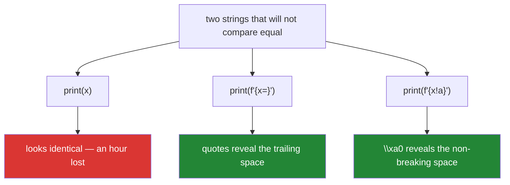

# 3.3 — `!r`, `=`, and the debugging f-string

## One-line answer

`str()` is for humans and `repr()` is for you — `!r` inside a placeholder switches to the second, and
`f"{value=}"` prints the expression *and* its `repr` in one token, which is the fastest way to find
out that your string has a trailing space.

---

## The story

Two values that will not compare equal.

```text
>>> print(expected)
Attention Is All You Need
>>> print(actual)
Attention Is All You Need
>>> expected == actual
False
```

An hour disappears here. The developer checks the types (both `str`), checks the lengths — and stops,
because the lengths differ by one and there is nowhere visible for the extra character to be.

One line would have ended it in four seconds:

```text
>>> print(f"{expected=}")
expected='Attention Is All You Need'
>>> print(f"{actual=}")
actual='Attention Is All You Need '
```

A trailing space, visible because `repr` puts quotes around a string and `print` does not.

The same afternoon, a colleague debugging a failing test sees `assert 3 == 3` fail. One is the integer
`3` and the other is the string `"3"` from an unparsed CSV column. `print` renders both as `3`;
`f"{a=} {b=}"` renders `a=3 b='3'` and the quotes end the investigation immediately.

**`print` is a lie detector with the batteries removed.** `repr` is the one that tells you what you
actually have.

---

## The idea in plain language

### Two string conversions, two audiences

Every object can be turned into text two ways, and both are dunder methods
([Day 5, 1.1](../../../day-05-operators-and-conditionals/parts/01-operators/1.1-an-operator-is-a-method-call.md)):

| Function | Dunder | Audience | Goal |
|---|---|---|---|
| `str(x)` | `__str__` | a person reading output | readable |
| `repr(x)` | `__repr__` | a developer debugging | **unambiguous** |

The convention for `repr` is that it should look like valid Python that would recreate the object —
`Rupees(250)`, `datetime.date(2026, 8, 25)`, `'a string'` with quotes. When that is impractical it
should at least name the type and the identifying fields: `<Paper doi='10.1000/xyz'>`.

For most types they are identical, because most types define only `__repr__` and Python falls back to
it for `str()`. **The exceptions are exactly the types where debugging goes wrong**: `str` itself,
where `repr` adds quotes and escapes; and `datetime`, where `str` gives `2026-08-25 10:30:00` and
`repr` gives `datetime.datetime(2026, 8, 25, 10, 30)`.

### `!r`, `!s`, `!a`

Inside a placeholder, a `!` before the colon chooses the conversion:

- `{x!r}` — `repr(x)`
- `{x!s}` — `str(x)`, which is the default and is only needed when you also want a format spec that
  requires a string (`{flag!s:<6}`, since a bool cannot take a width directly)
- `{x!a}` — `ascii(x)`, like `repr` but escaping every non-ASCII character. **This is the one that
  finds an invisible Unicode character**, because it turns a non-breaking space into `\xa0`.

The conversion comes before the format spec: `{value!r:>30}`.

### The `=` specifier

`f"{expr=}"` prints the expression source, an equals sign, and the value's `repr`. Added in Python 3.8
for exactly the story's situation.

```text
f"{count=}"           ->  count=42
f"{title=}"           ->  title='Attention Is All You Need '
f"{a + b=}"           ->  a + b=7
f"{obj.field=}"       ->  obj.field='x'
f"{value=:.2f}"       ->  value=3.14      (a spec switches it back to str())
f"{value=!s}"         ->  value=3.14159   (explicit str)
```

Two details worth knowing: the expression source is preserved **verbatim**, including whitespace, so
`f"{a  +  b = }"` prints `a  +  b = 7`; and adding a format spec switches the conversion from `repr`
back to `str`, which is occasionally surprising.



### Why your own classes need `__repr__`

A class with no `__repr__` prints as `<setu.paper.Paper object at 0x7f3c8a1b2d10>`. That tells you the
type and a memory address, and nothing about which paper it is — so a list of ten of them in a debugger
or a failing test is ten identical-looking lines.

Writing one is three lines and pays for itself the first time a test fails:

```text
def __repr__(self) -> str:
    return f"Paper(doi={self.doi!r}, year={self.year})"
```

Note the `!r` on the string field — without it, a DOI containing a space or a quote would be
ambiguous, which is the whole point of `repr`.

`@dataclass` generates exactly this for you, which is one of several reasons Day 19 (`PY-23`) reaches
for it.

### Where each one shows up without being asked

- **A container's `str` uses its elements' `repr`.** `print(["a", "b"])` shows `['a', 'b']` with
  quotes, while `print("a")` shows `a` without. That is why a list of strings looks different from the
  strings inside it, and it is a genuine source of confusion until you know the rule.
- **The REPL echoes `repr`**, `print` uses `str`. So a value can look different depending on whether
  you typed it or printed it.
- **Exception messages** built with f-strings should use `!r` for any value that came from outside —
  `f"unknown status: {status!r}"` distinguishes `"200"` from `200` in the traceback, which is exactly
  when you need it.

---

## Why Setu needs it

- **[4.1](../04-normalising/4.1-the-title-normaliser.md), today,** is verified by comparing `repr`
  before and after — a normaliser tested by eye on `print` output cannot be trusted.
- **[4.2](../04-normalising/4.2-unicode-normalisation.md), today,** is the hardest version of the
  story: two strings that are identical under `repr` **and** still not equal, which needs `!a` or a
  code-point dump to see.
- **Day 12's `Paper` class** (`PY-13`) and **Day 15's dunder methods** (`PY-17`, `PY-18`) write
  `__repr__` and `__str__` deliberately, and this part is why the distinction matters.
- **Every pytest failure** shows the `repr` of both sides of an assertion
  ([Day 2, 3.1](../../../day-02-quality-gate/parts/03-pytest/3.1-the-test-that-can-go-red.md)) — which
  is why a class without `__repr__` produces a useless failure message and one with a good `__repr__`
  produces a diagnosis.
- **Day 182's agent traces** (`AGT-`) log tool inputs and outputs. A trace that shows `{"q": "cat "}`
  rather than `q: cat` is the difference between finding a whitespace bug and not.

---

## The mechanism

`str` versus `repr`, and the types where they differ:

```python
"""str is readable; repr is unambiguous. Most types agree, and the ones that do not are the ones that matter."""

import datetime
from decimal import Decimal

values = [
    "a string",
    "  padded  ",
    42,
    "42",
    3.0,
    None,
    True,
    ["a", "b"],
    {"k": "v"},
    datetime.date(2026, 8, 25),
    Decimal("2.50"),
    b"bytes",
]

print(f"{'str(x)':<28} {'repr(x)':<32} same?")
for value in values:
    same = str(value) == repr(value)
    print(f"{str(value):<28} {repr(value):<32} {same}")
```

**Line by line:**

- `"a string"` — `str` gives `a string`, `repr` gives `'a string'`. **The quotes are the whole
  difference**, and they are what reveals a trailing space or an empty string.
- `"  padded  "` — the `repr` shows the padding explicitly. The `str` looks like ordinary text with
  some alignment.
- `42` and `"42"` — the `str` column is identical for both. **This is the story's second bug**: an
  integer and a string that print the same and behave completely differently
  ([Day 4, 1.5](../../../day-04-objects/parts/01-objects/1.5-why-str-plus-int-is-a-typeerror.md)).
- `["a", "b"]` — both columns show quotes, because a list's `str` renders its **elements** with
  `repr`. That rule is why `print(["a"])` and `print("a")` look different.
- `datetime.date(...)` — `str` gives `2026-08-25`, `repr` gives `datetime.date(2026, 8, 25)`. The
  second is valid Python that recreates the object, which is the `repr` convention.
- `Decimal("2.50")` — `str` gives `2.50`, `repr` gives `Decimal('2.50')`. In a money context that
  distinction matters: the `repr` tells you it is not a float.
- `b"bytes"` — the `b` prefix in the `repr` is what distinguishes it from a `str`, and it is the fastest
  way to spot a bytes/str confusion
  ([1.1](../01-text/1.1-a-string-is-code-points.md)).

The `=` specifier, which is the tool:

```python
"""f"{expr=}" prints the source and the repr. Four seconds instead of an hour."""

expected = "Attention Is All You Need"
actual = "Attention Is All You Need "
count = 42
count_as_text = "42"
rate = 0.856

print("print() cannot tell these apart:")
print("   ", expected)
print("   ", actual)
print("    equal:", expected == actual)

print("the = specifier can:")
print(f"    {expected=}")
print(f"    {actual=}")

print("and for the type confusion:")
print(f"    {count=}  {count_as_text=}")

print("expressions work too, and the source is verbatim:")
print(f"    {len(expected)=}  {len(actual)=}")
print(f"    {expected == actual=}")
print(f"    {rate * 100=:.1f}")
print(f"    {rate=:.1%}")
```

**Line by line:**

- `f"{expected=}"` → `expected='Attention Is All You Need'`. The expression source, an `=`, and the
  `repr`. **No typing the name twice**, which is why this gets used and a manual
  `print("expected:", repr(expected))` does not.
- `f"{count=}  {count_as_text=}"` → `count=42  count_as_text='42'`. The quotes settle the type question
  instantly.
- `f"{len(expected)=}"` — an arbitrary expression, with its source preserved. This is how you check an
  invariant inline without restructuring the code.
- `f"{expected == actual=}"` — a comparison. The output reads `expected == actual=False`, which is ugly
  and completely clear.
- `f"{rate * 100=:.1f}"` — **a format spec switches the conversion back to `str`**, so this prints
  `rate * 100=85.6` rather than a `repr`. Worth knowing so the output does not surprise you.
- `f"{rate=:.1%}"` → `rate=85.6%`. Combining `=` with a spec from
  [3.2](3.2-the-format-spec.md) gives a labelled, formatted diagnostic in one token.

And `!a` plus a code-point dump, for the characters `repr` will not show you:

```python
"""When repr looks identical too: !a and a code-point dump."""

a = "Attention Is All"
b = "Attention Is All"

print(f"{a=}")
print(f"{b=}")
print("repr looks the same:", repr(a) == repr(b))
print("but they are not equal:", a == b)

print()
print("!a escapes every non-ASCII character:")
print(f"    {a!a}")
print(f"    {b!a}")

print()
print("the code-point dump, which always works:")
for label, text in (("a", a), ("b", b)):
    points = " ".join(f"{ord(ch):04X}" for ch in text[:12])
    print(f"    {label}: {points}")


def show(text: str) -> str:
    """A helper worth keeping: repr plus every code point above ASCII."""
    exotic = {f"U+{ord(ch):04X}": ch for ch in text if ord(ch) > 127}
    return f"{text!r} exotic={list(exotic)}"


print()
print("   ", show(a))
print("   ", show(b))
```

**Line by line:**

- `b = "Attention Is All"` — a non-breaking space, written as an escape so this file's own encoding
  cannot obscure it ([1.3](../01-text/1.3-escapes-and-raw-strings.md)).
- `repr(a) == repr(b)` — depending on your terminal this may print `False` but **look** identical on
  screen, because `repr` does not escape a non-breaking space: it is a printable character. **This is
  the limit of `repr`**, and it is where the story would still be stuck.
- `{b!a}` — `ascii()` conversion, which escapes everything above U+007F. The non-breaking space becomes
  a visible `\xa0`. **This is the tool for invisible characters**, and it takes one extra keystroke.
- The code-point dump — `f"{ord(ch):04X}"` for each character. Unambiguous, works for every case, and
  is what you fall back to when `!a` is not enough.
- `def show(text)` — a small helper worth keeping in your own toolbox: the `repr` plus a list of every
  non-ASCII code point present. Two lines, and it turns "why are these not equal" into a one-call
  question.
- `{f"U+{ord(ch):04X}": ch for ch in text if ord(ch) > 127}` — a dict comprehension with a filter
  ([Day 9, 2.1](../../../day-09-comprehensions/parts/02-dict-set-gen/2.1-dict-comprehensions.md)); the
  dict is used to deduplicate, since a title may contain several of the same exotic character.

---

## When it breaks

**The comparison that should have worked:**

```text
>>> expected = "Attention Is All You Need"
>>> actual = "Attention Is All You Need "
>>> print(expected)
Attention Is All You Need
>>> print(actual)
Attention Is All You Need
>>> expected == actual
False
>>> print(f"{actual=}")
actual='Attention Is All You Need '
```

**What it means.** Trailing whitespace. `print` renders it as nothing at all; `repr`'s closing quote
gives it a boundary. The general rule: **when a comparison fails and both sides look the same, the
first command is `repr`, not another `print`.**

**The class with no `__repr__`:**

```text
>>> class Paper:
...     def __init__(self, doi): self.doi = doi
...
>>> [Paper("a"), Paper("b")]
[<__main__.Paper object at 0x7f3c8a1b2d10>, <__main__.Paper object at 0x7f3c8a1b2e50>]
```

**What it means.** Two objects, indistinguishable except by an address that means nothing. In a pytest
failure this is the whole message, and it tells you the assertion failed and nothing about why. Three
lines of `__repr__` — or `@dataclass` — turn it into
`[Paper(doi='a'), Paper(doi='b')]`.

**The `repr` that raises, which is worse than a bad one:**

```text
>>> class Broken:
...     def __repr__(self): return f"Broken({self.missing})"
...
>>> Broken()
Traceback (most recent call last):
  File "<stdin>", line 2, in __repr__
AttributeError: 'Broken' object has no attribute 'missing'
```

**What it means.** A `__repr__` that raises makes the object impossible to inspect — in a debugger, in
a log, in a test failure — which is precisely when you need it most. **A `__repr__` must never raise**:
it should tolerate half-initialised objects and missing attributes, because those are exactly the
states you will be debugging.

**And `str` on a container, which is not what people expect:**

```text
>>> print("a")
a
>>> print(["a"])
['a']
>>> print({"k": "v"})
{'k': 'v'}
>>> str(["a"]) == repr(["a"])
True
```

**What it means.** `list.__str__` does not exist, so `str(list)` falls back to `repr`, and that `repr`
renders each element with `repr` too. There is **no way** to print a list of strings without quotes
using `print` alone — you need `", ".join(items)`
([2.2](../02-methods/2.2-split-and-join.md)). This trips people building human-readable output from
lists.

---

## In production

**Every class you write gets a `__repr__`, and it names the identifying fields.** This is not optional
polish: it is what makes a test failure diagnosable, a log line useful, and a debugger session
possible. The convention is `ClassName(field=value, ...)` with `!r` on anything that could be
ambiguous, and the rule that matters most is that **it must never raise and must never be expensive** —
no database lookups, no network calls, and no assumption that every attribute is set. A `__repr__` that
hits the database is a `__repr__` that breaks your debugger.

**Log values with `!r` when they came from outside.** `f"unknown status: {status!r}"` in an exception
tells the on-call engineer whether the status was `200` or `"200"`, which is the difference between a
type bug and a data bug. Bare interpolation of an external value into an error message is the
production version of `print` — it loses exactly the information you are about to need. The same
applies to any value in a log line that a human will later grep for: quotes make an empty value visible
as `''` instead of as nothing at all.

**Keep a "show me what this really is" helper in your toolbox.** The `show()` function above — `repr`
plus the non-ASCII code points — takes two lines and turns the hardest class of string bug into a
one-call question. Teams that work with human-entered text usually have something like it, and the
alternative is rediscovering `ord()` under pressure every few months.

**What changes at scale.** `repr` on a large container renders **everything**: `repr` of a list of a
million dicts builds a string of hundreds of megabytes, and doing that inside an exception handler or a
log call can take a service down. Real systems truncate — pytest does this, pandas does this with
`display.max_rows`, and your own `__repr__` should too when the object holds a collection:
`f"Batch(n={len(self.rows)}, first={self.rows[0]!r})"` rather than dumping the rows. **A `__repr__`
whose cost is proportional to the data is a production hazard**, and it fires precisely during
incidents.

**Never let a `repr` leak a secret.** A settings object whose `__repr__` prints an API key will
eventually print it into a log, a traceback, or an error-reporting service
([Day 3, 1.3](../../../day-03-keys-and-budget/parts/01-secrets/1.3-when-a-key-leaks.md)). The
convention is to render secrets as `'***'` or by their last four characters, and Pydantic's `SecretStr`
does this for you — which is one of the reasons Day 19 (`PY-24`) uses it for configuration.

**The review comment a senior engineer leaves.** On a new class: *"Add a `__repr__` — when this fails in
a test the message will just be a memory address. `f'Paper(doi={self.doi!r})'` is enough, and make sure
it does not blow up if `doi` is unset. Also, the `__repr__` on `Batch` below dumps every row; truncate
it or a debug log will produce a hundred-megabyte line."*

**The interview question.** *"What is the difference between `str` and `repr`?"* The answer is audience:
`str` is for a person reading output and aims to be readable; `repr` is for a developer and aims to be
unambiguous, ideally valid Python that recreates the object. The follow-up that shows you have actually
debugged something is *"when does it matter?"* — comparing two strings that print identically, where
`repr`'s quotes reveal trailing whitespace, and distinguishing the integer `3` from the string `"3"`.
Strong answers add `f"{x=}"` as the fastest way to get there, `!a` for invisible non-ASCII characters,
that containers render their elements with `repr` so `print(["a"])` shows quotes, and that a custom
`__repr__` must never raise, never be expensive, and never print a secret.

---

## Check yourself

```bash
uv run python -c "
expected = 'Attention Is All You Need'
actual   = 'Attention Is All You Need '
print(expected); print(actual); print('equal:', expected == actual)
print(f'{expected=}')
print(f'{actual=}')
print(f'{42=}  {\"42\"=}')
nb = 'Attention Is'
print(f'{nb=}')
print(f'{nb!a=}')
print('code points:', [f'{ord(c):04X}' for c in nb[:11]])
class Paper:
    def __init__(self, doi): self.doi = doi
print('no __repr__:', [Paper('a')])
"
```

Lines 1–3 are the hour lost. Lines 4–5 are the four seconds.

**Answer out loud, without scrolling up:**

> Say who `str` is for and who `repr` is for, and give two bugs that `repr` reveals and `print` hides.
> Then name the conversion that finds an invisible non-breaking space, and two rules a custom
> `__repr__` must obey.

---

**Next:** [3.4 — When not to use an f-string](3.4-when-not-to-use-an-f-string.md)
