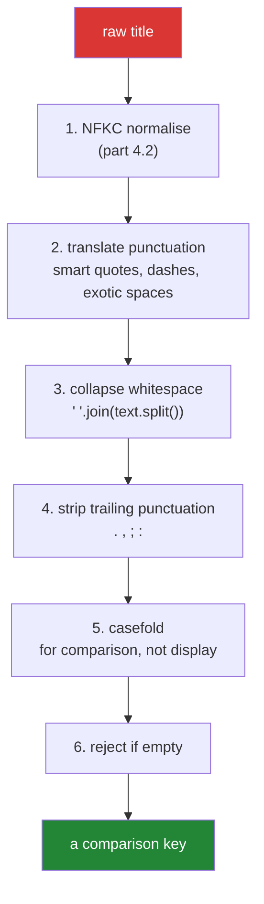

# 4.1 — The title normaliser, from scratch

## One-line answer

Normalising 500 messy titles is one chained expression built from the methods of Section 2 — strip,
collapse whitespace, translate punctuation, casefold — and the value of writing it as a **named
function** rather than inline is that it becomes testable, versionable, and the one place a bug gets
fixed.

---

## The story

The plan names this day's example: *normalising 500 messy paper titles with one chained expression.*
Here is what "messy" means when you open the file.

```text
"  Attention Is All You Need  "
"ATTENTION IS ALL YOU NEED"
"Attention Is All You Need"
"Attention  Is\tAll\nYou Need"
"“Attention Is All You Need”"
"Attention Is All You Need."
"Attention Is All You Need (2017)"
"Attention Is All You Need [Preprint]"
"Attention Is All You Need\r"
""
"   "
```

Eleven strings. A human reads ten of them as the same paper. A `set` collapses **none** of them,
because a set only merges values that are exactly equal
([Day 8, 2.1](../../../day-08-containers/parts/02-sets-and-dicts/2.1-a-set-is-a-hash-table.md)).

That gap — between what a human sees and what `==` sees — is the entire job. It is not one method
call; it is a sequence of deliberate decisions, each of which throws away a *specific* kind of
difference, and each of which you must be able to defend. Strip the trailing period? Yes. Strip the
year in parentheses? Probably — but then two genuinely different conference versions collapse into
one, and you have to decide whether that is what you want.

The output of this part is a function of about fifteen lines. The value is not the code; it is that
the decisions are written down in one place with a test each.

---

## The idea in plain language

### Normalisation is lossy on purpose

Every step **destroys information**, deliberately. Casefolding destroys the distinction between
`"BERT"` and `"Bert"`. Collapsing whitespace destroys the distinction between one space and three.
That is the point: you are building a **key** that ignores differences you have decided are not
meaningful.

Which means two rules follow immediately:

1. **Keep the original.** Store the raw title *and* the key. The key is for matching; the raw is for
   display, for debugging, and for re-keying when the normaliser improves.
2. **Every step is a decision that can be wrong.** Removing a trailing `(2017)` merges the arXiv
   preprint with the conference version. Whether that is correct depends on what you are building,
   and the answer belongs in a comment.

### The pipeline, in order

The order matters, and each position has a reason.



- **NFKC first** ([4.2](4.2-unicode-normalisation.md)) — because it can change which characters exist,
  and every later step should see the settled form.
- **Translate before collapse** — because translating an exotic space (U+2009) to an ordinary one lets
  the collapse step handle it. Doing it the other way leaves a thin space that `split()` might or might
  not treat as whitespace.
- **Collapse before strip** — because collapsing turns `"title .  "` into `"title ."`, and the trailing
  strip then has a predictable target.
- **Casefold last, or nearly** — because it is the cheapest step and nothing downstream depends on
  case. It goes before the emptiness check only because both are trivial.
- **Reject empty at the end** — a title that normalises to `""` is not a title, and returning `""` as
  a key means every empty title collides with every other one, which is a silent merge.

### `" ".join(text.split())` is the collapse

Section 2's most useful two-method idiom
([2.2](../02-methods/2.2-split-and-join.md)). `split()` with no argument splits on runs of **any**
whitespace and drops the ends; `" ".join` puts single spaces back. It handles tabs, newlines,
carriage returns, non-breaking spaces and every exotic Unicode space in one pass, with no regex and no
edge cases.

### `str.translate` is the punctuation step

A single table mapping smart quotes to plain ones, en and em dashes to hyphens, and exotic spaces to
ordinary spaces — applied in **one pass**, immune to rule interaction, and built once at module level
([2.3](../02-methods/2.3-replace-and-removeprefix.md)).

### The function boundary

The whole thing is one function with a docstring listing its decisions:

```text
def normalise_title(raw: str) -> str:
```

Not a chain inline at each call site. The reasons are the ones this curriculum keeps returning to: it
is testable, it is one place to fix, and when it changes you know exactly what has to be recomputed.

---

## Why Setu needs it

- **[4.2](4.2-unicode-normalisation.md), next,** is step 1, and it is the step that most pipelines
  omit and then cannot explain their duplicate rate.
- **[4.3](4.3-methods-before-regex.md), after that,** asks whether any of this should have been a
  regex. The answer for most steps is no.
- **Day 8's deduplication** (`PY-08`) puts these keys in a set and times it. **The dedup is only as good
  as the key**, and [Day 8, 3.2](../../../day-08-containers/parts/03-dedup/3.2-order-preserving-dedup.md)
  is this function's consumer.
- **Day 12's `Paper` class** (`PY-13`) decides what makes two papers equal, and a normalised title is
  one candidate for that identity
  ([Day 5, 1.4](../../../day-05-operators-and-conditionals/parts/01-operators/1.4-equals-is-overloadable-is-is-not.md)).
- **Day 30's pandas cleaning** (`PD-`) applies exactly this to a whole column with `.str` accessors,
  and **Day 162's retrieval** (`RAG-`) matches query text against document text — where a normalisation
  mismatch between index time and query time silently retrieves the wrong documents.

---

## The mechanism

The messy input, and what each step removes:

```python
"""Eleven titles a human reads as one paper. Watch each step collapse a difference."""

import unicodedata

RAW_TITLES = [
    "  Attention Is All You Need  ",
    "ATTENTION IS ALL YOU NEED",
    "Attention Is All You Need",
    "Attention  Is\tAll\nYou Need",
    "“Attention Is All You Need”",
    "Attention Is All You Need.",
    "Attention Is All You Need\r",
    "",
    "   ",
]

PUNCTUATION_MAP = str.maketrans(
    {
        "“": '"',
        "”": '"',
        "‘": "'",
        "’": "'",
        "–": "-",
        "—": "-",
        " ": " ",
        " ": " ",
        "​": "",
    }
)

TRAILING_PUNCTUATION = ".,;:"


def normalise_title(raw: str) -> str | None:
    """A comparison key for a paper title, or None when there is no title.

    Decisions, in order:
      1. NFKC - composed accents and compatibility forms settle first (part 4.2)
      2. smart quotes, dashes and exotic spaces become their plain equivalents
      3. any run of whitespace becomes one space; the ends are trimmed
      4. trailing sentence punctuation is dropped
      5. casefold, because this is a comparison key and not a display string
      6. an empty result is None, not "" - see the docstring note below

    NOT done here, deliberately: removing a trailing "(2017)" or "[Preprint]"
    would merge a preprint with its conference version. That is a decision for
    the caller, not for this function.
    """
    text = unicodedata.normalize("NFKC", raw)
    text = text.translate(PUNCTUATION_MAP)
    text = " ".join(text.split())
    text = text.rstrip(TRAILING_PUNCTUATION).strip()
    text = text.casefold()
    return text or None


keys = [normalise_title(raw) for raw in RAW_TITLES]
for raw, key in zip(RAW_TITLES, keys, strict=True):
    print(f"{raw!r:<38} -> {key!r}")

print()
distinct_raw = len(set(RAW_TITLES))
distinct_keys = len({k for k in keys if k is not None})
print(f"{len(RAW_TITLES)} inputs, {distinct_raw} distinct raw, {distinct_keys} distinct keys")
```

**Line by line:**

- `RAW_TITLES` uses ` `, `“` etc. rather than the characters themselves, so this file's own
  encoding cannot obscure what is being demonstrated
  ([1.3](../01-text/1.3-escapes-and-raw-strings.md)).
- `PUNCTUATION_MAP` at **module level** — built once, not per call. A `maketrans` inside the function
  would rebuild the table on every one of the 500 titles, which is
  [Day 6, 4.1](../../../day-06-loops/parts/04-loop-cost/4.1-the-accidental-quadratic.md)'s "build the
  index once" in miniature.
- `"​": ""` — a zero-width space maps to **nothing**, deleting it. `translate` handles deletion by
  mapping to `None` or to `""`; the dict form accepts both.
- `unicodedata.normalize("NFKC", raw)` — step 1, explained in [4.2](4.2-unicode-normalisation.md). It
  is first because it can change the character sequence, and every later step should see the settled
  form.
- `" ".join(text.split())` — steps 3 in one expression. After the translate, every whitespace-like
  character is an ordinary space, so this collapses everything.
- `text.rstrip(TRAILING_PUNCTUATION).strip()` — the trailing `.` goes; the second `.strip()` catches a
  space that was hiding behind it (`"title . "` → `"title ."` → `"title "` → `"title"`). **Note this
  is `rstrip` with a character set, which is correct here** because we genuinely mean "any of these
  characters at the end", unlike the prefix case from
  [2.1](../02-methods/2.1-normalising-strip-and-case.md).
- `text.casefold()` — step 5. `lower()` would leave German `ß` alone
  ([2.1](../02-methods/2.1-normalising-strip-and-case.md)).
- `return text or None` — step 6. The `or` here is **correct and deliberate**: for a title, an empty
  string and a missing title mean the same thing, which is exactly the condition
  [Day 5, 3.1](../../../day-05-operators-and-conditionals/parts/03-the-or-trap/3.1-the-or-default-and-falsy-zero.md)
  says makes the idiom safe. A comment saying so belongs in real code.
- `-> str | None` — the signature makes the empty case part of the contract, so a caller cannot forget
  it.
- `zip(..., strict=True)` — the habit from
  [Day 6, 1.3](../../../day-06-loops/parts/01-iteration/1.3-enumerate-and-zip.md).
- **Read the last line.** Nine inputs, nine distinct raw strings, **one** distinct key. That collapse is
  the whole function.

Step by step, so each decision is visible:

```python
"""The same pipeline with the intermediate values printed. This is the debugging view."""

import unicodedata

PUNCTUATION_MAP = str.maketrans({"“": '"', "”": '"', " ": " ", "​": ""})

raw = "  “Attention  Is\tAll You Need”.  \r\n"

steps = [("raw", raw)]
text = unicodedata.normalize("NFKC", raw)
steps.append(("1 NFKC", text))
text = text.translate(PUNCTUATION_MAP)
steps.append(("2 translate", text))
text = " ".join(text.split())
steps.append(("3 collapse", text))
text = text.rstrip(".,;:").strip()
steps.append(("4 rstrip", text))
text = text.casefold()
steps.append(("5 casefold", text))

for label, value in steps:
    print(f"{label:<12} {value!r}")
```

**Line by line:**

- `steps` accumulates `(label, value)` pairs so the whole progression prints at the end. **This shape —
  record each stage, print at the end — is how you debug any pipeline**, and it is worth building into
  the function behind a `debug=` flag in real code.
- `{value!r}` at every stage — `repr`, not `print`, so the whitespace and the quotes are visible
  ([3.3](../03-formatting/3.3-repr-and-the-debugging-f-string.md)). Printing these with `str` would
  make several of the stages look identical.
- Watch stage 2 → 3: the translate turns the non-breaking space into an ordinary one, and the collapse
  then merges it with the following space. **Reversing those two steps leaves a double space**, which
  is the concrete reason the order is what it is.
- Watch stage 3 → 4: the trailing `".` becomes nothing, and the `.strip()` afterwards is what removes
  the space that was in front of the period.
- Five stages, each one line, each removing exactly one kind of difference.

And the thing the function deliberately does **not** do:

```python
"""Suffix stripping is a decision the normaliser should not make silently."""

SUFFIX_MARKERS = ("(", "[")

titles = [
    "Attention Is All You Need",
    "Attention Is All You Need (2017)",
    "Attention Is All You Need [Preprint]",
    "Attention Is All You Need (Extended Abstract)",
]


def strip_bracketed_suffix(text: str) -> str:
    """Removes one trailing (...) or [...] group. NOT part of normalise_title."""
    stripped = text.rstrip()
    for opener, closer in (("(", ")"), ("[", "]")):
        if stripped.endswith(closer):
            start = stripped.rfind(opener)
            if start > 0:
                return stripped[:start].rstrip()
    return stripped


for title in titles:
    print(f"{title!r:<50} -> {strip_bracketed_suffix(title)!r}")

print()
print("all four collapse to one key - which may or may not be what you want:")
print("   ", {strip_bracketed_suffix(t).casefold() for t in titles})
```

**Line by line:**

- `strip_bracketed_suffix` is a **separate function**, not a step inside `normalise_title`. That is the
  point: it is a policy decision with real consequences, and burying it inside a general normaliser
  means nobody reviews it.
- `stripped.rfind(opener)` — search from the right for the matching opener
  ([2.4](../02-methods/2.4-find-index-and-in.md)). `rfind` returns `-1` when absent, and **the
  `start > 0` check is the sentinel guard** that part insists on — `> 0` rather than `>= 0` because a
  title that is entirely a bracketed group should not become empty.
- `if stripped.endswith(closer)` — only strip when the group is genuinely at the end. A title like
  `"Attention (Revised) Considered"` is untouched, because the bracket is not trailing.
- The final set has **one element**: all four titles collapse. Whether that is right depends entirely on
  whether you consider a preprint and an extended abstract to be the same paper — and that is a
  question for the domain, not for a string function.
- **This is the part where a normaliser goes wrong in production**: someone adds a "clean up the
  suffixes" step because it improves the duplicate rate, and it silently merges records that should
  have stayed separate. Keeping it separate and named means the decision is visible in the call site.

---

## When it breaks

**The step order that leaves a double space:**

```text
>>> raw = "Attention  Is All"
>>> " ".join(raw.split()).replace(" ", " ")
'Attention Is All'
>>> raw.replace(" ", " ").split()
['Attention', 'Is', 'All']
```

**What it means.** Both happen to work here, because Python's `split()` already treats U+00A0 as
whitespace. For a character it does **not** — U+200B, the zero-width space — the order matters
absolutely: collapse first and the zero-width space survives inside a "word", translate first and it
is deleted before the split. **The rule that generalises: character-level substitutions before
token-level operations.**

**The normaliser that returned an empty key:**

```text
>>> keys = {"": "paper-a"}
>>> keys[""] = "paper-b"
>>> keys
{'': 'paper-b'}
```

**What it means.** Two papers with untitled entries produced the same empty key, and the second
overwrote the first. **No error.** This is why `normalise_title` returns `None` rather than `""` — a
`None` key is a `TypeError` if you try to use it as a dict key by accident, or an explicit skip if you
handle it, and either is better than a silent merge.

**The `rstrip` that ate more than a period:**

```text
>>> "Attention Is All You Need...".rstrip(".,;:")
'Attention Is All You Need'
>>> "Vol. 3".rstrip(".,;:")
'Vol. 3'
>>> "et al.".rstrip(".,;:")
'et al'
>>> "1.2.3.".rstrip(".,;:")
'1.2.3'
```

**What it means.** `rstrip` with a character set removes **repeatedly** from the end
([2.1](../02-methods/2.1-normalising-strip-and-case.md)), so three periods all go — which is what you
want. It stops at the first character not in the set, so `"Vol. 3"` is untouched and `"1.2.3."` keeps
its internal periods. All four of these are correct; the reason to look at them is that **`et al.`
losing its period is a decision**, and if the key is ever displayed it will look wrong.

**And the one that only appears in the data:**

```text
>>> a = normalise_title("Attention Is All You Need")
>>> b = normalise_title("Attention Is All You Need")
>>> a == b
False
```

**What it means.** Both normalised, both casefolded, both whitespace-collapsed, and still not equal —
because one contains `é` as a single code point and the other as `e` plus a combining accent, or
because a Cyrillic `А` is standing in for a Latin `A`. That is [4.2](4.2-unicode-normalisation.md), and
it is why NFKC is step 1 rather than an optional extra.

---

## In production

**One function, at the ingestion boundary, applied once.** Every path that brings titles into the
system calls the same `normalise_title`, and the result is stored next to the raw value. Normalising on
every read instead is both slower and — more importantly — allows two code paths to normalise
differently, which produces a duplicate rate nobody can explain. This is the "decode at the boundary"
discipline from [1.1](../01-text/1.1-a-string-is-code-points.md) applied one level up.

**Version the normaliser.** Store a small version number alongside each key
(`key_version = 3`). When the function changes — and it will, because the first exotic character you
did not anticipate arrives within a month — you know exactly which rows need re-keying, and you can do
it incrementally rather than rebuilding everything. Without a version, a normaliser change means either
a full rebuild or a silently mixed index.

**Every step gets a test, and the fixture contains real ugliness.** A test file of hand-typed titles
exercises none of this: it has no non-breaking spaces, no smart quotes, no zero-width characters, no
combining accents. Take a hundred real titles, keep the ones that surprised you, and make them the
fixture. The test that matters most is the **collapse count**: assert that a known set of variants
produces exactly one key, because that is the property the whole function exists for.

**Measure the collapse and watch it.** `len(raw) / len(distinct_keys)` is a number you can put on a
dashboard. If it moves, either the data changed or the normaliser did, and both are worth knowing. A
sudden *increase* in distinct keys usually means a new source with different formatting; a sudden
decrease usually means somebody added an over-aggressive step and is now merging distinct records.

**What changes at scale.** Six string operations on 500 titles is instant. On fifty million it is fifty
million × six allocations, and the fixes in order of value are: normalise once and store the result;
use `translate` rather than chained `replace` so character substitutions are one pass
([2.3](../02-methods/2.3-replace-and-removeprefix.md)); and at frame scale use pandas' vectorised
`.str` accessor rather than a Python loop
([Day 6, 4.2](../../../day-06-loops/parts/04-loop-cost/4.2-the-loop-you-should-not-write.md)). Note
that `unicodedata.normalize` is the most expensive step by some margin, and it is also the one you
cannot skip.

**The review comment a senior engineer leaves.** On an inline `.strip().lower()` at a call site:
*"Pull this into `normalise_title()` — there are four other places doing something similar and they
have already drifted. Use `casefold`, add the NFKC step, and return `None` for an empty result so we do
not get an empty-string key that every untitled paper collides on. And keep the raw title; we will want
it when this function changes."*

**The interview question.** *"How would you deduplicate a list of user-entered titles?"* The answer that
lands is not a data structure — it is that deduplication is only as good as the key, so the real work
is a normalisation function: Unicode normalise, map smart punctuation to plain, collapse whitespace,
casefold, and reject empties, each step being a deliberate decision about which differences do not
matter. Then a set or a dict gives you the dedup in linear time. The follow-up worth being ready for is
*"what would you not normalise?"* — anything that could merge genuinely distinct records, such as a
trailing year or edition marker — and the strong answer adds that you keep the original alongside the
key, version the normaliser so you know what to re-key when it changes, and monitor the collapse ratio
so a change in either the data or the function is visible.

---

## Check yourself

```bash
uv run python -c "
import unicodedata
TABLE = str.maketrans({'“': '\"', '”': '\"', ' ': ' ', '​': ''})
def norm(raw):
    t = unicodedata.normalize('NFKC', raw)
    t = t.translate(TABLE)
    t = ' '.join(t.split())
    t = t.rstrip('.,;:').strip()
    return t.casefold() or None
titles = ['  Attention Is All You Need  ', 'ATTENTION IS ALL YOU NEED',
          'Attention Is All You Need', 'Attention  Is\tAll\nYou Need',
          '“Attention Is All You Need”', 'Attention Is All You Need.',
          'Attention Is All You Need\r', '', '   ']
keys = [norm(t) for t in titles]
for t, k in zip(titles, keys, strict=True):
    print(f'{t!r:<38} -> {k!r}')
print(f'{len(titles)} inputs, {len(set(titles))} distinct raw, {len({k for k in keys if k})} distinct keys')
"
```

The last line is the whole point: nine in, one key out.

**Answer out loud, without scrolling up:**

> Name the six steps of the pipeline in order, and give the reason for two of the orderings. Then say
> why the function returns `None` rather than `""`, and name one step it deliberately does not do.

---

**Next:** [4.2 — Unicode normalisation, and the two strings that look identical](4.2-unicode-normalisation.md)
