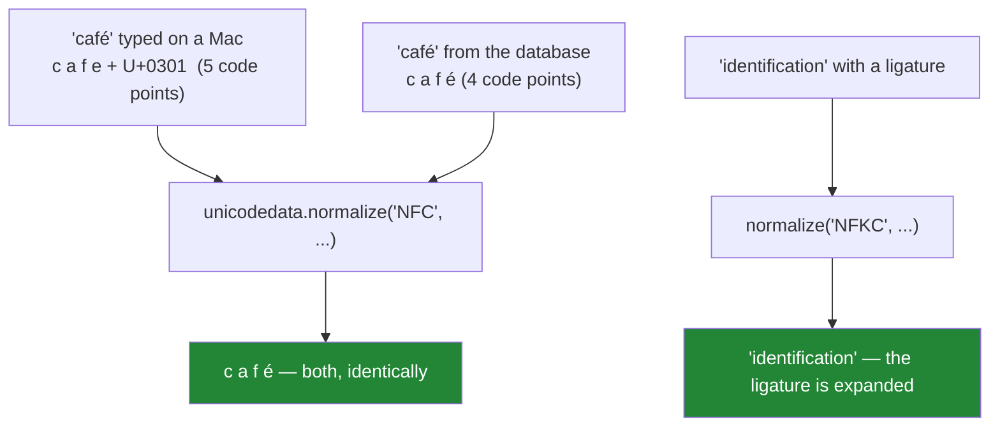

# 4.2 — Unicode normalisation, and the two strings that look identical

## One-line answer

Unicode lets the same visible character be written as different sequences of code points — `é` as one
character or as `e` plus a combining accent — so two strings can render identically, have different
lengths, and compare unequal, and `unicodedata.normalize` is what settles which spelling wins.

---

## The story

A user cannot log in.

Their username is `café_dev`. They type it correctly. The lookup fails. Support asks them to type it
again; it fails again. Somebody eventually copies the username out of the database and out of the login
form and compares them character by character.

```text
database : c a f é _ d e v          -> 8 characters
form     : c a f e ́ _ d e v         -> 9 characters
```

The database has `é` as U+00E9, a single code point. The login form — filled in on a Mac, where the
default input method produces decomposed forms — has `e` (U+0065) followed by U+0301, a **combining
acute accent** that draws itself on top of the previous character. They render identically in every
font. They are not the same string, and no amount of `strip`, `casefold` or whitespace collapsing will
make them equal.

The same week, a different problem: a paper title contains `fi` — the single-character "fi" ligature
that some PDF extractors produce — so a search for `"identification"` misses `"identification"`. And a
third: two Cyrillic characters, `А` and `а`, standing in for Latin `A` and `a` in a title pasted from a
translated page.

Three failures, one subject. **Visual identity is not string identity**, and Unicode provides a defined
answer: normalisation forms.

---

## The idea in plain language

### Two spellings for the same character

Unicode has **composed** and **decomposed** forms for accented characters:

- **Composed (NFC):** `é` is one code point, U+00E9.
- **Decomposed (NFD):** `é` is two — `e` (U+0065) plus the combining acute accent (U+0301).

Both are legitimate, both render identically, and both occur in real data. macOS's filesystem stores
filenames in a decomposed form; most Windows and Linux software produces composed. Copy a filename from
one to the other and you have two strings that look the same and are not.

`len()` differs, indexing differs, slicing can cut between a letter and its accent, and `==` is
`False`.

### The four normalisation forms

`unicodedata.normalize(form, text)` converts between them. There are four, and they differ on two
independent axes:

| Form | Composition | Compatibility |
|---|---|---|
| **NFC** | compose | no |
| **NFD** | decompose | no |
| **NFKC** | compose | **yes** |
| **NFKD** | decompose | **yes** |

**Composition** is the `é`-as-one-or-two question. NFC picks one code point where possible; NFD picks
the base plus combining marks.

**Compatibility** (the `K`) is more aggressive: it also folds characters that are *different* but
serve the same purpose. The `fi` ligature becomes `fi`. The superscript `²` becomes `2`. A full-width
`Ａ` becomes `A`. Roman numeral `Ⅳ` becomes `IV`.

That is **lossy**: `x²` and `x2` become the same string, and if you are indexing mathematics that may
be wrong. It is also exactly what you want for a search key, which is why
[4.1](4.1-the-title-normaliser.md)'s pipeline uses NFKC.



### What normalisation does not fix

**Homoglyphs.** Cyrillic `А` (U+0410) and Latin `A` (U+0041) are *different characters* that happen to
look the same. Unicode does not consider them equivalent — they are not the same letter, they just
share a shape — so no normalisation form merges them.

That is the basis of homograph attacks, where a domain name uses Cyrillic characters to impersonate a
Latin one. The defence is not normalisation but a **script check**: reject or flag a string mixing
scripts unexpectedly, which is what `unicodedata.name()` or a library like `confusable_homoglyphs`
gives you.

**Case.** `casefold()` is separate, and the correct order is normalise **then** casefold — because
casefolding can produce characters that are themselves decomposable.

### Which form to use

- **NFC for storage and transmission.** It is the shortest form, it is what the web recommends (the W3C
  specifies NFC for markup), and it is what most systems produce anyway.
- **NFKC for comparison keys.** More aggressive folding means more things match, which is what a search
  key wants.
- **NFD/NFKD when you need to strip accents** — decompose, then drop every combining mark, which is the
  standard way to turn `café` into `cafe` for a loose match.

The rule that follows: **normalise at the boundary, once, and store the normalised form.** Comparing
two strings that have not both been normalised is the story.

---

## Why Setu needs it

- **[4.1](4.1-the-title-normaliser.md) makes NFKC step 1** of the pipeline, and this part is why it is
  step 1 rather than optional.
- **Day 8's deduplication** (`PY-08`) collapses keys in a set. Two decomposed-versus-composed titles are
  two set members, and the duplicate is never found
  ([Day 8, 3.2](../../../day-08-containers/parts/03-dedup/3.2-order-preserving-dedup.md)).
- **Day 16's file handling** (`PY-19`) meets this directly: a filename written on macOS and read on
  Linux can differ in exactly this way, so `path.exists()` returns `False` for a file you can see.
- **Day 42's databases** (`SQL-`) have their own collations that may or may not normalise, and if the
  database and Python disagree you get rows that are unique in one system and duplicates in the other.
- **Day 155's embeddings and Day 164's chunking** (`RAG-`) tokenize text. A ligature or a decomposed
  accent tokenizes differently, so the same word produces different vectors — which does not raise and
  quietly degrades retrieval.

---

## The mechanism

The story, made visible:

```python
"""Two strings that render identically, with different lengths and different code points."""

import unicodedata

composed = "café"
decomposed = "café"

print(f"composed   : {composed!r}  len={len(composed)}")
print(f"decomposed : {decomposed!r}  len={len(decomposed)}")
print(f"they print the same:  {composed}  |  {decomposed}")
print(f"but equal? {composed == decomposed}")

print()
for label, text in (("composed", composed), ("decomposed", decomposed)):
    points = " ".join(f"U+{ord(ch):04X}" for ch in text)
    names = ", ".join(unicodedata.name(ch, "?") for ch in text)
    print(f"{label:<11} {points}")
    print(f"{'':<11} {names}")

print()
print("after NFC, both agree:")
print("   ", unicodedata.normalize("NFC", composed) == unicodedata.normalize("NFC", decomposed))
print("after NFD, both agree too - a different spelling, still consistent:")
print("   ", unicodedata.normalize("NFD", composed) == unicodedata.normalize("NFD", decomposed))
```

**Line by line:**

- `"café"` and `"café"` — written as escapes so the source file's own encoding cannot
  obscure which is which ([1.3](../01-text/1.3-escapes-and-raw-strings.md)). In a real file they would
  look identical, which is the problem.
- `len` is 4 and 5. **The lengths differ and the rendering does not**, which is the single most useful
  diagnostic: if two visually identical strings have different lengths, this is your bug.
- `unicodedata.name(ch, "?")` — the official Unicode name of a character. `COMBINING ACUTE ACCENT` in
  the decomposed version is unambiguous in a way a hex code point is not, and it is the tool for "what
  on earth is this character".
- The `"?"` default — `name()` raises `ValueError` for characters with no name (control characters,
  unassigned code points), so the default argument keeps the diagnostic from crashing on exactly the
  input you are investigating.
- **Both NFC and NFD make them equal.** Normalisation is about picking *a* consistent spelling, not
  about picking the "right" one — what matters is that both sides of a comparison use the same form.

Compatibility folding, which is the `K`:

```python
"""NFKC also folds characters that are different but serve the same purpose. It is lossy."""

import unicodedata

samples = [
    ("fi ligature", "identification"),
    ("superscript", "x² + 1"),
    ("full-width", "ＡＢＣ"),
    ("roman numeral", "part Ⅳ"),
    ("no-break space", "a b"),
    ("circled digit", "① first"),
]

print(f"{'what':<16} {'raw':<20} {'NFC':<20} {'NFKC':<20}")
for label, text in samples:
    nfc = unicodedata.normalize("NFC", text)
    nfkc = unicodedata.normalize("NFKC", text)
    print(f"{label:<16} {text!r:<20} {nfc!r:<20} {nfkc!r:<20}")

print()
print("the loss is real - decide whether you want it:")
print(f"    'x²' NFKC -> {unicodedata.normalize('NFKC', 'x²')!r}  (now equal to 'x2')")
print(f"    equal after NFKC: {unicodedata.normalize('NFKC', 'x²') == 'x2'}")
```

**Line by line:**

- `"identification"` — U+FB01 is the `fi` ligature, which PDF text extraction produces routinely.
  **NFC leaves it alone; NFKC expands it to `fi`.** Without NFKC, a search for "identification" never
  matches a title extracted from a PDF.
- `"x²"` — a superscript two. NFKC turns it into a plain `2`, so `x²` and `x2` become the same
  string. **This is the loss**, and for a mathematics corpus it is wrong. For a paper-title search key
  it is almost certainly right.
- `"ＡＢＣ"` — full-width Latin letters, common in text from East Asian sources. NFKC
  converts them to ASCII `ABC`, which is exactly what a search key needs.
- `"a b"` — the non-breaking space from
  [2.1](../02-methods/2.1-normalising-strip-and-case.md). **NFKC turns it into an ordinary space**,
  which means the NFKC step in [4.1](4.1-the-title-normaliser.md)'s pipeline already handles several of
  the cases the translate table also handles. Belt and braces, and worth knowing so you understand what
  each step is contributing.
- `"①"` — a circled digit one, which becomes `1`. Compatibility folding is broad, and reading the
  table is the way to develop a sense of what it will and will not touch.

And the two things normalisation does not fix:

```python
"""Homoglyphs are different characters. Accent stripping needs decompose-then-filter."""

import unicodedata

latin = "Attention"
cyrillic = "Аttention"

print(f"latin    : {latin!r}   first char: {unicodedata.name(latin[0])}")
print(f"cyrillic : {cyrillic!r}   first char: {unicodedata.name(cyrillic[0])}")
print(f"they render the same:  {latin}  |  {cyrillic}")
for form in ("NFC", "NFD", "NFKC", "NFKD"):
    same = unicodedata.normalize(form, latin) == unicodedata.normalize(form, cyrillic)
    print(f"    equal after {form}: {same}")


def scripts_used(text: str) -> set[str]:
    """The Unicode script name of each letter - a mixed set is a red flag."""
    return {unicodedata.name(ch).split()[0] for ch in text if ch.isalpha()}


print(f"    scripts in the cyrillic version: {scripts_used(cyrillic)}")


def strip_accents(text: str) -> str:
    """Decompose, then drop every combining mark. The standard accent-stripper."""
    decomposed = unicodedata.normalize("NFD", text)
    return "".join(ch for ch in decomposed if not unicodedata.combining(ch))


for text in ("café", "naïve", "Straße", "Аttention"):
    print(f"    strip_accents({text!r}) = {strip_accents(text)!r}")
```

**Line by line:**

- `"Аttention"` — U+0410 is CYRILLIC CAPITAL LETTER A. It looks exactly like Latin `A` in almost
  every font.
- **All four normalisation forms leave them unequal**, correctly: they are different letters from
  different alphabets, not two spellings of one letter. Unicode's job is to preserve that distinction,
  and normalisation cannot merge them.
- `scripts_used` — a rough script check. `unicodedata.name(ch).split()[0]` gives `LATIN` or `CYRILLIC`
  as the first word of the character's official name. **A title containing both is suspicious**, and
  flagging it is the actual defence against homoglyph confusion. Real implementations use the Unicode
  Script property rather than the name, but this two-line version catches the common case.
- `unicodedata.combining(ch)` — returns a non-zero combining class for a combining mark, `0` otherwise.
  So the comprehension keeps only base characters.
- `strip_accents("café")` → `"cafe"`. **Decompose first is essential**: on the composed form there is
  nothing to filter, because `é` is a single character with no separate accent to drop.
- `strip_accents("Straße")` → `"Straße"` — the `ß` is **not** an accented `s`; it is its own letter with
  no decomposition. Accent stripping does not transliterate, and expecting it to is how you end up with
  a key that works for French and not for German. `casefold()` handles that one
  ([2.1](../02-methods/2.1-normalising-strip-and-case.md)).

---

## When it breaks

**The comparison that should have matched:**

```text
>>> a = "café"
>>> b = "café"
>>> print(a, b)
café café
>>> a == b
False
>>> len(a), len(b)
(4, 5)
```

**What it means.** Two visually identical strings, unequal, with different lengths. **The length
difference is the diagnostic** — when two strings that print the same have different lengths, the
answer is almost always composed versus decomposed. Fix with
`unicodedata.normalize("NFC", ...)` on both.

**The file that exists and does not:**

```text
>>> from pathlib import Path
>>> Path("café.txt").exists()
False
>>> [p.name for p in Path(".").iterdir() if "caf" in p.name]
['café.txt']
>>> [len(p.name) for p in Path(".").iterdir() if "caf" in p.name]
[9]
```

**What it means.** The filename on disk is decomposed (9 characters including `.txt`) and the literal in
your source is composed (8). `exists()` compares byte sequences, so it is `False` for a file you can
see in the listing. This is routine when moving files between macOS and Linux, and the fix is to
normalise both the literal and the names you read from the filesystem — or to avoid non-ASCII filenames
entirely, which is what most projects end up doing.

**Slicing between a letter and its accent:**

```text
>>> text = "café society"
>>> text[:4]
'cafe'
>>> text[:5]
'café'
>>> text[4]
'́'
>>> len(text[4])
1
```

**What it means.** Position 4 is the combining accent **on its own**, with no base character to attach
to — so it renders as a floating mark, often on top of whatever precedes it in the output. Truncating a
decomposed string at an arbitrary character index can split a grapheme. The safe truncation is to
normalise to NFC first, and the fully correct one uses grapheme clusters, which needs a library
(`regex` with `\X`, or `grapheme`) because Python's standard library has no grapheme iterator.

**And the search that misses:**

```text
>>> title = "Automatic Identification of Papers"
>>> "identification" in title.casefold()
False
>>> import unicodedata
>>> "identification" in unicodedata.normalize("NFKC", title).casefold()
True
```

**What it means.** The `fi` ligature from a PDF extractor. `casefold` does not touch it; NFKC expands it.
**No error, just a search that quietly returns nothing** — and the user concludes the paper is not in
the index. This is the single most common real-world reason to use NFKC rather than NFC for a search
key.

---

## In production

**Normalise at the boundary, store the normalised form, and pick one form per purpose.** NFC for stored
text and anything you transmit; NFKC for comparison keys and search indexes. Doing it at ingestion
means every comparison downstream is between two strings in the same form, which is the only way to
make the guarantee hold. Normalising at comparison time instead means every comparison site has to
remember, and one that forgets produces a bug that looks like bad data.

**The index and the query must normalise identically.** This is where search systems go wrong: the
indexing pipeline uses NFKC and the query path does not, so a query with a ligature or a decomposed
accent never matches its own indexed document. The defence is that both paths call the **same
function** — which is the argument for [4.1](4.1-the-title-normaliser.md)'s named normaliser, and it is
the same reasoning that makes Day 162's retrieval evaluation meaningful.

**Compatibility folding is lossy, so make it a deliberate choice per field.** NFKC turning `x²` into
`x2` is right for a title search and wrong for a formula index; turning `½` into `1/2` is right for
text and wrong for a units field. In a system with several kinds of text field, the normalisation form
belongs in the field's schema documentation, not in a shared utility applied everywhere.

**Homoglyph and mixed-script detection is a separate control, and it matters wherever a string
identifies something.** Usernames, domain names, package names, organisation names — anywhere an
attacker benefits from looking like someone else. The rule most systems settle on is to reject
identifiers mixing scripts unless the combination is expected for the locale, and to display a warning
rather than silently allowing it. Normalisation is not the control here; script restriction is.

**What changes at scale.** `unicodedata.normalize` is the most expensive step in a typical text pipeline
— it is a table lookup and a potential rewrite per character — and it is the one you cannot skip.
Python fast-paths pure-ASCII input, so if most of your data is ASCII the cost is small; if it is not,
this dominates. The mitigations are the usual ones: normalise once at ingestion rather than on every
read, and at frame scale use a vectorised implementation. It is also worth knowing that **checking
whether normalisation is needed is cheaper than doing it**: `unicodedata.is_normalized("NFC", text)`
returns quickly for already-normalised text, so `if not is_normalized(...): text = normalize(...)` is a
real optimisation on data that is mostly already clean.

**The review comment a senior engineer leaves.** On a dedup key built without normalisation: *"Add
`unicodedata.normalize('NFKC', ...)` as the first step — we ingest from a PDF extractor that emits `fi`
ligatures and from a Mac client that sends decomposed accents, so we are currently storing those as
distinct papers. Make sure the query path calls the same function; an index normalised differently from
its queries is worse than no normalisation."*

**The interview question.** *"Two strings look identical but compare unequal. What would you check?"*
The first answer is whitespace — a trailing space, a non-breaking space — found with `repr`. The answer
that shows depth is Unicode normalisation: the same visible character can be a single composed code
point or a base plus combining marks, so the strings have different lengths and different bytes;
`unicodedata.normalize` with a consistent form fixes it. The follow-up worth being ready for is *"which
form?"* — NFC for storage, NFKC for comparison keys because it also folds ligatures, full-width forms
and superscripts, at the cost of being lossy — and the sting in the tail is that normalisation does
**not** merge homoglyphs like Cyrillic `А` and Latin `A`, because those are genuinely different
characters, and that needs a script check instead.

---

## Check yourself

```bash
uv run python -c "
import unicodedata as u
a, b = 'café', 'café'
print(f'{a!r} len={len(a)}   {b!r} len={len(b)}   equal={a == b}')
print('names:', [u.name(c) for c in b])
print('after NFC:', u.normalize('NFC', a) == u.normalize('NFC', b))
lig = 'identification'
print('ligature in text  :', 'identification' in lig)
print('after NFKC        :', 'identification' in u.normalize('NFKC', lig))
cyr = 'Аttention'
print('cyrillic A equal? :', all(u.normalize(f, 'Attention') == u.normalize(f, cyr) for f in ('NFC','NFD','NFKC','NFKD')))
print('script of char 0  :', u.name(cyr[0]).split()[0])
"
```

The last two lines are the limit of what normalisation can do for you.

**Answer out loud, without scrolling up:**

> Explain how two strings can render identically and have different lengths. Then say which
> normalisation form you would use for storage and which for a search key, what the `K` adds, and one
> thing normalisation does not fix.

---

**Next:** [4.3 — Methods before regex](4.3-methods-before-regex.md)
