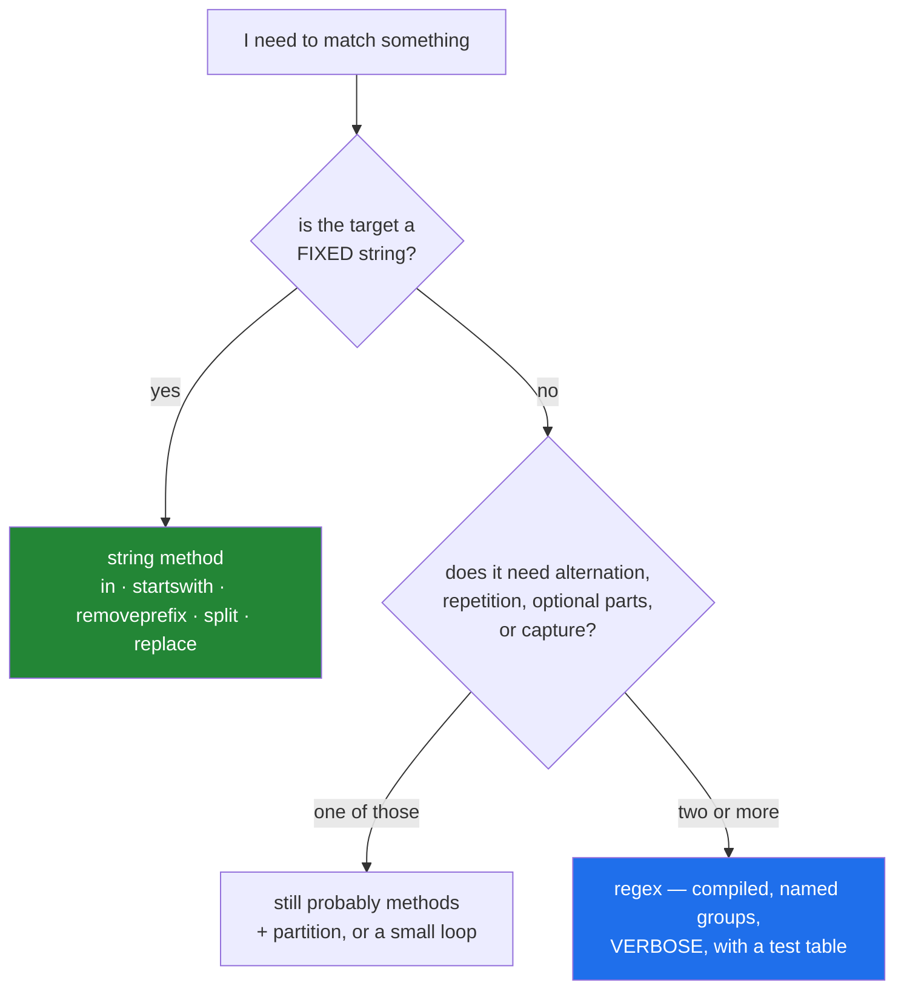

# 4.3 — Methods before regex

## One-line answer

A regular expression is the right tool when the thing you are matching is genuinely a **pattern** —
variable, alternating, repeating — and the wrong one when it is a fixed string, a prefix, a split or a
membership test, all of which string methods do faster and in a form a reviewer can verify at a glance.

---

## The story

A code review of a title cleaner. Six lines, six regular expressions.

```text
title = re.sub(r"^\s+|\s+$", "", title)
title = re.sub(r"\s+", " ", title)
title = re.sub(r"\.$", "", title)
if re.match(r"^https?://", source):
    source = re.sub(r"^https?://", "", source)
if re.search(r"pdf", filename):
    ...
```

Every one of them works. The reviewer replaces all six:

```text
title = title.strip()
title = " ".join(title.split())
title = title.removesuffix(".")
source = source.removeprefix("https://").removeprefix("http://")
if "pdf" in filename:
    ...
```

Shorter, roughly ten times faster on the collapse, and — the reviewer's actual argument — **each line
now says what it does in words the next reader already knows.** `\s+|\s+$` requires reading a pattern
language; `.strip()` does not.

Two weeks later a genuine pattern arrives: extract arXiv identifiers, which look like `2301.00001`,
`2301.00001v3`, `arXiv:2301.00001`, or the older `math.GT/0309136`. Four shapes, optional prefix,
optional version suffix, variable digits.

The team reaches for a regex, and this time it is correct — a chain of `startswith` and `partition`
calls approximating that would be twenty lines nobody could verify. **Neither tool is the answer to
everything, and knowing where the boundary is what makes both usable.**

---

## The idea in plain language

### The boundary

**Use a string method when the target is fixed:**

| The question | The method | The regex people write instead |
|---|---|---|
| Does it contain this text? | `sub in s` | `re.search(sub, s)` |
| Does it start with this? | `s.startswith(p)` | `re.match(rf"^{p}", s)` |
| Remove this prefix | `s.removeprefix(p)` | `re.sub(rf"^{p}", "", s)` |
| Split on this separator | `s.split(sep)` | `re.split(sep, s)` |
| Collapse whitespace | `" ".join(s.split())` | `re.sub(r"\s+", " ", s)` |
| Trim the ends | `s.strip()` | `re.sub(r"^\s+|\s+$", "", s)` |
| Replace fixed text | `s.replace(a, b)` | `re.sub(a, b, s)` |
| Any of several prefixes | `s.startswith((a, b, c))` | `re.match(rf"^({a}|{b}|{c})", s)` |

**Reach for a regex when the target is a pattern:**

- **Alternation over shapes**, not just literals: `\d{4}\.\d{5}(v\d+)?`
- **Repetition with a count**: exactly four digits, one or more letters
- **Optional parts**: a version suffix that may or may not be there
- **Capture groups**: pulling several fields out of one match in one pass
- **Context**: word boundaries, lookahead, "digits not preceded by a letter"

The honest test: **if you can describe the target in one short sentence using the words "or",
"repeated", or "optional", it is a pattern.** If your sentence is "remove the text `https://` from the
front", it is not.

### The four costs of a regex

1. **Readability.** A pattern is a second language embedded in your source, and most readers are less
   fluent in it than in Python. `r"^\s+|\s+$"` takes a moment; `.strip()` takes none.
2. **Speed.** String methods are implemented in C with specialised algorithms. `re` is also C, but it
   has to interpret a pattern. For the fixed cases the difference is typically 3–10×, and on a
   normaliser over millions of rows that is real.
3. **Correctness surface.** `re.sub(rf"^{prefix}", ...)` with a prefix from data is broken the moment
   the prefix contains a regex metacharacter — `re.escape` is required and is routinely forgotten
   ([3.4](../03-formatting/3.4-when-not-to-use-an-f-string.md)).
4. **Catastrophic backtracking.** Some patterns take exponential time on inputs that nearly match.
   `(a+)+$` against a long string of `a`s followed by a `b` will hang. On user-supplied input this is a
   denial-of-service vector with a name — ReDoS — and it is a real class of production incident.

### When a regex genuinely wins

Once the target has two or more of {alternation, repetition, optional parts, capture}, the method-based
version stops being simpler. The arXiv id in the story is the clear case: four shapes, an optional
prefix, an optional version suffix, and three fields to capture. A regex expresses that in one line
that is *hard to read* but *possible to verify against a test table*; the method version is twenty
lines that are individually easy and collectively impossible to hold in your head.

### If you do use one, use it well

- **Always a raw string** ([1.3](../01-text/1.3-escapes-and-raw-strings.md)) — `re.compile(r"\d+")`.
- **Compile it once at module level** if it is used repeatedly. `re` caches compiled patterns, but the
  cache is bounded and a module-level constant also gives the pattern a *name*, which is most of the
  readability problem solved.
- **Use `re.VERBOSE`** for anything non-trivial: it lets you write the pattern across several lines with
  comments.
- **Use named groups** — `(?P<year>\d{4})` — so `match["year"]` reads like a field access rather than
  `match.group(2)`.
- **`re.escape` anything that came from data.**
- **Prefer explicit repetition bounds** (`{1,10}`) over unbounded `+` on untrusted input.



---

## Why Setu needs it

- **[4.1](4.1-the-title-normaliser.md)'s pipeline uses no regex at all**, deliberately — every step is
  a method, and this part is the justification.
- **Principle 2 is from scratch before library**, and the same instinct applies within the standard
  library: reach for the simplest tool that expresses the job, so that when you do reach for the
  powerful one it is because the job needs it.
- **Day 26's pandas** (`PD-`) has `.str.replace(..., regex=True/False)` and `.str.contains(...,
  regex=True)` — the parameter exists precisely because the fixed-string path is much faster, and the
  default has changed between versions, which is a live Principle 4 example.
- **Day 164's chunking** (`RAG-04`) splits documents on paragraph and sentence boundaries. Paragraph
  splitting is `text.split("\n\n")`; sentence splitting genuinely needs a pattern or a library, and
  knowing which is which saves you from writing a bad sentence splitter.
- **Day 150's tokenizers** (`LLM-`) use regex internally for pre-tokenisation, and reading one of those
  patterns is a lot easier once you have written a `VERBOSE` one yourself.

---

## The mechanism

The six review replacements, timed:

```python
"""Six regexes, six methods. Same results, and one is an order of magnitude faster."""

import re
import time

TITLES = ["  Attention  Is\tAll\nYou Need.  "] * 20_000

WS_TRIM = re.compile(r"^\s+|\s+$")
WS_COLLAPSE = re.compile(r"\s+")
TRAILING_DOT = re.compile(r"\.$")


def clean_regex(title: str) -> str:
    title = WS_TRIM.sub("", title)
    title = WS_COLLAPSE.sub(" ", title)
    return TRAILING_DOT.sub("", title)


def clean_methods(title: str) -> str:
    title = " ".join(title.split())
    return title.removesuffix(".")


assert clean_regex(TITLES[0]) == clean_methods(TITLES[0])
print(f"both produce: {clean_methods(TITLES[0])!r}")

for label, fn in (("regex ", clean_regex), ("methods", clean_methods)):
    started = time.perf_counter()
    for title in TITLES:
        fn(title)
    print(f"    {label}: {time.perf_counter() - started:.4f}s")
```

**Line by line:**

- `WS_TRIM = re.compile(...)` at module level — the **fair** comparison. Compiling inside the function
  would make the regex version look worse than it is, and the point is that methods win even against a
  precompiled pattern.
- `clean_methods` is **two** lines to the regex version's three, because `" ".join(split())` does the
  trim and the collapse together — whitespace mode discards the ends
  ([2.2](../02-methods/2.2-split-and-join.md)).
- `assert clean_regex(...) == clean_methods(...)` — **the equivalence check.** Any time you replace one
  implementation with another, this assertion is what makes the replacement safe, and it belongs in the
  test suite rather than in a comment.
- The timing typically shows the method version several times faster. The exact ratio depends on the
  input; the direction does not.
- `TITLES = [...] * 20_000` — the same string 20,000 times. Note this is
  [Day 4, 2.4](../../../day-04-objects/parts/02-containers/2.4-shallow-and-deep-copy.md)'s list
  multiplication, which shares one object — harmless here because strings are immutable, and worth
  noticing because it would not be for a list of lists.

The cases where methods are enough, including the ones people reach for `re` for:

```python
"""Prefixes, splits, membership, and multi-way tests - all without a pattern."""

sources = [
    "https://arxiv.org/abs/1706",
    "http://example.org/p",
    "ftp://old.example/x",
    "arxiv.org/abs/1",
]

print("strip a scheme - chained removeprefix:")
for source in sources:
    print(f"    {source:<32} -> {source.removeprefix('https://').removeprefix('http://')!r}")

print()
print("any of several prefixes - startswith takes a TUPLE:")
for source in sources:
    print(f"    {source:<32} -> {source.startswith(('https://', 'http://'))}")

print()
print("split on the first colon - partition, which cannot raise:")
for header in ("Content-Type: text/html", "malformed-header", "X: a: b"):
    key, sep, value = header.partition(":")
    print(f"    {header!r:<26} key={key!r:<16} found={bool(sep)} value={value.strip()!r}")

print()
print("membership and counting - no pattern needed:")
text = "the paper cites the other paper"
print(f"    'paper' in text : {'paper' in text}")
print(f"    text.count      : {text.count('paper')}")
print(f"    endswith tuple  : {'notes.pdf'.endswith(('.pdf', '.PDF'))}")
```

**Line by line:**

- `.removeprefix('https://').removeprefix('http://')` — chained, and safe because `removeprefix` leaves
  the string alone when the prefix is absent
  ([2.3](../02-methods/2.3-replace-and-removeprefix.md)). Two calls instead of `re.sub(r"^https?://",
  ...)`, and the order matters only in that the longer prefix should go first.
- `source.startswith(('https://', 'http://'))` — a **tuple**, matching any of them. This is the method
  answer to alternation over a fixed set, and it scales to twenty prefixes without becoming
  unreadable.
- `header.partition(":")` — always three values, so no unpacking error and no sentinel to check
  ([2.4](../02-methods/2.4-find-index-and-in.md)). `bool(sep)` is the found/not-found test. Compare
  with `re.match(r"^([^:]+):\s*(.*)$", header)`, which needs a `None` check and two group accesses.
- `"X: a: b".partition(":")` — splits on the **first** colon only, leaving `" a: b"` as the value. That
  is exactly the HTTP header rule, and it falls out of `partition` for free.
- `'notes.pdf'.endswith(('.pdf', '.PDF'))` — case variants as a tuple. For genuinely
  case-insensitive matching, `filename.casefold().endswith('.pdf')` is better still, and neither needs
  `re.IGNORECASE`.

And the case where the regex is right — with every practice from the idea section applied:

```python
"""A genuine pattern: four id shapes, an optional prefix, an optional version. This IS a regex."""

import re

ARXIV_ID = re.compile(
    r"""
    (?:arXiv:)?                 # an optional literal prefix, not captured
    (?P<id>
        \d{4}\.\d{4,5}          # the modern form: 2301.00001
        |
        [a-z-]+(?:\.[A-Z]{2})?  # the legacy form: math.GT/0309136
        /\d{7}
    )
    (?:v(?P<version>\d+))?      # an optional version suffix
    """,
    re.VERBOSE | re.IGNORECASE,
)

candidates = [
    "arXiv:2301.00001",
    "2301.00001v3",
    "see math.GT/0309136 for details",
    "1706.03762",
    "not an id at all",
]

for text in candidates:
    match = ARXIV_ID.search(text)
    if match is None:
        print(f"    {text!r:<34} -> no match")
        continue
    print(f"    {text!r:<34} -> id={match['id']!r} version={match['version']!r}")
```

**Line by line:**

- `re.VERBOSE` — whitespace in the pattern is ignored and `#` starts a comment, so the pattern can be
  laid out and annotated. **This is what makes a non-trivial regex reviewable**, and its absence is why
  most regexes in production are unreviewable.
- `r"""..."""` — a raw triple-quoted string: raw so backslashes are literal
  ([1.3](../01-text/1.3-escapes-and-raw-strings.md)), triple-quoted so it can span lines.
- `(?:arXiv:)?` — a **non-capturing** group (`?:`) that is optional (`?`). Non-capturing because the
  prefix is not a field you want; using a plain group here would shift every subsequent group number,
  which is one reason named groups are better than numbers.
- `(?P<id>...)` — a **named** group. `match["id"]` reads as a field access, and adding a group later
  cannot break existing code the way renumbering does.
- `\d{4}\.\d{4,5}` — exactly four digits, a literal dot (escaped), then four or five digits. **The
  explicit bounds are deliberate**: `\d+` would be unbounded and is the shape that leads to
  catastrophic backtracking on hostile input.
- `|` — alternation between the modern and legacy forms. This is the feature that makes a regex the
  right tool here; expressing it with methods would be a branch per shape.
- `(?:v(?P<version>\d+))?` — the whole version suffix is optional, so `match["version"]` is `None`
  when absent rather than raising. **Checking for `None` on an optional group is required**, and
  forgetting it is the most common bug in regex-using code.
- `if match is None: continue` — the guard. `re.search` returns `None` rather than raising, which is
  the same sentinel design as `find`
  ([2.4](../02-methods/2.4-find-index-and-in.md)) — and `None` is safer than `-1` because using it
  raises immediately.
- `re.IGNORECASE` — so `arxiv:` matches too. Combined with `|` using the bitwise or
  ([Day 5, 1.5](../../../day-05-operators-and-conditionals/parts/01-operators/1.5-bitwise-and-the-mask.md)),
  because flags are bit values.
- **This pattern earns its complexity.** Two shapes, an optional prefix, an optional suffix, and two
  captured fields — the method version would be a page.

---

## When it breaks

**The pattern built from data, unescaped:**

```text
>>> import re
>>> term = "c++"
>>> re.search(f"^{term}", "c++ programming")
Traceback (most recent call last):
  File "<stdin>", line 1, in <module>
re.error: multiple repeat at position 2
```

**What it means.** `+` is a quantifier, and `++` applies one to another. **Here the failure is loud,
which is lucky** — a term of `.*` would compile fine and match everything, which is the silent version.
`re.escape(term)` is required for any pattern built from input
([3.4](../03-formatting/3.4-when-not-to-use-an-f-string.md)), and `startswith` needs no escaping at
all, which is a real argument for the method.

**The optional group that was `None`:**

```text
>>> import re
>>> m = re.search(r"(\d{4})(?:v(\d+))?", "2301")
>>> m.group(1)
'2301'
>>> int(m.group(2))
Traceback (most recent call last):
  File "<stdin>", line 1, in <module>
TypeError: int() argument must be a string, a bytes-like object or a real number, not 'NoneType'
```

**What it means.** An optional group that did not participate in the match is `None`, not `""`. The
error surfaces one line later, at the conversion, which makes it slightly harder to attribute. The fix
is `int(m.group(2) or 1)` — and this is one of the rare cases where the `or` default is correct,
because `None` and "absent" mean the same thing here
([Day 5, 3.1](../../../day-05-operators-and-conditionals/parts/03-the-or-trap/3.1-the-or-default-and-falsy-zero.md)).

**`match` versus `search`:**

```text
>>> import re
>>> re.match(r"\d+", "id 123")
>>> re.search(r"\d+", "id 123")
<re.Match object; span=(3, 6), match='123'>
```

**What it means.** `re.match` anchors at the **start** of the string; `re.search` looks anywhere. The
first returned `None` — printed as nothing by the REPL, which is its own small trap
([3.3](../03-formatting/3.3-repr-and-the-debugging-f-string.md)). Neither is "the right one"; picking
the wrong one gives you a `None` that reads as "no id in this text" when there is one.

**And the pattern that hangs:**

```text
>>> import re, time
>>> pattern = re.compile(r"^(a+)+$")
>>> start = time.perf_counter(); pattern.match("a" * 24 + "b"); time.perf_counter() - start
0.9...
>>> start = time.perf_counter(); pattern.match("a" * 28 + "b"); time.perf_counter() - start
15.6...
```

**What it means.** Catastrophic backtracking. Four more characters, sixteen times the runtime — the
cost is exponential in the input length, because the engine tries every way of dividing the `a`s
between the two quantifiers before concluding there is no match. On user-supplied input this is a
denial of service with a single crafted string. The defences are to avoid nested quantifiers, to bound
repetitions explicitly, to cap input length, and — where a pattern must handle untrusted input — to
use a library with a linear-time engine (`re2`). **A string method cannot do this**, which is the
strongest safety argument for preferring one.

---

## In production

**The default is methods, and a regex is a decision with a reason.** In review, a `re.sub` for a fixed
string draws the same comment every time — replace it with the method — and a genuine pattern draws a
different one: give it a name, compile it at module level, write it `VERBOSE` with comments, and add a
test table. The two are not in tension; the point is that the tool should match the shape of the
problem, and most string problems in a data pipeline are fixed-string problems.

**A regex that matters gets a test table, not a test case.** A pattern is a small program, and a single
example verifies almost nothing. The shape that works is a parametrised list of `(input, expected)`
pairs including the near-misses: an id with no version, one with a version, one embedded in a sentence,
one that should **not** match. Ten rows in a parametrised test
([Day 2, 3.1](../../../day-02-quality-gate/parts/03-pytest/3.1-the-test-that-can-go-red.md)) is what
makes a `VERBOSE` pattern maintainable, because the next person can change it and know immediately
whether they broke something.

**Never build a pattern from untrusted input without `re.escape`, and prefer not to build one at all.**
If you are interpolating a search term into a pattern, ask whether `in`, `startswith` or `casefold` and
a comparison would do — usually yes. Where a real pattern must be built dynamically (an allow-list of
alternatives, say), escape every literal component and assemble with `|`, and bound the total size.

**ReDoS is a real production concern wherever patterns meet user input.** The rules that avoid it:
no nested quantifiers (`(a+)+`, `(a*)*`), no alternation where the branches can match the same text,
explicit upper bounds on repetition, and a length cap on the input. When a service must run
user-supplied patterns — a search feature, a rules engine — Python's `re` is the wrong engine and a
linear-time one is required. This is one of the few places where "use a different library" is the only
correct advice.

**What changes at scale.** For fixed strings, methods are 3–10× faster and the gap widens on longer
inputs because they use specialised search algorithms. For genuine patterns, the compile cost is paid
once if you compile at module level, and the match cost scales linearly for well-written patterns. The
scale trap specific to regex is repeated compilation inside a loop: `re.sub(pattern, ...)` with a
literal pattern is cached, but a pattern built with an f-string inside the loop is a **new pattern
string every iteration**, missing the cache and recompiling every time — which is
[Day 6, 4.1](../../../day-06-loops/parts/04-loop-cost/4.1-the-accidental-quadratic.md)'s "build the
index once" applied to patterns.

**The review comment a senior engineer leaves.** On the six-regex cleaner: *"`re.sub(r'\s+', ' ',
title)` is `' '.join(title.split())` — same result, several times faster, and no pattern to read. Same
for the trim and the trailing dot. Keep the arXiv id one as a regex, but pull it out to a module-level
`re.compile` with `VERBOSE` and named groups, and add a parametrised test with the legacy `math.GT/`
form and a non-matching case."*

**The interview question.** *"When would you use a regular expression?"* The answer that lands is the
boundary: when the target is genuinely a pattern — alternation, repetition, optional parts, or several
fields to capture in one pass — and not when it is a fixed string, because `in`, `startswith`,
`removeprefix`, `split` and `replace` are faster, do not need escaping, and read without a second
language. The follow-up worth being ready for is *"what goes wrong with regexes?"* — a pattern built
from unescaped input, an optional group that is `None` rather than empty, confusing `match` with
`search`, and catastrophic backtracking on nested quantifiers, which on user input is a
denial-of-service vector. Strong answers add the practices that make a necessary regex maintainable:
compile at module level with a name, `re.VERBOSE` with comments, named groups, and a parametrised test
table.

---

## Check yourself

```bash
uv run python -c "
import re, time
t = '  Attention  Is\tAll\nYou Need.  '
r1, r2, r3 = re.compile(r'^\s+|\s+\$'), re.compile(r'\s+'), re.compile(r'\.\$')
def by_regex(s): return r3.sub('', r2.sub(' ', r1.sub('', s)))
def by_methods(s): return ' '.join(s.split()).removesuffix('.')
print('same result:', by_regex(t) == by_methods(t), repr(by_methods(t)))
for label, fn in (('regex  ', by_regex), ('methods', by_methods)):
    s = time.perf_counter()
    for _ in range(50_000): fn(t)
    print(f'  {label}: {time.perf_counter()-s:.4f}s')
try:
    re.search(f'^{\"c++\"}', 'c++')
except re.error as exc:
    print('unescaped term:', exc)
print('escaped       :', bool(re.search(f'^{re.escape(\"c++\")}', 'c++')))
"
```

Both produce the same string. Only one of them needs a second language to read.

**Answer out loud, without scrolling up:**

> Give the test for whether something is a pattern or a fixed string, and name four string methods that
> replace a regex people commonly write. Then name the four costs of a regex, and the three practices
> that make a necessary one maintainable.

---

**Back to the hub:** [Day 7 — Strings: code points, methods, and f-strings](../../LESSON.md)
