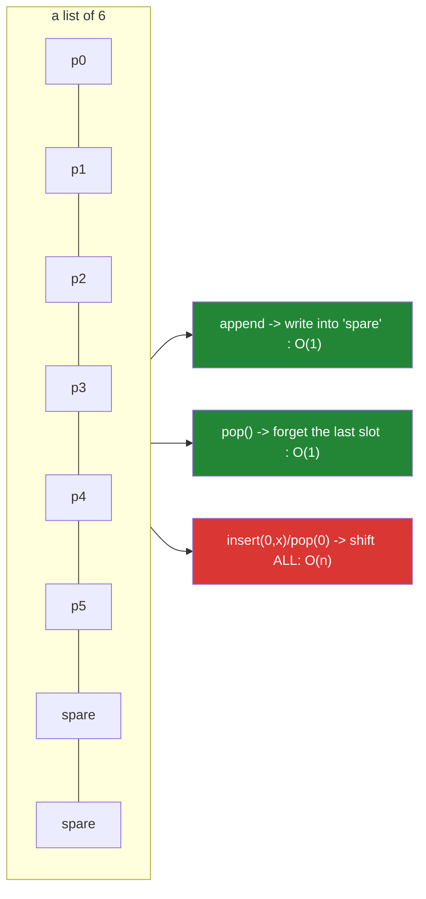

# 1.1 — A list is a dynamic array, and what that costs

## One-line answer

A Python list is a **contiguous array of pointers** with spare capacity at the end — so appending is
effectively free, indexing is instant, and inserting or removing anywhere but the end has to shift
every element after it.

---

## The story

A queue at a counter, with one unusual rule: everybody stands on a painted line, shoulder to
shoulder, and there are no gaps allowed.

Joining the back is easy. You walk up and stand at the end, and nobody else has to do anything.

Leaving the front is not. When the person at the head is served and steps away, there is a gap, and
gaps are not allowed — so **everybody else shuffles forward one place**. With five people in the
queue nobody notices. With two hundred people, the shuffling takes longer than the serving does, and
the queue spends most of its time moving rather than being dealt with.

The queue is not badly designed. It is designed for the thing queues mostly do, which is grow at the
back. It is simply expensive at the other end, and if your job involves the other end you need to
know that before you start.

Here is that queue, written the obvious way:

```text
queue = []
for job in incoming:
    queue.append(job)
while queue:
    job = queue.pop(0)
    process(job)
```

It is correct. On the developer's fifty-job sample it is instant. On the real batch of two hundred
thousand jobs it takes eleven minutes before the **first** job is processed — not to finish, to
*start* — and the whole run takes hours.

`pop(0)` takes the front. A list keeps its items in one solid block, so removing the front means
moving everything else one slot along: 199,999 moves for the first job, 199,998 for the second. Two
hundred thousand jobs is around twenty billion moves.

The fix is one import and one word: `collections.deque` and `popleft()`. Both ends become cheap and
the job finishes in seconds.

The list did nothing wrong. It is a painted line, painted lines are cheap at the back and expensive
at the front, and the whole of this part is learning which operations are which so that the choice is
made on purpose.

---

## The idea in plain language

### What is actually in memory

A Python list is **not** a linked list. It is one contiguous block of memory holding **pointers** —
addresses of the objects, not the objects themselves
([Day 4, 1.1](../../../day-04-objects/parts/01-objects/1.1-identity-type-value.md)).

Two things follow immediately:

- **A list can hold anything, mixed.** Every slot is the same size — a pointer — regardless of what it
  points at. `[1, "a", [2], None]` is four pointers.
- **Indexing is O(1) and exact.** `items[5000]` computes an address and reads it. There is no walking.

The block also has **spare capacity**. When a list of 8 elements fills up, Python does not allocate 9
slots; it allocates roughly 16, so the next several appends need no reallocation. When it does have to
grow, it allocates a block a fixed proportion larger and copies the pointers across.

That growth strategy is what makes `append` **amortised O(1)**: most appends are a single write, and
the occasional expensive copy is spread thinly enough over the cheap ones that the average is
constant. It is not "always fast"; it is "fast on average, with the rare slow one paid for in
advance".

### The cost table, and the one line that explains it



| Operation | Cost | Why |
|---|---|---|
| `items[i]` | **O(1)** | one address computation |
| `items[i] = x` | **O(1)** | one write |
| `len(items)` | **O(1)** | the count is stored |
| `items.append(x)` | **O(1)** amortised | write into spare capacity |
| `items.pop()` | **O(1)** | forget the last slot |
| `items.insert(0, x)` | **O(n)** | shift everything right |
| `items.pop(0)` | **O(n)** | shift everything left |
| `items.remove(x)` | **O(n)** | scan to find it, then shift |
| `x in items` | **O(n)** | scan |
| `items.index(x)` | **O(n)** | scan |
| `items[a:b]` | **O(b-a)** | copies the pointers |
| `items.sort()` | **O(n log n)** | |
| `min` / `max` / `sum` | **O(n)** | |

**One sentence explains almost all of it:** the end of a list is cheap and everything else is a shift
or a scan.

### The two structures that fix the two problems

- **Front operations →** `collections.deque`. A double-ended queue, O(1) at *both* ends, because it is
  a chain of small blocks rather than one. Indexing in the middle becomes O(n), which is the trade,
  and for a queue you never index the middle.
- **Membership tests →** `set` or `dict`. O(1) instead of O(n), which is
  [Day 5, 3.2](../../../day-05-operators-and-conditionals/parts/03-the-or-trap/3.2-in-is-an-operator.md)
  and [2.1](../02-sets-and-dicts/2.1-a-set-is-a-hash-table.md).

Almost every list-performance problem is one of those two.

### Memory: a list of a million integers is not eight megabytes

The list itself is a million pointers — 8 MB on a 64-bit build. **The integers are separate objects**,
each roughly 28 bytes, so the real total is closer to 36 MB. And that is only if the integers are
distinct; small integers are cached and shared
([Day 4, 3.2](../../../day-04-objects/parts/03-identity-trap/3.2-is-versus-equals.md)), so a list of a
million zeros really is about 8 MB.

That indirection is the price of "a list can hold anything". `array.array` and NumPy store the values
themselves, contiguously, with no per-element object — which is 8 MB flat and is why Day 20 exists.

---

## Why Setu needs it

- **[1.2](1.2-slicing-and-the-copy-you-missed.md), next,** is the O(b-a) row: every slice copies.
- **[3.1](../03-dedup/3.1-ten-thousand-ids-timed.md), today,** times the `x in items` row against a
  set — the plan's named example for `PY-08`.
- **[Day 6, 4.1](../../../day-06-loops/parts/04-loop-cost/4.1-the-accidental-quadratic.md)** listed
  these costs; this part is why they are what they are.
- **Day 11's generators** (`PY-11`) exist so you never have to materialise a list you only iterate
  once, which is the memory half of this document.
- **Day 20's NumPy** (`NP-01`) replaces the pointer array with a contiguous array of values, and the
  entire performance argument of that module is the indirection described above.
- **Day 196's context trimming** (`LG-12`) drops messages from the front of a conversation. That is
  `pop(0)` in a loop — the story — and a `deque` is the right structure.

---

## The mechanism

The cost table, measured:

```python
"""The end of a list is cheap. The front is not. Same operation, two ends."""

import time
from collections import deque

N = 100_000


def timed(label: str, fn) -> None:
    started = time.perf_counter()
    fn()
    print(f"    {label:<34} {time.perf_counter() - started:>8.4f}s")


def append_end() -> None:
    items: list[int] = []
    for i in range(N):
        items.append(i)


def insert_front() -> None:
    items: list[int] = []
    for i in range(N):
        items.insert(0, i)


def pop_end() -> None:
    items = list(range(N))
    while items:
        items.pop()


def pop_front() -> None:
    items = list(range(N))
    while items:
        items.pop(0)


def deque_front() -> None:
    items = deque(range(N))
    while items:
        items.popleft()


print(f"n = {N:,}")
timed("list.append (end)", append_end)
timed("list.insert(0, x) (front)", insert_front)
timed("list.pop() (end)", pop_end)
timed("list.pop(0) (front)", pop_front)
timed("deque.popleft() (front)", deque_front)
```

**Line by line:**

- `append_end` and `insert_front` differ only in **which end**. The first writes into spare capacity;
  the second shifts every existing pointer one slot right, every time.
- `pop_end` versus `pop_front` — the story, isolated. The end version forgets a slot; the front version
  moves everything.
- `deque(range(N))` and `popleft()` — the fix. `deque` is a chain of blocks, so removing from the front
  unlinks or advances within a block and touches nothing else.
- **Read the ratios, not the seconds** ([Day 6,
  4.1](../../../day-06-loops/parts/04-loop-cost/4.1-the-accidental-quadratic.md)). The two front-of-list
  rows will be hundreds of times slower than their counterparts, and doubling `N` roughly quadruples
  them while leaving the others alone.
- `items: list[int] = []` — the annotation is needed because an empty literal gives a type checker
  nothing to infer from. It costs nothing at run time (Day 19, `PY-23`).

Growth and spare capacity, made visible:

```python
"""A list over-allocates. Watch its memory grow in jumps, not one slot at a time."""

import sys

items: list[int] = []
previous = sys.getsizeof(items)
print(f"{'len':>5} {'getsizeof':>10} {'grew?':>7}")
print(f"{0:>5} {previous:>10} {'':>7}")

for i in range(1, 40):
    items.append(i)
    size = sys.getsizeof(items)
    if size != previous:
        print(f"{len(items):>5} {size:>10} {'yes':>7}")
        previous = size

print()
print("the pointers are 8 bytes each; the INTEGERS are separate objects:")
million = list(range(1_000_000))
list_bytes = sys.getsizeof(million)
int_bytes = sum(sys.getsizeof(x) for x in million[:1000]) / 1000 * 1_000_000
print(f"    the list itself      : {list_bytes:>12,} bytes")
print(f"    the integers it holds: {int_bytes:>12,.0f} bytes (estimated)")
print(f"    total                : {list_bytes + int_bytes:>12,.0f} bytes")
```

**Line by line:**

- `sys.getsizeof(items)` — the size of the **list object** only: its header plus its array of pointers,
  including the spare capacity. It does **not** include the objects pointed at, which is the point of
  the second half.
- The loop prints only when the size changes, so the output is the growth schedule: sizes jump at 0, 4,
  8, 16, 25, 35… **Not doubling** — CPython grows by about one eighth plus a constant, which is enough
  to make appends amortised O(1) while wasting less memory than doubling.
- `sum(sys.getsizeof(x) for x in million[:1000]) / 1000 * 1_000_000` — a sample of a thousand, averaged
  and scaled. Measuring all million would be slow and would tell you the same thing.
- **The integers outweigh the list roughly four to one.** That indirection is what a list buys you
  (any type, any mix) and what NumPy gives up (one type, contiguous values) in exchange for the memory
  and the speed.
- Note that `list(range(N))` up to 256 would show a much smaller integer total, because small integers
  are cached and shared — so the estimate above is honest only because the values run past that range.

And the queue, both ways, with the fix that is one word:

```python
"""The story: a FIFO queue built on a list versus a deque."""

import time
from collections import deque

JOBS = 50_000


def drain_list() -> int:
    queue = list(range(JOBS))
    processed = 0
    while queue:
        queue.pop(0)
        processed += 1
    return processed


def drain_deque() -> int:
    queue = deque(range(JOBS))
    processed = 0
    while queue:
        queue.popleft()
        processed += 1
    return processed


for label, fn in (("list.pop(0) ", drain_list), ("deque.popleft", drain_deque)):
    started = time.perf_counter()
    processed = fn()
    print(f"{label}: {processed:,} jobs in {time.perf_counter() - started:.4f}s")

print()
print("a deque is a drop-in for a queue, and NOT for random access:")
d = deque(range(10))
d.append(99)
d.appendleft(-1)
print("    ", list(d))
print("    d[0] and d[-1] are O(1):", d[0], d[-1])
print("    d[5] is O(n) - fine occasionally, wrong in a loop")
print("    maxlen gives you a fixed-size sliding window:")
window = deque(maxlen=3)
for value in range(6):
    window.append(value)
    print(f"        after append({value}): {list(window)}")
```

**Line by line:**

- `drain_list` and `drain_deque` are the same six lines with one method name different. **That is the
  whole fix**, and it is why knowing the cost table matters more than knowing clever algorithms.
- `deque.appendleft(-1)` — O(1) at the front, which `list.insert(0, x)` is not.
- `d[5]` — a `deque` has no contiguous array, so indexing the middle walks blocks. **Do not use a deque
  as a general-purpose sequence**; use it where you only touch the ends.
- `deque(maxlen=3)` — a fixed-size window that discards from the other end automatically. This is a
  genuinely useful structure for "the last N events", a rolling average, or
  [Day 196's context trimming](../../../day-06-loops/parts/03-capped-retry/3.1-why-the-cap-comes-first.md)
  where you keep the most recent messages and drop the oldest.
- The `maxlen` loop prints the window sliding — after `append(3)` the `0` is gone, silently and by
  design. **That silence is the trap**: a `maxlen` deque discards without telling you, so if the
  discarded data mattered you will not find out from the structure.

---

## When it breaks

**It does not raise; it gets slower:**

```text
$ python drain_queue.py       # 50k jobs, list.pop(0)
real    0m12.4s
$ python drain_queue.py       # 100k jobs
real    0m49.8s
```

**What it means.** Twice the data, four times the time — the quadratic signature
([Day 6, 4.1](../../../day-06-loops/parts/04-loop-cost/4.1-the-accidental-quadratic.md)). No error, no
warning, and the code is correct. The only diagnostic is the ratio.

**Index out of range:**

```text
>>> items = [1, 2, 3]
>>> items[3]
Traceback (most recent call last):
  File "<stdin>", line 1, in <module>
IndexError: list index out of range
>>> items[3] = 4
Traceback (most recent call last):
  File "<stdin>", line 1, in <module>
IndexError: list assignment index out of range
```

**What it means.** A list does not grow to accommodate an index. Unlike a slice, which clamps
([Day 7, 1.2](../../../day-07-strings/parts/01-text/1.2-indexing-and-slicing.md)), indexing raises —
which is the good behaviour. Note the two different messages for read and write; the second is a
common surprise for people coming from JavaScript, where assigning past the end extends the array.

**Removing something that is not there:**

```text
>>> items = [1, 2, 3]
>>> items.remove(9)
Traceback (most recent call last):
  File "<stdin>", line 1, in <module>
ValueError: list.remove(x): x not in list
>>> items.pop()
3
>>> [].pop()
Traceback (most recent call last):
  File "<stdin>", line 1, in <module>
IndexError: pop from empty list
```

**What it means.** `remove` raises `ValueError` when the value is absent; `pop` raises `IndexError` on
an empty list. Both are the loud outcome, and both are the reason a `while queue:` guard is not
optional — a bare `queue.pop()` in a loop with no emptiness check is a crash waiting for the last
iteration.

**And the memory one, which arrives with no traceback:**

```text
>>> items = [0] * 500_000_000
Killed
```

**What it means.** Four gigabytes of pointers, and the kernel's out-of-memory killer stepped in with no
Python-level error ([Day 6, 4.1](../../../day-06-loops/parts/04-loop-cost/4.1-the-accidental-quadratic.md)).
Note `[0] * n` is the cheap case — one integer object, n pointers to it. `list(range(n))` for the same
n would need the integers too and would die sooner.

---

## In production

**Pick the structure from the operations, not from habit.** The decision is three questions: do you
need order, do you touch the front, and do you test membership. Order plus end-only operations is a
list; order plus both ends is a `deque`; membership is a `set`; membership with a value attached is a
`dict`. Most list-performance incidents are somebody using a list for the second or third case, and the
fix is a one-line change with no other consequences — which is exactly why it is worth catching in
review rather than in production.

**`append` in a loop is fine; almost everything else in a loop is worth a look.** Appending is the one
list mutation that is genuinely cheap, and a comprehension is cheaper still
([Day 9](../../../day-09-comprehensions/parts/01-list-comprehensions/1.1-the-loop-and-the-comprehension.md)).
`insert(0, …)`, `pop(0)`, `remove`, `index` and `in` inside a loop are all linear per pass and
therefore quadratic overall, and grepping a codebase for those five names inside indented blocks finds
most of its accidental quadratics.

**Pre-size when you know the size, and stream when you do not.** `[None] * n` allocates once and avoids
the growth copies, which matters when `n` is large and known. When `n` is *not* known and may be huge,
the answer is not a bigger list — it is a generator, so nothing is materialised at all
([Day 6, 1.1](../../../day-06-loops/parts/01-iteration/1.1-what-a-for-loop-actually-does.md)). The
failure mode of getting this wrong is the OOM kill above, which produces no traceback and is therefore
much harder to diagnose than a slow job.

**What changes at scale is the indirection.** A list of a million numbers is a million pointers plus a
million objects: poor cache locality, four times the memory, and an interpreter dispatch per element
for any arithmetic. NumPy replaces that with a contiguous block of raw values, which is where the
50–200× of [Day 6, 4.2](../../../day-06-loops/parts/04-loop-cost/4.2-the-loop-you-should-not-write.md)
comes from. For homogeneous numeric data at scale, a list is the wrong structure, and knowing *why*
makes Day 20 a decision rather than a rule.

**Under concurrency, individual list operations are atomic and sequences of them are not.** `append`
and `pop` are each safe under CPython's interpreter lock, so a list can serve as a crude thread-safe
stack. `if queue: queue.pop(0)` is **not** safe — another thread can drain it between the check and the
pop. The correct structure is `queue.Queue`, which is built for this and also gives you blocking and
timeouts.

**The review comment a senior engineer leaves.** On the story's loop: *"`pop(0)` shifts the whole list
every iteration, so this is O(n²) — fine on the sample, hours on the real batch. Use
`collections.deque` and `popleft()`; nothing else changes. Worth checking the other queues in this
module for the same shape."*

**The interview question.** *"How is a Python list implemented?"* The answer is a dynamic array of
pointers with over-allocation at the end — not a linked list — which is why indexing and appending are
O(1) and inserting or removing at the front is O(n) because everything after has to shift. The
follow-up that finds experience is *"so what would you use for a queue?"* — `collections.deque`, which
is O(1) at both ends — and the sharpest version of the answer notes that `append` is *amortised* O(1)
rather than always O(1), because the list occasionally reallocates and copies, and that the pointers
mean a list of a million integers costs far more than eight megabytes since the integers are separate
objects, which is the reason NumPy exists.

---

## Check yourself

```bash
uv run python -c "
import time, sys
from collections import deque
N = 50_000
def t(label, fn):
    s = time.perf_counter(); fn(); print(f'{label:<26} {time.perf_counter()-s:.4f}s')
t('list.pop(0)', lambda: [l.pop(0) for l in [list(range(N))] for _ in range(N)])
t('deque.popleft()', lambda: [d.popleft() for d in [deque(range(N))] for _ in range(N)])
items = []
prev = sys.getsizeof(items)
grew = []
for i in range(40):
    items.append(i)
    s = sys.getsizeof(items)
    if s != prev: grew.append(len(items)); prev = s
print('list grew at lengths:', grew)
"
```

The growth points are the spare capacity. The two timings are the story.

**Answer out loud, without scrolling up:**

> Say what a list actually holds in memory, and use it to explain why `append` is O(1) and `pop(0)` is
> O(n). Then name the structure you would use for a queue, and say what it gives up in exchange.

---

**Next:** [1.2 — Slicing, and the copy you did not notice](1.2-slicing-and-the-copy-you-missed.md)
