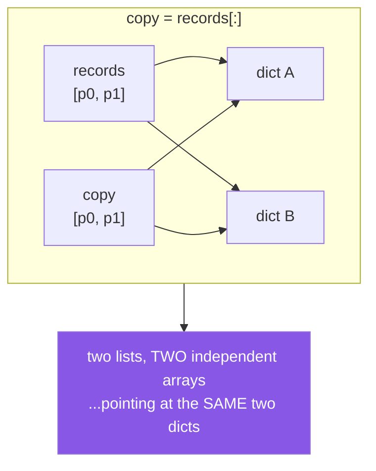

# 1.2 — Slicing, and the copy you did not notice

## One-line answer

Slicing a list builds a **new list holding the same objects** — so the outer list is independent and
the elements are shared, which makes `rows[:]` a safe way to iterate while mutating and an unsafe way
to make a backup.

---

## The story

A pipeline takes a batch of records, keeps the originals for an audit log, and normalises a working
copy.

```text
audit_copy = records[:]
for record in records:
    record["title"] = normalise(record["title"])
write_audit(audit_copy)
```

The audit log contains the **normalised** titles. Every one of them. The "copy" made before the
mutation shows the state after it.

The developer's model was that `[:]` copies the data. It copies the *list* — a new array of pointers —
and both arrays point at the same dictionaries. Mutating a dictionary through one list is visible
through the other, because there is only one dictionary.

Six weeks later the reverse mistake, in the same file. Someone reads
[Day 6, 2.4](../../../day-06-loops/parts/02-control-flow/2.4-mutating-while-iterating.md), learns that
you must not remove from a list you are iterating, and writes `for r in records[:]:` — which is
**correct**, because there the shallowness does not matter: the loop only needs a stable sequence of
positions, and the elements being shared is irrelevant.

Same operation, two situations, one right and one wrong. The rule is not "slicing is dangerous"; it is
**know which level you copied.**

---

## The idea in plain language

### What a slice actually does

`items[a:b]` allocates a new list of `b - a` pointer slots and copies the pointers across
([1.1](1.1-a-list-is-a-dynamic-array.md)). It does not touch the objects those pointers refer to.

So after `copy = items[:]`:

- `copy is items` → `False`. Two lists.
- `copy == items` → `True`. Same contents.
- `copy[0] is items[0]` → `True`. **One object, two references.**
- `copy.append(x)` → `items` unaffected. The lists are independent.
- `copy[0]["k"] = v` → `items[0]` sees it. The elements are not.

That is a **shallow copy**, and `items[:]`, `items.copy()` and `list(items)` are three spellings of
exactly the same thing
([Day 4, 2.4](../../../day-04-objects/parts/02-containers/2.4-shallow-and-deep-copy.md)).



### When shallow is exactly right

- **Iterating while mutating the original** — `for r in records[:]:`. You need a stable sequence of
  positions; the elements can be shared.
- **A list of immutable elements** — strings, numbers, tuples of those. Nothing can be mutated through
  either list, so shallow *is* deep. This is most lists in most code.
- **Handing a caller a list they can append to without affecting yours.**

### When it is not enough

The moment the elements are mutable — dicts, lists, sets, your own classes — and something will mutate
them. That is the story, and the options are:

1. **`copy.deepcopy(records)`** — recursively copies everything. Correct, slow, and handles cycles.
2. **Rebuild explicitly** — `[dict(r) for r in records]` for a list of flat dicts. Faster and clearer
   *when you know the shape*, and wrong if the dicts contain nested mutables.
3. **Do not mutate** — build new records instead of editing them. This is the answer that scales, and
   it is why immutable data and pure functions keep winning
   ([Day 4, 1.2](../../../day-04-objects/parts/01-objects/1.2-names-are-labels.md)).

### Slice assignment: the other half nobody teaches

A slice can be the **target** of an assignment, and this is where lists differ most from strings.

```text
items[1:3] = ["x", "y", "z"]   # replaces 2 elements with 3 - the list changes length
items[1:3] = []                # deletes those elements
items[:] = other               # replaces the CONTENTS in place, keeping the same object
del items[1:3]                 # same as assigning []
```

`items[:] = other` is genuinely useful and genuinely subtle: it mutates the list **in place**, so every
other name bound to that list sees the change ([Day 4,
2.3](../../../day-04-objects/parts/02-containers/2.3-aliasing-two-names-one-object.md)). Compare with
`items = other`, which rebinds the local name and leaves other references pointing at the old list.

That difference is the correct way to "replace a caller's list contents" and the wrong way to "give
myself a new list", and confusing them produces bugs in both directions.

### The extended slice must match

`items[::2] = [...]` requires the right-hand side to have **exactly** as many elements as the slice
selects. A plain `items[a:b] = [...]` does not — it can change the length. The asymmetry exists because
there is no sensible way to grow a strided slice.

### Cost

A slice is `O(b - a)` — proportional to what it copies, not to the list's length. `items[:]` on a
million-element list copies a million pointers: fast per element, and not free. Slicing inside a loop
is one of the quieter accidental quadratics
([Day 6, 4.1](../../../day-06-loops/parts/04-loop-cost/4.1-the-accidental-quadratic.md)).

---

## Why Setu needs it

- **[Day 6, 2.4](../../../day-06-loops/parts/02-control-flow/2.4-mutating-while-iterating.md)** gave
  `for row in rows[:]` as a fix without explaining what the slice does. This is that explanation.
- **[1.4](1.4-unpacking-and-star-rest.md), today,** shows `*rest` unpacking, which also builds a new
  list, and the same sharing applies.
- **[3.2](../03-dedup/3.2-order-preserving-dedup.md), today,** returns a new list rather than mutating
  its input, which is the "do not mutate" option above.
- **Day 20's NumPy** (`NP-01`) makes slicing a **view** rather than a copy — the exact opposite — so
  `arr[1:3] = 0` writes through to the original. That reversal is one of the genuine surprises of that
  module, and it is much less surprising if you know what a list slice does first.
- **Day 26's pandas Copy-on-Write** (`PD-01`) is this question at frame scale: whether an operation
  returned a view or a copy, and the 3.0 change exists because the old answer was "sometimes one,
  sometimes the other".
- **Day 76's train/test split** (`ML-`) slices rows. If the split shares mutable row objects and a
  later step edits them, your test set has been touched by training code — a leak (Principle 8) that
  no code review of the split itself would catch.

---

## The mechanism

The three levels of independence:

```python
"""A slice copies the list and shares the elements. Three assertions prove it."""

records = [
    {"id": "a", "title": "  Attention  "},
    {"id": "b", "title": "BERT"},
]

shallow = records[:]

print("the LISTS are different objects:")
print(f"    shallow is records          : {shallow is records}")
print(f"    shallow == records          : {shallow == records}")
print("the ELEMENTS are the same objects:")
print(f"    shallow[0] is records[0]    : {shallow[0] is records[0]}")

print()
print("so appending to one does not affect the other:")
shallow.append({"id": "c", "title": "New"})
print(f"    len(records)={len(records)}  len(shallow)={len(shallow)}")

print("but mutating an element is visible through both:")
shallow[0]["title"] = "MUTATED"
print(f"    records[0]['title'] = {records[0]['title']!r}   <- the story")

print()
print("three spellings of the same shallow copy:")
for label, made in (
    ("records[:]", records[:]),
    ("records.copy()", records.copy()),
    ("list(records)", list(records)),
):
    print(f"    {label:<16} new list: {made is not records}   shared[0]: {made[0] is records[0]}")
```

**Line by line:**

- `shallow is records` is `False` and `shallow == records` is `True` — two objects with equal contents.
  **This is the pair of facts people collapse into one**, and
  [Day 4, 3.2](../../../day-04-objects/parts/03-identity-trap/3.2-is-versus-equals.md) is why they must
  not.
- `shallow[0] is records[0]` is `True` — **one dictionary, two references.** This single line is the
  whole document.
- `shallow.append(...)` changes only `shallow`, because the arrays are separate.
- `shallow[0]["title"] = "MUTATED"` changes `records[0]` too, because there is one dictionary. **The
  audit log.**
- The three spellings are identical in behaviour. `list(records)` reads best when the source is not
  already a list; `records.copy()` reads best when it is; `records[:]` is the oldest and is what you
  will see in existing code.

The three fixes, with their costs:

```python
"""Deep copy, explicit rebuild, or do not mutate at all."""

import copy
import time


def make_records(n: int) -> list[dict[str, str]]:
    return [{"id": f"id-{i}", "title": f"  Title {i}  "} for i in range(n)]


records = make_records(3)

shallow = records[:]
deep = copy.deepcopy(records)
rebuilt = [dict(r) for r in records]

records[0]["title"] = "CHANGED"
print("after mutating records[0]:")
print(f"    shallow[0] : {shallow[0]['title']!r}   <- sees it")
print(f"    deep[0]    : {deep[0]['title']!r}")
print(f"    rebuilt[0] : {rebuilt[0]['title']!r}")

print()
big = make_records(20_000)
for label, fn in (
    ("shallow  records[:]", lambda: big[:]),
    ("rebuild  [dict(r) ...]", lambda: [dict(r) for r in big]),
    ("deepcopy copy.deepcopy", lambda: copy.deepcopy(big)),
):
    started = time.perf_counter()
    fn()
    print(f"    {label:<26} {time.perf_counter() - started:>8.4f}s")

print()
print("the fourth option - do not mutate, return new records:")
originals = make_records(2)
normalised = [{**r, "title": r["title"].strip()} for r in originals]
print(f"    originals[0]  : {originals[0]['title']!r}")
print(f"    normalised[0] : {normalised[0]['title']!r}")
print(f"    shared object?: {normalised[0] is originals[0]}")
```

**Line by line:**

- `copy.deepcopy(records)` — recursive. It also tracks objects it has already copied, so a structure
  containing a cycle does not loop forever; that bookkeeping is a large part of why it is slow.
- `[dict(r) for r in records]` — a **shallow copy of each element**, which is enough here because the
  dicts hold only strings. On nested data it would be the same bug one level down, which is why the
  rebuild is "faster and clearer when you know the shape" rather than universally better.
- The timings typically show the rebuild several times faster than `deepcopy` and the slice far faster
  than either. **The slice is fast because it copies almost nothing**, which is exactly the property
  that made it wrong for the audit log.
- `[{**r, "title": r["title"].strip()} for r in originals]` — the fourth option. `{**r, ...}` builds a
  **new** dict with the same keys and one changed ([2.6](../02-sets-and-dicts/2.6-merging-dicts.md)),
  so nothing is mutated and no copy is needed. `normalised[0] is originals[0]` is `False` and
  `originals` is untouched.
- **This is the option that scales**, and it is the one to reach for first: a function that returns new
  data has no aliasing question to answer.

Slice assignment, which is the other half:

```python
"""A slice can be the target of an assignment. items[:] = other is not items = other."""

items = [1, 2, 3, 4, 5]

items[1:3] = ["a", "b", "c"]
print("replace 2 with 3, length changes:", items)

items[1:4] = []
print("assigning [] deletes:            ", items)

del items[0:1]
print("del is the same thing:           ", items)

print()
original = [1, 2, 3]
alias = original

original[:] = [9, 9]
print("items[:] = other  (in place):")
print(f"    original={original}  alias={alias}  same object: {original is alias}")

original = [1, 2, 3]
alias = original
original = [9, 9]
print("items = other     (rebinding):")
print(f"    original={original}  alias={alias}  same object: {original is alias}")

print()
strided = [0, 1, 2, 3, 4, 5]
strided[::2] = ["a", "b", "c"]
print("a strided slice must match exactly:", strided)
try:
    strided[::2] = ["x", "y"]
except ValueError as exc:
    print("    mismatched length:", exc)
```

**Line by line:**

- `items[1:3] = ["a", "b", "c"]` — two elements out, three in. **The list changes length**, which
  string slicing cannot do because strings are immutable
  ([Day 7, 1.2](../../../day-07-strings/parts/01-text/1.2-indexing-and-slicing.md)).
- `items[1:4] = []` — deletion by assignment. `del items[1:4]` is the same operation with clearer
  intent, and is what a reviewer prefers.
- `original[:] = [9, 9]` — **mutates the object**, so `alias` sees it and `original is alias` stays
  `True`. This is how you replace a caller's list contents in place.
- `original = [9, 9]` — **rebinds the name**, so `alias` still points at the old list and
  `original is alias` is `False`. Two lines that differ by three characters and do opposite things —
  [Day 4, 1.2](../../../day-04-objects/parts/01-objects/1.2-names-are-labels.md)'s rebind-versus-mutate
  rule, in its sharpest form.
- `strided[::2] = ["x", "y"]` raises `ValueError: attempt to assign sequence of size 2 to extended
  slice of size 3`. A strided slice selects specific positions, and there is no way to grow it — unlike
  a contiguous slice, which can.

---

## When it breaks

**The audit log that was not:**

```text
>>> records = [{"title": "  raw  "}]
>>> backup = records[:]
>>> records[0]["title"] = "normalised"
>>> backup[0]["title"]
'normalised'
>>> backup is records
False
>>> backup[0] is records[0]
True
```

**What it means.** The two lists really are different objects — the first check "proves" the copy
worked. The second check is the one that matters. **When a copy does not behave like a copy, compare
the elements with `is`, not the containers.**

**The strided assignment that will not fit:**

```text
>>> items = [0, 1, 2, 3, 4, 5]
>>> items[::2] = ["a", "b"]
Traceback (most recent call last):
  File "<stdin>", line 1, in <module>
ValueError: attempt to assign sequence of size 2 to extended slice of size 3
```

**What it means.** Three positions selected, two values supplied. The message names both sizes, which
is enough to fix it. Contiguous slices do not have this restriction, and mixing the two mental models
is what produces the surprise.

**Assigning a non-iterable to a slice:**

```text
>>> items = [1, 2, 3]
>>> items[0:1] = 9
Traceback (most recent call last):
  File "<stdin>", line 1, in <module>
TypeError: can only assign an iterable
>>> items[0] = 9
>>> items
[9, 2, 3]
```

**What it means.** A **slice** assignment splices in a sequence; an **index** assignment replaces one
element. The one-character difference between `items[0:1] = x` and `items[0] = x` is a different
operation. And the subtle version: `items[0:1] = "abc"` succeeds and splices in three separate
characters, because a string is iterable — which is almost never what was meant.

**And the shared row that leaked across a split:**

```text
>>> rows = [{"x": 1, "label": 0}, {"x": 2, "label": 1}]
>>> train, test = rows[:1], rows[1:]
>>> for r in train:
...     r["x"] = r["x"] / 10          # "scaling" the training set
...
>>> rows[0]
{'x': 0.1, 'label': 0}
```

**What it means.** The split shared the row objects, so scaling the training set mutated the source
data. Here it happens to affect only the training row — but any step that touches all rows via the
original list, or any second split taken afterwards, is now working on modified data. **This is
Principle 8's leak arriving through aliasing rather than through the obvious "fitted the scaler on
everything" route**, and it produces no error at all.

---

## In production

**Prefer building new data to copying and mutating.** Almost every use of `copy.deepcopy` in a
pipeline is a sign that something upstream mutates when it should transform. A function that takes
records and returns new records has no aliasing question, is trivially testable, parallelises, and
cannot surprise its caller — which is the same argument
[Day 4, 1.2](../../../day-04-objects/parts/01-objects/1.2-names-are-labels.md) makes for pure
functions and the reason immutable-by-default is the direction most of this curriculum leans.

**When you do copy, say which level you meant, in the code.** `list(records)` and
`[dict(r) for r in records]` are visibly different depths; `records[:]` and `copy.deepcopy(records)`
are visibly different depths. What is *not* visible is a `records[:]` where the author believed it was
deep, so a comment or a well-named helper (`snapshot_for_audit(records)`) is worth the line. The test
that pins it is `assert snapshot[0] is not records[0]` — an identity assertion, not an equality one,
because equality passes for both.

**`deepcopy` is slow enough to matter and has real edge cases.** It is typically 10–100× slower than a
targeted rebuild, it cannot copy file handles, sockets, database connections or locks (it will either
raise or silently produce something broken), and it follows every reference — so deep-copying an object
that holds a reference to a large cache copies the cache too. In a hot path it is almost always the
wrong tool; the right tools are a targeted rebuild, a `frozen=True` dataclass, or not mutating.

**What changes at scale.** A slice is `O(k)` where `k` is what it selects, so slicing inside a loop is
a hidden linear cost per pass. The specific shape to watch for is a sliding window written as
`data[i:i+w]` inside a loop over `i` — that is `O(n·w)` and, for a large window, a genuine quadratic. In
NumPy the same expression is a **view** and costs nothing, which is one of the strongest practical
arguments for arrays over lists in numeric code, and is also the reason writing through a NumPy slice
changes the original where writing through a list slice does not.

**Under concurrency, taking a snapshot with `list(shared)` is the standard defence**, and it is exactly
the shallow copy described here. It gives you a stable sequence to iterate while another thread appends
([Day 6, 2.4](../../../day-06-loops/parts/02-control-flow/2.4-mutating-while-iterating.md)) — and it does
**not** protect the elements, so if the other thread mutates a shared dict you are still racing. The
snapshot fixes the container, never the contents.

**The review comment a senior engineer leaves.** On `audit_copy = records[:]`: *"That is a shallow copy
— the dicts are shared, so the normalisation below will change the audit rows too. Either build new
dicts (`[{**r} for r in records]`) or, better, have `normalise` return new records instead of mutating
them; then no copy is needed at all. Add `assert audit[0] is not records[0]` to the test, since
equality will pass either way."*

**The interview question.** *"What does `list_b = list_a[:]` do?"* The answer is that it creates a new
list object containing the same element references — a shallow copy — so appending to one does not
affect the other but mutating an element is visible through both. The follow-up that separates people
is *"when is that a problem?"* — whenever the elements are mutable and something mutates them, the
canonical case being a "backup" of a list of dicts that changes when the originals do — and the fixes
in order of preference: do not mutate and return new objects, rebuild explicitly when you know the
shape, and `copy.deepcopy` when you do not. A strong answer adds that `list_a[:] = other` is a
completely different operation that mutates in place and is visible to every other reference, and that
in NumPy the same slicing syntax gives a view rather than a copy.

---

## Check yourself

```bash
uv run python -c "
records = [{'t': 'raw'}]
backup = records[:]
records[0]['t'] = 'changed'
print('lists differ  :', backup is not records)
print('elements same :', backup[0] is records[0])
print('backup sees it:', backup[0]['t'])
a = [1, 2, 3]; alias = a
a[:] = [9, 9]
print('in place  :', a, alias, a is alias)
a = [1, 2, 3]; alias = a
a = [9, 9]
print('rebinding :', a, alias, a is alias)
s = [0, 1, 2, 3, 4, 5]
try:
    s[::2] = ['x', 'y']
except ValueError as exc:
    print('strided   :', exc)
"
```

Lines 1 and 2 together are the whole idea: different containers, same contents.

**Answer out loud, without scrolling up:**

> Say exactly what `items[:]` copies and what it does not, and give a situation where that is right
> and one where it is wrong. Then say the difference between `items[:] = other` and `items = other`.

---

**Next:** [1.3 — A tuple is not a frozen list, it is a record](1.3-a-tuple-is-a-record.md)
