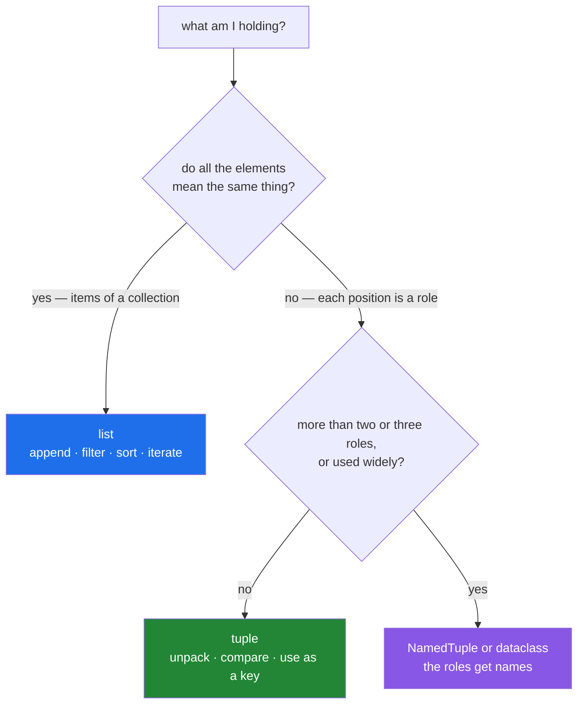

# 1.3 — A tuple is not a frozen list, it is a record

## One-line answer

The difference is not immutability but **meaning**: a list is a variable number of *the same kind of
thing*, a tuple is a fixed number of *different roles* — which is why a coordinate is a tuple and a
to-do list is a list, and why a tuple can be a dictionary key.

---

## The story

Two things written on paper, and they look like the same kind of thing.

The first is a shopping list. Rice, oil, tea. Items get added, items get crossed off, and the whole
point of it is that it changes. Nobody would call a shopping list "wrong" for having four items today
and six tomorrow.

The second is a home address. House number, street, city, postcode. Four lines, and **adding a fifth
line to your address makes no sense at all**. It is not a list that happens to have four things on
it. It is one thing, with four parts, and the parts have fixed jobs.

Both are lines of text on paper. They are completely different kinds of object, and if you write them
both down the same way you have lost the difference — which is fine until something depends on it.

Here is something depending on it. A cache keyed on a search:

```text
cache = {}
def search(terms, year):
    key = terms + [year]          # terms is a list of words
    if key in cache:
        return cache[key]
    ...
```

It raises straight away: `TypeError: unhashable type: 'list'`. The developer's fix is to turn the key
into text — `key = str(terms) + str(year)` — which works, and then a colleague notices the cache is
missing almost every time. `["neural", "attention"]` and `["attention", "neural"]` are the same
search and produce different text, so every reordering is a miss and a wasted call.

The second fix is `key = tuple(sorted(terms)) + (year,)`. The key can now be filed, the word order
stops mattering, and — the part that matters — **it says what it is**: one fixed-shape record of
(sorted words, year), not a shopping list being used as a name badge.

The `TypeError` was the language asking a design question. *Is this a collection of things you will
add to and remove from, or is it one thing with parts?* The first fix answered "collection, squashed
into text". The second answered "one thing with parts", which had been true all along.

---

## The idea in plain language

### The real distinction: homogeneous sequence versus heterogeneous record

The textbook answer is "a tuple is immutable and a list is not". That is true and it is the
*consequence*, not the reason.

The distinction that actually guides design:

| | list | tuple |
|---|---|---|
| Holds | many of **the same kind** of thing | a fixed set of **different roles** |
| Length | varies, and varying is the point | fixed by the meaning |
| Position means | nothing — just order | **everything** — position 0 is the x coordinate |
| Natural operation | append, filter, sort, iterate | unpack, compare, use as a key |
| Reads as | "the papers" | "one (title, year, score)" |

A to-do list is a list: you add items, remove them, and every element is the same kind of thing. A
coordinate is a tuple: it has exactly two elements, the first is x and the second is y, and "appending
to a coordinate" is meaningless.

The test that decides it: **would it make sense to iterate over this and treat every element the
same?** If yes, list. If the elements have different meanings, tuple — or, better still, a
`NamedTuple` or a dataclass, which is a tuple with the roles named.

### What immutability buys

Once you have chosen a tuple for the right reason, three properties follow for free:

1. **Hashable, if its contents are.** So it can be a dict key or a set member
   ([Day 4, 2.5](../../../day-04-objects/parts/02-containers/2.5-hashability.md)) — the story's real
   requirement.
2. **Safe to share.** No caller can change it, so it can be a default argument, a module constant, or
   shared across threads without a copy
   ([Day 4, 3.1](../../../day-04-objects/parts/03-identity-trap/3.1-the-mutable-default-argument.md)).
3. **Slightly smaller and faster.** No spare capacity ([1.1](1.1-a-list-is-a-dynamic-array.md)), and
   Python caches small tuples for reuse. The difference is real and is never the reason to choose one.

### Hashability goes all the way down

`(1, [2])` is a tuple and is **not** hashable, because one of its elements is not. Immutability of the
container is not enough; everything reachable must be immutable
([Day 4, 2.5](../../../day-04-objects/parts/02-containers/2.5-hashability.md)). This is why the story's
key needs `tuple(sorted(terms))` and not `tuple([terms, year])` — the latter still contains a list.

### The comma makes the tuple

The parentheses are usually optional; **the comma is what matters.**

```text
(3)      -> the integer 3
(3,)     -> a one-element tuple
3, 4     -> a two-element tuple, no parentheses needed
()       -> the empty tuple, the one case that needs the parentheses
```

The one-element case catches everybody once, and it catches them again in function calls:
`f(x)` passes one argument; `f((x,))` passes a one-tuple. This is the source of the classic
`execute("...", (value,))` in database code — the parameters are a *sequence*, and a bare `(value)` is
not one.



### When a tuple stops being enough

A tuple's positions are meaningful and **unnamed**, so `row[2]` requires the reader to know the layout.
Beyond about three elements, or the moment the tuple escapes the function that built it,
`typing.NamedTuple` is strictly better: same tuple, same hashability, same unpacking, plus
`row.score` and a `repr` that names the fields.

Day 19 (`PY-23`) covers dataclasses properly; the rule to start with is **two or three positions and
local: tuple. More, or shared: give the fields names.**

---

## Why Setu needs it

- **[1.4](1.4-unpacking-and-star-rest.md), next,** is how you take a record apart, and it reads
  naturally precisely because the positions have meaning.
- **[1.5](1.5-sort-sorted-and-key.md), today,** sorts by a tuple key — `(-score, title)` — which works
  because tuples compare lexicographically
  ([Day 5, 1.3](../../../day-05-operators-and-conditionals/parts/01-operators/1.3-comparison-and-chaining.md)).
- **[2.1](../02-sets-and-dicts/2.1-a-set-is-a-hash-table.md) and
  [2.3](../02-sets-and-dicts/2.3-a-dict-is-ordered-now.md), today,** need hashable keys, and a tuple is
  the standard composite key.
- **Day 12's `Paper` class** (`PY-13`) is a record with named fields — the fourth box in the diagram —
  and knowing why a tuple was not enough is the argument for writing the class.
- **Day 20's NumPy** (`NP-01`) uses tuples for shapes (`arr.shape` is `(3, 4)`) and for
  multi-dimensional indices, both of which are records rather than collections.
- **Day 42's databases** (`SQL-`) return rows as tuples, and parameters are passed as tuples — the
  `(value,)` trap is a real one there
  ([Day 7, 3.4](../../../day-07-strings/parts/03-formatting/3.4-when-not-to-use-an-f-string.md)).

---

## The mechanism

The design distinction, in code that reads differently:

```python
"""Same data, two shapes. Read them aloud and hear which one is which."""

# A LIST: many of the same kind of thing. Order is incidental; length varies.
titles = ["Attention Is All You Need", "BERT", "Deep Residual Learning"]
titles.append("A Fourth Paper")
english_only = [t for t in titles if t.isascii()]
print("list  :", len(titles), "papers, and appending made sense")

# A TUPLE: fixed roles. Position 0 is the title, 1 is the year, 2 is the score.
paper = ("Attention Is All You Need", 2017, 0.98)
title, year, score = paper
print(f"tuple : {title!r} from {year}, scoring {score}")

print()
print("the operations that make sense differ:")
print(f"    titles supports append/sort/filter : {hasattr(titles, 'append')}")
print(f"    paper does not                     : {hasattr(paper, 'append')}")
try:
    paper[1] = 2018
except TypeError as exc:
    print(f"    and cannot be edited               : {exc}")

print()
print("iterating a tuple is legal and usually a design smell:")
for field in paper:
    print(f"        {field!r}  <- what would you even do with these uniformly?")
```

**Line by line:**

- `titles.append("A Fourth Paper")` — appending to a collection of papers is meaningful. Appending to a
  `(title, year, score)` is not, and that asymmetry is the design test.
- `title, year, score = paper` — unpacking by position. **This reads well because the positions have
  fixed meanings**, and it is the operation tuples exist for
  ([1.4](1.4-unpacking-and-star-rest.md)).
- `paper[1] = 2018` raises `TypeError: 'tuple' object does not support item assignment`. The
  immutability is real; it is just not the interesting part.
- The final loop iterates the tuple and prints a string, an int and a float. **Legal, and the fact that
  no uniform operation makes sense is the tell** — if you find yourself iterating a tuple and branching
  on the type of each element, you wanted a class.
- `english_only = [t for t in titles ...]` — filtering a collection is natural. Filtering a record is
  not a thing you would write.

Hashability, which is what the story needed:

```python
"""A tuple can be a key. A list cannot. And a tuple containing a list cannot either."""

cache: dict[tuple, str] = {}

terms = ["neural", "attention"]
year = 2017

try:
    cache[terms + [year]] = "result"
except TypeError as exc:
    print(f"list as a key      : TypeError: {exc}")

string_key_a = str(["neural", "attention"]) + str(year)
string_key_b = str(["attention", "neural"]) + str(year)
print(f"string keys differ : {string_key_a != string_key_b}   <- every reorder is a cache miss")

key_a = (tuple(sorted(["neural", "attention"])), year)
key_b = (tuple(sorted(["attention", "neural"])), year)
cache[key_a] = "result"
print(f"tuple key          : {key_a}")
print(f"order-independent  : {key_a == key_b}, and cache hit: {key_b in cache}")

print()
print("hashability goes all the way down:")
for candidate in ((1, 2), (1, (2, 3)), (1, [2]), (1, {"k": 1}), (1, frozenset({2}))):
    try:
        hash(candidate)
        print(f"    {candidate!r:<22} hashable")
    except TypeError as exc:
        print(f"    {candidate!r:<22} {exc}")
```

**Line by line:**

- `cache[terms + [year]]` — `terms + [year]` builds a **list**, which cannot be hashed. The error is
  the language asking whether this is a collection or a value
  ([Day 4, 2.5](../../../day-04-objects/parts/02-containers/2.5-hashability.md)).
- `str([...])` as a key — works, and is order-sensitive, and is also fragile in a second way: two
  different structures can produce the same string, and the string carries no type information.
  **Stringifying to get hashability is almost always a mistake.**
- `(tuple(sorted(terms)), year)` — a two-element record: the normalised terms, and the year. Sorting
  makes it order-independent; the tuple makes it hashable; nesting the terms as their own tuple keeps
  the two roles distinct rather than flattening them into one sequence.
- `(1, [2])` is unhashable even though it is a tuple. **The container being immutable is not enough** —
  everything reachable must be, which is why `frozenset` exists and why the last row is hashable while
  the dict row is not.
- `dict[tuple, str]` as the annotation — honest about the key being a tuple, and a signal to the next
  reader that this cache is keyed on a composite.

The comma, and the step up to named fields:

```python
"""The comma makes the tuple. And past three fields, name them."""

from typing import NamedTuple

print("the comma, not the parentheses:")
for expr, value in (("(3)", (3)), ("(3,)", (3,)), ("3, 4", (3, 4)), ("()", ())):
    print(f"    {expr:<8} -> {value!r:<10} type={type(value).__name__}")

print()
print("the one-element trap in a function call:")


def takes_a_sequence(values) -> str:
    return f"received {len(values)} item(s): {values!r}"


print("    ", takes_a_sequence((5,)))
try:
    print("    ", takes_a_sequence(5))
except TypeError as exc:
    print(f"     bare 5: TypeError: {exc}")


class Paper(NamedTuple):
    title: str
    year: int
    score: float


plain = ("Attention Is All You Need", 2017, 0.98)
named = Paper("Attention Is All You Need", 2017, 0.98)

print()
print(f"plain tuple : {plain!r}")
print(f"named tuple : {named!r}")
print(f"    by position : {named[1]}   by name: {named.year}")
print(f"    still a tuple: {isinstance(named, tuple)}, still hashable: {hash(named) is not None}")
print(f"    still unpacks: {[*named][:2]}")
print(f"    equal to the plain one: {named == plain}")
```

**Line by line:**

- `(3)` is the integer `3` — parentheses are grouping, not tuple syntax. `(3,)` is the one-tuple. **This
  is the trap behind every `cursor.execute(sql, (value,))`**, and forgetting the comma there gives a
  confusing error from the database driver rather than from Python.
- `takes_a_sequence(5)` raises `TypeError: object of type 'int' has no len()`. The error is one level
  away from the mistake, which is what makes it take a minute to see.
- `class Paper(NamedTuple)` — three named fields. It **is** a tuple: `isinstance(named, tuple)` is
  `True`, it is hashable, it unpacks, and it compares equal to the plain tuple with the same values.
- `named.year` versus `named[1]` — both work, and only one of them is readable in code somebody else
  will maintain. **`row[2]` is where tuples stop paying for themselves.**
- `named == plain` is `True` — a `NamedTuple` is a drop-in replacement, so upgrading an existing tuple
  to a named one does not break comparisons, unpacking or dict keys. That makes it a very low-risk
  refactor, which is why it is the default advice past three fields.
- `hash(named) is not None` — a slightly silly assertion (a hash is an int, never `None`), written this
  way so the line reads as "hashing works" rather than printing a machine-specific number.

---

## When it breaks

**The unhashable key:**

```text
>>> cache = {}
>>> cache[["a", "b"]] = 1
Traceback (most recent call last):
  File "<stdin>", line 1, in <module>
TypeError: unhashable type: 'list'
>>> cache[("a", "b")] = 1
>>> cache
{('a', 'b'): 1}
```

**What it means.** A dict locates a key by a number derived from its value, and that number must never
change while the key is stored ([Day 4,
2.5](../../../day-04-objects/parts/02-containers/2.5-hashability.md)). A list can change, so it is
refused. **The error is a design prompt**, and the right response is usually a tuple, not a
stringified list.

**The tuple that contains a list:**

```text
>>> hash((1, [2]))
Traceback (most recent call last):
  File "<stdin>", line 1, in <module>
TypeError: unhashable type: 'list'
```

**What it means.** The message names `list`, not `tuple` — it is complaining about the *element*.
Immutability has to go all the way down, and the fix is to convert the inner list too:
`(1, tuple([2]))`, or `frozenset` if order does not matter.

**The missing comma:**

```text
>>> import sqlite3
>>> c = sqlite3.connect(":memory:")
>>> c.execute("CREATE TABLE t (a)")
>>> c.execute("INSERT INTO t VALUES (?)", ("x"))
Traceback (most recent call last):
  File "<stdin>", line 1, in <module>
sqlite3.ProgrammingError: Incorrect number of bindings supplied. The current statement uses 1, and there are 2 supplied.
```

**What it means.** `("x")` is the **string** `"x"`, and a string is a sequence of one-character
strings — so the driver saw two bindings. The error comes from the database layer and mentions
nothing about tuples, which is what makes it take a moment. `("x",)` is the fix, and this exact
mistake is common enough that it is worth recognising the message.

**And the modification that is not one:**

```text
>>> paper = ("Attention", 2017, [0.9, 0.8])
>>> paper[1] = 2018
Traceback (most recent call last):
  File "<stdin>", line 1, in <module>
TypeError: 'tuple' object does not support item assignment
>>> paper[2].append(0.7)
>>> paper
('Attention', 2017, [0.9, 0.8, 0.7])
```

**What it means.** The tuple is immutable and its **contents** need not be. Rebinding a slot is
refused; mutating an object the tuple points at is not, because the tuple's own pointers never changed.
This is
[Day 4, 2.2](../../../day-04-objects/parts/02-containers/2.2-what-in-place-means.md)'s rebind-versus-mutate
distinction, and it is exactly why the tuple in that state is unhashable.

---

## In production

**Choose by meaning and the properties follow.** A reviewer reading `tuple` expects a fixed-shape
record and reads `list` as a collection, so using the wrong one costs every future reader a moment of
recalibration even when the code works. The most common real error is a tuple used as a growable
sequence via repeated `t = t + (x,)`, which is quadratic
([Day 6, 4.1](../../../day-06-loops/parts/04-loop-cost/4.1-the-accidental-quadratic.md)) as well as
semantically wrong — build a list and convert once at the end if a tuple is genuinely needed.

**Past three fields, name them, and prefer `NamedTuple` for the migration.** `row[4]` in a codebase is
a maintenance liability: it breaks silently when the shape changes, it tells the reader nothing, and it
cannot be searched for. `NamedTuple` costs three lines, keeps every tuple behaviour (hashing, equality,
unpacking, comparison), and can be introduced without touching call sites — which makes it the safest
refactor available. A frozen dataclass is the next step up when you want methods and validation
(Day 19, `PY-23`).

**Composite keys should be tuples of normalised parts, and the normalisation is the design.** The
story's key is `(tuple(sorted(terms)), year)`: sorted because order should not matter, tupled because
it must be hashable, nested because the terms are one role and the year is another. Getting that shape
right is worth more than the data structure — a cache keyed on unnormalised input has a hit rate
nobody can explain, which is
[Day 7, 4.1](../../../day-07-strings/parts/04-normalising/4.1-the-title-normaliser.md)'s argument
arriving in a different form.

**What changes at scale.** Tuples are marginally smaller than lists (no spare capacity) and small ones
are cached and reused by the interpreter, so a program creating millions of short tuples is doing less
allocation than the equivalent with lists. Neither effect justifies choosing a tuple; what does matter
at scale is that tuple-keyed dictionaries hash the whole tuple on every lookup, so a key containing a
long sequence is a long hash — and if the key is a hundred sorted terms, hashing it is not free.
Where that bites, hash the normalised key once into a short string or integer and use that.

**Immutability is what makes a tuple safe to share, and that matters most under concurrency and in
defaults.** A tuple as a module-level constant, a default argument, or a value passed between threads
needs no copy and cannot be mutated by anyone
([Day 4, 3.1](../../../day-04-objects/parts/03-identity-trap/3.1-the-mutable-default-argument.md)) —
unless it contains something mutable, at which point the guarantee is void and the object is also
unhashable, which is the language telling you the same thing twice.

**The review comment a senior engineer leaves.** On `key = str(terms) + str(year)`: *"Use
`(tuple(sorted(terms)), year)` — stringifying loses type information and makes the key order-sensitive,
so we are missing the cache on every reordering of the same query. And this cache is keyed on
user-supplied terms, so normalise them first."*

**The interview question.** *"When would you use a tuple instead of a list?"* Saying "when I do not want
it to change" is the shallow answer. The one that lands: a list holds a variable number of the same
kind of thing and a tuple holds a fixed number of different roles — a to-do list versus a coordinate —
so the choice is about meaning, and immutability is what that meaning buys you: hashability, so it can
be a dict key or set member, and safety to share. The follow-ups worth having ready are that a tuple
containing a list is still unhashable because immutability must go all the way down, that the comma
rather than the parentheses makes the tuple (`(3)` is an integer), and that past three fields a
`NamedTuple` is strictly better because it keeps every tuple property and gives the positions names.

---

## Check yourself

```bash
uv run python -c "
for expr, v in (('(3)', (3)), ('(3,)', (3,)), ('3, 4', (3, 4)), ('()', ())):
    print(f'{expr:<7} -> {v!r:<8} {type(v).__name__}')
for c in ((1, 2), (1, (2, 3)), (1, [2]), (1, frozenset({2}))):
    try:
        hash(c); print(f'{c!r:<18} hashable')
    except TypeError as exc:
        print(f'{c!r:<18} {exc}')
t = ('a', 2017, [0.9])
try:
    t[1] = 2018
except TypeError as exc:
    print('rebind slot :', exc)
t[2].append(0.8)
print('mutate inside:', t)
"
```

The last two lines together are why a tuple containing a list is unhashable.

**Answer out loud, without scrolling up:**

> Give the distinction between a list and a tuple in terms of *meaning* rather than mutability, with an
> example of each. Then say what immutability buys you, and why `(1, [2])` cannot be a dict key.

---

**Next:** [1.4 — Unpacking, `*rest`, and the swap](1.4-unpacking-and-star-rest.md)
